Introducción a la ISO 21500
===========================

La norma ISO 21500 es un estándar de carácter internacional que ofrece lineamientos genéricos de conceptos y procesos sobre gestión de proyectos.

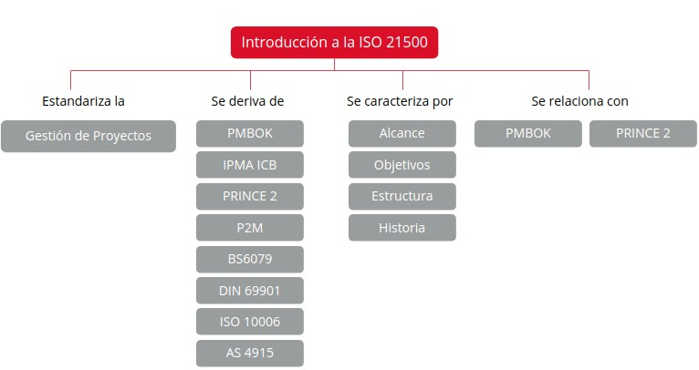

   Mapa conceptual ISO 21500

1. Conceptos previos de normalización y estandarización
*******************************************************

Según AENOR, existen una serie de conceptos en la dirección y gestión de proyectos que son aplicables a la mayoría de casos:

- La **gobernanza** del proyecto.
- El **entorno del proyecto**: factores internos y externos a la organización, gestión de cartera y de programa de proyectos.
- La distinción entre **operaciones y proyectos**.
- El **ciclo de vida y las restricciones** del proyecto.
- Las **competencias** del personal del proyecto.
- La relación entre la **organización y la estrategia** de los proyectos.
- La **identificación de las partes interesadas** y la organización del proyecto.

1.1. Proyecto y gestión de proyectos
++++++++++++++++++++++++++++++++++++

.. note::  Según la ISO 10006, un **proyecto** es un conjunto único de procesos que consiste en actividades coordinadas y controladas con fechas de inicio y fin, llevado a cabo para lograr un objetivo.

Se trata de un esfuerto temporal (no necesariamente de corta duración) que se realiza para crear un producto, servicio o resultado único. La naturaleza temporal de los proyectos **indica un principio y un final definidos**.

El **final de un proyecto** se alcanza cuando:

- Se han logrado los objetivos.
- No se han cumplido los objetivos o existe alguna imposibilidad para cumplirlos.
- Ya no existe la necesidad que dio origen al proyecto.

La decisión de terminar un proyecto **requiere aprobación y autorización** por parte de una autoridad competente.

.. note::  La **gestión de proyectos** es la aplicación de métodos, herramientas, técnicas y competencias a las actividades del proyecto para cumplir con los requisitos del mismo. Se logra mediante la aplicación e integración adecuadas de los procesos de dirección de proyectos identificados para el proyecto.

Gestionar y dirigir un proyecto incluye las siguientes tareas:

- Identificar los requisitos del proyecto.
- Abordar las diversas necesidades, inquietudes y expectativas de las partes interesadas.
- Establecer y manatener una comunicación activa con las personas interesadas.
- Gestionar los recursos.
- Equilibrar las restricciones contrapuestas del proyecto que incluyen el alcance, el cronograma, coste, calidad, recursos y riesgos.

Las **circunstancias del proyecto** influirán en cómo se implementa cada proceso de la dirección de proyectos y cómo se priorizan las restricciones del proyecto.

1.2. Relaciones entre los conceptos de gestión de proyectos
+++++++++++++++++++++++++++++++++++++++++++++++++++++++++++

En la gestión de proyectos se identifican una serie de conceptos relacionados entre sí:

- **Estrategias**: identifican las oportunidades.
- **Oportunidades**: son evaluadas y capturadas en un caso de negocios. Las seleccionadas pueden dar lugar a proyectos que proporcionan entregables.
- **Entregables**: se pueden utilizar para obtener beneficios.
- **Beneficios**: pueden ser la entrada para la estrategia.

1.3. Entorno del proyecto
+++++++++++++++++++++++++

El entorno del proyecto hace referencia a la gestion de:

- **Portafolios de proyectos**: conjunto de proyectos, programas y otras actividades, agrupados para facilitar su gestión eficaz para el logro de las metas estratéticas.
- **Programas**: actividades centralizadas y coordinadas para el logro de las metas.

2. Introducción a la norma UNE-ISO 21500:2013
*********************************************

.. note:: La UNE-ISO 21500:2013 "Directrices para la dirección y gestión de proyectos" es un estándar que proporciona lineamientos genéricos de conceptos y procesos sobre gestión y dirección de proyectos. Se trata de una traducción de la norma internacional ISO 21500:2012. Fue publicada por AENOR en marzo del 2013.

Esta norma es **aplicable a cualquier tipo de organización** independientemente del tamaño y sector del proyecto y se caracteriza por **universal, flexible, integradora y sencilla**. Las siglas UNE hacen referencia a "Una Norma Española", mientras que ISO atiende a la "Organización Internacional de Normalización".

La elaboración de la norma se ha organizado en 3 grupos de trabajo, cada uno encargado de dessarrollar diferentes partes:

- **Terminología**
- **Procesos**
- **Guía informática**

Durante la elaboración se han considerado los siguientes estándares:

- PMBOK
- BS 6079
- ICB
- DIN 69901
- PRINCE2
- ISO 10006
- P2M
- AS 4915

Entre las **razones para su elaboración** destacan:

- La creciente oferta internacional de proyectos.
- La armonización de estándares existentes.
- El establecimiento de principios y procedimientos comunes de gestión de proyectos.

Esta norma **se puede utilizar como**:

- Lenguaje común en la dirección y gestión de proyectos.
- Referencia en una auditoría.
- Lista de verificación para demostrar los conocimientos y habilidades de los directores de proyectos.
- Referencia común entre los diferentes métodos, prácticas y modelos. 

En cuanto a su **alcance**, esta norma está dirigida a:

- **Patrocinadores de proyectos**: para ayudarles a dar el apoyo y la orientación adecuada a las personas que dirigen los proyectos, a los equipos de dirección y a los equipis de proyecto.
- **Alta dirección**: de manera que comprendan mejor los principios y la práctica de la dirección y gestión de proyectos.
- **Engargados de la dirección de proyectos**: equipos de dirección de proyectos y equipos de proyecto. Tienen una base común para comparar sus normas y prácticas de proyectos con las de otros.
- **Redactores de normas**: como base para el desarrollo de normas sobre gestión de proyectos, de forma que sean consistentes unas con otras.

2.1. Objeto y campo de aplicación de la norma
+++++++++++++++++++++++++++++++++++++++++++++

La norma ISO 21500 tiene como objetivos:

- Facilitar la **orientación** para la dirección y gestión de proyectos, de manera que pueda ser usada por cualquier tipo de organización, ya sea pública, privada u organización civil sin ánimo de lucro, para cualquier tipo de proyecto con independencia de su complejidad, tamaño o duración.
- Proporcionar una **descripción de alto nivel** de conceptos y procesos que se considera que forman pate de las buenas prácticas en dirección de proyectos, definiendo un lenguaje global al respecto.
- **Orientar y facilitar los procesos para alinear** su estrategia con los objetivos y los proyectos que inicia para alcanzarlos.

La **importancia** de esta norma reside en:

- Encerrar diferentes **marcos de referencia** existentes en la actualidad, definiendo un lenguaje universal en gestión de proyectos.
- Describir a grandes rasgos los conceptos que se consideran **buenas prácticas** en gestión de proyectos.
- Contribuir a la **implantación de proyectos** en cualquier organización que trabaja por proyectos, con independencia de su sector y tamaño.

2.2. Estructura de la norma
+++++++++++++++++++++++++++

La ISO 21500 se divide en 4 partes:

- **Términos y definiciones**: presenta los términos y sus definiciones en relación con la dirección y gestión de proyectos.
- **Procesos de dirección y gestión de proyectos**: especifica la aplicación de los procesos de la dirección y gestión de proyectos. También presenta y delimita los grupos de procesos y grupos de materias de la ISO 21500, así como los procesos que los conforman.
- **Alcance**: delimita el campo y objeto de aplicación de la norma internacional ISO 21500.
- **Conceptos de la dirección y gestión de proyectos**: presenta una descripción de los términos relacionados con la dirección y gestión de proyectos que juegan un papel importante durante la ejecución de la mayoría de los proyectos.

La norma se estructura en 39 procesos que se pueden clasificar atendiendo a:

- **10 grupos de materias**:
	.. hlist::
	    :columns: 2

	    * Integración
	    * Coste
	    * Partes interesadas
	    * Riesgo
	    * Alcance
	    * Calidad
	    * Recursos
	    * Adquisiciones
	    * Tiempo
	    * Comunicación
	
- :**5 grupos de procesos**:

		- **Inicio**: define el propósito del proyecto o fase. Espefica objetivos y, en definitiva, inicia el trabajo del proyecto.
		- **Planificación**: se establecen las líneas de base contra las cuales se debería realizar la implementación y se debería medir el desempeño del proyecto.
		- **Implementación**: se llevan a cabo las actividades de gestión de proyecto, dando soporte a la producción de los entregables de acuerdo con los planes de proyecto.
		- **Control**: se monitoriza, mide y controla el desempeño del proyecto contra el plan de proyecto para tomar acciones correctivas y preventavas y para que se puedan realiar las solicitudes de camios cuando sea necesario.
		- **Cierre**: se establece formalmente que el proyecto o fase del mismo ha finalizado y se proporcionan las lecciones aprendidas.

2.3. Historia, contexto actual y futuro de la norma
+++++++++++++++++++++++++++++++++++++++++++++++++++

.. note:: La ISO es un organismo normativo internacional compuesto por representates de varias organizaciones de estándares nacionales.

Fue fundada el 23 de febrero de 1947 y tiene como **objetivo** promover normas a nivel mundial sobre propiedad, industria y comercio. Su sede se encuentra en Ginebra, Suiza.

En 2007 se formó un comité técnico para la elaboración de la norma ISO 21500. El propósito era generar una guía que sirviese como base para la generación de las normas nacionales de cada país.

La creación de la norma viene dada por la creciente **necesidad de establecer**:

- **Armonización**: para llevar a cabo proyectos a nivel global siempre han existido multitud de metodologías, lineamientos y prácticas. Hoy en día se encuentran, además, cuantiosos estándares de gestión de proyectos, de prestigio y reconocimiento global, por esta razón surge la necesidad de armonización.
- **Prácticas comunes**: La globalización prograsiva de los mercados da lugar a bienes, servicios y conocimientos transables. Demanda de clientes para ejecutar sus proyectos de manera exitosa en plazos y costes cada vez menores. 

Por todo ello, es necesario el establecimiento de lenguaje, principios, procedimientos y prácticas comunes de gestión de proyectos, que puedan ser aplicables de manera estandarizada a nivel global a cualquier tipo de proyecto u organización.

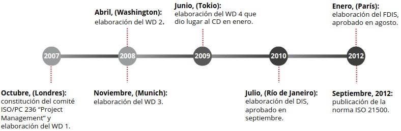

.. note:: La norma ISO 21500 se publica en septiembre de 2012, pero su homónima española lo hace en marzo de 2013.

En cuanto al **futuro de la norma**, se toman como tareas inmediatas su **mantenimiento y mejora**, además de la emisión de una futura norma de programas y portafolios de proyectos, para los cueles ISO ha crado el **Comité ISO TC/258**. El propósito de este comie es el de elaborar una norma relativa a la gestión de portafolios y programas y una posible guía de implementación.

3. Relación de la norma con otros estándares: PMBOK y PRINCE2
*************************************************************

Hoy en día existe una gran variedad de metodologías, estándares y métodos de carácter nacional e internacional focalizados en la gerencia de proyectos. Estos presentan diversas particularidades en cuanto a:

- **Entorno de aplicación**
- **Composición**
- **Magnitud**
- **Tipo de proyecto**
- **Organización**
- **Costumbres culturales**
- **Características de ubicación geográfica**

3.1. Relación con PMBOK
+++++++++++++++++++++++

+-----------------------+-------------------+
| 10 Materias ISO 21500 | 10 Áreas PMBOK    |
+-----------------------+-------------------+
| - Integración         | - Integración     |
| - Partes interesadas  | - Interesados     |
| - Alcance             | - Alcance         |
| - Recursos            | - Recursos Humanos|
| - Tiempo              | - Tiempo          |
| - Costes              | - Costes          |
| - Riesgos             | - Riesgos         |
| - Caliad              | - Calidad         |
| - Adquisiciones       | - Adquisiciones   |
| - Comunicaciones      | - Comunicaciones  |
+-----------------------+-------------------+

+--------------------------------+----------------------+
| 5 Grupos de procesos ISO 21500 | PMBOK                |
+--------------------------------+----------------------+
| - Inicio                       | - Inicio             |
| - Planificación                | - Planificación      |
| - Implementación               | - Ejecución          |
| - Control                      | - Monitoreo y control|
| - Cierre                       | - Cierre             |
+--------------------------------+----------------------+

.. note:: La norma ISO 21500 se estructura en 39 procesos, mientras que el estándar PMBOK lo hace en 49.

Si se atiende a las **características de los procesos**, la ISO 21500 describe los procesos y establece entradas y salidas, pero no constituye teécticas y salidas. Sin embargo, PMBOK sí.

Con respecto a su **alcance**, si bien la norma **ISO 21500 está dirigida fundamentalmente a personas de alta dirección y patrocinadoras**, el estándar **PMBOK se enfoca más en el personal a cargo de la dirección de proyectos y las personas que componen los equipos de proyectos**.

.. note:: El estándar PMBOK complementa a la norma ISO 21500, ya que esta proporciona técnicas y herramientas y aporta entregables.

3.2. Relación con PRINCE2
+++++++++++++++++++++++++

+---------------------------------------------------------------------------------------------+------------------------------------------------------------------------------------------------+
| ISO 21500                                                                                   | PRINCE2                                                                                        |
+---------------------------------------------------------------------------------------------+------------------------------------------------------------------------------------------------+
| - Es un estándar                                                                            | - Es un método                                                                                 |
| - Define el "qué" de forma prescriptiva                                                     | - Define el "cómo" de forma descriptiva                                                        |
| - Incluye los apartados de adquisiciones y de las competencias de la dirección del proyecto | - No incluye los apartados de adquisiciones y de las competencias de la dirección del proyecto |
| - Gestiona el proyecto desde el punto de vista de la organización ejecutable                | - Gestiona el proyecto desde el punto de vista del cliente                                     |
+---------------------------------------------------------------------------------------------+------------------------------------------------------------------------------------------------+

Además, al contrario que PMBOK que complementa la ISO 21500, PRINCE2 ha tenido poca influencia en dicha norma. No obstante, lato la ISO como el método comparten gran parte de los principios, actividades y prácticas de la gestión de proyectos, por lo que podría llegar a complementarse. Se puede decir que **la norma ISO 21500 reúne lo mejor del estándar PMBOK y del método PRINCE2**.

4. Resumen
**************

- Un **proyecto** es un conjunto único de procesos que consiste en actividades coordinadas y controladas con fechas de inicio y fin, llevado a cabo para lograr un objetiv
- **Gestionar proyectos** significa palicar métodos, herramientas, técnicas, competencias, etc. Y en dicha gestión, las estrategias, oportunidades, entregables y beneficios se relacionan entre sí.
- La **UNE ISO 21500:2013** sobre "Directirces para la dirección y gestión de proyectos" **es un estándar** que proporciona lineamientos genéricos de conceptos y procesos **sobre gestión y dirección de proyectos**. Se trata de una traducción de la norma internacional ISO 21500:2012.
- La **creación de la ISO 21500** viene dada por la creciente necesidad de establecer una armonización de los estándares de gestión de proyectos y de acordar práctias comunes y procedimientos aplicables de forma estandarizada a nivel global.
- Se pueden establecer **relaciones entre la norma ISO 21500 y otros estándares** de gestion de proyectos como PMBOK y PRINCE2.

5. Actividades
**************

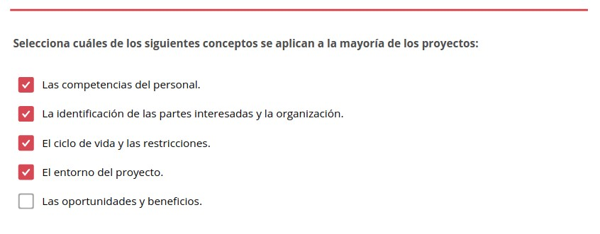

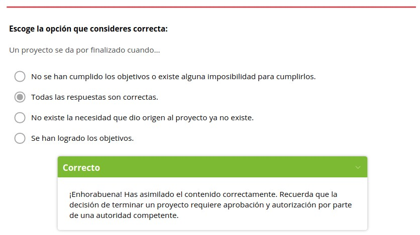

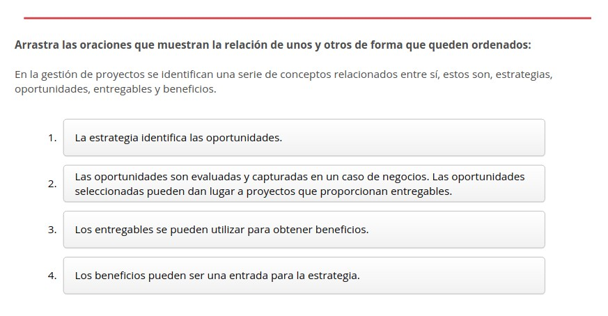

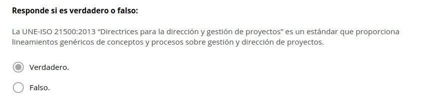

.. figure:: ../../_static/1_gestion_integrada_de_proyectos/1.1_introduccion_iso_21500/actividades/actividad_2_2.jpg
   :width: 70%
   :align: center

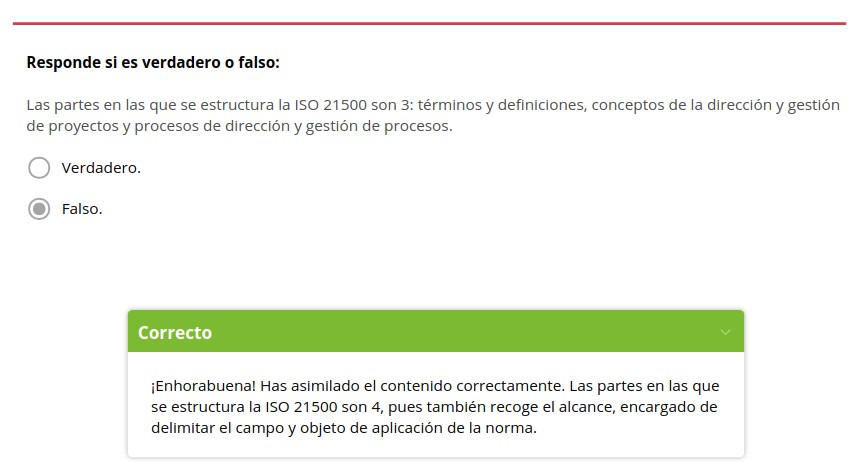

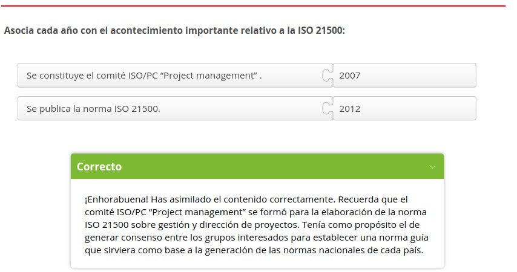

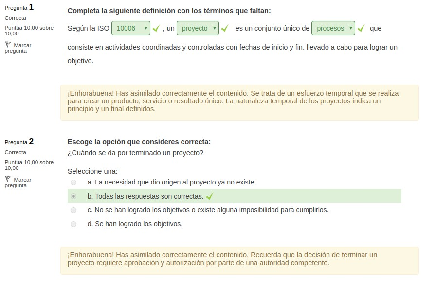

.. figure:: ../../_static/1_gestion_integrada_de_proyectos/1.1_introduccion_iso_21500/actividades/cuestionario_2.jpg
   :width: 70%
   :align: center

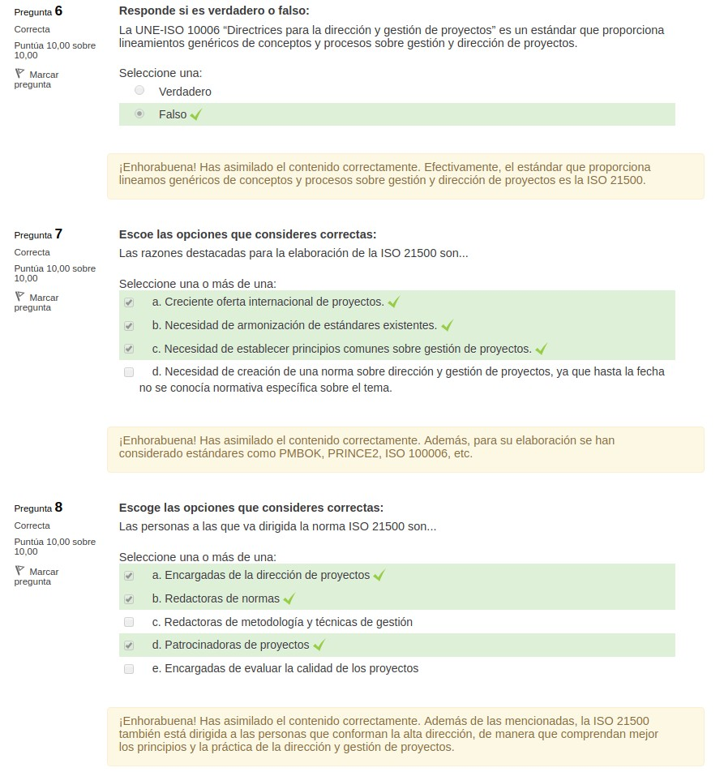

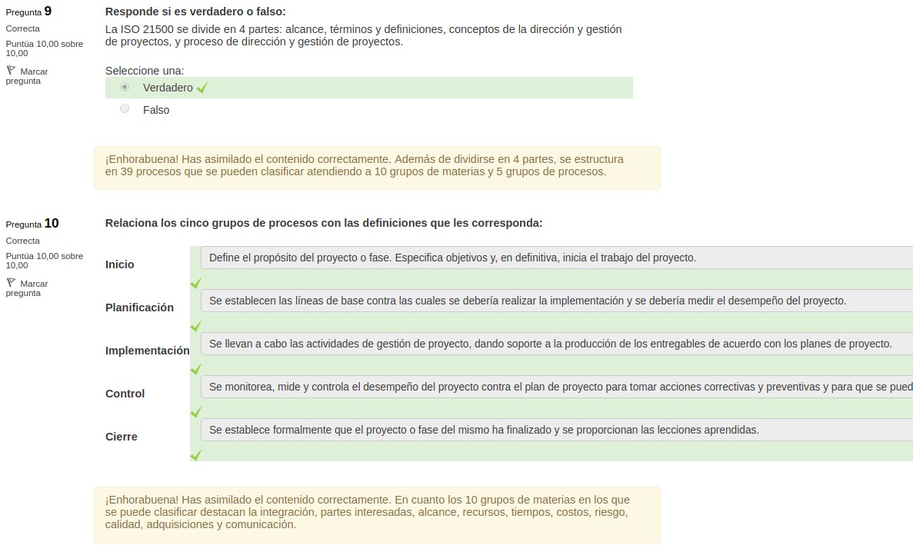