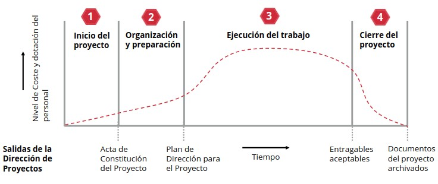
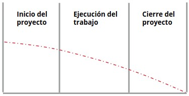
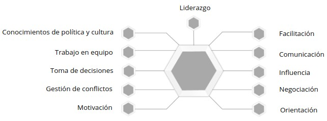
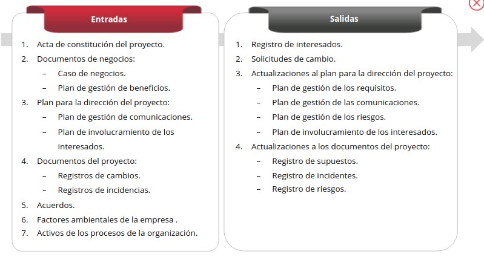
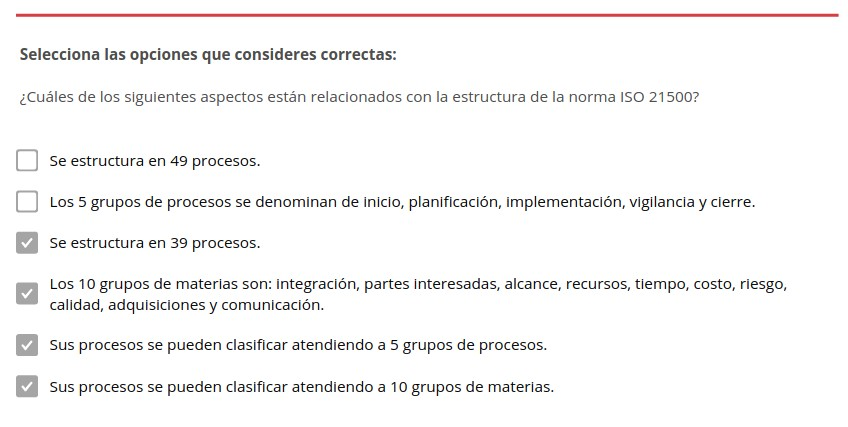
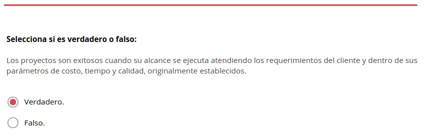
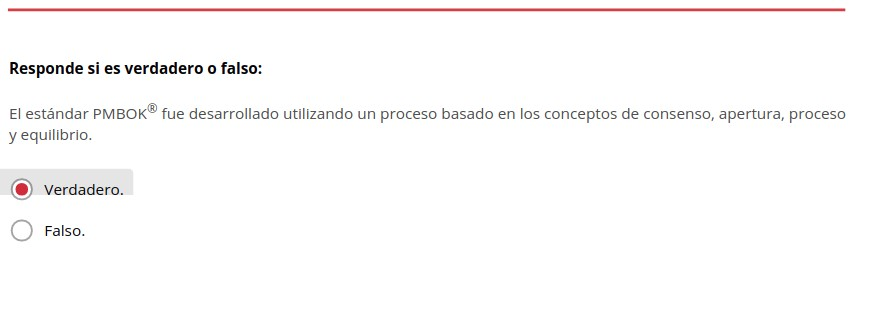
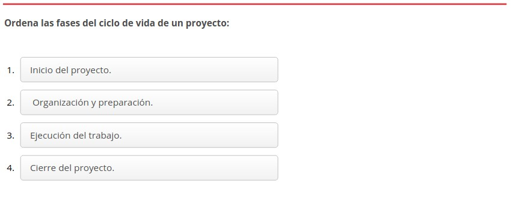
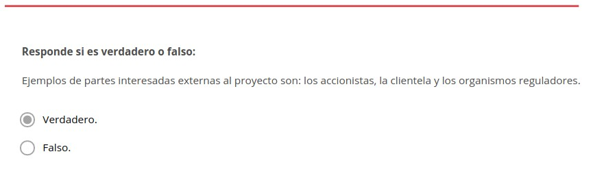
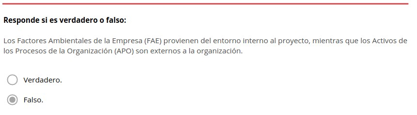

Estructura de la norma ISO 21500
================================

.. figure:: ../../../_static/1_gestion_integrada_de_proyectos/1.2_estructura_iso_21500/mapa_conceptual.jpg
   :width: 50%
   :align: center

   Mapa conceptual de la estructura de la norma ISO 21500

1. Estructura de la norma ISO 21500
***********************************

La **norma ISO 21500** se define como un estándar que proporciona lineamientos genéricos de conceptos y procesos sobre gestión dirección de proyectos.

Surgión con el **propósito** de generar consenso entre los grupos interesados para establecer una norma guía que sirviera como base para la generación de las normas nacionales de cada país.

Se estructura en **39 procesos** que se pueden casificar atendiendo a:

+-----------------------+----------------------+
| 10 grupos de materias | 5 grupos de procesos |
+-----------------------+----------------------+
| - Integración         | - Inicio             |
| - Coste               | - Planificación      |
| - Partes interesadas  | - Implementación     |
| - Riesgo              | - Control            |
| - Alcance             | - Cierre             |
| - Calidad             |                      |
| - Recursos.           |                      |
| - Adquisiciones       |                      |
| - Tiempo              |                      |
| - Comunicación        |                      |
+-----------------------+----------------------+

2. Definiciones de conceptos generales de la norma
**************************************************

La **globalización** hace que las empresas de prestigio busquen hacer negocios con otras empresas, también de prestigio, que las brinden confianza. Esta **necesidad de confianza** puede atenderse con certificados o constancias que evidencien el buen accionar de una empresa.

Las empresas desean hacer negocios con otras, cuyo "accionar" o Sistema de Gestión (SG), sea reconocido mediante un **documento** que certifique que dicho accionar está estandarizado **conforme a lineamientos globales**. Estos lineamientos deben ser **respaldados por una institución global** de reconocido prestigio, en este caso, por una institución como la ISO.

2.1. Ejecución de proyectos
+++++++++++++++++++++++++++

Algo similar ocurre con las **empresas** que demandan servicios para la **ejecución de proyectos**.

Estas **requieren** que las organizaciones que se hagan cargo de sus proyectos cuenten con **profesionales** que conozcan **prácticas, guías y lineamientos de gestión de proyectos reconocidos a nivel global**, lo que les proporcionará más confianza y mayor probabilidad de que sus proyectos culminen exitosamente.

.. note::  Los proyectos son existosos cuando su alcance se ejecuta atendiendo los requerimientos del cliente y dentro sus parámetros de coste, tiempo y calidad, originalmente establecidos.

3. Clasificación de los procesos en grupos de proceos y grupos de materias
***************************************************************************

3.1. Clasificación de los procesos atendiendo a los grupos de materias
+++++++++++++++++++++++++++++++++++++++++++++++++++++++++++++++++++++++++++

- **Integración**: Identificar, definir, combinar, unificar, coordinar, controlar y cerrar las diferentes actividades y procesos relacionados con el proyecto.
- **Partes interesadas**: Identificación y logro del compromiso del patrocinador del proyecto, de los clientes y de otras partes.
- **Alcance**: Asegurar que el proyecto incluya todo el trabajo, y solamente el trabajo y los entregables requeridos y especificados, a fin de alcanzar los objetivos del proyecto.
- **Recursos**: Asegurar que el proyecto tenga los recursos humanos, materiales, instalaciones, infraestructura y otros recursos adecuados para lograr los objetivos del proyecto.
- **Tiempo**: Realizar el cronograma de actividades del proyecto y monitorear su progreso para lograr que el proyecto se complete según el cronograma.
- **Coste**: Procesos para establecer el presupuesto, para controlar los costes y para completar el proyecto dentro del presupuesto.
- **Riesgo**: Gestión proactiva de amenazas y oportunidades para maximizar la probabilidad de lograr los objetivos del proyecto.
- **Calidad**: Establecer la planificación y asegurar la calidad de los entregables y del proyecto.
- **Comunicación**: Asegurar, en tiempo y forma, la generación, recolección, distribución, almacenamiento, recuperación y disposición final de la información de proyecto.
- **Adquisiciones**: Planificar y adquirir productos, servicios o resultados y gestionar la relación con los proveedores.

3.2. Clasificación de los procesos en grupos de proceso y grupos de materias
++++++++++++++++++++++++++++++++++++++++++++++++++++++++++++++++++++++++++++++

+-------------------------+-------------------------------------------------------------------------------------------------------------------------------------------------------------------------------------------------------------------------------+
| **Grupos de materias**  | **Grupos de procesos**                                                                                                                                                                                                        |
|                         +------------------------------------+------------------------------------------------+------------------------------------------+-------------------------------------------------+--------------------------------------------+
|                         | **Inicio**                         | **Planificación**                              | **Implementación**                       | **Control**                                     | **Cierre**                                 |
+-------------------------+------------------------------------+------------------------------------------------+------------------------------------------+-------------------------------------------------+--------------------------------------------+
| **Integración**         | Desarrollar el acta del proyecto   | Desarrollar planes de proyecto                 | Dirigir las tareas del proyecto          | Controlar las tareas del proyecto y los cambios | - Cerrar la fase de proyecto o el proyecto |
|                         |                                    |                                                |                                          |                                                 | - Recolectar las lecciones aprendidas      |
+-------------------------+------------------------------------+------------------------------------------------+------------------------------------------+-------------------------------------------------+--------------------------------------------+
| **Partes interesadas**  | Identificar las partes interesadas |                                                | Gestionar las partes interesadas         |                                                 |                                            |
+-------------------------+------------------------------------+------------------------------------------------+------------------------------------------+-------------------------------------------------+--------------------------------------------+
| **Alcance**             |                                    | - Definir el alcance.                          |                                          | Controlar el alcance                            |                                            |
|                         |                                    | - Crear la estructura de desglose de trabajos. |                                          |                                                 |                                            |
|                         |                                    | - Definir actividades.                         |                                          |                                                 |                                            |
+-------------------------+------------------------------------+------------------------------------------------+------------------------------------------+-------------------------------------------------+--------------------------------------------+
| **Recursos**            | Establecer el equipo de proyecto   | - Estimar recursos.                            | Desarrollar el equipo de proyecto        | - Controlar los recursos.                       |                                            |
|                         |                                    | - Definir la organización del proyecto.        |                                          | - Gestionar el equipo de proyecto.              |                                            |
+-------------------------+------------------------------------+------------------------------------------------+------------------------------------------+-------------------------------------------------+--------------------------------------------+
| **Tiempo**              |                                    | - Establecer la secuencia de actividades.      |                                          | Controlar el cronograma                         |                                            |
|                         |                                    | - Estimar la duración de actividades.          |                                          |                                                 |                                            |
|                         |                                    | - Desarrollar el cronograma                    |                                          |                                                 |                                            |
+-------------------------+------------------------------------+------------------------------------------------+------------------------------------------+-------------------------------------------------+--------------------------------------------+
| **Coste**               |                                    | - Estimar costes.                              |                                          | Controlar los costes                            |                                            |
|                         |                                    | - Desarrollar el presupuesto.                  |                                          |                                                 |                                            |
+-------------------------+------------------------------------+------------------------------------------------+------------------------------------------+-------------------------------------------------+--------------------------------------------+
| **Riesgo**              |                                    | - Identificar los riesgos.                     | Tratar los riesgos.                      | Controlar los riesgos.                          |                                            |
|                         |                                    | - Evaluar los riesgos.                         |                                          |                                                 |                                            |
+-------------------------+------------------------------------+------------------------------------------------+------------------------------------------+-------------------------------------------------+--------------------------------------------+
| **Calidad**             |                                    | Planificar la calidad.                         | Realizar el aseguramiento de la calidad. | Realizar el control de la calidad.              |                                            |
+-------------------------+------------------------------------+------------------------------------------------+------------------------------------------+-------------------------------------------------+--------------------------------------------+
| **Comunicación**        |                                    | Planificar las comunicaciones.                 | Distribuir la información.               | Gestionar la comunicación.                      |                                            |
+-------------------------+------------------------------------+------------------------------------------------+------------------------------------------+-------------------------------------------------+--------------------------------------------+
| **Adquisiciones**       |                                    | Planificar las adquisiciones.                  | Seleccionar los proveedores.             | Administrar los contratos.                      |                                            |
+-------------------------+------------------------------------+------------------------------------------------+------------------------------------------+-------------------------------------------------+--------------------------------------------+

4. El estándar en la dirección de proyectos PMBOK
*************************************************

.. note::  Un **estándar** es un documento establecido por una autoridad, costumbre o consenso como un modelo o ejemplo.

Las siglas de PMBOK responden a **"Guía de los Fundamentos para la dirección de proyectos"**. Se caracteriza por proporcionar un conjunto de conocimientos, prácticas y métodos en relación a la gestión y dirección de proyectos.

4.1. Introducción
+++++++++++++++++

El **estándar PMBOK** fue desarrollado utilizando un proceso basado en los conceptos de consenso, apertura, proceso y equilibrio. Este estándar **describe los procesos considerados como buenas prácticas** en la mayoría de los proyectos. Estos procesos están **organizados por grupos**.

**PMBOK se estructura en 49 procesos de acuerdo a la versión 6**. Estos se pueden organizar atendiendo a cico grupos de procesos muy similares a los de la ISO 21500:

+--------------------------------+----------------------+
| 5 Grupos de procesos ISO 21500 | PMBOK                |
+--------------------------------+----------------------+
| - Inicio                       | - Inicio             |
| - Planificación                | - Planificación      |
| - Implementación               | - Ejecución          |
| - Control                      | - Monitoreo y control|
| - Cierre                       | - Cierre             |
+--------------------------------+----------------------+

Además, define conceptos clave de la dirección y gestión de proyectos como:

- El vínculo entre la dirección de proyectos, la estrategia y los objetivos de la organización.
- La gobernanza.
- El entorno del proyecto.
- La dirección de portafolios.
- La dirección de programas.
- El éxito del proyecto y la gestión de los beneficios.

También cubre informacion sobre:

- Ciclos de vida del proyecto.
- Partes interesadas del proyecto.
- El rol del director o directora del proyecto.
- Áreas de conocimiento.
- Grupos de procesos.
- Factores ambientales de la empresa.
- Activos de los procesos de la organización.
- Adaptación de los objetos del proyecto.

La **Guía del PMBOK** amplía la información de este estándar, brindando una descripción más detallada del contexto, el entorno y las influencias en la dirección de proyectos. Además, proporciona descripciones de las entradas y salidas de los procesos de la dirección de proyectos, identifica herramientas y técnicas, y analiza conceptos clave y tendencias emergentes asociados con cada área de conocimiento.

4.1.1. Gobernanza organizacional y gobernanza del proyecto
----------------------------------------------------------

Existen diversos tipos de gobernanza: 

- Organizacional.
- De portafolios, programas y proyectos.
- De la dirección organizacional de proyectos. 

.. note:: La gobernanza organizacional es una forma estructurada de proporcionar dirección y control a través de políticas y procesos, para cumplir con las metas estratégicas y operativas. Por lo general, está a cargo de una junta directiva que garantiza la rendición de cuentas, la imparcialidad y la transparencia a las partes interesadas.

Los principios, decisiones y procesos de la gobernanza organizacional pueden influir y afectar la gobernanza de portafolios, programas y proyectos de las siguientes formas:

- Haciendo cumplir los requisitos legales, regulatorios, normaivos y de cumplimiento.
- Definiendo responsabilidades éticas, sociales y ambientales.
- Especificando políticas operativas, legales y de riesgo.

.. note:: La gobernanza del proyecto consiste en el marco, funciones y procesos que guían las actividades de dirección del proyecto a fin de crear un producto, servicio o resultado único para cumplir con las metas organizacionales, estratégicas y operativas.

La gobernanza a nivel del proyecto incluye:

- Guiar y supervisar la gestión del trabajo del proyecto.
- Asegurar la adhesión a las políticas, estándares y guías,
- Establecer roles, responsabilidades y autoridades de la gobernanza.
- Tomar decisiones sobre escalamiento de riesgos, cambios y recursos (finacieros, físicos, instalaciones, equipos, etc.).
- Asegurar el adecuado involucramiento de los interesados.
- Monitorear el desempeño.

Además, el **marco de gobernanza del proyecto** proporciona a las personas interesadas:

- La estructura.
- Los procesos.
- Los roles.
- Las responsabilidades.
- Las rendiciones de cuentas.
- Los modelos de toma de decisiones para dirigir el proyecto.

Los **elementos del marco de gobernanza de un proyecto** incluyen, entre otros, principios o procesos para:

- **Revisar** fases o cambios de etapas.
- **Identificar**, escalar y resolver riesgos e incidentes.
- **Definir** roles, responsabilidades y autoridades.
- **Gestionar** el conocimiento del proyecto y capturar las lecciones aprendidas.
- **Tomar decisions y resolver** problemas y escalar temas que están más allá de la autoridad de la dirección del proyecto.
- **Revisar y aprobar** cambios al proyecto y cambios al producto que están fuera de la autoridad de la dirección del proyecto.

4.1.2. Entorno del proyecto
---------------------------

.. note:: El **entorno del proyecto** hace referencia a la gestion de portafolios de proyectos y programas. Un **portafolio** consituye los proyectos, programas, portafolios subsidiarios y operaciones cuya gestión se realiza de manera coordinada para alcanzar los objetivos estratégicos. Los portafolios pueden incluir trabajo de naturaleza operativa.

La dirección de portafolios es la gestión centralizada de uno o más portafolios a fin de alcanzar dichos objetivos. Se centra en:

- Asegurar que el desempeño del potafolio sea consistente con los objetivos de la organización.
- Evaluar los componentes del portafolio para optimizar la asignación de recursos.

.. note:: Un **programa** constituye los proyectos relacionados, los programas subsidiarios y las actividades de programas, cuya gestión se realiza de manera coordinada para obtener beneficios que no se obtendrían si se gestionaran de forma individual.

Los programas **incluyen trabajo relacionado** con el programa que está fuera del alcance de los proyectos específicos. También pueden incluir trabajo de naturaleza operativa.

La **gestión de programas** es la aplicación de conocimientos, habilidades y principios para alcanzar los objetivos del programa y para obtener beneficios y control no disponibles cuando los componentes del programa relacionados se gestionan individualmente.

Además, **apoya las estrategias organizacionales** mediante la autorización, cambio o conclusión de proyectos y mediante la gestión de sus interdependencias.

La **gestión de las interdependencias** de los proyectos puede incluir, entre otras **acciones**:

- Resolver restricciones y/o conflictos de recursos que afectan a los componentes del programa.
- Alinearse con las estrategias de la organización que influyen y afectan las metas y los objetivos del programa.
- Gestionar incidentes y emplear la gestión de cambios dentro de una estructura de gobernanza compartida.
- Abordar los riesgos del proyecto y el programa que pueden afectar a uno o más componentes.
- Gestionar la obtención de beneficios del programa mediante el análisis, secuenciación y monitoreo eficaces de las interdependencias de los componentes.

**Un proyecto puede dirigirse de 3 formas diferentes**, como:

- Proyecto independiente (fuera de un portafolio o programa).
- Dentro de un programa.
- Dentro de un portafolio.

Cuando un proyecto está dentro de un portafolio o programa, la dirección de proyectos interactúa con la dirección de portafolios y programas.

Los **componentes del portafolio** se agrupan a fin de facilitar la gobernanza y la gestión eficaces del trabajo y para alcanzar las estrategias y prioridades de la organización.

La **planificación de la organización y de los portafolios** afecta a los componentes mediante el establecimiento de prioridades basadas en los riesgos, el financiamiento y otras consideraciones. Esto **permite a las organizaciones**:

- Tener una visión general sobre cómo los objetivos estratégicos se reflejan en el portafolio.
- Establecer una gobernanza adecuada de portafolios, programas y proyectos.
- Autorizar recursos humanos, financieros o físicos. Estos recursos se asignarán en base al desempeño y los beneficios esperados.

Las **estrategias y prioridades de una organización establecen relaciones entre**:

- Portafolios y programas.
- Portafolios y proyectos.
- Programas y proyectos.

Estas relaciones no son siempre estrictamente jerárquicas.

La **Dirección Organizacional de Proyectos** (en inglés, `Organizational Project Management, OPM`) es un marco para la ejecución de estrategias a través de la dirección de portafolios, de programas y de proyectos. proporciona un marco que permite a las organizaciones implementar de manera consistente y predecible estrategias organizacionales capaces de producir un mejor desempeño, mejores resultados y una ventaja competitiva sostenible. 

4.1.3. Éxito del proyecto y gestión de beneficios
-------------------------------------------------

Los proyectos se inician para aprovechar oportunidades de negocio que están alineadas con las metas estratégicas de una organización. **Antes de iniciar un proyecto**, a menudo se desarrolla un documento denominado **caso de negocio**.

.. note:: **El documento "caso de negocio"** sirve para definir los objetivos de un proyecto, la inversión requerida y los criterios financieros y cualitativos para el éxito del mismo. Así pues, proporciona la base para medir el éxito y el avance a lo largo del ciclo de vida del proyecto mediante la comparación de los resultados con los objetivos y los criterios de éxito identificados.

Por lo general, **los proyectos se inician como resultado de** una o más de las siguientes **consideraciones estratégicas**:

- Demanda del mercado.
- Oportunidad estratégica/necesidad de negocio.
- Necesidad social.
- Temas ambientales.
- Solicitud del cliente.
- Avance tecnológico.
- Requisito legal o regulatorio.
- Problema existente o previsto.

..  note::El plan de gestión de beneficios describe el modo y el momento en que se entregarán los beneficios del proyecto y cómo se medirán los mismos.

El plan de gestión de beneficios puede incluir:

- **Beneficios esperados**: El valor de negocio tangible e intangible que se espera ganar con la implementación del producto, servicio o resultado.
- **Alineación estratégica**: El modo en que los beneficios del proyecto apoyan y se alinean con las estrategias de negocio de la organización.
- **Plazo para obtener los beneficios**: Beneficios por fase (corto plazo, largo plazo y continuos).
- **Responsable de los beneficios**: La persona o grupo responsable que monitorea, registra e informa de los beneficios obtenidos en el transcurso del plazo establecido en el plan.
- **Métricas**: Las mediciones directas e indirectas utilizadas para mostrar los beneficios obtenidos.
- **Riesgos**: Riesgos asociados con el logro de los beneficios esperados.

.. note::Tanto el **caso de negocio** como el **plan de gestión de beneficios** se desarrollan **antes de iniciar el proyecto**. Además, una vez concluido el proyecto se hace referencia a ambos documentos, por lo tanto, se los considera **documentos de negocio** más que documentos del proyecto o componentes del plan para la dirección del proyecto.

Cuando corresponda, estos documentos de negocio podrán ser **entradas** de algunos de los procesos involucrados en dirigir el proyecto, como el **desarrollo del acta de constitución del proyecto**.

El **éxito del proyecto** se mide con relación a sus **objetivos** y **criterios de éxito**. En muchos casos, el éxito del producto, servicio o resultado no se conoce hasta pasado un tiempo, una vez concluido el proyecto.

.. note::Aspectos como un aumento de la participación en el mercado, una disminución de los gastos operativos o el éxito de un nuevo producto podrían desconocerse cuando el proyecto pasa al ámbito de operaciones. En estas circunstancias, la Oficina de Dirección de Proyectos (ODP), el comité de dirección de portafolios o alguna otra función de negocio dentro de la organización debe **evaluar el éxito en una fecha posterior**, a fin de determinar si los resultados cumplieron los objetivos de negocio.

4.1.4. El ciclo de vida del proyecto
------------------------------------

.. note::El **ciclo de vida** de un proyecto es el conjunto de fases que atraviesa un proyecto, desde su inicio hasta su conclusión. Cada fase se compone de actividades relacionadas de manera lógica que culmina con la finalización de uno o más entregables.

Las **fases del proyecto** presentan las siguientes **características**:

- Pueden ser secuenciales, iterativas o superpuestas.
- Los nombres, número y duración de las fases se determinan en función de las necesidades de gestión y control de las organizaciones que participan en el proyecto, la naturaleza propia del proyecto y su área de aplicación.
- Están acotadas en el tiempo, con un inicio y un final o punto de control (a veces denominado revisión de fase, punto de revisión de fase, revisión de control u otro término similar).

En el punto de control, el acta de constitución del proyecto y los documentos de negocio se reexaminan en base al entorno actual. En ese momento, el desempeño del proyecto se compara con el plan para la dirección del proyecto para determinar si el proyecto se debe cambiar, terminar o continuar tal como se planificó.

Aunque los proyectos varían en el tamaño y el grado de complejidad, pueden configurarse dentro de la siguiente estructura de ciclo de vida:

El **ciclo de vida del proyecto** puede verse **afectado por los aspectos** propios de:

- La organización.
- La industria.
- El método de desarrollo.
- La tecnología empleada.

Mientras que cada proyecto tiene un inicio y un final, los entregables específicos y el trabajo que se llevan a cabo varían ampliamente dependiendo del proyecto. El ciclo de vida proporciona el **marco de referencia básico para dirigir el proyecto**, independientemente del trabajo especifico involucrado.

Existen determinados **factores que fluctúan y disminuyen durante el ciclo de vida del proyecto**, a medida que se van adoptando decisiones y aceptando los entregables. Algunos ejemplos son:

- Los **niveles de coste y dotación de personal**. Son bajos al inicio del proyecto, aumentan según se desarrolla el trabajo y caen rápidamente cuando el proyecto se acerca al cierre.

.. figure:: ../../../_static/1_gestion_integrada_de_proyectos/1.2_estructura_iso_21500/niveles_de_coste.jpg
   :width: 30%
   :align: center

- **La capacidad de influir de las personas interesadas** en las características finales del producto sin afectar significativamente al coste ni al cronograma. Esta capacidad es más alta al inicio del proyecto y va disminuyendo a medida que se alcanza la conclusión del mismo.

4.1.5. Partes interesadas del proyecto
--------------------------------------

.. note:: Una **parte interesada** es una persona, grupo u organización que puede afectar, verse afectada, o percibirse a sí misma como afectada por una decisión, actividad o resultado de un proyecto.

Las **partes interesadas** del proyecto pueden:

- Ser internas o externas al proyecto.
- Estar involucradas activamente, pasivamente o desconocer el proyecto.
- Tener un impacto positivo o negativo en el proyecto.
- Recibir un impacto positivo o negativo del proyecto.

Las **personas interesadas internas** las componen:

- Patrocinadoras.
- Gerencia de recursos.
- La Oficina de Dirección de Proyectos (ODP).
- El comité de dirección de portafolios.
- La dirección del programa.
- La dirección de proyecto.
- Personal del equipo.

Las **personas interesadas externas** las componen:

- Clientela.
- Usuarios/as finales.
- Proveedores/as.
- Accionistas.
- Organismos reguladores.
- Competidores/as.

La **participación** de las partes interesadas en el proyecto puede ser de **2 tipos**:

- **Ocasional**: a través de encuestas y grupos de opinión.
- **De patrocinio total**: incluye la provisión de apoyo financiero, político o de otros tipos.

**El tipo y nivel de participación en el proyecto pueden cambiar durante el ciclo de vida del proyecto**. Por lo tanto, la identificación, el análisis, el nivel de involucramiento exitoso de las personas interesadas, la gestión eficaz de sus expectativas y la participación en el proyecto a lo largo del ciclo de vida son aspectos críticos para el éxito del proyecto.

.. figure:: ../../../_static/1_gestion_integrada_de_proyectos/1.2_estructura_iso_21500/partes_interesadas.jpg
   :width: 70%
   :align: center

4.1.6. Rol de la dirección del proyecto
---------------------------------------

.. note::La **directora o director de proyecto** es la persona seleccionada por la organización ejecutora para liderar al equipo responsable de alcanzar los objetivos del proyecto.

Las **relaciones de comunicación de la dirección** del proyecto están basadas en la estructura organizacional y la gobernanza del proyecto.

Además de las habilidades técnicas especificas y de las competencias generales en materia de gestión requeridas para el proyecto, la persona encargada de la dirección de proyecto debe reunir:

- **Conocimiento**: Conocimientos acerca de la dirección de proyectos, el entorno del negocio, aspectos técnicos y demás información necesaria para dirigir de manera eficaz.
- **Habilidades**: Habilidades necesarias para liderar el equipo del proyecto, coordinar el trabajo, colaborar con las partes interesadas, resolver problemas y tomar decisiones de manera eficaz.
- **Desarrollo**: Capacidades para desarrollar y gestionar el alcance, los cronogramas, presupuestos, recursos, riesgos, planes, presentaciones e informes.
- **Atributos**: Otros atributos requeridos para dirigir con éxito el proyecto, como personalidad, actitud, ética y liderazgo.

Los directores y directoras de proyecto llevan a cabo el trabajo a través del equipo del proyecto y de otras personas interesadas. Para **desarrollar su labor** depende de importantes **habilidades interpersonales** que incluyen, entre otras:

La **dirección del proyecto es exitosa** cuando se han alcanzado los objetivos del proyecto y se ha conseguido la satisfacción de las personas interesadas. Para esto, **la dirección debe atender** a las necesidades, inquietudes y expectativas y debe adaptar el enfoque del proyecto, el ciclo de vida y los procesos de la dirección de proyectos.

4.1.7. Áreas de conocimiento de la dirección de proyectos
---------------------------------------------------------

.. note:: Las áreas de conocimiento de la dirección de proyectos son campos o áreas de especialización que se emplean comúnmente al dirigir proyectos. Cada área está conformada por un conjunto de procesos asociados a un tema particular de la dirección de proyectos.

Existen 10 áreas de conocimiento que se utilizan en la mayoría de los proyectos, aunque puede haber casos en los que la especificad del proyecto requiera de áreas adicionales.

Las 10 áreas principales tratan de la gestión de diversos aspectos del proyecto:

- **Integración**: Incluye los procesos y actividades para identificar, definir, combinar, unificar y coordinar los diversos procesos y actividades de dirección del proyecto dentro de los grupos de procesos de la dirección de proyectos.
- **Alcance**: Incluye los procesos requeridos para garantizar que el proyecto incorpora todo el trabajo requerido para completar el proyecto con éxito.
- **Cronograma**: Incluye los procesos requeridos para administrar la finalización del proyecto a tiempo.
- **Costes**: Incluye los procesos involucrados en planificar, estimar, presupuestar, financiar, obtener financiamiento, gestionar y controlar los Costes de modo que se complete el proyecto dentro del presupuesto aprobado.
- **Calidad**: Incluye los procesos para incorporar la política de calidad de la organización en cuanto a la planificación, gestión y control de los requisitos de calidad del proyecto y el producto, a fin de satisfacer las expectativas de las personas interesadas.
- **Recursos**: Incluye los procesos para identificar, adquirir y gestionar los recursos necesarios para la conclusión exitosa del proyecto.
- **Comunicaciones**: Incluye los procesos requeridos para garantizar que la planificación, recopilación, creación, distribución, almacenamiento, recuperación, gestión, control, monitoreo y disposición final de la información del proyecto sean oportunos y adecuados.
- **Riesgos**: Incluye los procesos para llevar a cabo la planificación de la gestión, identificación, análisis, planificación de respuesta, implementación de respuesta y monitoreo de los riesgos de un proyecto.
- **Adquisiciones**: Incluye los procesos necesarios para comprar o adquirir productos, servicios o resultados que es preciso obtener fuera del equipo del proyecto.
- **Partes interesadas**: Incluye los procesos requeridos para identificar a las personas, grupos u organizaciones que pueden afectar o ser afectadas por el proyecto, para analizar las expectativas de interés y su impacto en el proyecto, y para desarrollar estrategias de gestión adecuadas a fin de lograr la participación eficaz de dichas partes interesadas en las decisiones y en la ejecución del proyecto.

4.1.8. Grupos de procesos de la dirección de proyectos
------------------------------------------------------

Este estándar describe los procesos de la dirección de proyectos empleados para cumplir con los objetivos del proyecto. Estos procesos agrupan en **5 grupos de procesos** de:

- **Inicio**: procesos realizados para definir un nuevo proyecto o nueva fase de un proyecto existente al obtener la autorización para iniciar el proyecto o fase.
- **Planificación**: procesos requeridos para establecer el alcance del proyecto, refinar los objetivos y definir el curso de acción requerido para alcanzar los objetivos propuestos del proyecto.
- **Ejecución**: procesos realizados para completar el trabajo definido en el plan para la dirección del proyecto a fin de satisfacer los requisitos del proyecto.
- **Monitoreo y control**: procesos requeridos para hacer seguimiento, analizar y regular el progreso y el desempeño del proyecto, para identificar áreas en las que el plan requiera cambios y para iniciar los cambias correspondientes.
- **Procesos de cierre**: procesos llevados a cabo para completar o cerrar formalmente un proyecto, fase o contrato.

Estos 5 grupos de procesos son independientes de las áreas de aplicación y del enfoque de las industrias.

**Los procesos individuales de los grupos de procesos** a menudo se repiten antes de concluir una fase o un proyecto. El número de iteraciones de los procesos e interacciones entre los procesos varía según las necesidades del proyecto. En general, se pueden clasificar los **procesos según se utilicen**:

- **Una única vez o en puntos predefinidos del proyecto**: ejemplos de estos procesos son, por ejemplo, desarrollar el acta de constitución del proyecto y cerrar el proyecto o fase.
- **Periódicamente, según sea necesario**: por ejemplo, la adquisición de recursos se lleva a cabo cuando se necesitan recursos. Estas adquisiciones se efectuarán antes de necesitar el elemento adquirido.
- **De manera continua a lo largo de todo el proyecto**: por ejemplo, la definición de las actividades puede ocurrir a lo largo del ciclo de vida del proyecto, en especial cuando utiliza planificación gradual o un enfoque de desarrollo adaptativo. Muchos de los procesos de monitoreo y control son continuos desde el inicio del proyecto hasta su cierre.

La **salida de un proceso** normalmente se convierte en la entrada para otro proceso o es un entregable del proyecto o fase del proyecto.

Por ejemplo, el plan para la dirección del proyecto y los documentos del proyecto (registro de riesgos, matriz de asignación de responsabilidades,etc.) producidos en el grupo de procesos de planificación son proporcionados al grupo de procesos de ejecución donde se realizan las actualizaciones.

.. note::Los grupos de procesos no son fases del proyecto. Cuando el proyecto está dividido en fases, los procesos de los grupos de procesos interactúan dentro de cada fase.

Es posible que todos los grupos de procesos estén representados dentro de una fase, dado que **los proyectos están separados en fases diferenciadas** como, por ejemplo:

- El desarrollo conceptual.
- El estudio de viabilidad.
- El diseño.
- El prototipo.
- La construcción o prueba.

Los procesos de cada grupo de procesos **se repiten en cada fase según sea necesario**, hasta que se hayan cumplido los criterios de finalización de esa fase.

4.1.9. Factores ambientales de la empresa y activos de los procesos de organización
------------------------------------------------------------------------------------------

Los proyectos existen y operan en entornos que pueden influir en ellos de manera favorable o desfavorable. En concreto existen **2 categorías principales de influencias**:

- **Factores Ambientales de la Empresa (FAE)**: provienen del entorno externo al proyecto y, a menudo, fuera de la empresa. Estos factores hacen referencia a condiciones que no están bajo el control del equipo del proyecto y que influyen, restringen o dirigen el proyecto. Los FAE pueden tener un impacto a nivel de la empresa, portafolios, programas o proyectos. Ejemplos de dichos factores son:

	- La cultura (visión, misión, valores, creencias, normas culturales, etc.).
	- La estructura y gobierno internos de la organización (jerarquía y relaciones de autoridad).

- **Activos de los Procesos de la Organización (APO)**: son internos de la empresa. Pueden surgir de la propia empresa, de un portafolio, un programa, otro proyecto o una combinación de todos ellos. Los APO son los planes, procesos, políticas, procedimientos y bases de conocimiento específicos de la organización ejecutora, utilizados por la misma. Estos activos influyen en la dirección del proyecto. Ejemplos de estos activos son:

	- Procedimientos de control de cambios.
	- Plantillas.
	- Información de proyectos anteriores.
	- Repositorios de lecciones aprendidas.

Los factores ambientales de la empresa que influyen en el proyecto y los activos de los procesos de la organización disponibles para el proyecto dependerán del proyecto y del entorno del mismo.

4.1.10. Adaptación de los objetos del proyecto
----------------------------------------------

En este contexto, el término objeto incluye los procesos de la dirección de proyectos, entradas, herramientas, técnicas, salidas, FAE y APO.

La dirección del proyecto y el equipo de dirección del proyecto **seleccionan y adaptan** los objetos adecuados para utilizar en su proyecto específico. Esta actividad de selección y adecuación se conoce como **adaptación**.

.. note:: **Adaptar** es necesario porque cada proyecto es único, por lo tanto, no todos los procesos, entradas, herramientas, técnicas o salidas son necesarios en cada proyecto.

.. note:: El **plan para la dirección del proyecto (PDP)** es el documento principal para la dirección del proyecto, ya que establece qué, cuándo y quién realiza las tareas del proyecto. Es el objeto más prevalente, ya que posee muchos componentes, tales como los planes de gestión subsidiarios, líneas base y una descripción del ciclo de vida del proyecto.

Por **planes de gestión subsidiarios** se entienden aquellos planes asociados a un área de conocimiento o aspecto específico del proyecto, por ejemplo, un plan de gestión del cronograma, un plan de gestión de los riesgos o un plan de gestión de cambios.

Parte de la **actividad de adaptar** consiste en identificar los componentes del plan para la dirección del proyecto necesarios para un proyecto particular. El plan para la dirección del proyecto es una entrada y las actualizaciones al plan para la dirección del proyecto son una salida de muchos procesos.

En lugar de enumerar los componentes individuales del plan para la dirección del proyecto en las tablas de entrada/salida, los ejemplos de **los componentes** que pueden ser entradas o que pueden actualizarse como salidas **se enumeran en las tablas de entradas/salidas para cada proceso**. Los posibles componentes se enumeran solamente como ejemplos.

Estas entradas y salidas no son siempre necesarias y no son las únicas entradas o actualizaciones al plan para la dirección del proyeto que un director de proyecto puede usar en ese proceso particular.

El **plan para la dirección del proyecto** es uno de los **principales objetos del proyecto**, pero existen **otros documentos** que no son parte del plan para la dirección del proyecto que se utilizan para dirigir el proyecto. Se denominan **documentos del proyecto**.

El **director/a** del proyecto es la persona **responsable de identificar los documentos** necesarios para cada proceso y la documentación del proyecto que se actualizará como una salida de un proceso.

La siguiente tabla contiene una lista representativa de **componentes del plan para la dirección del proyecto y de documentos del proyecto**. No es una lista completa, pero proporciona una representación de los tipos de documentos que a menudo se utilizan para ayudar a dirigir un proyecto.

.. figure:: ../../../_static/1_gestion_integrada_de_proyectos/1.2_estructura_iso_21500/componentes_del_plan_para_la_direccion.jpg
   :width: 95%
   :align: center

4.2. Grupo de procesos del inicio del proyecto
++++++++++++++++++++++++++++++++++++++++++++++

.. note:: El **grupo de procesos de inicio** está compuesto por aquellos procesos realizados para definir un nuevo proyecto o una nueva fase de un proyecto existente al obtener la autorizaicón para iniciar el proyecto o fase.

El **propósito del grupo de procesos** de inicio es alinear las expectativas de las partes interesadas y el **propósito del proyecto** informar a dichas partes sobre el alcance y los objetivos, y analizar cómo su participación en el proyecto y sus fases asociadas pueden ayudar a asegurar el cumplimiento de sus expectativas.

Dentro de los procesos de inicio se llevan a cabo las siguientes **acciones**:

- **Definir**: Se define el alcance inicial.
- **Comprometer**: Se comprometen los recursos financieros iniciales.
- **Identificar**: Se identifican las partes interesadas que van a interactuar y ejercer alguna influencia sobre el resultado global del proyecto.
- **Designar**: Si aún no ha sido nombrada, se designa a la persona encargada de dirigir el proyecto.

.. note::Esta información se plasma en el **acta de constitución del proyecto y el registro de interesados**.

Cuando se aprueba el acta de constitución del proyecto, el proyecto es autorizado oficialmente y el director o directora del proyecto es autorizado/a a aplicar recursos de la organización a las actividades del proyecto.

Los **beneficios clave** de este grupo de procesos son:

- Solamente se autorizan los proyectos alineados con los objetivos estratégicos de la organización.
- El caso de negocio, los beneficios y las personas interesadas son considerados desde el inicio del proyecto.
- En algunas organizaciones, la dirección del proyecto está involucrada en el desarrollo del caso de negocio y la definición de los beneficios.

En esas organizaciones, **la dirección del proyecto generalmente ayuda a escribir el acta de constitución del proyecto**. En otras, el anteproyecto es realizado por el patrocinador/a del proyecto. La Oficina de Dirección de Proyectos (ODP), el Comité de dirección de portafolios u otro grupo de personas interesadas. Este **estándar** supone que el proyecto ha sido aprobado por las patrocinadoras u otro órgano rector, y que se han revisado los documentos de negocio antes de autorizar el proyecto.

.. note::Los **documentos de negocio** son documentos que generalmente se originan fuera del proyecto, pero se utilizan como entrada al mismo. Ejemplos de documentos de negocio son: el caso de negocio y el plan de gestión de beneficios.

Los **proyectos** a menudo **se dividen en fases**. Cuando esto sucede, **la información** de los procesos del grupo de procesos de inicio **se reexamina** para determinar si todavía es válida.

Los documentos de negocio dependerán de la **cultura de la compañía y el proceso de iniciación del proyecto**.

**Revisar los procesos de inicio al comienzo de cada fase** ayuda a mantener el proyecto centrado en la necesidad de negocio que se comprometió a abordar. **Se verifican**:

- El acta de constitución del proyecto.
- Los documentos de negocio.
- Los criterios de éxito.
- Las influencias.
- Importante
- Las fuerzas impulsoras.
- Las expectativas.
- Los objetivos de las personas interesadas.

.. note:: **Involucrar a las personas** patrocinadoras, clientela y a otras partes interesadas **desde el inicio** genera un entendimiento común de las criterios de éxito. Asimismo, aumenta la probabilidad de aceptación de los entregables una vez concluido el proyecto y, en definitiva, la satisfacción de las personas interesadas a lo largo del proceso.

4.2.1. Desarrollar el acta de constitución del proyecto 
-------------------------------------------------------

.. note::**El desarrollo del acta de constitución del proyecto** es el proceso de elaboración del documento que autoriza formalmente la existencia de un proyecto y confiere al director o directora del mismo la autoridad para asignar los recursos de la organización a las actividades del proyecto.

Los **beneficios clave** de este proceso son:

- Proporcionar un vínculo directo entre el proyecto y los objetivos estratégicos de la organización.
- Crear un registro formal del proyecto.
- Mostrar el compromiso de la organización con el proyecto.

Este proceso se lleva a cabo **una única vez o en puntos predefinidos del proyecto**.

A continuación se muestra una tabla que refleja las **entradas y salidas**:

+-----------------------------------------------+-----------------------------------+
| Entradas                                      | Salidas                           |
+-----------------------------------------------+-----------------------------------+
| 1. Contrato (cuando corresponda).             |                                   |
| 2. Enunciado del trabajo del proyecto.        | Acta de constitución del proyecto |
| 3. Factores ambientales de la empresa         |                                   |
| 4. Activos de los procesos de la organización |                                   |
+-----------------------------------------------+-----------------------------------+

4.2.2. Identificar a los interesados
------------------------------------

.. note:: La **identificación de las partes interesadas** constituye el proceso de reconocer periódicamente a las partes interesadas del proyecto, así como de analizar y documentar información relevante relativa a sus intereses, participación, interdependencias, influencia y posible impacto en el éxito del proyecto.

El **beneficio clave** de este proceso es que permite al equipo del proyecto identificar el enfoque adecuado para el involucramiento de cada persona interesada o grupo de interesadas.

Este proceso se lleva a cabo **periódicamente**, según sea necesario.

Las **entradas y salidas** de este proceso se presentan de la siguiente forma:

+-------------------------------------------------+------------------------------------------------------------+
| Entradas                                        | Salidas                                                    |
+-------------------------------------------------+------------------------------------------------------------+
| - Acta de constitución de proyecto              |                                                            |
| - Documentos de negocios:                       | - Registro de interesados                                  |
| 	- Caso de negocios.                           | - Solicitudes de cambio.                                   |
| 	- Plan de gestión de beneficios.              | - Actualizaciones al plan para la dirección del proyecto:  |
| - Plan para la dirección del proyecto.          | 	- Plan de gestión de los requisitos.                   |
| 	- Plan de gestión de comunicaciones.          | 	- Plan de gestión de las comunicaciones.               |
| 	- Plan de involucramiento de los interesados  | 	- Plan de gestión de los riesgos.                      |
| - Documentos del proyecto:                      | 	- Plan de involucramiento de los interesados.          |
| 	- Registros de cambios.                       | - Actualizaciones a los documentos del proyecto.           |
| 	- Registros de incidencias.                   | 	- Registro de supuestos.                               |
| - Acuerdos                                      | 	- Registro de incidentes.                              |
| - Factores ambientales de la empresa            | 	- Registro de riesgos                                  |
| - Activos de los procesos de la organización    |                                                            |
|                                                 |                                                            |  
+-------------------------------------------------+------------------------------------------------------------+

Las **necesidades del proyecto** determinan qué **componentes** del plan para la dirección del proyecto y qué **documentos** del proyecto son necesarios.

Los ejemplos de **componentes del plan** para la dirección del proyecto que pueden ser entradas de este proceso incluyen, entre otros:

- El plan de gestión de las comunicaciones.
- El plan de involucramiento de los interesados.

Asimismo, los **componentes que pueden actualizarse** como resultado de este proceso son:

- Plan de gestión de los requisitos.
- Plan de gestión de las comunicaciones.
- Plan de gestión de los riesgos.
- Plan de involucramiento de los interesados.

En cuanto a los documentos del proyecto que pueden ser entradas de este proceso, destacan:

- Registro de cambios.
- Registro de incidentes.
- Documentación de requisitos.

Los **documentos que se pueden actualizar** son:

- Registro de supuestos.
- Registro de incidentes.
- Registro de riesgos.

4.3. Grupo de procesos de planificación del proyecto
++++++++++++++++++++++++++++++++++++++++++++++++++++

4.3.1. Desarrollar el plan para la dirección del proyecto
---------------------------------------------------------

4.3.2. Planificar la gestión del alcance
----------------------------------------

4.3.3. Recopilar los requisitos
-------------------------------

4.3.4. Definir el alcance
-------------------------

4.3.5. Crear la EDT/WBS
-----------------------

4.3.6. Planificar la gestión del cronograma
-------------------------------------------

4.3.7. Definir las actividades
------------------------------

4.3.8. Secuencias las actividades
---------------------------------

4.3.9. Estimar la duración de las actividades
---------------------------------------------

4.3.10. Desarrollar el cronograma
---------------------------------

4.3.11. Planificar la gestión de costos
---------------------------------------

4.3.12. Estimar los costos
--------------------------

4.3.13. Determinar el presupuesto
---------------------------------

4.3.14. Planificar la gestión de la calidad
-------------------------------------------

4.3.15. Planificar la gestión de recursos
-----------------------------------------

4.3.16. Estimar los recursos de las actividades
-----------------------------------------------

4.3.17. Planificar la gestión de las comunicaciones
---------------------------------------------------

4.3.18. Planificar la gestión de riesgos
----------------------------------------

4.3.19. Identificar los riesgos
-------------------------------

4.3.20. Realizar análisis cualitativo de riesgos
------------------------------------------------

4.3.21. Realizar análisis cuantitativo de riesgos
-------------------------------------------------

4.3.22. Planificar la respuesta a los riesgos
---------------------------------------------

4.3.23. Planificar la gestión de las adquisiciones
--------------------------------------------------

4.3.24. Planificar el involucramiento de los interesados
--------------------------------------------------------

4.4. Grupo de procesos de ejecución
+++++++++++++++++++++++++++++++++++

4.4.1. Dirigir y gestionar el trabajo del proyecto
--------------------------------------------------

4.4.2. Gestionar el conocimiento del proyecto
---------------------------------------------

4.4.3. Gestionar la calidad
---------------------------

4.4.4. Adquirir recursos
------------------------

4.4.5. Desarrollo del equipo
----------------------------

4.4.6. Dirigir al equipo
------------------------

4.4.7. Gestionar las comunicaciones
-----------------------------------

4.4.8. Implementar la respuesta a los riesgos
---------------------------------------------

4.4.9. Efectuar las adquisiciones
---------------------------------

4.4.10. Gestionar la participación de los interesados
-----------------------------------------------------

4.5. Grupo de procesos de control y seguimiento del proyecto
++++++++++++++++++++++++++++++++++++++++++++++++++++++++++++

4.5.1. Monitorear y controlar el trabajo del proyecto
-----------------------------------------------------

4.5.2. Realizar el control integrado de cambios
-----------------------------------------------

4.5.3. Validar el alcance
-------------------------

4.5.4. Controlar el alcance
---------------------------

4.5.5. Controlar el cronograma
------------------------------

4.5.6. Controlar los costos
---------------------------

4.5.7. Controlar la calidad
---------------------------

4.5.8. Controlar los recursos
-----------------------------

4.5.9. Monitorear las comunicaciones
------------------------------------

4.5.10. Monitorear los riesgos
------------------------------

4.5.11. Controlar las adquisiciones
-----------------------------------

4.5.12. Monitorear el involucramiento de los interesados
--------------------------------------------------------

4.6. Grupo de procesos de cierre del proyecto
+++++++++++++++++++++++++++++++++++++++++++++

4.6.1. Cerrar el proyecto o fase
--------------------------------

5. Resumen
**********

6. Actividades
**************

.. figure:: ../../../_static/1_gestion_integrada_de_proyectos/1.2_estructura_iso_21500/actividades/actividad_1_3.jpg
   :width: 70%
   :align: center

.. figure:: ../../../_static/1_gestion_integrada_de_proyectos/1.2_estructura_iso_21500/actividades/actividad_2_2.jpg
   :width: 70%
   :align: center

.. figure:: ../../../_static/1_gestion_integrada_de_proyectos/1.2_estructura_iso_21500/actividades/actividad_2_3.jpg
   :width: 70%
   :align: center

.. figure:: ../../../_static/1_gestion_integrada_de_proyectos/1.2_estructura_iso_21500/actividades/actividad_2_4.jpg
   :width: 70%
   :align: center

.. figure:: ../../../_static/1_gestion_integrada_de_proyectos/1.2_estructura_iso_21500/actividades/actividad_2_7.jpg
   :width: 70%
   :align: center

.. figure:: ../../../_static/1_gestion_integrada_de_proyectos/1.2_estructura_iso_21500/actividades/actividad_2_8.jpg
   :width: 70%
   :align: center

.. figure:: ../../../_static/1_gestion_integrada_de_proyectos/1.2_estructura_iso_21500/actividades/actividad_2_10.jpg
   :width: 70%
   :align: center