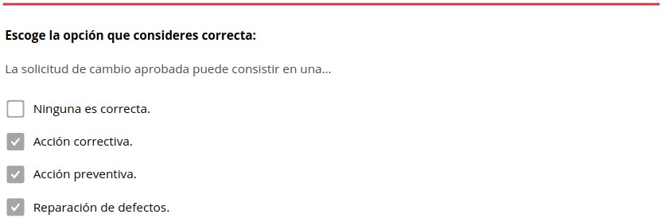
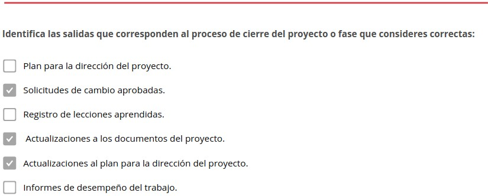
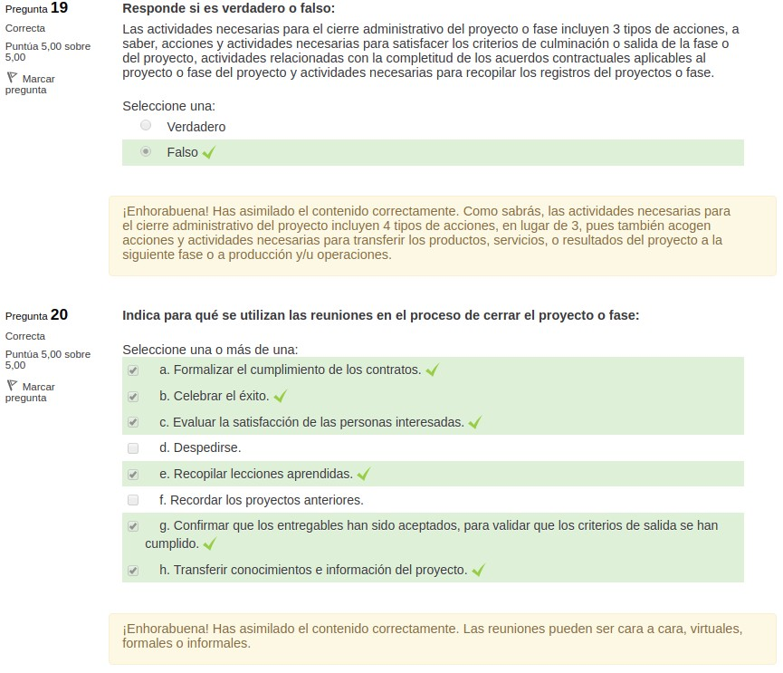

Grupo de materia: Integración
=============================

   Mapa conceptual de la estructura de la norma ISO 21500

1. Introducción a la materia. Integración
*****************************************

.. note:: La **gestión de la integración del proyecto** incluye los procesos y actividades para identificar, definir, combinar, unificar y coordinar los diversos procesos y actividades de dirección del proyecto dentro de los grupos de procesos de la dirección de proyectos.

En el contexto de la dirección de proyectos, la **integración** incluye **acciones de**:

- Unificación.
- Consolidación.
- Comunicación.
- Interrelación.

Estas acciones deberían aplicarse **desde el inicio del proyecto hasta su conclusión**.

La **gestión de la integración del proyecto** incluye **tomar decisiones sobre**:

- Asignación de recursos.
- Equilibrio de demandas que compiten entre sí.
- Examen de enfoques alternativos.
- Adaptación de los procesos para cumplir con los objetivos del proyecto.
- Gestión de las interdependencias entre las áreas de conocimiento de la dirección de proyectos.

Los **procesos** de gestión de la integración del proyecto **son**:

- **Desarrollar el acta de constitución del proyecto**: proceso de desarrollo de un documento que autoriza formalmente la existencia de un proyecto y confiere al director o directora del proyecto la autoridad para aplicar los recursos de la organización a las actividades del proyecto.
- **Desarrollar el plan para la dirección del proyecto**: proceso de definición, preparación y coordinación de todos los componentes del plan con el fin de consolidarlos en un plan integral para la dirección del proyecto.
- **Dirigir y gestionar el trabajo del proyecto**: proceso por el que se lidera y se lleva a cabo el trabajo definido en el plan para la dirección del proyectoy se implementan los cambios aprobados para alcanzar los objetivos del proyecto.
- **Gestionar el conocimiento del proyecto**: proceso en el que se utiliza el conocimiento existente y se crea nuevo conocimiento para alcanzar los objetivos del proyecto y contribuir al aprendizaje organizacional.
- **Monitorear y controlar el trabajo del proyecto**: proceso por el que se hace seguimiento, se revisa y se informa el avance general a fin de cumplir con los objetivos de desempeño definidos en el plan para la dirección del proyecto.
- **Realizar el control integrado de cambios**: proceso de revisión de todas las solicitudes de cambio, aprobación y gestión de los cambios a entregables, activos de los procesos de la organización, documentos del proyecto y del plan para la dirección del proyecto, y comunicación las decisiones.
- **Cerrar el proyecto o fase**: proceso de finalización de todas las actividades para el proyecto, fase o contrato.

1.1. Conceptos clave para la gestión de la integración del proyecto
+++++++++++++++++++++++++++++++++++++++++++++++++++++++++++++++++++

La gestión de la integración del proyecto es **específica para directores y directoras de proyecto**, mientras que otras áreas de conocimiento pueden ser gestionadas por especialistas como, por ejemplo, analistas de Costes, especialistas en programación o personas expertas en gestión de riesgos.

.. note:: El **trabajo de oficina** se define como el conjunto de las actividades laborales realizadas en ese entorno.

La **dirección de proyectos** combina los resultados en todas las otras áreas de conocimiento y tiene la visión general del proyecto. Es responsable en última instancia del proyecto en su conjunto.

Los proyectos y la dirección de proyectos **son integradores por naturaleza**. Por ejemplo, una estimación de Costes necesaria para un plan de contingencia implica la integración de los procesos de las áreas de conocimiento de gestión de los Costes del proyecto, gestión del cronograma del proyecto y gestión de los riesgos del proyecto.

La **gestión de la integración** del proyecto **tiene que ver con**:

- Asegurar que las fechas limite de los entregables del producto, servicio o resultado, del ciclo de vida del proyecto y del plan de gestión de beneficios estén alineadas.
- Proporcionar un plan para la dirección del proyecto a fin de alcanzar los objetivos.
- Asegurar la creación y el uso del conocimiento adecuado hacia y desde el proyecto, según sea necesario.
- Gestionar el desempeño y los cambios de las actividades en el plan para la dirección del proyecto.
- Tomar decisiones integradas relativas a los cambios clave que impactan al proyecto.
- Medir y monitorear el avance del proyecto y realizar las acciones adecuadas para cumplir con los objetivos del mismo.
- Recopilar datos sobre los resultados alcanzados, analizar los datos para obtener información y comunicar esta información a las partes interesadsa relevantes.
- Completar todo el trabajo del proyecto y cerrar formalmente cada fase, contrato y el proyecto en su conjunto.
- Gestionar las transiciones de fases, cuando sea necesario.
- Cuanto más complejo sea el proyecto y más variadas las expectativas de las partes interesadas, más se necesita un enfoque sofisticado de la integración.

1.2. Tendencias y prácticas emergentes en la gestión de la integración del proyecto
+++++++++++++++++++++++++++++++++++++++++++++++++++++++++++++++++++++++++++++++++++

El área de conocimiento de gestión de la integración del proyecto requiere **combinar los resultados de todas las otras áreas** de conocimiento.

La **evolución de tendencias en los procesos** de integración **incluye, entre otras cosas**:

- **Herramientas automatizadas**: el volumen de datos e información de proyecto que debe integrar la dirección, hace necesario el uso de un sistema de información para la dirección de proyectos, en inglés "Project Management Information System" (PMIS) y de herramientas automatizadas para recopilar, analizar y utilizar información de forma que se cumpla con los objetivos del proyecto y se alcancen los beneficios del mismo.
- **Herramientas visuales**: algunos equipos de proyecto usan herramientas visuales de gestión, en lugar de planes escritos y otros documentos, para captar y supervisar elementos críticos del proyecto. Hacer que los elementos clave del proyecto sean visibles para todo el equipo proporciona un panorama en tiempo real del estado del proyecto, facilita la transferencia de conocimientos y empodera al personal del equipo y a otras partes interesadas para ayudar a identificar y resolver incidentes.
- **Gestión del conocimiento**: la fuerza de trabajo cada vez más móvil y temporal requiere un proceso más riguroso para identificar el conocimiento a lo largo del ciclo de vida del proyecto y transferirlo a la audiencia objetivo de modo que el conocimiento no se pierda.
- **Aplicación de responsabilidades**: las directoras o directores de proyecto están llamados a iniciar y finalizar el proyecto, así coma a desarrollar el caso de negocio y la gestión de beneficios del proyecto. Históricamente estas actividades han sido responsabilidad de la gerencia y de la oficina de dirección de proyectos, pero la dirección de proyecto está colaborando más frecuentemente con ellas para cumplir mejor con los objetivos y entregar los beneficios. También se está dedicando a la identificación y el involucramiento más exhaustivos de las partes interesadas. Esto incluye gestionar las interfaces con distintos departamentos funcionales y operativos y con personal de alta dirección.
- **Metodologías híbridas**: algunas metodologías de dirección de proyectos están evolucionando para incorporar nuevas prácticas aplicadas con éxito. Entre los ejemplos se incluye el uso de:

	- Prácticas ágiles y otras prácticas iterativas.
	- Técnicas de análisis de negocio para la gestión de requisitos.
	- Herramientas para identificar elementos complejos en los proyectos.
	- Métodos de gestión de cambios organizacionales para prepararse para la transición de las salidas del proyecto a la organización.

1.3 Consideraciones de adaptación
+++++++++++++++++++++++++++++++++

.. note:: La adaptación es la actividad que realiza la dirección del proyecto en la que se seleccionan y adecuan los objetos que se van a utilizar en un proyecto específico.

Debido a que cada proyecto es único, la dirección del proyecto podría necesitar adaptar la forma en que se aplican los procesos de gestión de la integración del proyecto. Las **consideraciones para la adaptación** incluyen, entre otras:

- **Ciclo de vida del proyecto**: ¿Cuál es el ciclo de vida apropiado para el proyecto? ¿Qué fases debería comprender el ciclo de vida del proyecto?
- **Ciclo de vida del desarrollo**: ¿Qué enfoque y ciclo de vida de desarrollo son adecuados para el producto, servicio o resultado? ¿Es apropiado un enfoque predictivo o uno adaptativo? En caso de ser adaptativo, ¿el producto debería desarrollarse de manera incremental o iterativa? ¿Es mejor un enfoque hibrido?
- **Enfoques de gestión**: ¿Qué procesos de gestión son los más eficaces según la cultura de la organización y la complejidad del proyecto?
- **Gestión del conocimiento**: ¿Cómo se gestionará el conocimiento en el proyecto para fomentar un entorno de trabajo colaborativo?
- **Cambio**: ¿Cómo se gestionará el cambio en el proyecto?
- **Gobernanza**: ¿Qué juntas de control, comités y otras personas interesadas son parte del proyecto? ¿Cuáles son los requisitos de presentación de informes sobre el estado del proyecto?
- **Lecciones aprendidas**: ¿Qué información se debe recoger a lo largo y al final del proyecto? ¿Cómo quedarán disponibles para futuros proyectos la información histórica y las lecciones aprendidas?
- **Beneficios**: ¿Cuándo y cómo debería informarse sobre los beneficios: al final del proyecto o al final de cada iteración o fase?

1.4 Consideraciones para entornos ágiles/adaptativos
++++++++++++++++++++++++++++++++++++++++++++++++++++

Los **enfoques iterativos y ágiles** promueven el compromiso del personal del equipo como personas expertas locales en la gestión de la integración. Determinan cómo han de integrarse planes y componentes.

Las expectativas de la dirección del proyecto no cambian en un entorno adaptativo, pero el **control de la planificación** y la **entrega detallada** del producto **se delegan al equipo**.

La **dirección del proyecto** debe **establecer un entorno colaborativo** para la toma de decisiones y asegurar que el equipo tenga la capacidad de responder a los cambios.

Este **enfoque colaborativo** puede mejorarse aún más cuando el personal del equipo posee una base de habilidades amplia en lugar de una especialización especifica.

2. Desarrollar el acta de constitución del proyecto
***************************************************

.. note::
	El **desarrollo del acta de constitución del proyecto** pertenece al grupo de procesos de inicio. Es el proceso de elaboración del documento que autoriza formalmente la existencia de un proyecto y confiere al director o directora del mismo la autoridad para asignar los recursos de la organización a las actividades del proyecto.

	Los **beneficios clave** de este proceso son:

	- Proporcionar un vínculo directo entre el proyecto y los objetivos estratégicos de la organización.
	- Crear un registro formal del proyecto.
	- Mostrar el compromiso de la organización con el proyecto.

	Este proceso se lleva a cabo **una única vez o en puntos predefinidos del proyecto**.

+------------------------------------------------+---------------------------------------------+---------------------------------------+
| **Entradas**                                   | **Herramientas y Técnicas**                 | **Salidas**                           |
+------------------------------------------------+---------------------------------------------+---------------------------------------+
|                                                | 1. Juicio de expertos.                      |                                       |
|                                                | 2. Recopilación de datos:                   |                                       |
|                                                |                                             |                                       |
| 1. Documentos de negocio:                      |     - Tormenta de ideas                     |                                       |
|                                                |     - Grupos focales.                       |                                       |
|     - Caso de negocio.                         |     - Entrevistas.                          |                                       |
|     - Plan de gestión de beneficios.           |                                             | 1. Acta de constitución del proyecto. |
|                                                | 3. Habilidades interpersonales y de equipo: | 2. Registro de suspuestos.            |
| 2. Acuerdos.                                   |                                             |                                       |
| 3. Factores ambientales de la empresa.         |     - Gestión de conflictos.                |                                       |
| 4. Activos de los procesos de la organización  |     - Facilitación.                         |                                       |
|                                                |     - Gestión de reuniones.                 |                                       |
|                                                |                                             |                                       |
|                                                | 4. Reuniones.                               |                                       |
+------------------------------------------------+---------------------------------------------+---------------------------------------+

El **acta de constitución del proyecto** supone las siguientes **consideraciones**:

- Establece **una relación de colaboración** entre la organización ejecutora y la organización solicitante. En el caso de proyectos externos generalmente se opta por establecer este acuerdo a través de un contrato formal.
- **Inicia formalmente el proyecto**. Esto implica la selección y asignación de una directora o director del proyecto tan pronto como sea posible, preferiblemente durante la elaboración del acta y siempre antes de comenzar la planificación.
- Puede utilizarse para establecer **acuerdos internos** en el seno de una organización a fin de asegurar la entrega adecuada de acuerdo con el contrato.
- Puede ser **desarrollada por patrocinadores/as o por la dirección**, en colaboración con la entidad iniciadora. Esta colaboración permite que la dirección del proyecto tenga una mejor comprensión del propósito, los objetivos y los beneficios esperados del proyecto. Este entendimiento favorecerá una asignación eficiente de los recursos a las actividades del proyecto.

El acta de constitución del proyecto no se considera un contrato porque no hay consideraciones, compromisos o intercambios monetarios en su creación.

Los **proyectos** son iniciados por una **entidad externa** a los mismos, como, por ejemplo:

- Un programa.
- una persona patrocinadora.
- La presidencia de un órgano de gobierno del portafolio.
- Una persona representante autorizada.
- Una Oficina de Gestión de Proyectos (OGP).

La persona que inicia el proyecto debería encontrarse en un nivel adecuado para obtener la **financiación del proyecto y comprometer los recursos** para el mismo.

Los proyectos se inician como consecuencia de **necesidades internas de la empresa o de influencias externas**. Estas necesidades o influencias a menudo motivan la **realización de**:

- Un análisis de necesidades
- Un estudio de viabilidad
- Un caso de negocio
- Una descripción de la situación que abordará el proyecto

2.1. Entradas
+++++++++++++

En las **entradas del proceso de desarrollo del acta de constitución del proyecto** se pueden identificar:

1. Documentos de negocio:

	- Caso de negocio.
	- Plan de gestión de beneficios.

2. Acuerdos.
3. Factores ambientales de la empresa.
4. Activos de los procesos de la organización.

2.1.1. Documentos de negocio
----------------------------

Como se ha visto en la unidad didáctica anterior, los documentos de negocio los componen el **caso de negocio y el plan de gestión de beneficios**. Ambos son fuentes de información sobre de los objetivos del proyecto y sobre cómo el proyecto contribuirá a las metas de negocio. Si bien los documentos de negocio se desarrollan antes del proyecto, estos se revisan periódicamente.

.. note:: 
	El **caso de negocio** es el documento de negocio más comúnmente utilizado para crear el acta de constitución del proyecto. Sirve para definir los objetivos de un proyecto, la inversión requerida y los criterios financieros y cualitativos para el éxito del mismo. Así pues, proporciona la base para medir el éxito y el avance a lo largo del ciclo de vida del proyecto mediante la comparación de los resultados con los objetivos y los criterios de éxito identificados.

	El **plan de gestión de beneficios** describe el modo y el momento en que se entregarán los beneficios del proyecto y cómo se medirán los mismos.

Normalmente el caso de negocio se utiliza para la **toma de decisiones** por parte de la dirección o ejecución de un nivel superior al del proyecto. Típicamente, la necesidad de negocio y el análisis coste-beneficio se incluyen en el **caso de negocio** para justificar y establecer los limites del proyecto.

El **caso de negocio** se crea como resultado de una o más de las siguientes **razones**:

- **Demanda del mercado**: por ejemplo, una fábrica de automóviles que autoriza un proyecto para construir automóviles más eficientes en el consumo de combustible, en respuesta a la escasez de gasolina.
- **Necesidad de la organización**: por ejemplo, debido a los altos Costes generales una compañía puede combinar funciones del personal y racionalizar procesos para reducir Costes.
- **Solicitud de un cliente**: por ejemplo, una compañía eléctrica que autoriza un proyecto para construir una nueva subestación a fin de abastecer un nuevo parque industrial.
- **Avance tecnológico**: por ejemplo, una compañía aérea que autoriza un nuevo proyecto para desarrollar el billete electrónico y sustituir los billetes en papel, con base en los avances tecnológicos.
- **Requisito legal**: por ejemplo, una fábrica de pinturas que autoriza un proyecto para establecer guías para el manejo de materiales tóxicos.
- **Impactos ecológicos**: por ejemplo, una compañía que autoriza un proyecto para disminuir su impacto ambiental.
- **Necesidad social**: por ejemplo, una organización no gubernamental en un país en vías de desarrollo que autoriza un proyecto para dotar de sistemas de agua potable, letrinas y educación sanitaria a comunidades que padecen altos índices de cólera.

El acta de constitución del proyecto incorpora la información adecuada para el proyecto a partir de los documentos de negocio. La dirección del proyecto no actualiza ni modifica los documentos de negocio, ya que no son documentos del proyecto, sin embargo, puede hacer recomendaciones.

2.1.2. Acuerdos
---------------

.. note:: Los **acuerdos** se establecen para definir las intenciones iniciales de un proyecto. Normalmente se utilizan cuando el proyecto se lleva a cabo para un cliente externo.

Pueden tomar la **forma de**:

- Contratos.
- Memorandos de entendimiento (MDE).
- Acuerdos de nivel de servicio (ANS).
- Cartas de acuerdo.
- Declaraciones de intención.
- Acuerdos verbales.
- Correos electrónicos.
- Otros acuerdos escritos.

2.1.3. Factores ambientales de la empresa
-----------------------------------------

.. note:: Los **Factores Ambientales de la Empresa (FAE)** provienen del entorno externo al proyectoy, a menudo, fuera de la empresa. Hacen referencia a condiciones que no están bajo el control del equipo del proyecto y que influyen, restringen o dirigen el proyecto.

Como se ha visto en la unidad anterior, los **FAE** pueden influir en el proceso de desarrollo del acta de constitución del proyecto e **incluyen, entre otros**:

- **Estándares** gubernamentales o de la industria (por ejemplo, estándares del producto, estándares de calidad, estándares de seguridad y estándares de fabricación).
- **Requisitos** y/o restricciones legales y regulatorios.
- **Condiciones** del mercado.
- **Cultura** y el clima político de la organización.
- marco de **gobernanza** organizacional (una forma estructurada de proporcionar control, dirección y coordinación a través de personas, políticas y procesos, para cumplir con las metas estratégicas y operativas de la organización).
- **Expectativas** de las partes interesadas y los umbrales de riesgo.

2.1.4. Activos de los procesos de la organización
-------------------------------------------------

.. note:: Los **Activos de los Procesos de la Organización (APO)** son los planes, procesos, políticas, procedimientos y bases de conocimiento específicos de la organización ejecutora, utilizados por la misma. Son internos de la empresa y pueden surgir de un portafolio, un programa, otro proyecto o una combinación de todos ellos.

Los **activos de los procesos de la organización** también pueden influir en el proceso de desarrollo del acta de constitución del proyecto. **Incluyen, entre otros**:

- Políticas, procesos y procedimientos estándares de la organización.
- Marco de gobernanza para portafolios, programas y proyectos (funciones y procesos de gobernanza para proporcionar guia y toma de decisiones).
- Métodos de monitoreo e información.
- Plantillas (por ejemplo, la plantilla del acta de constitución del proyecto).
- Información histórica y el repositorio de lecciones aprendidas (por ejemplo, registros y documentos del proyecto, información sobre los resultados de las decisiones de selección de proyectos previos e información sobre el desempeño de proyectos previos).

2.2. Herramientas y técnicas
++++++++++++++++++++++++++++

En las herramientas y técnicas del proceso de desarrollo del acta de constitución del proyecto se pueden identificar:

1. Juicio de expertos.
2. Recopilación de datos:

	- Tormenta de ideas.
	- Grupos focales.
	- Entrevistas.

3.Habilidades interpersonales y de equipo:

	- Gestión de conflictos.
	- Facilitación.
	- Gestión de reuniones.

4. Reuniones.

2.2.1. Juicio de expertos
-------------------------

.. note:: El **juicio de expertos** se define como el dictamen que se brinda sobre la base de la experiencia en un área de aplicación, área de conocimiento, disciplina, industria, etc., según resulte apropiado para la actividad que se está ejecutando.

Dicha pericia puede ser **proporcionada por** cualquier grupo o persona con educación, conocimiento, habilidad, experiencia o capacitación especializada. Para este proceso, se debería considerar la pericia de personas o grupos con capacitación o **conocimientos especializados** en los siguientes **temas**:

- Estrategia organizacional.
- Gestión de beneficios.
- Conocimientos técnicos de la industria y el área de especialización del proyecto.
- Estimación de la duración y el presupuesto.
- Identificación de riesgos.

2.2.2. Recopilación de datos
----------------------------

Las **técnicas de recopilación de datos** que pueden utilizarse para este proceso **incluyen, entre otras**:

- **Tormenta de ideas**: técnica que se utiliza para identificar una lista de ideas en un corto periodo de tiempo. Se lleva a cabo en un entorno de grupo y es liderada por una persona facilitadora. La tormenta de ideas comprende dos partes: generación de ideas y análisis. La tormenta de ideas puede utilizarse para recopilar datos y soluciones o ideas a partir de las personas interesadas, expertas en la materia y personal del equipo al desarrollar el acta de constitución del proyecto.
- **Grupos focales**: reúnen a las personas interesadas y expertas en la materia para conocer sobre el riesgo percibido del proyecto, los criterios de éxito y otros temas de un modo más coloquial que una entrevista individual.
- **Entrevistas**: se utilizan para obtener información sobre requisitos de alto nivel, supuestos o restricciones, criterios de aprobación y demás información a partir de las partes interesadas mediante el diálogo directo con ellas.

2.2.3. Habilidades interpersonales y de equipo
----------------------------------------------

Las **habilidades interpersonales y de equipo** que pueden utilizarse para este proceso **incluyen, entre otras**:

- **Gestión de conflictos**: puede utilizarse para ayudar a alinear a las personas interesadas con respecto a los objetivos, criterios de éxito, requisitos de alto nivel, descripción del proyecto, resumen de hitos y otros elementos del acta de constitución.
- **Facilitación**: es la capacidad de guiar eficazmente un evento grupal hacia una decisión, solución o conclusión exitosa. El facilitador o facilitadora garantiza que:

	- La una participación sea eficaz.
	- Los/as participantes logren un entendimiento mutuo.
	- Se consideren todas las contribuciones.
	- Las conclusiones o los resultados tengan plena aceptación según el proceso de decisión establecido para el proyecto.
	- Las acciones y los acuerdos alcanzados sean abordados luego de manera adecuada.

- **Gestión de reuniones**: incluye preparar la agenda, asegurarse de invitar a una persona representante de cada grupo clave de las partes interesadas y preparar y enviar el acta y las acciones de seguimiento. Para este proceso, se mantienen reuniones con personas interesadas clave para identificar:

	- Objetivos.
	- Criterios de éxito.
	- Entregables clave.
	- Requisitos de alto nivel.
	- Resumen de hitos.
	- Otra información resumida del proyecto.

2.3. Salidas
++++++++++++

En las **salidas** del proceso de **desarrollo del acta de constitución del proyecto** se pueden identificar:

1. Acta de constitución del proyecto.
2. Registro de supuestos.

2.3.1. Acta de constitución del proyecto
----------------------------------------

.. note:: El **desarrollo del acta de constitución del proyecto** es el proceso de elaboración del documento que autoriza formalmente la existencia de un proyecto y confiere al director o directora del mismo la autoridad para asignar los recursos de la organización a las actividades del proyecto.

**Documenta la información** de alto nivel acerca del proyecto y del producto, semicio o resultado que el proyecto pretende satisfacer, **tal como**:

- El propósito del proyecto.
- Los objetivos medibles del proyecto y los criterios de éxito asociados.
- Los requisitos de alto nivel.
- La descripción de alto nivel del proyecto, los límites y los entregables clave.
- El riesgo general del proyecto.
- El resumen del cronograma de hitos.
- Los recursos financieros preaprobados.
- La lista de partes interesadas clave.
- Los requisitos de aprobación del proyecto (es decir, en qué consiste el éxito del proyecto, quién decide si el proyecto tiene éxito y quién firma la aprobación del proyecto).
- Los criterios de salida del proyecto (es decir, qué condiciones deben cumplirse a fin de cerrar o cancelar el proyecto o fase).
- La asignación de la dirección del proyecto, su responsabilidad y su nivel de autoridad.
- El nombre y el nivel de autoridad de la persona patrocinadora o de quienes autorizan el acta de constitución del proyecto.

A un alto nivel, el acta de constitución del proyecto asegura una comprensión común por parte de las partes interesadas de los entregables clave, los hitos y los roles y responsabilidades de todas las personas involucradas en el proyecto.

3. Desarrollar el plan para la dirección del proyecto
*****************************************************

.. note:: 
	El **desarrollo del plan para la dirección del proyecto** es el proceso de definir, preparar y coordinar todos los componentes y consolidarlos en un plan integral para la dirección del proyecto.

	El **plan para la dirección del proyecto (PDP)** es el documento principal para la dirección del proyecto, ya que establece qué, cuándo y quién reliza las tareas del proyecto.

	El **beneficio clave** de este proceso es la producción de un documento integral que define la base para todo el trabajo del proyecto y el modo en que se realizará el trabajo.

	Este proceso se lleva a cabo **una única vez o en puntos predefinidos del proyecto**.

+-------------------------------------------------+---------------------------------------------+----------------------------------------+
| **Entradas**                                    | **Herramientas y Técnicas**                 | **Salidas**                            |
+-------------------------------------------------+---------------------------------------------+----------------------------------------+
|                                                 | 1. Juicio de expertos.                      |                                        |
|                                                 | 2. Recopilación de datos:                   |                                        |
|                                                 |                                             |                                        |
|                                                 |     - Tormenta de ideas.                    |                                        |
|                                                 |     - Lista de verificación.                |                                        |
| 1. Acta de constitución del proyecto.           |     - Grupos focales.                       |                                        |
| 2. Salidas a otros procesos.                    |     - Entrevistas.                          |                                        |
| 3. Factores ambientales.                        |                                             | 1. Plan para la dirección del proyecto |
| 4. Activos de los procesos de la organización.  | 3. Habilidades interpersonales y de equipo: |                                        |
|                                                 |                                             |                                        |
|                                                 |     - Gestión de conflictos.                |                                        |
|                                                 |     - Facilitación.                         |                                        |
|                                                 |     - Gestión de reuniones.                 |                                        |
|                                                 |                                             |                                        |
|                                                 | 4. Reuniones.                               |                                        |
+-------------------------------------------------+---------------------------------------------+----------------------------------------+

El **plan para la dirección del proyecto** supone las siguientes **consideraciones**:

- Define la manera en que el proyecto se ejecuta, se monitorea, se controla y se cierra.
- Su contenido varía en función del área de aplicación y de la complejidad del proyecto.
- Puede presentarse en forma resumida o detallada. Cada plan componente se describe hasta el nivel que lo requiera el proyecto específico.
- Debe ser lo suficientemente robusto para responder al entorno siempre cambiante del proyecto. Esta agilidad puede dar lugar a información más precisa conforme avanza el proyecto.
- Deben definirse las líneas base del plan, es decir, es necesario definir al menos las referencias del proyecto en cuanto al alcance, tiempo y coste, de modo que la ejecución del proyecto pueda ser medida y comparada con esas referencias y que se pueda gestionar el desempeño.
- Antes de definir las líneas base, el plan puede actualizarse tantas veces como sea necesario. No se requiere ningń proceso formal en ese momento.
- Una vez que las líneas base del mismo han sido definidas, el plan solo podrá ser modificado a través del proceso de realización del control integrado de cambios. En consecuencia, siempre que se solicite un cambio, se generarán y decidirán solicitudes de cambio.

Esto resulta en un plan que **se elabora progresivamente por medio de actualizaciones controladas y aprobadas** que se extienden hasta el cierre del proyectp. Los proyectos que se encuentran en el ámbito de un programa o portafolio deberían desarrollar un **plan para la dirección del proyecto coherente** con el plan para la dirección del programa o portafolio correspondiente.

Por ejemplo, si el plan para la dirección del programa indica que todos los cambios que excedan un coste determinado deberán ser revisados por el comie de control de cambios, en inglés, *Change Control Board* (CCB), se deberá definir este proceso y el umbral de coste correspondiente en el plan para la dirección del proyecto.

3.1. Entradas
+++++++++++++

En las **entradas** del proceso de **desarrollo del plan para la dirección del proyecto** se pueden identificar:

1. Acta de constitución del proyecto.
2. Salidas a otros procesos.
3. Factores ambientales.
4. Activos de los procesos de la organización.

3.1.1. Acta de constitución del proyecto
----------------------------------------

El equipo del proyecto utiliza el acta de constitución del proyecto como **punto de partida para la planificación inicial** del proyecto.

El tipo y cantidad de **información del acta** de constitución del proyecto varía en función de la complejidad del proyecto y de la información que se conoce en el momento de su creación.

El **acta de constitución del proyecto** debería como mínimo definir la información de alto nivel acerca del proyecto, que se desarrollará en los distintos componentes del plan para la dirección del proyecto.

3.1.2. Salidas de otros procesos
--------------------------------

Las **salidas** de muchos de los otros procesos se integran para crear el plan para la dirección del proyecto.

Los planes subsidiarios y líneas base que constituyen una entrada para este proceso. Además, los cambios realizados sobre estos documentos pueden requerir actualizaciones al plan para la dirección del proyecto

3.1.3. Factores ambientales de la empresa
-----------------------------------------

Los **factores ambientales de la empresa** que pueden influir en el proceso de desarrollar el plan para la dirección del proyecto **incluyen, entre otros**:

- Estándares gubernamentales o de la industria (por ejemplo, estándares del producto, estándares de calidad, estándares de seguridad y estándares de fabricación).
- Requisitos y/o restricciones legales y regulatorios.
- Fundamentos para la dirección de proyectos específicos para el mercado vertical.

3.1.4. Activos de los procesos de la organización
-------------------------------------------------

Los **activos de los procesos de la organización** que pueden influir en el proceso de desarrollo del plan para la dirección del proyecto **incluyen, entre otros**:

- **Procesos**: Políticas, procesos y procedimientos estándares de la organización.
- **Plan**: Plantilla del plan para la dirección del proyecto.
- **Guía**: Guías y criterios para adaptar el conjunto de procesos estándar de la organización con el fin de que satisfagan las necesidades especificas del proyecto.
- **Requisitos**: Guías o requisitos para el cierre del proyecto, tales como los criterios de validación y aceptación del producto.
- **Procedimientos**: Procedimientos de control de cambios, incluidos los pasos para modificar los estándares, políticas, planes, procedimientos oficiales de la organización o cualquier documento del proyecto y la descripción de cómo se aprobará y validará cualquiercambio.
- **Métodos**: Métodos de monitoreo e información, los procedimientos de control de riesgos y los requisitos de comunicación.
- **Información**: Información de proyectos anteriores similares (por ejemplo, lineas base del alcance, coste, cronograma y medición del desempeño, calendarios del proyecto, diagramas de red del cronograma del proyecto y registros de riesgos) e Información histórica y repositorio de lecciones aprendidas.

3.2. Herramientas y técnicas
++++++++++++++++++++++++++++

En las **herramientas y técnicas** del proceso de **desarrollo del plan para la dirección del proyecto** se pueden identificar:

1. Juicio de expertos.
2. Recopilación de datos:

	- Tormenta de ideas.
	- Listas de verificación.
	- Grupos focales.
	- Entrevistas.

3. Habilidades interpersonales y de equipo:

	- Gestión de conflictos.
	- Facilitación.
	- Gestión de reuniones.

4. Reuniones.

3.2.1. Juicio de expertos
-------------------------

Se debería considerar la pericia de las personas o grupos con **capacitación o conocimientos especializados para**:

- Adaptar los procesos de la dirección para satisfacer las necesidades del proyecto, incluyendo las dependencias e interacciones entre dichos procesos y las entradas y salidas fundamentales.
- Desarollar componentes adicionales del plan para la dirección del proyecto, si fuera necesario.
- Determinar las herramientas y técnicas que se utilizarán para llevar a cabo esos procesos.
- Desarrollar los detalles técnicos y de gestión que se incluirán en el plan para la dirección del proyecto.
- Determinar los recursos y los niveles de habilidad necesarios para llevar a cabo el trabajo del proyecto.
- Determinar el nivel de gestión de la configuración que se aplicará al proyecto.
- Determinar qué documentos del proyeto estarán sujetos al proceso formal de control de cambios.
- Priorizar el trabajo del proyecto para asegurar que los recursos del proyecto se asignan al trabajo adecuado en el momento adecuado.

3.2.2. Recopilación de datos
----------------------------

Las **técnicas de recopilación de datos** que pueden utilizarse para este proceso **incluyen entre otras**:

- **Tormenta de ideas**: se utiliza frecuentemente al desarrollar el plan para la dirección del proyecto a fin de recopilar ideas y soluciones sobre el enfoque del proyecto. Los participantes a incluir son el personal del equipo del proyecto, aunque otras personas expertas en la materia o interesadas también pueden participar.
- **Grupos focales**: Reúnen a las personas interesadas para analizar el enfoque de dirección del proyecto y la integración de los diferentes componentes del plan para la dirección del proyecto.
- **Entrevistas**: las entrevistas se utilizan para obtener información específica de las personas interesadas a fin de desarrollar el plan para la dirección del proyecto o cualquier componente del plan o documento del proyecto.
- **Listas de verificación**: muchas organizaciones disponen de listas de verificación estandarizadas en base a su propia experiencia o utilizan listas de verificación de la industria. Una lista de verificación puede guiar a la dirección del proyecto en el desarrollo del plan o puede ayudar a verificar que toda la información requerida esté incluida en el plan para la dirección del proyecto.

3.2.3. Habilidades interpersonales y de equipo
----------------------------------------------

Las **habilidades interpersonales y de equipo** que se utilizan al desarrollar el plan para la dirección del proyecto **incluyen**:

- **Gestión de conflictos**: necesaria para alinear a las diversas partes interesadas con respecto a todos los aspectos del plan para la dirección del proyecto.
- **Facilitación**: garantiza que haya una participación efectiva, que los participantes logren un entendimiento mutuo, que se consideren todas las contribuciones y que las conclusiones o los resultados tengan plena aceptación según el proceso de decisión establecido para el proyecto.
- **Gestión de reuniones**: necesaria para asegurar que las numerosas reuniones requeridas para desarrollar, unificar y llegar a un acuerdo sobre el plan para la dirección del proyecto se realicen adecuadamente.

3.2.4. Reuniones
----------------

Para este proceso, las reuniones **se utilizan para**:

- Analizar el enfoque del proyecto.
- Determinar el modo en que se ejecutará el trabajo para alcanzar los objetivos del proyecto.
- Establecer la manera en que se monitorearáy controlará el proyecto.

La **reunión de lanzamiento del proyecto** normalmente está asociada al final de la planificación y al comienzo de la ejecución. Su **propósito** es el de:

- Comunicar los objetivos del proyecto.
- Lograr el compromiso del equipo.
- Explicar los roles y responsabilidades de cada parte interesada.

Los proyectos de fases múltiples normalmente incluyen una reunión de lanzamiento al comienzo de cada fase.

El **lanzamiento** puede ocurrir en diferentes momentos **dependiendo de las características del proyecto**, esto es, si son proyectos pequeños o grandes:
 
- **Pequeños**: generalmente existe un único equipo que realiza la planificación y la ejecución. En este caso, el lanzamiento ocurre poco después de la iniciación, en el grupo de procesos de planificación, porque el equipo está involucrado en la planificación.
- **Grandes**: un equipo de dirección del proyecto normalmente realiza la mayor parte de la planificación y el resto del equipo del proyecto es incorporado una vez finalizada la planificación inicial, al comienzo del desarrollo/implementación. En esta ocasión, la reunión de lanzamiento tiene lugar con procesos del grupo de procesos de ejecución.

3.3. Salidas
++++++++++++

En las salidas de este proceso se puede identificar el plan para la dirección del proyecto.

.. note:: El **plan para la dirección del proyecto** es el documento que describe el modo en que el proyecto será ejecutado, monitoreado y controlado, y cerrado. Integra y consolida todos los planes de gestión y lineas base subsidiarias y demás información necesaria para dirigir el proyecto.

Las necesidades del proyecto determinan qué componentes del plan para la dirección del proyecto son necesarios. Los **componentes del plan para la dirección del proyecto incluyen**, entre otros:

- Componentes adicionales
- Líneas base
- Planes de gestión subsidiarios

3.3.1. Componentes adicionales
------------------------------

La mayoría de los componentes del plan para la dirección del proyecto se producen como salidas de otros procesos, aunque algunos se producen durante este proceso. Los componentes desarrollados como parte de este proceso dependerán del proyecto, sin embargo, a menudo **incluyen, entre otros**:

- **Plan de gestión de cambios**: describe el modo en que se autorizarán e incorporarán formalmente las solicitudes de cambio a lo largo del proyecto.
- **Plan de gestión de la configuración**: describe la manera en que la información sobre los elementos del proyecto, así como cuáles elementos, serán registrados y actualizados de modo que el producto, servicio o resultado del proyecto se mantenga consistente y/u operativo.
- **Línea base para la medición del desempeño**: un plan integrado a nivel de alcance-cronograma-coste para el trabajo del proyecto, con el cual se compara la ejecución del proyecto para medir y gestionar el desempeño.
- **Ciclo de vida del proyecto**: describe la serie de fases por las que atraviesa un proyecto desde su inicio hasta su cierre.
- **Enfoque de desarrollo**: describe el enfoque de desarrollo del producto, servicio o resultado, tal como un modelo predictivo, iterativo, ágil o hibrido.
- **Revisiones de la gestión**: identifica los puntos del proyecto en que la dirección del proyecto y las personas interesadas relevantes revisarán el avance del proyecto para determinar si el desempeño es el esperado, o si son necesarias acciones preventivas o correctivas.

3.3.2. Líneas base
------------------

Incluyen las **líneas base de**:

- **Alcance**: versión aprobada de un enunciado del alcance, estructura de desglose del trabajo (EDT/WBS)y su diccionario de la EDT/WBS asociado, que se utiliza como una base de comparación.
- **Cronograma**: versión aprobada del modelo de programación que se utiliza como base de comparación con los resultados reales.
- **Costes**: versión aprobada del presupuesto del proyecto con fases de tiempo que se utiliza como base de comparación con los resultados reales.

3.3.3. Planes de gestión subsidiarios
-------------------------------------

Incluyen los **planes de gestión de**:

- **Alcance**: establece el modo en que el alcance será definido, desarrollado, monitoreado, controlado y validado.
- **Requisitos**: establece cómo se analizarán, documentarán y gestionarán los requisitos.
- **Cronograma**: establece los criterios y las actividades a llevar a cabo para desarrollar, monitorear y controlar el cronograma.
- **Costes**: establece la forma en que se planificaran, estructurarán y controlarán los Costes.
- **Calidad**: establece la forma en que las políticas, metodologías y estándares de  calidad de una organización se implementarán en el proyecto.
- **Recursos**: proporciona una guía sobre cómo se deberían categorizar, asignar, gestionar y liberar los recursos del proyecto.
- **Comunicaciones**: establece cómo, cuándo y por medio de quién se administrará y difundirá la información del proyecto.
- **Riesgos**: establece el modo en que se estructurarán y se llevarán a cabo las actividades de gestión de riesgos.
- **Adquisiciones**: establece cómo el equipo del proyecto adquirirá bienes y servicios desde fuera de la organización ejecutante.
- **Interesados**: establece cómo se involucrará a las partes interesadas en las decisiones y la ejecución del proyecto, según sus necesidades, intereses e impacto.

Aunque el plan para la dirección del proyecto es uno de los documentos principales que se utilizan para la gestión de un proyecto, se utilizan **otros documentos**. Estos no forman parte del plan para la dirección del proyecto, no obstante, son **necesarios para dirigir el proyecto de manera efectiva**.

4. Dirigir y gestionar el trabajo del proyecto
**********************************************

.. note::
	La **dirección y gestión del trabajo** del proyecto consiste en liderar y llevar a cabo el trabajo definido en el plan para la dirección del proyecto e implementar los cambios aprobados para alcanzar los objetivos del proyecto.

	El **beneficio clave** de este proceso es que proporciona la dirección general del trabajo y los entregables del proyecto, mejorando así la probabilidad de éxito del proyecto.

	Este proceso se lleva a cabo **de manera continua a lo largo de todo el proyecto**.

+-------------------------------------------------+-----------------------------------------------------------+----------------------------------------------------------------------+
| **Entradas**                                    | **Herramientas y Técnicas**                               | **Salidas**                                                          |
+-------------------------------------------------+-----------------------------------------------------------+----------------------------------------------------------------------+
| 1. Plan para la dirección del proyecto:         | 1. Juicio de expertos.                                    |                                                                      |
|                                                 | 2. Sistema de información para la dirección de proyectos. | 1. Entregables.                                                      |
|                                                 | 3. Reuniones.                                             | 2. Datos de desempeño del trabajo.                                   |
|    - Cualquier componente.                      |                                                           | 3. Registro de incidencias.                                          |
|                                                 |                                                           | 4. Solicitudes de cambio.                                            |
|                                                 |                                                           | 5. Actualizaciones al plan para la dirección del proyecto:           |
| 2. Documentos del proyecto.                     |                                                           |                                                                      |
|                                                 |                                                           |     - Cualquier componente.                                          |
|    - Registro de cambios.                       |                                                           |                                                                      |
|    - Registro de lecciones aprendidas.          |                                                           | 6. Actualizaciones a los documentos del proyecto:                    |
|    - Lista de hitos.                            |                                                           |                                                                      |
|    - Comunicaciones del proyecto.               |                                                           |     - Lista de actividades.                                          |
|    - Cronograma del proyecto.                   |                                                           |     - Registros de supuestos.                                        |
|    - Matriz de trazabilidad de requisitos.      |                                                           |     - Registro de lecciones aprendidas.                              |
|    - Registro de riesgos.                       |                                                           |     - Documentación de requisitos.                                   |
|    - Informe de riesgos.                        |                                                           |     - Registro de riesgos.                                           |
|                                                 |                                                           |     - Registro de interesados.                                       |
| 3. Solicitudes de cambio aprobadas.             |                                                           |                                                                      |
| 4. Factores ambientales de la empresa.          |                                                           | 7. Actualizaciones a los activos de los procesos de la organización. |
| 5. Activos de los procesos de la organización.  |                                                           |                                                                      |
|                                                 |                                                           |                                                                      |
+-------------------------------------------------+-----------------------------------------------------------+----------------------------------------------------------------------+

Dirigir y gestionar el trabajo del proyecto **supone**:

- Ejecutar las actividades planificadas del proyecto para completar los entregables del mismo y alcanzar los objetivos establecidos.
- Asignar los recursos disponibles, gestionar su uso eficiente y llevar a cabo los cambios en los planes del proyecto que provienen de analizar datos e información de desempeño del trabajo.
- Revisar el impacto de todos los cambios del proyecto y la implementación de los cambios aprobados, que abarcan: acción correctiva, acción preventiva y/o reparación de defectos.

El proceso de dirección y gestión del trabajo del proyecto se ve directamente afectado por el **área de aplicación del proyecto**. Los **entregables** se producen como salidas de los procesos realizados para cumplir con el trabajo tal como fue planificado y programado en el plan para la dirección del proyecto.

La **dirección del proyecto,** junto con el **equipo de dirección**, dirige el desempeño de las actividades planificadas del proyecto y gestiona las diversas interfaces técnicas y de la organización que existen en el proyecto.

Durante la ejecución del proyecto se recopilan los **datos de desempeño del trabajo** y se comunican a los procesos de control aplicables para su análisis. El **análisis de los datos** proporciona información relativa al estado de completitud de los entregables y otros detalles relevantes sobre el desempeño del proyecto.

Los datos de desempeño del trabajo **se utilizarán también como entrada** para el grupo de procesos de monitoreo y control, y pueden emplearse como retroalimentación a las lecciones aprendidas para mejorar el desempeño de paquetes de trabajo futuros.

4.1. Entradas
+++++++++++++

Las **entradas** del proceso de **dirección y gestión del trabajo del proyecto** son:

1. Plan para la dirección del proyecto:

	- Cualquier componente.

2. Documentos del proyecto:

	- Registro de cambios.
	- Registro de lecciones aprendidas.
	- Lista de hitos.
	- Comunicaciones del proyecto.
	- Cronograma del proyecto.
	- Matriz de trazabilidad de requisitos.
	- Registro de riesgos.
	- Informa de riesgos.

3. Solicitudes de cambio aprobadas.
4. Factores ambientales de la empresa.
5. Activos de los procesos de la organización.

4.1.1. Documentos del proyecto
------------------------------

Los **documentos del proyecto** que pueden considerarse como entradas de este proceso **incluyen, entre otros**:

	- **Registro de cambios**: Contiene el estado de todas las solicitudes de cambio.
	- **Registro de lecciones aprendidas**: Las lecciones aprendidas se utilizan para mejorar el desempeño del proyecto y para evitar repetir errores. El registro ayuda a identificar dónde establecer reglas o guias para que las acciones del equipo estén alineadas.
	- **Lista de hitos**: Muestra las fechas programadas para hitos específicos.
	- **Comunicaciones del proyecto**: Incluyen informes de desempeño, el estado de los entregables y demás información generada por el proyecto.
	- **Cronograma del proyecto**: Incluye al menos la lista de actividades de trabajo, sus duraciones, recursos y fechas planificadas de inicio y finalización.
	- **Matriz de trazabilidad**: Vincula los requisitos del producto con los entregables que los satisfacen y ayuda a centrarse en los resultados finales.
	- **Registros de riesgos**: Proporciona información sobre las amenazas y oportunidades que podrían tener impacto en la ejecución del proyecto.
	- **Informe de riesgos**: Proporciona información sobre las fuentes de riesgo general del proyecto, junto con información resumida sobre los riesgos individuales identificados en el proyecto.

4.1.2. Solicitudes de cambio aprobadas
--------------------------------------

Las **solicitudes de cambio aprobadas son una salida del proceso** de realización del control integrado de cambios. Incluyen las solicitudes revisadas y aprobadas para su implementación por la dirección del proyecto o por un comité de control de cambios, cuando corresponda.

La solicitud de cambio aprobada puede consistir en una:

- Acción correctiva.
- Acción preventiva.
- Reparación de defectos.

Se **planifican e implementan** por parte del **equipo del proyecto y pueden**:

- Tener impacto sobre cualquier área del proyecto o del plan para la dirección del proyecto.
- Modificar los componentes del plan para la dirección del proyecto o los documentos del proyecto formalmente controlados.

4.1.3. Factores ambientales de la empresa
-----------------------------------------

Los **factores ambientales de la empresa** que pueden influir en el proceso de dirección y gestión del trabajo del proyecto **incluyen, entre otros**:

- Estructura y cultura de la organización, prácticas de gestión y sostenibilidad.
- Infraestructura (por ejemplo, instalaciones existentes y bienes de capital).
- Umbrales de riesgos de las partes interesadas (por ejemplo, el porcentage de sobrecostes permitido).

4.1.4. Activos de los procesos de la organización
-------------------------------------------------

Los **activos de los procesos de la organización** que pueden influir en el proceso de dirección y gestión del trabajo del proyecto **incluyen, entre otros**:

- Políticas, procesos y procedimientos estándares de la organización.
- Procedimientos para la gestión de incidentes y defectos que definen el control de incidentes y defectos, la identificación y resolución de los mismos, así como el seguimiento de los elementos de acción.
- Bases de datos sobre la gestión de incidentes y defectos, que contienen el estado histórico de los mismos, resolución de los incidentes y defectos, así como los resultados de las acciones emprendidas.
- Base de datos para la medición del desempeño, que se utiliza para recopilar y tener disponibles los datos de mediciones de procesos y productos.
- Los procedimientos de control de cambios y de control de riesgos.
- Información de proyectos anteriores (por eJemplo, líneas base del alcance, coste, cronograma, medición del desempeño, calendarios del proyecto, diagramas de red del cronograma del proyecto, registros de riesgos, informes de riesgos y repositorio de lecciones aprendidas).

4.2. Herramientas y técnicas
++++++++++++++++++++++++++++

En las **herramientas y técnicas** del proceso de **dirección y gestión del trabajo del proyecto** se pueden identificar:

- Juicio de expertos.
- Sistema de información para la dirección de proyectos.
- Reuniones.

4.2.1. Juicio de expertos
-------------------------

Se debería considerar la pericia de las personas o grupos con **capacitación o conocimientos especializados en los siguientes temas**:

- Conocimientos técnicos sobre la industria y el área de especialización del proyecto.
- Gestión de Costes y presupuestos.
- Asuntos legales y adquisiciones.
- Legislación y regulaciones.
- Gobernanza organizacional.

4.2.2. Sistemas de información para la dirección de proyecto
------------------------------------------------------------

El sistema de información para la dirección de proyectos proporciona acceso a:

- Herramientas de tecnología informática.
- Herramientas de soft%'are para programación.
- Sistemas de autorización de trabajo.
- Sistemas de gestión de la configuración.
- Sistemas de recopilación y distribución de la información.
- Interfaces a otros sistemas automáticos en línea como repositorios de bases de conocimiento corporativas.

La **automatización de la recopilación y el informe** de los indicadores clave de desempeño, en inglés, key performance indicator (KPI) también pueden formar parte de este sistema.

4.2.3. Reuniones
----------------

Las **reuniones** se utilizan para discutir y abordar los asuntos pertinentes del proyecto durante la dirección y gestión del trabajo del proyecto.

Los **asistentes** pueden incluir a la dirección del proyecto, al equipo del proyecto y a las personas interesadas del proyecto, involucradas o afectadas por los asuntos tratados.

Cada asistente debería tener un rol establecido, de modo que se asegure la participación adecuada. **Entre los tipos dereuniones se incluyen**:

- De lanzamiento.
- Técnicas.
- De planificación de iteraciones.
- Sprints
- Diarias de pie de Scrum.
- De grupo de dirección.
- De resolución de problemas.
- De actualización del avance.
- Retrospectivas.

4.3. Salidas
++++++++++++

En las salidas del proceso de dirección y gestión del trabajo del proyecto se pueden identificar:

1. Entregables.
2. Datos de desempeño del trabajo.
3. Registro de incidencias.
4. Solicitudes de cambio.
5. Actualizaciones al plan para la dirección del proyecto:

	- Cualquier componente.

6. Actualizaciones a los documentos del proyectos:

	- Lista de actividades.
	- Registro de supuestos.
	- Registro de lecciones aprendidas.
	- Documentación de requisitos.
	- Registro de riesgos.
	- Registro de interesados.

7. Actualizaciones a los activos de los procesos de la organización.

4.3.1. Entregables
------------------

..  note:: Un **entregable** es cualquier producto, resultado o capacidad única y verificable para ejecutar un servicio que se produce para completar un proceso, una fase o un proyecto. Por lo general, los entregables son los resultados del proyecto y pueden incluir componentes del plan para la dirección del proyecto.

Una vez completada la primera versión de un entregable, debería aplicarse el **control de cambios**. El control de las múltiples versiones o ediciones de un entregable (por ejemplo, documentos, software y elementos constitutivos) es apoyado por **herramientas y procedimientos de gestión de la  configuración**.

4.3.2. Datos de desempeño del trabajo
-------------------------------------

.. note:: Los datos de desempeño del trabajo son las observaciones y mediciones brutas identificadas durante las actividades ejecutadas para llevar a cabo el trabajo del proyecto.

Los **datos** se consideran a menudo como el nivel más bajo de detalle del que pueden extraer información otros procesos. **Se recopilan a través de la ejecución de los trabajos** y se pasan a los procesos de control para su posterior análisis.

Entre los **ejemplos de datos** de desempeño del trabajo se **incluyen, entre otros**:

- El trabajo completado.
- Los indicadores clave de desempeño.
- Las medidas de desempeño técnico.
- Las fechas reales de comienzo y finalización de las actividades planificadas.
- Los puntos de historia completados.
- El estado de los entregables.
- El número de solicitudes de cambio de avance del cronograma.
- El número de defectos.
- Los Costes reales incurridos.
- Las duraciones reales.

4.3.3. Registro de incidentes
-----------------------------

.. note:: El **registro de incidentes** es un documento del proyecto en el que se registra y da seguimiento a todos los incidentes.

A lo largo del ciclo de vida de un proyecto, la **dirección del proyecto** normalmente enfrentará problemas, brechas, inconsistencias o conflictos que ocurren de manera inesperada y que requieren alguna acción para que no impacten el desempeño del proyecto.

Es por esto que se crea el **registro de incidentes**, que atiende a las siguientes **características**:

- Se crea por primera vez como una salida de este proceso, aunque pueden ocurrir incidentes en cualquier momento del proyecto.
- Se actualiza como resultado de las actividades de monitoreo y control a lo largo del ciclo de vida del proyecto.
- Ayudará a la dirección del proyecto a realizar el seguimiento y la gestión de los incidentes de manera efectiva, asegurando que sean investigados y resueltos

Los **datos sobre los incidentes** pueden incluir:

- Tipo de incidente.
- Quién planteó el incidente y cuándo.
- Descripción.
- Prioridad.
- Quién está asignado al incidente.
- Fecha límite de resolución.
- Estado.
- Solución final.

4.3.4. Solicitudes de cambio
----------------------------

.. note:: Una **solicitud de cambio** es una propuesta formal para modificar cualquier documento, entregable o línea base.

Cuando se detectan problemas durante la ejecución del trabajo del proyecto, se pueden presentar **solicitudes de cambio que pueden modificar**:

- Políticas o los procedimientos del proyecto.
- Alcance del proyecto o del producto.
- Coste o el presupuesto del proyecto.
- Cronograma del proyecto.
- Calidad del proyecto.
- Resultados del producto.

**Otras solicitudes de cambio** incluyen las acciones preventivas o correctivas necesarias para impedir un impacto negativo posterior en el proyecto.

.. note:: Cualquier parte interesada del proyecto puede solicitar un cambio. Estas se procesan para su revisión y tratamiento por medio del proceso de realización del control integrado de cambios.

Las solicitudes de cambio pueden iniciarse dentro o fuera del proyecto y pueden ser opcionales u obligatorias (ya sea por ley o por contrato). **Pueden incluir**:

- **Acción correctiva**: actividad intencional que realinea el desempeño del trabajo del proyecto con el plan para la dirección del proyecto.
- **Acción preventiva**: actividad intencional que asegura que el desempeño futuro del trabajo del proyecto esté alineado con el plan para la dirección del proyecto.
- **Reparación de defectos**: actividad intencional para modificar una no conformidad de un producto o de alguno de sus componentes.
- **Actualizaciones**: cambios en los elementos formalmente controlados del proyecto, como documentos, planes, etc., para reflejar ideas o contenidos que se han modificado o añadido.

4.3.5. Actualizaciones del plan para la dirección del proyecto
--------------------------------------------------------------

Como se ha dicho en epígrafes anteriores, **cualquier cambio en el plan** para la dirección del proyecto **pasa por el proceso de control de cambios** de la organización **mediante una solicitud de cambio**.

Cualquier componente del plan para la dirección del proyecto **puede requerir una solicitud de cambio** como resultado de este proceso.

4.3.6. Actualizaciones a los documentos del proyecto
----------------------------------------------------

Los **documentos del proyecto que pueden actualizarse** como resultado de llevar a cabo este proceso incluyen, entre otros:

- **Lista de actividades**: puede actualizarse con actividades adicionales o modificadas a ser realizadas para completar el trabajo del proyecto.
- **Registro de supuestos**: se pueden agregar nuevos supuestos y restricciones, y el estado de los supuestos y restricciones existentes se puede actualizar o cerrar.
- **Registro de lecciones aprendidas**: las lecciones aprendidas que permiten mejorar el desempeño de proyectos actuales o futuros se registran a medida que se aprenden.
- **Documentación de requisitos**: durante este proceso se pueden identificar nuevos requisitos. También se puede actualizar el avance en el cumplimiento de los requisitos.
- **Registro de riesgos**: durante este proceso se pueden identificar nuevos riesgos y actualizar riesgos existentes. Los riesgos se registran en el registro de riesgos mediante los procesos de gestión de riesgos.
- **Registro de interesados**: la información adicional sobre las partes interesadas existentes o nuevas que se recopile como resultado de este proceso es ingresada en el registro de interesados.

.. note:: El **trabajo de oficina** se define como el conjunto de las actividades laborales realizadas en ese entorno.

5. Gestionar el conocimiento del proyecto
*****************************************

.. note::
	La **gestión del conocimiento del proyecto** es el proceso de utilizar el conocimiento existente y crear nuevo 	conocimiento para alcanzar los objetivos del proyecto y contribuir al aprendizaje de la organización.

	Los **beneficios clave** de este proceso son que el conocimiento previo de la organización se aprovecha para producir o mejorar los resultados del proyecto y que el conocimiento creado por el proyecto está disponible para apoyar las operaciones de la organización y los futuros proyectos o fases.

	Este proceso se lleva a cabo **de manera continua a lo largo de todo el proyecto**.

+-------------------------------------------------+---------------------------------------------+----------------------------------------------------------------------+
| **Entradas**                                    | **Herramientas y Técnicas**                 | **Salidas**                                                          |
+-------------------------------------------------+---------------------------------------------+----------------------------------------------------------------------+
| 1. Plan para la dirección del proyecto:         | 1. Juicio de expertos.                      |                                                                      |
|                                                 | 2. Gestión de conocimiento.                 |                                                                      |
|    - Todos los componentes.                     | 3. Gestión de la información.               |                                                                      |
|                                                 | 4. Habilidades interpersonales y de equipo: | 1. Registro de lecciones aprendidas.                                 |
| 2. Documentos del proyecto.                     |                                             |                                                                      |
|                                                 |     - Escuchar de forma activa.             | 2. Actualizaciones al plan para la dirección del proyecto:           |
|    - Registro de lecciones aprendidas.          |     - Facilitación.                         |                                                                      |
|    - Asignaciones del equipo del proyecto.      |     - Liderazgo.                            |     - Cualquier componente.                                          |
|    - Criterios de selección de proveedores.     |     - Creación de relaciones de trabajo.    |                                                                      |
|                                                 |     - Conciencia política.                  | 3. Actualizaciones a los activos de los procesos de la organización. |
| 3. Entregables                                  |                                             |                                                                      |
| 4. Factores ambientales de la empresa.          |                                             |                                                                      |
| 5. Activos de los procesos de la organización.  |                                             |                                                                      |
|                                                 |                                             |                                                                      |
+-------------------------------------------------+---------------------------------------------+----------------------------------------------------------------------+

El **conocimiento** comúnmente **se divide en**:

+--------------------------------------------------------------------------------------+------------------------------------------------------------------------------------------------------------------+
| **Explícito**                                                                        | **Tácito**                                                                                                       |
+--------------------------------------------------------------------------------------+------------------------------------------------------------------------------------------------------------------+
| Conocimiento que puede codificarse fácilmente mediante palabras, imágenes y números. | Conocimiento que es personal y difícil de expresar como creencias, percepciones, experiencia y el "saber hacer". |
+--------------------------------------------------------------------------------------+------------------------------------------------------------------------------------------------------------------+

La **gestión del conocimiento** se ocupa de dirigir tanto el conocimiento tácito como el explícito con **2 propósitos**:

- Volver a utilizar el conocimiento existente.
- Crear nuevo conocimiento.

Las **actividades clave** que sostienen ambos propósitos son el intercambio de conocimientos y la integración de conocimientos (de conocimientos de diferentes ámbitos, conocimiento contextual y conocimiento sobre la dirección de proyectos).

Es un **error común** creer que gestionar el conocimiento solo implica documentarlo para que pueda ser compartido. Otro error común es creer que esta gestión solo implica obtener lecciones aprendidas al final del proyecto, a fin de utilizarlo en los proyectos futuros.

Solo el **conocimiento explícito codificado** puede compartirse de esta manera. Sin embargo, este tipo de conocimiento carece de contexto y está abierto a diferentes interpretaciones, de modo que, aunque pueda compartirse fácilmente, no siempre se comprende o aplica de la manera correcta.

El **conocimiento tácito** tiene contexto incorporado, pero es muy dificil de codificar. Reside en la mente de las personas expertas o en grupos y situaciones sociales, y normalmente se comparte a través de conversaciones e interacciones entre las personas.

Desde la perspectiva de la organización, **la gestión del conocimiento** se ocupa de garantizar que las habilidades, experiencia y pericia del equipo del proyecto y otras partes interesadas se utilicen antes, durante y después del proyecto.

Dado que el conocimiento reside en la mente de las personas y las personas no pueden ser forzadas a compartir Io que saben (o a prestar atención al conocimiento de otros), lo más importante de la gestión del conocimiento es **crear un clima de confianza** para que las personas estén motivadas a **compartir su conocimiento**.

Incluso las mejores herramientas y técnicas de gestión del conocimiento no funcionarán si las personas no están motivadas a compartir lo que saben o a prestar atención a lo que otros conocen.

En la práctica, el conocimiento **se comparte** usando una **mezcla de herramientas y técnicas de gestión de**:

- **Conocimiento**: mediante interacciones entre las personas.
- **Información**: que las personas codifican parte de su conocimiento explicito, documentándolo para que pueda ser compartido.

5.1. Entradas
+++++++++++++

En las entradas de este proceso de gestión del conocimiento se puede identificar:

1. Plan para la dirección del proyecto:

	- Todos los componentes.

2. Documentos del proyecto:

	- Registro de lecciones aprendidas.
	- Asignaciones del equipo del proyecto.
	- Criterios de selección de proveedores.

3. Entregables.
4. Factores ambientales de la empresa.
5. Activos de los procesos de la organización.

5.1.1. Documentos del proyecto
------------------------------

Los **documentos del proyecto** que pueden considerarse como **entradas** de este proceso **incluyen, entre otros**:

- **Registro de lecciones aprendidas**: proporciona información sobre prácticas efectivas en la gestión del conocimiento.
- **Asignaciones del equipo del proyecto**: proporcionan información sobre el tipo de competencias y experiencia disponibles en el proyecto y el conocimiento que puede llegar a faltar.
- **Estructura de desglose de recursos**: incluye información sobre la composición del equipo y puede ayudar a comprender qué conocimiento está disponible como grupo y qué conocimiento falta.
- **Registro de interesados**: contiene detalles sobre las partes interesadas identificadas para ayudar a comprender el conocimiento que pueden tener.

5.1.2. Factores ambientales de la empresa
-----------------------------------------

Los **factores ambientales de la empresa** que pueden influir en el proceso de gestión del conocimiento del proyecto incluyen, entre otros:

- **Cultura organizacional**: de las partes interesadas y de los clientes. La existencia de relaciones de trabajo basadas en la confianza y de una cultura de no culpar es particularmente importante para gestionar el conocimiento. Otros factores incluyen el valor atribuido al aprendizaje y las normas sociales de comportamiento.
- **Distribución geográfica de instalaciones y recursos**: la ubicación del personal del equipo ayuda a determinar métodos para adquirir y compartir conocimientos.
- **Expertos/as en conocimiento de la organización**: algunas organizaciones cuentan con un equipo o persona que se especializa en la gestión del conocimiento.
- **Requisitos y/o restricciones legales y regulatorios**: incluyen la confidencialidad de la información del proyecto.

5.1.3. Activos de los procesos de la organización
-------------------------------------------------

El conocimiento sobre la dirección de proyectos a menudo está incorporado en procesos y rutinas. Los **activos de los procesos de la organización** que pueden influir en el proceso de gestión del conocimiento del proyecto incluyen, entre otros:

- **Políticas, procesos y procedimientos estándares de la organización**:

	- Confidencialidad y acceso a la información.
	- Seguridad y protección de datos.
	- Políticas de conservación de registros.
	- Uso de información protegida por derechos de autor.
	- Destrucción de información clasificada.
	- Formato y tamaño máximo de los archivos.
	- Datos de registro y metadatos.
	- Tecnología y medios sociales autorizados.

- **Gestión de personal**: estos incluyen, por ejemplo, registros de desarrollo y capacitación de empleados, y marcos de competencia que hacen referencia a comportamientos de intercambio de conocimientos.

- **Requisitos de comunicación de la organización**: los requisitos de comunicación formal y rigurosa son buenos para compartir información. La comunicación informal es más efectiva para crear conocimiento nuevo e integrar el conocimiento a través de diversos grupos de personas interesadas.

- **Procedimientos formales de intercambio de conocimiento e intercambio de información**: estos incluyen revisiones del aprendizaje antes, durante y después de los proyectos y fases del proyecto, por ejemplo, identificar, capturar y compartir las lecciones aprendidas del proyecto actual y de otros proyectos.

5.2. Herramientas y técnicas
++++++++++++++++++++++++++++

En las **herramientas y técnicas** del proceso **gestión del conocimiento** se pueden identificar:

1. Juicio de expertos.
2. Gestión de conocimiento.
3. Gestión de la información.
4. Habilidades interpersonales y de equipo:

	- Escuchar de forma activa.
	- Facilitación.
	- Liderazgo.
	- Creación de relaciones de trabajo.
	- Conciencia política.

5.2.1. Juicio de los expertos
-----------------------------

Se debería considerar la pericia de las personas o grupos con **capacitación o conocimientos** especializados en los siguientes temas:

- Gestión del conocimiento.
- Gestión de la información.
- Aprendizaje organizacional.
- Herramientas de gestión del conocimiento y la información.
- Información relevante de otros proyectos.

5.2.2. Gestión del conocimiento
-------------------------------

.. note:: Las **herramientas y técnicas de gestión del conocimiento** conectan personas de modo que puedan trabajar juntas para crear nuevo conocimiento, compartir conocimiento tácito e integrar el conocimiento del personal del equipo.

Las **herramientas y técnicas** adecuadas para un proyecto **dependen de**:

- La naturaleza del proyecto, especialmente el grado de innovación  involucrado.
- La complejidad del proyecto.
- El nivel de diversidad (incluida la diversidad de disciplinas) entre el personal del equipo.

Entre las **herramientas y técnicas de gestión del conocimiento destacan**:

- La creación de relaciones de trabajo, incluidas la interacción social informal y las redes sociales en línea, como, por ejemplo, los foros en línea donde las personas pueden hacer preguntas abiertas (¿Qué sabe alguien acerca Son útiles para iniciar conversaciones de intercambio de conocimiento con especialistas.
- Comunidades de práctica (a veces llamadas comunidades de interés o simplemente comunidades) y grupos de interés especial.
- Reuniones, incluidas reuniones virtuales donde las personas participantes pueden interactuar mediante tecnología de comunicaciones.
- Aprendizaje por observación (work shadowing) y observación invertida (reverse shadowing).
- Foros de discusión, tales como los grupos focales.
- Eventos de intercambio de conocimiento, como seminarios y conferencias.
- Talleres, incluidas sesiones de resolución de problemas y revisiones del aprendizaje diseñadas para identificar las lecciones aprendidas.
- Narraciones.
- Técnicas de gestión de la creatividad y las ideas.
- Ferias y cafés del conocimiento.
- Capacitación, que implica la interacción entre aprendices.

Además, todas estas herramientas y técnicas **pueden aplicarse**:

- **Cara a cara**: suele ser la manera más eficaz de construir las relaciones de confianza necesarias para gestionar el conocimiento.
- **Virtualmente**: una vez establecidas las relaciones, la interacción virtual puede utilizarse para mantener la relación.
- **De ambas formas**: combinación de las dos modalidades anteriores.

5.2.3. Gestión de la información
--------------------------------

.. note:: Las **herramientas y técnicas de gestión de la información** se utilizan para crear y conectar a las personas con la información. Son efectivas para compartir conocimiento explícito simple, inequívoco y codificado.

**Incluyen**, entre otras:

- Métodos para codificar el conocimiento explícito, por ejemplo, para producir entradas de lecciones a aprender para el registro de lecciones aprendidas.
- Registro de lecciones aprendidas.
- Servicios de biblioteca.
- Recopilación de información, por ejemplo, búsquedas en la web y lectura de artículos publicados.
- Sistema de información para la dirección de proyectos.

Los sistemas de información para la dirección de proyectos a menudo incluyen **sistemas de gestión de documentos**.

Las herramientas y técnicas que conectan a las personas con la información **pueden mejorarse agregando un elemento de interacción**. por ejemplo, incluir una función "contácteme" para que usuarias y usuarios puedan ponerse en contacto con la autoría de las lecciones y pidan consejos especificos para su proyecto y contexto.

La **interacción y el apoyo** también ayudan a las personas a encontrar información relevante. Pedir ayuda generalmente es más fácil y rápido que intentar identificar términos de búsqueda. Los **términos de búsqueda** a menudo son difíciles de seleccionar porque las personas pueden desconocer qué palabras o frases clave emplear para acceder a la información que necesitan.

Las herramientas y técnicas de gestión del conocimiento y la información **deberían conectarse a los procesos del proyecto y a los dueños de los procesos**. Las comunidades de práctica y las personas expertas en la materia, en inglés, Subject Matter Expert (SME), por ejemplo, pueden generar ideas que conduzcan a procesos de control mejorados, contar con una persona patrocinadora interna puede asegurar que las mejoras sean implementadas, etc.

Las **entradas al registro de lecciones aprendidas** pueden analizarse para identificar incidentes comunes que pueden abordarse mediante cambios en los procedimientos del proyecto.

5.2.4. habilidades interpersonales y de equipo
----------------------------------------------

Las **habilidades interpersonales y de equipo utilizadas incluyen, entre otras**:

- **Escucha activa**: ayuda a reducir los malentendidos y mejora la comunicación y el intercambio de conocimientos.
- **Facilitación**: como se ha aprendido anteriormente, la facilitación ayuda a guiar efectivamente a un grupo hacia una decisión, solución o conclusión exitosa.
- **Liderazgo**: se utiliza para comunicar la visión e inspirar al equipo del proyecto a centrarse en el conocimiento y los objetivos del conocimiento adecuados, tal y como se ha estudiado en epígrafes anteriores.
- **Creación de relaciones de trabajo**: permite establecer conexiones informales y relaciones entre las partes interesadas del proyecto y crea las condiciones para compartir conocimiento tácito y explícito.
- **Conciencia política**: la conciencia política ayuda a la dirección del proyecto a planificar las comunicaciones en base al entorno del proyecto y al entorno político de la organización.

5.3. Salidas
++++++++++++

En las **salidas** del proceso de **gestión del conocimiento del proyecto** se pueden identificar:

1. Registro de lecciones aprendidas.
2. Actualizaciones al plan para la dirección del proyecto:

	- Cualquier componente.

3. Actualizaciones a los activos de los procesos de la organización.

5.3.1. Registro de lecciones aprendidas
---------------------------------------

El registro de lecciones aprendidas **puede incluir**:

- La categoría y la descripción de la situación.
- El impacto.
- Las recomendaciones.
- Las acciones propuestas relacionadas con la situación.

Se crea en el proyecto como una salida de este proceso y puede registrar.

- Desafíos.
- Problemas.
- Riesgos y oportunidades realizados.
- Otro contenido según corresponda.

A partir de ahi se usa como una **entrada y se actualizará como una salida de muchos procesos** a lo largo del proyecto.

Las personas o los equipos involucrados en el trabajo también están implicados en **capturar las lecciones aprendidas**. El conocimiento **puede documentarse usando**:

- Vídeos.
- Imágenes.
- Audios.
- Otros medios adecuados que aseguren la eficiencia de las lecciones capturadas.

Al final de un proyecto o fase, la información se transfiere a un activo de los procesos de la organización llamado repositorio de lecciones aprendidas.

5.3.2. Actualizaciones del plan para la dirección del proyecto
--------------------------------------------------------------

Cualquier cambio en el plan para la dirección del proyecto pasa por el proceso de control de cambios de la organización mediante una **solicitud de cambio**.

**Cualquier componente del plan** para la dirección del proyecto **puede actualizarse** como resultado de este proceso.

5.3.3. Actualizaciones a los ctivos de los procesos de la organización
----------------------------------------------------------------------

Todos los proyectos crean **nuevo conocimiento**. Parte de este conocimiento es codificado, incorporado en los entregables o incorporado en mejoras de los procesos y procedimientos como resultado del proceso de gestión del conocimiento del proyecto.

El **conocimiento existente** también puede ser codificado o incorporado por primera vez como resultado de este proceso, por ejemplo, si una idea existente para un nuevo procedimiento es puesta a prueba en el proyecto y resulta ser exitosa.

**Cualquier activo de los procesos** de la organización **puede actualizarse** como resultado de este proceso.

6. Monitorear y controlar el trabajo del proyecto
*************************************************

.. note:: 
	La **monitorización y control del trabajo del proyecto** consiste en hacer seguimiento, revisar e informar sobre el avance general, a fin de cumplir con los objetivos de desempeño definidos en el plan para la dirección del proyecto.

	El **beneficio clave** de este proceso es que **permite a las personas interesadas**:

	- Comprender el estado actual del proyecto.
	- Reconocer las medidas adoptadas para abordar los problemas de desempeño.
	- Tener visibilidad del estado futuro del proyecto con los pronósticos del cronograma y de Costes.

	Este proceso se lleva a cabo **de manera continua a lo largo de todo el proyecto**.

+------------------------------------------------+------------------------------------+-----------------------------------------------------------+
| **Entradas**                                   | **Herramientas y Técnicas**        | **Salidas**                                               |
+------------------------------------------------+------------------------------------+-----------------------------------------------------------+
| 1. Plan para la dirección del proyecto:        |                                    | 1. Informes de desempeño del trabajo.                     |
|                                                |                                    | 2. Solicitudes de cambio.                                 |
|     - Cualquier componente.                    |                                    | 3. Actualizaciones a plan para la dirección del proyecto: |
|                                                |                                    |                                                           |
| 2. Documentos del proyecto:                    | 1. Juicio de expertos.             |     - Cualquier componente.                               |
|                                                | 2. Análisis de datos:              |                                                           |
|     - Registro de supuestos.                   |                                    | 4. Actualizaciones a los documentos del proyecto:         |
|     - Base de las estimaciones.                |     - Análisis de alternativas.    |                                                           |
|     - Pronósticos de costes.                   |     - Análisis de coste-beneficio. |                                                           |
|     - Registro de incidentes.                  |     - Análisis de valor ganado.    |     - Pronósticos de costes.                              |
|     - Registro de lecciones aprendidas.        |     - Análisis de causa raíz.      |     - Registros de incidentes.                            |
|     - Lista de hitos.                          |     - Análisis de tendencias.      |     - Registro de lecciones aprendidas.                   |
|     - Informes de calidad.                     |     - Análisis de variación.       |     - Registro de riesgos del cronograma.                 |
|     - Registro de riesgos.                     |                                    |                                                           |
|     - Informe de riesgos.                      | 3. Toma de decisiones.             |                                                           |
|     - Pronósticos del cronograma.              | 4. Reuniones                       |                                                           |
|                                                |                                    |                                                           |
| 3. Información de desempeño del trabajo.       |                                    |                                                           |
| 4. Acuerdos.                                   |                                    |                                                           |
| 5. Factores ambientales de la empresa.         |                                    |                                                           |
| 6. Activos de los procesos de la organización. |                                    |                                                           |
+------------------------------------------------+------------------------------------+-----------------------------------------------------------+

.. note:: El **monitoreo** es un aspecto de la dirección del proyecto que se realiza a lo largo de todo el proyecto. Consiste en recopilar, medir y evaluar las medidas y las tendencias que van a permitir efectuar mejoras al proceso.

El **monitoreo continuo** permite al equipo de dirección del proyecto conocer la salud del proyecto e identificar las áreas que puedan requerir una atención especial.

.. note:: El **control** incluye la determinación de acciones preventivas o correctivas, o la modificación de los planes de acción y el seguimiento de los mismos para determinar si las acciones emprendidas permitieron resolver el problema de desempeño.

El **proceso de monitorear y controlar el trabajo del proyecto se ocupa de**:

- Comparar el desempeño real del proyecto con respecto al plan para la dirección del proyecto.
- Evaluar periódicamente el desempeño para determinar la necesidad de una acción preventiva o correctiva y en su caso recomendar aquellas que se consideran pertinentes.
- Verificar el estado de los riesgos individuales del proyecto.
- Mantener, durante la ejecución del proyecto, una base de información precisa y oportuna relativa al producto o a los productos del proyecto y a su documentación relacionada.
- Proporcionar la información necesaria para sustentar el informe de estado, la medida del avance y los pronósticos.
- Proporcionar pronósticos que permitan actualizar la información relativa al coste y al cronograma actuales.
- Monitorear la implementación de los cambios aprobados cuando estos se producen.
- Informar adecuadamente sobre el avance del proyecto y su estado a la dirección del programa, cuando el proyecto forma parte de un programa global.
- Asegurar que el proyecto permanezca alineado con las necesidades de negocio.

6.1. Entradas
+++++++++++++

En las **entradas** del este proceso de **monitoreo y control del trabajo del proyecto** se pueden identificar:

1. Plan para la dirección del proyecto:

	- Cualquier componente.

2. Documentos del proyecto:

	- Registro de supuestos.
	- Base de las estimaciones.
	- Pronósticos de Costes.
	- Registro de incidentes.
	- Registro de lecciones aprendidas.
	- Lista de hitos.
	- Informes de calidad.
	- Registro de riesgos.
	- Informe de riesgos.
	- Pronósticos del cronograma.

3. Información de desempeño del trabajo.
4. Acuerdos.
5. Factores ambientales de la empresa.
6. Activos de los procesos de la organización.

6.1.1. Documentos del proyecto
------------------------------

Los **documentos del proyecto** que pueden considerarse como **entradas** de este proceso incluyen, entre otros:

- **Registro de supuestos**: contiene información sobre supuestos y restricciones identificados que afectan al proyecto.
- **Base de las estimaciones**: indica el modo en que las diversas estimaciones se obtuvieron y pueden utilizarse para tomar una decisión sobre cómo responder a las variaciones.
- **Pronósticos de costes**: sobre la base del desempeño pasado del proyecto, los pronósticos de costes se utilizan para determinar si el proyecto se encuentra dentro de los rangos de tolerancia definidos para el presupuesto y para identificar si es necesaria alguna solicitud de cambio.
- **Registro de incidentes**: se utiliza para documentar y monitorear quién es responsable de la resolución de los incidentes específicos antes de una fecha límite.
- **Registro de lecciones aprendidas**: puede tener información sobre respuestas efectivas para las variaciones y sobre acciones correctivas y preventivas.
- **Lista de hitos**: como se ha estudiado anteriormente, muestra las fechas programadas para hitos específicos y se utiliza para verificar si los hitos planificados se han cumplido.
- **Informes de calidad**: el informe de calidad incluye:

	- Incidentes relacionados con la gestión de la calidad.
	- Recomendaciones para mejoras en los procesos.
	- Proyectos y productos.
	- Recomendaciones de acciones correctivas (incluyen retrabajo, reparación de defectos/errores, inspección del 100 % y más).
	- Resumen de las conclusiones del proceso de control de la calidad.

- **Registro de riesgos**: proporciona información sobre las amenazas y oportunidades que han ocurrido durante la ejecución del proyecto.
- **Informe de riesgos**: como se ha visto con anterioridad, proporciona información sobre los riesgos generales del proyecto, así como información sobre riesgos individuales especificados.
- **Pronósticos del cronograma**: sobre la base del desempeño pasado del proyecto, los pronósticos del cronograma se utilizan para determinar si el proyecto se encuentra dentro de los rangos de tolerancia definidos para el cronograma y para identificar si es necesaria alguna solicitud de cambio.

6.1.2. Información de desempeño del trabajo
-------------------------------------------

Los **datos de desempeño del trabajo** se recopilan a través de la ejecución de los trabajos y se pasan a los procesos de control.

.. note:: Para **transformarse en información** de desempeño del trabajo, los datos se comparan con los componentes del plan para la dirección del proyecto, los documentos del proyecto y otras variables del proyecto. Esta comparación da una indicación del **desempeño del proyecto**.

Las **métricas específicas** de desempeño del trabajo para el alcance, el cronograma, el presupuesto y la calidad **se definen al comienzo del proyecto** como parte del plan para la dirección del proyecto.

Los **datos de desempeño se recopilan durante el proyecto** a través de los procesos de control, y se comparan con el plan y otras variables para proporcionar un contexto para el desempeño del trabajo. Por ejemplo, los datos de desempeño del trabajo relativos al coste pueden incluir fondos que se han gastado.

Sin embargo, **para ser útiles**, los datos **deben compararse con**:

- El presupuesto.
- El trabajo realizado.
- Los recursos utilizados para llevar a cabo el trabajo.
- El cronograma de financiamiento.

Esta información adicional **proporciona** el contexto para determinar si el proyecto está dentro del presupuesto o si existe una variación e indica el grado de variación con respecto al plan, y al compararla con los umbrales de variación del plan para la dirección del proyecto, puede indicar si es necesaria una **acción preventiva o correctiva**.

.. note:: La interpretación de los datos de desempeño del trabajo y de la información adicional en su conjunto proporciona un contexto que brinda una base sólida para las decisiones del proyecto.

6.1.3. Acuerdos
---------------

Un **acuerdo de adquisición** incluye términos y condiciones, y puede incorporar otros aspectos especificados por la persona compradora para establecer Io que la vendedora debe realizar o proporcionar.

Si el proyecto subcontrata parte del trabajo, la **dirección del proyecto** deberá supervisar el trabajo de la persona contratista para asegurar que todos los acuerdos satisfagan las necesidades específicas del proyecto y que a la vez se adhieran a las políticas de la organización en materia de adquisiciones.

6.1.4. Factores ambientales de la empresa
-----------------------------------------

Los **factores ambientales de la empresa** que pueden influir en el proceso de monitoreo y control el trabajo del proyecto **incluyen, entre otros**:

- **Sistemas de información para la dirección de proyectos**:

	- Herramientas de programación.
	- Costes y recursos.
	- Indicadores de desempeño.
	- Bases de datos.
	- Registros de proyectos.
	- Información financiera.

- **Infraestructura**: por ejemplo, instalaciones y equipamiento existentes, canales de telecomunicaciones de la organización.
- **Expectativas**: de las personas interesadas y los umbrales de riesgo.
- **Estándares gubernamentales o de la industria**: por ejemplo, regulaciones del organismo regulador, estándares del producto, estándares de calidad y estándares de fabricación.

6.1.5. Activos de los procesos de la organización
-------------------------------------------------

Los **activos de los procesos de la organización** que pueden influir en el proceso de monitoreo y control el trabajo del proyecto **incluyen, entre otros**:

	- Políticas, procesos y procedimientos estándares de la organización.
	- Procedimientos de control financiero (por ejemplo, revisiones requeridas de gastos y desembolsos, códigos contables y disposiciones contractuales estándar).
	- Métodos de monitoreo e información.
	- Procedimientos para la gestión de incidentes que definen el control, la identificación y resolución de incidentes, así como el seguimiento de los elementos de acción.
	- Base de conocimiento de la organización, en particular la medición de procesos y el repositorio de lecciones aprendidas.

6.2. Herramientas y técnicas
++++++++++++++++++++++++++++

En las **herramientas y técnicas** del este proceso de **monitoreo y control del trabajo del proyecto** se pueden identificar:

1. Juicio de expertos.
2. Análisis de datos:
	
	- Análisis de alternativas.
	- Análisis coste•beneficio.
	- Análisis de valor ganado.
	- Análisis de causa raíz.
	- Análisis de tendencias.
	- Análisis de variación.

3. Toma de decisiones.
4. Reuniones.

6.2.1. Juicio de expertos
-------------------------

Se debería considerar la pericia de las personas o grupos **con capacitación o conocimientos** especializados en los siguientes temas:

	- Análisis del valor ganado.
	- Interpretación y contextualización de datos.
	- Técnicas para estimar la duración y los Costes.
	- Análisis de tendencias.
	- Conocimientos técnicos sobre la industria y el área de especialización del proyecto.
	- Gestión de riesgos.
	- Gestión de contratos.

6.2.2. Análisis de datos
------------------------

Las **técnicas de análisis de datos** que pueden utilizarse **incluyen, entre otras**:

- **Análisis de alternativas**: Se utiliza para seleccionar las acciones correctivas o una combinación de acciones correctivas y preventivas a implementar cuando ocurre una desviación.
- **Análisis coste-beneficio**: Ayuda a determinar la mejor acción correctiva en términos de coste en caso de desviaciones del proyecto.
- **Análisis del valor ganado**: Proporciona una perspectiva integral del alcance, el cronograma y el desempeño del coste.
- **Análisis de causa raíz**: Se centra en identificar las razones principales de un problema. Se puede utilizar para identificar las razones de una desviación y las áreas en las que el director del proyecto debería centrarse a fin de alcanzar los objetivos del proyecto.
- **Análisis de tendencias**: 

	- Se utiliza para pronosticar el desempeño futuro en función de los resultados pasados. El mismo examina el futuro del proyecto en busca de retrasos esperados y advierte con antelación a la dirección del proyecto que si las tendencias establecidas persisten, podrían ocurrir problemas más tarde en el cronograma. 
	- Esta información se pone a disposición lo suficientemente temprano en la linea de tiempo del proyecto, para que el equipo tenga tiempo de analizar y corregir cualquier anomalía. Los resultados del análisis de tendencias pueden utilizarse para recomendar acciones preventivas, en caso de ser necesario.

- **Análisis de variación**:

	- Revisa las diferencias o la variación entre el desempeño planificado y el real. Esto puede incluir:

		- Estimaciones de la duración.
		- Estimaciones de Costes.
		- Utilización de recursos.
		- Tarifas de recursos.
		- Desempeño técnico.
		- Otras métricas.

	- El análisis de variación puede llevarse a cabo en cada área de conocimiento de acuerdo con sus variables particulares.

6.2.3. Toma de decisiones y reuniones
-------------------------------------

Entre las **técnicas de toma de decisiones** que pueden utilizarse se incluye, entre otras, **la votación**, ya que puede incluir la toma de decisiones en base a unanimidad, mayoría o pluralidad.

Las **reuniones** pueden ser cara a cara, virtuales, formales o informales. Pueden incluir al personal del equipo del proyecto y otras partes interesadas del proyecto, cuando corresponda. Los **tipos de reuniones** incluyen entre otros, grupos de usuarios/as y reuniones de seguimiento.

6.3. Salidas
++++++++++++

En las **salidas** del este proceso de **monitoreo y control del trabajo** del proyecto se pueden identificar.

1. Informes de desempeño del trabajo.
2. Solicitudes de cambio.
3. Actualizaciones a plan para la dirección del proyecto:

	- Cualquier componente.

4. Actualizaciones a los documentos del proyecto:

	- Pronósticos de Costes.
	- Registros de incidentes.
	- Registro de lecciones aprendidas.
	- Registro de riesgos.
	- Pronósticos del cronograma.

6.3.1. Informes de desempeño del trabajo
----------------------------------------

.. note:: Los **informes de desempeño del trabajo** constituyen la representación física o electrónica de la información sobre el desempeño del trabajo, destinada a generar decisiones, acciones o conciencia.

La **información de desempeño del trabajo** se combina, registra y distribuye en forma física o electrónica a fin de crear conciencia y generar decisiones o acciones.

Los mismos se circulan entre las partes interesadas del proyecto a través de los procesos de comunicación, tal como se define en el plan de gestión de las comunicaciones del proyecto.

Entre los **ejemplos de informes** de desempeño del trabajo se pueden citar los informes de estado y los informes de avance.

Los informes de desempeño del trabajo **contienen gráficos e información sobre**:

- Valor ganado.
- Líneas de tendencia y pronósticos.
- Gráficas de consumo de reservas.
- Histogramas de defectos.
- Información sobre la ejecución de los contratos.
- Resúmenes de riesgos.

**Pueden presentarse como**:

- Tableros.
- Informes de calor (heat reports).
- Cuadros de mandos tipo semáforo.
- Otras representaciones útiles para crear conciencia y generar decisiones y acciones.

6.3.2. Solicitudes de cambio
----------------------------

Como consecuencia de la comparación entre los resultados planificados y los reales, pueden emitirse s**olicitudes de cambio** para ampliar, ajustar o reducir el alcance del proyecto, del producto o de los requisitos de calidad y las lineas base del cronograma o de costes.

Estas solicitudes pueden requerir la **recopilación y documentación de nuevos requisitos**. Los cambios pueden impactar el plan para la dirección del proyecto, los documentos del proyecto o los entregables del producto.

Las solicitudes de cambio se procesan para su revisión y tratamiento por medio del proceso de realización del control integrado de cambios.

.. note::
	**Los cambios pueden incluir**, entre otros:

	- **Acción correctiva**: actividad intencional que realinea el desempeño del trabajo del proyecto con el plan para la dirección del proyecto.
	- **Acción preventiva**: actividad intencional que asegura que el desempeño futuro del trabajo del proyecto esté alineado con el plan para la dirección del proyecto.
	- **Reparación de defectos**: actividad intencional para modificar una no conformidad de un producto o de alguno de sus componentes.

6.3.3. Actualizaciones del plan para la dirección del proyecto
--------------------------------------------------------------

En este proceso, cualquier cambio en el plan para la dirección del proyecto pasa de nuevo por el proceso de control de cambios de la organización mediante una **solicitud de cambio**.

Los cambios identificados a lo largo del proceso de monitoreo y control del trabajo del proyecto pueden afectar al **plan global para la dirección del proyecto**.

6.3.4. Actualizaciones a los documentos del proyecto
----------------------------------------------------

Los **documentos del proyecto que pueden actualizarse** como resultado de llevar a cabo este proceso **incluyen, entre otros**:

- **Pronósticos de costes**: los cambios en los pronósticos de Costes que resultan de este proceso se registran utilizando los procesos de gestión de costes.
- **Registro de incidentes**: los nuevos incidentes planteados como resultado de este proceso se registran en el registro de incidentes.
- **Registro de lecciones aprendidas**: el registro de lecciones aprendidas se actualiza con respuestas efectivas para las variaciones y con acciones correctivas y preventivas.
- **Registro de riesgos**: los nuevos riesgos identificados durante este proceso se registran en el registro de riesgos y se gestionan mediante los procesos de gestión de riesgos.
- **Pronósticos del cronograma**: los cambios en los pronósticos del cronograma que resultan de este proceso se registran utilizando los procesos de gestión del cronograma.

7. Realizar el control integrado de cambios
*******************************************

.. note::
	La **realización del control integrado de los cambios** es el proceso de revisar todas las solicitudes de cambio, aprobar y gestionar los cambios a entregables, activos de los procesos de la organización, documentos del proyecto y al plan para la dirección del proyecto, y comunicar las decisiones.

	Este proceso revisa todas las solicitudes de cambio a documentos del proyecto, entregables o plan para la

	dirección del proyecto y determina la resolución de las solicitudes de cambio.

	El **beneficio clave** de este proceso es que permite que los cambios documentados dentro del proyecto sean

	considerados de una manera integrada y simultáneamente aborda el riesgo general del proyecto, el cual a

	menudo surge de cambios realizados sin tener en cuenta los objetivos o planes generales del proyecto.

	Este proceso se lleva a cabo **de manera continua a 10 largo de todo el proyecto**.

.. note:: Este proceso se lleva a cabo desde el inicio del proyecto hasta su finalización y es responsabilidad última de la dirección del proyecto.

Las **solicitudes de cambio** pueden impactar el alcance del proyecto y del producto, así como en cualquier componente del plan para la dirección del proyecto o cualquier documento del proyecto. Cualquier parte interesada involucrada en el proyecto puede solicitar cambios, los cuales pueden ocurrir en cualquier momento a lo largo del ciclo de vida del proyecto.

El **nivel de control de cambios utilizado depende de**:

- Área de aplicación.
- Complejidad del proyecto específico.
- Requisitos del contrato.
- Contexto.
- Entorno en el que se ejecuta el proyecto.

Antes de establecer las líneas base, los cambios no necesitan ser formalmente controlados por el proceso de realización del control integrado de cambios. Una vez que las líneas base del proyecto han sido definidas, **las solicitudes de cambio** se gestionan a través de este proceso.

Como regla general, el **plan de gestión de la configuración de cada proyecto** debería definir qué objetos del proyecto deberían someterse al control de la configuración.

**Cualquier cambio** en un elemento de configuración debería controlarse formalmente y requerirá una solicitud de cambio.

Aunque los cambios pueden iniciarse verbalmente, deberían registrarse por escrito e ingresarse al sistema de gestión de cambios y/o al sistema de gestión de la configuración.

Las **solicitudes de cambio** pueden requerir información sobre los impactos estimados en el cronograma y en el coste antes de la aprobación. En el momento en que una solicitud de cambio pueda impactar cualquiera de las líneas base del proyecto, se requerirá siempre un proceso formal de control integrado de cambios.

Cada una de las solicitudes de cambio documentadas **debe ser aprobada, aplazada o rechazada por una persona responsable**, generalmente patrocinadora o directora del proyecto. Dicha persona estará identificada en el plan para la dirección del proyecto o en los procedimientos de la organizacion.

Si fuera necesario, el proceso de realización del control integrado de cambios incorporará un **comité de control de cambios**.

.. note:: El **comité de control de cambios** es un grupo formalmente constituido responsable de revisar, evaluar, aprobar, aplazar o rechazar los cambios en el proyecto, así como de registrar y comunicar dichas decisiones.

Las solicitudes de cambio aprobadas pueden requerir la **revisión o nuevas estimaciones de**:

- Costes.
- Secuencias de actividades.
- Fechas programadas.
- Necesidades de recursos.
- Análisis de alternativas de respuesta a los riesgos.

Estos cambios pueden requerir ajustes al plan para la dirección del proyecto y otros documentos del proyecto. Algunas solicitudes de cambio pueden requerir la aprobación del cliente o de la persona patrocinadora tras la aprobación por el comité de control de cambios, a no ser que dichas personas formen parte del mismo.

7.1. Entradas
+++++++++++++

En las **entradas** de este proceso de **realización del control integrado de los cambios** se pueden identificar.

1. Plan para la dirección del proyecto:

	- Plan de gestión de cambios.
	- Plan de gestión de la configuración.
	- Línea base del alcance.
	- Línea base del cronograma.
	- Línea base de Costes.

2. Documentos del proyecto:

	- Base de las estimaciones.
	- Matriz de trazabilidad de requisitos.
	- Informe de riesgos.

3. Informes de desempeño del trabajo.
4. Solicitudes de cambio.
5. Factores ambientales de la empresa.
6. Activos de los procesos de la organización.

7.1.1. Plan para la dirección del proyecto
------------------------------------------

Los **componentes del plan** para la dirección del proyecto **incluyen, entre otros**:

- **Plan de gestión de cambios**: proporciona las indicaciones para gestionar el proceso de control de cambios y documenta los roles y responsabilidades del comité de control de cambios.
- **Plan de gestión de la configuración**: describe los elementos configurables del proyecto e identifica los elementos que serán registrados y actualizados de modo que el producto del proyecto se mantenga consistente y operable.
- **Línea base del alcance**: proporciona la definición del proyecto y del producto.
- **Línea base del cronograma**: se utiliza para evaluar el impacto de los cambios del cronograma del proyecto.
- **Línea base de costes**: se utiliza para evaluar el impacto de los cambios del coste del proyecto.

7.1.2. Documentos del proyecto
------------------------------

Los **documentos del proyecto** que pueden considerarse **como entradas** de este proceso **incluyen, entre otros**:

- Base de las estimaciones.
- Matriz de trazabilidad de requisitos.
- Informe de riesgos.

7.1.3. Informe de desempeño del trabajo
---------------------------------------

Los **informes de desempeño del trabajo**, de especial interés para el proceso de realización del control integrado de cambios **incluyen datos de**:

- Disponibilidad de recursos.
- Cronograma y Costes.
- Informes del valor ganado.
- Gráficas de trabajo realizado o pendiente de realizar.

7.1.4. Solicitudes de cambio
----------------------------

Muchos procesos generan solicitudes de cambio **como salidas**. Las solicitudes de cambio pueden incluir:

- Acciones correctivas.
- Acciones preventivas.
- Reparaciones de defectos.
- Actualizaciones a documentos o entregables formalmente controlados para reflejar ideas.
- Contenido modificado o adicional.

Los cambios pueden impactar o no las líneas base del proyecto; en ocasiones solo se ve afectado el desempeño frente a la línea base. Las decisiones sobre dichos cambios normalmente son tomadas por la **dirección del proyecto**.

Las **solicitudes de cambio** que impactan las lineas base del proyecto normalmente deberían incluir **información sobre**:

- El coste de implementar el cambio.
- Las modificaciones de las fechas programadas.
- Los requisitos de recursos y los riesgos.

Estos cambios deberían Ser aprobados por el **comité de control de cambios (si existe) y por la persona patrocinadora o cliente**. a menos que formen parte del comité. Solamente los cambios aprobados deberían incorporarse a una **línea base revisada**.

7.1.5. Factores ambientales de la empresa
-----------------------------------------

Los **factores ambientales de la empresa** que pueden influir en el proceso de realización del control integrado de cambios **incluyen, entre otros**:

- Restricciones legales, tales como regulaciones locales o del país.
- Estándares gubernamentales o de la industria (por ejemplo, estándares del producto, estándares de calidad, estándares de seguridad y estándares de fabricación).
- Requisitos y/o restricciones legales y regulatorios.
- Marco de gobernanza organizacional (una forma estructurada de proporcionar control, dirección y coordinación a través de personas, políticas y procesos, para cumplir con las metas estratégicas y operacionales de la organización).
- Restricciones contractuales y de compra.

7.1.6. Actividades de los procesos de la organización
-----------------------------------------------------

Los **activos de los procesos de la organización** que pueden influir en este proceso **incluyen, entre otros**:

- Procedimientos de control de cambios, incorporando los pasos para modificar los estándares, políticas, planes, procedimientos de la organización, o cualquier documento del proyecto, y la descripción de cómo se aprobará y validará cualquier cambio.
- Procedimientos para aprobar y emitir autorizaciones de cambio.
- Base de conocimiento de gestión de la configuración, que contiene las versiones y líneas base de todos los estándares, políticas y procedimientos oficiales de la organización, y cualquier documento del proyecto.

7.2. Herramientas y técnicas
++++++++++++++++++++++++++++

En las **herramientas y técnicas** de este proceso de **realización del control integrado de los cambios** se pueden identificar:

1. Juicio de expertos.
2. Herramientas de control de cambios.
3. Análisis de datos:

	- Análisis de alternativas.
	- Análisis coste-beneficio.

4. Toma de decisiones:

	- Votación.
	- Toma de decisiones autocrática.
	- Análisis de decisiones con múltiples criterios.

5. Reuniones.

7.2.1. Juicio de expertos
-------------------------

Se debería considerar la pericia de las personas o grupos con capacitación o conocimientos especializados en los siguientes temas:

- Conocimientos técnicos sobre la industria y el área de especialización del proyecto.
- Legislación y regulaciones.
- Asuntos legales y adquisiciones.
- Gestión de la configuración.
- Gestión de riesgos.

7.2.2. Herramientas de control de cambios
-----------------------------------------

Para facilitar la gestión de la configuración y la gestión de cambios se pueden utilizar **herramientas manuales o automatizadas**.

El **control de la configuración** se centra en la especificación, tanto de los entregables como de los procesos, mientras que el **control de cambios**, como sabrás. está orientado a identificar, documentar y aprobar o rechazar los cambios a los documentos, entregables o líneas base del proyecto.

La **selección de las herramientas** debería basarse en las necesidades de las partes interesadas del proyecto, teniendo en cuenta las consideraciones y/o restricciones ambientales y de la organización.

Las herramientas deberían apoyar las siguientes **actividades de gestión de la configuración**:

- **Verificar los elementos de configuración**: la identificación y selección de un elemento de configuración proporciona la base para la que se define y verifica la configuración del producto, con la que se etiquetan los productos y documentos, se gestionan los cambios y se establece la responsabilidad.
- **Registrar y comunicar**: el estado de los elementos de configuración.
- **Verificar y auditar**: los elementos de la configuración. Esto asegura que la composición de elementos de configuración de un proyecto es correcta y que los cambios correspondientes se registran, se evalúan, se aprueban, se monitorean y se implementan correctamente. También asegura el cumplimiento de los requisitos funcionales definidos en los documentos de configuración.

Las herramientas también deberían apoyar las siguientes **actividades de gestión de cambios**:

- **Identificar cambios**: identificar y seleccionar un elemento de cambio para los procesos o documentos del proyecto.
- **Documentar cambios**: en una solicitud de cambio adecuada.
- **Decidir acerca de los cambios**: revisar los cambios: aprobar, rechazar, aplazar o tomar cualquier otra decisión acerca de los cambios a los documentos, entregables o líneas base del proyecto.
- **Hacer seguimiento de los cambios**: verificar que los cambios sean registrados, evaluados, aprobados y monitoreados y comunicar los resultados finales a las partes interesadas.

Las herramientas también se utilizan para la **gestión de las solicitudes de cambio y de las decisiones resultantes**. Se deberían considerar además las **comunicaciones**, para dar el soporte adecuado al personal del comité de control de cambios en sus tareas y para distribuir entre las partes interesadas relevantes la información relativa a las decisiones adoptadas.

7.2.3. Análisis de datos
------------------------

Las **técnicas de análisis de datos** que pueden utilizarse para este proceso incluyen, entre otras, el **análisis de**:

- Alternativas.
- Coste-beneficio.

7.2.4. Toma de decisiones
-------------------------

Las **técnicas de toma de decisiones** que pueden utilizarse para este proceso **incluyen, entre otras**:

- **Votación**: Puede adoptar la forma de unanimidad, mayoría o pluralidad para decidir si las solicitudes de cambio son aceptadas, aplazadas o rechazadas.
- **Toma de decisiones autocrática**: Según esta técnica de toma de decisiones, una persona asume la responsabilidad de tomar la decisión en nombre de todo el grupo.
- **Análisis de decisiones con múltiples criterios**: Esta técnica utiliza una matriz de decisiones a fin de proporcionar un enfoque analítico sistemático para evaluar los cambios solicitados según un conjunto de criterios predefinidos.

7.2.5. Reuniones
----------------

Las **reuniones de control de cambios** se llevan a cabo con un comité de control de cambios que es responsable de reunirse y revisar las solicitudes de cambio, y de aprobar, rechazar o aplazar las mismas.

La mayoría de los cambios tendrán algún tipo de **impacto en**:

- El tiempo.
- El coste.
- Los recursos.
- Los riesgos.
- Importante

.. note:: Evaluar el impacto de los cambios es parte fundamental de la reunión. También pueden analizarse y proponerse alternativas a los cambios solicitados.

Finalmente, la decisión se comunica al grupo o persona dueña de la solicitud.

El comité de control de cambios también puede revisar las actividades de gestión de la configuración. Los roles y responsabilidades de estos comités están claramente definidos y son acordados por las personas interesadas, así como docurnentados en el plan de gestión de cambios. Las decisiones del comité se documentan y se comunican a las partes interesadas para su información y para la realización de acciones de seguimiento.

7.3. Salidas
++++++++++++

En las **salidas** de este proceso de **realización del control integrado de los cambios** se pueden identificar:

1. Solicitudes de cambio aprobadas.
2. Actualizaciones a plan para la dirección del proyecto:

	- Cualquier componente.

3. Actualizaciones a los documentos del proyecto:

	- Registro de cambios.

7.3.1. Solicitudes de cambio aprobadas
--------------------------------------

Las solicitudes de cambio **son procesadas por** la dirección del proyecto, el comité de control de cambios o una persona designada del equipo, de acuerdo con el plan de gestión cambios. Como resultado, los cambios **pueden aprobarse, aplazarse o rechazarse**:

- Las **solicitudes de cambio aprobadas** se implementarán mediante el proceso de dirección y gestión del trabajo del proyecto.
- Las **solicitudes de cambio aplazadas o rechazadas** se comunican a la persona o grupo que solicita el cambio.

.. note:: El estado de todas las solicitudes de cambio se registra en el registro de cambios como actualización a un documento del proyecto.

7.3.2. Actualizaciones del plan para la dirección del proyecto
--------------------------------------------------------------

En este proceso, como en otros, cualquier **componente formalmente controlado del plan** para la dirección del proyecto puede cambiarse como resultado de este proceso.

Los **cambios a las líneas base** únicamente se realizan desde la última línea base en adelante. El desempeño pasado no se modifica. Esto protege la integridad de las líneas base y de los datos históricos del desempeño pasado.

7.3.3. Actualizaciones a los documentos del proyecto
----------------------------------------------------

Cualquier **documento del proyecto formalmente controlado** puede cambiarse como resultado de este proceso.

Un documento del proyecto que normalmente se actualiza como resultado de este proceso es el **registro de cambios**. Como se ha visto con anterioridad, el registro de cambios **se utiliza para** documentar los cambios que ocurren durante un proyecto.

8. Cerrar el proyecto o fase
****************************

.. note:: 

	El **cierre del proyecto o fase** es el proceso de finalizar todas las actividades para el proyecto, fase o contrato.

	Los **beneficios clave** de este proceso son:

	- La información del proyecto o fase se archiva.
	- El trabajo planificado se completa.
	- Los recursos de la organización se liberan para emprender nuevos esfuerzos.

	Este proceso se lleva a cabo **una única vez 0 en puntos predefinidos del proyecto**.

+------------------------------------------------------------------------------+----------------------------------+---------------------------------------------------------------------+
| **Entradas**                                                                 | **Herramientas y Técnicas**      | **Salidas**                                                         |
+------------------------------------------------------------------------------+----------------------------------+---------------------------------------------------------------------+
|                                                                              |                                  | 1. Actualizaciones a los documentos del proyecto:                   |
| 1. Acta de constitución del proyecto.2. Plan para la dirección del proyecto: |                                  |                                                                     |
|                                                                              |                                  |     - Registros de lecciones aprendidas.                            |
|     - Todos los componentes                                                  |                                  |                                                                     |
|                                                                              |                                  | 2. Transferencia del producto, servicio o resultado final.          |
| 3. Documentos del proyecto:                                                  |                                  | 3. Informe final                                                    |
|                                                                              |                                  | 4. Actualizaciones a los activos de los procesos de la organización |
|     - Registro de supuestos.                                                 | 1. Juicio de expertos.           |                                                                     |
|     - Base de las estimaciones.                                              | 2. Análisis de datos:            |                                                                     |
|     - Registro de cambios                                                    |                                  |                                                                     |
|     - Registro de incidentes                                                 |     - Análisis de documentación. |                                                                     |
|     - Lista de hitos                                                         |     - Análisis de regresión.     |                                                                     |
|     - Comunicaciones del proyecto.                                           |     - Análisis de tendencias.    |                                                                     |
|     - Mediciones de control de calidad.                                      |     - Análisis de variaciones.   |                                                                     |
|     - Informes de calidad.                                                   |                                  |                                                                     |
|     - Documentación de requisitos.                                           | 3. Reuniones                     |                                                                     |
|     - Registro de riesgos.                                                   |                                  |                                                                     |
|     - Informe de riesgos.                                                    |                                  |                                                                     |
|                                                                              |                                  |                                                                     |
| 4. Entregables aceptados.                                                    |                                  |                                                                     |
| 5. Documentos de  negocio.                                                   |                                  |                                                                     |
| 6. Acuerdos.                                                                 |                                  |                                                                     |
| 7. Documentación de las adquisiciones.                                       |                                  |                                                                     |
| 8. Activos de los procesos de la organización.                               |                                  |                                                                     |
+------------------------------------------------------------------------------+----------------------------------+---------------------------------------------------------------------+

8.1. Entradas
+++++++++++++

Durante el cierre del proyecto, **la dirección del proyecto revisará el plan** para la dirección del proyecto para asegurarse de que todo el trabajo está completo y se han alcanzado sus objetivos.

Las **actividades necesarias para el cierre** administrativo del proyecto o fase **incluyen**:

- **Criterios de culminación**: Acciones y actividades necesarias para satisfacer los criterios de culminación o salida de la fase o del proyecto:

	- Asegurarse de que todos los documentos y entregables estén actualizados y de que todos los incidentes estén resueltos.
	- Confirmar la entrega y la aceptación formal de los entregables por parte del cliente.
	- Asegurar que todos los Costes sean asignados al proyecto.
	- Cerrar las cuentas del proyecto.
	- Reasignar al personal.
	- Ocuparse del exceso de materiales del proyecto.
	- Reasignar las instalaciones, equipamiento y otros recursos del proyecto.
	- Elaborar los informes finales del proyecto según lo requieran las políticas de la organizacion.

- **Completitud de los acuerdos**: Actividades relacionadas con la completitud de los acuerdos contractuales aplicables al proyecto o fase del proyecto:

	- Confirmar la aceptación formal del trabajo de la persona vendedora.
	- Finalizar las reclamaciones abiertas.
	- Actualizar los registros para reflejar resultados finales.
	- Archivar dicha información para su uso en el futuro.

- **Recopilación de los registros**: Actividades necesarias para recopilar los registros del proyecto o fase:

	- Auditar el éxito o fracaso del proyecto.
	- Gestionar el intercambio y la transferencia de conocimiento.
	- Completitud de los acuerdos
	- Identificar las lecciones aprendidas.
	- Archivar la información del proyecto para su uso futuro por parte de la organización.

- **Transferencia**: Acciones y actividades necesarias para transferir los productos, servicios o resultados del proyecto a la siguiente fase o a producción y/u operaciones:

	- Recolectar las sugerencias para mejorar o actualizar las políticas y procedimientos de la organización, y enviarlas a la unidad adecuada de la organización.
	- Medir la satisfacción de las partes interesadas.

El proceso de cierre del proyecto o fase también establece los procedimientos para analizar y documentar las razones de las acciones emprendidas en caso de que un proyecto se dé por terminado antes de su culminación. Para conseguir hacer esto con éxito, la dirección del proyecto necesitará involucrar en el proceso a las personas interesadas adecuadas.

En las **entradas** de este proceso de **cierre del proyecto o fase** se pueden identificar:

1. Acta de constitución del proyecto.
2. Plan para la dirección del proyecto:
	
	- Todos los componentes.

3. Documentos del proyecto:

	- Registro de supuestos.
	- Base de las estimaciones.
	- Registro de cambios.
	- Registro de incidentes.
	- Registro de lecciones aprendidas.
	- Lista de hitos.
	- comunicaciones del proyectos.
	- Mediciones de control de calidad.
	- Informes de calidad.
	- Documentación de requisitos.
	- Registro de riesgos.
	- Informe de riesgos.

4. Entregables aceptados.
5. Documentos de negocio:

	- Caso de negocio.
	- Plan de gestión de beneficios.

6. Acuerdos.
7. Documentación de las adquisiciones.
8. Activos de los procesos de la organización.

8.1.1. Documentos del proyecto
------------------------------

Los **documentos del proyecto** que pueden ser **entradas** de este proceso **incluyen, entre otros**:

- **Registro de supuestos**: tiene un registro de todos los supuestos y restricciones que guiaron las especificaciones técnicas, las estimaciones, el cronograma, los riesgos, etc.
- **Base de las estimaciones**: se utiliza para evaluar la relación que guarda la estimación de las duraciones, el coste, los recursos y el control de Costes con los resultados reales.
- **Registro de cambios**: contiene el estado de todas las solicitudes de cambio a lo largo del proyecto o fase.
- **Registro de incidentes**: se utiliza para verificar que no haya ningún incidente abierto.
- **Registro de lecciones aprendidas**: las lecciones aprendidas durante la fase o proyecto se finalizarán antes de ser ingresadas al repositorio de lecciones aprendidas.
- **Lista de hitos**: tal y como se ha visto, muestra fechas finales en que se han alcanzado los hitos del proyecto.
- **Comunicaciones del proyecto**: incluyen todas y cada una de las comunicaciones que han sido creadas a lo largo del proyecto.
- **Mediciones de control de calidad**: documentan los resultados de las actividades de control de calidad y demuestran el cumplimiento de los requisitos de calidad.
- **Informes de calidad**: como se ha visto en otros procesos, puede incluir todos los incidentes sobre el aseguramiento de la calidad gestionados o escalados por el equipo, las recomendaciones de mejora y el resumen de las conclusiones del proceso de control de la calidad.
- **Documentación de requisitos**: se utiliza para demostrar el cumplimiento del alcance del proyecto.
- **Registro de riesgos**: como sabrás, el registro de riesgos proporciona información sobre los riesgos que han ocurrido a lo largo del proyecto.
- **Informe de riesgos**: visto en anteriores procesos, el informe de riesgos proporciona información sobre los riesgos generales del proyecto, así como información sobre riesgos individuales especificados.

8.1.2. Entregables aceptados y documentos de negocio
----------------------------------------------------

Los **entregables aceptados** pueden incluir:

- Las especificaciones aprobadas del producto.
- Los recibos de entrega.
- Los documentos de desempeño del trabajo.
- Entregables intermedios o parciales en los casos de proyectos de varias fases o de proyectos cancelados.

Los **documentos de negocio** incluyen, entre Otros:

- Caso de negocio.
- Plan de gestión de beneficios.

8.1.3. Acuerdos
---------------

Por lo general, los **requisitos para el cierre formal** de la adquisición están **definidos** en los términos y condiciones del contrato, y están **incluidos** en el plan de gestión de las adquisiciones.

.. note:: Un proyecto complejo puede implicar la gestión simultánea o secuencial de múltiples contratos.

8.1.4. Documentación de las adquisiciones
-----------------------------------------

Para **cerrar el contrato** se realizan las siguientes **acciones**:

- Se recopila, clasifica y archiva toda la documentación de la adquisición.
- Se cataloga la información del contrato relativa al desempeño del cronograma, alcance, calidad y coste, junto con toda la documentación sobre cambios del contrato, registros de pago y resultados de las inspecclones.

**Otros documentos de las adquisiciones** que se deberían considerar a la hora de cerrar un proyecto **son**:

- Planes/planos "de obra terminada" (*as-built*).
- Documentación técnica, manuales y resolución de problemas "conforme al desarrollo" (*as-developed*).

.. note:: Esta información se puede utilizar para las lecciones aprendidas y como base de evaluación de contratistas para contratos futuros.

8.1.5. Activos de los procesos de la organización
-------------------------------------------------

Los **activos de los procesos de la organización** que pueden influir en el proceso de cierre del proyecto o fase **incluyen, entre otros**:

- **Guías o requisitos de cierre del proyecto o fase**: por ejemplo, lecciones aprendidas, auditorías finales del proyecto, evaluaciones del proyecto, validaciones del producto, criterios de aceptación, cierre de contratos, reasignación de recursos, evaluaciones de desempeño del equipo y transferencia de conocimientos.

- **Base de conocimiento de gestión de la configuración**: contiene las versiones y lineas base de todos los estándares, políticas y procedimientos oficiales de la organización, y cualquier otro documento del proyecto.

8.2. Herramientas y técnicas
++++++++++++++++++++++++++++

En las **herramientas y técnicas** de este proceso de **cierre del proyecto o fase** se pueden identificar.

1. Juicio de expertos.
2. Análisis de datos:

	- Análisis de documentación.
	- Análisis de regresión.
	- Análisis de tendencias.
	- Análisis de variaciones.

3. Reuniones.

8.2.1. Juicio de expertos
-------------------------

Se debería considerar la pericia de las personas o grupos con capacitación o conocimientos especializados en **los siguientes temas**:

- Control de gestión.
- Auditoría.
- Asuntos legales y adquisiciones.
- Legislación y regulaciones.

8.2.2. Análisis de datos
------------------------

Las **técnicas de análisis de datos** que pueden utilizarse en el cierre de proyectos **incluyen, entre otras**:

- **Análisis de documentos**: evalúa la documentación disponible lo que permitirá identificar lecciones aprendidas y compartir conocimientos para futuros proyectos y para la mejora de los activos de la organización.
- **Análisis de regresión**: analiza las interrelaciones entre diferentes variables del proyecto que contribuyeron a los resultados del mismo, a fin de mejorar el desempeño en futuros proyectos.
- **Análisis de tendencias**: tal y como se ha visto con anterioridad, puede emplearse para validar los modelos utilizados en la organización y para implementar ajustes para futuros proyectos.
- **Análisis de variación**: puede utilizarse para mejorar las métricas de la organización, mediante la comparación de lo que se planificó inicialmente con el resultado final.

8.2.3. Reuniones
----------------

Las reuniones **se utilizan para**:

- Confirmar que los entregables han sido aceptados, para validar que los criterios de salida se han cumplido.
- Formalizar el cumplimiento de los contratos.
- Evaluar la satisfacción de las personas interesadas.
- Recopilar lecciones aprendidas.
- Transferir conocimientos e información del proyecto.
- Celebrar el éxito.

Las personas participantes pueden incluir personal del equipo del proyecto y otras partes implicadas o afectadas por el proyecto. Como se ha visto en otros procesos, las reuniones **pueden ser cara a cara**, virtuales, formales o informales.

Los **tipos de reuniones** incluyen aquellas **para**:

- Informar el cierre.
- Concluir con el cliente.
- Registrar las lecciones aprendidas.
- Celebrar.

8.3. Salidas
++++++++++++

En las **salidas** de este proceso de **cierre del proyecto o fase** se pueden identificar:

1. Solicitudes de cambio aprobadas.
2. Actualizaciones a plan para la dirección del proyecto:

	- Cualquier componente.

3. Actualizaciones a los documentos del proyecto:

	- Registro de cambios.

8.3.1. Actualizacionese a los documentos del proyecto
-----------------------------------------------------

.. note:: Todos los documentos del proyecto se pueden actualizar y marcar como versiones finales como resultado del cierre del proyecto.

Resulta de particular interés el **registro de lecciones aprendidas**, el cual se finaliza para incluir la información final sobre el cierre del proyecto o fase.

El **registro final de lecciones aprendidas puede incluir información sobre**:

- Gestión de beneficios.
- Exactitud del caso de negocio.
- Ciclos de vida del proyecto y del desarrollo.
- Gestión de riesgos e incidentes.
- Involucramiento de las partes interesadas.
- Otros procesos de la dirección de proyectos.

8.3.2. Transferencia del producto, servicio o resultado final
-------------------------------------------------------------

Un **producto, servicio o resultado**, una vez entregado por el proyecto, **puede transferirse** a un grupo u organización diferente que lo operará, mantendrá y apoyará a lo largo de su ciclo de vida.

Esta **salida** se refiere a esta transferencia, de un equipo a otro, del producto, servicio o resultado final para el que se autorizó el proyecto (o, en el caso del cierre de una fase, el producto, servicio o resultado intermedio de esa fase).

8.3.3. Informe final
--------------------

.. note:: El **informe final** es la documentación que proporciona un resumen del desempeño del proyecto.

Incluye información tal como:

- **Descripción**: Una descripción en forma resumida del proyecto o fase.
- **Objetivos**: Los objetivos del alcance, los criterios usados para evaluar el alcance y evidencia de que se han cumplido los criterios de finalización.
- **Variaciones**: Los objetivos de calidad, los criterios usados para evaluar la calidad del proyecto y del producto, la verificación y las fechas de entrega de hitos reales y las razones de las variaciones.
- **Costes**: Los objetivos de Costes, incluidos el rango aceptable de Costes, los Costes reales y las razones de cualquier variación.
- **Resumen**: Resumen de la información de validación del producto, servicio o resultado final.
- **Cronograma**: Objetivos del cronograma, incluyendo si los resultados alcanzaron los beneficios que el proyecto se comprometió a abordar. Si los beneficios no se alcanzaran al cierre del proyecto, deberá indicarse el grado en que se alcanzaron y las estimaciones para la realización de beneficios en el futuro.
- **Alcance**: Un resumen de cómo el producto, servicio o resultado final alcanzó las necesidades de negocio identificadas en el plan de negocio. Si las necesidades de negocio no se alcanzaran al cierre del proyecto, deberá indicarse el grado en que se alcanzaron y las estimaciones sobre cuándo se alcanzarán las necesidades de negocio en el futuro.
- **Riesgos**: Un resumen de los riesgos o incidentes encontrados en el proyecto y cómo fueron abordados.

8.3.4. Actualizaciones a los activos de los procesos de la organización
-----------------------------------------------------------------------

Los **activos de los procesos de la organización** que se actualizan incluyen, entre otros, los **documentos**:

- **Del proyecto**: documentación resultante de las actividades del proyecto, por ejemplo, el plan para la dirección del proyecto, el alcance, el coste, el cronograma y el calendario del proyecto, y la documentación de la gestión de cambios.
- **Operativos y de apoyo**: documentos requeridos para que una organización mantenga, opere y apoye el producto o semicio entregado por el proyecto. Estos pueden ser documentos nuevos o actualizaciones de los documentos existentes.
- **De cierre del proyecto o fase**: consisten en la documentación formal que indica la terminación del proyecto o fase y la transferencia de los entregables completos del proyecto o fase a otros, como por ejemplo a un grupo de operaciones o a la siguiente fase.

Durante el cierre del proyecto, **la dirección revisa la documentación** de la fase anterior y la de aceptación del cliente, procedente del proceso de validación del alcance y el acuerdo (si corresponde), **para asegurarse de que todos los requisitos del proyecto están completos** antes de finalizar el cierre del proyecto.

Si el proyecto se da por **concluido antes de su terminación**, la **documentación formal** indica por qué se concluyó el proyecto y formaliza los procedimientos para la transferencia a otros de los entregables terminados y sin terminar del proyecto cancelado.

.. note:: Las lecciones aprendidas y el conocimiento adquirido a lo largo del proyecto se transfieren al **repositorio de lecciones aprendidas** para su utilización en futuros proyectos.

9. Resumen
**********

- La **gestión de la integración del proyecto** incluye los procesos y actividades para identificar, definir, combinar, unificar y coordinar los diversos procesos y actividades de dirección del proyecto dentro de los grupos de procesos de la dirección de proyectos.
- Los **procesos de gestión de la integración del proyecto** son: desarrollar el acta de constitución del proyecto, desarrollar el plan para la dirección del proyecto, dirigir y gestionar el trabajo del proyecto, realizar el control integrado de cambios, y cerrar el proyecto o fase.
- La **evolución de tendencias en los procesos de integración** incluye el **uso de herramientas** visuales de gestión, automatizadas, gestión del conocimiento del proyecto, ampliación de las responsabilidades de la dirección y metodologías híbridas (práctivas ágiles, técnicas de análisis de negocio, métodos de gestión de cambios organizacionales, etc.).
- La **adaptación del proyecto**, es decir, la selección y adecuación de los objetos que se van a utilizar en un proyecto específico por parte de la dirección, **debe tener en consideración** el ciclo de vida del proyecto y del desarrollo, enfoques de gestión, cambios, gobernanza, lecciones aprendidas, beneficios, etc.
- Los **enfoques iterativos y ágiles** promueven el compromiso del personal del equipo como personas expertas locales en la gestión de la integración. Determinan cómo han de integrarse planes y componentes. La dirección del proyecto debe establecer un **entorno colaborativo para la toma de decisiones** y en asegurar que el equipo tenga la capacidad de responder a los cambios.
- **Cada proceso de gestión de la integración** del proyecto supone ciertas consideraciones a tener en cuenta y se estructura **en entradas, herramientas y técnicas, y salidas.**

10. Actividades
***************

.. figure:: ../../_static/1_gestion_integrada_de_proyectos/1.3_grupo_materia_integracion/actividades/actividad_1_1.jpg
   :width: 70%
   :align: center

.. figure:: ../../_static/1_gestion_integrada_de_proyectos/1.3_grupo_materia_integracion/actividades/actividad_1_3.jpg
   :width: 70%
   :align: center

.. figure:: ../../_static/1_gestion_integrada_de_proyectos/1.3_grupo_materia_integracion/actividades/actividad_1_4.jpg
   :width: 70%
   :align: center

.. figure:: ../../_static/1_gestion_integrada_de_proyectos/1.3_grupo_materia_integracion/actividades/actividad_2_1.jpg
   :width: 70%
   :align: center

.. figure:: ../../_static/1_gestion_integrada_de_proyectos/1.3_grupo_materia_integracion/actividades/actividad_2_3.jpg
   :width: 70%
   :align: center

.. figure:: ../../_static/1_gestion_integrada_de_proyectos/1.3_grupo_materia_integracion/actividades/actividad_2_6.jpg
   :width: 70%
   :align: center

.. figure:: ../../_static/1_gestion_integrada_de_proyectos/1.3_grupo_materia_integracion/actividades/actividad_3_1.jpg
   :width: 70%
   :align: center

.. figure:: ../../_static/1_gestion_integrada_de_proyectos/1.3_grupo_materia_integracion/actividades/actividad_4_1.jpg
   :width: 70%
   :align: center

.. figure:: ../../_static/1_gestion_integrada_de_proyectos/1.3_grupo_materia_integracion/actividades/actividad_4_4.jpg
   :width: 70%
   :align: center

.. figure:: ../../_static/1_gestion_integrada_de_proyectos/1.3_grupo_materia_integracion/actividades/actividad_4_5.jpg
   :width: 70%
   :align: center

.. figure:: ../../_static/1_gestion_integrada_de_proyectos/1.3_grupo_materia_integracion/actividades/actividad_5_1.jpg
   :width: 70%
   :align: center

.. figure:: ../../_static/1_gestion_integrada_de_proyectos/1.3_grupo_materia_integracion/actividades/actividad_5_2.jpg
   :width: 70%
   :align: center

.. figure:: ../../_static/1_gestion_integrada_de_proyectos/1.3_grupo_materia_integracion/actividades/actividad_6_3.jpg
   :width: 70%
   :align: center

.. figure:: ../../_static/1_gestion_integrada_de_proyectos/1.3_grupo_materia_integracion/actividades/actividad_6_5.jpg
   :width: 70%
   :align: center

.. figure:: ../../_static/1_gestion_integrada_de_proyectos/1.3_grupo_materia_integracion/actividades/actividad_7_1.jpg
   :width: 70%
   :align: center

.. figure:: ../../_static/1_gestion_integrada_de_proyectos/1.3_grupo_materia_integracion/actividades/actividad_7_2.jpg
   :width: 70%
   :align: center

.. figure:: ../../_static/1_gestion_integrada_de_proyectos/1.3_grupo_materia_integracion/actividades/actividad_7_3.jpg
   :width: 70%
   :align: center

.. figure:: ../../_static/1_gestion_integrada_de_proyectos/1.3_grupo_materia_integracion/actividades/actividad_7_4.jpg
   :width: 70%
   :align: center

.. figure:: ../../_static/1_gestion_integrada_de_proyectos/1.3_grupo_materia_integracion/actividades/actividad_7_5.jpg
   :width: 70%
   :align: center

.. figure:: ../../_static/1_gestion_integrada_de_proyectos/1.3_grupo_materia_integracion/actividades/actividad_8_1.jpg
   :width: 70%
   :align: center

.. figure:: ../../_static/1_gestion_integrada_de_proyectos/1.3_grupo_materia_integracion/actividades/actividad_8_2.jpg
   :width: 70%
   :align: center

.. figure:: ../../_static/1_gestion_integrada_de_proyectos/1.3_grupo_materia_integracion/actividades/actividad_8_3.jpg
   :width: 70%
   :align: center

.. figure:: ../../_static/1_gestion_integrada_de_proyectos/1.3_grupo_materia_integracion/actividades/actividad_8_5.jpg
   :width: 70%
   :align: center

.. figure:: ../../_static/1_gestion_integrada_de_proyectos/1.3_grupo_materia_integracion/actividades/actividad_8_6.jpg
   :width: 70%
   :align: center

.. figure:: ../../_static/1_gestion_integrada_de_proyectos/1.3_grupo_materia_integracion/actividades/questionnaire_1.jpg
   :width: 70%
   :align: center

.. figure:: ../../_static/1_gestion_integrada_de_proyectos/1.3_grupo_materia_integracion/actividades/questionnaire_3.jpg
   :width: 70%
   :align: center

.. figure:: ../../_static/1_gestion_integrada_de_proyectos/1.3_grupo_materia_integracion/actividades/questionnaire_4.jpg
   :width: 70%
   :align: center

.. figure:: ../../_static/1_gestion_integrada_de_proyectos/1.3_grupo_materia_integracion/actividades/questionnaire_5.jpg
   :width: 70%
   :align: center

