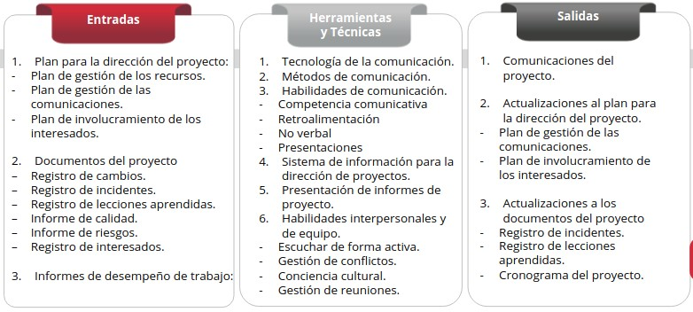
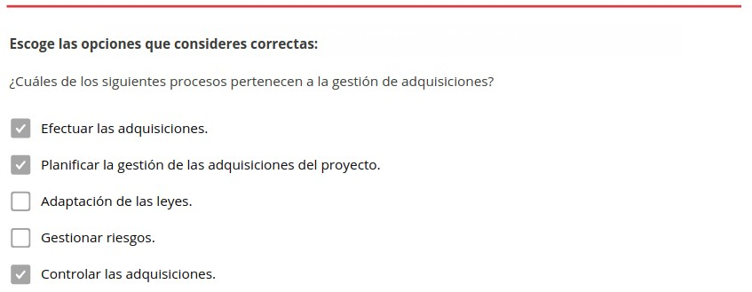
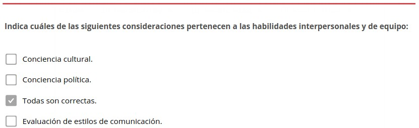
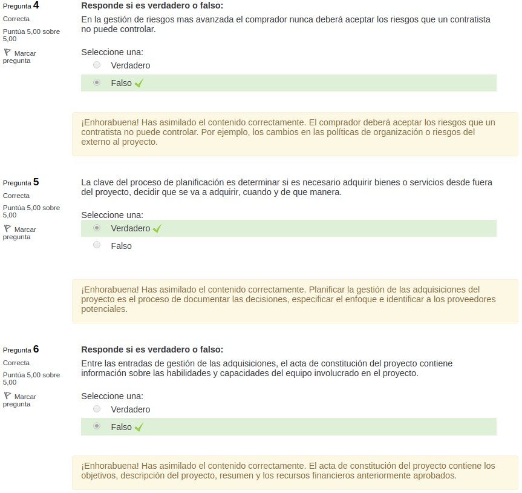

Grupos de materia: Adquisiciones y comunicaciones
=================================================

Toda organización, debe contar con un plan de adquisiciones con el fin de obtener los recursos o servicios externos necesarios para ejecutar su actividad. Este proceso es fundamental a la hora de establecer relaciones con potenciales proveedores y compradores. 

A su vez en todo proceso de gestión en las organizaciones, las habilidades de comunicación como transmitir la información, distribuirla entre los interesados y asegurarse que el mensaje es claro y comprendido, serán procesos clave para asegurar el éxito en un proceso de comunicación. 

.. figure:: ../../_static/1_gestion_integrada_de_proyectos/1.8_grupo_materia_adquisiciones_comunicaciones/mapa_conceptual.jpg
   :width: 50%
   :align: center

1. Adquisiciones
****************

La **gestión de adquisiciones** engloba **funciones** como gestión de contratos, órdenes de compra, memorandos de acuerdo (MOAs) o acuerdos de nivel de servicio (SLAs) internos. 

1.1 Introducción
++++++++++++++++

.. note:: El **proceso de gestión de las adquisiciones** se basa en comprar o adquirir productos, servicios o resultados que son necesarios obtenerlos fuera del equipo de proyecto. 

1.1.1. Proceso de adquisiciones
-------------------------------

Los **procesos de adquisición** se llevan de forma separada. A la hora de ponerlo en práctica, los procesos de adquisición pueden ser más complejos e interactuar entre sí.

El **proceso de gestión de las adquisiciones** incluye:

- **Planificar la gestión de las adquisiciones del proyecto**: Reflejar en un documento los servicios, productos o resultados a adquirir. Identificar a los proveedores potenciales y establecer contacto para abastecimiento en el futuro. 
- **Efectuar las adquisiciones**: Obtener feedback de los proveedores, elegir el que más se ajuste a nuestras necesidades y desarrollar un contrato. 
- **Controlar las adquisiciones**: Se basa en el control de contratos, posibles correcciones y la comunicación con las empresas proveedoras. Finaliza con el acuerdo del proveedor y cierre del contrato. 

1.1.2. Consideraciones legales
------------------------------

En un proceso de adquisición existen una serie de **obligaciones y sanciones legales**. Podemos destacar las siguientes **consideraciones** a tener en cuenta: 

- **Toma de decisiones inteligentes**: La persona responsable del proceso de adquisición debe contar con los conocimientos para la toma de decisiones inteligentes, relativas a contratos y relaciones contractuales. Por norma general el derecho a firmar acuerdos vinculantes se reserva a aquellos que tienen la autoridad para hacerlo. 
- **Acuerdos comprador/vendedor**: Los acuerdos que describen la gestión de proyectos involucran la relación entre dos partes, comprador y vendedor. El enfoque del acuerdo puede ser tan simple, como la adquisición de una cantidad determinada de mano de obra, a contratos más complejos como de construcción plurianuales. 
- **Adaptados a las leyes**: Los **contratos** deben ser redactados de manera que cumplan las leyes locales, nacionales e internacionales que rijan los contratos, y redactados de manera que reflejen la simplicidad o complejidad de los entregables. 
- **Reflejado en el contrato**: Todo aquello que no esté reflejado en el contrato no puede existir legalmente por ello en el contrato debe figurar claramente los entregables y los resultados esperados.
- **Cultura del país**: Se debe tener en cuenta la cultura y las leyes locales del país en caso de establecer un acuerdo internacional. 
- **Términos y condiciones**: El comprador puede añadir términos y condiciones si considera necesario que el vendedor debe proporcionar o facilitar alguna base del acuerdo. 
- **Ajustadas al proyecto**: El equipo de dirección del proyecto garantizara que todas las adquisiciones se ajustan a las necesidades del proyecto y trabajara conjuntamente con la oficina de adquisiciones para favorecer al cumplimiento de las politicas en materia de adquisiciones.
- **Carácter jurídico**: El carácter jurídicamente vinculante de un contrato significa que ha de estar sujeto a un proceso de aprobación que requiere la intervención de un departamento legal. Zona interactiva Haz clic en los botones 
- **Gestión simultánea**: Los proyectos complejos requieren la gestión simultánea o secuencial de múltiples contratos. Si se diera el caso la vigencia del contrato comienza o finaliza durante cualquier momento del ciclo de vida del proyecto.

1.1.3. Proyecto de adquisición
------------------------------

El **adjudicatario** puede gestionar el trabajo como un proyecto de adquisición, en dichos casos: 

- El comprador pasa a ser cliente de cara a los subcontratistas, proveedores y proveedores de servicios, convirtiéndose en un interesado clave desde la perspectiva del vendedor. 
- El equipo de dirección del vendedor gestiona todos los procesos implicados en realizar el trabajo y proporcionar los servicios.
- Los enunciados de trabajo (SOWs) junto con los términos y condiciones relativas a las adquisiciones se convierten en entradas clave de los procesos de dirección del vendedor.
- El propio vendedor se transforma en adquisidor de los servicios, productos o materiales que ofrecen un menor coste por parte del proveedor.

1.1.4. Partes integrantes del proyecto de adquisición
-----------------------------------------------------

Las partes integrantes del proyecto, pueden ser: 

- **Vendedor**: En proyectos más grandes y complejos, el vendedor puede volverse parte de un equipo integral del proyecto luego de la adjudicación del contrato. 
- **Comprador**: El comprador de un servicio, producto o material para el proyecto, está asignado por el equipo que lo ejecuta o forma parte de una organización más grande. En algunos proyectos, es asumido el rol del vendedor por un grupo que forma parte de la organización, pero es externo al proyecto. 
- **Papel autorizador**: Las empresas que carecen de departamento de compras, RR.HH o aprovisionamiento, responsabilizan a las personas que dirigen el proyecto como autorizadores de compras para negociar y firmar contratos. 

.. note:: En contrataciones internacionales, las **jurisdicciones legales** administradas por los contratos figuran reflejadas en el contrato. 

1.1.5. Tendencias y herramientas actuales en contratación
---------------------------------------------------------

Existen una serie de herramientas y prácticas emergentes en logística y tecnología que influirán en la tasa de éxito de los proyectos. Entre ellas se encuentran: 

- **Gestión de riesgos avanzada**: Aportar al suministrador los conceptos o herramientas mejora la gestión de riesgos. El comprador deberá aceptar los riesgos que un contratista no puede controlar. Par ejemplo, los cambios en las políticas de organización o riesgos del externo al proyecto. 
- **Cambios en los procesos de contratación**: Para conseguir procesos más elásticos, rápidos y fiables. Los cambios pueden estar apoyados en la tecnología, vínculos de confianza, acuerdos marco, establecer acuerdos con proveedores que sean afines en cuanto a la forma de trabajo o cultura.
- **Logística y gestión de la cadena de suministro**: Garantizar el éxito en grandes proyectos de ingeniería, construcción e infraestructura, que pueden llevarse a cabo a través de subcontratistas internacionales, es importante una correcta gestión del flujo de materiales.
- **Tecnología y relaciones de los interesados**: Mejorar el uso de tecnologías como las cámaras web, en proyectos de infraestructura y construcción, permite visualizar el avance del proyecto, analizar las imágenes si surgiera una posible reclamación y minimizar los conflictos relativos que pudieran surgir dando lugar a desacuerdos.
- **Contrataciones a prueba**: Puesto que no todos los vendedores son los idóneos, para el entorno de contratación algunos proyectos contrataran varios proveedores para trabajos iniciales. Esto permite que el comprador evalué a sus proveedores potenciales a la vez que avanza en el proyecto. 

1.1.6. Consideraciones para entornos ágiles y adaptativos
---------------------------------------------------------

Para agilizar los **aspectos metodológicos** inherentes a los ciclos de vida adaptativos se tendrán en cuenta las siguientes **consideraciones**:

- **Acuerdos marco con precio fijos para extra**: Establecer acuerdos con proveedores con los que has trabajado con anterioridad, agiliza procesos de documentación y establece la posibilidad de pagos fijos. 
- **Comprador y vendedor comparten riesgos y recompensas**: Adaptación en función de cómo avance el proyecto.

- **Proyectos grandes - Mix fijo + adaptativo**: Asentar una base de soporte de tu proveedor en un proyecto con un fijo de abastecimiento o servicios y adaptarse en orden que se requiera más abastecimiento. 

1.2. Planificar la gestión de adquisiciones
+++++++++++++++++++++++++++++++++++++++++++

.. note:: Planificar la **gestión de las adquisiciones del proyecto** es el proceso de documentar las decisiones, especificar el enfoque e identificar a los proveedores potenciales. 

La **clave de este proceso** es establecer si es necesario adquirir bienes y servicios desde fuera del proyecto, decidir que se va a adquirir, cuando y de qué manera. 

.. figure:: ../../_static/1_gestion_integrada_de_proyectos/1.8_grupo_materia_adquisiciones_comunicaciones/tabla_gestion_adquisiciones.jpg
   :width: 75%
   :align: center

.. figure:: ../../_static/1_gestion_integrada_de_proyectos/1.8_grupo_materia_adquisiciones_comunicaciones/tabla_gestion_adquisiciones_2.jpg
   :width: 75%
   :align: center

1.2.1. Entradas
---------------

En el proceso de planificar la gestión de adquisiciones se producen las siguientes entradas: 

- **Acta de constitución de proyecto**: Es la **descripción** del proyecto. Contiene los objetivos, descripción del proyecto, resumen y los recursos financieros anteriormente aprobados. 
- **Documentos de negocio**: Incluye un **plan de gestión de beneficios y un caso de negocio**. 
- **Plan para la dirección de proyectos**: Incluyen documentos como: 

	- **Plan de gestión del alcance**: describe la manera en que se gestionará el alcance del trabajo.
	- **Plan de gestión de calidad**: contiene los estándares y códigos aplicables de la industria que el proyecto debe cumplir. 
	- **Plan de gestión de recursos**: información sobre qué recursos se comprarán o alquilarán 
	- **Línea base del alcance**: Contiene el enunciado del alcance, la EDT/WBS y el diccionario de la EDT/WBS. 

- **Documentos del proyecto**: Incluyen documentos como: 

	- **Lista de hitos**: muestra cuándo los vendedores deben entregar sus resultados. 
	- **Asignaciones del equipo de proyecto**: información sobre habilidades y capacidades del equipo del proyecto. 
	- **Documentación de requisitos**: incluye requisitos técnicos y legales. 
	- **Matriz de trazabilidad de requisitos**: vincula los requisitos del producto desde su origen hasta los entregables que los satisfacen. Aquí también se encuentran los **requisitos de recursos** (información sobre necesidades específicas) y el **registro de riesgo** (refleja detalles sobre los participantes del proyecto y sus intereses en el mismo). 

- **Factores ambientales de la empresa**: Entre los factores ambientales que pueden influir en el proceso de planificación están:

	- Condiciones del mercado. 
	- Productos, servicios y resultados disponibles en el mercado. 
	- Vendedores, incluido su desempeño pasado o reputación. 
	- Términos y condiciones de los productos, servicios y resultados. 
	- Requisitos locales específicos. 
	- Asesoramiento jurídico en relación con las adquisiciones. 
	- Sistemas de gestión de contratos, incluidos los procedimientos para el control de cambios de los contratos.
	- Sistema establecido de proveedores de niveles múltiples, con datos sobre vendedores precalificados en base a su experiencia previa. 
	- Sistema de contabilidad financiera y pagos de contratos. 

- **Activos en los procesos de organización**: Incluyen documentos como: 

	- **Listas de vendedores preaprobados**: La correcta evaluación de los vendedores optimiza el tiempo en la toma de decisiones. 
	- **Políticas, procedimientos y pautas formales de adquisición**: Incluyen las políticas formales de adquisición y organizaciones de compra. 

1.2.1.1. Administrar contratos
~~~~~~~~~~~~~~~~~~~~~~~~~~~~~~

En las entradas que corresponden a la planificación de gestión de adquisiciones se encuentra la administración de contratos. 

Las **relaciones contractuales legales** engloban las siguientes categorías: 

- **Contratos de precio fijo**: tienen como objetivo establecer un precio fijo para un producto, servicio o resultado que se va a suministrar. Entre ellos se encuentran: 

	- Precio fijo cerrado 
	- Precio fijo más honorarios con incentivos 
	- Precio fijo con ajustes económicos de precio 

- **Contratos de costes reembolsables**: implica efectuar pagos al contratista por todos los costes reales en la ejecución del contrato. Entre ellos se encuentran: 

	- Costes más honorarios fijos (CPFF). 
	- Costes más honorarios con incentivos (CPIF). 
	- Costes más honorarios por cumplimiento de objetivos (CPAF). 

- **Contratos por tiempo y materiales (T&M)**: Se podría denominar como una combinación de los anteriores, mantiene un componente fijo (precio, hora...) y un componente variable como la cantidad de horas que serán finalmente necesarios para llevar a cabo el trabajo. 

1.2.2. Herramientas y técnicas
------------------------------

En el proceso de planificar la gestión de adquisiciones se emplean las herramientas y técnicas:

- **Juicio de expertos**: Individuos o grupos con **conocimientos** especializados o capacitación en: adquisición de compras, tipos de contrato y regulaciones legales. 

- **Recopilación de datos**: Entre sus **técnicas** se incluye la **investigación de mercado** basada en el estudio de las capacidades de la industria y de vendedores especializados en una determinada área. 
- **Análisis de datos**: Entre sus **técnicas** se incluye el **análisis de hacer o comprar** que consiste en determinar si el trabajo puede realizarse por el equipo de proyecto, o en cambio debe ser adquirido de fuentes externas. 
- **Reuniones**: Herramienta de negociación entre comprador y vendedor. Sirve para lograr un intercambio de información, colaborar con oferentes potenciales y determinar una estrategia para gestionar y monitorear las adquisiciones. 

1.2.2.1. Selección de proveedores
~~~~~~~~~~~~~~~~~~~~~~~~~~~~~~~~~

.. note:: La **selección de proveedores** es un proceso de toma de decisiones presente en toda empresa dada la necesidad de adquirir bienes o servicios. Para optar por los proveedores es importante saber analizar los **criterios de selección**: calidad, su impacto para la productividad y competitividad de la empresa. 

Las **causas** que llevan a una empresa a un proceso de selección de proveedores pueden ser por la insatisfacción de los actuales proveedores con los que cuenta la empresa, ampliar una cartera de proveedores o un nuevo inicio de operaciones que requieran nuevos servicios o materiales.

- **Menor coste**: Es el método empleado para adquisiciones de carácter regular, con estándares previamente establecidos para un resultado específico.
- **Solo por calificaciones**: es un método basado en criterios de mejor credibilidad, calificaciones, experiencia, áreas de especialización y referencias.
- **Puntuación por propuesta técnica superior/basada en calidad**: El comprador pide a la empresa proveedora una propuesta que incluya costes y detalles técnicos. Una vez valorada se negocia y acepta la propuesta financiera que adquiera una mayor puntuación. 
- **Basado en costes y calidad**: método que permite valorar y elegir proveedor en base a estos dos parámetros.
- **Proveedor único**: permite negociar costes bajos, puesto que se asegura un volumen de demanda superior. Es un método arriesgado y pocas veces aceptado ya que la organización solo cuenta con un proveedor.
- **Presupuesto fijo**: este método es adecuado cuando el SOW está definido de manera precisa, no se prevén cambios y el presupuesto no puede ser superado. Los vendedores adaptaran el alcance y calidad de la oferta al presupuesto, debido a las restricciones de costes, a las que están sujetos. 

1.2.3. Salidas
--------------

.. note:: El **plan de gestión de las adquisiciones** reflejan las actividades a emprender durante el proceso de adquisición. Contiene su licitación, fuentes externas de financiación y cronograma del proyecto.

En el proceso para planificar la gestión de adquisiciones se encuentran estas salidas: 

- **Plan de gestión de las adquisiciones**: El plan de gestión de las adquisiciones puede incluir directivas para: 

	- Desarrollo del cronograma del proyecto y procesos de control. 
	- Cronograma de las actividades de adquisición. 
	- Medidas de adquisiciones y administración de contratos. 
	- Responsabilidades de dirección entre los interesados, restricciones del equipo en caso de que la empresa cuente con su departamento de adquisiciones. 
	- Jurisdicción legal y método de pago. 
	- Determinar si se llevaran a cabo estimaciones independientes. 
	- Asuntos relacionados con la gestión de riesgos. 
	- Posibles vendedores precalificados. 

- **Estrategia de adquisiciones**: Estrategia basada en determinar el método de entrega del proyecto, o Estrategia de adquisiciones. tipo de acuerdo y su legalidad. Los **métodos** de entrega pueden ser: 

	- Para servicios profesionales. 
	- Para la construcción industrial o comercial. 

- **Documentos de las licitaciones**: Los documentos de las licitaciones se utilizan para solicitar propuestas a posibles vendedores. El tipo de documento dependerá de las bienes o servicios requeridos. Según la industria o ubicación de la adquisición se emplea terminología como: oferta, cotización o propuesta entre otras. En base a los bienes o servicios demandados, la empresa podrá requerir las siguientes solicitudes: 

	- **Solicitud de información (RFI)**: petición de información adicional de los vendedores acerca de los bienes y servicios a adquirir. 
	- **Solicitud de cotización (RFQ)**: utilizado para pedir más información específica de cuanto costara un determinado producto o servicio. 
	- **Solicitud de propuesta (RFP)**: propuesta abierta para el vendedor donde haya un posible problema difícil de determinar. 

- **Enunciados del trabajo**: El **enunciado de trabajo relativo** a las adquisiciones (SOW) es un documento oficial que detalla el artículo que se planea adquirir. Los proveedores evaluarán si son aptos para proporcionar estos servicios o productos seleccionados. El **SOW** puede incluir información como cantidad deseada, niveles de calidad, lugar de trabajo, datos/periodo de desempeño y otros requisitos. 

- **Criterios de selección**:

	- Capacidad y competencia del personal 
	- Coste del ciclo de vida Coste del producto 
	- Fecha de entrega 
	- Adecuar el enfoque y el plan de trabajo que asegure al SOW 
	- Estabilidad financiera en la organización 

- **Decisiones de hacer o comprar**: **Toma de decisiones** en base a un determinado trabajo dependiendo si puede realizarse por el equipo de proyecto, o en cambio debe ser adquirido de fuentes externas. 
- **Estimaciones de costes independientes**: Cuando se trata de un pedido de gran volumen, la **empresa compradora** evaluará si elabora su propia adquisición o en cambio contratará a un perito profesional externo a la empresa que realice una estimación de datos. 
- **Solicitudes de cambio**: La **decisión de adquirir bienes o servicios**, decisiones en el cambio planificación de un proyecto u otros factores externos, pueden requerir una solicitud de cambio.
- **Actualizaciones documentos del proyecto**: La actualización de un documento incluye: 

	- **Registro de lecciones aprendidas**: registro de cualquier lección en materia de regulaciones y cumplimiento. 
	- **Lista de hitos**: previsión de cuándo se estima que el vendedor entregue sus resultados. 
	- **Documentación de requisitos**: incluye los requisitos técnicos del vendedor y las implicaciones contractuales. 
	- **Matriz de trazabilidad de requisitos**: asocia cualquier requisito del producto desde su origen con su entregable. 
	- **Registro de riesgos**: conjunto de riesgos englobados en la actividad del vendedor como duración del contrato, entorno externo o método de entrega del proyecto, etc. 
	- **Registro de interesados**: registro de cualquier información adicional sobre los interesados. 

- **Actualizaciones a los activos de los procesos**: Los activos de los procesos de la organización, son actualizados en base al proceso de gestión de adquisiciones del proyecto. Por ejemplo, información sobre vendedores calificados.

1.3. Efectuar las adquisiciones
+++++++++++++++++++++++++++++++

.. note:: **Efectuar las adquisiciones** es el proceso de recibir una respuesta por parte del proveedor. El proceso incluye la selección de un vendedor calificado y adjudicación de un contrato. 

.. figure:: ../../_static/1_gestion_integrada_de_proyectos/1.8_grupo_materia_adquisiciones_comunicaciones/tabla_efectuar_adquisiciones_2.jpg
   :width: 75%
   :align: center

1.3.1. Entradas
---------------

En el proceso de efectuar las adquisiciones se producen las siguientes entradas: 

- **Plan para la dirección del proyecto**: Incluyen los siguientes documentos:

	- **Plan de gestión del alcance**: refleja la manera de gestión del alcance global del trabajo. 
	- **Plan de gestión de los requisitos**: incluye la realización y gestión de los requisitos. 
	- **Plan de gestión de las comunicaciones**: plan de gestión de comunicaciones entre compradores y vendedores. 
	- **Plan de gestión de los riesgos**: describe las actividades en materia de riesgos. 
	- **Plan de gestión de las adquisiciones**: descripción de las acciones a emprender durante el proceso efectuar las adquisiciones. 
	- **Plan de gestión de la configuración**: define los elementos que son configurables para garantizar la integridad del producto durante el proceso de desarrollo. 
	- **Línea base de costes**: describe la línea base de costes como presupuestos o costes asociados a la gestión de adquisición de los vendedores. 

- **Documentos del proyecto**: Los documentos del proyecto incluyen: 

	- **Registro de lecciones aprendidas**: registro de lecciones aprendidas en los comienzos del proyecto que pueden ayudar a aplicarse en fases posteriores. 
	- **Cronograma del proyecto**: identifica las fechas de cada proceso en el proyecto y cuando están previstos los entregables. 
	- **Documentación de requisitos**: incluye los requisitos técnicos a satisfacer por el vendedor y los requisitos con implicaciones contractuales y legales. 
	- **Registro de riesgos**: el vendedor previamente aprobado identifica sus riesgos que dependen de la organización y el tipo de proyecto. 
	- **Registro de interesados**: detalles sobre todos los interesados identificados. 

- **Documentación de adquisiciones**: Registros elaborados para alcanzar un acuerdo legal. La documentación de las adquisiciones pueden incluir los documentos de las licitaciones incluyen las RFI, RFP, RFQ.

	- **Enunciado del trabajo relativo a las adquisiciones (SOW)**: en relación con las adquisiciones, proporciona a los vendedores, unos objetivos, requisitos y resultados.
	- **Estimaciones de costes independientes**. 
	- **Criterios de selección de proveedores**: describen cómo son evaluadas las propuestas de los vendedores. Para evitar un posible riesgo, el comprador puede decidir firmar acuerdos con más de un vendedor para evitar un posible imprevisto que afecte al proyecto. 

- **Propuestas de los vendedores**: Son los documentos que forman la información básica de adquisiciones, O Documentos del proyecto. utilizada para una evaluación y selección de vendedores
- **Factores ambientales de la empresa**: Entre los factores ambientales que pueden influir están: 

	- Leyes y regulaciones locales relativas a las adquisiciones. 
	- Entorno económico externo que interfiere en los procesos de adquisición. 
	- Condiciones del mercado. 
	- Experiencias pasadas con los diferentes vendedores, tanto positivas como negativas. 
	- Acuerdos previos ya existentes. 
	- Sistemas de gestión de contratos. 

- **Activos en los procesos de organización**: Entre los activos de los procesos de organización influyentes en el proceso de adquisición están:

- Lista de vendedores previamente calificados. 
- Políticas de la organización que beneficien al proyecto. 
- Plantillas que determinan los acuerdos para la adquisición. 
- Politicas financieras en los procesos de facturación y pago. 

1.3.2. Herramientas y técnicas
------------------------------

En el proceso de efectuar las adquisiciones se producen las siguientes herramientas y técnicas:

- **Juicio de expertos**: Se valorarán las **habilidades y capacitación** de los siguientes aspectos: 

	- Evaluación de propuestas. 
	- Asuntos técnicos. 
	- Conocimientos en áreas como finanzas, ingeniería, diseño, procesos y cadenas, etc. 
	- Leyes, regulaciones, requisitos de cumplimiento y negociación. 

- **Publicidad**: Consiste en la **difusión y comunicación** de un producto o servicio enfocado a usuarios potenciales. Existen numerosos métodos de difusión como internet, televisión, periódicos, etc. 
- **Conferencia de oferantes**: Se tratan de **reuniones** entre comprador y posibles vendedores donde estos presentan sus propuestas y establecen contactos para posibles negociaciones futuras. 
- **Análisis de datos**: El proceso de análisis de datos incorpora la **evaluación de propuestas** para asegurar que están completas y cubren sus enunciados. De esta manera se pueden establecer unos criterios de selección correctos. 
- **Habilidades interpersonales de equipo**: En el **proceso de negociación** las habilidades interpersonales son clave para llegar a un acuerdo. La negociación de adquisiciones contiene una estructura, los derechos y obligaciones de ambas partes y otros términos relativos a las compras para llegar a un mutuo acuerdo. 

1.3.3. Salidas
--------------

En el proceso de efectuar las adquisiciones se producen las siguientes salidas:
 
- **Vendedores seleccionados**: En base al resultado de **evaluación de la propuesta**, se eligen unos vendedores identificados como los más competitivos para las necesidades de nuestro proyecto. En caso de **adquisiciones complejas** de alto valor y riesgo, requerirá la aprobación de un directivo o responsable superior de proyecto. 
- **Acuerdos**: El **acuerdo vinculante** de las partes obliga al vendedor y comprador a proporcionar productos y servicios como a la retribución de los mismo respectivamente. Los principales componentes del documento de un acuerdo pueden ser:

	- Enunciados de trabajo referente a las adquisiciones. 
	- Cronograma de fechas y entregas. 
	- Registro de acciones. 
	- Coste y las condiciones de pago. 
	- Criterios de inspección, calidad y aceptación. 
	- Garantía y el soporte futuro del producto.
	- Incentivos y las sanciones. 
	- Garantías de cumplimiento. 
	- Conformidad de los subcontratistas subordinados. 
	- Términos y condiciones generales de finalización. 
	- Mecanismos de resolución alternativa de controversias. 

- **Solicitudes de cambio**: Si se produjera alguna **solicitud de cambio en el acuerdo**, la dirección de proyecto es encargada de gestionar su tratamiento. 
- **Actualizaciones dirección del proyecto**: Los **elementos** se modifican mediante una solicitud de cambio y pueden ser: 

	- **Plan de gestión de los requisitos**: Los requisitos pueden ser modificados debido a cambios solicitadas por los vendedores. 
	- **Plan de gestión de calidad**: los vendedores pueden aportar planes alternativos de calidad. 
	- **Plan de gestión de comunicaciones**: incorpora los enfoques y necesidades de comunicación. 
	- **Plan de gestión de riesgos**: conjunto de riesgos que puede requerir actualizaciones. 
	- **Plan de gestión de adquisiciones**: dependiendo del progreso de negociación y contratación podrían aparecer diferentes actualizaciones. 
	- **Línea base del alcance**: Las ED /WBS y los entregables del proyecto, podrían cambiar durante el proceso de adquisición.
	- **Línea base del cronograma**: en caso de algún cambio en la entrega, el cronograma de podrá modificará para reflejar los nuevos plazos. 
	- **Línea de base de costes**: son los cambios influidos por un factor económico externo como los precios de los materiales, servicios o mano de obra. 

- **Actualizaciones documentos del proyecto**: Las **actualizaciones** a los documentos del proyecto incluyen: 

	- **Registro de lecciones aprendidas**: registro de las dificultades encontradas en el proceso de adquisiciones y si se puede evitar en eventos futuros. 
	- **Documentación de requisitos**: incluye requisitos técnicos e implicaciones legales estipuladas con anterioridad, que el vendedor debe satisfacer. 
	- **Matriz de trazabilidad de requisitos**: apoyo para el mantenimiento de requisitos y trazabilidad de un proyecto, si se produjera la incorporación de vendedores. 
	- **Calendario de recursos**: cronograma que requiere de la actualización en base a la disponibilidad de los vendedores. 
	- **Registro de riesgo**: En el proceso de contratación se pueden reflejar los riesgos específicas de cada vendedor. 
	- **Registro de interesados**: incluye información acerca de requerimientos, expectativas y evaluación entre otros aspectos, de cada uno de los interesados. El registro se actualizará a medida que se creen nuevos acuerdos. 

- **Actualizaciones activos de los procesos**: Los activos incluyen los procesos, procedimientos e información histórica que podrán actualizarse como resultado de efectuar las adquisiciones. En él se incluye: 

	- Listados de vendedores potenciales previamente calificados. 
	- Calificación de experiencias con los vendedores, positivas o negativas. 

1.4. Control de gestión de adquisiciones
++++++++++++++++++++++++++++++++++++++++

.. note:: **Controlar las adquisiciones** es el proceso de recibir una respuesta por parte del proveedor. El proceso incluye la selección de un vendedor calificado y adjudicación de un contrato. 

Tanto comprador como vendedor, deben estar seguros que ambas partes **cumplen con sus obligaciones estipuladas** por contrato y sus derechos deben estar protegidos. Cuando se trata de proyectos más complejos o que intervengan múltiples proveedores es clave mantener una correcta comunicación entre los distintos proveedores. 

Cuando se trata de proyectos más complejos o que intervengan múltiples proveedores es clave **mantener una correcta comunicación** entre los distintos proveedores. 

Generalmente las organizaciones gestionan la **administración de contratos** de manera independiente al proyecto. 

Las **actividades** administrativas incluyen: 

- Recopilación de datos y gestión de los registros del proyecto.
- Pago de facturas. 
- Seguimiento del entorno de las adquisiciones hacia una mejor implementación. 
- Actualización de datos del proyecto para la elaboración de informes periódicos.

**Controlar las adquisiciones** engloba la gestión financiera que implica el seguimiento de la realización de los pagos al vendedor. De esta manera se asegura que se cumplen las condiciones de pago establecidas por contrato. 

.. figure:: ../../_static/1_gestion_integrada_de_proyectos/1.8_grupo_materia_adquisiciones_comunicaciones/tabla_controlar_adquisiciones.jpg
   :width: 75%
   :align: center

1.4.1. Entradas
---------------

En el proceso de controlar las adquisiciones se producen las siguientes entradas: 

- **Plan para la dirección del proyecto**: Incluyen los siguientes documentos: 

	- **Plan de gestión de requisitos**: descripción del análisis, documentación y gestión de los requisitos del contratante. 
	- **Plan de gestión de los riesgos**: análisis e intervención de los riesgos creados por los vendedores. 
	- **Plan de gestión de adquisiciones**: seguimiento de control de adquisiciones. 
	- **Plan de gestión de cambios**: información sobre cómo se llevarán a cabo los cambios. 
	- **Línea base del cronograma**: actualizar el cronograma si se produjeran retrasos en las adquisiciones. 

- **Documentos del proyecto**: Incluyen los siguientes documentos: 

	- **Registro de supuestos**: incluyen los supuestos que se han generado durante el proceso de adquisición. 
	- **Registro de lecciones aprendidas**: identificación de aprendizajes adquiridos en el proceso de adquisición para aplicar más adelante. 
	- **Lista de hitos**: previsión de cara a conocer cuando los vendedores entregarán sus resultados. 
	- **Informes de calidad**: permite identificar los procedimientos, productos o procesos de los vendedores que no están en cumplimiento. 
	- **Documentación de requisitos**: incluye los requisitos técnicos del vendedor y las implicaciones contractuales. 
	- **Matriz de trazabilidad de requisitos**: asocia cualquier requisito del producto desde su origen con su entregable. 
	- **Registro de riesgos**: identifica los riesgos englobados en la actividad del vendedor. 
	- **Registro de interesados**: incluye información acerca de requerimientos, expectativas y evaluación de las partes involucradas en las adquisiciones. 

- **Acuerdos**: Los acuerdos son negociaciones que incluyen la conformidad de ambas partes. 
- **Documentación de las adquisiciones**: Incluye los **registros completos de soporte** para la administración en procesos de adquisición. La documentación puede reflejar, el enunciado del trabajo, información de pagos, información de desempeño, planes y documentación que le corresponda. 
- **Solicitudes de cambio aprobadas**: Pueden requerir **modificaciones** en los términos y condiciones del contrato. Estos incluyen: enunciados de trabajo (SOW) en base a las adquisiciones, coste, descripción de productos, servicios o resultados a suministrar. 
- **Datos de desempeño de trabajo**: Registro de las **acciones de trabajo** que contienen el estado del proyecto, desempeño técnico, costes y actividades en curso o ya finalizadas. 
- **Factores ambientales de la empresa**: Entre los factores ambientales que pueden influir en el proceso de controlar las adquisiciones están: 

	- Sistema de control de cambios del contrato. 
	- Condiciones económicas del mercado. 
	- Código ético de la organización. 
	- Sistema de gestión financiera. 

- **Activos en los procesos de organización**: Las **políticas de adquisición** pueden influir en el proceso de adquisición. 

1.4.2. Herramientas y técnicas
------------------------------

En el proceso de controlar las adquisiciones se producen las siguientes herramientas y técnicas:

- **Juicio de expertos**: Se valorarán las **habilidades y capacitación** de los siguientes aspectos:

	- Áreas funcionales como: finanzas, diseño, desarrollo y gestión en cadena. 
	- Leyes y regulaciones. 
	- Administración de reclamaciones. 

- **Administración de reclamaciones**: Se produce una **reclamación** cuando el comprador y vendedor no pueden llegar a un acuerdo sobre una compensación o cambio. En caso de no resolución se convierten en **conflictos y finalmente apelaciones**. Las reclamaciones deben ser documentadas, procesadas, monitoreadas y gestionadas a lo largo del ciclo de vida del contrato.  Si ambas partes no solventen por sí mismas la reclamación, será necesario gestionarla en base a los procedimientos de resolución alternativa de conflictos **(ADR)** preestablecidos en el contrato. 
- **Análisis de datos**: El análisis de datos permite controlar las adquisiciones con técnicas como: 

	- **Revisiones del desempeño**: Incluyen la revisión y comparación del desempeño de calidad, recursos, cronograma y costes frente a un acuerdo. 
	- **Análisis del valor ganado (EVA)**: Permite identificar si existe un grado de desviación respecto al objetivo inicial. 
	- **Análisis de tendencias**: Permite desarrollar un pronóstico de la estimación a la conclusión (EAC) con el fin de determinar si el desempeño del coste está mejorando o deteriorando. 

- **Inspección**: La **revisión de actividades** de trabajo permite medir, examinar y verificar si los entregables cumplen con lo acordado por el contratista. 
- **Auditorias**: La **revisión** en el proceso de adquisición relativo a las diferentes áreas de la organización con el fin de evaluar si se han cumplido los derechos y obligaciones establecidos en el contrato. 

1.4.3. Salidas
--------------

En el proceso de controlar las adquisiciones se producen las siguientes salidas: 

- **Adquisiciones cerradas**: El **vendedor** emite una notificación formal por escrito y notificará al comprador que se ha completado el contrato. Los **términos y condiciones del contrato** se incluyen en el plan de gestión de adquisiciones. Antes del cierre de la negociación, todos los **entregables** deberán haber sido suministrados en la fecha programada, habrán cumplido con los requisitos de calidad y no debería haber reclamaciones o facturas pendientes. 
- **Información de desempeño del trabajo**: **Registro de información** sobre la actividad de un vendedor correspondiente a los entregables recibidos y los costes incurridos que figuran en el presupuesto SOW del trabajo realizado.
- **Actualizaciones en la documentación**: Las actualizaciones a la documentación de las adquisiciones son todas las modificaciones que han podido aparecer a lo largo del proceso incluyendo los cambios solicitados del contrato aprobadas y no aprobadas. 
- **Solicitudes de cambio**: Durante el **proceso de control de adquisiciones** podrían aparecer solicitudes de cambio en la dirección de proyecto. Estas serán revisadas y tratadas por medio del proceso realizar el control integrado de cambios. Si se produjeran **cambios no resueltos** en el contrato, ambas partes podrían proporcionar instrucciones constructivas para su resolución. Dichos cambios deberán ser documentados por medio de la correspondencia del proyecto. 
- **Actualizaciones en el plan de dirección**: Las **partes del proceso** que podrían conducir cambios en el plan para la dirección del proyecto son:

	- **Plan de gestión de riesgos**: comprador y vendedor podrían identificar algún riesgo significativo durante la ejecución del proceso. En ese caso el plan de gestión de riesgos podría requerir su actualización. 
	- **Plan de gestión de adquisiciones**: si se produjera algún cambio en el desempeño de los vendedores, las actividades reflejadas en el plan de gestión de adquisiciones podrían requerir su actualización. 
	- **Línea base del cronograma**: el comprador debe ser consciente de los plazos de entrega de suministros reflejados en el cronograma. Si hubiese alguna modificación en la línea base del cronograma, el documento deberá ser actualizado con las expectativas actuales. 
	- **Línea base de costes**: factores externos como un incremento de precios de los materiales o el coste de la mano de obra, podrían llevar a cambios que deben incorporarse a la línea base de costes. 

- **Actualizaciones en los documentos**: Los documentos del proyecto que pueden verse sometido a cambios son: 

	- **Registro de lecciones aprendidas**: documentar las técnicas que fueron eficientes en la línea base del cronograma y mantenimiento de costes. Si hubiese reclamaciones deberán ser registradas para evitar su repetición. 
	- **Requisitos de recursos**: identificación de cambios en los requisitos de recursos que derivan del trabajo que se está realizando. 
	- **Matriz de trazabilidad de requisitos**: Actualización acerca de los requisitos que se han alcanzado. 
	- **Registro de riesgos**: identificación de nuevos riesgos que pudieron aparecer en la ejecución del proyecto, puesto que los antiguos riesgos pudieron dejar de ser aplicables. 
	- **Registro de interesados**: documentación de los nuevos compradores o vendedores que aparecieron en la fase de ejecución del proyecto. 

- **Actualizaciones a los activos**: En el proceso de controlar las adquisiciones, los activos de la organización sujetos a modificaciones son: 

	- **Cronogramas y solicitudes de pago**: los pagos deberán realizarse con lo establecido en el contrato de adquisición. 
	- **Documentación sobre el desempeño del vendedor**: análisis que permita evaluar el desempeño del vendedor, para identificar si podrían establecerse más acuerdos en el futuro. 
	- **Actualizaciones a las listas de vendedores precalificados**: lista de vendedores potenciales que han sido previamente aprobados. 
	- **Repositorio de lecciones aprendidas**: recopilación de lecciones aprendidas en todo el proceso de adquisición para aplicar en proyectos futuros. 
	- **Archivo de adquisición**: Registro completo de la documentación, incluido el contrato cerrado para la incorporación a los archivos finales del proyecto. 

1.5. Resumen
++++++++++++

- El proceso de adquisiciones se basa en comprar y adquirir productos o servicios. 
- Toda gestión de adquisiciones incluye fases como la preparación de un plan, la ejecución de las adquisiciones y el control de las mismas. 
- Los contratos pueden ser de precio fijo o de costes reembolsables. 
- La selección de proveedores se establece mediante criterios como: calidad, productividad y competitividad. 

2. Comunicaciones
*****************

La **gestión de comunicaciones** del proyecto. incluye los procesos necesarios para garantizar la distribución, recopilación, almacenamiento y disposición final de la información del proyecto

2.1. Introducción
+++++++++++++++++

La gestión de comunicaciones del proyecto se divide en **dos partes**:

- Desarrollo eficaz de una estrategia de comunicación. I
- Implementación de actividades necesarias para llevar a cabo la estrategia de comunicación. 

2.1.1. Procesos de gestión de la comunicación
---------------------------------------------

Los procesos de gestión de las comunicaciones del proyecto se estructuran de forma separada con parámetros definidos. Sin embargo, dependiendo del proyecto y la organización, estos procesos pueden superponerse y correlacionarse. 

El **proceso de gestión de las comunicaciones** incluyen: 

- **Planificar la gestión de comunicaciones**: Proceso de elaboración de un plan para las actividades de comunicación. 
- **Gestionar las comunicaciones**: Incluye los procesos de recopilación, creación, distribución, gestión, control, y disposición del proyecto. 
- **Controlar las adquisiciones**: Proceso para garantizar que se cumplen las necesidades de información del proyecto. 

2.1.2. Intercambio de información
---------------------------------

.. note:: La **comunicación es el intercambio de información**. La información puede ser intercambiada en forma de ideas, instrucciones o emociones. La información puede ser intercambiada de las siguientes formas: 

La información puede ser intercambiada de las siguientes formas:

- **Escrita**: medios físicos o electrónicos. 
- **Hablada**: Cara a cara o remotos. 
- **Formales o informales**: dependiendo de fin como en documentos formales o medios sociales de comunicación. 
- **A través de gestos**: Tono de voz y expresiones faciales. 
- **A través de los medios audiovisuales**: incorporadas en imágenes. 
- **Elección de palabras**: sustitución de la palabra para expresarse de manera más específica.

.. note:: Sin una **comunicación eficaz** entre las áreas que forman la organización, los objetivos de la empresa no llevarían a la obtención de resultados en la misma dirección. 

2.1.3. Actividades de comunicación
----------------------------------

Las actividades de comunicación pueden ser: 

- **Interna**: Centrada en los **miembros del equipo** de un proyecto. 
- **Externa**: Centrada en los **miembros externos** del proyecto como proveedores, otras organizaciones, desarrollo social. 
- **Formal**: Engloban las **actividades** como reuniones, actualización de informes periódicos, presentaciones y demás actos informativos determinantes para el proyecto. 
- **Informal**: **Actividades de comunicación** mediante email, avisos desde la plataforma de organización o medios sociales. 
- **Enfoque jerárquico**: La comunicación dependiendo del **enfoque jerárquico** entre el grupo podrá afectar en el contenido del mensaje, por ejemplo: 

	- **Ascendente**: alta dirección. 
	- **Descendente**: Entre un grupo de personas que contribuyen a la realización del proyecto. 
	- **Horizontal**: partes del equipo y las personas que dirijan el proyecto. 

- **Oficial**: **Informes oficiales** emitidos a diferentes organismos de gobiernos.
- **No oficial**: **Comunicados emitidos** con el fin de establecer relaciones sólidas entre el equipo del proyecto, utilizando medios adaptables e informales.

2.1.4. Comunicación exitosa
---------------------------

Las actividades de comunicación incluyen **medios** para apoyar la transmisión de información. Estos pueden ser desde correos electrónicos y conversaciones informales hasta reuniones formales e informes actualizaciones del proyecto. Gestionar exitosamente las relaciones entre los miembros del proyecto incluye **establecer estrategias** en las actividades de comunicación. 

La **comunicación exitosa** consta de dos partes relacionadas entre sí:

- Identificar las **necesidades** del proyecto y desarrollar una estrategia de comunicación adecuada. 

- El **mensaje de esta estrategia** se comunica a los interesados en diferentes formatos y medios, que forman las comunicaciones del proyecto. 

La **base para monitorear** el efecto de la comunicación la forman la estrategia de comunicación y el plan de gestión. Importante 

.. note:: Para evitar malentendidos o una comunicación deficiente, es necesario realizar una selección cuidadosa de los métodos y mensajes establecidos en el proceso de planificación. 

2.1.5. 5Cs
----------

La **comunicación escrita** ocupará gran parte del volumen diario de comunicación. Los malentendidos que se pudieran originar en el proceso de comunicación escrita, se pueden reducir utilizando las **5Cs**: 

- **Coherente**: Flujo de ideas estructuradas, uso de introducción y resumen. 
- **Correcto**: Un mal uso de la gramática o la ortografía generan distracción y falta de credibilidad.
- **Conciso**: Un mensaje breve y claro reduce las posibilidades de una mala interpretación.
- **Claro**: Asegurar que el mensaje está adaptado a las necesidades del lector. 
- **Controlado**: Uso de palabras necesarias. 

Las 5CS de las comunicaciones escritas se basan en **habilidades de comunicación**, tales como: 

- **Escuchar activamente**: establecer una comunicación de escucha y compromiso activo. 
- **Conciencia de las diferencias culturales**: informar al equipo sobre las diferencias culturales y personales. 
- **Establecer y fijar las expectativas**: la negociación entre las partes del acuerdo reduce las expectativas que pudieran surgir en el proyecto. 

2.1.6. Tendencias emergentes en la gestión de las comunicaciones
----------------------------------------------------------------

Las tendencias y prácticas emergentes para la gestión de las comunicaciones del proyecto incluyen, entre otras: 

- **Integración de las personas para la revisión del proyecto**: Para una estrategia de comunicación eficaz, es necesario realizar intervenciones periódicas, entre los grupos, individuos u organizaciones.
- **Integración de interesados en las reuniones del proyecto**: En las reuniones de proyecto es importante la inclusión de miembros externos al proyecto o la organización. Recordar los logros, incidencias del día anterior y los objetivos a alcanzar del día actual. 
- **Mayor uso de la informática social**: La informática aplicada a la comunicación ha cambiado la forma en la que las organizaciones y las personas se relacionan. Las diferentes formas de interactuar vía internet son más eficaces a la hora de comunicarse con diferentes generaciones y culturas. 
- **Enfoques multifacéticos de la comunicación**: Una estrategia de comunicación estándar incorpora todas las tecnologías y respeta las diferencias de cultura y personales. Si es necesario podrá incluirse tecnologías de comunicación más avanzadas. Estos enfoques ayudan a comunicarse con personas de diferentes culturas y generaciones.

2.1.7. Adaptación comunicaciones
--------------------------------

Existen unas **consideraciones** a tener en cuenta en base a las necesidades del proyecto. Para una correcta adaptación comunicacional se tendrán en cuenta las siguientes cuestiones:

- **Interesados**: ¿Los interesados son internos o externos a la organización? 
- **Ubicación**: ¿Dónde están ubicados los miembros del equipo? ¿Esta los miembros del equipo distribuidos en diferentes zonas geográfica? 
- **Tecnologías de comunicaciones**: ¿Qué tecnologías de la comunicación disponen las partes interesadas para establecer realizar un seguimiento? 
- **Idioma**: ¿Qué idioma se está utilizando? ¿Cuáles son los recursos o herramientas que disponemos para solventar la barrera lingüística?

2.2. Planificar la gestión de las comunicaciones
++++++++++++++++++++++++++++++++++++++++++++++++

.. note:: Planificar la **gestión de las comunicaciones** del proyecto es el proceso para desarrollar un plan estratégico de actividades de comunicación del proyecto. 

**Proceso de planificación**: 
	En las primeras fases del **ciclo de vida del proyecto**, será necesario la creación de un plan eficaz de gestión de las comunicaciones donde se reflejen las diversas **necesidades de información** de los interesados del proyecto. El plan debe someterse a revisión de forma periódica y estar sujeto a cambios si se produjera una variación en la comunidad de interesados o al comienzo de una nueva fase del proyecto. 

	Todos los proyectos tienen en común la necesidad de **comunicar y transmitir** información sobre el proyecto, sin embargo, los medios de distribución pueden variar dependiendo de las necesidades específicas del proyecto. 

	Durante el proceso se han de identificar los métodos de **almacenamiento, recuperación y disposición final** de la información del proyecto. 

.. figure:: ../../_static/1_gestion_integrada_de_proyectos/1.8_grupo_materia_adquisiciones_comunicaciones/tabla_planificar_comunicaciones.jpg
   :width: 75%
   :align: center

2.2.1. Entradas
---------------

En el proceso de planificación de las comunicaciones se producen las siguientes entradas:
 
- **Acta de constitución del proyecto**: Registra la lista de los interesados, sus roles y responsabilidades. 
- **Plan para la dirección de proyectos**: El plan para la dirección de proyectos incluye: 

	- **Plan de gestión de recursos**: guía informativa que contiene como se categoriza, asigna y administra los recursos del equipo. Los miembros del equipo pueden tener directrices de comunicación que se reflejarán en el plan de gestión de la comunicación. 
	- **Plan de involucramiento de los interesados**: identifica la estrategia de gestión para implementar a los interesados de forma eficaz. 

- **Documentos del proyecto**: Los documentos de proyecto incluyen: 

	- **Documentación de requisitos**: incluye comunicaciones con los interesados del proyecto. 
	- **Registro de interesados**: se utiliza para planificar actividades de comunicación con los interesados. 

- **Factores ambientales**: Entre los factores ambientales que pueden influir en el proceso de gestión de las comunicaciones están: 

	- Cultura, entorno político y gobernanza de la organización. 
	- Políticas de gestión del personal. 
	- Rango de riesgo de los interesados. 
	- Canales, herramientas y sistemas de comunicación. 
	- Tendencias actuales. 
	- Ubicación geográfica de recursos e instalaciones. 

- **Activos de los procesos de la organización**: Los activos de los procesos de la organización incluyen: 

	- Políticas y procedimientos de la organización con relación a la cultura, medios sociales y seguridad. 
	- Políticas y procedimientos de la organización para la administración de riesgos, cambios, base de datos e incidencias. 
	- Requisitos de comunicación en la organización. 
	- Guias bases para el desarrollo, intercambio, almacenamiento y recuperación de los datos. 
	- Información histórica y el archivo de lecciones aprendidas 
	- Información de proyectos anteriores 

2.2.2. Herramientas y técnicas
------------------------------

En el proceso de planificación de las comunicaciones se producen las siguientes herramientas y técnicas:

- **Juicio de expertos**: 
	Tomar en consideración la **capacitación y experiencia** de un equipo o coordinador de áreas como: 

	- Estructura y política de dirección en el proyecto 
	- Cultura y entorno de la organización y empresas externas. 
	- Prácticas de gestión de cambios en la organización. 
	- Tipo de industria y suministrables del proyecto. 
	- Tecnologías de comunicación de la organización. 
	- Procedimientos relativos a los requisitos legales de las comunicaciones de la organización. 
	- Políticas de la organización en materia de seguridad. 
	- Interesados, clientes o patrocinadores.

- **Análisis de requisitos de comunicación**: 
	Los **requisitos** se definen combinando el tipo y el formato de la información necesaria con un análisis del valor de dicha información. Las **fuentes de información** para identificar y definir los requisitos de comunicación del proyecto son: 

	- Requisitos de comunicación de los interesados. 
	- Canales de comunicación potenciales. 
	- Organigramas. 
	- Organización del proyecto y responsabilidad y relaciones de los interesados. 
	- Enfoque de desarrollo. 
	- Disciplinas, departamentos e involucrados en el proyecto. 
	- Organización de personas que están envueltas en el proyecto. 
	- Necesidades de información interna y externa. 
	- Requisitos legales. 

- **Tecnología de la comunicación**: 
	Los **métodos** más comunes para transmitir información incluyen las reuniones, documentos escritos, bases de datos, medios sociales y sitios web. 

	Los **factores** que pueden influir en la selección de la tecnología de la comunicación son: 

	- **Urgencia de la necesidad de información**: la necesidad, frecuencia y formato de la información puede variar de un proyecto a otro. 
	- **Disponibilidad y confiabilidad**: la tecnología que se requiere para la transmisión de los elementos de comunicación deben estar disponible y ser compatible para todos los interesados. 
	- **Facilidad de uso**: las tecnologías seleccionadas deben estar adaptadas para los participantes del proyecto y deben planificarse eventos de capacitación para su uso. 
	- **Entorno del proyecto**: identificar el entorno donde se desarrolla el proyecto, idiomas, zona horaria y cualquier otro factor ambiental y culturales. 
	- **Sensibilidad y confidencialidad de la información**: Cabe destacar los siguientes aspectos: 

	- Si la información es sensible o confidencia, pueden ser necesarias medidas de seguridad adicionales. 
	- Políticas de medios sociales para los empleados para un comportamiento de seguridad y protección adecuados. 

- **Modelos de comunicación**: 
	Los modelos de comunicación pueden representar una **transmisión de información** de la forma más básica (emisor y receptor) en una forma más interactiva que incorpore un elemento adicional (retroalimentación) o mediante un modelo más complejo que incorpore los elementos humanos. 

	Se diferencian dos modelos de comunicación: **la muestra del modelo básico y el modelo de comunicación interactiva**. 

	La **muestra del modelo básico** describe la comunicación de un proceso que consta de emisor receptor y se ocupa de asegurar que el mensaje sea entregado más que comprendido. 

	La secuencia básica de un modelo de comunicación es: 

	- **Codificar**: Mensaje codificado con símbolos, texto o sonido entre otros métodos de transmisión. 
	- **Transmitir el mensaje**: Mensaje enviado a través de un canal de comunicación. La transmisión de este mensaje puede verse comprometida con la falta de familiaridad con la tecnología u otros factores como el ruido que pueden afectar a la transmisión de información. 
	- **Descodificar**: Los datos recibidos son traducidos de nuevo por el receptor para convertirlos en un mensaje útil. 

	**El modelo de comunicación interactiva**, identifica la **necesidad** de asegurar que el mensaje ya ha sido comprendido.

	El ruido incluye cualquier interferencia o barrera que pueda comprometer la comprensión del lenguaje como la distracción del receptor variaciones en la percepción del mensaje o falta de comprensión por no tener los conocimientos adecuados.

	Los **pasos** de un modelo de comunicación interactiva son: 
	
	- **Confirmar**: Receptor indica la recepción del mensaje. 
	- **Retroalimentación**: Una vez descodificado y comprendido el mensaje, el receptor lo codifica. 

	El **emisor** es el responsable de asegurar que el mensaje es claro y conciso mientras que el receptor es responsable que el mensaje se reciba en su totalidad y es comprendida de forma correcta. Este cambio de información puede producirse en un entorno donde quizá haya ruido y otras barreras. 

	La **comunicación intercultural** puede hacer que surjan barreras como edad, nacionalidad, disciplina profesional, raza o genero. 

	El **mensaje** que se transmite depende del estado emocional y actual, el conocimiento, los antecedentes, las diferencias culturales y las predisposiciones del emisor. De manera reciproca estos factores influirán también en las predisposiciones del receptor y la forma de interpretar el mensaje. 

	Mejorar este modelo de estrategia ayuda a desarrollar **planes de comunicación** entre miembros de un grupo. Sin embargo, no es de utilizada para otras formas de comunicación por ejemplo redes sociales o correos electrónicos. 

	.. figure:: ../../_static/1_gestion_integrada_de_proyectos/1.8_grupo_materia_adquisiciones_comunicaciones/diagrama_modelo_comunicacion.jpg
	   :width: 70%
	   :align: center

- **Métodos de comunicación**:
	Existen varios **métodos de comunicación** empleados para compartir información entre los interesados del proyecto, estás se pueden clasificar como: 

	- **Comunicación interactiva**: intercambio de información multidireccional en tiempo real. Empleada mediante vías de comunicación como reuniones, llamadas telefónicas, mensajería instantánea, medios sociales y videoconferencias. 
	- **Comunicación del tipo push (empujar)**: la información es transmitida directamente a una persona especifica que requiere de la información. Se asegura que la información ha sido recibida, pero no garantiza su comprensión. Este tipo de comunicación se utiliza mediante objetos como cartas, memorandos, informes, correos electrónicos, faxes, correos de voz, blogs y comunicados de prensa. 
	- **Comunicación tipo pull (tirar)**: engloba los conjuntos de información complejos y cuantiosos. Se basa en que los receptores accedan al contenida según su propio criterio. Estos métodos incluyen, páginas web, sitios intranet, E- Learning y bases de datos de lecciones aprendidas o conocimientos. 

	Dentro de los enfoques que cubran las necesidades de las formas de comunicación definidas anteriormente, están:

	- **Comunicación interpersonal**: la información se intercambia entre individuos, normalmente cara a cara. 
	- **Comunicación en pequeños grupos**: la información se intercambia entre grupos de aproximadamente unas tres a seis personas. 
	- **Comunicación pública**: un único conferenciante dirigido a un grupo de personas. 
	- **Comunicación masiva**: existen conexiones en común entre las personas o grupos a los que se transmite el mensaje. 
	- **Comunicación a través de redes o medios sociales**: basadas en nuevas tecnologías en medios sociales a través de internet. 

	Entre los **objetos y métodos** de comunicación podemos destacar: 

	- Paneles informativos. 
	- Boletines informativos, revistas internas. 
	- Cartas al personal y comunicados de prensa. 
	- Informes anuales. 
	- Correos electrónicos e intranets. 
	- Portales web y otras bases de información (para comunicación de tipo pull). 
	- Conversaciones via telefónica. 
	- Presentaciones o conferencias. 
	- Sesiones informativas de equipo/reuniones grupales. 
	- Grupos focales. 
	- Reuniones cara a cara formales o informales entre diferentes interesados. 
	- Grupos de consulta o foros y medios sociales. 

- **Habilidades interpersonales y de equipo**: 
	Las **habilidades interpersonales y de equipo** que pueden utilizarse en este proceso incluyen: 

	- **Evaluación de estilos de comunicación**: Estrategia para evaluar los diferentes tipos de comunicación e identificar el método, formato y contenido prioritario de la comunicación. Usada en interesados poco colaboradores que a menudo requieren otras actividades y objetos de comunicación adaptados. 
	- **Conciencia política**: proceso de planificación de las comunicaciones en base al entorno político de la organización. La conciencia politica tendrá que ver con reconocer las relaciones de poder. Es necesario saber quien ejerce de poder en este ámbito, para desarrollar la capacidad de comunicarse con los interesados. 
	- **Conciencia cultural**: basado en la comprensión de las diferencias entre individuos, grupos y organizaciones para adaptar su estrategia de comunicación del proyecto en el contexto de estas diferencias. Esta conciencia, ayuda a solventar cualquier conflicto comunicacional entre los interesados del proyecto. También ayuda a las personas que dirigen el proyecto a la planificación de las comunicaciones en base a las diferencias culturales. 

- **Representación de datos**:
	Entre las técnicas de representación de datos podemos destacar la **matriz de evaluación**. Esta presenta las diferencias entre los niveles de participación actuales y deseados de los interesados. 

- **Reuniones**: 
	 Las **reuniones** del proyecto pueden ser virtuales o cara a cara. Para ayudarse en el proceso pueden **incluirse tecnologías de colaboración** en documentos que incluyen mensajes de correo electrónico y sitios web. Es necesario la discusión con el equipo del proyecto para así establecer la manera de actualizar cambios y comunicar la información del proyecto. 

2.2.3. Salidas
--------------

En el proceso de planificación de las comunicaciones se producen las siguientes salidas: 

- **Plan de gestión de las comunicaciones**
	Describe la manera en la que se va a **planificar, estructurar, implementar y monitorear** las comunicaciones del proyecto de forma eficiente. 

	El plan de gestión de las comunicaciones puede incluir:

	- Necesidades de comunicación de los interesados. 
	- Información a comunicar, incluidos el idioma, formato, contenido y nivel de detalle. 
	- Procesos de escalamiento. 
	- Motivo de la distribución de dicha información. 
	- Plazo y frecuencia para la distribución de la información requerida, así como su recepción y confirmación. 
	- Persona en funciones de comunicar esa información. 
	- Persona responsable de autorizar la divulgación de información confidencial. 
	- Persona o grupos que recibirán la información. 
	- Medios o tecnologías empleados para transmitir la información. 
	- Elementos asignados a las actividades de comunicación. 
	- Metodología para actualizar y refinar el plan de gestión de las comunicaciones cuando el proyecto se está llevando a cabo. 
	- Glosario de la terminología común. 
	- Diagramas de flujo de la información incluidas proyecto como flujos de trabajo, lista de informes, planes de reuniones, etc. 
	- Restricciones derivadas de la legislación o normativa específica

- **Actualizaciones del plan para la dirección del proyecto**:
	El **plan de involucramiento** de los interesados debe ser actualizado para incluir cualquier proceso, procedimiento o herramienta que afecte a la inclusión de los interesados en la toma de decisiones. 

	Si se necesitara un cambio en el plan para la dirección de del proyecto este tiene que pasar por el **proceso de control de cambios** de la organización mediante una solicitud de cambio.

- **Actualizaciones a los documentos del proyecto**:
	Entre las actualizaciones del proyecto que pueden llevarse a cabo están: 

	- **Cronograma del proyecto**: estructura las actividades de comunicación. 
	- **Registro de interesados**: refleja las comunicaciones planificadas. 

2.3. Gestionar las comunicaciones
+++++++++++++++++++++++++++++++++

.. note:: La gestión de las comunicaciones es el proceso que **garantiza** la recopilación, creación, distribución, almacenamiento, recuperación, administración, control y acceso a la información del proyecto. 

Este **proceso** establece que la información que se comunica a los interesados del proyecto ha sido generada y formateada de forma correcta. 

Entre las **técnicas y consideraciones** para lograr una gestión eficiente de las comunicaciones, puede destacarse: 

- **Modelos emisor/receptor**: Implementar ciclos de retroalimentación que proporcionan herramientas para una comunicación eficaz. 
- **Elección de medios**: Elección de medios de comunicación que se ajusten a las necesidades del proyecto, como si se va a utilizar la comunicación escrita o oral, forma formal o informal, la utilización de un método tipo push/pull o la elección de la tecnología adecuada. 
- **Estilo de redacción**: Establecer el uso correcto de la voz activa frente a la voz pasiva, selección de palabras y forma de las oraciones. 
- **Gestión de reuniones**: Organización de eventos, asegurar la asistencia de los participantes y establecer los puntos de seguimiento en la reunión. 
- **Presentaciones**: Consciente del lenguaje corporal y correctas presentaciones visuales que ayuden a la comprensión de las presentaciones. 
- **Facilitación**: Dinámicas para grupos difíciles, mantener motivación e interés entre los miembros del equipo.
- **Escuchar de forma activa**: Dinámicas para grupos difíciles, mantener motivación e interés entre los miembros del equipo. 

2.3.1. Entradas
---------------

En el proceso de gestionar las comunicaciones se producen las siguientes entradas: 

- **Plan para la dirección de proyecto**: El plan para la dirección de proyectos incluye: 

	- **Plan de gestión de recursos**: descripción de las comunicaciones necesarias para la gestión de los recursos físicos o del equipo. 
	- **Plan de gestión de las comunicaciones**: identifica la forma necesaria para planificar, estructurar, monitorear y controlar las comunicaciones dentro del proyecto. 
	- **Plan de involucramiento de los interesados**: describe como se involucrará a los interesados a través de estrategias de comunicacion.  

- **Documentos del proyecto**: Los documentos del proyecto incluyen: 

	- **Registro cambios**: detalla los cambios y posibles solicitudes de cambio aprobadas, aplazadas o rechazadas. 
	- **Registro de incidencias**: comunica cualquier incidencia a los usuarios afectados. 
	- **Registro de lecciones aprendidas**: se aplican las lecciones aprendidas con anterioridad con el propósito de mejorar la eficacia en la comunicacion. 
	- **Informe de calidad**: detalla posibles problemas de calidad y sus mejoras en productos, procesos y proyectos. 
	- **Informe de riesgos**: incluye la información sobre posibles fuentes generales de riesgo dentro del proyecto. 
	- **Registro de interesados**: identifica a los individuos, grupos u organizaciones que accederán a diversos tipos de información. 

- **Informes de desempeño del trabajo**: Los informes de desempeño, contienen gráficos e información sobre el valor ganado, lineas de tendencia, pronósticos graficas de consumo de reservas, histogramas de defectos, información sobre la ejecución de los contratos y resúmenes de riesgos. 
- **Factores ambientales**: Entre los factores ambientales que pueden influir en el proceso de las comunicaciones están: 

	- Cultura y clima político. 
	- Políticas de gestión de personal. 
	- Umbrales de riesgo de los interesados. 
	- Medios, herramientas y sistemas de comunicación establecidos. 
	- Tendencias globales, regionales o locales. 
	- Distribución geográfica de instalaciones y recursos. 

- **Activos de los procesos de la organización**: Entre los activos de los procesos de organización influyentes en el proceso de comunicación están: 

	- Requisitos de comunicación de la organización.
	- Procedimientos corporativos relativos a medios sociales y éticos. 
	- Procedimientos de la organización para la gestión de incidentes, riesgos, cambios y datos. 
	- Guías establecidas para el desarrollo, intercambio, almacenamiento y recuperación de información. 
	- Información histórica de proyectos anteriores, incluidos repositorios de lecciones aprendidas.

2.3.2. Herramientas y técnicas
------------------------------

En el proceso de gestionar las comunicaciones se producen las siguientes herramientas y técnicas: 

- **Tecnología de la comunicación**:
	Los **elementos** que pueden influir en la tecnología pueden identificarse como: 

	- El equipo está ubicado en la misma ubicación geográfica. 
	- La confidencialidad de la información que se vaya a compartir. 
	- Recursos disponibles para los miembros del equipo 
	- Cultura de la organización.

- **Métodos de comunicación**: 
	La **selección de los métodos** de comunicación debe ser flexible por si los miembros interesados requieran un cambio de necesidades o expectativas.

- **Habilidades de comunicación**:
	Entre las **técnicas de comunicación** más utilizadas en este proceso están: 

	- **Competencia de comunicación**: la unión de las destrezas de comunicación adaptadas como, la caridad de los mensajes, las relaciones y el intercambio de información eficaces. 
	- **Retroalimentación**: incluye la información sobre las respuestas a las comunicaciones, a un entregable o a una situación. La retroalimentación se basa en una comunicación interactiva entre las personas que dirigen el proyecto, el equipo y los demás integrantes. 
	- **No verbal**: la comunicación no verbal se trata adaptar el lenguaje corporal a las situaciones para transmitir significado a través de gestos, tono de voz y expresiones faciales. 

	**Presentaciones**: exposición formal de la información o documentación. Las presentaciones pueden incluir: 

	- Informes de avance e información para los interesados. 
	- Acontecimientos pasados que ayuden a la toma de decisiones. 
	- Información general acerca de un proyecto y sus objetivos. 
	- Información específica apoyada en aumentar los objetivos del proyecto. 

	Las presentaciones se consideran adecuadas cuando se tienen en consideración los siguientes factores: 

	- Las expectativas y necesidades de la audiencia. 
	- Las necesidades y objetivos del proyecto. 

- **Sistema de información sobre la dirección de proyecto**:
	 Los sistemas de información se encargan de asegurar que los interesados pueden recuperar la información fácilmente y cuando la necesiten. La información del proyecto se gestiona mediante el uso de diferentes herramientas como: 

	 - **Las herramientas software de gestión de proyectos** que incluyan el soporte para la organización de reuniones, oficinas virtuales, interfaces de red, portables y tableros especializados para proyectos. 
	 - **Gestión de comunicaciones electrónicas** como correo electrónico, fax, correo voz, videoconferencias y conferencias web. 
	 - **Gestión de medios sociales** como sitios y publicaciones web, blogs y aplicaciones que ofrezcan la posibilidad de comunicar con el resto de miembros. 

- **Presentación de informes de proyecto**:
	Proceso de **recopilación y distribución**. La información del proyecto se distribuye entre los miembros del grupo y debe adaptarse a cada tipo de interesado. 

	La información podría ser elaborada de manera periódica o de manera excepcional.

- **Habilidades interpersonales y de equipo**:
	Entre las habilidades interpersonales y de equipo están:

	- Escuchar de forma activa. 
	- Gestión de conflictos. 
	- Conciencia cultural. 
	- Gestión de reuniones. 
	- Creación de relaciones de trabajo y conciencia política. 

- **Reuniones**:
	Las reuniones ayudan a ejecutar las acciones definidas en la estrategia de comunicación. 

	Dentro de la gestión de reuniones podemos encontrar: 

	- Preparar y distribuir la agenda, estableciendo los objetivos de la reunión. 
	- Asegurar que las reuniones se realizan en el tiempo estipulado. 
	- Asegurarse de que los participantes estén invitados y asistan a la reunión. 
	- Permanecer centrados en el tema. 
	- Gestionar las expectativas, las incidencias y las dificultades que puedan surgir. 
	- Documentar los eventos y las personas a las que se les ha asignado la responsabilidad de ejecutar la acción. 

2.3.3. Salidas
--------------

En el proceso de planificación de las comunicaciones se producen las siguientes salidas:

- **Comunicaciones del proyecto**: Los **objetos de comunicación del proyecto** se apoyan en los informes de desempeño, estado de los entregables, actualizaciones del cronograma, costes, presentaciones e información adicional requerida por los interesados.

- **Actualizaciones del plan dirección**: Un **cambio en el plan para la dirección de proyecto** debe pasar por el control de cambios de la organización. Los componentes del plan que pueden actualizarse son: 

	- **Plan de gestión de las comunicaciones**: engloban los cambios que tengan que ver con el enfoque de las comunicaciones del proyecto. 
	- **Plan de involucramiento de los interesados**: cambios en las estrategias de comunicación acordadas y requisitos de los interesados. 

- **Actualizaciones a los documentos**: Las actualizaciones de un documento incluyen: 

	- **Registro de incidencias**: documentación de las incidencias que se hayan podido producir durante el proyecto o en el modo en el que se han usado las comunicaciones. 
	- **Registro de lecciones aprendidas**: información sobre las dificultades encontradas, como podrían haberse evitado y los nuevos enfoques que pueden ayudar a resolver si se produjera una incidencia en el futuro. 
	- **Cronograma del proyecto**: registro los acciones que se vayan realizando a medida que se ejecuta el proyecto. 
	- **Registro de riesgos**: incluye los riesgos asociados a la gestión de las comunicaciones. 
	- **Registro de interesados**: incluye las actividades de comunicación entre los interesados del proyecto. 

- **Actualizaciones a los activos**:  Los activos de los procesos de la organización que pueden actualizarse incluyen: 

	- Documentación del proyecto que incluya correspondencia y actas de proyecto entre otros documentos requeridos. 
	- Informes y presentaciones del proyecto, tanto planificados como ad hoc. 

2.4. Monitorear las comunicaciones
++++++++++++++++++++++++++++++++++

.. note:: **Monitorear las comunicaciones** es el proceso de garantizar que se realizan las tareas de comunicación del proyecto y determinar si las actividades planificadas se han realizado con éxito o se ha conseguido los resultados esperados. 

Las **comunicaciones** deben evaluarse para garantizar que se entrega un mensaje comprensible adecuado tanto para el emisor y receptor. Es necesario controlar aspectos como para quien esa dirigido el mensaje, el canal de transmisión y el momento en el que está siendo compartido. 

Para **monitorear las comunicaciones** pueden utilizarse diversos **métodos** como: 

- Encuestas de satisfacción al cliente. 
- Objeciones del equipo. 
- Revisión de datos del registro de incidentes. 
- Evaluación de los cambios de la matriz de participación entre los interesados. 

.. figure:: ../../_static/1_gestion_integrada_de_proyectos/1.8_grupo_materia_adquisiciones_comunicaciones/tabla_monitorear_comunicaciones.jpg
   :width: 75%
   :align: center

2.4.1. Entradas
---------------

En el proceso de monitorear las comunicaciones se producen las siguientes entradas: 

- **Plan para la dirección de proyecto**: El plan para la dirección de proyectos incluye: 

	- **Registro de incidentes**: incluye las incidencias y su resolución, que se pudieron producir durante la ejecución del proyecto. 
	- **Registro de lecciones aprendidas**: las lecciones aprendidas en procesos anteriores pueden aplicarse a eventos más tardíos, con el fin de mejorar alguna fase en la comunicación. 
	- **Comunicaciones del proyecto**: detalla la información sobre las comunicaciones que se han distribuido. 

- **Documentos del proyecto**: Los documentos del proyecto incluyen: 

	- **Plan de gestión de recursos**: descripción de la organización real y global del proyecto que ayuda a su comprensión. 
	- **Plan de gestión de las comunicaciones**: contiene el plan para recopilar, crear y distribuir la información de manera correcta. Se recopila los miembros del equipo e interesados que interactúan de alguna manera en el proceso de comunicación. 
	- **Plan de involucramiento de los interesados**: identifica las estrategias de comunicación de cada uno de los interesados que van a ser ejecutarse dentro del proyecto. 

- **Informes de desempeño del trabajo**: Contiene toda la información de trabajo, sobre los tipos de comunicaciones que se han distribuido. 
- **Factores ambientales**: Entre los factores ambientales que pueden influir en la planificación de las comunicaciones están:

	- Cultura y entorno político de la organización. 
	- Prácticas y hábitos globales, regionales o locales. 
	- Ubicación geográfica de instalaciones y recursos. 
	- Herramientas y sistemas de comunicación definidos por la organización. 

- **Activos de los procesos de la organización**: Los activos de los procesos que pueden influir en el plan de comunicaciones, incluyen: 

	- Técnicas corporativas en relación a medios sociales, ética y seguridad. 
	- Formas de comunicación establecidas por la organización. 
	- Guías establecidas para el crecimiento, intercambio, almacenamiento y recuperación de información. 
	- Información documentada de lecciones aprendidas que surgieron a lo largo del proyecto. 
	- Registro de proyectos anteriores sobre los interesados y las comunicaciones. 

2.4.2. Herramientas y técnicas
------------------------------

En el proceso de monitorear las comunicaciones se producen las siguientes herramientas y técnicas: 

- **Juicio de expertos**: Tomar en consideración la **capacitación y experiencia** de un equipo o coordinador de áreas como: 

	- Habilidades de cara al público, identificación de los medios, el entorno cultural. 
	- Comunicaciones y sistemas de dirección de proyectos. 

- **Sistemas de información**: Los sistemas de información son un conjunto de herramientas establecidas para que las personas que dirigen el proyecto, unifiquen la información, almacenen y distribuyan a los interesados internos y externos la documentación que requieran en base al plan de comunicaciones. Esta **información** es evaluada para monitorear su validez y eficacia. 
- **Representación de datos**: La representación de datos más utilizada es la matriz de evaluación del involucramiento de los interesados. Esta representación de datos permite **medir los cambios** entre la participación deseada y la actual para así ajustar las comunicaciones según se requiera. 
- **Habilidades interpersonales de equipo**: La **discusión y el diálogo** con los miembros del equipo del proyecto ayudarán a determinar la manera más adecuada de actualizar los cambios y transmitir el desempeño del proyecto. La **observación y la conversación** permiten a las personas que dirigen el proyecto del proyecto reconocer los conflictos entre personas o problemas que tengan que ver él con el desempeño individual. 
- **Reuniones**: Las reuniones cara a cara o telemáticas se apoyan en la toma de decisiones, responden las solicitudes y ayudan a mantener el contacto con proveedores, vendedores u otros interesados del proyecto. 

2.4.3. Salidas
--------------

En el proceso de controlar las adquisiciones se producen las siguientes salidas: 

- **Adquisiciones cerradas**: El **vendedor** emite una notificación formal por escrito y notificará al comprador que se ha completado el contrato. Los **términos y condiciones del contrato** se incluyen en el plan de gestión de adquisiciones. Antes del cierre de la negociación, todos los **entregables** deberán haber sido suministrados en la fecha programada, habrán cumplido con los requisitos de calidad y no debería haber reclamanciones o facturas pendientes.
- **Información del desempeño de trabajo**: Incluye información sobre las acciones ejecutadas durante el proyecto, obteniendo datos mediante la comparación de las comunicaciones implementadas con las planificadas. 
- **Solicitudes de cambio**: En el **proceso de monitorear las comunicaciones** podría aparecer la necesidad de realizar algún cambio en las actividades previamente definidas en el plan. Las **solicitudes de cambio** se llevan a cabo mediante el proceso de el control de cambios integrado en la organización: 

	- Revisión de factores como la distribución, el contenido o formato de la comunicación entre los interesados. 
	- Nuevos procedimientos que eliminen cuellos de botella. 

- **Actualizaciones al plan para la dirección**: Los planes que se pueden actualizar si se requiere llevar a cabo el proceso de cambio son: 

	- **Plan de gestión de las comunicaciones** puede someterse a un cambio con el fin de que la comunicación de vuelva más eficaz. 
	- **Plan de involucramiento de los interesados** puede ser actualizado para reflejar las necesidades de comunicación de los interesados. 

- **Actualizaciones en la documentación**: Los documentos que pueden actualizarse si se requiere llevar a cabo el proceso de cambio son: 

	- **Registro de incidentes**: permite incluir nueva información sobre incidentes que se presenten, su avance y resolución. 
	- **Registro de lecciones aprendidas**: permite la actualización de las causas que han producido incidentes y las razones que llevaron a su corrección. 
	- **Registro de interesados**: se puede actualizar con la revisión de requisitos entre los miembros del proyecto si fuese necesario. 

2.5. Resumen
++++++++++++

- La gestión de comunicaciones del proyecto engloba todos los procesos necesario para garantizar la distribución, recopilación, almacenamiento y disposición final de la información del proyecto. 
- La gestión de las comunicaciones incluye los procesos de planificación gestión y monitorización. 
- Las 5CS en la comunicación escrita significan crear un mensaje correcto, conciso, claro, coherente y controlado. 
- La comunicación del tipo push es transmitida directamente a una persona especifica mientras que la comunicación tipo pull engloban los conjuntos de información complejos y cuantiosos. 
- Los objetos de comunicación del proyecto se apoyan en los informes de desempeño, estado de los entregables, actualizaciones del cronograma, costes, presentaciones e información adicional requerida por los interesados. 

3. Actividades
**************

.. figure:: ../../_static/1_gestion_integrada_de_proyectos/1.8_grupo_materia_adquisiciones_comunicaciones/actividades/actividad_1_1.jpg
   :width: 70%
   :align: center

.. figure:: ../../_static/1_gestion_integrada_de_proyectos/1.8_grupo_materia_adquisiciones_comunicaciones/actividades/actividad_1_3.jpg
   :width: 70%
   :align: center

.. figure:: ../../_static/1_gestion_integrada_de_proyectos/1.8_grupo_materia_adquisiciones_comunicaciones/actividades/actividad_1_4.jpg
   :width: 70%
   :align: center

.. figure:: ../../_static/1_gestion_integrada_de_proyectos/1.8_grupo_materia_adquisiciones_comunicaciones/actividades/actividad_2_1.jpg
   :width: 70%
   :align: center

.. figure:: ../../_static/1_gestion_integrada_de_proyectos/1.8_grupo_materia_adquisiciones_comunicaciones/actividades/actividad_2_2.jpg
   :width: 70%
   :align: center

.. figure:: ../../_static/1_gestion_integrada_de_proyectos/1.8_grupo_materia_adquisiciones_comunicaciones/actividades/actividad_3_1.jpg
   :width: 70%
   :align: center

.. figure:: ../../_static/1_gestion_integrada_de_proyectos/1.8_grupo_materia_adquisiciones_comunicaciones/actividades/actividad_3_2.jpg
   :width: 70%
   :align: center

.. figure:: ../../_static/1_gestion_integrada_de_proyectos/1.8_grupo_materia_adquisiciones_comunicaciones/actividades/actividad_3_3.jpg
   :width: 70%
   :align: center

.. figure:: ../../_static/1_gestion_integrada_de_proyectos/1.8_grupo_materia_adquisiciones_comunicaciones/actividades/actividad_5_2.jpg
   :width: 70%
   :align: center

.. figure:: ../../_static/1_gestion_integrada_de_proyectos/1.8_grupo_materia_adquisiciones_comunicaciones/actividades/actividad_5_3.jpg
   :width: 70%
   :align: center

.. figure:: ../../_static/1_gestion_integrada_de_proyectos/1.8_grupo_materia_adquisiciones_comunicaciones/actividades/actividad_5_4.jpg
   :width: 70%
   :align: center

.. figure:: ../../_static/1_gestion_integrada_de_proyectos/1.8_grupo_materia_adquisiciones_comunicaciones/actividades/actividad_7_2.jpg
   :width: 70%
   :align: center

.. figure:: ../../_static/1_gestion_integrada_de_proyectos/1.8_grupo_materia_adquisiciones_comunicaciones/actividades/actividad_7_3.jpg
   :width: 70%
   :align: center

.. figure:: ../../_static/1_gestion_integrada_de_proyectos/1.8_grupo_materia_adquisiciones_comunicaciones/actividades/actividad_8_3.jpg
   :width: 70%
   :align: center

.. figure:: ../../_static/1_gestion_integrada_de_proyectos/1.8_grupo_materia_adquisiciones_comunicaciones/actividades/actividad_8_4.jpg
   :width: 70%
   :align: center

.. figure:: ../../_static/1_gestion_integrada_de_proyectos/1.8_grupo_materia_adquisiciones_comunicaciones/actividades/questionnaire_1.jpg
   :width: 70%
   :align: center

.. figure:: ../../_static/1_gestion_integrada_de_proyectos/1.8_grupo_materia_adquisiciones_comunicaciones/actividades/questionnaire_4.jpg
   :width: 70%
   :align: center

