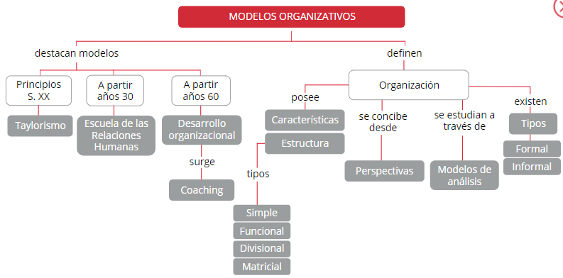
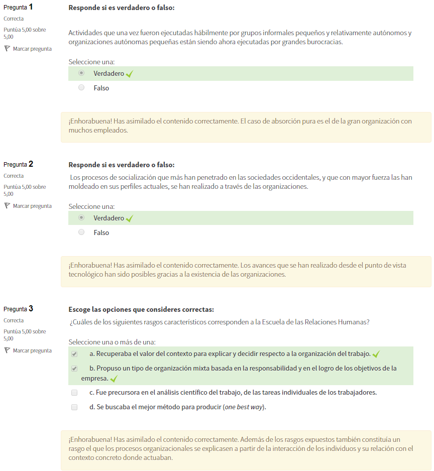

Modelos Organizativos: La humanización de la organización
=========================================================

1. La importancia de las organizaciones
***************************************

Las **organizaciones modernas**, con independencia de las formas que adopten y del modo que puedan aparecer entre nosotros, son probablemente el **fenómeno social** más importante de nuestra tiempo; existiendo una relación estrecha entre organización y sociedad. 

El **desarrollo** de una conlleva el de la otra, porque ambas se gestan, emergen y desarrollan en un mismo sistema. Ambas responden las tecnologías con las que trabajamos, nos divertimos, viajamos a descansamos. 

Según **Charles Perrow**, sociólogo experto en desarrollo organizacional, "El verdadero imperio de hoy y el más efectivo es el **imperio de las organizaciones**". Se mueven en espacios abiertos, moldeando hábitos, valores, religión, cultura, etc apropiándose, en definitiva, de la propia sociedad. 

El sociólogo Charles Perrow explica mediante su proposición "las grandes organizaciones han absorbido a sociedad", que actividades que una vez fueran ejecutadas hábilmente por **grupos informales pequeños y relativamente autónomos** (por ejempla, familias, grupos de vecinos, etc.) y organizaciones autónomas pequeñas (pequeños negocios, gobiernos locales, etc.) están siendo ahora ejecutadas por **grandes burocracias**. 

El caso de **absorción pura** es el de la **gran organización con muchos empleados**. Como resultada, la organización que emplea un gran número de personal puede moldear sus vidas de muchas maneras, la mayoría de las cuales son bastante discretas y sutiles, y las fuentes alternativas de formación de la comunidad declinan frente monopolio de estas grandes organizaciones. 

.. note:: Las **organizaciones modernas**, públicas y privadas, son tipos de ordenamientos sociales que han dado estabilidad la vida humana lo largo de su historia, propiciando las transiciones históricas. 

Los **procesos de socialización** que más han penetrado en las sociedades occidentales, y que con mayor fuerza las han moldeado en sus perfiles actuales, se han realizado **a través de las organizaciones**. 

Los avances que se han realizado desde el punto de vista tecnológico han sido posibles gracias a la existencia de las organizaciones; inclusa, la saciedad es un producto de estas. Puede decirse que las organizaciones san los **actores centrales en la sociedad contemporánea**, los instrumentos que se utilizan para conseguir las metas personales, sociales, políticas y económicas que las personas se proponen. 

Las organizaciones gran escala requieren conformidad, obediencia y subordinación las metas que establecen. De todos modas, mientras el ser humano dependa del salario a de la nómina, la influencia de las organizaciones estará asegurada. A continuación, se presentan das **formas de organización del trabajo** remarcables en la historia: 

- **Taylorismo** 
- **La escuela de las relaciones humanas**

.. note:: El **Taylorismo** es un método de organización del trabaja desarrollado por Frederick Taylor principias del sigla XX que se caracterizaba por la división de tareas del proceso de producción. 

Este método organizativo presenta los siguientes **rasgos característicos**: 

- **Precursor del análisis científico**: Fue precursor en el análisis científico del trabajo, de las tareas individuales de las trabajadores. 
- **Obrero=máquina**: El trabajador era un instrumento o pieza de un engranaje más compleja: la fábrica (obrero=máquina). 
- **Mejor método**: Se buscaba el mejor método para producir (one best way). 
- **Responsables**: El trabajo se dividía entre responsables de programación (capataces, jefes, gerentes, etc. y ejecutores (obreras en general, operarios, etc.). 
- **Procesos de trabajo**: Toda la responsabilidad de pensar en los procesos de trabaja recaía en los jefes, capataces y gerentes. 
- **Operarios meros ejecutores**: Las operarios eran meros ejecutores, sin derecho a intervenir en la programación. 
- **Estructura jerárquica**: Las organizaciones seguían una estructura jerárquica (vertical) e impersonal.
- **Criterio de autoridad**: Se establecía el criterio de autoridad como mecanismo de relación entre las diferentes estamentos. 
- **Tareas fraccionadas**: Se realizaban tareas fraccionadas y rutinarias. 

.. note:: La **Escuela de las Relaciones Humanas** es un método de organización del trabajo que surgió a partir de los años 30 donde se situaron autores como Elton Mayo, Kurt Lewin o Abraham Maslow. Dicha escuela mostró gran importancia por las necesidades del trabajador, la psicología y el comportamiento de los grupos en el trabajo.

La psicología industrial puso su énfasis en las **diferencias individuales** y el uso de test sirvió para diagnosticar tales diferencias y ponerlas al servicio del rendimiento de las trabajadores. Pero, en el fondo, todavía se seguían las directrices de un paradigma racional en el que **el trabajador todavía se situaba en un segundo plano** frente la organización. 

Este método organizativo presenta los siguientes **rasgos característicos**: 

- **Organización mixta**: Propuso un tipo de organización mixta basada en la responsabilidad y en el logro de los objetivos de la empresa. 
- **Interacción individuo-contexto**: Las procesos organizacionales se explicaban partir de la interacción de los individuas y su relación con el contexto concreta donde actuaban. 
- **Interacciones derivan en leyes contexto**: Papel relevante del individuo De las interacciones que se producían en el contexto organizacional se derivaban las leyes que las regían. 
- **Valor del contexto**: Recuperaba el valor del contexto para explicar y decidir respecto a la organización del trabajo. 
- **Papel relevante del individuo**: El individuo pasaba a tener un papel relevante en la organización del trabajo y distribución de funciones. 

- A partir de la **Segunda Guerra Mundial (1939)** aparecen modelos humanistas, entre los que destaca la **Escuela de Recursos Humanos**. Esta Escuela considera todos las miembros de la organización como fuente de recursos, can capacidad creativa, y con un comportamiento responsable, autodirigida y autocontrolado. A raíz de ello se plantea la necesidad de implantar un **nuevo modelo de organización**, diferente al propugnado por el paradigma racional tradicional. Desde el nuevo modelo se permite al trabajador satisfacer sus necesidades de orden superior, es decir, su tendencia al **crecimiento personal en el trabajo**. 
- A partir de las **años 60** la organización pasa a ser un **sistema abierto**. Un diseño más orgánico, para adaptarse a las condiciones cambiantes e inciertas del entorno, Según esta perspectiva sistémica el objeta de estudio se centra en el análisis del individuo, del grupo, de la organización y de su entorno, así como en el estudio de todas las posibles combinaciones de relaciones entre estos componentes, 
- En los **años 80** la atención de la organización se dirige hacia la dirección estratégica de los recursos humanos (miembros de la organización) y los clientes, es decir, hacia la identificación y satisfacción de sus necesidades. 

2. Aproximación conceptual a la organización 
********************************************

El **término de organización** no es única, ya que puede estar refiriendo a distintos órdenes de **realidades**:

- **Social** 
- **Familiar**
- **Empresarial**
- **Educativa**
- **Militar**
- **Económica**
- **Religiosa** 

Todas estas modalidades de organización están estructuradas según un **diseño formal**, cada una con sus particularidades específicas en razón de su naturaleza, 

.. note:: El concepto de **organización** se define a partir de diversas disciplinas: antropología, economía, ciencia política, sociología, psicología y psicología social. Aunque es difícil encontrar características comunes, todas ellas conciben a la organización como un sistema duradero, coherente e independiente y como una entidad capaz de desarrollarse desde sí misma y por sí misma.

Según **Porter, Lawler y Hackman (1975) las características comunes de la organización son**: 

- Composición de la organización: individuos y grupos interrelacionados. 
- Orientación de la organización hacia objetivas y metas específicas. 
- Diferenciación de funciones, división del trabajo. 
- Coordinación racional intencionada. 
- Continuidad a través del tiempo 

Existen algunos **aspectos definitorios generales** del término organización: 

- Se trata de formaciones o entidades sociales con un número de miembros que desarrollan diferentes funciones en el interior de la misma. 
- Está orientada de manera consciente hacia fines y objetivos específicas.
- Está configurada racionalmente, al menas en su intención, con vistas a cumplir los objetivas a fines que se ha propuesto.

A continuación, se presenta un cuadro con **rasgos de la organización según diversos autores**: 

2.1. Perspectivas
+++++++++++++++++

Las organizaciones **pueden concebirse desde una perspectiva**: 

- **Interna**: Como sistemas políticas o como coaliciones de intereses. 
- **Externa**: Como sistemas dependientes del entorno en el que se insertan. 
- **Relacional**: Como sistemas de relaciones simbólicas, de relaciones contractuales o en evaluación permanente. 
- **Micro**: Las organizaciones son concebidas como tipos distintivos del contexto social, que influyen en la conducta y en las valores de sus participantes. 
- **Macro**: Implica aproximarnos a la organización en su conjunto, e incluso, desde el nivel de la población de organizaciones. 
- **Académica**: Según el nivel de análisis (individuo, grupo, organización, interorganización)y el paradigma (racional, natural, cerrado y abierto. 

2.2. Modelos de análisis
++++++++++++++++++++++++

Durante el **siglo XX** han dominado el estudio de las organizaciones **4 modelos de análisis**: 

- **De "sistema racional cerrado"**: Estuvo dominando hasta los años 30 (Taylor, Weber, Fayol). Concibe las organizaciones como máquinas útiles y eficientes, ubicadas en un sistema cerrado, sin interacción con el entorna y considerando al hombre como un ser pasivo. 
- **De "sistema natural cerrado"**: Concepción dominante hasta los años 50 (Mayo, Barnard, Selznick). Enfatiza la estructura informal y se desarrolla de manera similar al sistema racional. También De "sistema natural abierto" ubica a la organización en un sistema cerrado sin interacción con el entorno. 
- **De "sistema racional abierto"**: Se adopta a partir de las años 60 (Thompson, March, Simon, Williamsan). Tiene una visión dinámica y compleja de las organizaciones, Se pone de manifiesta el De "sistema natural abierto" aspecto social y mantiene una permanente interacción con el entorno. 
- **De "sistema natural abierto"**: Adoptado entre los años 70 y 80. El ser humano adquiere total importancia, todo Io que se hace es por su bienestar. Se mantiene la interacción con el entorno. De "sistema natural abierto" 

En estas perspectivas de análisis subyace la **Teoría de los Sistemas**, que concibe a la organización como un conjunto de elementos interrelacionados. Como se ha vista anteriormente, a partir de los cuatro modelas de análisis expuestos existe una **evolución**, desde una concepción de la organización como un sistema: 

- **Cerrado**: Tiene la capacidad de auto-regeneración y/o autoconservación, es decir, no requiere interactuar con el entorno. Se provee así mismo de las energías necesarias para su funcionamiento. 
- **Abierto**: Se caracteriza por interactuar con el entorno que lo rodea y mediante estas interacciones suplir las energías necesarias para su funcionamiento.

El **logro del éxito** dependerá de la relación entre sus elementas y el entorno exterior. 

2.3. Cambios en la organización actual
++++++++++++++++++++++++++++++++++++++

Actualmente, la **concepción de la organización** ha experimentado una serie de **cambios**: 

- Mayor **flexibilidad y descentralización** en cuanto sus estructuras organizativa y productiva, que ya na san de carácter fijo, sino que se diseñan de un modo difuso. 
- Sus miembros se agrupan en **equipos, grupos o proyectos**. 
- Mayor **capacidad negociadora** para mantener unas adecuadas relaciones con las personas, quienes se les requiere disponibilidad mental y física, así coma la polivalencia en relación con sus competencias. 

2.4. Globalización
++++++++++++++++++

.. note:: La **globalización** es un proceso transformacional de todas los estamentos que integran nuestras sociedades y que define, cómo procesa, la naturaleza de final del siglo XX e inicios del actual. 

El proceso globalizador descansa fundamentalmente en el **desarrollo económico**, es decir, prevalecen los aspectos económicos, de producción, apertura de mercada, etc., sobre otros fenómenos de carácter social no menos importantes, Este procesa responde **5 fenómenos**: 

- **Comunicaciones**: El alcance, cobertura, calidad y velocidad de las comunicaciones. 
- **Conexiones económicas**: La abundancia, eficiencia y contundencia de las conexiones económicas entre unas sectores y otros, entre unos países y otras, aparentemente distantes entre sí. 
- **Cobertura planetaria**: Cobertura planetaria de la operación de las transnacionales.
- **Debilitamiento de los estados**: El debilitamiento del papel de los estadas nacionales, sobre todo de las países denominados subdesarrolladas. 
- **Existencia de problemas**: La existencia de problemas y causas comunes en toda la humanidad.

2.5. Aspectos clave del contexto actual
+++++++++++++++++++++++++++++++++++++++

En este marco, los expertos exponen que se pretende explicar y reconstruir el papel del trabaja y su organización para que pueda responder a los nuevos retas culturales y productivos planteadas baja las parámetros de la globalización. Los **aspectos clave** que caracterizan las tendencias fundamentales **de este momento histórico son**: 

- Una **nueva sociedad** emergente después de la era industrial. 
- Está basada en **recursos autogenerados**: información, gerencia, capacidad de emprendimiento y aprendizaje.
- Fuertemente **centrada en conocimientos** puros y aplicados. 
- Con algunas **rasgos típicos**: diversidad (en vez de uniformidad), opciones múltiples, individualismo. 
- Demanda una cantidad nunca antes vista de **profesionales** capaces de resolver problemas complejos. 

2.6. Organización del trabajo
+++++++++++++++++++++++++++++

La **organización del trabajo** está profundamente influida por un conjunto de factores derivados de los **procesos de cambio** económico-productivo, científico-técnico y de gestión, enmarcados en un proceso mucho más amplio como es el de la globalización. Esto puede verse reflejado en la siguiente gráfica: 

3. Tipos de organizaciones
++++++++++++++++++++++++++ 

Existen **2 tipos de organización**: 

- **Formal**: Toma muy poco en cuenta las distinciones y valores sociales, considerando simplemente las relaciones funcionales, las líneas lógicas de comunicación y coordinación horizontal y vertical. **Se caracteriza por los siguientes rasgos**: 

	- Responde un diseño racional previo y está estructurada sobre la base de unas reglas. 
	- Dos de las principios en los que se sustenta este tipo de organización: unidad de objetivo y de eficiencia. 
	- La finalidad que tiene es posibilitar el logro de las objetivos de la organización de forma efectiva.

	- Establece **vínculos interpersonales rígidos**, con una marcada racionalidad que define las estructuras organizativas y funcionales de las organizativas formales. 

- **Informal**: Denomina al conjunto de interacciones y relaciones que se establecen entre las diversos elementos humanos de una organización. Se caracteriza por los siguientes **rasgos**: 

	- Surge de forma espontánea a partir de la organización formal y no tiene una estructura definida e institucionalizada. 
	- Su origen tiene carácter periférico, marginal, hasta invisible, de las estructuras y rigores funcionales que definen las formales. 
	- Tienen en cuenta las necesidades socioafectivas de los miembros. 

A continuación, se muestra un cuadra que expone al detalle las **diferencias entre la organización formal y la informal**: 

.. figure:: ../../_static/2_team_building/2.1_modelos_organizativos/diferencias_organizacion_formal_informal.png
   :width: 70%
   :align: center

3.1. Instrumentos de la organización formal
+++++++++++++++++++++++++++++++++++++++++++

La **organización formal** emplea una serie de instrumentos que favorecen la planificación. Los **instrumentos más utilizados** por la estructura formal son: 

- **Manuales de organización**: San instrumentos de apoyo que definen ámbitos de competencia y señalan las niveles de responsabilidad en una institución a unidad administrativa:

	- Describen relaciones presentes entre los elementas que componen la estructura organizacional, permitiendo una visión integral. 
	- Instruye al personal acerca de objetivos, funciones, niveles jerárquicos, normas y políticas; como herramienta de trabajo, capacitación y consulta. 
	- Señala las funciones encomendadas cada unidad administrativa para precisar el papel y la responsabilidad operativa que corresponde asumir a cada una de las partes integrantes. 

- **Organigrama**: Sirve para representar de forma gráfica las principales unidades organizativas y relaciones de autoridad, como forma más inmediata de visualizar la estructura formal, Ejemplo de organigrama de una empresa: 

	.. figure:: ../../_static/2_team_building/2.1_modelos_organizativos/organigrama.png
	   :width: 65%
	   :align: center

3.2. Instrumentos de la organización informal
+++++++++++++++++++++++++++++++++++++++++++++

El **instrumento** que se utiliza para la **estructura informal es el sociograma**, donde se reflejan las relaciones informales entre los empleados. 

.. note:: Se debe tender un buen ajuste entre la organización formal (estructura representada mediante el organigrama) y la organización informal (estructura representada mediante el sociograma). 

4. La estructura
****************

.. note:: La **estructura** es el esqueleto de la organización que proporciona las niveles jerárquicos y las áreas funcionales a de actividad dentro de las cuales debe desarrollarse.

Permite que la organización pueda realizar sus objetivas. Su **importancia** se refleja en el efecto que tiene sobre los roles, la comunicación, la autoridad, la responsabilidad y la eficacia organizativa. 

Una de las definiciones más conocidas de **estructura organizativa** se debe a **Kast y Rosenzweig (1987)**, para quienes dicho concepto incluye los siguientes elementos: 

- El **patrón de relaciones y obligaciones formales** (organigrama, descripción de puestos de trabajo). 
- La forma en que las diversas actividades o tareas son asignadas a diferentes departamentos y/o personas en la organización (**diferenciación**). 
- La forma en que estas tareas a actividades separadas son coordinadas (**integración**). 
- Las **relaciones de poder, de status y jerarquías** dentro de la organización (sistema de autoridad). 
- Las **políticas, procedimientos y controles formales** que guían las actividades y relaciones de la gente en la organización. 

Los **componentes esenciales** de la estructura son: 

- **Núcleo de operaciones**: Hace referencia a las trabajadores que están directamente relacionadas con las actividades de explotación. Su **objetivo** consiste en realizar el trabajo básico de producción de bienes y/o servicios. Constituye el **centro de toda organización**, ya que se ocupa de ejecutar las actividades básicas para las que dicha organización ha sido creada. 
- **Ápice estratégico**: Se sitúa jerárquicamente en el **extremo opuesto** de la organización respecto al núcleo de operaciones. Se identifica con la alta dirección de la empresa. Su objetiva es conseguir que la organización alcance su misión, satisfaciendo al mismo tiempo los intereses de las personas y grupos que participan de alguna manera en la misma. 
- **Línea media**: Está constituida por el conjunto de **directivos** que están **situados jerárquicamente** entre el ápice estratégico y el núcleo de operaciones. Su objetivo es servir de enlace entre estos dos niveles. 
- **Tecnoestructura**: Son profesionales no involucrados en la ejecución directa del trabajo de la organización. Son **analistas que planifican, diseñan y mejoran el trabajo** que tienen que hacer otras. San los contables, planificadores, ingenieros, formadores, etc. Su objetivo es servir a la organización tratando de hacer más efectivo el trabajo de los demás. 
- **Staff de apoyo**: Son **elementos organizativos** cuya actividad consiste en el **asesoramiento o consejo experto** a la línea ejecutiva, El staff no puede tamar decisiones que afecten las operaciones básicas relacionadas con las productos o servicios que ofrece la empresa, únicamente aconsejar al directivo de línea que es quien tomará la decisión. 

La estructura está constituida por **3 dimensiones básicas**: 

- **Centralización/descentralización**: Se refiere a la forma en que se halla distribuido el poder y la toma de decisiones, Una alta concentración implica **alta centralización o descentralización**. 
- **Complejidad**: Es el **grado de diferenciación** que existe dentro de una organización, es decir, la variedad de unidades en que se agrupa a las miembros de esta. En función de los roles, los puestos, las conocimientos, las funciones, los rangos, etc. Para analizar la complejidad se utilizan **3 elementos**: 

	- **Diferenciación horizontal**: grado de diferenciación que existe entre las unidades, en función de la orientación de las miembros, la naturaleza de las tareas que realizan y de su educación y preparación. 
	- **Diferenciación vertical**: número de niveles jerárquicos que definen la estructura, Mientras aumenta la diferenciación horizontal, aumenta el número de niveles jerárquico (aumentando también la complejidad). 
	- **Diferenciación espacial o geográfica**: se refiere al grado según el cual la localización de las instalaciones y el personal de una organización están dispersos geográficamente. 

 **Formalización**: Se entiende como el **establecimiento de reglas y procedimientos**. Es importante para la organización porque reduce la variabilidad en el comportamiento de los empleados y aumenta y favorece la coordinación entre las personas, reduciendo el coste de los distintos puestos. 

4.1. Tipos de estructura
++++++++++++++++++++++++ 

No todas las organizaciones tienen la misma estructura. Así, en la medida en que crecen se van haciendo más complejas. Ante un mercado cada vez más variable y un entorna externo incierta, la organización busca otro tipo de estructuras más adecuadas las nuevas situaciones. De este modo, **los tipos de estructura dependerán de**: 

- **Contingencias**: A las que tenga que hacer frente (organizaciones más o menos formadas). Las organizaciones más influenciadas por el medio son las más sólidas y, par tanto, las que mejor harán frente a los problemas del exterior. 
- **Grado de incertidumbre**: Las organizaciones más sólidas controlarán mejor los cambios que puedan ocurrir. 
- **Sector de actividad**: Al sector de actividad que corresponda. 
- **Tecnología**: A mayor tecnología mayor complejidad de la organización. 
- **Tamaño**: A mayor tamaño, mayor complejidad. 

El criterio utilizado en la **tipología de estructuras organizativas formales** ha sido el propia criterio de departamentalización o diferenciación horizontal, que define las agrupaciones básicas en la estructura organizativa formal. Por tanto, las **estructuras son**: 

- **Simple** 
- **Funcional**
- **Divisional** 
- **Matricial** 

4.1.1. La estructura simple
--------------------------- 

Está compuesta de la dirección (**ápice estratégico**) y un único conjunto de participantes (**núcleo operativo**). 

.. figure:: ../../_static/2_team_building/2.1_modelos_organizativos/estructura_simple.png
   :width: 70%
   :align: center

Los **rasgos característicos** de esta estructura son: 

- La división del trabajo y especialización son mínimas, los participantes realizan tareas para las que son requeridos en cada momento. 
- No existe formalización del comportamiento. 
- La centralización es absoluta. 
- No existe ningún criterio de departamentalización. 
- No existe ningún órgano de apoyo o staff. 
- El alcance de control es absoluto, Dirección general Participantes 

4.1.2. La estructura funcional
------------------------------ 

Se basa en el propio **criterio de departamentalización**, que busca agrupaciones de tareas con base a las que se consideran funciones típicas de una empresa: logística, producción, comercialización, etc. 

.. figure:: ../../_static/2_team_building/2.1_modelos_organizativos/estructura_funcional.png
   :width: 70%
   :align: center

Las **rasgos característicos** de esta estructura son: 
- Dirección genera I La especialización es una de los rasgas de esta estructura. 
- Existe un cierto grado de formalización del comportamiento. 
- El nivel de centralización tiende ser alto. 
- El criterio de departamentalización será de carácter funcional. 
- Suele conllevar un importante componente administrativa. Necesidad de staff. 
- El alcance de control y el número de niveles jerárquicas vendrán determinados por otra serie de variables como el propio tamaño de la empresa.

4.1.3. La estructura divisional
------------------------------- 

Este tipo de estructura parte de la **separación del conjunto de la estructura**. Las divisiones pueden definirse como partes autónomas de una empresa en el nivel estructural. Cada división reúne lo esencial de los medios necesarios, en personas e infraestructuras, para el desarrollo de su actividad. Supone la existencia del **ápice estratégico o dirección general y de divisiones** que forman un gran núcleo operativa. Normalmente puede existir staff de asesoramiento a la alta dirección de la empresa. 

.. figure:: ../../_static/2_team_building/2.1_modelos_organizativos/estructura_divisional.png
   :width: 70%
   :align: center

Las **rasgos característicos** de esta estructura son:

- Se incluye la **variable descentralización** como elemento definitorio de la estructura divisional. La coordinación de las divisiones está basada en esta variable. 
- Es necesaria la variable de formalización. Especialización por segmento estratégica.
- El criterio de agrupación suele ser en términos de productas a procesos. 
- Escaso componente administrativa, en todo caso mantendrá personal de staff de asesoramiento. 
- Mantiene un alcance de control total. La dirección controla a todas las divisiones.

4.1.4. La estructura matricial
------------------------------

Se denomina en ocasiones sistema de mandos múltiples. La organización cuenta can das tipos de estructura simultáneamente. Las empleadas tienen, de hecho, dos jefes; es decir, **trabajan con dos cadenas de mando**. Una cadena de manda es la de **funciones o divisiones**, el tipo que se diagrama en forma vertical en las gráficas que anteceden. El segundo es una **disposición horizontal** que combina al personal de diversas divisiones o departamentos funcionales para formar un equipo de proyecto o negocio, encabezado por un gerente de proyecto o un grupo, que es experto en el campo de especialización asignada al equipo. 

.. figure:: ../../_static/2_team_building/2.1_modelos_organizativos/estructura_matricial.png
   :width: 70%
   :align: center

Las **rasgos característicos** de esta estructura son:

- El grada de especialización es importante. 
- El criterio de departamentalización es doble, siendo esta característica definitoria del modelo. 
- El alcance de control, por parte de la dirección general, es total. Controla todos las proyectos o etapas del procesa. 
- El componente administrativo es prácticamente nulo. 

5. Cambio y desarrollo en la organización
*****************************************

El paradigma que ha dominado durante los primeros años del siglo XX hacía más énfasis en el control que en el cambio. Con la introducción de los **modelos humanistas** en la organización se enfatizan la **intersubjetividad y el cambio en función de valores humanísticos**. 

Desde finales de los **años 60 y durante los 70** se prestó mucha atención al **cambio organizacional planificado**, tanto por parte de académicos camo de profesionales, llamado Desarrollo Organizacional. 

.. note:: Concepto clave Beckhard (1973) define el **Desarrollo Organizacional** como un esfuerzo planificado de amplitud organizacional dirigida desde cúspide para incrementar efectividad y salud organizacional, través de intervenciones planificadas en los procesos organizacionales y usando el conocimiento de las ciencias del comportamiento. 

5.1. Teorías del cambio organizacional
++++++++++++++++++++++++++++++++++++++

Las **teorías del cambio organizacional** se centran en la explicación de la dinámica a través de la que cambian las organizaciones. Las procesos y secuencias de acontecimientos que se despliegan en estas cambias son muy difíciles de explicar Se identifican **4 tipos de teorías** para explicar cómo y por qué cambian las organizaciones: 

- **De ciclo vital**: Consideran que cada estadio sucesiva evoluciona partir del previa. El **cambio** está dirigido **desde un código genético** a programa prefigurado interno a la entidad en desarrolla. 
- **Teleológicas**: Estas teorías usan la **teleología para explicar el desarrollo** y se basan en la asunción de que el cambio persigue una meta o estado final de forma intencionada. Asumen que las organizaciones están formadas por individuos adaptativos y propositivos que, por sí mismos o en interacción, construyen un estado final ideal, adaptan acciones para alcanzarlo y evalúan sus progresas. 
- **Dialécticas**: Según estas teorías la fuerza desencadenante del cambio es el supuesto de que la organización existe en un munda plural de **acontecimientos en competición**, fuerzas o valores contrapuestos que compiten unas con otros por la dominación y el control. 
- **Evolucionarias**: Como en la evolución biológica de las especies, el cambio proviene de un **ciclo continuo de variación, selección y retención**. Explica los cambios como una progresión probabilística y acumulativa de variación, selección y retención de entidades organizacionales. 

6. Coaching y cambio organizativo
********************************* 

El cambio ha estado presente a lo larga de la vida de la organización y siempre la va a estar, ya que es necesario y, en ocasiones, se presenta de forma repentina, En este contexto el **coaching desempeña un papel fundamental** a la hora de ayudar a las individuas y organizaciones aceptar el cambio como un desafío, en lugar de como un obstáculo. 

.. note:: El **coaching**, anglicismo que proviene del verbo "to coach" (entrenar) se define como un método de acompañamiento e instrucción de una persona para que desarrolle determinadas habilidades o alcance diversas metas. 

La **función del coach** como agente de cambio en una organización puede asumir las **formas** siguientes (**Zeus y Skiffington, 2005: 32**): 

- El coach interna o externo que introduce un programa de coaching en una organización que trabaja para **establecer una cultura de coaching**.  
- El coach que **colabora con ejecutivos** en el desarrollo y mejora de sus **técnicas de liderazgo** en áreas tales como la inspiración y gestión del cambia organizativo. 
- El coach que **trabaja con líderes o directivos** para adaptar un **estilo de coaching** como, por ejemplo, un programa de "el directivo como coach".
- El coach que se concentra en **cuestiones empresariales**, tales coma la clarificación de valores, el desafío de creencias y el trabajo relacionado con objetivas y estrategias, permite al ejecutiva emplear estas técnicas con el personal y las compañeras de trabaja, desempeñando su rol en la creación de una organización basada en el aprendizaje. 
- El coach, o entrenador, para **actuar en el entorno organizativo** ha de adoptar un **enfoque sistémico**, es decir, que identifique, conozca y sea capaz de trabajar con los factores tanto internas coma externos que inciden en la organización y sus miembros. 

De este modo el **rol de coach puede implicar**:

- Concentrarse en los procesos humanos en la organización. 
- Implantar un diseño organizativo. 
- Desarrollar y mejorar las competencias de trabajo.
- Asistir los individuas en los cambios tecnológicos. 
- Desarrollar a directivos y líderes. 
- Instituir un amplia programa de coaching para el cambia. 

Lo anteriormente desarrollado nos lleva a afirmar la necesidad de que el coach tenga un **conocimiento fundado de la organización**. Es importante que sea consciente del **clima y la cultura**, de los retos a los que tiene que hacer frente, de los programas actuales de aprendizaje y desarrolla y de los programas y filosofía de gestión de personal. 

- **Clima**: Se define como el conjunto de aspectos visibles e invisibles, tangibles e intangibles que están presentes en un lugar determinado y que influyen en los comportamientos que se desarrollan en ese ámbito. Está directamente relacionado con las actitudes, influyendo de forma decisiva en el comportamiento de las personas. 
- **Cultura**: Es el conjunto de creencias, valores, modelos de conducta y conocimientos que son compartidos por la mayoría de los miembros de la organización. Puede decirse que está constituida por una red de significadas que guían y modulan las comportamientos de quienes trabajan en ella. 

De este modo cada **programa de coaching** tiene que tener en cuenta el clima y la cultura de la organización para responder las necesidades de la misma. 

Un **buen programa de coaching** para el cambio debe realizar una transición de la teoría a la práctica para ayudar a los individuos, grupos y organizaciones a gestionar su propia transformación y crecimiento. 

La **teoría de los sistemas** puede enfocar el cambia en la organización desde **2 perspectivas** diferentes: 

- **1ª perspectiva**: Consiste en centrarse en los **problemas inherentes a los sistemas** que funcionan en la organización. Está **orientada a la acción** que pretende aislar los problemas, las causas y establecer las soluciones y las acciones necesarias para resolverlos. 
- **2ª perspectiva**: Se trata de la **evaluación apreciativa**, que hace hincapié en descubrir y apreciar lo que es mejor en la organización. El programa de coaching para el cambio o**rienta a todos los individuos** hacia los cambios deseados en lugar de alejarlos de aquella que resulta insatisfactorio o provoca ansiedad. 

Según algunas estudios (Zeus y Skiffngton, 2005) las **repercusiones de introducir un cambio sin coaching** y sin prestar apoyo a los implicados son: 

- Baja moral. 
- Escasa calidad de las servicios o productos. 
- Escasa comunicación interna. 
- Aumento de la conflictividad en el lugar de trabajo. 
- Incremento de la falta de equilibrio entre vida personal/trabajo con impactos negativos en la salud y el rendimiento laboral. 
- Dificultades en la retención del personal.

6.1. El coach como agente de cambio
+++++++++++++++++++++++++++++++++++ 

El **coaching** está **relacionado con el cambio y mejora** las habilidades actuales, las nuevas técnicas de aprendizaje y los valores, creencias y comportamientos de transformación, tanta en el ámbito personal como organizativo. 

En el campo de las **organizaciones** el cambio es un factor importante debida las distintas concepciones por las que ha pasada la organización, En esta última perspectiva más socializada se incluye el **coaching como proceso** que cambia y mejora la motivación y rendimiento de los miembros de la organización.

Las **coaches** necesitan saber qué tipo de aprendizaje deben promover, dónde reside la fuente de cambio y qué le da al coach al término de la intervención. Puede utilizarse un modelo conductual o un modela reflexivo, a combinar características de ambas, dependiendo de la situación. 

Según el modelo sugerido por **Beckhard y Pritchard (1992)** las coaches pueden iniciar el **proceso de cambio** en cualquiera de las **7 áreas**: 

- **Trabajo**: En el tipo de trabajo y en cómo se desempeña. 
- **Relaciones**: En las funciones y relaciones entre los individuos. 
- **Mercado**: En la identidad de la organización en el mercado. 
- **Clientes**: En la relación de la organización con las clientes y el munda exterior. 
- **Organización**: En la misión de la organización. 
- **Cultura**: En la cultura. 
- **Procesos**: En los procesas organizativos para afrontar el cambio en el entorno.

6.2. Impactos derivados de la introducción de una cultura de coaching
+++++++++++++++++++++++++++++++++++++++++++++++++++++++++++++++++++++ 

Según **Zeus y Skiffington (2007: 54)**, en la actualidad, las **beneficios y ventajas del coaching** gozan de un creciente reconocimiento en el ámbito empresarial. 

Algunas organizaciones han adoptado una cultura de coaching en la que todos **los directivos están considerados como coaches**. Otras, sin embargo, se muestran reacias proceso de coaching, ya que temen que este procesa implique una **pérdida de poder y posición**. 

6.3. Profesionales con vocación de persona 
++++++++++++++++++++++++++++++++++++++++++

Actualmente, gracias a la **gestión de los recursos humanos** se realizan numerosas actividades para motivar, incentivar, premiar y formar tanto a trabajadores como directivos. 

La organización mediante recursos como la formación, los incentivos, el coaching, etc. pretende **la superación y el bienestar de sus miembros** para una buena consecución de sus metas, que están encaminadas a la satisfacción de los clientes, en definitiva, a la **satisfacción de personas**. 

**Gómez-Acebo Avedillo**, propone una serie de **características de las personas** que se comportan de manera positiva dentra de la empresa (2003: 136-142): 

- **Viven la persona como vocación**: Se trata de saber trabajar con cualquier persona y hacer de estas las mejores. "La persona no tiene límite" es importante percibir esta capacidad inabarcable. Conseguir extraer la verdadera motivación que está en su interior na es una profesión debe ser una vocación. 
- **Profesionales volcados a trabajar para un bien social**: Capaces de anteponer las personas a los propios intereses. La hacen siempre por voluntad y par decisión propia, no buscando el halaga, parque saben que es la mejor manera de conseguir sus metas. 
- **Nunca solos**: El aislamiento y la soledad en la que se mueve cotidianamente el profesional le lleva enfocar la actuación hacia sí mismo. Hay que distinguir aquellas personas que son capaces de avanzar siempre con otros, ganen o pierdan con ellos. 
- **Capaces de trabajar con cualquiera y sacarle lo mejor**: Son buenos no por tener su lado los mejores, sino porque estar a su lada hacen de ellos las mejores. El que se asoma lo mejor de su gente sabe trabajar con cualquiera y cualquiera es válida para trabajar 
- **Capaces de identificar los puntos fuertes en los demás**: Dejando de lado los puntas débiles para un segundo momento, identifican las puntos fuertes; desde ahí dirigen sus actuaciones y van incorporando pequeñas parcelas de debilidades para superarlas. Sobre las puntos fuertes se crece siempre, las debilidades suponen demasiada esfuerzo y poco crecimiento; deben dejarse para un segundo momento. 
- **Reflexivos y observadores**: El que observa y escucha siempre es un ganador o ganadora. Es decir, incorpora siempre algo nuevo que considera bueno respecto de lo que ye tiene, por tanto, mejora la que ye hay. Cada vez es capaz de hacer más cosas observando y escuchando porque no hay que dedicarse hacerlas todas, sino a indicar forma en que otras pueden hacerlas, esto es delegar 
- **Con ideales y un mapa de valores**: Hacer crecer las demás da sentido a su vida. Saben lo que quieren, quieren Io que hacen y hacen lo que quieren. 
- **Comprensivos**: Su capacidad de perspectiva les permite posicionar todos en distintas etapas del recorrida de la vida y desde ahí pueden comprender más que juzgar y tirar de cada uno desde la posición que se encuentre. 
- **Exigentes**: Llevan su lada personas que saben lo que tienen que hacer, na se trata de personas fuera de lo común porque obtengan los mejores resultados, sino porque son capaces de coordinar mejor las mentes de su gente desde exigencia y el compromiso común. 
- **Compaginan ocio, actividad y negocio**: No eliminan ninguna de estas facetas clave del crecimiento personal, sina que se focalizan en una u en otra factor, manteniendo siempre el eje central en cualquiera de ellas: su propia eje. 
- **Invierten en sí mismos**: Son los primeros en servir a los demás como mejor inversión de futuro. Al que da primero, le toca recibir después. 
- **Hacen sentirse orgulloso de la organización a la que pertenecen**: Recuperar el orgullo de pertenencia basado en la cohesión interna y en la generosidad se traduce siempre en un beneficio de la imagen de esa empresa. Sentirse orgulloso en este sentido será una de las claves de futuro en vida empresarial. Sin prepotencia ni pasar factura de nada, el orgullo necesario se manifiesta con hechos, no con palabras. 
- **Se rodean de los mejores**: Desde el afecta atraen a las mejores personas, capaces de cualquier cambio para mejorar. 
- **Trasladan alegría y humor en los momentos de auge y en las crisis**: La alegría y el estado de ánima positivo permiten la perspectiva y la visión más allá del momento. La certeza de hacer las cosas bien le permite hacer uso del sentido del humor en circunstancias adversas. 
- **Viven el presente hacia el futuro**: La persona es capaz de proyectar a medio y largo plazo desde el corta plaza. Adapta los ejes claves de su actuación las circunstancias del momento y saca conclusiones de esas circunstancias para adelantarse las acontecimientos futuros. 
- **Hacen sentir bien a la gente consigo misma**: La verdadera motivación sale de dentro. Saben descubrir lo que le motiva y les hace sentirse únicos y tienen detalles de reconocimiento sobre esos aspectos que aumentan la satisfacción interna de los demás. 
- **Invierten tiempo en apreciar a sus empleados**: La reciprocidad del afecta se convierte en un elemento multiplicador en las organizaciones. Dedican tiempo su gente que equivale a quererla y defenderla en toda momento. 
- **Cambian los objetivos por valores**: Orientan hacia el máximo potencial en vez de exigir mínimos. Cambian el "tienes que hacer", por "¿cuánta crees que puedes hacer? 
- **No son perfectos**: Tienen debilidades como toda el mundo, pero aceptan y son aceptados con sus defectos y virtudes. Utilizan los puntos fuertes camo resorte y reconocen los débiles proponiendo alternativas para superarlas. Convierten así su encaje y capacidad de reacción frente las debilidades en otro punto fuerte. 
- **Controlan el ego y afán de protagonismo**: Tienen su ega como todo el mundo, pero no dejan que se manifieste sin control en sus actuaciones. Poseen un alto nivel de autoexigencia que les permite manejar adecuadamente sus relaciones través de habilidades sociales no verbales, tales coma gestos, posturas, miradas, tono de voz, etc. favor de los demás y no para su propia beneficio o desahogo. Ello les hace ser mansos, obedientes, pera no sumisos. 
- **Son ganadores porque saben perder**: Saben que sólo desde el compromiso se alcanzan acuerdas que hacen que la compañía avance. Un acuerda requiere que las partes cedan algo para que estén todas representadas en el misma. Todas ceden para ganar todos. 
- **Tienen más corazón que cabeza**: Hacen que su cabeza se deje guiar por el corazón. Razonando los sentimientos. Son reconocedores de que, en la vida, las cosas importantes tienen que ver más con el corazón que con la cabeza y eso les hace clara la elección en cada momento. 

7. Resumen
**********

- Las **organizaciones modernas**, con independencia de las formas que adapten y del moda que puedan aparecer ante nosotros, son probablemente el **fenómeno social** más importante de nuestro tiempo. 
- La **globalización** es un proceso transformacional de todos las estamentos que integran nuestras sociedades y que define, como proceso, naturaleza de final del siglo XX e inicias del actual. 
- El **Desarrollo Organizacional** se define como un esfuerzo planificado de amplitud organizacional dirigido desde cúspide para incrementar la efectividad y salud organizacional, través de intervenciones planificadas en los procesos organizacionales y usando el conocimiento de las ciencias del comportamiento. 
- El **coaching** está relacionada can el **cambio y mejora** las habilidades actuales, las nuevas técnicas de aprendizaje y las valores, creencias y comportamientos de transformación, tanto en el ámbito personal como organizativo. 

7. Descargas
************

- **Rasgos de la organización**: :download:`pdf <../../_static/2_team_building/2.1_modelos_organizativos/ficheros/rasgos_organizacion.pdf>`

8. Actividades
**************

.. figure:: ../../_static/2_team_building/2.1_modelos_organizativos/actividades/actividad_1_1.png
   :width: 70%
   :align: center

.. figure:: ../../_static/2_team_building/2.1_modelos_organizativos/actividades/actividad_1_2.png
   :width: 70%
   :align: center

.. figure:: ../../_static/2_team_building/2.1_modelos_organizativos/actividades/actividad_1_3.png
   :width: 70%
   :align: center

.. figure:: ../../_static/2_team_building/2.1_modelos_organizativos/actividades/actividad_2_2.png
   :width: 70%
   :align: center

.. figure:: ../../_static/2_team_building/2.1_modelos_organizativos/actividades/actividad_2_3.png
   :width: 70%
   :align: center

.. figure:: ../../_static/2_team_building/2.1_modelos_organizativos/actividades/actividad_3_3.png
   :width: 70%
   :align: center

.. figure:: ../../_static/2_team_building/2.1_modelos_organizativos/actividades/actividad_3_4.png
   :width: 70%
   :align: center

.. figure:: ../../_static/2_team_building/2.1_modelos_organizativos/actividades/actividad_4_2.png
   :width: 70%
   :align: center

.. figure:: ../../_static/2_team_building/2.1_modelos_organizativos/actividades/actividad_4_3.png
   :width: 70%
   :align: center

.. figure:: ../../_static/2_team_building/2.1_modelos_organizativos/actividades/questionnaire_2.png
   :width: 70%
   :align: center

.. figure:: ../../_static/2_team_building/2.1_modelos_organizativos/actividades/questionnaire_3.png
   :width: 70%
   :align: center

.. figure:: ../../_static/2_team_building/2.1_modelos_organizativos/actividades/questionnaire_4.png
   :width: 70%
   :align: center

.. figure:: ../../_static/2_team_building/2.1_modelos_organizativos/actividades/questionnaire_5.png
   :width: 70%
   :align: center

.. figure:: ../../_static/2_team_building/2.1_modelos_organizativos/actividades/questionnaire_6.png
   :width: 70%
   :align: center

.. figure:: ../../_static/2_team_building/2.1_modelos_organizativos/actividades/questionnaire_7.png
   :width: 70%
   :align: center
