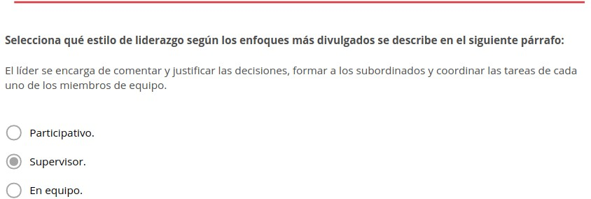

El liderazgo en el equipo
=========================

1. Liderazgo
************

Un fenómeno constante en la historia de la humanidad es el **liderazgo**. En distintas épocas y diversas culturas muchos intelectuales y filósofos han mostrado interés en estudiarlo. 

Según **Robert Lussier y Christopher Achua**, el liderazgo es "el proceso de influencia de líderes y seguidores para alcanzar los objetivos de la organización mediante el cambio". 

**Otros autores** conciben el liderazgo dentro una organización como la forma en que una persona logra influir en los sentimientos, creencias y el comportamiento de las personas que integran el grupo laboral. 

Los rasgos comunes en ambas definiciones son: 

- La influencia de un líder sobre sus seguidores. 
- Los objetivos comunes como organización o grupo. 

.. note:: La **influencia** es el efecto que tiene el líder sobre los otros y es el aspecto distintivo del liderazgo como concepto.

.. note:: El **poder** es la capacidad de influir sobre el comportamiento de los otros o sobre sus valores. Es otro aspecto fundamental del liderazgo.

2. Enfoques en la teoría de liderazgo
*************************************

El **liderazgo se ha convertido en un tema de estudio muy atractivo e interesante** tanto en el ámbito público como privado. Producto de estas investigaciones se han generado variedad de modelos y teorías. 

Existen **dos tipos de modelos teóricos**: 

- Enfoques centrados en el líder. 
- Teorías situacionales o de contingencia. 

2.1. Enfoques centrados en el líder
+++++++++++++++++++++++++++++++++++

Los **enfoques centrados en el líder** analizan las características del líder y de sus seguidores y contrasta qué conductas hacen más eficaz la labor de un líder y cuáles no. 

Existen **dos modelos explicativos**: 

- Enfoque del rasgo. 
- Enfoque de los estilos de liderazgo. 

2.1.1. Enfoque de rasgo
-----------------------

.. note:: El **enfoque del rasgo** surge a principios del siglo XXy defiende que, a diferencia de sus seguidores, un líder tiene una serie de características que lo dotan de la capacidad para dominar e influir sobre los demás. 

El enfoque del rasgo presenta tres **factores determinantes**: 

- **Rasgos característicos de los líderes**: energía física, mayor inteligencia que sus seguidores, autoconfianza, motivación de logro y de poder, habilidades interpersonales, dominancia, locus de control interno, integridad y estabilidad. 
- **Situación del líder**: cuando las características del líder son relevantes en el medio donde se desenvuelve, aumenta el efecto de estos rasgos sobre su conducta y esto incide en su efectividad como líder. 
- **Expresión de condiciones individuales**: los rasgos tienen mayor peso sobre las conductas de los líderes en ambientes donde es posible expresar las condiciones individuales. Cuando esto no es posible, priman las conductas de los líderes por encima de los rasgos. En **ambientes donde no es posible expresar las condiciones individuales** existen normas estrictas y sistemas de recompensa y castigo relacionados a determinados comportamientos. 

El enfoque del rasgo presenta las siguientes **contrariedades**:

- Todas las personas que reúnan estos rasgos característicos son líderes. 
- No son líderes las personas que nacen con una proporción incorrecta de estos rasgos característicos. 
- No es posible ajustar la proporción de estos rasgos característicos mediante un programa formativo que les permite mejorar su ejecución. 

2.1.2. Enfoques de los estilos de liderazgo
-------------------------------------------

.. note:: El **enfoque de los estilos de liderazgo** consta de un conjunto de teorías que indagan sobre el origen de las conductas del líder y el efecto que estas producen en los seguidores. 

Las **teorías agrupadas** dentro del enfoque de los estilos de liderazgo son: 

- Teoría XY de Douglas McGregor. 
- Estudios de la universidad de Ohio. 
- Estudios de la universidad de Michigan. 
- La rejilla gerencial de Blakey Mouton. 

2.1.2.1. Teoría XY de Douglas McGregor
~~~~~~~~~~~~~~~~~~~~~~~~~~~~~~~~~~~~~~

La **teoría XY de Douglas McGregor** fue publicada en su libro "El lado humano de las organizaciones" en el año 1966. 

El texto planteaba un **enfoque distinto acerca del control** en el campo de la conducta humana. 

A partir de la teoría de la jerarquía de necesidades de Abraham Maslow, McGregor desarrolla una **nueva forma de trabajar la motivación en las empresas**. 

Douglas McGregor se basó en la idea de que las **personas son seres individuales, pero también son seres sociales**. 

Asi como los seres humanos buscan satisfacer sus necesidades básicas y persiguen objetivos propios, también necesitan satisfacer otro tipo de necesidades: como el **progreso y la superación**. 

En este sentido, **McGregor elaboró dos postulados que se contraponen**: 

- **Teoría X**: 
	Se centra en la figura del jefe, quien distribuye el trabajo, provee formación y deja claras las normas de trabajo y las expectativas que se tienen acerca del desempeño de los empleados. 

	De acuerdo con esto, en las organizaciones las **personas solo son motivadas por la compensación económica**, dejando de lado valores como la cooperación y la iniciativa propia. De este modo, las personas muestran un total desinterés por asumir responsabilidades y absoluta desmotivación por la realización del trabajo. 

	**Favorece** la fragmentación del trabajo y el control de las labores de todos los trabajadores. 

- **Teoría Y**: 
	Aborda el liderazgo como un ejercicio de partición y consulta, donde se da por sentado que existe en el grupo interés por cooperar y compromiso con las labores que se llevan a cabo.

	De acuerdo con esto, en las organizaciones las **personas son motivadas por la satisfacción del trabajo bien realizado**. Desean asumir responsabilidades y tiene la capacidad de ejercer control sobre sí mismos y, de esta forma, controlar su desempeño. 

2.1.2.2. Estudios de la Universidad de Ohio
~~~~~~~~~~~~~~~~~~~~~~~~~~~~~~~~~~~~~~~~~~~

La Universidad de Ohio es pública y está situada en Athens, estado de Ohio, Estados Unidos. 

Allí comenzó una **investigación en el año 1945** que tenía como objetivo elaborar un instrumento mediante el cual evaluar las características de los líderes. 

Fruto de esos estudios se creó el **Cuestionario descriptivo de la conducta del líder**. 

Poco tiempo después esta investigación fue retomada por **Halpin y Wiener**, quienes redujeron el cuestionario de 15O descripciones a 130.

La **conclusión** a la que llegaron es que la conducta del líder está marcada por dos aspectos: la orientación que debe dar al equipo y la forma como ejerce esa orientación. La orientación debe estar enfocada en el trabajo diario. 

Esto se traduce en las **dimensiones básicas de la conducta del líder**: 

- **Estructura inicial:** engloba las labores de coordinación que realiza el líder, relacionadas con el puesto de cada uno de los trabajadores (objetivos, funciones, tareas, responsabilidades, etc.).
- **Consideración**: se manifiesta en la cercanía que tiene el superior con sus subordinados. Se refleja en la accesibilidad, confianza y el interés que demuestra hacia las necesidades de los trabajadores. 

2.1.2.3. Estudios de la Universidad de Michigan
~~~~~~~~~~~~~~~~~~~~~~~~~~~~~~~~~~~~~~~~~~~~~~~

La **Universidad de Michigan** es pública y está ubicada en el estado de Michigan, Estados Unidos. 

Allí comenzó una **investigación a mediados de la década de los cuarenta** cuya meta era establecer la relación entre la conducta del líder y el rendimiento del grupo de trabajo. 

Rensis Likert identificó **dos conductas con orientaciones distintas**: 

- **Orientación al empleado**: Esta clase de líder muestra especial atención hacia las relaciones interpersonales, acepta las diferencias individuales entre los miembros del equipo y demuestra un interés personal por las necesidades de los empleados.
- **Orientación a la producción**: Consideran a los miembros del equipo como un medio para lograr las metas laborales, resaltan los aspectos técnicos del trabajo, se preocupan por finalizar las tareas del grupo.

El **estudio concluyó** que los grupos con líderes con mayor orientación al empleado tenían mayores índices de productividad y mostraban una mayor satisfacción con el trabajo realizado. 

Se **asocia la orientación al empleado** con un clima de confianza y una mayor participación de los empleados en la toma de decisiones. 

2.1.2.4. La rejilla gerencial de Blake y Mouton
~~~~~~~~~~~~~~~~~~~~~~~~~~~~~~~~~~~~~~~~~~~~~~~

En el año **1964 Robert Blake y Jane Mouton** llevaron a cabo una investigación con la finalidad de establecer un modelo de liderazgo situacional. 

Producto de este estudio **identificaron cinco estilos de liderazgo** que componen la rejilla gerencial o del liderazgo. 

Los estilos de liderazgo **se construyen** tomando en cuenta el interés por la producción y el interés por las personas. 

Los **estilos de liderazgo** son: 

- **Primer estilo (1-1)**: demuestra poco interés en las personas y en las metas de producción. Por ende, se trata de una gestión pobre, que hace el mínimo esfuerzo por realizar el trabajo y mantener al grupo. 
- **Segundo estilo (1-9)**: se caracteriza por un alto interés por las personas y un escaso interés en la producción. Destaca por crear un ambiente de trabajo óptimo. 
- **Tercer estilo (9-1)**: predomina un elevado interés en la producción y un escaso interés en las personas. Se distingue por ejercer un carácter autoritario. 
- **Cuarto estilo (5-5)**: intenta alcanzar un equilibrio entre el interés por las personas y el interés por la producción. 
- **Quinto estilo (9-9)**: demuestra una preocupación elevada por las personas y por la producción. 

.. figure:: ../../_static/2_team_building/2.3_liderazgo_en_el_equipo/grafica_rejilla.jpg
   :width: 70%
   :align: center

2.2. Teorías situacionales o de contingencia
++++++++++++++++++++++++++++++++++++++++++++

.. note:: Las **teorías situacionales o de contingencia** son aquellas que se enfocan en las distintas situaciones que puede enfrentar un líder dentro de una organización o grupo de trabajo que tiene objetivos comunes. 

2.2.1. Historia
---------------

**Las teorías situacionales nacen en los años 60** producto de una serie de estudios cuyo objetivo era analizar los modelos de estructura organizacional más eficaces. Estas investigaciones dieron origen a un nuevo concepto de empresa, donde se parte de que toda organización debe ser capaz de adaptarse a los cambios producidos en el ambiente que la rodea. 

Parte de la idea de que los **entornos laborales están cambiando constantemente** y que se están generando nuevos modelos de estructura organizacional. 

**Una perspectiva de contingencia** permite tener la mente abierta, considerar distintas situaciones y crear un plan de respuestas para los posibles escenarios. 

Las **teorías situacionales o de contingencia concluyeron** que el funcionamiento de una estructura organizacional depende del ambiente o del contexto. Existen condiciones impuestas por factores externos a la empresa. 

2.2.2. Conjunto de teorías
--------------------------

Las **teorías situacionales o de contingencia** son:

- **1961 - Ruta-meta**: La teoría ruta-meta de Evans y House comienza a desarrollarse en 1961 cuando Robert House propone que los seguidores muestran mayor nivel de influencia cuando confían que el líder. 
- **1965 - De la contingencia en la efectividad del liderazgo**: La teoría de la contingencia en la efectividad del liderazgo fue desarrollada por Fred E. Fiedler en 1 965 y afirma que la efectividad de la labor de un líder depende de sus características y de la situación en la que se encuentre.
- **1968 - Liderazgo situacional**: Ken Blanchard y Paul Hersey propusieron en 1968 que el estilo de liderazgo debe basarse en la disposición del grupo, en las actitudes que se perciben en él. 

2.2.2.1. Teoría de la contingencia en la efectividad del liderazgo
~~~~~~~~~~~~~~~~~~~~~~~~~~~~~~~~~~~~~~~~~~~~~~~~~~~~~~~~~~~~~~~~~~~

Fred E. Fiedler elaboró un **instrumento para evaluar a los líderes**: el LPC (Least Preferred Coworker), un cuestionario con 20 adjetivos que debían puntuarse mediante una escala del 1 al 8. Con este instrumento el grupo de trabajadores seleccionado debía evaluar al compañero de trabajo menos favorito. 

Desde su punto de vista la **efectividad de la labor de un líder** depende de sus características y de la situación en la que se encuentre. 

Con esta metodología **Fiedler logró determinar** los factores situacionales del liderazgo: 

- **Atmósfera grupal**: La relación del líder con el grupo. 
- **Grado de estructuración de la tarea**: Delimitación de funciones, definición de objetivos y pautas de trabajo, etc.
- **Poder del líder**: Posición del líder, su capacidad para ofrecer recompensas y para aplicar medidas de coerción. 

.. note:: El **nivel de control** se concibe como la valoración de tres componentes: la relación entre el líder y los seguidores, el grado de estructuración de la tarea y el poder del líder. 

Las **características personales del líder según la teoría de la contingencia en la efectividad del liderazgo**: 

- **Orientación a la tarea**: su objetivo principal es la ejecución del trabajo. 
- **Orientación a la relación**: su objetivo principal es llevarse bien con los subordinados. 

Al **combinar los factores situacionales con la orientación personal del líder** el modelo revela: 

- Líderes orientados a la tarea alcanzarán mejores resultados en situaciones extremas (alto o bajo control). 
- Líderes orientados a la relación alcanzarán mejores resultados en situaciones donde el nivel de control es mediano. 

2.2.2.2. Teoría ruta-meta de Evans y House
~~~~~~~~~~~~~~~~~~~~~~~~~~~~~~~~~~~~~~~~~~

**Robert House** propone que los seguidores muestran mayor nivel de influencia cuando confían que el líder. 

Desde la perspectiva de los seguidores **el líder debe ser capaz de**: 

- Establecer metas claras. 
- Fijar rutas para guiar y apoyar las tareas de los otros miembros del equipo. 

Con la finalidad de establecer **distintos estilos de liderazgo** House combinó las características del subordinado y del ámbito: 

- **Liderazgo de apoyo**: es el que debe ejercerse al observar falta de seguridad en los seguidores. El brindar apoyo traerá como consecuencia: aumento de la seguridad, del esfuerzo en el desempeño y mayor satisfacción laboral. 
- **Liderazgo orientado a logros**: es el que debe ejercerse al observar falta de interés en el trabajo. Establecer y centrarse en las metas traerá como consecuencia: aumento de la satisfacción laboral y mejor desempeño y ambiente en el trabajo. 
- **Liderazgo participativo**: es el que debe ejercerse al detectar metas ambiciosas, pero alcanzables. Consultar y tener en cuenta las opiniones de los compañeros traerá como consecuencia: mayor satisfacción laboral, mejor desempeño y menor rotación en la plantilla. 
- **Liderazgo directivo**: es el que debe ejercerse al detectar una situación de labores ambiguas. Deja claras las expectativas que se tienen sobre los seguidores, elabora una programación para ejecutar el trabajo y genera unas pautas acerca de cómo debe hacerse el trabajo. Esto traerá como consecuencia: mayor satisfacción laboral y mejor desempeño. 

2.2.2.3. Teoría de liderazgo de Hersey y Blanchard
~~~~~~~~~~~~~~~~~~~~~~~~~~~~~~~~~~~~~~~~~~~~~~~~~~

.. note:: **Disponibilidad de los seguidores**: es el grado en el que los seguidores pueden y desean llevar a cabo determinadas actividades o tareas. Valora tres aspectos fundamentales: la capacidad y las habilidades para llevar a cabo sus funciones, la voluntad de aceptar responsabilidades y el deseo de superación. 

**Ken Blanchard y Paul Hersey** propusieron que el estilo de liderazgo debe basarse en la disposición del grupo, en las actitudes que se perciben en él. 

Blanchard y Hersey abogan por un **estilo de liderazgo flexible** que debe valorar al grupo de trabajo y al contexto. 

Los **estilos de liderazgo según la teoría de Hersey y Blanchard** son: 

- **Estilo directivo**: muestra mucha preocupación por las tareas y poco interés por las personas. El líder marca las directrices y los procedimientos para efectuar el trabajo. Posteriormente debe supervisar el proceso de adaptación de los trabajadores. Lin gerente que no marca los tiempos y los modos de ejecución de forma adecuada, genera angustia y confusión en los empleados. 
- **Estilo persuasivo**: muestra mucha preocupación por las tareas y por las personas. El líder decide y explica las resoluciones adoptadas, acepta y contesta preguntas y se interesa porque los seguidores comprendan todo lo relacionado con las tareas laborales. 
- **Estilo participativo**: muestra mayor preocupación por las personas y poca preocupación por las tareas. El líder comparte las ideas con los empleados y les permite participar en la toma de decisiones. Los empleados demuestran más capacidad y deseos de adquirir más responsabilidades. En esta fase el líder deja de dirigir y se dedica a realiza labores de apoyo, con la finalidad de mantener el respecto que se tiene hacia él y promover la aceptación de responsabilidades por parte los seguidores. 
- **Estilo delegador**: muestra poco interés por las tareas y por las personas. El líder delega la toma de decisiones y su ejecución en los empleados. A medida que los seguidores van reuniendo mayor experiencia y confianza, va aumentando su nivel de autogestión y autonomía. De este modo, el líder puede ir disminuyendo poco a poco el nivel de apoyo y aliento. 

3. Estilos de liderazgo
***********************

El **estilo de liderazgo** que adopta una persona es definido por las tareas que esta debe desempeñar dentro de la organizac y los objetivos laborales y personales que se plantee. No es lo mismo ser jefe que ser líder. 

Existen **varias clasificaciones**, aqui se recogen dos de las más usadas: 

- **Enfoques más divulgados**: La primera clasificación reúne los tres enfoques más divulgados: 

	- Supervisor. 
	- Participativo. 
	- En equipo. 

- **Según el equipo y la circunstancia**: La segunda clasificación reúne un conjunto de estilos elaborados de acuerdo a las características de los miembros del equipo y de la circunstancia.

	- Coercitivo. 
	- Orientativo. 
	- Afiliativo. 
	- Participativo. 
	- Imitativo. 
	- Capacitador. 

3.1. Clasificación 1: enfoques más divulgados
+++++++++++++++++++++++++++++++++++++++++++++

Los **estilos de liderazgo más comunes** son: 

- **Supervisor**: El líder se encarga de: 

	- Formar a los subordinados. 
	- Comentar y justificar las decisiones. 
	- Coordinar las tareas de cada uno de los miembros de equipo. 
	- Frenar el conflicto. Responder al cambio. 

- **Participativo**: El líder se encarga de: 

	- Implicar a las personas. 
	- Reunir información para la toma de decisiones. 
	- Promover la iniciativa propia. 
	- Canalizar el esfuerzo del equipo. 
	- Resolver el conflicto. Facilitar el cambio. 

- **En equipo**: El líder se encarga de:

	- Instaurar un clima de confianza y promover el trabajo en equipo. 
	- Asistir y secundar las decisiones del equipo.
	- Ampliar las capacidades del equipo. 
	- Construir la identidad del equipo. 
	- Gestionar eficientemente el potencial de cada uno de los miembros del equipo. 
	- Delegar tareas, no responsabilidades. 
	- Prever e implementar el cambio. 

3.2. Clasificación 2: según equipo y circunstancia
++++++++++++++++++++++++++++++++++++++++++++++++++

Esta lista se ha elaborado partiendo de la idea de un **liderazgo flexible**, donde el líder debe saber elegir el estilo adecuado tomando en cuenta todos los factores necesarios. 

- **Estilo coercitivo**: también se reconoce como estilo represivo. En este caso el líder ejerce un control acérrimo sobre las actividades de sus subordinados, da instrucciones directas esperando que sean acatadas de inmediato y motiva enumerando las consecuencias negativas del desacato. 

	- **Eficacia**: arroja resultados positivos en situaciones de emergencia o de crisis, en situaciones de mejora o despido, y cuando se deben ejecutar tareas sencillas o mecánicas. Es decir, en momentos puntuales.
	- Es menos eficaz cuando se deben efectuar tareas complejas, que requieren de un mayor nivel de autogestión e iniciativa por parte de los empleados. No es apropiado ejercer este tipo de liderazgo por mucho tiempo, ya que limita el desarrollo de los colaboradores. 

- **Estilo orientativo**: en este caso el líder crea y desarrolla una visión y unas normas a seguir que comparte con los miembros del grupo. Consulta la opinión de los integrantes del equipo sin renunciar a su autoridad. Capta el interés de los seguidores explicando qué desea conseguir y cómo se puede lograr. Establece pautas de trabajo y guia el desarrollo del trabajo en relación a esta visión compartida. Hace uso de un feedback negativo y positivo de forma proporcionada. 

	- **Eficacia**: arroja resultados positivos en situaciones puntuales: cuando hay nuevas incorporaciones al equipo que requieren de una dirección activa, cuando se precisan directrices claras y cuando el líder es percibido como un experto.
 	- Es menos eficaz cuando el líder no es percibido como una figura de autoridad, cuando no potencia al grupo y este se desmotiva y cuando el equipo de trabajo es autónomo y autogestionado. 

- **Estilo afiliativo**: en este caso el líder genera y mantiene un ambiente agradable. Se preocupa más por conocer y aliviar las necesidades del equipo de trabajo que en establecer pautas, procesos, normas y tareas. En este sentido se enfoca en asegurar ayudas familiares, proporcionar seguridad en el trabajo, etc. Slo utiliza el feedback positivo. 

	- **Eficacia**: arroja resultados positivos cuando los grupos ya están consolidados, las tareas son repetitivas y el rendimiento es óptimo. También es ideal para tratar con un empleado que necesita ayuda o trabajar un grupo conflictivo de debe trabajar en equipo. 
	- Es menos eficaz cuando el rendimiento es bajo y se requiere de estrategias más agresivas para que el grupo mejore. Tampoco funciona en situaciones de crisis, con personas desinteresadas en construir una relación cordial con su jefe o con personas pocos orientados a la tarea. 

- **Estilo participativo**: en este caso el líder hace partícipe a los miembros del equipo en la toma de decisiones. Busca siempre llegar a un consenso con el grupo. Pauta reuniones constantemente y recompensa el rendimiento. Utiliza poco el feedback negativo. 

	- **Eficacia**: arroja resultados positivos cuando en equipo cuenta con miembros muy competentes, cuando es necesario coordinar un grupo de trabajo y cuando el directivo no ve con claridad el enfoque correcto o la dirección más apropiada para conducir el trabajo cuenta con colaboradores que tienen la respuesta más adecuada. 

	- Es menos eficaz cuando no hay tiempo para llevar a cabo reuniones o cuando se presentan situaciones de crisis. Tampoco es adecuado cuando los colaboradores no son lo suficientemente competentes, no cuentan con la información que necesitan o requieren de constante supervisión. 

- **Estilo imitativo**: en este caso el líder establece estándares altos y espera que todos los miembros del equipo conozcan los principios y las causas que fundamentan la estrategia en marcha. Dirige a través del ejemplo y soluciona cualquier problema urgente, impidiendo que el resto de equipo aprenda y madure. Detesta el rendimiento pobre y prefiere no delegar tareas al menos que esté completamente seguro de las competencias del otro. 

	- **Eficacia**: arroja resultados positivos cuando los empleados son competentes, están muy motivados y no necesitan dirección. También cuando se requiere desarrollar y potenciar personal con características parecidas a las del líder. 
	- Es menos eficaz cuando el directivo no puede hacer todo el trabajo, ya que se no delega, y cuando los empleados necesitan dirección y coordinación. 

- **Estilo capacitador**: en este caso el líder se enfoca en los miembros del equipo. Busca que conozcan sus debilidades y sus fortalezas, les aporta orientación y feedback para potenciar su desarrollo y les ayuda establecer objetivos a largo plazo. 

	- **Eficacia**: arroja resultados positivos cuando los miembros del equipo son capaces de identificar el nivel de rendimiento actual y el que deberían alcanzar. También es útil con empleados con iniciativa y deseos de alcanzar el éxito profesional. 

	- Es menos eficaz en situaciones de crisis, cuando el líder no es un experto y cuando los miembros del equipo requieren mucha dirección y feedback. 

3.3. Estilo Laissez-faire
+++++++++++++++++++++++++

**Kurt Lewin, Ronald Lippitt y Ralph K. White** identificaron el estilo de liderazgo laissez-faire en un estudio realizado en 1930 cuyo título es "Liderazgo y vida grupal". 

La frase "laissez faire, laissez passer" es una expresión francesa que significa "**dejen hacer, dejen pasar**'. 

Bajo este estilo el **líder brinda poca o ninguna dirección**. Solo se reciben opiniones del equipo de trabajo cuando se solicitan y se crea una atmósfera donde pareciera no haber persona a cargo. 

**Eficacia**: arroja resultados positivos cuando las habilidades y la motivación del grupo de trabajo es muy alta, cuando la rutina laboral es familiar y cuando el equipo es unido. 

Es **menos eficaz** cuando no hay un fuerte sentimiento de grupo y predomina la interdependencia, cuando el grupo necesita dirección para avanzar y/o cuando no cuenta con los conocimientos y las habilidades necesarias. 

La reacción al estilo laissez-faire conlleva el menor nivel de productividad entre los tres estilos: coercitivo, participativo y laissez-faire. Bajo este estilo se manifiestan rivalidades y se generan facciones dentro del grupo. 

4. El papel del líder
*********************

Para entender el **papel del líder** hay que estudiar los distintos factores que intervienen en el desempeño de su rol, sus funciones como administrador y sus habilidades. 

4.1. Factores que condicionan el comportamiento de un líder
+++++++++++++++++++++++++++++++++++++++++++++++++++++++++++

Los **principales factores** que condicionan el comportamiento de un líder son: 

- **Factor persona**: es esencial que el líder conozca al grupo de trabajo. Es necesario que conozca sus capacidades y habilidades, su experiencia y su naturaleza. Esto determinará el estilo de liderazgo que adoptará y el rol que le asignará a cada uno de los miembros. 
- **Factor tarea**: se debe considerar el trabajo a realizar como equipo y las metas a cumplir. Es primordial tomar en cuenta el tiempo de ejecución de la tarea y el nivel de riesgo que se está asumiendo en caso de fracasar. 

	- El **estilo de liderazgo** que se elija debe ser el adecuado para cumplir con la tarea en el tiempo establecido. 
	- Hay ocasiones en que el **nivel de riesgo es muy alto** y es necesario optar por un estilo de liderazgo donde los procedimientos y la autoridad estén claramente definidos. 

- **Factor entorno**: se debe tomar en cuenta el entorno organizativo y el entorno del equipo. 

Los **aspectos que se deben tomar en cuenta dentro del factor entorno** son: 

- **Entorno organizativo**: está marcado por los valores del equipo. 
- **Entorno del equipo**: está marcado por las circunstancias personales de los miembros del equipo. En determinadas ocasiones pueden requerir de una gestión particular por parte de líder. 

4.2. Funciones administrativas del liderazgo
++++++++++++++++++++++++++++++++++++++++++++

.. note:: Las **funciones administrativas del liderazgo** son un conjunto de actividades conductuales necesarias para cumplir con los objetivos marcados por las organizaciones, representan roles gerenciales predominantes. 

El canadiense **Henry Mintzberg** fue el primero en precisar una lista de funciones administrativas necesarias para administrar, dirigir y liderar organizaciones. 

Las funciones administrativas del liderazgo se clasifican en: 

- **Actividades de naturaleza interpersonal**: son las conductas de Índole protocolar, simbólicas, relacionadas con las personas. 
- **Actividades de naturaleza informativa**: son las conductas relacionadas con el manejo de la información. Consisten en recibir, almacenar y distribuir la información. 
- **Actividades de naturaleza decisoria**: son las conductas relacionadas con la toma de decisiones. 

4.2.1. Actividades de naturaleza interpersonal
----------------------------------------------

Las funciones interpersonales de liderazgo comprenden actividades de:

- **Representación**: los líderes desempeñan esta función cuando actúan en nombre de la organización. Por ejemplo, en actividades legales, ceremoniales o simbólicas. 

	**Actividades de representación**: 

	- Firmar documentos oficiales (autorización de gastos, cheques, etc.). 
	- Recibir a clientes o compradores como representante de la empresa y acompañar a visitantes oficiales. 
	- Hablar con la gente de manera informal y asistir a reuniones externas como representante de la organización. 
	- Presidir ciertas ceremonias y reuniones (ceremonias de premiación, comidas de despedida, etc.). 

- **Liderazgo**: estas conductas influyen en el desempeño Íntegro del líder, es decir, afectan todas las funciones que ejerce. Además, de ellas depende que el grupo de trabajo opere de forma eficaz. 

	**Actividades de liderazgo**:

	- Escuchar y entrenar.
	- Dar instrucciones y capacitar. 
	- Evaluar el desempeño. 

- **Enlace**: el líder crear y mantener una red de contactos externos que colaborar con él suministrando información y ayudando a construir una buena reputación. 

	 **Actividades de enlace**: 

	- Formar parte de comisiones junto con integrantes de otros departamentos de la organización.
	- Asistir a reuniones de asociaciones profesionales o comerciales. 
	- Convocar y reunirse con personas para mantenerse en comunicación.

4.2.2. Actividades de naturaleza informativa
--------------------------------------------

Las actividades de naturaleza informativa comprenden actividades de:. 

- **Supervisión**: Se ejerce esta función cuando se recaba y se analiza información con diferentes fines. Por ejemplo, para detectar problemas y oportunidades. 

	**Actividades de supervisión**: 

	- Leer de memorandos, informes, publicaciones profesionales y comerciales, diarios, etc. 
	- Hablar con los demás, asistir a juntas y reuniones dentro y fuera de la organización, etc. 
	- Observar (por ejemplo, visitar tiendas de la competencia para comparar productos, precios y procesos de negocio). 

- **Difusión**: Se trata del envío de información a otros miembros del grupo de trabajo. Los administradores acceden a información restringida y deben ser cautos respecto a lo que revelan y lo que mantienen como confidencial. 

	**Actividades de difusión**: Las actividades de difusión pueden darse de dos formas:

	- De manera oral, mediante correo de voz, personalmente o en reuniones de grupo. 
	- Por escrito, mediante correos electrónicos, servicio postal normal o semicio privado de mensajería. 

- **Portavocía**: Los líderes ejercen esta función cuando deben dar explicaciones a personas fuera de su grupo o unidad de trabajo. Por ejemplo, cuando deben presentar informes a sus superiores (consejo administrativo, director general, etc.) o transmitir información a personas externas a la organización (clientes, proveedores, etc.). 

	**Actividades de portavocía**: 

	- Reunirse con su superior para analizar el desempeño de grupo o con quien aprueba el presupuesto para negociar los recursos de la unidad. 
	- Responder correos electrónicos. 
	- Informar al gobierno. 

4.2.3. Actividades de naturaleza decisoria
------------------------------------------

Las actividades de naturaleza decisoria comprenden actividades de emprendedor, manejo de problemas, asignación de recursos y de negociador. 

- **Emprendedor**: los líderes ejercen esta función cuando proponen ideas novedosas y hacen innovaciones dentro de la organización. Suelen recibir ideas de mejora durante la fase de supervisión. 

	**Actividades de emprendedor**:

	- Crear nuevos productos y servicios o mejorar los existentes. 
	- Idear nuevas formas de procesar productos y servicios. 
	- Adquirir equipo nuevo.

- **Manejo de problemas**: los líderes suelen ejercer esta función en situaciones de crisis o de conflictos aplicando medidas correctivas y de mediación. 

	**Actividades de manejo de problemas**: 

	- Huelgas sindicales. 
	- Averías de máquinas o equipo importantes. 
	- Demora en la entrega de materiales necesarios o escaso margen de tiempo para cumplir con los planes. 

- **Asignación de recursos**: los líderes suelen ejercer esta función cuando programan, solicitan autorización y/o realizan actividades presupuestarias.

	**Actividades de asignación de recursos**: 

	- Decidir lo que debe hacerse ahora, después o no hacerse (administración de tiempo y prioridades). 
	- Determinar quién necesita tiempo extra o un aumento salarial por méritos (hacer presupuestos). 
	- Programar la utilización de material o equipo por los empleados. 

- **Negociador**: los líderes suelen ejercer esta función cuando actúan en representación de la organización en transacciones rutinarias o extraordinarias sin límites fijos. Por ejemplo, fijar un precio para la venta o adquisición de un producto o servicio o el pago que se dará a algún empleado. También hay transacciones donde no hay parámetros fijos y el líder debe acordar el trato más beneficioso. 

	**Actividades de de negociador**:

	- Diseñar un paquete salarial y de prestaciones para un nuevo empleado o gerente. 
	- Negociar contratos con sindicatos. 
	- Negociar contratos con clientes (ventas) o proveedores (adquisiciones). 

4.3. Habilidades de líder
+++++++++++++++++++++++++

Las **habilidades del líder se dividen en tres grupos**: 

.. figure:: ../../_static/2_team_building/2.3_liderazgo_en_el_equipo/tabla_habilidades.jpg
   :width: 70%
   :align: center

5. Resumen
**********

- El **liderazgo** se caracteriza por la influencia de una persona sobre sus seguidores y por los objetivos comunes que se trazan como organización o grupo. 
- Existen **dos enfoques en la teoría del liderazgo**: aquellos centrados en el líder y aquellos centrados en las teorías situacionales. 
- Existen **distintos estilos de liderazgo**. La clasificación más común es: supervisor, participativo y en equipo. La segunda clasificación más usada es: coercitivo, orientativo, afiliativo, participativo, imitativo y capacitador. 
- El **liderazgo se basa en el rol del líder**, cuyo papel se fundamenta en: factores condicionantes, funciones administrativas y habilidades. 

6. Actividades
**************

.. figure:: ../../_static/2_team_building/2.3_liderazgo_en_el_equipo/actividades/actividad_1_2.jpg
   :width: 70%
   :align: center

.. figure:: ../../_static/2_team_building/2.3_liderazgo_en_el_equipo/actividades/actividad_1_3.jpg
   :width: 70%
   :align: center

.. figure:: ../../_static/2_team_building/2.3_liderazgo_en_el_equipo/actividades/actividad_2_2.jpg
   :width: 70%
   :align: center

.. figure:: ../../_static/2_team_building/2.3_liderazgo_en_el_equipo/actividades/actividad_2_4.jpg
   :width: 70%
   :align: center

.. figure:: ../../_static/2_team_building/2.3_liderazgo_en_el_equipo/actividades/actividad_3_1.jpg
   :width: 70%
   :align: center

.. figure:: ../../_static/2_team_building/2.3_liderazgo_en_el_equipo/actividades/actividad_3_3.jpg
   :width: 70%
   :align: center

.. figure:: ../../_static/2_team_building/2.3_liderazgo_en_el_equipo/actividades/actividad_4_1.jpg
   :width: 70%
   :align: center

.. figure:: ../../_static/2_team_building/2.3_liderazgo_en_el_equipo/actividades/actividad_4_3.jpg
   :width: 70%
   :align: center

.. figure:: ../../_static/2_team_building/2.3_liderazgo_en_el_equipo/actividades/questionnaire_1.jpg
   :width: 70%
   :align: center

.. figure:: ../../_static/2_team_building/2.3_liderazgo_en_el_equipo/actividades/questionnaire_4.jpg
   :width: 70%
   :align: center

.. figure:: ../../_static/2_team_building/2.3_liderazgo_en_el_equipo/actividades/questionnaire_5.jpg
   :width: 70%
   :align: center

.. figure:: ../../_static/2_team_building/2.3_liderazgo_en_el_equipo/actividades/questionnaire_6.jpg
   :width: 70%
   :align: center

