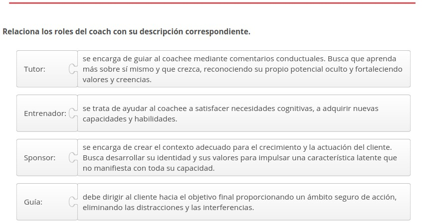
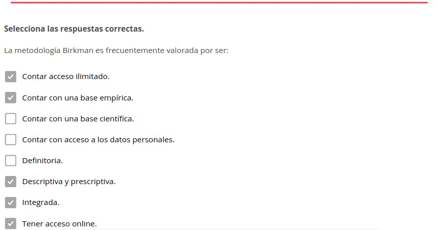
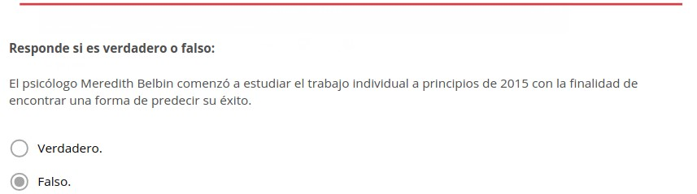

Coaching ejecutivo
==================

.. figure:: ../../_static/2_team_building/2.5_coaching_ejecutivo/mapa_conceptual.jpg
   :width: 70%
   :align: center

1. Lo específico del coaching
*****************************

.. note:: El **coaching en ambientes profesionales** es un proceso de acompañamiento a una persona o conjunto de personas en ambientes de trabajo con la finalidad de optimizar el potencial de los individuos. 

Para abordar el tema del coaching ejecutivo es necesario partir de **tres conceptos esenciales**: 

- **Coaching**: la traducción del término es entrenamiento, instrucción, preparación, clases, ayuda. En líneas generales coaching hace referencia a una **metodología** a través de la cual una persona o un grupo de personas emprenden un proceso de identificación y realización de cambios con la finalidad de alcanzar un objetivo específico. 
- **Coach**: es el profesional con formación especializada en coaching que se encarga de acompañar el proceso de transformación de la persona o el grupo en cuestión. 
- **Coachee**: se trata del cliente, bien sea una persona o grupo de personas, que desea llevar a Coaching cabo este proceso de cambios. El cliente se debe responsabilizarse y comprometerse con este proceso a fin de lograr sus objetivos.

1.1. Coaching
+++++++++++++

La **metodología implementada en el coaching** consiste en generar un espacio en el que el cliente pueda hacer un ejercicio de reflexión y pueda: expresar sus deseos y necesidades, hacer a un lado los obstáculos que impiden su desarrollo, hacer uso de sus ventajas y adquirir nuevos conocimientos, habilidades y competencias. Todo ello con la puesta en marcha de un plan para mejorar sus resultados. 

**No es posible comparar la metodología del coaching** con la formación, la terapia o la asesoría. 

La **gestión que se lleva a cabo es única**. Se trata de un proceso de construcción conjunta y de colaboración entre el coach y el coachee que se basa en la potencia de la relación intersubjetiva. 

1.2. Postulados
+++++++++++++++

El **coaching parte del principio** de que el coachee tiene las competencias necesarias para encontrar las respuestas e implementar los cambios necesarios para alcanzar sus metas. 

En este sentido, el **coach ejerce una labor catalizadora**, facilita el cambio guiando paso a paso todo el proceso.

El **coaching puede abordar problemas** de índole personal, de relación, de técnica o de desarrollo. 

El **coaching individual y el coaching de equipo utilizan herramientas distintas**, aunque ambos tienen como propósito una mejora del desenvolvimiento del cliente. 

1.3. Herramientas del coaching
++++++++++++++++++++++++++++++

Entre las herramientas del coaching de equipo están: 

- **Cohesión**: crear lazos de cohesión o reforzarla. 
- **Coherencia**: establecer la coherencia. 
- **Objetivos**: acordar objetivos. 
- **Estrategia**: establecer una estrategia compartida que unifique esfuerzos en torno a un objetivo común. 
- **Sinergias**: optimización de las sinergias con el objetivo de que el efecto sea superior a la suma de los efectos individuales. 

2. Cualidades y competencias
****************************

Entre las **cualidades y competencias necesarias para el ejercicio profesional de un coach** están:

- **Escucha**: escuchar activamente al cliente y analizar cada uno de sus aportes
- **Preguntas abiertas**: manejar correctamente las preguntas abiertas con la finalidad explorar las áreas de interés y obtener la información necesaria para llevar a cabo el análisis. 
- **Orgullo**: generar orgullo y reconocimiento. Es importante hacer referencia a los aspectos positivos o los que se han mejorado antes de hacer referencia a los errores que ha cometido el directivo. 
- **Buenas relaciones**: establecer buenas relaciones es fundamental para establecer un vínculo con el cliente. 
- **Confianza**: generar confianza es muy importante. Para ello es necesario ser honesto, cumplir las promesas, revelar los descubrimientos, guardar la confidencialidad, ofrecer Feedback positivo y negativo. 
- **Juicio**: no juzgar el comportamiento ni las actitudes del cliente. Se debe tener mucho cuidado sobre el modo en se guía el proceso y eliminar todo acto de reproche. 
- **Retos**: proponer objetivos que sean un reto y animar al coachee para que logre alcanzarlos. 
- **Prudencia**: es importante saber qué restos proponer al cliente, deben ser fuente de estímulo, pero también deben ser alcanzables. 
- **Adaptación**: debe adaptarse a la agenda de trabajo del cliente. 
- **Motivación**: debe ofrecer apoyo y ser capaz de implicar y comprometer al cliente con cada una de las metas y con el proceso en general. 
- **Observador**: es de suma importancia observar con atención el comportamiento y la actitud del cliente con la finalidad de que no pase desapercibido ningún aspecto relevante.

.. note:: **Dinamizar** es coordinar y liderar la acción requerida según la planificación previa. Para ello es necesario establecer un orden y una coherencia en los pasos a seguir para concretar la acción. 

La **dinamización representa** una vía necesaria para alcanzar el éxito, pero no asegura la concreción del mismo. Hace falta otros procedimientos. 

**Business coaching**: Todo **consultor, gerente o jefe de equipos** debe adquirir y poner en práctica diariamente en su trabajo un conjunto de competencias y cualidades. 

Las **competencias necesarias para la dinamización en el business coaching** son: 

- Emocionales. 
- Corporales. 
- Comunicacionales. 
- Coordinación de acciones. 
- Lingüísticas. 
- Liderazgo transformador. 

2.1. Competencias emocionales
+++++++++++++++++++++++++++++

Es necesario que el coach conozca la forma de **generar las emociones y estados de ánimo necesarios** para emprender y concretar las acciones planificadas. Por ejemplo, actuar con alegría y entusiasmo pese a los inconvenientes. 

Para ello es fundamental que el **coach identifique correctamente las emociones** e interprete de forma adecuada los signos corporales. Es básico que entienda el significado de gestos, formas de respirar, posturas, etc. 

2.2. Competencias corporales
++++++++++++++++++++++++++++

El coach debe conocer las **técnicas apropiadas** para relajarse, concentrarse, energizarse y sincronizarse consigo mismo. Además, debe saber enseñar a otros a poner en práctica estas técnicas. 

También se incluye en este punto el **comportamiento adecuado** para cada circunstancia. Por ejemplo, actuar con cercanía estableciendo contacto humano o mostrar empatía. 

2.3. Competencias comunicacionales
++++++++++++++++++++++++++++++++++

Las **competencias comunicacionales se potencian** con la integración de las competencias lingüísticas, emocionales y corporales. 

Las competencias comunicacionales **permiten llevar a cabo una serie de tareas esenciales** para el desempeño de un coach, por ejemplo: 

- **Comunicar**: transmitir visión, valores, misión, 
- **Informar**: transmitir cuál es el alcance del proceso. Detallar el contexto, los objetivos y la planificación. 
- **Hacer comprender**: hacer que el otro entienda a cabalidad lo que supone llevar a cabo el proceso. 
- **Compartir**: participar emocionalmente de la satisfacción de alcanzar lo deseado. 
- **Comprometer**: implicar a todos en el logro de lo anhelado más allá de la posible escasez de recursos y de las dificultades que puedan surgir en el camino. 

2.4. Competencias en la coordinación de acciones
++++++++++++++++++++++++++++++++++++++++++++++++

Gracias a la **formación en coaching** los gerentes pueden aumentar sus competencias en este campo. Las competencias en la coordinación de acciones **permiten llevar a cabo una serie de tareas esenciales** y consecutivas para el desempeño de un coach: 

- **Necesidades**: Detectar anticipadamente las inquietudes y necesidades a satisfacer. 
- **Satisfacción**: Establecer cuáles son las necesidades e inquietudes más importantes y precisar cuándo deben ser satisfechas. 
- **Contextualización**: Antes de requerir la satisfacción de determinada necesidad o inquietud, indicar las condiciones en que se produce. 
- **Condiciones de satisfacción**: Solicitar la satisfacción de las necesidades precisando las condiciones de satisfacción. 
- **Negociación**: Escuchar las condiciones que plantea el cliente para satisfacer la petición y negociarlas con efectividad.
- **Compromiso**: Implicar al cliente en el cumplimiento de todo lo convenido. 
- **Avance**: Revisar constantemente el grado de avance. 
- **Renegociar**: En caso de abandono, negociar efectivamente las condiciones que el cliente proponga. 
- **Entrega**: Recibir con agrado lo que se entregue. 
- **Recepción**: Agradecer con sinceridad lo que se reciba. 
- **Grado de satisfacción**: Evaluar el grado de satisfacción. 
- **Retroalimentación**: Cerrar el ciclo aportando un feedback contextualizado a los responsables e iniciar un nuevo ciclo de coordinación de acciones. 

2.4.1. Aprendizaje estratégico
------------------------------

Después de dominar los pasos que integran la cadena de coordinación de acciones se va adquiriendo un **aprendizaje estratégico** o aprendizaje de doble lazo. 

.. note:: El **aprendizaje estratégico o aprendizaje de doble lazo** es aquel que se obtiene producto de la práctica constante. Mediante frecuentes ciclos de ensayo y error se van prefiriendo determinadas conductas y prácticas por encima de otras. Se basa en la implementación de acciones y la evaluación de los resultados producto de estas acciones. 

2.4.2. Defensas organizacionales
--------------------------------

Al aprendizaje estratégico se suma una debida consideración del **impacto de las defensas organizacionales**. 

El aprendizaje estratégico y la consideración del impacto de las defensas organizacionales permiten al coach valorar de manera efectiva sus esfuerzos para lograr **gobernabilidad**. 

.. note:: Las **defensas organizacionales** impiden abordar ciertos temas, confrontar ciertas opiniones y valorar abiertamente lo que está ocurriendo. 

2.4.3. Gobernabilidad
---------------------

La **importancia de la gobernabilidad** reside en la necesidad de los líderes de obtener más gobernabilidad, sin importar las situaciones que se presenten y el grado de sofisticación de los sistemas de planificación y control de la gestión. 

.. note:: La **gobernabilidad** es el aumento objetivo de las posibilidades de lograr lo que se desea a través de la organización a cargo. 

2.5. Competencias ligüísticas
+++++++++++++++++++++++++++++

Los **actos lingüísticos** son fundamentales en el business coaching. 

Por **ejemplo**, las peticiones y ofertas adquieren mucho valor. una vez aceptadas se transforman en promesas. La confianza en el cumplimiento de esas promesas dependerá de la destreza lingüística de las partes en juego y esto afectará inevitablemente el desempeño de ambas. 

A través del **intercambio conversacional** se desarrollan las actividades en las organizaciones. Por lo que es necesario tener competencias para diseñar y sostener conversaciones que posibiliten concretar logros mediante palabras. Bien sea haciendo uso del lenguaje verbal (escrito o hablado) Wo el lenguaje no verbal. 

2.5.1. Escucha interactiva
--------------------------

Todo gerente debe dominar la escucha interactiva, que consiste en: 

- **Tipos de conversaciones**: dominar el diseño de varios tipos de conversaciones. 
- **Modalidades del habla**: saber cuándo usar una modalidad del habla u otra. 
- **Modo implícito y explícito**: distinguir claramente lo que se dice mediante el acto lingüístico (lo explícito) y lo que se desea expresar con ello (lo implícito). 

El **buen manejo de las modalidades** del habla es esencial en la determinación de las preguntas que debe formular el coach al coachee. Este proceso de indagación es muy importante, porque gracias a la perspicacia empleada logrará que el cliente se dé cuenta de todo lo que puede llegar a superar. 

Hay que recordar que el **lenguaje** no es pasivo ni inocente, permite crear y cambiar situaciones, maneras de ser, etc. El lenguaje es un indicador acerca de cómo pensamos y cómo concebimos la realidad. 

2.6. Competencias en liderazgo transformador
++++++++++++++++++++++++++++++++++++++++++++

Gracias a la **formación en coaching con enfoque de liderazgo** los gerentes pueden aumentar sus competencias para generar un mayor grado de participación y compromiso, con un menor grado de estrés, pese a las crisis (previsibles e imprevistas). 

Las competencias en liderazgo transformador implican saber cómo ejercer: 

- **Influencia idealizada**: Se buscar promover el rol de modelo admirado. Primero, a través de la identificación y, luego, mediante la imitación. Este rol se asocia a la asunción de una conducta consistente, riesgos y altos estándares éticos y morales. 
- **Motivación inspiradora**: Se plantean desafíos para estimular el espíritu de equipo y fomentar el optimismo y el entusiasmo. 

3. Formación y experiencia laboral
**********************************

En España **se ha desarrollado poco la formación en coaching gerencial**. Sin embargo, en los últimos años ha proliferado la creación de nuevas escuelas de coaching.

Entre la **nueva formación en coaching gerencial ha surgido en los últimos años** está: 

- **Cursos de profundización**: que ahondan en la praxis de coach. 
- **Seminarios de perfeccionamiento**: que abordar grupos específicos de herramientas o temas puntales. 
- **Estructuras de enseñanza**: se trata de la asimilación de este tipo de estructuras en zonas de negocios en provincias, a partir de pedagogías originales de coach formadores o sustentadas en un modelo de funcionamiento inspirado por una casa madre. 

3.1. Estructuras de enseñanza
+++++++++++++++++++++++++++++

Este tipo de estructuras asume frecuentemente la forma de **escuela privada**. Uno o varios coaches de renombre se agrupan fundan una escuela.

Algunas escuelas se inclinan más por la **vertiente organizativa**, mientras que otras por los **aspectos psicológicos del coach**. 

Una **formación de coaching** puede costar entre 3.000 y 8.000 euros anuales aproximadamente. Existen muchas disparidades en relación a las **tarifas y duración** de la enseñanza. 

3.2. Formación de los coach
+++++++++++++++++++++++++++

El **perfil de formación** de los coach es variable. 

Sin embargo, surge un **tipo de coach que proviene del área de recursos humanos**: asesores, formadores, jefes de personal, directores de recursos humanos inactivos. 

También existen coaches que tuvieron que emprender una **reconversión profesional**, bien deseada o precipitada, producto de sus condiciones laborales o debido a la pérdida del empleo. 

3.3. Asociaciones profesionales
+++++++++++++++++++++++++++++++

Las **asociaciones profesionales de coaching** hacen un aporte muy valioso a un mercado muy nuevo, dotándolo de estructura y profesionalización. 

Las **asociaciones profesionales de coaching ejercen su acción** en varios niveles: 

- **Deontología**: implantan un código que promueve las buenas prácticas, promoviendo una ética y responsabilidades comunes. 
- **Acreditación**: tienen la facultad de reconocer competencias profesionales y así ofrecer garantías a los usuarios. 
- **Información**: mediante convocatorias de gran alcance pautan reuniones a las que acuden diversos especialistas, clientes y solicitantes. De este modo, promocionan el coaching, promueven el intercambio de información y profundizan conocimientos. 

3.4. Internacional Coach Federation (ICF)
+++++++++++++++++++++++++++++++++++++++++

.. note:: La **International Coach Federation** es una asociación internacional de coach de origen norteamericano fundada en 1995. 

La International Coach Federation **cuenta con tres niveles de acreditación**, que emanan de criterios concretos de formación y de práctica del coaching: 

- El nivel de coach **asociado** acreditado. 
- El nivel de coach **profesional** acreditado. 
- El nivel de coach **master** acreditado. 

3.5. Conocimiento y experiencia empresarial
+++++++++++++++++++++++++++++++++++++++++++

La **capacitación técnica del coach de empresa** es equiparable a la de un asesor en estrategia de negocio. Ambos necesitan el mismo bagaje técnico, aunque lo desarrollen de forma diferente. 

Es necesario que un **coach de empresa cuente con**: 

- **Formación económica y empresarial**: un coach empresarial además de realizar tareas de apoyo psicológico, debe prestar asesoramiento estratégico de negocio continuamente. Es fundamental que maneje con fluidez y confianza cuestiones técnicas propias de todo directivo: finanzas, fases del negocio, aspectos laborales, costes, áreas comerciales, etc. 
- **Desarrollo de actividades empresariales**: las competencias o habilidades directivas que se requieren son transversales. De allí la importancia de que el coach haya desarrollado distintas labores de índole empresarial y la no obligación de que estas se hayan llevado a cabo en el mismo sector donde opera la empresa en la que trabaja. 
- **Experiencia en dirección**: dirigir personas y equipos de trabajo es una tarea que requiere ciencia, experiencia y ciertas cualidades. No es un saber que se halla en los libros. Es una capacidad que exige una particular sensibilidad y mucha práctica. 
- **Puestos de responsabilidad**: esto ayuda al coach a hacerse una idea de la situación personal y profesional que vive el coachee. 

4. Dificultades del directivo. Errores más comunes
**************************************************

Las **dificultades más comunes** que suele enfrentar un coach a diario son: 

- **Buena actitud**: Más allá de una buena actitud, un coach debe tener un buen sentido del humor, habilidad de comunicación y buen conocimiento del área a tratar. 
- **Pericia**: Se trata del grado mínimo de familiaridad que debe tener el coach sobre el trabajo que realiza el coachee. 
- **Sesiones**: Está relacionado con el número de sesiones que deben fijarse. Lo ideal es elaborar un calendario y respetarlo. Se suelen plantear sesiones semiestructuradas de tres o cuatro horas cada quince días más o menos. 
- **Instrucción**: Se trata de la cantidad de necesidades a cubrir que puede tener el cliente o si no se está de acuerdo con él en algún tema. 
- **Eficacia**: Sobre quién recae la decisión sobre qué es y qué no es eficaz. Esto siempre lo decide el cliente, más, el coach debe hacerle caer cuenta cuando se produzca alguna situación de error. 
- **Roles**: Existen cuatro tipos de roles que el coach puede ejercer. Es importante que los maneje y sepa cuál elegir en función de las necesidades. 

4.1. Roles del coach
++++++++++++++++++++

Los **roles del coach** son: 

- **Guía**: una vez que ambos, coach y coachee, han decidido cuál es el objetivo del proceso y han marcado los pasos que componen la llegada a meta, el guía se encarga de marcar el camino. Debe dirigir al cliente hacia el objetivo final proporcionando un ámbito seguro de acción, eliminando las distracciones y las interferencias. 
- **Entrenador**: se trata de ayudar al coachee a satisfacer necesidades cognitivas, a adquirir nuevas capacidades y habilidades. 
- **Tutor**: se encarga de guiar al coachee mediante comentarios conductuales. Busca que aprenda más sobre sí mismo y que crezca, reconociendo su propio potencial oculto y fortaleciendo valores y creencias. 
- **Sponsor**: se encarga de crear el contexto adecuado para el crecimiento y la actuación del cliente. Busca desarrollar su identidad y sus valores para impulsar una característica latente que no manifiesta con toda su capacidad. 
- **Concienciador**: se trata de hacer ver al cliente algo que no ha sido capaz de ver hasta ese momento. El coach se encarga de que el cliente mire dentro de sí y se ponga en contacto con su visión, misión y espíritu facilitando innumerables procesos.

4.2. Los 10 errores más comunes
+++++++++++++++++++++++++++++++

Los **10 errores más comunes que suele cometer un coach** son: 

- **Dirigir**: Un coach debe señalar, sugerir y orientar. No debe tomar decisiones acerca de la empresa donde trabaja el cliente. La gestión diaria de esta es responsabilidad del coachee.
- **Comparar**: El coaching se fundamenta en tratar a cada persona de forma única e individual. No debe establecer comparaciones entre sus clientes. Un modelo que resultó exitoso para una persona, no tiene que ser exitoso para otras.
- **Enjuiciar**: Juzgar y criticar al cliente sería deformar la labor del coach y produciría una enorme pérdida de confianza en él. 
- **No mostrar coherencia**: El coach debe poner en práctica las habilidades directivas que propone. No hay mejor forma de enseñar que a través del ejemplo y es importante demostrar que cree en sus propuestas. 
- **Interrumpir**: El coach debe tener la habilidad de realizar las preguntas adecuadas para obtener la información que necesita, pero antes debe permitir que el cliente exprese lo que desea expresar. Interrumpir frecuentemente podría dificultar el proceso y bloquear un aporte importante por parte del coachee. 
- **Mostrarse impaciente**: Puede ocurrir que el coach se muestre impaciente ante la espera de mejoras. Es importante un buen manejo de los tiempos de maduración para resolver los problemas. 
- **Ser indiscreto**: Es importante respetar el secreto profesional y no revelar a nadie la información a la que accede con motivo de las actividades con sus clientes. 
- **Crear dependencia**: El coaching se establece durante un lapso de tiempo limitado y con vistas a lograr un objetivo determinado. No deben crearse relaciones de dependencia desmedidas. Es necesario crear y mantener una relación profesional en todo momento. 
- **Mostrar arrogancia**: Es importante actuar siempre con respeto y honestidad. La arrogancia no aporta nada en procesos de aprendizaje y crecimiento. 
- **Enfocarse en los defectos**: Es importante que el coach se enfoque en las oportunidades de mejora y no en los defectos del directivo. Centrarse en los fallos y reprochar solo va a traer como consecuencia actitudes reactivas y bloqueos.

5. Instrumentos y herramientas de medición del coaching ejecutivo
*****************************************************************

Los **instrumentos y herramientas de medición del coaching ejecutivo** son: 

- Feedback 360.
- MBTI. 
- Método Birkman. 
- Otras. 

5.1. Feedback 360º
++++++++++++++++++

.. note:: **Feedback 360º** es un instrumento de evaluación del desempeño individual en el ámbito de la gestión empresarial. Consiste en establecer una diferencia entre la imagen que tenemos de nosotros mismos y la que tiene los demás. 

Este **instrumento se usa desde los años 60**. Sin embargo, no es hasta 1980 que se acepta y aumenta su uso. En la actualidad son muchas las empresas que lo utilizan habitualmente. 

Feedback 360º **consta de una serie de cuestionarios** que se pueden aplicar tanto de forma individual y colectiva. Esta **herramienta brinda un espacio para cuestionarse** y crea el marco adecuado para enviar y recibir feedback. 

Con la **aplicación de esta herramienta se busca** evaluar el desempeño del directivo en relación con los siguientes aspectos: 

- **Desarrollo personal**: en relación al rendimiento profesional real. 
- **Evaluación individual**: con la finalidad de mejorar el rendimiento a corto y mediano plazo.

Las **cinco etapas del Feedback 360º** son: 

- **Cuestionario**: se puede elegir un cuestionario estándar o se puede elaborar un cuestionario específico para el cliente. 
- **Respuestas**: el directivo objeto de análisis y las personas que se relacionan con él deben responder el cuestionario, al menos diez personas en orden jerárquico. 
- **Análisis**: tratamiento estadístico de los datos obtenidos. 
- **Resultados**: comunicación de los resultados del análisis. 
- **Plan**: elaboración de los planes de acción atendiendo a la interpretación de los resultados obtenidos. 

El **Feedback 360º es un instrumento que hay que utilizar con precisión y acierto**, ya que puede traer consecuencias importantes para el directivo en cuestión y la empresa donde trabaja. 

Los **requisitos indispensables para la aplicación del Feedback 360º** son: 

- **Finalidad**: definir el motivo de su aplicación. 
- **Oportunidad**: comprobar cuál es el momento más adecuado para su aplicación. 
- **Divulgación**: comunicar desde el inicio el objetivo del estudio a todas las personas implicadas en él. 

**Tomando en cuenta estos tres requisitos** se prevendrá la falta de sinceridad en los cuestionarios y la reticencia a participar en el estudio.

Las **precauciones a tener en cuenta antes de aplicar el Feedback 360º** son: 

- **Herramienta**: contar con un cuestionario claro y completo. 
- **Personas**: contar con suficiente cantidad de personas en el estudio y asegurarse de que poseen información de calidad que aportar al análisis. 
- **Especialista**: contar con un especialista externo a la empresa que coordine el proceso de evaluación. Preferiblemente con un máster en coach y que tenga experiencia en cuestiones de desarrollo directivo. 
- **Orientación**: no perder nunca de vista que el enfoque de esta evaluación es la búsqueda de la mejora continua del interesado. 

Los **directivos de las organizaciones suelen evitar la aplicación del Feedback 360º** aludiendo a múltiples excusas. Esto suele ser indicativo de falta de autocrítica y de poca capacidad para evaluar con frecuencia y profundidad el propio comportamiento. 

Las **excusas** que dar los directivos para no llevar a cabo el Feedback 360º son: 

- "No me evalúo con los resultados que obtengo". 
- "No me conozco lo suficiente". 
- "Realmente no soy lo que aparento". 
- "¿Quién recibe esa información?"

Es importante **distinguir entre conocernos y comprendernos**. Los datos proporcionan conocimiento, pero no comprensión. Para llegar a la comprensión es necesario realizar una buena interpretación de los datos. A partir de allí trazar el plan de mejora y explorar cuál es el potencial del interesado. 

Los **tres elementos que componen un buen diagnóstico** son: 

- **Áreas de mejora**: a veces son muy evidentes y otras no lo son. Es indispensable tomar como referencia una media externa fiable como, por ejemplo, una base de datos de directivos amplia y con un nivel de desempeño semejante. 
- **Potencial real de mejora**: estará en función de la importancia de esa competencia para el puesto, la actitud personal para la mejora de la competencia y la factibilidad de la misma. 
- **Oportunidades**: es importante examinar cuándo es el momento adecuado y cuándo no lo es. A veces hay que aprovechar las oportunidades y otras veces hay que suspender el plan de mejora para otro momento. 

Los **objetivos útiles para el coaching del Feedback 360º** son: 

- **Al inicio del proceso**: para establecer un diagnóstico previo a la definición de objetivos. 
- **Al final del proceso de coaching**: para evaluar o medir los resultados obtenidos.

Si una empresa no desea utilizar un cuestionario estándar y propone la elaboración de un cuestionario propio y específico, se puede aprovechar la oportunidad para **construir un modelo de referencia propio**. Incluyendo en él los comportamientos, actitudes y escala de valores propios de su identidad. 

Para llevar a cabo esto es conveniente **trabajar con especialistas externos** para que ayuden a distinguir qué aspectos pertenecen a cada ámbito: 

- Comportamiento individual. 
- Valores personales y de la empresa. 
- Rasgos de personalidad.

5.2. MBTI
+++++++++

.. note:: El **MBTI** es un indicador psicológico desarrollado por Katharine Briggs y su hija, Isabel Briggs-Myers que se basa en la teoría de los tipos psicológicos de Jung. El nombre corresponde a las siglas de Myers-Briggs Type Indicator. 

Se trata de un **cuestionario** elaborado en 1950 por Briggs. 

Su **objetivo** es definir el tipo de personalidad del individuo, determinando las principales motivaciones, recursos naturales y posibles áreas de desarrollo. 

Esta **herramienta** ayuda a comprenderse a sí mismo y a los demás. 

Se fundamenta en un **método que consiste en autoevaluarse**, identificando las preferencias en cuatro dimensiones. 

**Cada dimensión se compone de dos alternativas**, creando así ocho modos de conducta. Los **ocho modos de conducta** son: 

- **Extroversión** (E = extroversion) e **Introversión** (I = introversion). 
- **Sensación** (S = sensation) e **Intuición** (N intuition). 
- **Pensamiento** (T = thinking) y **Sentimiento** (F = feelings). 
- **Juicio** (J = judgement) y **Percepción** (P = perception). 

Las distintas combinaciones que pueden darse tomando una letra por cada dimensión dan origen a **dieciséis tipos psicológicos posibles**. 

**Cada tipo psicológico** está identificado por cuatro letras, por ejemplo: EITF, y definen: 

- Cómo orientamos nuestra **energía**. 
- Cómo percibimos la **realidad**. 
- Cuáles son nuestros **criterios para tomar decisiones**. 
- Cuál es nuestro **estilo de vida**.

Las **polaridades** se complementan con la noción de exclusión, dando como resultado la siguiente clasificación: 

- **Dominante**: las cualidades naturales de un individuo. 
- **Inferior**: la opuesta a la dominante. 
- **Secundaria**: la que hace de contrapeso frente a la dominante. 
- **Terciaria**: la opuesta a la secundaria.

.. note:: La **noción de exclusión** es un postulado que afirma que no puede expresarse a la vez un polo y su opuesto. 

5.3. Método Birkman
+++++++++++++++++++

.. note:: El **método Birkman** es un instrumento capaz de medir las expectativas sociales, los autoconceptos, los intereses y los comportamientos del estrés a través de una sola herramienta. Fue desarrollado por Roger W. Birkman en la década de los cuarenta. 

**Roger W. Birkman,** ex piloto de la Segunda Guerra Mundial, trabajó con un grupo de científicos en la Universidad de Texas con la finalidad analizar instrumentos psicológicos adecuados para seleccionar pilotos para la Fuerza Aérea de los Estados Unidos. 

El **primer nombre del instrumento** fue "prueba de comprensión social", ya que en 1951 Birkman pensaba que sería una herramienta de gran valor tanto para las organizaciones como para los individuos. 

Más adelante tuvo la oportunidad de **mejorar el método** para presentarlo en el doctorado que cursaba en la Universidad de Texas. 

Actualmente, el **departamento de investigación y desarrollo de la compañía Birkman International**, en conjunto con otros expertos en psicometría y psicólogos especializados en industrias y organizaciones de universidades y el sector profesional, sigue refinando el método y garantizando su adaptación al siglo XXI. 

El **método Birkman consiste en** la aplicación de un instrumento de evaluación de la personalidad que contiene 298 preguntas y se acompaña de una serie de informes afines. 

La **aplicación del método Birkman favorece**: 

- La formación de equipos efectivos. 
- La orientación efectiva del trabajo. 
- El desarrollo de líderes. 
- El asesoramiento sobre el avance de la carrera profesional. 
- La resolución de conflictos interpersonales. 

El método Birkman **evita la realización de múltiples evaluaciones**, ya que produce un análisis multidimensional y detallado que estudia la motivación, los comportamientos y los intereses mediante la aplicación de una sola herramienta. 

Mediante el análisis de diversos factores, el **método Birkman determina** el comportamiento habitual diario del individuo y presenta una perspectiva singular sobre las motivaciones y necesidades subyacentes. 

Los **comportamientos del estrés** se determinan cuando esas necesidades no son satisfechas. 

Con toda esa información a la mano: motivación, comportamientos e intereses, el profesional, consultor o asesor puede **identificar los aspectos del desempeño laboral susceptibles de mejora** y la forma efectiva de reducir los conflictos. 

Las **cinco perspectivas que incluye el método Birkman** son: 

- **Comportamiento habitual**: las conductas efectivas y eficaces que asume el individuo al enfrentarse a relaciones personales y tareas laborales. 
- **Necesidades subyacentes**: las expectativas del individuo acerca de cómo deberían funcionar las relaciones personales y situaciones sociales dentro del contexto de la relación o situación. 
- **Comportamientos del estrés**: las conductas observadas cuando no se satisfacen las necesidades subyacentes, las conductas ineficaces que asume el individuo al enfrentarse a relaciones personales o tareas laborales. 
- **Intereses**: las preferencias que expresa el individuo en relación con puestos de trabajo en función del supuesto de igualdad de recompensas económicas.
- **Enfoque sobre la organización**: la perspectiva desde la cual el individuo ve los problemas y soluciones relacionados con las metas de la organización. 

La **metodología Birkman es frecuentemente valorada** por: 

- **Integrada**: a través de una sola herramienta es posible medir comportamientos, motivaciones e intereses, logrando de esta forma integrar aspectos relacionales y laborales. 
- **Descriptiva y prescriptiva**: posibilita ofrecer descripciones y sugerencias concretas para el desarrollo y la carrera de la persona. 
- **Acceso online**: cuenta con una metodología para completar el cuestionario vía online que agiliza el proceso de aplicación sin comprometer la confidencialidad. 
- **Acceso ilimitado**: la web permite acceder a 40 reportes diferentes, lo que otorga la flexibilidad de combinarlos con las necesidades que la persona, brindando un soporte constante al desarrollo de los integrantes de todos los niveles de la organización a lo largo de su carrera profesional.
- **Base empírica**: fue creado a través de una exhaustiva investigación empírica realizada en ambientes de trabajo. 

El **método Birkman se ha convertido en una herramienta indispensable** para los profesionales de recursos humanos y desarrollo en organizaciones, asesores académicos y de carreras profesionales e instructores de ejecutivos. 

El **método Birkman ofrece una amplia variedad de aplicaciones**, ya que está considerado como el instrumento no clínico más selecto para medir el comportamiento humano y los puntos fuertes laborales. 

Las **aplicaciones del método Birkman** son: 

- Evaluación previa a la contratación. 
- Desarrollo individual. 
- Formación de equipos. 
- Desarrollo de equipos. 
- Orientación sobre carreras. 
- Gestión de la carrera profesional. 
- Transición profesional. 
- Orientación. 
- Orientación de ejecutivos. 
- Desarrollo de liderazgo. 
- Manejo de conflictos. 
- Control del estrés. 
- Gestión de la cultura empresarial. 
- Fusiones y adquisiciones. 
- Diversidad en el trabajo.
- Planificación de sucesión laboral. 
- Manejo de crisis. 
- Planificación para la jubilación. 
- Terapia de pareja. 
- Asesoramiento. 

5.4. Otras herramientas
+++++++++++++++++++++++

El **coaching ejecutivo también hace uso de otros instrumentos y herramientas de medición**, entre ellos: 

- Insights. 
- TMS. 
- Test de Belbin. 

5.4.1. Insights
---------------

.. note:: El **método Insights** hace uso de los colores para identificar las preferencias que tienen las personas con respecto al comportamiento, la forma de pensar, los miedos y las convicciones. 

**Se basa en un círculo de colores** que parte del conocimiento de cuatro tipos de comportamiento: 

- Conformista. 
- Estable. 
- Influyente. 
- Dominante. 

El **círculo** se divide en cuatro y a cada parte se le asigna un tipo de comportamiento, un color y unas características psíquicas y de comportamiento diferente:

- **Azul**: preciso, formal, objetivo, analítico, prudente, metódico. 
- **Rojo**: audaz, directo, resuelto, decidido, dominante, competitivo. 
- **Amarillo**: comunicativo, espontáneo, entusiasta, sociable. 
- **Verde**: comprensivo, conciliador, constante, tolerante, paciente.

El **objetivo principal de la herramienta** es alcanzar un mejor nivel en las relaciones interpersonales. Es por ello que se suele usar para la constitución de equipos de alto rendimiento. 

5.4.2. TMS
----------

.. note:: La herramienta **TMS (Team Management Systems)** consiste en descomponer en una rueda con ocho radios el perfil necesario para cada componente de un equipo. Fue desarrollado por los consultores australianos Charles Margerison y Dick McCann en 1985. 

El **enfoque TMS se basa** en la identificación de los elementos claves que explican las razones por las cuales ciertas organizaciones, equipos y personas se desempeñan bien en su trabajo, cumplen con eficacia y eficiencia sus objetivos laborales y profesionales, mientras que otros fallan. 

Al final del estudio, **las personas quedan distribuidas en cuatro categorías** principales que reúnen a ocho perfiles básicos: 

- Explorador - Promotor 
- Evaluador - Desarrollador. 
- Propulsor - Organizador. 
- Finalizador - Productor. 
- Controlador - Inspector. 
- Colaborador - Mantenedor. 
- Informador - Consejero. 
- Creador - Innovador. 

5.4.3. Test de Belbin
---------------------

.. note:: El **test de Belbin** propone desarrollar un equipo a partir del análisis de las personas que lo componen. Se distinguen tres tipos de roles y cada persona puede interpretar varios roles dentro de un mismo equipo. 

El **psicólogo Meredith Belbin** comenzó a estudiar el trabajo en equipo a principios de los años 70 con la finalidad de encontrar una forma de predecir su éxito. 

Esta **herramienta resalta la distribución de roles** dentro de una empresa, ya que gracias a ella es posible maximizar: 

- La conciencia de la complementariedad. 
- La superación de las rivalidades internas. 
- La motivación. Importante 
- El desarrollo de las habilidades personales. 
- La participación de todos en la formación de un equipo competitivo. 

.. note:: El **rol** es el compromiso que se asume con los demás para ejercer una determinada función. La asignación de los roles depende de la negociación que se da entre los componentes de un equipo. 

A medida que una **persona va asumiendo distintos roles** y va dejando aquellos que son más familiares para ella, va desarrollando otro tipo de habilidades. 

Los **tres tipos de roles de equipo según el test de Belbin** son: 

- **Roles mentales**: cerebro, monitor-evaluador, especialista. 
- **Roles sociales**: investigador de recursos, coordinador, cohesionador. 
- **Roles de acción**: impulsor, implementador, finalizador. 

.. figure:: ../../_static/2_team_building/2.5_coaching_ejecutivo/grafica_belbin.jpg
   :width: 70%
   :align: center

6. Resumen
**********

- El **coaching en ambientes profesionales** es un proceso de acompañamiento a una persona o conjunto de personas en ambientes de trabajo con la finalidad de optimizar el potencial de los individuos. 
- El** coaching ejecutivo se basa** en una serie de postulados y en la figura del coach.
- Los **instrumentos y herramientas** con los que cuenta el coaching ejecutivo son: Feedback 3600, MBTI y el método Birkman. 
- La **figura del coach** debe contar con una formación y experiencia laboral mínimas, ejerce un conjunto de roles, necesita desarrollar una serie de competencias y suele enfrentar algunas dificultades. 
- Las **competencias** que necesita desarrollar un coach son de tipo emocional, corporal, comunicacional, lingüístico, de coordinación de acciones y de liderazgo transformador. 

7. Actividades
**************

.. figure:: ../../_static/2_team_building/2.5_coaching_ejecutivo/actividades/actividad_1_1.jpg
   :width: 70%
   :align: center

.. figure:: ../../_static/2_team_building/2.5_coaching_ejecutivo/actividades/actividad_1_2.jpg
   :width: 70%
   :align: center

.. figure:: ../../_static/2_team_building/2.5_coaching_ejecutivo/actividades/actividad_1_3.jpg
   :width: 70%
   :align: center

.. figure:: ../../_static/2_team_building/2.5_coaching_ejecutivo/actividades/actividad_1_4.jpg
   :width: 70%
   :align: center

.. figure:: ../../_static/2_team_building/2.5_coaching_ejecutivo/actividades/actividad_2_1.jpg
   :width: 70%
   :align: center

.. figure:: ../../_static/2_team_building/2.5_coaching_ejecutivo/actividades/actividad_2_3.jpg
   :width: 70%
   :align: center

.. figure:: ../../_static/2_team_building/2.5_coaching_ejecutivo/actividades/actividad_3_1.jpg
   :width: 70%
   :align: center

.. figure:: ../../_static/2_team_building/2.5_coaching_ejecutivo/actividades/actividad_3_2.jpg
   :width: 70%
   :align: center

.. figure:: ../../_static/2_team_building/2.5_coaching_ejecutivo/actividades/actividad_3_3.jpg
   :width: 70%
   :align: center

.. figure:: ../../_static/2_team_building/2.5_coaching_ejecutivo/actividades/actividad_4_1.jpg
   :width: 70%
   :align: center

.. figure:: ../../_static/2_team_building/2.5_coaching_ejecutivo/actividades/actividad_4_3.jpg
   :width: 70%
   :align: center

.. figure:: ../../_static/2_team_building/2.5_coaching_ejecutivo/actividades/actividad_5_1.jpg
   :width: 70%
   :align: center

.. figure:: ../../_static/2_team_building/2.5_coaching_ejecutivo/actividades/actividad_5_2.jpg
   :width: 70%
   :align: center

.. figure:: ../../_static/2_team_building/2.5_coaching_ejecutivo/actividades/actividad_5_3.jpg
   :width: 70%
   :align: center

.. figure:: ../../_static/2_team_building/2.5_coaching_ejecutivo/actividades/actividad_6_1.jpg
   :width: 70%
   :align: center

.. figure:: ../../_static/2_team_building/2.5_coaching_ejecutivo/actividades/actividad_7_2.jpg
   :width: 70%
   :align: center

.. figure:: ../../_static/2_team_building/2.5_coaching_ejecutivo/actividades/actividad_8_1.jpg
   :width: 70%
   :align: center

.. figure:: ../../_static/2_team_building/2.5_coaching_ejecutivo/actividades/actividad_8_2.jpg
   :width: 70%
   :align: center

.. figure:: ../../_static/2_team_building/2.5_coaching_ejecutivo/actividades/actividad_9_3.jpg
   :width: 70%

.. figure:: ../../_static/2_team_building/2.5_coaching_ejecutivo/actividades/questionnaire_1.jpg
   :width: 70%

.. figure:: ../../_static/2_team_building/2.5_coaching_ejecutivo/actividades/questionnaire_3.jpg
   :width: 70%

.. figure:: ../../_static/2_team_building/2.5_coaching_ejecutivo/actividades/questionnaire_4.jpg
   :width: 70%

.. figure:: ../../_static/2_team_building/2.5_coaching_ejecutivo/actividades/questionnaire_6.jpg
   :width: 70%

.. figure:: ../../_static/2_team_building/2.5_coaching_ejecutivo/actividades/questionnaire_7.jpg
   :width: 70%

.. figure:: ../../_static/2_team_building/2.5_coaching_ejecutivo/actividades/questionnaire_8.jpg
   :width: 70%