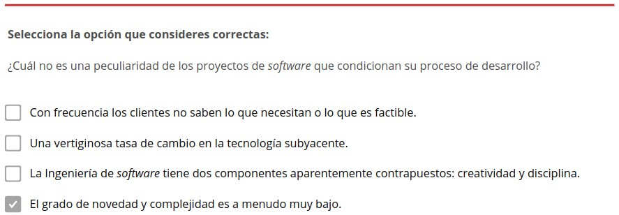
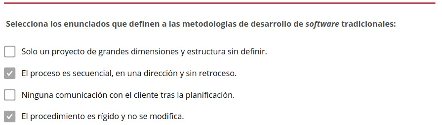
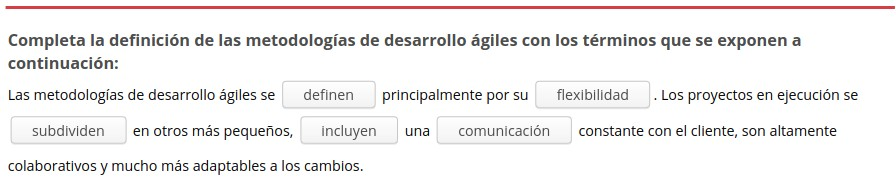
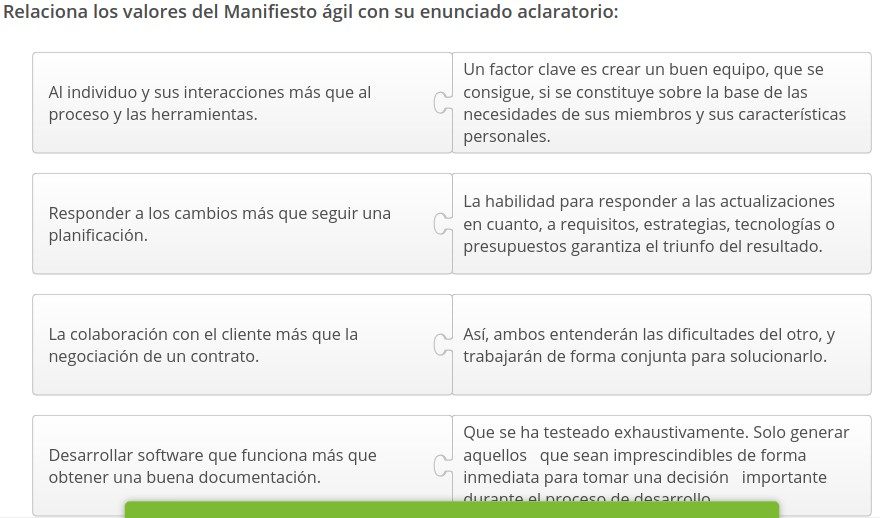

3.1. Introducción. Metodologías ágiles
======================================

El contexto socioeconómico actual, demanda la constitución de **organizaciones ágiles** que se caractericen por llevar a cabo prácticas empresariales basadas en la adaptabilidad y la mejora continua e implantar nuevos métodos para responder a los cambios continuos.

Las **metodologías ágiles** se convierten en una alternativa interesante para superar algunas debilidades de las metodologías clásicas. Estás, a diferencia de las anteriores, son más flexibles; subdividiendo los proyectos de software, defendiendo la comunicación constante con el cliente, trabajando colaborativamente y adaptándose a las modificaciones. 

Es importante, examinar el **Manifiesto** para el desarrollo ágil de software, puesto que representa una iniciativa común de los principales defensores de esta perspectiva, por unificar principios compartidos y establecer un marco de trabajo innovador. 

.. figure:: ../../_static/3_metodologias_agiles/3.1_introduccion/mapa_conceptual.jpg
   :width: 70%
   :align: center

1. Origen de los modelos ágiles
*******************************

Las metodologías ágiles **surgieron** como consecuencia de dos hechos relevantes, un desarrollo de software deficitario y una metodología tradicional con limitaciones para responder a los cambios continuos que se producen en el ámbito empresarial. 

En los años SO, el desarrollo de sistemas estaba más enfocado a la tarea de **codificar**, por parte de los programadores, que a la de comprender y atender las necesidades de los usuarios. Se producía un software que no tenía la suficiente calidad porque no respondía a las exigencias del cliente o a parámetros como la velocidad, estabilidad, flexibilidad, seguridad, usabilidad, o escalabilidad. 

1.1. Crisis del software
++++++++++++++++++++++++

.. note:: En 1968 se produjo la apodada "**crisis del software**" como consecuencia del fracaso de los proyectos software. 

En los proyectos de desarrollo de software existían una serie de limitaciones que desencadenaron esta crisis: 

- Se terminaban fuera de plazo. 
- El presupuesto inicial no se respetaba. 
- Baja calidad del software generado. 
- El software no cumplía con las especificaciones. 
- El código no se podía mantener. 

1.2. Metodologías de desarrollo software
++++++++++++++++++++++++++++++++++++++++

.. note:: Las **metodologías de desarrollo de software** son un conjunto de técnicas tradicionales, modernas y ágiles de configuración de sistemas que permiten generar software con calidad, incluyendo heurísticas de construcción y criterios de comparación de modelos de sistemas. 

Los proyectos software tienen una serie de **particularidades** que condicionan su proceso de desarrollo: 

En este contexto, la Ingeniería de software adquiere relevancia porque estudia y aplica un enfoque sistemático, disciplinado y cuantificable al desarrollo, ejecución y mantenimiento del software. 

- **Indecisión**: Con frecuencia los clientes no saben lo que necesitan o lo que es factible. 

- **Cambios de requerimientos**: Los clientes no son conscientes de la complejidad de los proyectos software y de la repercusión que, una vez iniciado el proyecto, suponen los cambios de requerimientos. 

- **Procesos iterativos**: Las modificaciones en los requerimientos conducen a que el software se desarrolle usando procesos iterativos, en lugar de, una secuencia de tareas definidas y cerradas. 

- **Componentes contrapuestos**: La ingeniería de software tiene dos componentes aparentemente contrapuestos: creatividad y disciplina. Mantener un equilibrio entre ambos es dificultoso.

- **Complejidad alta**: El grado de novedad y complejidad es a menudo muy alto.

- **Tasa de cambio**: Una vertiginosa tasa de cambio en la tecnología subyacente. 

En este contexto, la ingeniería de software adquiere relevancia porque estudia y aplica un enfoque sistemático, disciplinado y cuantificable al desarrollo, ejecución y mantenimiento del software.

1.3. Modelos de ciclo de vida
+++++++++++++++++++++++++++++

.. note:: Las **metodologías de desarrollo tradicionales o clásicas** fueron planteadas para poner orden en el caos que existía en la creación de software cuando se empezó a generar masivamente. Ofrecieron una estructura útil, a partir de la cual, pudieron trabajar la Ingeniería de software y los equipos de desarrollo. 

Las metodologías de desarrollo tradicionales son también denominadas modelos de proceso prescriptivo. 

Las metodologías tradicionales se **definen** por: 

- Solo un proyecto de grandes dimensiones y estructura definida. 
- Los requerimientos son acordados una vez y para todo el proyecto. 
- Demandan grandes plazos de planificación previa. 
- Poca comunicación con el cliente tras la planificación. 
- El proceso es secuencial, en una dirección y sin retroceso. 
- El procedimiento es rígido y no se modifica. Zona interactiva Haz clic en el icono 

La organización, interrelación e importancia de cada una de las fases dentro del ciclo de vida, dependerá del modelo seleccionado. 

.. note:: En la década de los 70 surge el denominado **Ciclo de vida de desarrollo de software**, como un consenso para la construcción centralizada de software. Ofreció pautas generales de las etapas por los que pasa este producto desde que nace (de una necesidad) hasta que muere. 

Todos los modelos, fundamentados en el ciclo de vida de desarrollo de software, tienen explícita o implícitamente las **fases**:

1. **Requisitos**. 
2. **Diseño**. 
3. **Desarrollo**. 
4. **Pruebas**. 
5. **Mantenimiento**.

1.3.1. Modelo de cascada
------------------------

.. note:: El **modelo de cascada** es el más antiguo de los que se basan en el ciclo de vida de desarrollo de software, la propuso Royce, W. en 1970. Se define por una secuencia de etapas y al finalizar cada una, es preciso reunir toda la documentación utilizada para garantizar que se cumple con los requerimientos y especificaciones.

Este modelo, propone un enfoque secuencial y sistemático para el desarrollo de software que conlleva más disciplina en el equipo de desarrollo. Se compone de las siguientes fases: 

1. **Requisitos**: Recogida formal de los requerimientos que deberá cumplir el proyecto. Los clientes suelen tener las ideas claras sobre las funciones del software a desarrollar, pero no tanto, de cuál debe ser el resultado final. 

2. **Diseño**: Se establece cómo se va a estructurar el proyecto, teniendo en cuenta los requisitos y funcionalidades especificados previamente. 

3. **Desarrollo**: Los ingenieros software programan el código para el proyecto, partiendo del análisis y diseño de la solución ya realizados. 

4. **Pruebas**: Se testea el software desarrollado para detectar posibles errores y subsanarlos, lo antes posible. Es una parte esencial del proceso porque los fallos humanos dentro de la programación son habituales y aumentan en función de la complejidad del problema. 

5. **Mantenimiento**: Concluido el proyecto, puede ser necesario realizar un seguimiento para solucionar incidencias detectadas en el servicio o ejecutar evolutivos del software con nuevas funcionalidades. 

En todas las fases se incluye la tarea de **documentación** (procedimientos, guías, esquemas, etc.). Es la recopilación escrita, en sus diferentes modalidades, que se efectúa durante todo el ciclo de vida del proyecto. Sirve para ayudar a comprender, usar o mantener un programa porque, a veces, un código puede ser escrito por una persona y posteriormente, ser modificado por otra. 

Gráfico de las **fases** del modelo de cascada: 

.. figure:: ../../_static/3_metodologias_agiles/3.1_introduccion/modelo_de_cascada.jpg
   :width: 30%
   :align: center

Royce, W. comenzó a diseñar el modelo de cascada en el año 1966 y no lo concluyó hasta 1970. 

Principales **características** del modelo de cascada: 

- Énfasis en el control del proceso de desarrollo y el rigor de sus actividades, en la metodología, en las herramientas y en la anotación que se usa. 

- Particular atención al modelado y al mantenimiento de los modelos. 

- Especificación minuciosa del proceso, con un alto número y especialización de roles. 

- Asume que no se van a presentar cambios una vez iniciado el proyecto y espera que la arquitectura se defina pronto.

- Limita la participación del cliente solo a reuniones de control, reduciendo de manera significativa sus aportes. 

- Largos tiempos de espera por parte del usuario para ver los resultados. 

- Documentación rigurosa de todas las actividades desarrolladas en el proyecto. 

- Se rige por la rigurosidad de un contrato. 

1.3.2. Otros modelos
--------------------

Tras la instauración del modelo de cascada fueron surgiendo otros modelos basados en el ciclo de vida y que amplían las prestaciones ofrecidas por este. 

- **Modelo V**: 
	El modelo V es una variación del modelo de cascada que pretende hacer una tarea de pruebas más efectiva y productiva.

	El equipo de pruebas realiza los planes de test en paralelo a las actividades de desarrollo y genera entregables de pruebas para validar el sistema y asegurar así, la calidad del proyecto. Las fortalezas y debilidades de este modelo son muy similares a las del de cascada. 

- **Incremental**:
	En el modelo incremental se desarrolla una **implementación inicial** para mostrarsela al cliente e ir evolucionándola mediante versiones hasta que el software tenga todas las funcionalidades solicitadas. **Combina** procesos con flujos lineales y paralelos. Emplea secuencias lineales de forma escalonada a medida que avanza el cronograma y en cada fase produce incrementos (entregables del software). 

	Sus **ventajas**: 

	- El coste de realizar cambios se reduce. 
	- Se obtiene más retroalimentación por parte del cliente. 
	- Se desarrolla rápidamente un software útil para el cliente. 

	Tiene algunas **desventajas**: 

	- A no ser que se refactorice el software, la estructura del sistema tiende a degradarse después de una nueva propuesta.
	- Los procesos no son visibles, quedándose la documentación desfasada tras la siguiente versión. 

- **Prototipo**: 
	El modelo de prototipo se fundamenta en un periodo de comunicación para establecer en qué consistirá el proyecto.

	Es válido para identificar requisitos del software y se recomienda, en aquellos proyectos en los que el cliente plantea unos requerimientos generales, pero no define sus características y funcionalidades. 

- **Espiral**: 
	El modelo de espiral, une la naturaleza iterativa del prototipo con los aspectos controlados y sistemáticos del modelo de cascada. Proporciona los mecanismos para el desarrollo rápido de versiones cada vez más completas y complejas del software. 

	Cada **bucle** en la espiral representa una fase del proceso de desarrollo del software. Por ejemplo, el bucle más interno, podría estar relacionado con la viabilidad del sistema, el siguiente con los requisitos, el posterior con el diseño del sistema, etc. 

	Ofrece un enfoque **realista** para el desarrollo de sistemas software de gran escala. Al evolucionar el software al mismo tiempo que avanza el proceso, el desarrollador y/o el cliente pueden comprender y paliar los posibles riesgos. 

- **Concurrente**: 
	El modelo concurrente define una serie de **eventos** que desencadenarán transiciones de estado para cada una de las actividades.

	Existen todas las actividades de ingeniería de software al mismo tiempo, pero se encuentran en diferentes **estados**. Por ejemplo, si una actividad todavía no ha comenzado estará en estado inactivo. 

	Es aplicable a todos los tipos de desarrollo de software y proporciona información precisa de la situación real del proyecto. 

- **Unificado**: 
	El modelo de proceso unificado recoge las mejores **características** de los modelos tradicionales e incorpora algunos **principios** del desarrollo ágil de software. 

	Reconoce la importancia del **cliente** y su interacción, por lo que utiliza métodos simples (casos de uso) para averiguar y describir su perspectiva sobre el sistema. 

	El proceso unificado se compone de las siguientes **fases**: 

	1. **Inicio**: se analiza el primer alcance del proyecto, la arquitectura del sistema, la obtención de recursos y la aceptación por parte de los involucrados. 
	2. **Elaboración**: se prueba la arquitectura del sistema, se seleccionan los casos de uso, se ejecutan las especificaciones de estos casos y se diseña la solución preliminar. 
	3. **Construcción**: se desarrolla software operativo de manera incremental y que cumpla con las necesidades más importantes de los interesados en el proyecto. 
	4. **Transición**: se ejecuta y se valida el sistema en el contexto de producción, se subsanan posibles incidencias, se capacitan a los usuarios y se provee del soporte técnico necesario. 

1.4. Modelos ágiles
+++++++++++++++++++

En la actualidad, las empresas operan en un entorno global que cambia rápidamente. Se debe responder a las nuevas necesidades y oportunidades del mercado, teniendo en cuenta que el **software** se integra en casi todas las operaciones empresariales. 

.. note:: Las **metodologías de desarrollo ágiles** se definen principalmente por su flexibilidad. Los proyectos en ejecución se subdividen en otros más pequeños, incluyen una comunicación constante con el cliente, son altamente colaborativos y mucho más adaptables a los cambios. 

Al principio, se asociaba las metodologías ágiles con la falta de documentación o control sobre proyecto. 

**Características** de la metodología ágil: 

- **Incremental**: las versiones de software son pequeñas y con ciclos de desarrollo rápido. 
- **Sencilla**: el método es fácil de aprender o de modificar y está muy documentado. 
- **Cooperativa**: constante interacción entre el equipo desarrollador y el cliente. 
- **Adaptativa**: gran capacidad para reaccionar ante los cambios en cualquier momento. 

Las metodologías ágiles están ligadas a la filosofía japonesa Kaizen (mejora continua) que se empezó a implementar en varias organizaciones japonesas después de la ll Guerra Mundial. Su finalidad es prescindir del desperdicio, los procesos absurdos y las inconsistencias, con una orientación a la acción y la participación colectiva en el proceso de perfeccionamiento. 

Tabla comparativa de las metodologías para desarrollo de software **tradicional y ágil**: 

.. figure:: ../../_static/3_metodologias_agiles/3.1_introduccion/tabla_tradicional_agil_2.jpg
   :width: 60%
   :align: center

2. El manifiesto ágil
*********************

.. note:: El **Manifiesto para el desarrollo ágil de software** es de suma importancia dentro del movimiento de las metodologías ágiles. Representa una iniciativa conjunta de los principales responsables de procesos basados en este enfoque metodológico, por unificar principios compartidos y crear un marco de trabajo innovador. 

El principal objetivo del encuentro en el cual, se generó el Manifiesto ágil era extraer factores comunes de los principios esenciales propuestos que servirían de **guía** para cualquier metodología identificada como ágil. Así lo expresaron sus autores: "estamos descubriendo mejores maneras de desarrollar software mediante su construcción y ayudando a que otras personas lo construyan". 

El Manifiesto ágil se postula en torno a **cuatro valores** que originaron los **doce principios** de esta nueva filosofía de desarrollo de software. 

El Manifiesto ágil fue firmado en Utah (Estados Unidos) 2001 por diecisiete críticos de los modelos de mejora del desarrollo de software, estos eran: Kent Beck, Mike Beedle, Arie van Bennekum, Alistair Cockburn, Ward Cunningham, Martin Fowler, James Grenning, Jim Highsmith, Andrew Hunt. Ron Jeffries, Jon Kern, Brian Marick. Robert C. Martin, Steve Mellor, Ken Schwaber, Jeff Sutherland y Dave Thomas. 

2.1. Valores
++++++++++++

El Manifiesto ágil contempla **cuatro valores** y los compara con planteamientos tradicionales. Propone impulsar lo siguiente: 

- **Al individuo y sus interacciones más que al proceso y las herramientas**: Una sola persona no realiza un proyecto, necesita un equipo con el que colaborar y un entorno en el que realizar su trabajo. Lin factor clave es crear un buen equipo, que se consigue si se constituye sobre la base de las necesidades de sus miembros y sus características personales. Las interacciones que lleve a cabo el grupo de desarrollo con el usuario final deben ser fluidas, este, debe ser un miembro más del equipo, con un objetivo común, el lograr que el proyecto funcione y sea útil. 

- **Desarrollar software que funciona más que obtener una buena documentación**: Lo primordial, es asegurar que el software funcione, que se ha testeado exhaustivamente y no, la creación de masiva de documentación. Se pretende no producir documentos superfluos, sólo generar aquellos que sean imprescindibles de forma inmediata para tomar una decisión importante durante el proceso de desarrollo. 

- **La colaboración con el cliente más que la negociación de un contrato**:  La consultoría informática se había convertido en una lucha entre el proveedor del servicio y el cliente que lo contrataba. Este último, pretendía que se realizasen el mayor número de funcionalidades con el mismo coste y el consultor intentaba que por ese importe solo se ejecutasen las prestaciones contratadas inicialmente. Para que un proyecto tenga éxito es fundamental la complicidad y el contacto continuo entre el cliente y el equipo de desarrollo. Así, ambos entenderán las dificultades del otro, y trabajarán de forma conjunta para solucionarlo. Zona interactiva Haz clic en las flechas 

- **Responder a los cambios más que seguir una planificación**: Es difícil que, en el desarrollo de un proyecto, este no sufra alguna modificación. Las necesidades de información o las posibilidades económicas de la empresa pueden variar con respecto al comienzo. Si no adaptamos la aplicación a estos cambios, se corre el riesgo de que, cuando esté concluida, ya no sea válida. La habilidad para responder a las actualizaciones en cuanto a requisitos, estrategias, tecnologías o presupuestos garantiza el triunfo del resultado. Zona interactiva Haz clic en la flecha 

3. Principios
*************

En el Manifiesto ágil, también se enuncian **doce principios** que constituyen los pilares de una metodología renovada para el desarrollo de software. 

Son los siguientes: 

- **Satisfacer al cliente**
	**Nuestra mayor prioridad es satisfacer al cliente mediante la entrega temprana y continua de software con valor**: se debe empezar a entregar producto útil y funcionando en pocas semanas. Terminando así, con la incertidumbre, desconfianza, insatisfacción y desmotivación producidas en el cliente debido a las largas esperas para visualizar resultados concretos. 

- **Software funcional**: 
	**Entregamos software funcional frecuentemente, entre dos semanas y dos meses, con preferencia al periodo de tiempo más corto posible**: pocas veces resulta conveniente, después de varios meses de trabajo, entregar sólo informes, modelos abstractos y planes. Se deben entregar resultados de software que el usuario pueda ver funcionando. 

- **Individuos motivados**: 
	**Los proyectos se desarrollan en torno a individuos motivados. Hay que darles el entorno y el apoyo que necesitan, y confiarles la ejecución del trabajo**: el ánimo, el sentido de pertenencia y la disposición del equipo de trabajo son fundamentales en un proyecto de software. Parte de la motivación proviene de la confianza depositada en los colaboradores y se obtiene respetando sus aportaciones. 

- **Software funcionando**: 
	**El software funcionando es la medida principal de progreso**: cuando se quiere de comprobar el estado de un proyecto, la mejor forma de determinarlo, por su claridad y confiabilidad, es mediante la cantidad de requerimientos ya implementados y que están funcionando. 

- **Excelencia técnica**: 
	**La atención continua a la excelencia técnica y al buen diseño mejora la agilidad**: los aspectos técnicos deben ser excelentes, independientemente de su cantidad y complejidad. Para el personal técnico resulta indudable que, cuanta más calidad tenga el software en cuanto a diseño y estándares de implementación, más rendimiento se logra en las tareas de pruebas y mantenimiento, y mayor reusabilidad. Pero, la calidad debe ser considerada desde dos perspectivas, la del usuario y la del equipo desarrollador. 

- **Mejores arquitecturas**: 
	**Las mejores arquitecturas, requisitos y diseños emergen de equipos auto-organizados**: los principios que gestionen un equipo de trabajo deben surgir de su interior. Los ajustes o las estructuras administrativas deben formularse con la participación de todos sus miembros, teniendo siempre presente el bien común y la responsabilidad colectiva. 

- **Aprovechar el cambio**: 
	**Aceptamos que los requisitos cambien, incluso en etapas tardías del desarrollo. Los procesos ágiles aprovechan el cambio para proporcionar ventaja competitiva al cliente** las modificaciones en los requerimientos deben asumirse como parte del proceso de maduración del software; entendiendo que cuando el cliente plantea una necesidad lo hace desde su perspectiva de usuario y que debido a sus conocimientos técnicos puede tener limitaciones para describir sus pretensiones. 

- **Trabajo conjunto**: 
	**Los responsables de negocio y los desarrolladores trabajamos juntos de forma cotidiana durante todo el proyecto**: la intervención pertinente del usuario puede resultar decisiva en el éxito de un proyecto y puede reducir el coste o el tiempo. Si bien este, desconoce lo referente al lenguaje, el diseño de bases de datos, protocolos y demás aspectos técnicos, pero nos puede señalar qué está bien relacionado con la funcionalidad o los resultados entregados. 

- **Conversación cara a cara**: 
	**El método más eficiente y efectivo de comunicar información al equipo de desarrollo y entre sus miembros es la conversación cara a cara**: el trabajo en equipo debe apoyarse en un buen sistema de comunicación entre sus propios miembros y, entre estos y el usuario. La mejor forma de lograrlo, es dialogando en persona; en la medida en que se eviten intermediarios en este proceso, se incrementa la posibilidad de que el resultado sea el esperado. 

- **Desarrollo sostenible**: 
	**Los procesos ágiles promueven el desarrollo sostenible. Los promotores, desarrolladores y usuarios debemos ser capaces de mantener un ritmo constante de forma indefinida**: las personas patrocinadoras, desarrolladoras y usuarias deberían ser capaces de mantener relaciones cordiales y trabajar de modo que lo urgente no se imponga sobre lo importante. 

- **Simplicidad**: 
	**La simplicidad, o el arte de maximizar la cantidad de trabajo no realizado, es esencial**: centrar los esfuerzos en lo que realmente importa, de manera simple, sin excederse en refinamientos y optimizaciones innecesarias. Si se va a perfeccionar u optimizar una rutina o programa se recomienda analizar minuciosamente el coste y el beneficio. 

- **Perfección de comportamiento**: 
	**A intervalos regulares el equipo reflexiona sobre cómo ser más efectivo para a continuación ajustar y perfeccionar su comportamiento en consecuencia**: el equipo de trabajo está siempre dispuesto a cambiar lo que sea preciso con tal de mejorar. Cada una de las tareas, son susceptibles de perfeccionarse en futuras ocasiones. 

4. Interdependencia de la gestión de proyectos
**********************************************

Los modelos ágiles, debido a su flexibilidad, se convierten en una poderosa **herramienta** para la gestión de proyectos. 

.. note:: Un proyecto ágil está constituido por pequeñas divisiones denominadas iteraciones. Tienen una duración aproximada de dos semanas; y son revisadas por los miembros del equipo del trabajo y el cliente para determinar cuál debe ser es siguiente paso de desarrollo. 

La principal utilidad de una gestión ágil es la capacidad de tomar **decisiones con rapidez** para solucionar problemas que puedan surgir en el transcurso de un proyecto. Efectuar un cambio necesario en el momento preciso, puede suponer la entrega de un producto exitoso dentro del plazo y cumpliendo con el presupuesto establecido. 

4.1. Proyectos ágiles
+++++++++++++++++++++

En nuestro entorno socioeconómico se han producido una serie **acontecimientos** que demandan la presencia de organizaciones ágiles:

- **Revolución tecnológica**: Que contribuye a acelerar el ritmo del cambio, pero también nos ofrece herramientas para coordinar y simplificar los procesos. 

- **Aumento de la incertidumbre**: Los cambios económicos a nivel global crean dinámicas disruptivas y variaciones en las condiciones de mercado que las entidades tradicionales no pueden asumir. 

- **Guerra por el talento**: Contar con los mejores profesionales, en ocasiones, resulta muy costoso, pero se puede potenciar el talento interno existente en las empresas. Resulta beneficioso contar con personas que se adapten a las nuevas exigencias. 

4.2. Las organizaciones ágiles
++++++++++++++++++++++++++++++

Los modelos ágiles, debido a su flexibilidad, se convierten en una poderosa **herramienta** para la gestión de proyectos. 

.. note:: Las **organizaciones ágiles** son aquellas que abrazan la adaptabilidad y la mejora continua (a nivel de personas, procesos y sistemas) para responder fluidamente y con nuevos métodos a las circunstancias cambiantes y a las oportunidades emergentes. 

Los expertos han identificado **tres elementos** que definen a las compañías ágiles: 

- **Capacidad para leer el mercado**: Se explora el entorno para localizar fenómenos emergentes y se transforma esta información en decisiones y actuaciones concretas. Concierne a toda la organización y no se limita a clientes o competidores, sino que se amplía a cambios en los estilos de vida, demográficos, políticas públicas, etc. 

- **Movilización rápida de respuesta**: Habilidad para tomar decisiones rápidas y traducirlas en acciones. Depende de **dos factores**: 

	- **Cultura**: debe estar atenta y abierta al cambio. 
	- **Movilidad de los recursos**: adaptación ágil de medios humanos y materiales. 

- **Integración del aprendizaje organizacional**: Consolidar el aprendizaje para mejorar el desempeño. Se implementa a **dos niveles**: 

	- **Mejora continua**: capacidad de modificar y perfeccionar los procesos desde todos los ámbitos.
 	- **Experimentación**: apertura a probar concepciones absolutamente diferentes y a cuestionar todos los aspectos de la organización. 

La filosofía ágil podría resumirse con la paradoja "cambiar sin tener que cambiar". Si una organización ha adoptado el cambio incremental, no se encontrará nunca en la tesitura de tener que efectuar modificaciones sustanciales. 

4.3. Modelos ágiles para proyectos
++++++++++++++++++++++++++++++++++

En la actualidad, coexisten diversos modelos apoyados en la ideología ágil. Son un recurso óptimo para aquellas empresas interesadas en ejecutar proyectos de alta calidad. 

4.3.1. Adapptive Software Development (ASD)
-------------------------------------------

.. note:: El **modelo Adaptive Software Development (ASD)** se basa en la colaboración humana, la propia organización del equipo y la adaptación continua a circunstancias cambiantes. 

El ciclo de desarrollo del ASD se divide en tres fases: 

1. **Especulación**: se establecen los objetivos, las limitaciones y los riesgos, y se realiza una estimación del marco temporal del proyecto (determinar el número de iteraciones y su duración). 
2. **Colaboración**: se realiza conjuntamente el desarrollo y la gestión del producto. Se revisan en profundidad los requisitos y se define el modo de trabajar, teniendo en cuenta las habilidades de cada miembro del equipo. 
3. **Aprendizaje**: en cada iteración se revisa la calidad del producto desde el punto de vista del cliente y de los desarrolladores, la gestión del rendimiento (valorar lo que se ha aprendido) y la situación del proyecto. 

4.3.2. Agile Modeling (AM)
--------------------------

.. note:: **Agile Modeling (AM)** es una metodología para el desarrollo de sistemas y documentación de software fundamentada en las mejores prácticas. Ofrece un conjunto de recomendaciones para estos dos periodos (sistemas y documentación) pero no contempla las restantes etapas de un proyecto, por lo que este modelo resulta un complemento de otros. 

Sus principales **valores**: 

- **Sencillez** 
- **Comunicación**  
- **Retroalimentación**  
- **Humildad**  
- **Coraje**  

Los **principios** de AM son: Trabajar con calidad. 

- Maximizar el retorno de la inversión (ROI) de los involucrados. 
- Tener en mente el siguiente paso a realizar. 
- Asumir la simplicidad. 
- Crear con un propósito. 
- Efectuar pequeños incrementos. 
- Admitir múltiples modelos. 
- Aceptar el cambio. 
- Generar Feedback rápido. 
- Realizar software funcional 

4.3.3. Agile Unified Process (AUP)
----------------------------------

**Principios** en los que se basa AUP: 

- Cumplir con las necesidades del proyecto. 
- Simplicidad. 
- Agilidad. 
- Herramientas que se adapten y optimicen el trabajo. 
- Centrarse en las actividades de alto valor. 

El ciclo de desarrollo del modelo AUP se define por la existencia de una serie de fases y disciplinas:

- **Inicio**: Identificar el primer alcance del proyecto, determinar la arquitectura del sistema, recaudar fondos y obtener la aceptación por parte de las personas involucradas.
- **Elaboración**: Probar la arquitectura del sistema.
- **Construcción Transición**: Desarrollar el software operativo de forma incremental y que cumpla con las necesidades del cliente.
- **Transición**: Ejecutar y validar el sistema en el contexto de producción.

Las **disciplinas** se realizan de forma iterativa y definen las actividades del proyecto. Son estas: 

- **Modelado**: Comprende el negocio de la organización, el problema del proyecto e identifica una solución factible. 
- **Test**: Efectúa una evaluación de los objetivos para garantizar la calidad. Incluye la localización de defectos, la validación de que el sistema funciona y verifica el cumplimiento de los requerimientos. 
- **Despliegue**: Planificación de la entrega del sistema y ejecución de este plan con el fin de que esté operativo para los usuarios. 
- **Gestión de la Entorno configuración**: Gestiona el acceso a los entregables del proyecto (controles de versiones, administración de los cambios, etc.).
- **Entorno**: Garantizar que las guías, los estándares o las herramientas están disponibles para el equipo. 
- **Gestión del proyecto**: Dirección de las actividades y recursos del proyecto (administración de los riesgos y de los recursos humanos, coordinación con todos los implicados en el proyecto...). 
- **Implementación**: Transforma el modelo en un código ejecutable y realiza pruebas básicas. 

4.3.4. Crystal
--------------

.. note:: **Crystal** es un conjunto de ejemplos de procesos ágiles que se han demostrado eficaces en diferentes tipos de proyectos. Este modelo permite seleccionar el más adecuado en función del contexto y del desarrollo software.

Los proyectos software pueden describirse según su: 

- **Tamaño o dimensión**: número de personas integrantes. Dependiendo de la cantidad se le denomina con un color: crystal clear, crystal yellow, crystal orange, crystal orange web, crystal red, crystal maroon, crystal diamond o crystal sapphire. 
- **Criticidad**: consecuencia de los errores. Se puede clasificar de menos a más grave (pérdida de confort o usabilidad, pérdidas económicas moderadas, pérdidas económicas graves y pérdida de vidas humanas). 

Alistair Cockburn describió, a mediados de la década de los 90, un conjunto de metodologías ágiles que denominó Crystal. Escogió este nombre porque, al igual que los proyectos de software, los minerales se definen por dos dimensiones, el color y la dureza. 

Las metodologías Crystal se fundamentan en los siguientes **principios**: 

- **Entregas frecuentes**: En base a un ciclo de vida iterativo e incremental. Pueden ser desde semanales hasta trimestrales.
- **Mejora reflexiva**: Las iteraciones ayudan a ir ajustando el proyecto. 
- **Comunicación osmótica**: El equipo está ubicado en un mismo espacio para que esta sea directa y fluida. 
- **Seguridad personal**: Todos los integrantes pueden expresar su opinión.
- **Enfoque**: Períodos de no interrupción al equipo, objetivos y prioridades claros, definición de tareas concretas.
- **Fácil acceso al cliente**: Tienen que estar disponibles y es recomendable realizar reuniones semanales.
- **Entorno técnico**: Pruebas automatizadas, gestión de la configuración e integración continua.

4.3.5. Dynamic Systems Development Method (DSDM)
----------------------------------------------------

.. note:: El método **Dynamic Systems Development Method (DSDM)** proporciona un marco de trabajo para el desarrollo ágil de software que se sustenta en la continua implicación del usuario en un desarrollo iterativo, creciente y sensible a los requerimientos cambiantes. 

El DSDM se configura entorno a **tres fases**: 

- **Pre-proyecto**: Se identifican los proyectos candidatos y se consigue la financiación. 
- **Ciclo de vida del proyecto**: Se descompone en cinco etapas. Las dos primeras se realizan de manera secuencial y las siguientes de forma iterativa e incremental. Etapas: 

	- **Estudio de viabilidad**: se estudia si la metodología se ajusta al proyecto. 
	- **Estudio del negocio**: se involucra al cliente para comprender el proyecto a abordar y se definen los requisitos. 
	- **Iteración del modelo funcional**: se producen una serie de prototipos incrementales que muestran la funcionalidad al cliente. 
	- **Diseño e iteración de la estructura**: se revisa la construcción de los prototipos desarrollados en la anterior etapa y se diseña el sistema para su uso operacional. 
	- **Implantación**: si el sistema ha sido validado por el cliente, se pone en servicio. 

- **Post-proyecto**: Se asegura que el sistema funcione de manera eficiente mediante correcciones, mejoras o mantenimiento. 

**Principios** en los que se fundamenta el DSDM: 

- El alcance y los requerimientos deben de estar fijados como una línea base antes del desarrollo del proyecto. 
- Desarrollo iterativo e incremental. 
- Involucrar al cliente activamente. 
- Comunicación y cooperación entre todos los implicados. 
- Las pruebas se realizan durante todo el ciclo de vida del proyecto. 
- El equipo del proyecto debe poder tomar decisiones. 
- Proporcionar frecuentemente entregables. 
- El principal criterio de aceptación de entregables es que satisfaga las necesidades de negocio.
- Los cambios durante el desarrollo pueden ser reversibles. 

4.3.6. eXtreme Programming (XP)
-------------------------------

.. note:: **eXtreme Programming (XP)** es una metodología de desarrollo de software que se asienta en una retroalimentación continua entre el cliente y el equipo de desarrollo, la simplicidad de las soluciones implementadas y tener decisión para enfrentar los cambios. Es especialmente adecuada para proyectos con requisitos imprecisos y muy cambiantes o donde existe un alto riesgo técnico. 

En XP se utiliza la técnica de las **historias de usuario**, que sirve para especificar los requisitos y priorizar el desarrollo. Son unas tarjetas en las cuales, el cliente describe brevemente las características que el sistema debe poseer. Este, le adjudica un valor (prioridad) a esa historia y el equipo desarrollador un coste (calculado en función de las semanas de trabajo). 

El ciclo de desarrollo de XP se divide en cuatro **actividades**: 

- **Planificación**: Se analiza el negocio para el cual se va a desarrollar el proyecto, se escriben las historias de usuario y entre el cliente y los desarrolladores se agrupan estas (por su valor y coste) con el fin de priorizar las que se van a ejecutar en la siguiente versión (incremento de software). 
- **Diseño**: Se usan las tarjetas CRC (Class - Responsibility - Collaborator) como mecanismo eficaz para diseñar el software. Si se encuentran problemas en el diseño, se recomienda realizar un prototipo para reducir los riesgos. El diseño se lleva a cabo antes y después de la codificación. 
- **Codificación**: Los desarrolladores no empiezan a escribir código inmediatamente, sino que efectúan una serie de pruebas unitarias para cada una de las historias. 
- **Test**: Se producen las pruebas de aceptación que son establecidas por el cliente centrándose en las características del sistema y en las funcionalidades visibles. Se recomienda tener una estrategia de pruebas de regresión para cuando se modifica el código.

Los **valores** de XP son un referente para el desarrollo del software: 

- **Simplicidad**: hacer las cosas de la forma más simple posible y que puedan funcionar. 
- **Realimentación**: retroalimentación directa y frecuente del cliente, del equipo y de los usuarios finales. 
- **Coraje**: se necesita valentía para realizar un proyecto donde se exige comunicación entre todas las partes y los requisitos van cambiando constantemente. 
- **Respeto**: es imprescindible porque el trabajo se lleva a cabo mediante interacciones entre todas las partes del proyecto. 
- **Comunicación**: algunas incidencias en los proyectos se originan porque alguien no dijo algo importante en su momento. 

Para que la metodología XP tenga éxito deben contemplarse estas **buenas prácticas**: 

- **Equipo completo**: Forman parte del equipo todas las personas que participan en el proyecto, incluido el cliente y el responsable del proyecto.
- **Planificación**: Se realizan las historias de usuario, se determina el orden de ejecución de las mismas y se crean las miniversiones. Se revisa continuamente. 
- **Test del cliente**: El cliente, auxiliado por los desarrolladores, propone sus propias pruebas para validar las miniversiones.
- **Versiones pequeñas**: Las miniversiones deben ser lo suficientemente pequeñas como para poder implementarlas en pocas semanas. Tienen que resultar útiles al usuario final.
- **Integración continua**: Poseer siempre un ejecutable del proyecto que funcione y en cuanto se tenga una nueva funcionalidad, es preciso incorporarla y probarla.
- **Propiedad colectiva**: Todos los implicados pueden conocer las partes del código. Zona interactiva Haz clic en los botones. 
- **Codificación estandarizada**: Generar un estilo común en la codificación para que resulte homogénea.
- **Metáforas**: Buscar frases o nombres que definan las funcionalidades de los módulos del programa, de modo que solo con las denominaciones, se sepa a qué se está haciendo referencia. 
- **Ritmo sostenible**: Trabajar a un ritmo que se pueda mantener indefinidamente.
- **Diseño simple**: Concebir el código de la forma más sencilla posible. 
- **Programación en parejas**: Los programadores trabajan de dos en dos y se intercambian constantemente.
- **Desarrollo guiado por las pruebas automáticas**: Se deben producir programas de prueba automática para ser ejecutados con mucha frecuencia.
- **Refactorización**: Consiste en mejorar la estructura interna de un diseño sin modificar su comportamiento o funcionalidad externa. Es recomendable, refactorizar el código en cada versión para mantener su sencillez y coherencia.

Los **principios** sirven de enlace entre los valores y las buenas prácticas. Son los siguientes: 

- Humanidad. 
- Responsabilidad. 
- Economía. 
- Calidad. 
- Mejora. 
- Pasos pequeños. 
- Beneficio mutuo. 
- Autosimilitud. 
- Oportunidad. 
- Diversidad.
- Reflexión
- Flujo. 
- Redundancia.
- Fallo

4.3.7. Feature Drive Development
--------------------------------

.. note:: El modelo **Feature Drive Development (FDD)** enfatiza las actividades de aseguramiento de la calidad del software con una estrategia incremental de desarrollo, el uso de inspecciones de código, la aplicación de auditorias de aseguramiento de la calidad y la utilización de patrones para el análisis, diseño y construcción. 

La metodología FDD adopta una filosofía que: 

- Gestiona los problemas y la complejidad del proyecto empleando una descomposición basada sus características o funciones. 
- Comunica los detalles técnicos mediante recursos verbales, gráficos y escritos. 
- Subraya la colaboración entre las personas del equipo. 

El ciclo de desarrollo del FDD es de tipo incremental y se divide en cinco fases: 

1. **Desarrollar un modelo global**: se elabora una muestra teniendo en cuenta la visión, el contexto y los requisitos que debe tener el sistema a construir. Esta, se divide en áreas que se analizan detalladamente. 
2. **Construir lista de características**: se confecciona una lista que resuma las funcionalidades que debe tener el sistema y se evalúa por parte del cliente. Cada funcionalidad de esta lista se divide en funcionalidades más pequeñas para una mejor comprensión del sistema
3. **Planificar**: se ordenan las funcionalidades en función de su prioridad y dependencia. 
4. **Diseñar**: se construyen las funcionalidades mediante un proceso iterativo que incluye la revisión del diseño, la codificación, las pruebas unitarias, la integración y la inspección del código. 
5. **Construir**: se procede a la creación total del proyecto. 

En la metodología FDD una **característica** es una función que aporta valor al proyecto y que puede ser implementada, como mucho, en dos semanas. 

Estas características ofrecen una serie de **beneficios**: 

1. Los usuarios pueden comprenderlas y definirlas con más facilidad reduciendo así, posibles errores y/o ambigüedades. 
2. Pueden estar organizadas en grupos relacionados jerárquicamente con el negocio. 
3. El equipo puede desarrollar características operativas cada dos semanas. 
4. Su diseño y codificación se Inspecciona con mayor eficacia. 

4.3.8. Kanban
-------------

.. note:: El método de desarrollo **Kanban** gestiona, de manera general y visual, cómo se van completando las tareas de un proyecto. Es una aproximación a la modificación de los sistemas de comunicación en las organizaciones. 

Kanban se **caracteriza** por: 

- Ausencia de roles, considera que de este modo, el equipo ofrece menos resistencia al cambio por desempeñar un nuevo trabajo. 
- Tampoco fija reuniones diarias 
- Evita las fases establecidas, determinando un flujo que se puede dividir según las necesidades particulares del proyecto liberando versiones o entregables.

El método Kanban, propuesto por Anderson, D. J. en 2008, está basado en la metodología de fabricación industrial con el mismo nombre que se inspiró en los sistemas de Toyota: Production system y Lean manufacturing. 

Procedimiento para implementar el método Kanban: 

- El trabajo se divide en partes.
- Cada una de esas partes se escriben en tarjetas que se colocan sobre un tablero. Estas etiquetas suelen contener información variada: descripción, persona responsable, estimación temporal, etc. 
- La pizarra tiene tantas columnas como estados (fases del ciclo de producción) por los que puede pasar la tarea. Por ejemplo, en espera, análisis, desarrollo, pruebas o entregada. 

4.3.9. Lean Software Development (LSD)
--------------------------------------

.. note:: El método **Lean Software Development (LSD)** ofrece una síntesis de principios para construir sistemas software de calidad. 

Los **principios** en los que se fundamenta LSD: 

- **Eliminar los desperdicios**:
	Se prescinde de todo aquello que no añade valor al proyecto. La dificultad estriba en identificar qué elementos son considerados desperdicios. Se proponen algunos **ejemplos**: 

	- Movimiento. 
	- Sobreproducción. 
	- Espera. 
	- Transporte. 
	- Procesado extra. 
	- Corrección. Inventario. 
	- Conocimiento desconectado. 

- **Crear conocimiento**:
	Consiste en comprender y ejecutar lo que realmente necesita el cliente. Desarrollar un producto que no responda a sus exigencias se acaba convirtiendo en un desperdicio. La creación de software supone una labor de aprendizaje continuo. 

- **Diferir el compromiso**:
	Los requisitos del cliente sólo pueden realizarse cuando estén claramente expresados y entendidos. Se pueden retrasar decisiones hasta que estas, se basen en hechos y no, en interpretaciones. 

- **Entregar rápido**:
	El desarrollo iterativo permite ofrecer productos a los clientes tempranamente, encontrándose este, con un código funcional desde las etapas iniciales. 

- **Potenciar el equipo**: 
	Los directivos deben escuchar las sugerencias y/o propuestas de mejora provenientes de sus desarrolladores. Además, sus colaboradores necesitan motivación, compromiso y objetivos alcanzables. .

- **Construir con calidad**: 
	Debe ser global, refiriéndose al proceso y al producto. Se logra un proceso de calidad cuando este, es conocido, entendido y mejorado por sus propios participantes. Para desarrollar productos con calidad, se puede recurrir a técnicas como el Test Driven Development (TDD) donde el programador es responsable de su propio desarrollo, fomentar la aplicación de pruebas automatizadas o refactorizar el código. 

- **Optimizar el todo**: 
	Centrarse en el proceso completo en lugar de hacerlo en cada etapa. Crear conocimiento Perfeccionar cada paso genera productos intermedios, lo que, en el ámbito del software, se traduce como trabajo parcialmente terminado.

4.3.10. Scrum
-------------

.. note:: **Scrum** es un marco de trabajo que posibilita acometer problemas complejos y entregar productos con el máximo valor, productiva y creativamente. 

La metodología Scrum contempla los siguientes **elementos**: 

- **Roles** 
- **Eventos**
- **Los equipos Scrum** 
- **Reglas asociadas** 
- **Artefactos** 

Scrum brinda estas **posibilidades**: 

- Gestión regular de las expectativas del cliente. 
- Alineamiento entre cliente y equipo. 
- Un equipo motivado. 
- Productividad y calidad. 
- Flexibilidad y adaptación. 
- Resultados anticipados. 
- Retorno de inversión. 
- Mitigación de riesgos. 

Los **roles** existentes en el marco de trabajo Scrum, son el:

- **Scrum master**: mantiene los procesos y trabaja con el jefe de proyecto.
- **Product owner**: representa al cliente. 
- **Team**: incluye a los desarrolladores. 

Líneas definitorias de la **operativa** Scrum: 

- El product backlog (pila del producto) es un listado priorizado de requisitos de trabajo de alto nivel con su estimación temporal correspondiente. 
- Durante una iteración, nadie puede modificar el backlog, lo que significa que los requisitos están congelados para esa iteración. 
- Se empieza a desarrollar el software haciendo reuniones diarias para que cada persona del equipo informe de sus avances y se actualice el sprint backlog. 
- Los requerimientos que entran en una iteración se determinan durante la reunión de planificación de esta. El Product owner informa al equipo de los ítems del product backlog que quiere completar. El grupo determina lo que podrá concluir durante la siguiente iteración formándose el sprint backlog (pila del sprint). 
- En cada iteración (2-4 semanas) el equipo desarrolla un incremento de software funcional. 
- Durante una iteración, nadie puede modificar el backlog, lo que significa que los requisitos están congelados para esa iteración. 

4.3.11. Scrumban
----------------

.. note:: **Scrumban** es una metodología derivada de Scrum y Kanban. Combina la estructura de Scrum y la planificación flexible de Kanban para generar un método que se ajusta a entornos en rápida evolución. 

Scrumban adopta de: 

- **Scrum**: 

	- Los roles. 
	- Las reuniones (diarias). 
	- La pizarra como herramienta. 

- **Kanban**: 

	- El flujo visual de las tareas. 
	- Hacer lo que sea necesario, cuando sea necesario.
	- Limitar la cantidad de trabajo. 

Scrumban es un modelo de desarrollo especialmente **adecuado** para proyectos: 

- De mantenimiento. 
- En los que las historias de usuarios varían frecuentemente. 
- Complejos o de riesgo alto, susceptibles de errores de programación inesperados. 

5. Resumen
**********

Las **metodologías de desarrollo de software** son un grupo de técnicas tradicionales, modernas y ágiles de configuración de sistemas que permiten crear software de calidad.

Las metodologías de desarrollo **tradicionales o clásicas** surgieron para dar respuesta al caos que existía en la creación de software cuando se empezó a producir masivamente. Proporcionaron una estructura útil, a partir de la cual, pudieron trabajar los equipos de desarrollo y la ingeniería de software.

Las metodologías de desarrollo **ágiles** se caracterizan principalmente por su flexibilidad. Los proyectos se subdividen en otros más pequeños, incorporan una comunicación constante con el cliente, son muy colaborativos y mucho más adaptables a los cambios. 

El **Manifiesto** para el desarrollo de software es de suma importancia dentro del movimiento de las metodologías ágiles. Constituye una iniciativa conjunta de las principales responsables de los procesos basados en esta perspectiva metodológica, por unificar principios compartidos e instaurar un marco de trabajo innovador. 

Las **organizaciones ágiles** son aquellas que acogen la adaptabilidad y la mejora continua (a nivel de personas, procesos y sistemas) para responder fluidamente y con nuevos métodos a las circunstancias cambiantes y a las oportunidades emergentes. 

6. Actividades
**************

.. figure:: ../../_static/3_metodologias_agiles/3.1_introduccion/actividades/actividad_1_1.jpg
   :width: 70%
   :align: center

.. figure:: ../../_static/3_metodologias_agiles/3.1_introduccion/actividades/actividad_1_3.jpg
   :width: 70%
   :align: center

.. figure:: ../../_static/3_metodologias_agiles/3.1_introduccion/actividades/actividad_3_1.jpg
   :width: 70%
   :align: center

.. figure:: ../../_static/3_metodologias_agiles/3.1_introduccion/actividades/actividad_4_1.jpg
   :width: 70%
   :align: center

.. figure:: ../../_static/3_metodologias_agiles/3.1_introduccion/actividades/actividad_4_2.jpg
   :width: 70%
   :align: center

.. figure:: ../../_static/3_metodologias_agiles/3.1_introduccion/actividades/actividad_5_3.jpg
   :width: 70%
   :align: center

.. figure:: ../../_static/3_metodologias_agiles/3.1_introduccion/actividades/questionnaire_2.jpg
   :width: 70%
   :align: center

.. figure:: ../../_static/3_metodologias_agiles/3.1_introduccion/actividades/questionnaire_3.jpg
   :width: 70%
   :align: center

.. figure:: ../../_static/3_metodologias_agiles/3.1_introduccion/actividades/questionnaire_4.jpg
   :width: 70%
   :align: center

.. figure:: ../../_static/3_metodologias_agiles/3.1_introduccion/actividades/questionnaire_6.jpg
   :width: 70%
   :align: center