3.2. Bases para un cambio de modelo
===================================

Las condiciones del mercado actual, globalizado, altamente competitivo y en cambio permanente, demandan empresas más **flexibles y ágiles**. En las que sus miembros accedan mayores cuotas de responsabilidad y de compromiso con los objetivos de la entidad la que pertenecen. 

Se requieren nuevas **modalidades de gestión** por parte de las directivos y gerentes. Basadas en un tipo de **liderazgo** que busca desarrollar desempeños máximos, en las que las personas desplieguen todo su potencial y realizan tareas altamente eficaces en un entorno laboral dinámico, facilitador e innovador. 

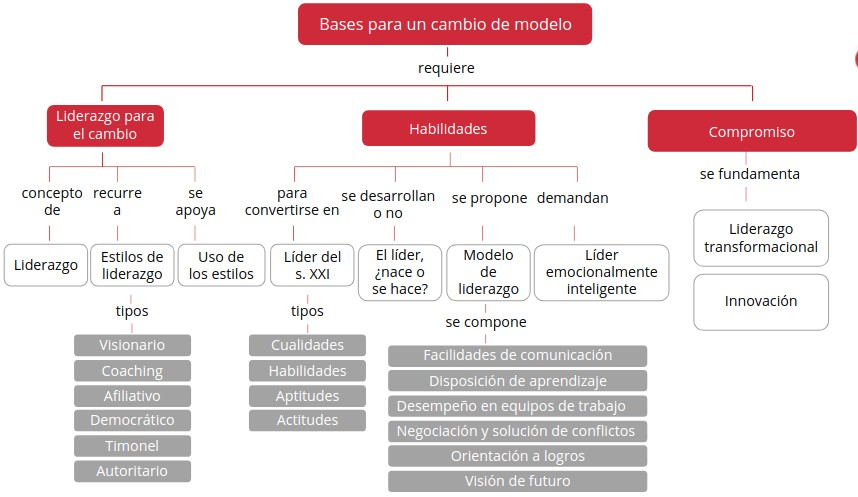

1. Liderazgo para el cambio
***************************

La compleja **economía** en la que estamos inmersas, hace que el liderazgo resulte fundamental para la eficacia de los equipos de trabajo y las organizaciones las que estas pertenecen. 

Es preciso explorar **nuevos enfoques** acerca de la función del líder, que permitan responder las actuales necesidades de trabajo caracterizadas por la adaptación al cambio, innovación constante, diversidad cultural y las actividades basadas en el conocimiento y desarrolladas en entornos virtuales. 

1.1. El liderazgo
+++++++++++++++++

.. note:: El **liderazgo** es facultad de dirigir un grupa de personas en una tarea o misión. Se traduce, en la capacidad de tomar la iniciativa, gestionar, convocar, promover, incentivar, motivar y evaluar un equipo. Es esencial para la supervivencia de cualquier organización, muchas entidades con una planificación insuficiente y malas prácticas en gestión y control han sobrevivido debido la existencia de un buen liderazgo.

 El líder facilita los procesos de transformación y cambia organizacional y representa un modelo de dedicación, entusiasmo y coraje para el resta del grupo. 

Los líderes se clasifican en **cuatro categorías**: 
 
- **Valientes**: Nunca pierden de vista sus metas y su visión, incluso en media de una crisis. Conocen sus propósitos y saben cómo mantener sus valores. Si un líder se mantiene fiel sí misma, los individuos perciben que es alguien quien merece la pena seguir.
- **Inspiradores**: Comprometidos con sus ideales. Logran que las personas crean en que el cambio puede suceder. Son innovadores y progresistas. Desestiman las límites y piensan que las posibilidades son infinitas. 
- **Serviciales**: Se preocupan por sus trabajadores preguntándoles cómo podrían ayudarles. Piensan en nuevas formas de realizar las cosas para mejorarlas. Son prácticos, justos Y generosos. 
- **Reflexivos**: Usan sus mentes y creen que siempre pueden aprender más. Inducen al aprendizaje continuado. Los trabajadores los respetan, por hacerles conscientes de que el cambio se produce y que son capaces de realizar grandes hazañas. 

Un líder, en su relación con sus colaboradores, puede ejercer un **poder**: 

- **Coercitivo**: Basado en el temor, la reprimenda o el castigo. 
- **De legitimidad**: Apoyado en el puesto formal del líder, en su nombramiento. 
- **Del experto**: Debido la capacidad, los conocimientos y la competencia del líder. 
- **Carismático o de relación**: Asentado en personalidad del líder o en su relación personal con los demás. 
- **De recompensa**: Fundamentada en la capacidad de gratificar. 
- **De conexión**: Por los vínculos del líder can individuos importantes, dentro o fuera de la organización. 
- **De información**: Por los datas que posee habitualmente el líder y que las demás necesitan. 

1.2. Estilos de liderazgo
+++++++++++++++++++++++++

.. note:: El **estilo de liderazgo** es la forma o manera de ejercer la función de líder con respecta las miembros de un equipo. 

Existen múltiples estudios y como consecuencia, **diversas clasificaciones** de los estilas de liderazgo presentes en las organizaciones. Las más coincidentes, insisten en plantear seis tipas de comportamientos; sus denominaciones pueden variar un paco en función del autor, pero sus descripciones son parejas. 

En esta unidad, analizamos **la propuesta de Acosta, J. M.** Los cuatro primeros estilos de su enumeración propician un rendimiento alto y los das últimas, son apropiados solo en situaciones muy determinadas y deben aplicarse con mucha cautela. 

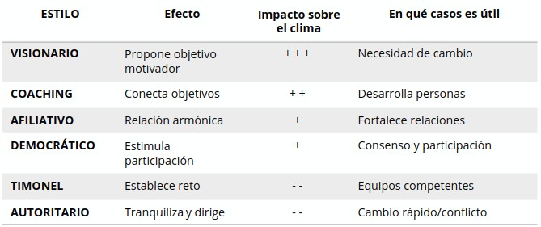

Dos años antes, el autor **Goleman, D.** (reconocido estudioso de la inteligencia emocional) publicó una relación de seis estilos de liderazgo con casi idéntica designación y las mismas características definitorias. 

Tabla de los **estilos de liderazgo** propuesta por Goleman, D.: 

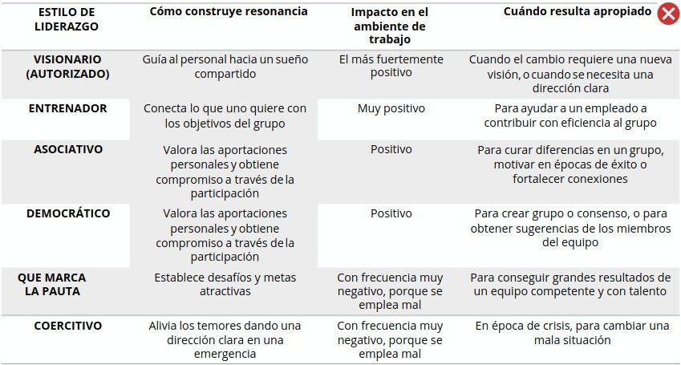

1.2.1. Visionario
-----------------

.. note:: El líder **visionario** establece la meta que debe perseguir el grupo, pero no impone la forma en que debe actuar cada persona. Comparte el conocimiento y posibilita el crecimiento profesional de sus colaboradores porque es consciente de los beneficios que esto, aporta al equipo. 

El líder visionaria posee **competencias** relacionadas con la: 

- Conciencia de uno mismo. 
- Confianza. 
- Canalización del cambio. 
- Transparencia. 
- Inspiración. 
- Empatia. 

El estilo visionario ofrece las siguientes **ventajas**:

- Maximiza la eficacia del proceso de establecimiento de objetivos. 
- Explicita la estrategia largo plazo de la organización. 
- Promueve la iniciativa de las miembros del equipa. 
- Conecta con los sentimientos y la entrega de los colaboradores. 
- Retiene los buenos empleados. 

El liderazgo de tipa visionario es adecuado cuando se dan las siguientes **situaciones**:

- La empresa tiene serias problemas y se encuentra en una situación crítica. 
- Se necesita urgentemente una visión nueva y motivadora. 

El estilo visionario es el más habitual en los líderes innovadores. Estos, son los responsables de las transformaciones más sustanciales. 

1.2.2. Coaching
---------------

.. note:: El estilo de liderazgo **coaching** se orienta mucho más a la persona que tarea. Prioriza el desarrollo personal por encima de los buenos resultados. 

El líder que ejerce coma coach, se **caracteriza** por su: 

- **Conciencia emocional**. 
- **Empatía**. 

Beneficios del estilo de liderazgo coaching:

- Facilita un tipo de relación personal que propicia la confianza y el entendimiento. 
- Proporciona un feedback de rendimiento que es aceptada como un indicador de progreso personal. 
- Permite que los empleados se centren en aquellas facetas de su labor más conectadas con su identidad y sus aspiraciones. 
- Promueve el surgimiento de habilidades en el grupo de trabajo. 
- Estimula la autonomía de los profesionales. 
- Aumenta la confianza de las miembros del equipo. 

Con respecto sus colaboradores, el líder-coach **debe**: 

Identificar sus puntas fuertes y definir sus aspiraciones profesionales. 

Establecer los objetivas a largo plaza y trazar un plan para alcanzarlos. 

Estimular el crecimiento y la superación personal, planteándole propósitos y delegándole responsabilidades. 

El estilo de liderazgo coaching es **propicio** cuando las empleados tienen muchas aspiraciones de desarrollo profesional. 

El coaching es **desaconsejable**, si el empleado: 

- Se encuentra desmotivado. 
- Necesita demasiado feedback personal. 

El estilo de liderazgo coaching requiere que el líder posea suficiente experiencia y sensibilidad. 

1.2.3. Afiliativo
-----------------

.. note:: El líder **afiliativo** se centra en las relaciones personales. Procura establecer un clima laboral armónico y cálido mediante la valoración de las personas y sus sentimientos. 

El líder afiliativo sobresale por sus **capacidades**: 

- **Colaborativa**. 
- **Empatía**.

El estilo de liderazgo afiliativo:

**Permite** 
	- Generar capital emocional al que acudir cuando sea necesario. 
	- Provocar un impacto positivo en el clima laboral. 
	- Fortalecer las relaciones y la fidelidad de los trabajadores. 

**Es adecuado** 
	- Elevar la moral de los colaboradores. 
	- Aumentar la armonía dentra del grupo. 
	- Restablecer la pérdida de confianza en el sena de un equipo. 

**Desatiende** 
	- La consecución de las tareas u objetivos que pasan un segunda plano. 
	- Al evitar los enfrentamientos, no soluciona los problemas y conflictos. 
	- El feedback corrector necesario para que el equipo optimice su rendimiento. 

**No es apropiado** 
	- Situaciones de crisis o de dificultades severas. 
	- Supuestos que requieren directrices claras para afrontar retos complejos. 

1.2.4. Democrático
------------------

.. note:: El líder **democrático** se apoya en las opiniones del equipo. Se muestra muy interesado en conocer los criterios y las inquietudes de sus colaboradores. Maneja bien las conflictas y sabe limar asperezas para incrementar la armonía en el grupo.

El líder democrático ostenta las siguientes **capacidades**: 

- Trabajo en equipo. 
- Gestión de conflictos. 
- Empatía. 

En el estilo de liderazgo democrático se producen una serie de **peculiaridades**: 

- En asuntas importantes las decisiones las tiene que tomar el líder. 
- En situaciones de crisis deja abandonados los colaboradores. 
- El líder es el último en conocer las malas noticias. 

El estilo democrático es **útil** cuando: 

- Un líder no tiene claro el camino a seguir. 
- Es preciso proponer ideas para ejecutar una actividad

Se **desestima** este estila en: 

- Tiempos de crisis. 
- Situaciones que requieren decisiones drásticas o impopulares. 
- Supuestas en los que existe una división de opiniones en el equipo. 

Embarcarse en reuniones y consultas interminables puede no conducir al consenso, sino a malgastar un tiempo preciado. 

1.2.5. Timonel
--------------

.. note:: El liderazgo **timonel** está centrado en los objetivos, en la tarea y en el rendimiento. Se define por indicar el rumbo, marcar el paso y reclamar resultados. 

El estilo de liderazgo timonel se **caracteriza** por lo siguiente:

- Controla cada uno de los pasos de los empleados. 
- Desconoce las necesidades y aspiraciones de las colaboradores.
- Las trabajadores se sienten utilizados. 

Este tipo de liderazgo resulta **adecuado**: 

- En entornas laborales can presencia de expertos. 
- Cuando los miembros del equipo tienen un alto grada de madurez profesional.

Si un trabajador siente que está siendo vigilado constantemente, su rendimiento laboral empeora. 

1.2.6. Autoritarios
-------------------

.. note:: El liderazgo **autoritario o coercitivo** exige que los trabajadores acaten las órdenes incondicionalmente, sin ningún tipo de explicación. 

El estilo de liderazgo autoritario se **define** por: 

- El feedback que proporciona se refiere exclusivamente a los errores. 
- Se limita a amonestar por lo que no enseña nada los colaboradores. 

Este liderazgo **se recomienda** cuando es preciso: 

- Lanzar un proyecto. 
- Resolver una situación crítica o una emergencia. 
- Solucionar conflictos con empleadas problemáticos. 

Los líderes autoritarios parten de la base de que lo habitual es hacer las cosas correctamente y que solo deben intervenir para reprochar malas prácticas. 

1.3. Uso de estilos
+++++++++++++++++++

.. note:: Los líderes que utilizan estilos de liderazgo que provocan un **efecto emocional positivo** entre sus colaboradores, obtienen mejores resultados. 

Los líderes más eficaces recurren, en distinta medida, a **varios estilos de liderazgo** en función de las situaciones. Aquellos que dominan cuatro o más, en especial si son el visionaria, el coaching, el afiliativa y el democrática, consiguen un buen ambiente de trabajo y obtienen un mejor rendimiento. 

Estos líderes efectivos **cambian** con relativa flexibilidad de un estila otro según las circunstancias. Son extremadamente sensibles impacto que producen en los demás y ajustan continuamente su estilo para conseguir resultados efectivas. En ocasiones, la situación les permite cierta reflexión pero en otras, la respuesta ha de ser espontánea, rápida y casi improvisada. 

Imaginemos los estilos de liderazgo como si fuese la colección de palos de golf en la bolsa de un golfista profesional. Durante el transcurso de un partido, el jugador selecciona y elige los palos (estilos) basándose en las necesidades del tiro a realizar. En ocasiones tiene que sopesar su elección, pero por lo general, se trata de una decisión automatizada. 

Muchos líderes na cuentan con seis estilos en su repertorio, y menos aún, saben cuándo y cómo utilizarlos. Para **perfeccionar** su capacitación, estos pueden optar por dos **estrategias**: 

- Construir un equipo con miembros que empleen las estilos de los que el líder carece. 
- Ampliar su propia lista, comprendiendo las competencias que subyacen en los estilos de liderazgo que no dominan y practicándolos de forma diligente para aumentar su dominio. 

2. Habilidades
**************

Las organizaciones del siglo XXI necesitan **gerentes y directivos capacitados** para identificar los impedimentos que limitan el desempeño de sus colaboradores y poder solucionarlos. Estos líderes, deben saber cómo generar confianza, sentido de la responsabilidad y compromiso, y poseer buena disposición hacia la innovación y la creatividad. 

2.1. El líder del siglo XXI
+++++++++++++++++++++++++++

.. note:: El **líder del siglo XXI** que requieren las organizaciones tiene que caracterizarse por poseer una serie de cualidades, habilidades, actitudes y aptitudes. 

Las cuatro **dimensiones de características** que debe ostentar el líder del siglo XXI son:

- **Calidad**
- **Habilidad**
- **Aptitud**
- **Actitud**

2.1.1. Cualidades
-----------------

.. note:: La **cualidad** es aquel elemento que revela la manera de ser de una persona, coma puede ser un hábito o una virtud, permitiendo así, su diferenciación con respecta los demás. 

El líder que demandan las organizaciones actuales ostenta estas **cualidades**: 

- **Comunicación**: Expresarse bien, ser persuasivos en sus argumentos y convincentes con su discurso. 
- **Escucha**: Captar las palabras y las sentimientos del interlocutor. 
- **Compromiso**: Acordar, contraer y cumplir obligaciones con la organización y los colaboradores.
- **Responsabilidad**: Establecer el compromiso de dar una respuesta positiva a proactiva. 
- **Autodisciplina**: Afianzar en la conciencia individual la posibilidad de lograr hacer algo. 
- **Relaciones interpersonales**: Ser objetivo e imparcial en las apreciaciones, renunciando a juicios de valor y aceptando las personas tal y como son. 
- **Actitud positiva**: Enfocar la mente para conseguir sus pretensiones y alcanzar el éxito. 
- **Visión de futuro**:Ser claros acerca de la dirección que toma la organización e inspirados en un escenario venidera deseado que motive las personas hacia la excelencia.
- **Pasión**: Sensibilizar afectivamente ( recurriendo al deseo y al sentimiento) sobre las acciones ejecutar.

2.1.2. Habilidades
------------------

.. note:: La **habilidad** es la capacidad individual, que se articula en torno al ser, el saber y el hacer, para poder llevar cabo una actividad. 

El líder que es capaz de afrontar los nuevas retos organizacionales, se caracteriza par poseer las siguientes **habilidades**:

- **Conformar equipos de trabajo**: Potenciar las competencias de cada uno de los integrantes que posibiliten la sinergia requerida para desarrollar las actividades.
- **Planificadora**: Seleccionar y organizar las mejores alternativas para alcanzar los resultados previamente definidos.
- **Estratégica**: Asegurar la permanencia y proyección de la organización.
- **Capacidad analítica**: Evaluar objetivamente los escenarios posibles. 
- **Innovadora**: Crear nuevoscs productos y/o servicios en la organización. 
- **Toma de decisiones**: Capacidad analítica Innovadora Toma de decisiones.

2.1.3. Aptitudes
----------------

.. note:: La **aptitud** es la capacidad física e intelectual y la buena disposición que tienen una persona para desempeñar una actividad. 

El líder del siglo XXI muestra una serie de **aptitudes**: 

- **Manejo de riesgo e incertidumbre**: Establecer planes para disminuir las contingencias. Zona interactiva Haz clic en los conceptos 
- **Comunicadora**: Transmitir ideas y motivar a las demás personas vinculadas a su trabajo.
- **Relaciones interpersonales**: Emparejar asertivamente can cada persona. 
- **Creativa**: Tener iniciativa y ser imaginativo y original. 
- **Integradora**: Articular eficazmente los recursos humanas, físicos, materiales y financieros. 
- **Planificadora**: Organizar los pasos seguir para lograr los objetivos establecidos. 

2.1.4. Actitudes
----------------

.. note:: La **actitud** es la reacción afectiva (positiva o negativa) hacia una determinada actividad. Se tienen en cuenta la coherencia entre el lenguaje, el cuerpo y emoción manifestada par persona. 

Las empresas requieren líderes que brindan estas **actitudes**: 

- Disposición al cambio. 
- Manejo de relaciones inter e intrapersonales. 
- Trabajo en equipo. 
- Disposición positiva permanente frente al aprendizaje. 
- Ser agente de cambia. 
- Pragmatismo. 
- Crítica constructiva. 
- Creatividad. 
- Innovación. 

2.2. El líder, ¿nace o se hace?
+++++++++++++++++++++++++++++++

.. note:: Los **líderes empresariales** no necesariamente están dotados de esa capacidad innata para atraer o fascinar, pero que a Io largo de su trayectoria laboral y gracias a su crecimiento profesional, son capaces de transformar sus características en una gran dosis de carisma. 

Existen individuos que nacen dotadas de cierto carisma natural que las convierte en líderes cuando se dan ciertas circunstancias, se les denomina líderes innatos. 

Otro tipo de líder, es el que se **forma** como resultado de la suma de sus experiencias concretas y del desarrollo de algunas habilidades que lo van ayudando a alcanzar y perfeccionar su función. 

2.3. Modelo de liderazgo
++++++++++++++++++++++++

El modelo de liderazgo se sostiene en seis pilares que contribuyen desarrolla del perfil de un buen líder organizacional. Estos **componentes** son: 

- Facilidad de comunicación. 
- Disposición al aprendizaje. 
- Desempeño en equipos de trabajo. 
- Negociación y solución de conflictos. 
- Orientación a logros. 
- Visión de futuro.

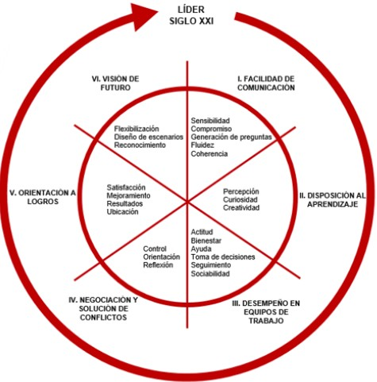

2.3.1. Facilitación de comunicación
-----------------------------------

.. note:: La **facilidad de comunicación** consiste en expresarse bien y, sobre todo, en ser persuasivo con los argumentos y convincente en el discurso. 

Para conseguir facilidad de comunicación, se **requiere** el manejo de: 

- **Coherencia**: Se logra mediante la: 

	- Congruencia semiótica: entre los canales verbales y na verbales. 
	- Consistencia sintáctica: entre las partes de la frase. 
	- Consistencia contextual: respecto al entorno en el que se pronuncia la frase.

- **Fluidez**: Consonancia entre las ideas al comunicarse.
- **Generación de preguntas**: Estímulo a la reflexión, la búsqueda interior, la concienciación de lo que saben, al hallazgo de recursos internos, al aprendizaje, la creatividad, al análisis, la síntesis, al aumenta de autoestima. En definitiva, incitación al desarrollo de potencialidades.
- **Compromiso**: Atención sobre la persona con la que está dialogando.
- **Sensibilidad**: Capacidad para escuchar los sentimientos que subyacen tras las palabras.

2.3.2. Disposición al aprendizaje
---------------------------------

.. note:: La **disposición al aprendizaje** supone modificar el enfoque a la manera de concebir la realidad que se traduce en una búsqueda por encontrar la mejor forma de hacer las cosas. Permite adquirir y asimilar nuevas conocimientos y destrezas para utilizarlos posteriormente en las actividades diarias. 

La disposición al aprendizaje se **alcanza** través de la: 

- **Percepción**: Moda en el que se organiza e interpreta la información recibida través de las sentidos. 
- **Curiosidad**: Deseo de saber y averiguar información sobre una cuestión. 
- **Creatividad**: Producción de ideas originales. 

2.3.3. Desempeño en equipos de trabajo
--------------------------------------

.. note:: El **desempeño en equipos de trabajo** significa potenciar las capacidades de cada uno de los integrantes de un grupo, con el fin de producir la sinergia necesaria para la realización de actividades. 

El desempeña en equipas de trabajo se **logra** mediante: 

- **Actitud**: estado de ánimo con predisposición para la acción. 
- **Bienestar**: adhesión circunstancial la causa a empresa de otros. 
- **Ayuda**: esfuerza y medios utilizadas para fortalecer otras equipos. 
- **Toma de decisiones**: análisis del acontecimiento y de sus posibles causas para identificar las acciones más adecuadas a desarrollar. 
- **Seguimiento**: inspección, comprobación o intervención de una situación. 
- **Sociabilidad**: relación establecida entre dos o más personas. 

2.3.4. Negociación y solución de conflictos
-------------------------------------------

.. note:: A través de la **negociación y solución de conflictos** se manejan las diferencias de intereses u opiniones entre los colaboradores acerca de un determinado tema o situación. Involucra el pensamiento y la acción de los participantes. 

En la negociación y solución de conflictos se exige: 

- **Control**: Disposición individual que determina la tolerancia y paciencia frente un hecho.
- **Orientación**: Conciencia de la posición que se ocupa en las relaciones interpersonales. 
- **Reflexión**: Acción de centrar el pensamiento en una cuestión prestando atención y compromiso. 

2.3.5. Orientación a logros
---------------------------

.. note:: La **orientación a logros** supone elegir y organizar las mejores alternativas disponibles para alcanzar las resultados previamente definidas. 

La orientación a logros **demanda** interiorización de: 

- **Ubicación**: Dirección a seguir para alcanzar el éxito esperada. 
- **Resultados**: Efecto producido por una serie de acciones realizadas. 
- **Mejoramiento**: Acción que permite superar limitaciones y reforzar la capacidad de obtención de resultados.
- **Satisfacción**: Recompensa por los méritos perpetrados.

2.3.6. Visión de futuro
-----------------------

.. note:: La **visión de futuro** se concreta en tener clara la dirección hacia donde encaminar la organización, inspirada en el escenario de futura deseado y que motive a las personas hacia la excelencia. 

Para potenciar la visión de futura se **precisa**: 

- **Reconocimiento**: Análisis del trabajo efectuado por los integrantes de un equipo con el fin de identificar potencialidades y limitaciones individuales y/o grupales. 
- **Diseño de escenarios**: Consiste en hacer materialmente perceptible la acción y los efectos de un determinado fenómeno. 
- **Flexibilización**: Disposición ceder o acomodarse fácilmente los dictámenes a resoluciones provenientes de las circunstancias. 

2.4. El líder emocionalmente inteligente
++++++++++++++++++++++++++++++++++++++++

.. note:: La **inteligencia emocional** se define coma "el conjunto de habilidades que nas permiten percibir, comprender y regular nuestros estados emocionales y los de los demás, con el objeto de utilizar esta información para guiar nuestra forma de pensar y nuestro comportamiento" (Zúñiga Montalvo, J. C.). 

El autor Goleman, D., estudioso del desarrolla y la mejora del desempeño de las personas, plantea cinco elementas que componen la inteligencia emocional: 

- **Autoconciencia**. 
- **Autogestión**. 
- **Automotivación**. 
- **Conciencia social**. 
- **Gestión de relaciones**. 

Elementos de la inteligencia emocional según Goleman, D.: 

- **Autoconciencia**: Conocimiento de uno misma, de las propias emociones. 
- **Autogestión**: Capacidad de controlar las emociones.
- **Automotivación**: Capacidad de motivarse uno mismo. 
- **Conciencia social**: Reconocimiento de las emociones ajenas. Empatía. 
- **Gestión de relaciones**: Control de las relaciones con otras personas

.. note:: Un **líder con inteligencia emocional** está capacitado para crear un ambiente dinámico de trabajo con un buen clima laboral y en donde sobresalen las virtudes, los valores creativos y la libertad de pensamiento. 

El líder emocionalmente inteligente se caracteriza por poseer las siguientes cualidades: 

- **Empatía**: Se pone en el lugar de los demás. Conoce las preocupaciones, los temores e inquietudes de sus colaboradores y entiende sus reacciones. Requiere paciencia y constancia. 
- **Generosidad**: Se expresa mediante la concesión desde posiciones éticas. Ofreciendo Io que está de su mano, favorece la creación de riqueza social. 
- **Humanidad**: Se revela en los momentos de éxito. Cuando una persona recibe un ascenso dentro de la organización, debe continuar siendo amable y servicial can sus colaboradores. Esta cualidad, incita fortaleza, ánimo y respeto. 
- **Percepción de la oportunidad**: Proviene de su instinto e intuición. Se trata de ser capaz de percibir un cambio de tendencia y actuar en consecuencia; anticipándose así, al devenir. 

3. El compromiso
****************

Las organizaciones actuales demandan **líderes** centradas en el principio de construcción de confianza, sacrificando el ya por el nosotros. Que comprendan a las personas, mantengan las promesas y sean honestos y gentiles; y que procuren equipar la misión de las entidades can el cometido de los empleados. 

3.1. Liderazgo trasformacional
++++++++++++++++++++++++++++++

.. note:: El **liderazgo transformacional** está centrado en el papel del líder como un agente del cambio, que promueve el compromiso y motiva equipo. Se fundamenta en los valores, creencias y cualidades personales del propio líder y de sus seguidores. ausca generar relaciones y dotar de significación las actividades realizadas. 

El liderazgo transformacional procura motivar e incentivar las seguidores para que **participen** activamente en las cambios de su entorna, sensibilizándolos con la misión y visión empresarial y emplazándolos a alcanzarla; dentro de un clima laboral positivo, en el cual, se trabaja con entusiasmo, responsabilidad y alto sentido del deber. 

Se puede comparar la función del líder transformacional, con la de entrenador en un juego de fútbol. Este, debe entusiasmar al equipo, aplaudir sus progresos en dirección a la portería e incentivarlo a marcar gol. 

El liderazgo transformacional produce un **cambio** positiva en los seguidores, basándose en la ayuda mutua y equilibrada, y enfocando de manera integral la organización; lo cual, aumenta la motivación, la moral y el rendimiento de los colaboradores. 

Un **liderazgo transformador requiere** por parte del líder: 

- **Autoconocimiento**: Poseer conocimiento de sus propias cualidades y características. 
- **Autorrealización**: Perpetrar, satisfacer y mejorar sus potencialidades. 
- **Autodisciplina**: Obtener más con el mismo esfuerza. 
- **Autonomía**: Tener fuerza para avanzar y continuar sin límites. 

Con el fin de comprobar el **resultado de sus acciones**, los líderes transformacionales consideran tres aspectos: 

- **Satisfacción**: 
	Comprende el grado en el cual el colaborador manifiesta su agrado con el trabajo y can la organización. Implica la correspondencia entre el nivel de esfuerzo del trabajador, los resultados y las demandas laborales. 

	El líder a través de su actuación puede lograr que el personal se sienta conforme con las condiciones laborales, siendo esto, un elemento de la dirección relevante para el alcance de los objetivas. 

- **Esfuerzo extra**: 
	Un factor esencial para generar productividad y desarrollo en las organizaciones. Deriva de las acciones del líder, que provocan una mayor participación de los Esfuerzo extra colaboradores en su actividad diaria y generan una mayor aportación laboral. Para ello, es fundamental, la incentivación motivacional a económica. 

- **Efectividad**:
	Un factor esencial para generar productividad y desarrollo en las organizaciones. Deriva de las acciones del líder, que provocan una mayor participación de los Esfuerzo extra colaboradores en su actividad diaria y generan una mayor aportación laboral. Para ello, es fundamental, la incentivación motivacional a económica. 

3.2. Innovación
+++++++++++++++

.. note:: **Innovar** significa hacer algo que nunca hicimos para crear algo que na existía. Las organizaciones necesitan líderes que construyan confianza y que no esperen que las cosas sucedan, sino que reinventen sus acciones para obtener mejores resultados. 

Para que se produzcan innovaciones en las entidades, los líderes deben despuntar en las siguientes **actuaciones**: 

- **Ver más allá de sus fronteras para descubrir lo que puede ser diferente**: buscan la excelencia, en sus empresas existe una insatisfacción permanente por la que hacen y lo que podrían hacer, esto, se convierte en el motor para el descubrimiento de mejores formas de realizar las casas. 
- **Desafiar suposiciones**: procuran descubrir vías alternativas. Unen ideas de forma diferente para dar origen nuevas planteamientos. 
- **Visión**: ayuda superar las dificultades y ofrece un panorama general hacia dónde encaminar organización en el futuro. 
- **Reunir aliados**: las organizaciones que implementan sus ideas más rápidamente son las que involucran, lo antes posible, todos los agentes interesados en la empresa (empleados, clientes, proveedores, accionistas, etc.). 
- **Crear un equipo**: luchar en organización por conseguir espacias, información y recursos materiales para que su equipo pueda desarrollar bien su trabajo. 
- **Persistir e insistir**: si se desiste cuando los problemas se acumulan y los recursos comienzan escasear, se producirá un fracaso, pero si se persiste se alcanzará el éxito. La coalición de colaboradores perseverantes puede convertirse en un factor relevante. 
- **Compartir los méritos**: el líder debe repartir los reconocimientos, aunque la idea inicial fuese suya. Las personas necesitan saber que son valoradas. 

4. Resumen
**********

Los líderes más eficaces recurren, en distinta medida, a **varios estilos de liderazgo** en función de las situaciones. Aquellos que dominan cuatro a más, en especial si son el visionaria, el coaching, el afiliativo y el democratica, logran un buen ambiente de trabaja y obtienen un mejor rendimiento. 

Las empresas actuales necesitan **gerentes y directivos capacitados** para identificar los impedimentos que limitan el desempeño de sus colaboradores y poder resolverlas. Estas líderes, deben saber cómo generar confianza, sentido de la responsabilidad y compromiso, y tener buena disposición hacia la innovación y la creatividad. 

El **liderazgo transformacional** pretende motivar e incentivar los seguidores para que participen activamente en los cambios de su entorno, sensibilizándolas con misión y la visión empresarial y emplazándolos alcanzarla; dentra de un clima laboral positivo, en el cual, se trabaja con entusiasma, responsabilidad y alto sentido del deber. 

5. Actividades
**************

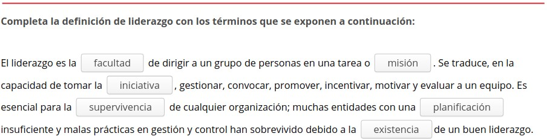

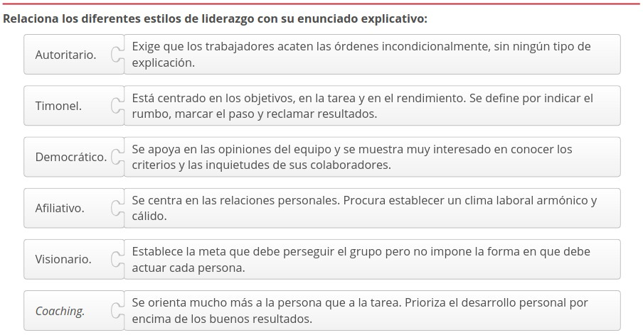

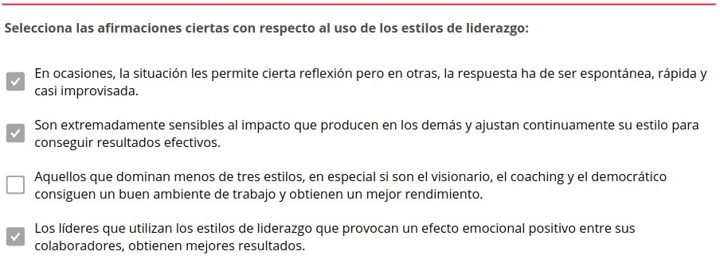

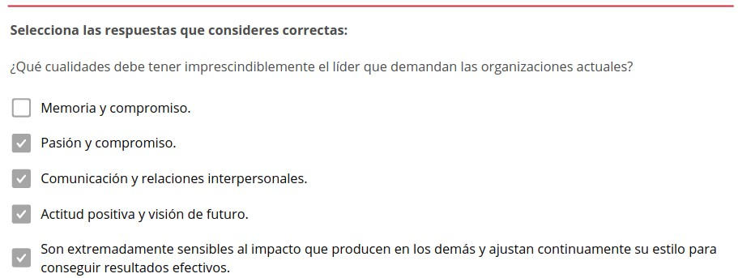

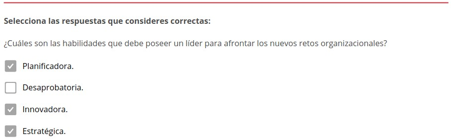

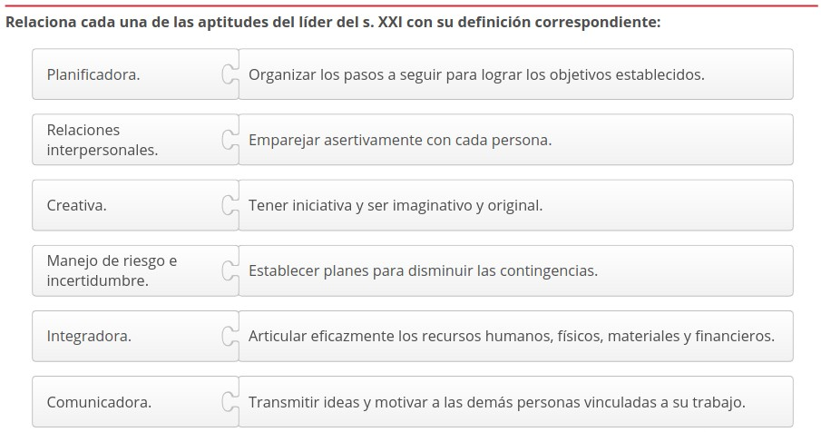

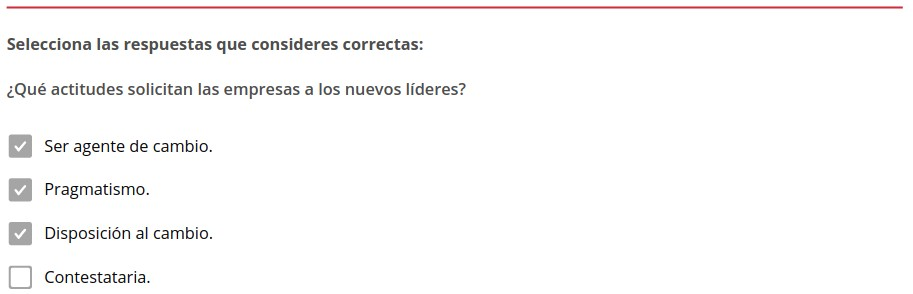

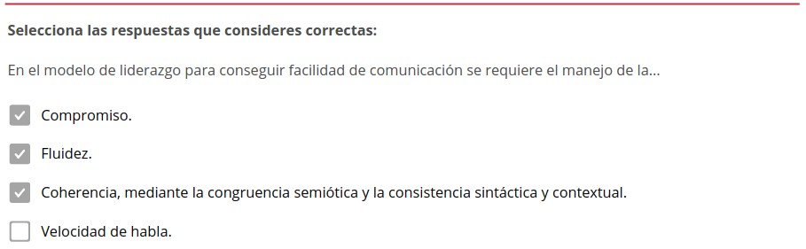

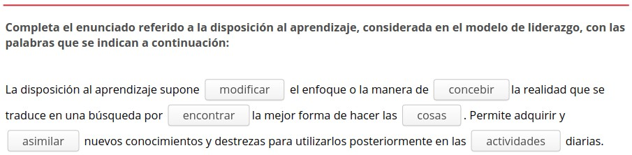

.. figure:: ../../_static/3_metodologias_agiles/3.2_bases_para_cambio_modelo/actividades/actividad_3_3.jpg
   :width: 70%
   :align: center

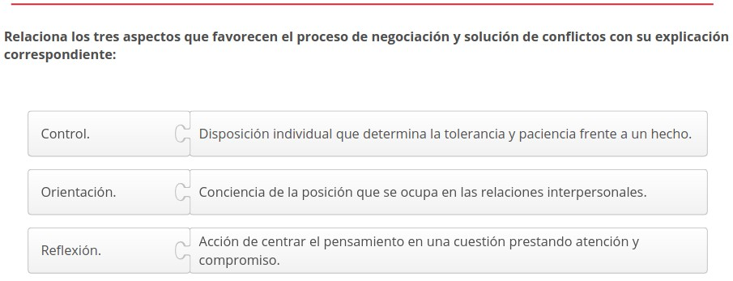

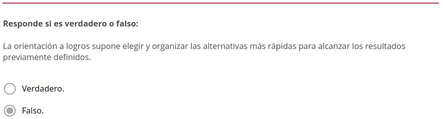

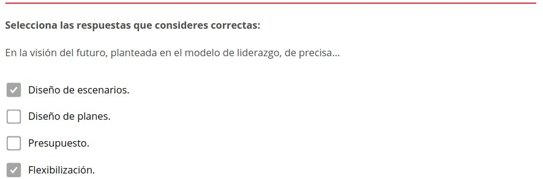

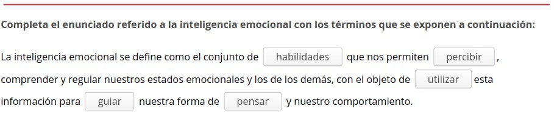

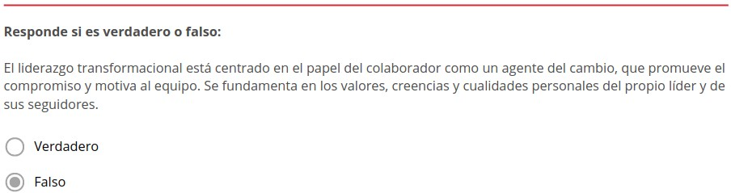

.. figure:: ../../_static/3_metodologias_agiles/3.2_bases_para_cambio_modelo/actividades/actividad_5_3.jpg
   :width: 70%
   :align: center

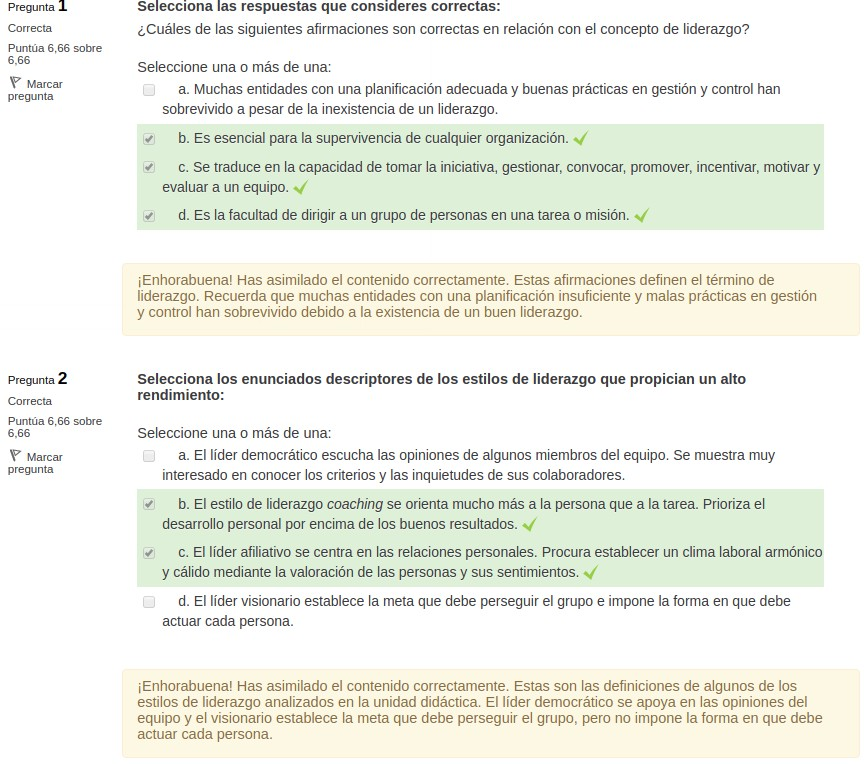

.. figure:: ../../_static/3_metodologias_agiles/3.2_bases_para_cambio_modelo/actividades/questionnaire_2.jpg
   :width: 70%
   :align: center

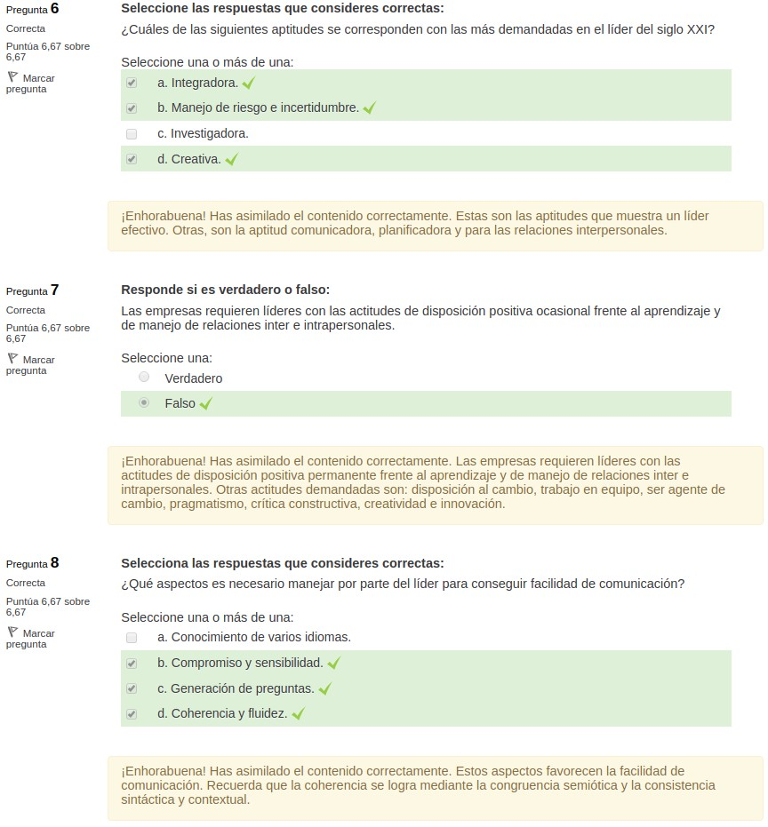

.. figure:: ../../_static/3_metodologias_agiles/3.2_bases_para_cambio_modelo/actividades/questionnaire_4.jpg
   :width: 70%
   :align: center

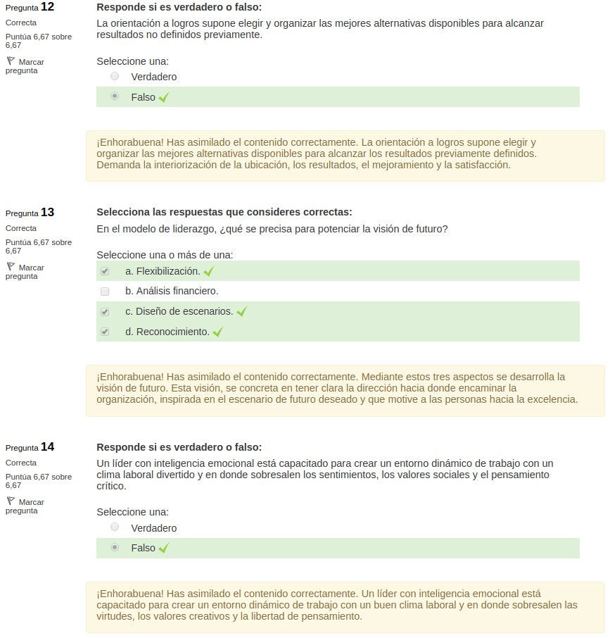

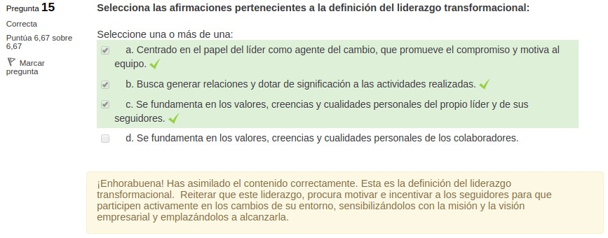