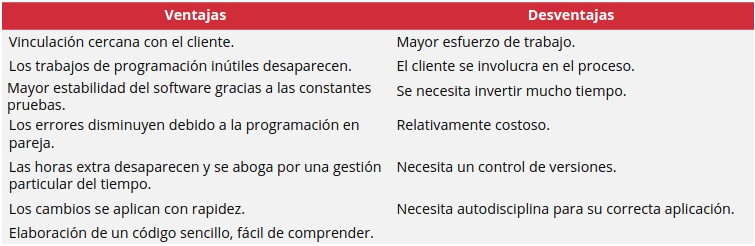
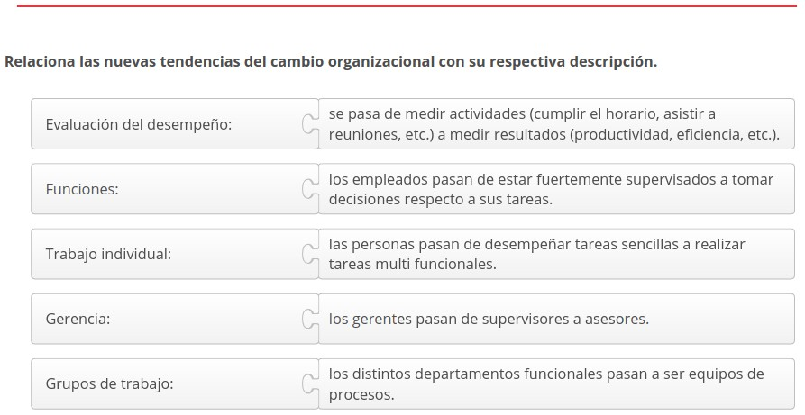

3.3. Aplicación de modelos ágiles
=================================

Las **metodologías ágiles** surgieron como consecuencia de dos hechos relevantes: un desarrollo de software deficitario y una metodología tradicional con limitaciones para responder a los cambios continuos que se producen en el ámbito empresarial. 

Esta necesidad impulsó la creación del **Manifiesto para el desarrollo ágil de software**. Un documento que elaboraron 17 críticos donde recoge 4 valores y 12 principios para la creación y ejecución de proyectos de software. 

A partir de allí se desarrollaron varios **métodos y modelos**, tanto de gestión como de cambio, cuyo base principal descansa en el **pensamiento Lean**.

.. figure:: ../../_static/3_metodologias_agiles/3.3_aplicacion_modelos_agiles/mapa_conceptual.jpg
   :width: 70%
   :align: center

1. Modelos ágiles
*****************

.. note:: **Modelos ágiles o Agile Modeling (AM)** es una metodología para el desarrollo de sistemas y documentación de software fundamentada en las mejores prácticas. Ofrece un conjunto de recomendaciones para estos dos períodos (sistemas y documentación), pero no contempla las restantes etapas de un proyecto, por lo que este modelo resulta un complemento de otros. 

Los tipos de modelos ágiles son: 

- **De gestión**: provee un marco teórico para la administración de una entidad. 
- **De cambio**: provee un marco teórico para la gestión del cambio organizacional dentro de una entidad. 

2. El modelo de gestión
***********************

El **término "modelo"** hace referencia a distintos significados y es utilizado en diversas áreas del conocimiento. 

**En ciencias sociales** se usa para aludir a un modelo de referencia que, debido a sus características ideales, es puesto como ejemplo. También se suele usar para describir el esquema teórico de un sistema o de una realidad compleja. 

Según la Real Academia Española, **gestionar** es "llevar adelante una iniciativa o un proyecto" 

La palabra **"gestión"** hace referencia a un conjunto de actividades y procedimientos que se llevan a cabo para concretar un objetivo particular. Se asocia al conjunto de diligencias que conducen la administración de un negocio, empresa u organización. Esto implica dirigir, ordenar, disponer o gobernar. 

Un **modelo de gestión** es un esquema o marco de referencia para organizar una actividad y llevar a término un proceso. 

.. note:: Un **modelo de gestión** provee un marco teórico para la administración de una entidad. Puede aplicarse tanto en empresas privadas como en la administración pública. 

Los **gobiernos** optan por un modelo de gestión u otro con la finalidad de implantar sus políticas y ejecutar acciones. La diferencia es que estos deben incluir dentro de sus prioridades el bienestar social de la población mientras que el objetivo fundamental de las **empresas privadas** es la obtención de beneficios económicos. 

Hay muchos tipos de modelos ágiles de gestión, pero **se analizarán los tres más importantes**: 

- Scrum. 
- Extreme Programming. 
- Kanban. 

2.1. Scrum
++++++++++

.. note:: **Scrum** es una metodología ágil de desarrollo de software que posibilita la realización de proyectos dirigidos a satisfacer las necesidades de la empresa y de las clientes. Su objetivo es aumentar la eficiencia y disminuir los plazos de ejecución a través de equipos de alta productividad trabajando en entornos colaborativos. 

2.1.1. Iterar
-------------

Esta metodología se basa en la **iteración**. 

.. note:: **Iterar** es desarrollar un conjunto de pequeñas actividades. Tras cada iteración el producto se va desarrollando paulatinamente, pues cada una implica avanzar hacia la conclusión de proyecto. 

Scrum es **la más utilizada** de las metodologías ágiles de desarrollo de proyectos. 

El nombre **"Scrum" proviene del Rugby** y significa "melé". Este término hace referencia a la forma como actúa el equipo dentro de juego. Se mueven como si fuesen una unidad con la finalidad de llevar la pelota hasta la zona de anotación. 

Bajo la metodología Scrum todos los **integrantes del equipo** ejecutan actividades de forma iterativa para completar el proyecto. 

2.1.2. Origen
-------------

Scrum **nace** en el 2001 producto del "Agile Manifiesto" o Manifiesto para el desarrollo ágil de software. 

El **Manifiesto para el desarrollo ágil de software** es un documento que elaboran 17 críticos donde recoge 4 valores y 12 principios para la creación y ejecución de proyectos de software. 

.. note:: El **Manifiesto para el desarrollo ágil de software** es de suma importancia dentro del movimiento de las metodologías ágiles. Representa una iniciativa conjunta de los principales responsables de procesos basados en este enfoque metodológico por unificar principios compartidos y crear un marco de trabajo innovador.

2.1.3. Plan de proyecto
-----------------------

El **plan de proyecto está compuesto** por una lista de objetivos y requisitos. 

Una **figura clave** para la elaboración del plan de proyecto es el Product Owner. 

.. note:: El **Product Owner** administra los recursos, establece el orden de prioridad de los objetivos y planifica las acciones y las iteraciones. 

2.1.4. Sprint
-------------

.. note:: Se denomina **"sprint"** a una serie de iteraciones de corta duración que incrementan el valor del proyecto. 

Bajo el modelo Scrum **todo el proyecto debe desarrollarse** en un solo sprint. El diseño, la planificación y la fase de pruebas deben desarrollarse durante un sprint. 

Cada sprint es una **unidad en sí misma** y debe durar entre 2 a 4 semanas, justo el plazo necesario para presentar el trabajo, recibir una retroalimentación y pensar en las mejoras que se pueden introducir para cada iteración. 

**Dividir el trabajo en sprints** permite crear una dinámica de trabajo mediante la cual es posible conducir el proyecto según los cambios que se produzcan y tomando en cuenta las necesidades del cliente. 

Cada sprint **debe aportar valor**. Esto consiste en la introducción de una variación que debe ser presentada al cliente cuanto antes y debe desarrollarse en el menor tiempo posible. 

El **proyecto completo** equivaldrá al total de sprints que sean necesarios. 

2.1.5. Roles
------------

Los **roles principales de la metodología Scrum** son: 

- **Product Owner**: representa al cliente. Debe cerciorarse de que el equipo comprenda y satisfaga sus expectativas. Es la persona sobre la que recae la mayor responsabilidad. 
- **Scrum Master**: su labor principal es facilitar el trabajo del equipo. Por un lado, debe gestionar el proceso Scrum y guiar las reuniones. Por otro lado, se encarga de suprimir cualquier obstáculo que se presente con la finalidad de alcanzar la meta del sprint. 
- **Scrum Team**: son de 3 a 9 integrantes que se ocupan de desarrollar las actividades. Aunque puede haber roles internos dentro del equipo, lo que prevalece es la pertenencia a este. Por lo tanto, el equipo se autogestiona y explica y defiende su trabajo al final de cada sprint 

2.1.6. Implementación
---------------------

Los **pasos esenciales para implementar Scrum** son: 

- **Product Owner**: Elegir al responsable del proyecto, quien representa al cliente y conoce los objetivos. 
- **Scrum Team**: Elegir al equipo, entre 3 y 9 personas que llevarán a cabo las actividades y cumplirán con los requisitos del proyecto. 
- **Scrum Master**: Elegir a líder del equipo, quien domina la metodología y dirige las iteraciones y los sprints. 
- **Lista de bloques**: Es la lista de objetivos o bloques que deben alcanzarse a final de proyecto. 
- **Priorizar bloques**: El equipo se encarga de establecer un orden de prioridad para la lista de objetivos. 
- **Planificar sprint**: Cada sprint debe cumplir con un objetivo o más y debe tener asociado un tiempo de ejecución. 
- **Actividades**: Es el conjunto de actividades necesarias para completar el sprint que se ha planificado. 
- **Scrum diario**: Se trata de una reunión de alrededor de 15 minutos que se realiza diariamente. En ella se revisa el trabajo realizado el dia anterior y se programan las siguientes acciones. 
- **Panel de seguimiento**: Mediante la ayuda de un panel Scrum, visualizar el progreso de las actividades que están planificadas. Este panel debe contener tres columnas: pendiente ("to do"), en proceso ("in progress) y hecho ("done"). 
- **Mejora continua**: Al finalizar el sprint, se muestra el trabajo realizado y se recoge la retroalimentación. Luego se reflexiona acerca de cómo se podría mejorar el proceso. 

De este modo **se continúa con el ciclo de sprints** hasta completar el proyecto. 

**No solo avanza el proyecto**, también avanza el equipo y el proceso completo, ya que mejora la experiencia laboral y las capacidades de los integrantes. 

2.1.7. Beneficios
-----------------

Los **beneficios del modelo Scrum** son: 

- **Retroalimentación**: bajo el modelo Scrum el Product Owner puede observar el trabajo tras cada sprinty brindar sus impresiones. En la presentación de cada sprint hay una nueva aportación que valorar y el cliente puede visualizarla mediante una demo. Se trabajó mano a mano con el cliente. 
- **Flexibilidad**: la metodología Scrum ha sido diseñada pensado en la forma de adaptarse rápidamente y en el momento justo a los cambios del mercado o a los que indique el cliente. 
- **Time To Market**: el mercado cambia con mucha rapidez. Es importante disminuir los tiempos de ejecución. Con el modelo Scrum el cliente tiene en sus manos partes importantes del proyecto desde una fase muy temprana, lo que hace que pueda comenzar a utilizarlas con bastante antelación. 
- **Productividad**: aumenta la productividad al concederle al equipo de trabajo mayor autonomía y libertad para organizarse, ya que se ahora tiempo dedicado a la burocracia y los protocolos típico de toda gestión. 
- **Riesgos**: al aprobarse las funcionalidades más importantes del proyecto, es posible anticiparse a los problemas que puedan surgir. Esto reduce significativamente los riesgos del proyecto. 

2.2. eXtreme Programming
++++++++++++++++++++++++

 .. note:: **Extreme Programming (XP)** es una metodología ágil de desarrollo de software que asume los cambios continuos durante el proceso de trabajo como algo normal. Dando prioridad a la capacidad de adaptación en cualquier punto de la vida del proyecto antes que al control de los requisitos que han sido fijados al comienzo del mismo. 

"Extreme Programming' se traduce como "programación extrema". Es una metodología que se conoció en el año 1999 mediante el libro "Planning Extreme Programming" escrito por **Kent Beck**. 

Esta **metodología promueve la creatividad** de los desarrolladores y admite los errores como un aspecto ordinario del trabajo. 

2.2.1. Técnicas
---------------

Si bien Extreme Programming comparte valores y principios con otros modelos ágiles, las **técnicas que utiliza son muy concretas**. Este es el aspecto que lo hace destacar sobre el resto. 

Las **técnicas del modelo Extreme Programming** son: 

- Feedback. 
- Proceso continuo. 
- Comprensión conjunta. 
- Bienestar de los desarrolladores. 

2.2.2. Feedback
---------------

Los **elementos que garantizan un feedback continuo en el modelo Extreme Programming** son: 

- **Test-driven development (desarrollo guiado por pruebas)**: esta técnica se fundamenta en la comprobación. Los desarrolladores escriben primero un entorno de prueba y luego crean el código fuente. En este caso, el feedback es proporcionado por el mismo sistema, ya que el código debe pasar esta primera prueba. 
- **Planning game (partido de planificación)**: el proceso de desarrollo se divide en fases Test-driven development y tras cada una se realiza una reunión donde se evalúa el trabajo realizado, se recoge el feedback del cliente, se debate sobre las funciones futuras y se planifican las Planning game siguientes acciones. 
- **On-site customer (cliente "in situ")**: consiste en que al menos un representante del Test-driven development cliente sea parte del equipo de trabaja. De este modo, esta persona puede aportar ideas, despejar dudas o trasladar mensajes de forma inmediata, eliminando tiempos Planning game de espera. 
- **Pair programming (programación en pareja)**: consiste en trabajar en parejas. Cuando dos personas realizan una misma tarea, suele haber mejores resultados. Al haber dos perspectivas distintas, se identifican los errores con mayor facilidad, se intercambian experiencias y consejos y se comprueba el trabajo con mayor asiduidad. En este caso quien aporta el feedback es el compañero.

2.2.3. Proceso continuo
-----------------------

Los **elementos que garantizan un proceso de elaboración continua en el modelo Extreme Programming** son: 

- **Refactoring (refactorización)**: la fragmentación y la reescritura constante del código fuente, lo optimiza. Se suprimen componentes innecesarios y repeticiones. 
- **Continuous integration (integración continua)**: se trata de la integración constante del nuevo código en el proyecto completo. De este modo, se pueden comprobar todas las aportaciones frecuentemente y todos los integrantes del equipo trabajan con toda la información que se ha producido hasta el momento. 
- **Small releases (entregas cortas)**: consiste en la publicación de los programas y las actualizaciones que funcionan. De este modo, los errores se detectan con mayor facilidad y se corrigen de inmediato. Además, el cliente puede realizar comprobaciones y ver los últimos avances, para luego compartir impresiones y sugerencias. 

2.2.4. Comprensión conjunta
---------------------------

Los **elementos que garantizan una comprensión conjunta en el modelo Extreme Programming** son: 

- **Simple design (diseño simple)**: todos los desarrolladores deben entender el código, por lo tanto, no debe haber duplicaciones ni elementos innecesarios en el código fuente. 
- **Coding-standards (estándares de codificación)**: se trata de establecer algunas indicaciones para el formato y el enfoque. Esto servirá para identificar los cambios realizados y facilitará la colaboración estrecha entre los integrantes del equipo. 
- **Collective code ownership (propiedad conjunta del código)**: el código generado debe concebirse como una propiedad conjunta. De esta forma, tanto errores como aciertos son asumidos de forma grupal y se fomenta la colaboración entre compañeros y la aportación de ideas. 
- **System metaphor (metáfora como sistema)**: consiste en explicar el proyecto de la manera más simple posible, incluso haciendo uso de metáforas. Lo mismo ocurre con los nombres de clases, funciones u objetos dentro del código, es importante usar nombres autodescriptivos. Esto ayudará a que los nuevos integrantes que se unan al equipo entiendan el proyecto con mayor rapidez y puedan comenzar a trabajar en breve. 

2.2.5. Bienestar de los desarrolladores
---------------------------------------

Para evitar que el equipo se sature, se regula la **cantidad de horas de trabajo a la semana**, quedando en 40, y se prohíben las horas extras. En caso de que sea necesario sumar horas demás a la jornada semanal, es preciso que la semana siguiente sea de 40 horas. 

Desde la perspectiva del modelo Extreme Programming, **trabajadores descansados y motivados** son claves para el éxito de proyecto. 

2.2.6. Roles
------------

Los **roles principales de la metodología Extreme Programming** son: 

- **Cliente**: señala los requisitos del producto, pero interviene menos en la forma como estos deben alcanzarse. La persona o grupo de personas que ocupa el rol del cliente deben expresar de forma comprensible sus necesidades. Este rol Io suelen desempeñar: un director de producto o empleados del área de marketing. Eso dependerá del objetivo del proyecto. 
- **Desarrollador**: todas las personas que intervienen en la hechura del proyecto se denominan desarrolladores. No hay subcategorías. Además de programar, se encargan otras tareas como: planificar la implementación, calcular el gasta, etc. Si lo requieren, pueden solicitar recursos adicionales. Debido a la imposición de 40 horas de trabajo semanales, suelen establecer su propio horario. 
- **Director**: es el puente entre el cliente y los desarrolladores. Son quienes pautan las reuniones y las presiden, velando para que se dé una discusión constructiva y se respete Io que se había acordado previamente. También se le suele denominar "tracker' ("registrador), dado que es la persona encargada de registrar datos importantes como: la cantidad de tiempo que emplea cada desarrollador en el proyecto. 
- **Coach**: contribuye como ayudante externo y debe conocer el Extreme Programming. Su labor es cerciorarse de que todos entienden cómo aplicar el modelo y conocen cuáles son los procedimientos. El coach debe estar junto al equipo a lo largo del proyecto para resolver dudas, repasar prácticas, etc. 

2.2.7. Ventajas e inconvenientes
--------------------------------

2.3. Kanban
+++++++++++

.. note:: **Kanban** es un método visual para controlar las tareas que conforman un proyecto. Está compuesto por un sistema de señales que acompañan el proceso desde su inicio, lo que desea el cliente, hasta el final, el producto entregado. 

Este método fue **desarrollado por** la empresa Toyota en 1947. 

**"Kan ban" son dos palabras japonesas** que significan "tarjeta visual". 

En un principio el **método Kanban se utilizó** para optimizar el proceso de abastecimiento y evitar la acumulación de materiales en "stock" (en el almacén). 

Actualmente este proceso de denomina **método Pull o de arrastre**, ya que el reabastecimiento se hace cuando los materiales están llegando a su fin. 

Este procedimiento se puede **aplicar en distintos ámbitos** para controlar el flujo de distintos procesos. 

2.3.1. Reinterpretación
-----------------------

Es así como a comienzos del siglo XX algunas empresas hacen una **reinterpretación del método** y comienza a utilizarlo para controlar el flujo de tareas en la gestión de proyectos de creación de software. 

**Cada tarea se descompone en pequeñas fases** que se van ejecutando una tras otra. De este modo, no se comienzan a ejecutar varias tareas a la vez, como solía ocurrir anteriormente. 

El **lema de Kanban es**: "Stop starting, start finishing", que se puede traducir como: "deja de comenzar y comienza a terminar. 

2.3.2. Aplicación
-----------------

Para aplicar el método Kanban es necesario un **tablero**, que puede ser de corcho, pizarra o hallarlo en formato digital a través de alguna aplicación de gestión de proyectos. 

Este **tablero se puede dividir en seis columnas o más**, de acuerdo a las necesidades del proyecto. A la izquierda se coloca la lista completa de tareas (o "backlogr), luego una columna por cada fase del proyecto subdivididas en: en curso ("doing') y finalizadas ("done"). 

Es posible agregar una columna de **pruebas o revisión**. 

Cada tarea se debe anotar en una **tarjeta de color**, que bien puede ser una ficha o una nota. 

Las **tarjetas se moverán de izquierda a derecha** hasta concluir el proceso o el proyecto. 

2.3.3. Tablero Kanban
---------------------

.. figure:: ../../_static/3_metodologias_agiles/3.3_aplicacion_modelos_agiles/tablero_kanban.jpg
   :width: 70%
   :align: center

2.3.4. Flexibilidad
-------------------

El **número de tareas que puede estar dentro de cada columna** es algo que debe definirse antes de comenzar a implantar el método Kanban. 

Las **columnas externas** no tienen limite de tareas asignado. 

No solo se puede elegir el número de tareas que puede alojarse dentro de cada columna, también es posible **definir otros aspectos**, como qué requisitos debe cumplir una tarea para considerarse finalizada y pasar a la siguiente columna. 

Al ser un modelo ágil, es **flexible y se adapta** a distintos proyectos, áreas de trabajo, etc. 

Kanban puede aplicarse a **equipos con cualquier estructura**, pequeños, grandes, incluso puede usarse individualmente. 

2.3.5. Carriles y cadencias
---------------------------

Los **carriles (o "swimmlanes")** son unas filas que se insertan dentro de las columnas dividiéndolas en dos. En la parte de arriba se colocan las tareas que tienen prioridad y en las de abajo el resto. 

**Cadencias** son reuniones periódicas que promueven y facilitan la comunicación entre los integrantes del equipo. No se pauta ni la frecuencia ni el momento en que deben llevarse a cabo. 

2.3.6. Prácticas
----------------

Las **prácticas que distinguen al método Kanban** son: 

- **Visualización**: Permite una visión general del flujo de trabajo. El tablero puede configurarse de acuerdo al proyecto o a las necesidades de la empresa. Lo más importante es definir la cantidad de tareas que puede alojarse dentro de cada columna y las etapas que componen la hechura del proyecto. 
- **Limitación**: Limitar el número de tareas que pueden realizarse en paralelo incrementa la Gestión eficiencia del flujo de trabajo. 
- **Gestión**: Si surgen problemas o bloqueos, el equipo se centrará en solucionarlos. una visión del flujo de trabajo constante y actualizada ayuda gestionar mejor la capacidad de los equipos. 
- **Regulación**: Es necesario elaborar un conjunto de normas que muestre un flujo de trabajo Gestión preciso y que pueda visualizarse fácilmente en el tablero.
- **Feedback**: Kanban incluye como parte importante del modelo el intercambio de Gestión información mediante las cadencias.
- **Kaisen**: Kanban parte de la mejora continua. Es necesario revisar continuamente los procesos con la finalidad de implementar mejoras, ya que nunca se llegará a un estado óptimo. 

2.3.7. Ventajas e inconvenientes
--------------------------------

3. El modelo de cambio
**********************

.. note:: Un **modelo de cambio** provee un marco teórico para la gestión del cambio organizacional dentro de una entidad. 

3.1. Cambio organizacional
++++++++++++++++++++++++++

Según **Stephen P. Robin**, cambio es "hacer cosas diferentes". 

En el libro **"Organization Theory: A Strategic Approach"** se define el cambio como "la alteración del status quo". 

En este sentido, **toda modificación** por minima que sea, puede ser considerada un cambio. Por lo tanto, se estaría englobando en una misma categoría: una modificación de orientación de los mercados, una transformación estructural, una modificación de la cultura empresarial, ajustes a los procedimientos, procesos y normas, etc. 

Es importante comprender que **cualquier modificación va a afectar** una o más áreas de la organización. 

3.2. Orígenes más frecuentes
++++++++++++++++++++++++++++

Entre las diversas razones que pueden generar un cambio organizacional está la adaptación a: 

- Nuevos perfiles profesionales. 
- Nuevas formas de comprar del consumidor. 
- Nuevas situaciones en el mercado. 

3.3. Tipos
++++++++++

Los tipos de cambios organizacional pueden ser: 

- Estructurales. 
- Culturales. 
- De personal. 
- Estratégicos. 
- De procesos. 
- Tecnológicos. 

3.4. Cambios estructurales
++++++++++++++++++++++++++

.. note:: Los **cambios estructurales** son aquellos que se dan en la configuración de la organización. 

Aquí **se incluyen**: cambios en la división por departamentos, en la cadena de mando, en el diseño de los puestos de trabajo, en la jerarquía, etc. 

Gracias a estos cambios las empresas **se adaptan a los nuevos tiempos**, crecen y sobreviven a lo largo de tiempo. 

Sin embargo, es necesario medir bien los cambios que se llevarán a cabo para **evitar que la organización pierda su esencia**. 

3.5. Cambios culturales
+++++++++++++++++++++++

.. note:: Los **cambios culturales** son aquellos relacionados con la identidad de la empresa, sus valores, su misión, sus principios y la metodología que utiliza. 

Estos **afectan directamente la imagen de la empresa**. 

Por **ejemplo**, un restaurante suele fomentar una cultura del trabajo duro. Se promueve la acción debido a la alta carga de trabajo y se da una retroalimentación constante e inmediata entre responsables y subordinados. 

La cultura organizacional **es esencial** en una empresa e influye en la satisfacción, bienestar y productividad de los empleados. 

Sin embargo, debe realizarse siguiendo la estrategia adecuada, ya que, de Io contrario, podría **arruinar la buena imagen de marca** que ha construido la empresa. 

3.6. Cambios de personal
++++++++++++++++++++++++

.. note:: Los **cambios de personal** son aquellos afectan directamente a la plantilla de la organización, por lo que están relacionados con la gestión del personal en niveles altos, medios o bajos. 

Este **tipo de cambios es particularmente delicado**, ya que afectan el capital humano de la empresa, que es uno de sus activos más preciados. 

En este tipo de cambio **se incluye la reducción de personal**, que si es necesaria y se gestiona de forma correcta puede traer muchos beneficios a la empresa: mayor liquidez, capacidad de ahorro, etc. 

Durante este tipo de cambios hay que **evitar la insatisfacción de los empleados actuales**, impidiendo que se sientan inseguros y desplazados. 

3.7. Cambios estratégicos
+++++++++++++++++++++++++

.. note:: Los **cambios estratégicos** son aquellos relacionados con la planificación y el alcance fijados desde la alta dirección para lograr los objetivos de la empresa. 

Están **relacionados con la interpretación que hace la dirección** de una empresa de los acontecimientos internos y externos a la organización con la finalidad de mantenerse alineada con su entorno y, de este modo, concretar sus metas.

Estos cambios **están determinados por** el despliegue de recursos, las ventajas competitivas y los cambios en el entorno. 

**Suelen darse de forma paulatina**, ya que está sujeto a las transformaciones que se producen en el entorno, que suele variar continuamente. 

Un **ejemplo** claro de cambio estratégico producto del incremento de la competencia es que justo después de que Apple introdujese el iPad a comienzos del año 2010, otros fabricantes de móviles publicaron de inmediato sus planes de sacar al mercado productos similares. 

3.8. Cambios de procesos
++++++++++++++++++++++++

.. note:: Los **cambios de procesos** son aquellos que atañen al conjunto de actividades y procedimientos que afectan la eficiencia y la productividad. 

3.8.1. Reingenieria
-------------------

Estos cambios **requieren una fuerte planificación**. Ya que, de lo contrario, es posible que los empleados se desmotiven, no participen o disminuyan su eficiencia. 

La **reingeniería** consiste en rediseñar los procesos de la empresa para reducir costos y mejorar el servicio y la calidad. 

Un **ejemplo** es que una cadena de supermercados implemente un nuevo procedimiento para procesar el pago de los clientes con la finalidad de reducir el tiempo de espera. 

3.8.2. Tendencia actual
-----------------------

Este cambio en los procesos trae consigo una **serie de transformaciones** que afectan directamente el trabajo de los empleados y que constituyen la tendencia actual: 

- **Grupos de trabajo**: Los distintos departamentos funcionales pasan a ser equipos de procesos. 
- **Trabajo individual**: Las personas pasan de desempeñar tareas sencillas a realizar tareas multifuncionales. 
- **Funciones**: Los empleados pasan de estar fuertemente supervisados a tomar decisiones respecto a sus tareas. 
- **Evaluación del desempeño**: Se pasa de medir actividades (cumplir el horario, asistir a reuniones, etc.) a medir resultados (productividad, eficiencia, etc.). 
- **Gerencia**: Los gerentes pasan de supervisores a asesores.
- **Organización**: Se pasa de jerarquías verticales a planas. 

3.9. Cambios tecnológicos
+++++++++++++++++++++++++

.. note:: Los **cambios tecnológicos** son aquellos que están relacionados con la introducción de nuevo equipo, herramientas y/o métodos, con la automatización o la computarización de procesos. 

Un **ejemplo** claro es la implantación de nuevo sistema informático y la necesidad de formación para su uso. 

3.10. ¿Cuándo se producen?
++++++++++++++++++++++++++

Los cambios organizacionales se suelen producir por alguna de las siguientes circunstancias: 

- Planeación, cambio por anticipación o cambio proactivo.
- Inercia o por imitación. 
- Reacción o como respuesta a las circunstancias. 
- Tensión final o por crisis. 

3.11. Tipos de modelos ágiles de cambio
+++++++++++++++++++++++++++++++++++++++

Hay muchos tipos de modelos ágiles de cambio, pero en esta unidad didáctica se analizarán los dos más importantes:

- Modelo de los tres pasos de Kurt Lewin. 
- Modelo de cambio en pasos de Kotter. 

3.12. El modelo de los pasos de Kurt Lewin
++++++++++++++++++++++++++++++++++++++++++

**Kurt Lewin** (1890-1947) fue un destacado filósofo y psicólogo social estadounidense de origen alemán conocido principalmente por ser uno de los primeros en formular modelos de cambio organizacional. 

**Definió la base** de todas las investigaciones y sistemas propuestos en este campo de trabajo. 

**Lewin desarrolló el modelo de los tres pasos** y es considerado como el fundador de la Psicología Social moderna. 

El modelo propuesto por Kurt Lewin **se fundamenta** en la interacción de entre los individuos y el entorno. 

**Toda situación está determinada** por fuerzas que afectan el entorno psicológico del individuo

Las **dos fuerzas** que existen y trabajan en sentidos opuestos son: 

- **Motivadoras**: Son aquellas que incentivan la llegada a la meta, a la concreción de los objetivos. 
- **Inhibidoras**: Son aquellas que detienen la progresión hacia las metas u objetivos. 

En este sentido, **el líder que promueve el cambio debe tener en cuenta** todas las influencias que afectan a los individuos que trabajan en la empresa, el entorno en si mismo y cómo interactúan estos elementos entre si. 

Las **fases en que se divide el modelo de los tres pasos** son: 

- Descongelación
- Cambio
- Recongelación

3.12.1. Descongelación
----------------------

Lo primero es **comprender la necesidad de cambio** mediante una etapa previa de preparación y análisis. Luego se deben eliminar todas las prácticas y creencias anteriores. 

Esta fase suele ser una de las más difíciles, ya que es necesario **lidiar con la resistencia al cambio** por parte de los empleados. 

La mejor forma de llevar a cabo este proceso es **establecer estrategias de comunicación efectiva**. A través de ellas se logrará que el grupo entienda la necesidad de cambio y fomentar su participación. 

Es importante que los **empleados** no bajen su rendimiento y se sientan parte esencial del cambio.

.. figure:: ../../_static/3_metodologias_agiles/3.3_aplicacion_modelos_agiles/fases_modelo_tres_pasos.jpg
   :width: 70%
   :align: center

La resistencia al cambio es la negación a realizar modificaciones en ciertas rutinas o hábitos personales o profesionales bien por miedo a lo nuevo o por dificultad. 

Las **subfases del proceso de descongelación** son: 

- **Rompimiento**: es la primera etapa del proceso, aquella donde se debe adquirir conciencia de la situación de la organización, la necesidad de adaptarse a nuevos escenarios y a importancia de poner en marcha nuevas acciones. Se trata de romper con los paradigmas actuales y aceptar el cambio. 
- **Ansiedad**: se trata de la sensación que sobreviene cuando los individuos comprenden que sus valores, hábitos, conductas y actitudes van a ser sustituidos por otros con la finalidad de generar otros resultados. 
- **Seguridad**: hace referencia a la estabilidad psicológica necesaria para enfrentar una serie de cambios. Son las respuestas a la ansiedad, pues, son las formas y las soluciones que ayudarán a enfrentar la presión y efectuar los cambios necesarios. 

3.12.2. Cambio
--------------

A lo largo de esta fase surgirá la incertidumbre y el miedo al fracaso y a lo desconocido. Es importante saber manejar el estrés que produce un ambiente de cambios. Para ello es necesario que la **organización preste el mayor apoyo posible** brindando formación, otorgando el tiempo necesario para la adquisición de nuevas habilidades y actuando como ejemplo. 

**No es posible imponer un nuevo sistema de creencias**, pero sí es posible crear un ambiente propicio para su correcta y pronta asimilación. 

3.12.3. Recongelación
---------------------

Con la finalidad de incorporar los cambios de forma permanente y que pasen a **formar parte de la cultura de la empresa** es necesario crear un sistema de recompensas para los empleados. Con ello se busca premiar la consecución de los cambios planteados de forma eficiente. 

Además, es aconsejable **comunicar los beneficios** que han generado estos cambios, así los empleados se sentirán partícipes de estas mejoras. 

3.13. El modelo de cambio en pasos de Kotter
++++++++++++++++++++++++++++++++++++++++++++

**John Kotter** es un profesor en la Escuela de Negocios de Hamard y un renombrado experto en cambios organizacionales. Hay muchas **teorías acerca de cómo gestionar el cambio** y todas parten de los estudios llevados a cabo por John Kotter, donde reflexiona en torno a las personas, las organizaciones y los entornos. 

La **tesis más famosa de Kotter** se dio a conocer a través de su libro "Leading Change", publicado en 1995. Es allí donde explica su modelo en ocho pasos. 

Los **ochos pasos del modelo propuesto por John Kotter** son: 

- Crear sentido de urgencia. 
- Formar una coalición. 
- Crear visión para el cambio. 
- Comunicar la visión. 
- Eliminar los obstáculos. 
- Asegurarse triunfos a corto plazo. 
- Construir sobre el camino. 
- Anclar el cambio en la cultura de la empresa. 

3.13.1. Crear sentido de urgencia
---------------------------------

Para que el cambio se dé es necesario **involucrar a toda la empresa**. Se debe generar el deseo de cambio y hacer comprender la importancia de su implantación. 

En este punto es vital **motivar a las personas** para que acepten el cambio. 

**Para crear sentido de urgencia se debe**: 

- **Mostrar el futuro**: Reconocer las posibles amenazas y señalar los posibles escenarios futuros en caso de no implementar el cambio. 
- **Oportunidades**: Mostrar las oportunidades que podrían explotarse. 
- **Debates**: Propiciar espacios de intercambio para pensar y hablar, donde se puedan argüir justificaciones sólidas y coherentes. 
- **Apoyo**: Solicitar a algunos clientes apoyo para fortalecer y consolidar los argumentos expuestos. 

3.13.2. Formar una coalición
----------------------------

Es necesario **persuadir a la mayor cantidad de personas** de la importancia y la necesidad del cambio. 

Para ello es imprescindible desplegar un **fuerte liderazgo y contar con un apoyo evidente** de parte de puestos clave dentro de la organización. 

**Para formar una coalición se debe**: 

- **Líderes**: identificación de los lideres de la empresa. 
- **Compromiso**: solicitud de un compromiso emocional a los líderes. 
- **Equipo**: trabajo en equipo para la construcción del cambio. 
- **Adecuación**: consolidación de un equipo adecuado, con integrantes de distintos departamentos y distintos niveles dentro de la empresa. Identificación de las áreas débiles dentro del equipo. 

Administrar el cambio no es suficiente. También hay que liderarlo. 

3.13.3. Crear visión para el cambio
-----------------------------------

Para **afrontar la resistencia al cambio** es importante elaborar una visión clara del cambio: cómo será el futuro después de él. Es necesario enumerar las razones por las que es necesario el cambio y describir cuál será la estrategia a seguir. 

**No debe haber incoherencias ni contradicciones** en el discurso de los distintos miembros del equipo, por lo que debe quedar muy claro cuál es la visión del cambio que se ha elaborado. 

**Para crear una visión de cambio se debe**: 

- **Valores**: señalar cuáles son los valores esenciales para el cambio. 
- **Resumen**: aprehender cuál es el futuro que le espera a la organización y hacer un breve resumen de él. 
- **Estrategia**: pensar y redactar una estrategia para ejecutar esa visión de futuro.
- **Descripción**: confirmar que los miembros del equipo tienen la capacidad describir la visión en cinco minutos o menos.
- **Declaración**: practicar la declaración de la visión frecuentemente.

3.13.4. Comunicar la visión
---------------------------

En esta etapa se debe **repetir el mensaje** constantemente hasta que penetre en todas las capas organizativas. 

Es necesario **hacer referencia a la visión de cambio** habitualmente y tenerla en cuenta en todos los aspectos de la organización. 

Todos los integrantes del equipo deben saber **cómo comunicar la visión**. 

**Para comunicar la visión es necesario**:

- **Proclamar**: hablar a continuamente sobre la visión. 
- **Responder**: estar preparados para responder abiertamente a las preguntas y calmar los temores de los trabajadores de la empresa. 
- **Aplicar**: integrar la visión a todos los aspectos de la organización, desde el adiestramiento hasta la evaluación. 
- **Predicar**: difundir la visión a través del ejemplo. 

3.13.5. Eliminar los obstáculos
-------------------------------

En esta etapa todos en la empresa están conscientes de que el cambio se avecina y cuáles son los beneficios que traerá. Es el momento de identificar las personas que se resisten al cambio y aquellas que están a favor. 

**Para eliminar obstáculos es necesario**: 

- **Nuevos líderes**: identificar los nuevos líderes e incorporarlos a la coalición.
- **Consonancia**: revisar la estructura orgánica, los puestos y los sistemas de recompensas para cerciorarse de que están en consonancia con su visión. 
- **Recompensas**: reconocer y compensar a los miembros de la coalición y a aquellos que comienzan a aplicar el cambio. 
- **Resistencia**: identificar a las personas que se resisten al cambio y ayudarles a entender que el cambio es necesario. 
- **Barreras**: adoptar medidas suprimir las barreras (humanas o no).

3.13.6. Asegurarse triunfos a corto plazo
-----------------------------------------

La **implementación de todo cambio constituye un proceso**. Este tipo de procesos suelen durar mucho tiempo. 

Es importante **asegurar una serie de victorias a lo largo del camino**. 

**Para asegurarse triunfos se debe**: 

- **Éxito**: Se trata de aquellas victorias que se puedan lograr sin la cooperación de aquellos que se oponen al cambio. 
- **Metas tempranas**: Este conjunto de metas debe tener un costo accesible, ya que es importante justificar cada inversión que se hace en el proyecto. 
- **Análisis**: Se debe analizar muy bien las ventajas y desventajas de cada una de las metas seleccionadas. Si no se logran las primeras victorias, podría estropearse completamente la iniciativa de cambio. 
- **Reconocimiento**: Se debe reconocer el trabajo y el empeño de las personas que te ayudan a alcanzar los objetivos. 

3.13.7. Construir sobre el cambio
---------------------------------

Pensar que las **primeras victorias** lo son todo es un error. La primera victoria debe sentar el camino para la segunda y las subsiguientes. 

Luego de esta serie de victorias las **personas estarán mucho más abiertas** al cambio y a las siguientes fases del proceso de cambio. Lo que permitirá consolidar el proceso entero. 

**Para construir sobre el cambio se debe**: 

- **Victoria**: al final de cada victoria es necesario analizar qué salió bien y qué salió mal, con la finalidad de definir cómo se puede mejorar. 
- **Más metas**: aprovechar el impulso creado con las primeras victorias para continuar con las siguientes y concretar el cambio. 
- **Kaizen**: aprender sobre Kaizen, la idea de la mejora continua. 
- **Ideas frescas**: sumar más agentes de cambio con la finalidad de incorporar ideas y perspectivas novedosas. 

3.13.8. Anclar el cambio en la cultura de la empresa
----------------------------------------------------

Se llega al momento en que el **cambio se ha consolidado** y ha pasado a ser parte de la dinámica habitual. 

Es el momento de pensar en el **siguiente cambio**. Se debe abrazar la filosofía del cambio constante con la finalidad de evolucionar y no salir del mundo empresarial. 

**Para anclar el cambio en la cultura de la empresa es necesario**: 

- **Avances**: presumir de los éxitos del cambio cada vez que se tenga la oportunidad. Se deben contar las historias propias y las de otros. Zona interactiva Haz clic en los conceptos 
- **Ideales**: mencionar los valores y los ideales del cambio cada vez que se incorpore una nueva persona a la organización y en cada uno de los entrenamientos que se realicen. 
- **Principales miembros**: brindar reconocimiento público a los principales miembros de la coalición y cerciorarse de que todos en la empresa, antiguos y nuevos trabajadores, conozcan sus contribuciones. 
- **Líderes principales**: pensar en la forma de sustituir a los líderes principales del cambio en la medida en que estos abandonen la organización. De esta manera no se perderá ni se olvidará su legado. 

4. El pensamiento Lean
**********************

.. note:: El **Lean Thinking o pensamiento Lean** es un modelo de trabajo cuya filosofía y propósito es eliminar el desperdicio para alcanzar la máxima eficiencia y mejora de la productividad. 

Esta filosofía **surge en Japón**, específicamente en la empresa **Toyota**. 

En Japón es muy alto el **precio del suelo** y se dispone de muy **poco espacio** para la creación de fábricas. 

Además, luego de la Segunda Guerra Mundial hubo una fuerte **disminución de la demanda**. 

Existen por lo menos **ocho modelos de gestión Lean** muy avanzados en el sector del automóvil y casi cincuenta en otros sectores. Esto pone de manifiesto su flexibilidad y el elevado interés de las empresas en él. 

Toyota debía competir con empresas norteamericanas en la fabricación de coches, pero con recursos muy limitados. 

Los elementos que componen el pensamiento Lean son: 

4.1. Principios Lean
++++++++++++++++++++

La **principal aportación del pensamiento Lean** es reemplazar la fabricación tradicional, por lotes y colas, y establecer una serie de procesos en flujo. 

Los **principios Lean** son: 

- **Valor**:descubrir y anotar el valor que aportas a tu cliente. 
- **Flujo de valor**: repasar las actividades que se realizan en la creación de determinado producto o servicio desde su etapa inicial hasta que llega a manos del cliente. Luego señalar qué actividades aportan valor y cuáles no. 
- **Flujo**: eliminar todas las actividades que no aportan valor y ejecutar solo las necesarias consecutivamente y sin tiempos de espera. 
- **Pull**: procurar adaptarse a las necesidades del cliente, en lo relativo a la cantidad y al momento en que se requiere el producto o el servicio. 
- **Perfección**: estar continuamente observando y analizando lo que se puede mejorar. 

4.2. Desperdicio
++++++++++++++++

**Desperdicio** es todo proceso que utiliza más recursos de los necesarios y no suma valor alguno. 

**Valor** es aquello a lo que el cliente da importancia, tanta como para pagar por ello. 

Por lo tanto, los **desperdicios** aumentan el precio del producto. Son procesos por los que el cliente no desea pagar. 

Los **dos tipos de desperdicio** son: 

- **Sobreproducción**: 
	Es cuando se produce más de lo que piden los clientes. 

	Fabricar una cantidad de productos para luego almacenarlos **implica pérdida de dinero**. Puesto que es necesario pagar el alquiler del almacén. 

	Si se ofrece un **servicio**, por ejemplo, de reparación, es más difícil que esto ocurra. Ya que solo se arregla aquello que solicitan los clientes. 

- **Tiempos de espera**: 
	Afecta a fabricantes, distribuidores y empresas que ofrecen servicios. La espera de personas y de materiales suelen costar dinero. 

	Por **ejemplo**, en muchos restaurantes disminuir al máximo los tiempos de espera de la comida es clave para su éxito. Sobre todo si parte de su público habitual son personas que deben regresar a trabajar pronto y cuentan con muy poco tiempo. 

	También es importante **estudiar el tipo de cliente**. Hay quienes no esperan más de diez minutos y hay otros que les gusta esperar, ya que se entretienen hablando con el resto. 

	Muchas veces es imposible acortar los tiempos de espera. En esos casos es posible **informar a los clientes del tiempo medio de espera**. Esta es una medida muy popular que ayuda a que el cliente pueda gestionar su tiempo y sepa de antemano si vale la pena esperar o no. 

4.3. Tiempos de espera
++++++++++++++++++++++

Existen **dos tipos de tiempo de espera**, el tradicional y el que está relacionado con la gestión en sí misma. 

Los **tiempos de espera relacionados con la gestión** son: 

- Transporte de personas y de materiales. 
- Sobreprocesamiento o procesos inadecuados. 
- Inventarios innecesarios. 

4.3.1. Tiempos de espera tradicionales
--------------------------------------

.. note:: Los **tiempos de espera tradicionales** son aquellos que suelen darse en las fábricas que trabajan con lotes y colas. Es decir, utilizan metodologías de trabajo tradicionales. 

Un **ejemplo** es el corte de chapas en paquetes de 100. En la mayoría de estos casos no se puede cortar el siguiente lote hasta que no se haya acabado con el anterior. Esto independientemente de que la chapa tenga o no la misma medida. 

4.3.2 Tiempos de espera relacionados con la gestión
---------------------------------------------------

Los **tiempos de espera relacionados con la gestión** son:

- **Transporte de personas y de materiales**: tiene que ver con la ubicación y la movilización de personas y materiales. En muchas ocasiones estos traslados no aportan ningún valor al producto o servicio. Por eso es un desperdicio, personas y materiales se mueven de un sitio a otro. Al final del día se trabaja menosy las personas terminan agotadas de tanto caminar. 
- **Sobreprocesamiento o procesos inadecuados**: hace referencia a realizar más operaciones de las necesarias. Por ejemplo, en un taller donde se reparan coches deben ceñirse a aquello que solicita el cliente. Si el cliente pide un cambio de aceite, no es correcto realizar una revisión más profunda, dado que el cliente no estará dispuesto a pagar por algo que no ha solicitado. 
- **Inventarios innecesarios**: está relacionado con el almacenamiento de mercancía. Todo inventario debe estar allí para cubrir la demanda de los clientes. Una forma de saber si se tiene o no inventario innecesario es **medir la rotación de mercancía**.

4.4. Medir la rotación de mercancía
+++++++++++++++++++++++++++++++++++

Para medir la **rotación de mercancía** es necesario dividir el dato de las ventas al año de un producto entre el inventario medio a lo largo de ese año de ese producto o servicio. 

Si el **resultado es 1**, quiere decir que el producto se renueva una vez al año. 

Si el **resultado es 2**, quiere decir que el producto se renueva semestralmente y así sucesivamente. 

Mientras **más alto sea el resultado, mejor**. Esto significa que se dispone de mercancía con menos problemas de caducidades. 

4.3. Defectos
+++++++++++++

En relación con los **defectos**, lo ideal es asumir una nueva cultura e implantar en la organización nuevos esquemas de trabajo, donde todos comprendan la importancia de incluir la calidad en los procesos y productos. 

Es más económico **invertir en la prevención de defectos** a dejar que el cliente los encuentre cuando el producto llegue a sus manos o haga uso del servicio. 

Un **producto defectuoso puede generar** problemas de Un garantía, el retiro de productos, pérdida de reputación y costos de retrabajo. 

4.6. El talento humano
++++++++++++++++++++++

Es importante **conocer a los empleados**, saber qué les gusta hacer, qué hacen bien y tratar de comprenderlos. 

La idea es **aprovechar el talento** y no anclar a expertos en tareas rutinarias. 

Las personas, a diferencia de las máquinas, pueden aportar ideas y perspectivas nuevas. 

El **pensamiento Lean** se desarrolló y evolucionó dentro del sector del automóvil. Sin embargo, poco a poco fue extendiéndose al sector aeronáutico, informático, retail, logístico, y a la prestación de servicios en general.

5. Realidad de los proyectos software
*************************************

Las metodologías ágiles **surgieron** como consecuencia de dos hechos relevantes: 

- Un desarrollo de **software deficitario**. 
- Una **metodología tradicional** con limitaciones para responder a los cambios continuos que se producen en el ámbito empresarial.

En la **gestión de proyectos de software** hay que tomar en cuenta un conjunto de aspectos de suma importancia: 

- **Normas**: Es importante recoger por escrito el concepto del proyecto, las conclusiones de la reunión kick-off, las responsabilidades de cada integrante, la planificación general y la línea base aprobada para dirigir el control y la ejecución del proyecto. La falta de **normas de gestión del proyecto y directrices claras** pueden enlentecer el trabajo e incluso bloquear su ejecución.
- **Planificación**: Muchas veces debido a valoraciones erróneas, insuficiencia o falta de disponibilidad de recursos (humanos y materiales), cambios en las condiciones y requerimientos, etc. se hacen **planificaciones que no se ajustan a la realidad**. Es necesario poner en práctica los procedimientos y las técnicas adecuados, hacer uso de datos precisos y de las herramientas idóneas para realizar una **planificación lo más realista posible**. Esta debe incluir: el esfuerzo, el tamaño, los recursos y el coste. 
- **Estado real**: Se deben programar reuniones de seguimiento, escribir informes de progreso y establecer una serie de logros iniciales que guíen el proceso y que hagan visible su evolución. Sin estos elementos es muy difícil tener una **visión del estado real de los proyectos**. 
- **Entregas**: Es importante contar con un informe de riesgos actualizado. Esto permitirá realizar **entregas a tiempo** y cumplir con las especificaciones (funcionalidades) que se habían contemplado desde el inicio. 
- **Comunicación**: Establecer procedimientos y canales para comunicarse de modo efectivo entre los integrantes de las distintos grupos de trabajo, desde las distintas direcciones y áreas implicadas en el proyecto. Esto es posible mediante la elaboración de un **plan de comunicación**. 
- **Matriz de escalado**: Antes de que se produzca algún bloqueo en el proyecto es importante establecer **a qué instancia (departamento, área o persona) se debe escalar**. 
- **Compromiso del cliente**: Presentar el plan de trabajo al cliente y **recoger su aprobación**. Igualmente, pactar el grado de participación que tendrá el cliente durante la ejecución del proyecto y establecer los compromisos necesarios antes de comenzar el trabajo. 
- **Acuerdos**: Marcar una agenda de trabajo con el cliente y **formalizar acuerdos** respecto a plazos y conformidad respecto a la ejecución del proyecto mediante actas. 
- **Equipo de trabajo**: Se debe **especificar las responsabilidades y los roles** de cada uno de los integrantes del equipo desde el principio en el plan de trabajo. Contar con personas que no aportan nada al proyecto, puede entorpecer el trabajo. 
- **Documentación**: Lo primero es establecer un **sistema de archivo** coherente donde sea fácil encontrar la información que se necesita. Luego es importante realizar **actualizaciones periódicas de la información** contenida en la carpeta del proyecta. No solo es importante mantener la información actualizada, es importante revisar las fechas, a fin de cumplir con los estándares establecidos para la ejecución del proyecto. 
- **Clientes potenciales**: Es fundamental **mantener actualizada la base de datos de los clientes** antiguos y actuales. Mantener contacto can el cliente es importante, ya que esto puede generar una nueva colaboración en proyectos futuros e incluso puede coadyuvar a mantener la buena imagen de la organización. 
- **Alcance**: **Gestionar las expectativas de cliente** es vital, sobre todo si surgen modificaciones en el alcance del proyecto. Para ello es necesario informarle acerca de las actividades pendientes y de los pasos siguientes. Además, los responsables del proyecto deben mantener comunicación continuamente y revisar con frecuencia la documentación del proyecto: actas y acuerdo, principalmente. 

6. Resumen
**********

- **Modelos ágiles o Agile Modeling (AM)** es una metodología para el desarrollo de sistemas y documentación de software fundamentada en las mejores prácticas. 
- Un **modelo de gestión** provee un marco teórico para la administración de una entidad 
- Un **modelo de cambio** provee un marco teórico para la gestión del cambio organizacional dentro de una entidad. 
- Los **modelos de gestión más utilizados son**: Scrum, Extreme Programming y Kanban. 
- Los **modelos de cambio más utilizados** son los propuestos por Kurt Lewin y John Kotter. 
- El **Lean Thinking o pensamiento Lean** es un modelo de trabajo cuya filosofía y propósito es eliminar el desperdicio para alcanzar la máxima eficiencia y mejora de la productividad. 
- Existen un conjunto de **aspectos** que se deben tener en cuenta al gestionar un **proyecto de software**. 

7. Actividades
**************

.. figure:: ../../_static/3_metodologias_agiles/3.3_aplicacion_modelos_agiles/actividades/actividad_1_1.jpg
   :width: 70%
   :align: center

.. figure:: ../../_static/3_metodologias_agiles/3.3_aplicacion_modelos_agiles/actividades/actividad_2_1.jpg
   :width: 70%
   :align: center

.. figure:: ../../_static/3_metodologias_agiles/3.3_aplicacion_modelos_agiles/actividades/actividad_2_3.jpg
   :width: 70%
   :align: center

.. figure:: ../../_static/3_metodologias_agiles/3.3_aplicacion_modelos_agiles/actividades/actividad_3_1.jpg
   :width: 70%
   :align: center

.. figure:: ../../_static/3_metodologias_agiles/3.3_aplicacion_modelos_agiles/actividades/actividad_3_2.jpg
   :width: 70%
   :align: center

.. figure:: ../../_static/3_metodologias_agiles/3.3_aplicacion_modelos_agiles/actividades/actividad_4_1.jpg
   :width: 70%
   :align: center

.. figure:: ../../_static/3_metodologias_agiles/3.3_aplicacion_modelos_agiles/actividades/actividad_4_2.jpg
   :width: 70%
   :align: center

.. figure:: ../../_static/3_metodologias_agiles/3.3_aplicacion_modelos_agiles/actividades/actividad_5_1.jpg
   :width: 70%
   :align: center

.. figure:: ../../_static/3_metodologias_agiles/3.3_aplicacion_modelos_agiles/actividades/actividad_5_2.jpg
   :width: 70%
   :align: center

.. figure:: ../../_static/3_metodologias_agiles/3.3_aplicacion_modelos_agiles/actividades/actividad_6_1.jpg
   :width: 70%
   :align: center

.. figure:: ../../_static/3_metodologias_agiles/3.3_aplicacion_modelos_agiles/actividades/actividad_6_3.jpg
   :width: 70%
   :align: center

.. figure:: ../../_static/3_metodologias_agiles/3.3_aplicacion_modelos_agiles/actividades/actividad_7_2.jpg
   :width: 70%
   :align: center

.. figure:: ../../_static/3_metodologias_agiles/3.3_aplicacion_modelos_agiles/actividades/questionnaire_4.jpg
   :width: 70%
   :align: center

.. figure:: ../../_static/3_metodologias_agiles/3.3_aplicacion_modelos_agiles/actividades/questionnaire_5.jpg
   :width: 70%
   :align: center

.. figure:: ../../_static/3_metodologias_agiles/3.3_aplicacion_modelos_agiles/actividades/questionnaire_6.jpg
   :width: 70%
   :align: center

.. figure:: ../../_static/3_metodologias_agiles/3.3_aplicacion_modelos_agiles/actividades/questionnaire_7.jpg
   :width: 70%
   :align: center