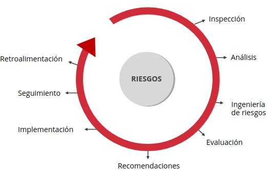
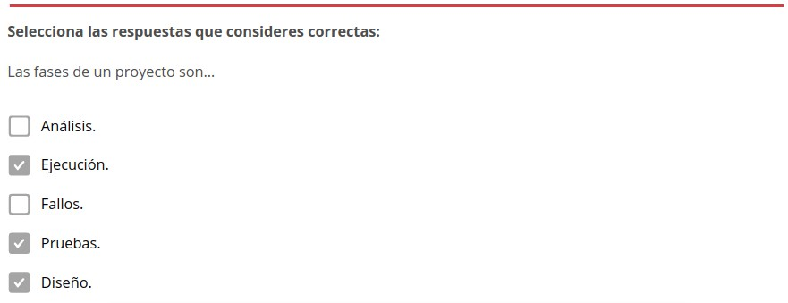
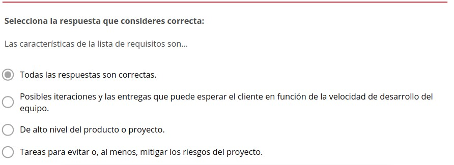
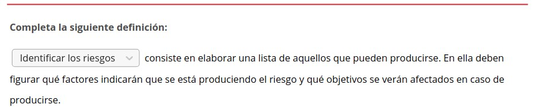

3.4. El triángulo de hierro. Alcance, coste y plazo
===================================================

1. Datos cuantitativos según The Standish Group
***********************************************

.. note:: Los **datos cuantitativos** son un conjunto de información numérica que se utiliza para medir o calcular diversas cuestiones necesarias Io largo de investigación. 

**"The Standing Group"** es una organización de referencia nivel mundial que se encarga de ofrecer asesoría sobre la gestión de proyectas de software. Nace en 1985 gracias a una visión innovadora de reflexión grupal que incorpora técnicas basadas en la discusión de casos reales.

A través del **análisis de estos datos numéricos** es posible explicar nuevas tendencias o comprender los resultados de una investigación. 

De nada sirve aplicar un instrumenta con exactitud y de forma adecuada si na se hace una correcta **interpretación de los resultados**. 

Se debe buscar un **instrumento de medición** válida y confiable, De este modo, las resultados de la investigación na se verán comprometidos por el tratamiento que se les ha dada. 

La aplicación de este tipo de instrumentos y el correspondiente análisis de los resultados **respaldan decisiones, propuestas, etc.**

2. Nuevas dimensiones en el Triángulo (calidad, valor e innovación)
*******************************************************************

En el año 1968 **se reunió el Comité Científico de la OTAN** (Organización del Tratado del Atlántico Norte) en la ciudad de Garmisch (Alemania) con la finalidad de analizar los problemas relacionadas can el desarrolla de software. En aquella época esta rama de la ingeniería informática tornaba cada vez más fuerza. Se hacía necesario **establecer prácticas, técnicas y grupos de trabajo** con de objetivo de definir y desarrollar esta disciplina.

**Ingeniería de software** fue el nombre que se le dio en esa oportunidad y es el que se mantiene hasta ahora. Lo mismo ocurre con la base de conocimientos que se cimentó en aquel momento. Gran parte de las conclusiones las que llegaron allí se mantienen vigentes hay día. 

La mayoría de las **prácticas y técnicas utilizadas** en la ingeniería de software fueron tomadas de otras áreas de la ingeniería y de otras ciencias aplicadas. 

Esta característica diferencia los profesionales de la Ingeniería de software del resto de profesionales que pertenecen otras áreas del conocimiento. Además, influye en la forma **como se planifica y se realizan estimaciones en un proyecto de software**. 

.. note:: El **Triángulo de hierro** es una herramienta que consiste en evaluar un proyecto utilizando tres ítems: coste, alcance y tiempo. Estos son los vértices del triangulo, las tres restricciones que afectan un proyecto. 

Esta herramienta fue **creada por el Dr. Martin Barnes en 1969** para el desarrollo de productas. Sigue un **enfoque en cascada**, es decir, la gestión del proyecto se realiza de forma secuencial y sistemática. 

.. figure:: ../../_static/3_metodologias_agiles/3.4_triangulo_hierro/triangulo.jpg
   :width: 30%
   :align: center

El **propósito del Triángulo de hierro** es mantener fijo el alcance del proyecto mientras se juega con las otras dos variables: coste y tiempo.

.. note:: El **modelo de cascada** es el más antiguo de los que se basan en el ciclo de vida de desarrollo de software, lo propuso Rayce, W. en 1970. Se define par una secuencia de etapas y finalizar cada una, es preciso reunir toda la documentación utilizada para garantizar que se cumple con los requerimientos y especificaciones. 

.. figure:: ../../_static/3_metodologias_agiles/3.4_triangulo_hierro/modelo_cascada.jpg
   :width: 40%
   :align: center

El Dr. Martin Barnes es una figura muy importante en la historia de la gestión de proyectos. Además de ser el creador del Triángulo de hierro, fue el presidente de la Asociación para la Gestión de Proyectos (Association for Project Management o APM), el organismo profesional para gerentes de proyectos en el Reino Unido, hasta finales de octubre de 2012. 

Los **componentes del Triángulo de hierro** son: 

- **Coste**: Se trata de la inversión en recurso humano y material. 
- **Alcance**: Está relacionado con las características y las funcionalidades del producto, con el trabajo que se debe realizar. 
- **Plazo**: Es la duración del proyecta, el tiempo requerido para su ejecución.

En el año 2004 **Jim Highsmith** propuso en su libro "Agile Project Management" aplicar el enfoque ágil al Triángulo de hierro. 

Los **vértices del Triángulo de hierro desde este nuevo enfoque** son: 

- **Valor**: Se trata de un producto que tenga valor para el cliente, que se pueda distribuir y genere ganancias. Restricciones 
- **Calidad**: Está relacionado con la confiabilidad y la adaptabilidad del producto. Restricciones 
- **Restricciones**: Son los ítems tradicionales (alcance, tiempo y coste). 

Jim Highsmith es uno de los 17 firmantes del Manifiesto Ágil, ganador del Jolt Award en el año 2000 y del Stevens Awars en el año 2005. 

3. Análisis de los fallos
*************************

Antes de abordar en qué consiste el análisis de fallos es necesario comprender que **todo proyecto se divide en una serie de fases**.

Las **fases de un proyecto** son:

- **Diseño**
- **Ejecución**
- **Pruebas**

Es en la **fase de ejecución** cuando se producen los fallos, por Io tanto, es que reduce efectividad  y la eficacia de sistema productivo.

Los **fallos son eventos** que se deben suprimir y para ello existen varias técnicas de análisis de fallos.

**Se produce un fallo** cuando se interrumpe la aptitud de un elemento y este deja de cumplir función que se requiere.

.. note:: Un **fallo** es el evento que motiva la transición de un elemento en estada de disponibilidad un estado de avería. Es el evento que marca la transición de un estada otra.

El **modo de fallar** es el proceso físico, químico o de otro tipo que conduce al fallo, Es un concepto fundamental dentro del análisis de fallas.

El **análisis causa-efecto** es aquel que se lleva cabo para determinar las causas que motivan el falla y las consecuencias que este desencadena (el efecto).

Para **realizar un buen análisis de fallos** es necesario invertir tiempo y recursos. Además de estar habituado a realizar este tipa de tareas, es decir, contar con suficiente experiencia.

Todo **análisis de riesgos** debe contener una lista de los riesgos identificados y sus posibles causas. Ya que estas pueden originar fallos en el proyecto. 

Entre los **factores que pueden propiciar fallos** se encuentran: 

- Mala administración de proveedores. 
- Mala definición del alcance. 
- Mala comunicación. 
- Planificación mediocre.
- Manejo inadecuado de las herramientas de administración de proyectos. 
- Falta de comunicación y coordinación para trabajar en equipo. 
- Ausencia de liderazgo. 
- Mecanismos de control inadecuados. 

4. Remedios
***********

Los **niveles de gestión de riesgos** son: 

- **Control de crisis**: Se solucionan los problemas. Es cuando los riesgos ya han causada estragos y se intenta controlar las daños causados.
- **Arreglar cada error**: Reaccionar con rapidez cada vez que se produzca un riesgo. 
- **Mitigación de riesgos**: Planificar una estrategia para controlar los riesgos una vez producidos, tomando en cuenta el  tiempo y los recursos que se necesitarían, sin buscar la forma de evitar que se produzcan. 
- **Prevención**: Incluir dentro del proyecto de software la creación de un plan para determinar riesgos y evitar que produzcan problemas.  
- **Eliminación de causas principales**: Se trata de la identificación de los factores  que pueden  generar riesgos y de buscar la forma de suprimirlos

5. Buenas prácticas
*******************

Las **prácticas correctas para la gestión de proyectos** son:

- Definir el alcance y los objetivos del proyecto. 
- Definir las tareas. 
- Planificar el proyecta. 
- Establecer un plan de comunicación. 
- Realizar un seguimiento y reportar el avance del proyecta. 
- Preparar la gestión del cambio. 
- Preparar la gestión del riesgo. 

Después de llevar cabo estas acciones se habrán identificada todas las posibles riesgos del proyecto. Posteriormente se deben evaluar las probabilidades de que ocurran y el impacto que podrían causar según las objetivos del proyecta. 

6. Integración
**************

Es importante comprender que el éxito de un proyecto depende de la **integración de las buenas prácticas**. 

Al gestionar un proyecto **es necesario**: 

- **Definir el alcance y los objetivos del proyecto**:
	Los **límites de un proyecto** se definen según su alcance a área de competencia. 

	La **cantidad de trabajo requerida** para llevar cabo un proyecta depende que lo que está dentro y lo que está fuera de los límites. 

	Una vez determinadas ambos elementos, alcance y objetivas, deben **entregarse a los interesados** para que sean revisados y aprobados. 

	Este es un **paso fundamental**, es el punto de partida de todo proyecto. 

- **Definir las tareas**: 
	Se trata de descomponer el proyecto en **productos tangibles**, qué se debe entregar al final del proyecta. 

- **Planificar el proyecto**: 
	El responsable del proyecto debe establecer el **recurso humano y material** que necesitará para llevar cabo el proyecto. 

- **Establecer un plan de comunicación**:
	Es importante que cada uno de los integrantes del equipo sepa qué se espera de él, **cuáles son funciones**. 

	Para ello es vital que haya una correcta **divulgación del plan del proyecto** y de los **canales de comunicación** que se utilizarán durante hechura del proyecto. 

- **Realizar un seguimiento y reportar el avance del proyecto**:
	A lo largo del proyecto es necesario revisar si este avanza tal como se había planificado. Para ello es necesario cantar can **reportes de avance** elaboradas por los miembros del equipo. 

	En caso de que sea necesaria realizar ajustes para **cumplir con la planificación**, se jugará siempre con las mismas variables: costes, cronograma de tareas y alcances. 

- **Administrar la gestión del cambio**: 
	Es necesario que los cambios que surjan lo largo del proyecto sean sometidos consideración detenidamente. Una **correcta administración de los cambios** determinará si un cambio debe rechazarse, incorporarse de inmediato a más adelante. 

	Es importante tomar en cuenta que las interesados suelen solicitar cambios continuamente a la largo del proyecto. 

- **Administrar la gestión del riesgo**: 
	Los **riesgos** son eventos que pueden afectar negativamente su proyecto. Por lo tanto, es esencial: 

	- Determinar las riesgos. 
	- Calcular la probabilidad de que ocurran. 
	- Calcular el impacto que pueden tener sobre el proyecta. 

	Un ejemplo para una escala de estimación de probabilidad sería:

	- 1 = no probable. 
	- 2 = posible. 
	- 3 = muy probable. 

	Un ejemplo para una escala de estimación de impacto sería:
	
	- 1 = bajo. 
	- 2 = medio. 
	- 3 = alto 

7. Scrum
********

.. note:: **Scrum** es una metodología ágil de desarrollo de software que posibilita la realización de proyectas dirigidas a satisfacer las necesidades de la empresa y de las clientes. Su objetivo es aumentar la eficiencia y disminuir los plazos de ejecución a través de equipos de alta productividad trabajando en entornos colaborativas.

En **Scrum** un proyecto se ejecuta a través de bloques temporales denominados iteraciones-sprints, que tienen una duración de aproximadamente un mes natural.

Una **iteración** se caracteriza por entregar un resultado completo, un incremento del producto que puede ser entregado haciendo uso del mínimo esfuerzo. 

Cada **sprint** está delimitado por una reunión de planificación del sprint y por una reunión retrospectiva.

7.1. Plan de proyecto
+++++++++++++++++++++

El **plan de proyecto** se compone de una lista priorizada de requisitos del producto. Partiendo de esa lista, **el cliente podrá elegir y priorizar** las requisitos del producto de acuerda al coste, al valor y según la división en iteraciones. 

En Scrum se **trabaja en equipo**, de forma colaborativa, buscando la mayor productividad.

7.2. Metodología Scrum
++++++++++++++++++++++

La **metodología Scrum** se caracteriza por la capacidad de hacer entregas parciales y regulares del producto final priorizándolas según el beneficia que le aporte al cliente. Ha sido creada para trabajar en proyectos baja entornos complejos buscando resultados rápidos. 

Los **entornos** donde se emplea esta metodología son cambiantes y definidos. En ellas son necesarios la competitividad, la innovación, la productividad y la flexibilidad. 

La metodología Scrum es muy útil para resolver variedad de **contingencias**: 

- Especialización en el desarrolla del procesa. 
- Ineficiencias del sistema.
- Entregas que se alargan demasiado. 
- Calidad no aceptable. 
- Costes que se disparan.
- Desmotivación del equipo. 
- Capacidad de reacción ante la competencia. 

7.3. Prácticas más usuales
++++++++++++++++++++++++++

Las **prácticas más usuales** bajo la metodología Scrum son: 

- **Presencia del cliente**: Se incluye los clientes como parte del equipo de desarrollo. 
- **Entregas constantes**: El cliente recibe cada funcionalidad, la evalúa e indica cualquier cambio en los requisitos del proyecto que desee introducir. 
- **Planes de riesgo y mitigación**: El equipo desarrolla planes de riesgos y mitigación periódicamente. De ese modo, revisión de riesgos y gestión de riesgos se tienen en cuenta en todas las etapas del proyecto. 
- **Transparencia en la planificación**: Todos tienen acceso la planificación del proyecto. Esta permite que cada integrante conozca las tareas de sus compañeros y cuándo deben ejecutarse. 
- **Reuniones frecuentes**: El equipo realiza reuniones frecuentemente con la finalidad de monitorear el proyecto. 
- **Riesgos**: Se crean mecanismos que advierten la presencia de riesgos con la finalidad de solventarlos cuando antes. Toda el equipo es responsable de los riesgos, así que los integrantes no deben centrarse en los culpables sino en las soluciones.

7.4. Valor de equipo y Scrum Master
+++++++++++++++++++++++++++++++++++

Según la metodología Scrum, las **personas son el factor clave para el desarrollo del producto**. Por lo tanto, es vital valorar a nuestro equipo y que las personas se sientan valoradas. 

En líneas generales, el **equipo Scrum está compuesto por** los siguientes integrantes: 

- Product owner (dueño del producto) 
- Development Team (equipo de desarrollo) 
- Scrum Master (maestro Scrum) 

7.5. Características del equipo Scrum
+++++++++++++++++++++++++++++++++++++

El **equipo Scrum se caracteriza** por: 

- **Autogestión**: Los integrantes del equipo deciden cuál será su ritmo de trabajo. No son dirigidos por personas externas, ellos programan la mejor manera de llevar cabo su trabaja. 
- **Multifunción**: Los integrantes del equipo deben encargarse de todo lo necesario para ejecutar el proyecto y deben tener las competencias necesarias para ella, sin depender de personas externas al grupo de trabaja. 
- **Optimización**: Se trabaja buscando siempre la optimización de la productividad y de la creatividad. 
- **Flexibilidad**: Se trabaja de forma flexible, organizando las tareas en función de las necesidades del proyecto y tomando en cuenta los conocimientos y la experiencia de cada uno de los miembros del equipo. 
- **Trabaja iterativo**: Tal como la demanda la metodología Scrum, se trabaja de forma incremental, con base en iteraciones. De este modo, se obtiene un feedback constante por parte del cliente que incidirá positivamente en el desarrollo del proyecto. 
- **Versiones**: Bajo la metodología Scrum se hacen entregas frecuentes, lo que significa que es posible comprobar las funciones del producto tras cada versión. Esta asegura un avance sólida y seguro hacia el producto que necesita el cliente. Además, al trabajar por fases es posible ver y verificar el trabajo hecha, lo que mantiene motivado al equipo. 

7.6. Características del Product Owner
++++++++++++++++++++++++++++++++++++++

.. note:: El **Product Owner** es aquella persona cuya principal función es gestionar la lista del producto. En este sentido, se encarga de aumentar el valor del producto y del trabaja del equipa de desarrollo. 

La forma en que el Product Owner logrará este cometido **dependerá de la organización** en la que se encuentre. 

Gestionar la lista del producto consiste en realizar las siguientes **funciones**: 

- Expresar claramente qué hace referencia cada uro de los ítems que conforma la lista del producto, 
- Ordenar los ítems de la lista del producto de forma tal que contribuya alcanzar los objetivos propuestos de la forma más óptima. 
- Optimizar el valor del trabaja desarrollado por el equipo. 
- Asegurarse de que la lista del producto sea accesible para todas los integrantes del equipo. Debe ser fácil acceder a ella. 
- Asegurarse de que todas los integrantes del equipa entienden los ítems de la lista del producto, por la menos al nivel necesario para cada una. 

Solo puede haber una persona, **un individuo**, ocupando este rol. Todas las responsabilidades asociadas este cargo recaerán sobre una sola persona.

Se espera que el **equipo de desarrollo respete las decisiones del Product Owner**. De esta forma, este podrá alcanzar sus objetivas. 

La **gestión del Product Owner** se verá reflejada en la priorización de las elementos de la lista del producto. 

7.7. Development Team (equipo de desarrollo)
++++++++++++++++++++++++++++++++++++++++++++

.. note:: El **Development Team (o equipo de desarrollo)** es aquella persona cuya principal función es terminar tiempo cada una de las iteraciones del producto terminado, Así al finalizar cada sprint se podrá revisar la funcionalidad del producto a completo. 

El equipo de desarrollo estructura sus actividades y se organiza de forma autónoma, aumentando su **efectividad y eficiencia**. 

Las **características del equipo de desarrollo** son: 

- **Autoorganización**: el equipo se encarga de acordar cómo convertir los ítems de la lista del producto en iteraciones con las funcionalidades requeridas. 
- **Multifunción**: el equipo debe cantar can los conocimientos y las habilidades para desarrollar el proyecta y crear el producto que se ha demandada. 
- **No hay títulos**: no importa qué funciones desempeñe cada uno de los integrantes del equipo, todos son desarrolladores. 
- **No existen subequipos**: no es posible crear subgrupos. 
- **Responsabilidad compartida**: es normal que cada uno de las integrantes del equipo tenga un área de especialización, pero la responsabilidad del trabajo es de todas y se comparten los aciertos y los errores. 

7.8. Tamaño adecuado para el equipo de desarrollo
+++++++++++++++++++++++++++++++++++++++++++++++++

El **tamaño óptimo para un equipo de desarrollo** es aquel que reúne una cantidad de personas que permite ser ágil desarrollando el trabajo, pero la vez permite completar una cantidad significativa de tareas.

- **Menos de tres personas**: la multifuncionabilidad y interacción necesaria dentro del grupa se vería comprometida. Por la tanto, alcanzar el objetivo principal de una iteración, la puesta en marcha del producto, la posibilidad de utilizarlo, no se alcanzaría. 
- **Más de nueve personas**: exigiría mucha coordinación y gran capacidad de gestión, Las equipos grandes son mucho más complejos.

El **tamaño ideal** es un equipo de tres nueve personas, El tamaño exacto lo decidirán las necesidades de producto y las características individuales de cada una de sus miembros. 

7.9. Características del Scrum Master
+++++++++++++++++++++++++++++++++++++

.. note:: El **Scrum Master** es aquella persona cuya principal función es que toda el equipa comprenda y aplique la metodología Scrum. Parte de su trabajo es cerciorarse que las reglas y las prácticas propias de esta metodología están siendo adaptadas por cada uno de los integrantes del equipo. 

El Scrum Master es **un guía y un líder** que trabaja a favor del equipo Scrum. 

Parte de su trabajo es que las **personas externas al equipo de trabajo** comprendan cómo funciona el equipo Scrum y qué tipo de interacciones pueden tener con él. 

Además, debe estimar si en un momento puntual se necesita **ayuda** y buscarla. 

El Scrum Master es se encarga de **potenciar el valor** creado por el equipo Scrum.

Las funciones que realiza el Scrum Master en relación a: 

- **Product Owner**:
	- Presentar las técnicas más adecuadas para gestionar la lista de producto de forma eficiente y efectiva. 
	- Explicar al equipo Scrum de forma clara y concisa la importancia de ir concretando los ítems que integran la lista de producto. 
	- Propiciar un entorno práctico y empírico para el desarrollo del proyecto. 
	- Cerciorarse de que es Product Owner tiene las capacidades necesarias para priorizar los ítems de la lista de producto. 
	- Promover la practicidad y la agilidad en todo momento. 
	- Facilitar las iteraciones del Scrum según se necesiten o se requieran. 

- **Equipo de desarrollo**:
	- Orientar al equipo de desarrollo para que se autogestione de forma adecuada y multifuncional. 
	- Ayudar al equipo de desarrollo en la creación de productos de alto valor. 
	- Eliminar los inconvenientes que obstaculicen la labor del equipo de desarrollo. 
	- Ayudar a los miembros del equipo que requieran información y orientación sobre de la metodología Scrum. 

- **Organización**: 
	- Planificar las distintas implementaciones de la metodología Scrum en la organización. -Ayudar a los empleados que deseen comprender y poner en práctica la metodología Scrum, así como el desarrollo empírico del producto. 
	- Potenciar la aparición de cambios en la productividad del equipo Scrum. 
	- Intercambiar información con otros Scrum Masters para incrementar la efectividad de la aplicación Scrum dentro y afuera de la organización. 

El **Scrum Master es el líder de la organización** por lo que debe ejercer labores de orientación y verificar la implementación del Scrum. 

7.10. Estimaciones en Scrum
+++++++++++++++++++++++++++

Las **fases de la metodología Scrum** son las siguientes: 

- **Preparación del proyecto** 
- **Planificación de un sprint** 
- **Desarrollo de un sprint**
- **Cierre** 

7.10.1. Preparación del proyecto
--------------------------------

La preparación del proyecto se conoce también como **fase inicial o sprint O**. 

El **objetivo** de esta fase es comprender el caso de negocio con la finalidad de tomar decisiones que sumen valor al producto. 

Durante la preparación del proyecto las **estimaciones suelen estar plagadas de inexactitudes**. Se aconseja no invertir tiempo en hacer estimaciones exactas, sino en desarrollar el producto. Las estimaciones deben hacerse más adelante, con un nivel más alto de desarrollo del proyecto. 

Las **actividades que deben realizarse durante la fase inicial** son definiendo: 

- **El proyecto**: Señalar el objetivo del proyecto. Todos los integrantes de equipo deben ser capaces de explicar cuáles son las características principales del producto. 
- **El "terminado"**: Es necesario indicar cuáles son las condiciones para un producto se considere "terminado". 
- **El backlog inicial**: Se trata del documento que contendrá los requisitos del sistema por prioridades. Partiendo de allí será más sencillo planificar cada iteración, pues cada una de las funcionalidades se podrá implementar de la manera más óptima posible. 
- **Los entregables**: Se trata de establecer los criterios de cada una de las entregas. Es una fase muy importante porque cada entrega que debe aportar valor al producto y debe finalizar con un feedback temprano por parte del cliente. 

Durante el desarrollo del proyecto el **plan de entregables** puede variar. 

Algunas de las **razones por las que el plan de entregables puede sufrir variaciones**: 

- Aparición de nuevas funcionalidades que propician un valor mayor en el producto. 
- Cambio del entorno y nuevas oportunidades de negocio. 
- Replanteamiento del entregable. 

Durante la fase inicial también se debe **constituir el equipo**, actividad que depende directamente de las dimensiones del proyecto y las características de los integrantes. 

Además, es el momento de decidir cuál será el horario de las **reuniones de control**. 

En la **primera reunión de planificación** se determinará la velocidad inicial de trabajo y el factor de dedicación. Con base en esos dos aspectos más el número de historias se calcularán las **estimaciones**. 

Existen **dos métodos para definir qué historias se incluirán**: 

- De forma aproximada, en los **sprints cortos**. 
- Mediante **cálculos de velocidad**, seleccionando la velocidad estimada y el número de historias que se pueden añadir. 

7.10.2. Planificación de un sprint
----------------------------------

.. note:: El **Sprint Planning Meeting** es una reunión a la que debe asistir todo el equipo Scrum y partiendo del backlog se elegirán las funcionalidades sobre las que se va a trabajar y cuáles darán valor al producto.

.. figure:: ../../_static/3_metodologias_agiles/3.4_triangulo_hierro/sprint_planning.jpg
   :width: 60%
   :align: center

Un Sprint Planning Meeting **se puede dividir en dos partes**: 

- **Primera parte - entregables**: Se seleccionan las funcionalidades que constituirán cada entrega. El equipo puede hacer sugerencias, pero será el Product Owner quien tome las decisiones. Luego el equipo decidirá qué elemento de los elegidos por el Product Ownerva a implementar para el primer sprint. 
- **Segunda parte - preguntas**: El equipo puede hacerle al Product Owner las preguntas que considere necesarias acerca del product backlog (o lista de requisitos). El equipo debe encontrar la solución adecuada para transformar la parte seleccionada de una funcionalidad entregable. 

7.10.3. Desarrollo del sprint e inspección
------------------------------------------

Cada **sprint consiste** en concluir una parte del producto e incrementar su funcionabilidad. Esto implica que tras cada sprint el equipo se acerca al producto final. 

Durante cada Sprint se programarán **tres reuniones básicas**: de planificación, diaria y de revisión del sprint. 

.. note:: La **reunión de planificación** es aquella donde se definen las tareas que se deben realizar y el objetivo que se persigue con cada una de ellas. 

**Para desarrollar las tareas definidas** el equipo de tomar en cuenta:

- Consultas de agenda fuera del sprint. 
- Autogestión del equipo. 
- Replanificación de un sprint debido a si inviabilidad. 
- Estimaciones inexactas. 

Si existe el compromiso de **realizar todo el backlog**, pero debido a una estimación inexacta, esto **no es posible**. El equipo deberá preguntar al Product Owner cuáles funcionalidades son prescindibles. 

Si, por el contrario, gracias a una estimación inexacta **sobra tiempo para añadir más funcionalidades**, el equipo deberá consultar con el Product Owner antes de proceder a incrementar el valor del entregable. 

.. note:: La **reunión diaria** es aquella donde los integrantes del equipo compartirán información acerca del desarrollo del producto. 

Ese es el momento de pensar y sugerir las **adaptaciones** necesarias para aumentar la productividad del equipo. Las **preguntas más dinámicas para las reuniones diarias** son: 

- ¿Qué se ha hecho de nuevo con respecto a la última reunión diaria? 
- ¿Qué será lo siguiente a realizar? 
- ¿Qué problemas hay para realizarlos? 

Una herramienta de ayuda durante las reuniones diarias son las **listas de tareas del sprint**, que deberán estar actualizadas señalando el esfuerzo pendiente y realizado en cada una de las tareas. 

.. note:: La **reunión de revisión del sprint** es aquella donde el equipo hace la entrega, presentando el producto que han implementado. 

Tras la reunión los gestores, clientes, usuarios, partes interesadas y el Product Owner **analizan la entrega**. 

También es el momento en que el equipo expone los **problemas** que han surgido durante el proceso. 

Tiene una **duración** máxima de cuatro horas y debe presentarse un producto con una funcionalidad terminada. Si esta no está completa, no es posible llevar a cabo la reunión. 

En la **reunión de revisión del sprint** se distinguen las siguientes etapas: 

1. Presentación. 
2. Comentar la presentación
3. Criticar los incrementos de funcionalidad
4. Identificar las funcionalidades que se puedan añadir

.. note:: La **reunión retrospectiva** es aquella que tiene como objetivo mejorar los siguientes sprints y aumentar la productividad. Por lo que el equipo hace una revisión del sprint finalizado recientemente, compartiendo puntos de vista y sugerencias. 

A esta reunión **debe asistir el equipo Scrum**: el Scrum Master, el Product Owner y el equipo de desarrollo. 

Es importante que **priorizar las sugerencias** producto de esta reunión. De este modo el Scrum Master podrá estimar y buscar la ayuda necesaria para poner en marcha las mejoras que ha propuesto el equipo. 

Las **preguntas para dinamizar esta reunión** son: 

-¿Qué ha ido bien durante el último sprint? 
-¿Qué será mejorado para el siguiente sprint? 
-¿Cuáles han sido los obstáculos a salvar? 

7.10.4. Cierre
--------------

En el cierre **se presentará el producto reuniendo todos los sprints**. Por lo que se debe comprobar cada una de sus funcionalidades. 

Además, se debe **crear una versión** distribuible y una **campaña de marketing**. 

En esta reunión es cuando se observa si se han cumplido las **expectativas** del cliente y del Product Owner y es donde se evalúa el desempeño de los desarrolladores. 

.. note:: La **lista de requisitos** es aquella que reúne las condiciones priorizadas que representan las expectativas del cliente respecto a los objetivos y entregas del producto. 

La **lista de requisitos** es la forma más directa que tiene el cliente para involucrarse en la dirección de los resultados del producto o proyecto. 

Las **características de la lista de requisitos** son: 

- Incluye los **requisitos de alto nivel** del producto o proyecto. A lado de cada requisito debe aparecer el **valor** que este aporta al cliente y su coste estimado. La **prioridad** se establece tomando en cuenta el valor de cada requisito frente al coste estimado. 
- Contiene las posibles **iteraciones y las entregas** que puede esperar el cliente en función de la velocidad de desarrollo del equipo. 
- Incluye los requisitos o tareas para evitar o, al menos, mitigar los **riesgos del proyecto**. 

La lista de requisitos **se irá modificando** a medida que se vaya desarrollando el producto o proyecto. Ya que irán surgiendo los requisitos menos importantes, pero igualmente necesarios. 

.. note:: La **lista de tareas** es aquella que elabora el equipo como plan para completar los requisitos seleccionados para la iteración. 

A través de esta lista el **equipo se compromete** a cumplir con los requisitos demandados en cada iteración. De este modo, con cada entrega del producto se sumará valor al mismo.

Mediante la lista de tareas de la iteración se hará notorio cuáles son aquellos **ítems donde el equipo está teniendo problemas** y no logra avanzar. Esto le permitirá tomar medidas al respecto, ya que estos puntos se harán visibles a medida que se desarrolle el proyecto. 

Además, **esta lista contiene**: el esfuerzo necesario para completar cada tarea, las actividades necesarias para finalizarlas, la distribución del trabajo que han hecho los miembros del equipo, etc. 

.. note:: La **gráfica "burndown" o de trabajo pendiente** es una de las herramientas de la metodología Scrum. Consiste en realizar una representación de las tareas pendientes respecto de las horas disponibles para llevar a cabo el trabajo. 

Esta gráfica **presenta la velocidad a la que se está ejecutando el trabajo** y se van completando los requisitos, permitiendo determinar si es posible o no que el equipo logre finalizar el proyecto cumpliendo con las estimaciones efectuadas en un primer momento. 

La gráfica burndown muestra la **evolución del trabajo en equipo** y para ello **debe contener**: cuánto trabajo ha sido hecho, cuánto trabajo queda por hacer, la velocidad de ejecución y la fecha probable de finalización que se había planteado al comienzo del proyecto. 

"Burndown" significa "prenderse fuego", "incendiarse". De allí el nombre de la gráfica burndown, con ello se quiere expresar la idea de cuenta atrás. Por un lado, la cantidad de tiempo con la que se cuenta para finalizar un trabajo, el límite que existe antes de que se consuma el tiempo fijado. Y, por otro lado, la sensación de presión que incrementa a media que se agota el tiempo. 

El siguiente gráfico representa un proyecto Scrum con una duración de **3 sprints**, cada uno conformado por 5 días. 

Para el **primer sprint** se estimó un alcance de 200 PBls, (PBls: ítems del product backlog) medidos en número de ítems. 

**Después de cinco días** se comprueba que el progreso actual de desarrollo es de 147 Pals, representados por la línea roja, en contraste con la estimación inicial que fue de 1 33 Pals, representados por la línea azul. 

En este caso, la **conclusión** es que se ha avanzado más de los que se había estimado.

.. figure:: ../../_static/3_metodologias_agiles/3.4_triangulo_hierro/grafica_burndown.jpg
   :width: 70%
   :align: center

7.11. Técnicas de priorización
++++++++++++++++++++++++++++++

.. note:: El **diagrama de Gantt** es una de las técnicas de programación de tiempos más popular. Se trata de un método simple, intuitivo y fácil de interpretar, aunque presenta un conjunto de limitaciones que condicionan su uso. 

Las **limitaciones del diagrama de Gantt** son: 

- **No incorpora la relación entre actividades**: presenta una imagen fija del proyecto. El diagrama se construye con base en una planificación y posteriormente no es posible introducir cambios en él. Usualmente hay que efectuar cambios en la planificación y, al no poder expresarlos en el gráfico, es necesario volver a elaborarlo. 
- **No es apropiado para representar muchas actividades**: no es la herramienta más apropiada para representar un conjunto muy grande de actividades. 
- **Sólo considera tiempos**: el diagrama de Gantt básico no contempla el uso o consumo de recursos, sólo considera tiempos. 

En conclusión, el diagrama de Gantt no es aplicable a proyectos complejos y largos. 

Lo que **se recomienda** es reemplazar el diagrama básico, que consta de un modelo estático, como el diagrama de barras, por un modelo dinámico, como un diagrama en red o reticular del proyecto, en el que se correlacionan las actividades con sus predecesoras y sucesoras. 

Un **modelo dinámico** provee flexibilidad y maleabilidad. Permite incorporar los cambios que surgen durante el desarrollo del proyecto, servir de apoyo para la realización del seguimiento y de simulaciones de acciones de control. 

Además, es posible **implantarlo en un sistema informático**. 

La **reacción de las personas ante el modelo dinámico** suele ser contradictoria. Por un lado, el **proyectista experimentado** queda sorprendido ante la simpleza de uso. 

Por otro lado, **quien no está familiarizado con este tipo de herramienta** se desilusiona al caer en cuenta de la gran cantidad de información que es necesario recopilar y procesar, la precisión que deben poseer estos datos y la necesidad de contar con experiencia o información acerca de proyectos similares para realizar las estimaciones necesarias. 

Lo más importante a tomar en cuenta es que la **planificación de un proyecto requiere** algo más que un programa informático basado en algoritmos tipo PERT/CPM. Es necesaria la labor de un director de proyecto que sepa cómo darle un buen uso a estos programas y extraiga todo el potencial que ofrecen estas herramientas. 

7.12. El riesgo
+++++++++++++++

.. note:: Un **riesgo** es todo evento que, si ocurre, puede influir sobre los objetivos del proyecto. 

Según el resultado que genere esta influencia, los **riesgos se pueden clasificar en**: 

- **Positivos**: Son aquellos riesgos cuya influencia sobre los objetivos del proyecto generan una oportunidad. La respuesta más adecuada es crear los factores necesarios para que efectivamente el riesgo se produzca. 
- **Negativos**: Son aquellos cuya influencia sobre los objetivos del proyecto es negativa, dificultan el alcance de las metas. Existen muchas formas de enfrentar este tipo de riesgo, pero, evidentemente, lo ideal es que no se produzcan. 

Los **riesgos negativos suelen**: 

- Comprometer la calidad del producto final. 
- Aumentar el coste del proyecto. 
- Aumentar los recursos destinados al proyecto. 
- Retrasar las fechas de entrega previstas. 

En líneas generales se puede afirmar que un riesgo negativo acarrea una **incertidumbre** para el desarrollo del proyecto.

Una buena **gestión de riesgos para afrontar los riesgos negativos** crea un conjunto de acciones con la finalidad de reducir el impacto de este tipo de riesgos o de evitar que se produzcan. 

Es vital **integrar una correcta gestión de riesgos** a todo proyecto, para ello es necesario determinar un método que facilite el proceso. 

Las fases para llevar a cabo la gestión de riesgos son: 

1. Identificar los riesgos. 
2. Analizar los riesgos. 
3. Planificar la respuesta. 
4. Supervisar los riesgos. 

7.12.1. Identificar los riesgos
-------------------------------

.. note:: **Identificar los riesgos** consiste en elaborar una lista de aquellos que pueden producirse. En ella deben figurar qué factores indicarán que se está produciendo el riesgo y qué objetivos se verán afectados en caso de producirse. 

Este procedimiento facilita la puesta en marcha del **plan de respuesta a los riesgos** formulado para disminuir el efecto negativo de estos en caso de producirse. 

7.12.2. Analizar los riesgos
----------------------------

.. note:: **Analizar los riesgos** consiste en estudiar qué efectos generarán estos sobre el proyecto en caso de producirse. 

Existen dos tipos de análisis de riesgos: 

- **Cualitativo**: 
	Consiste en examinar el riesgo tomando en cuenta tres parámetros: probabilidad, impacto y frecuencia. 

	Los **parámetros del análisis cualitativo** son: 

	- **Probabilidad**: mide si es factible que ese riesgo ocurra o no. 
	- **Impacto**: mide el efecto que tendrá ese riesgo sobre los objetivos del proyecto. 
	- **Frecuencia**: mide si es posible que ese riesgo ocurra más de una vez a lo largo del proyecto y cuántas veces puede darse. 

- **Cuantitativo**: 
	Este tipo de análisis se lleva a cabo luego de realizar un análisis cualitativo. Su objetivo es obtener una estimación más precisa respecto a la probabilidad y el impacto de un riesgo. Para ello se suele utilizar una herramienta informática que permita realizar un análisis estadístico de los datos recopilados. 

	Los **datos con los que trabaja el programa informático** pueden extraerse de entrevistas, de los documentos del proyecto, de proyectos similares ejecutados con anterioridad, etc. 

7.12.3. Planificar la respuesta a los riesgos
---------------------------------------------

.. note:: **Planificar la respuesta a los riesgos** consiste en la elaboración un plan que definan una serie de acciones a emprender en caso de que se produzcan los riesgos que previamente se han identificado y analizado. 

Algunas de las **estrategias que pueden integrar el plan de respuesta a los riesgos** son: 

- **Evitar**: Consiste en suprimir las causas que puede provocar un riesgo con la finalidad de que este no se produzca. 
- **Reducir**: Cuando se opta por esta alternativa significa que los costes de la reducción son menores que los generados si el riesgo llega a producirse. Consiste en identificar las causas que generan el riesgo y reducirlas a un número razonable. 
- **Transferir**: Consiste en traspasar la responsabilidad del riesgo y las consecuencias a una tercera parte. 
- **Aceptar**: Consiste en no tomar ninguna medida contra el riesgo. La aceptación es **pasiva** si no se pone en marcha ninguna acción. La aceptación es **activa** si se pone en marcha alguna para contener los efectos de los riesgos en caso de que ocurran. En el plan de respuesta a los riesgos también se debe señalar un **responsable** para cada riesgo, una persona que se encargue de desarrollar la estrategia. 

Es fundamental tener en cuenta que al implementar una respuesta ante un riesgo pueden surgir otros riesgos, por ejemplo: 

- **Riesgos secundarios**: Son aquellos que se generan producto de la estrategia de respuesta que se ha llevado a cabo. Deben ser tratados del mismo modo que los primeros riesgos detectados. 
- **Riesgos residuales**: Son aquellos que permanecen después de aplicar la estrategia de respuesta al riesgo. 

7.12.4. Supervisar los riesgos
------------------------------

.. note:: **Supervisar los riesgos** consiste en hacer un seguimiento de los riesgos señalados en el plan de respuesta, realizar una revisión de ellos según la prioridad establecida, constatar cuáles se han producido y cómo han sido tratados. 

Es primordial contactar con el **responsable del riesgo** y comprobar si ha implementado la estrategia definida en el plan de riesgos. 

Es necesario llevar un **control de los riesgos** identificados previamente y de aquellos que aparezcan a lo largo del proyecto. 

La **supervisión de riesgos se puede llevar a cabo**: 

- **Durante las revisiones del proyecto**: es un momento ideal para dedicar un tiempo al control de los riesgos, dado que suelen estar presentas todos los implicados e interesados. 
- **Auditorías de respuesta al riesgo**: puede contratarse una empresa externa para esta labor. 
- **Análisis del trabajo realizado o del rendimiento técnico**: son procedimientos internos realizados con la finalidad de controlar los riesgos. 

7.13. Retrospectivas de los proyectos
+++++++++++++++++++++++++++++++++++++

.. note:: Una **retrospectiva** es el procedimiento que se emplea para la solución de problemas de un proyecto o para detectar qué aspectos están funcionando bien y cuáles no. Consiste en definir un objetivo e ir analizando paso a paso la hechura del proyecto o sprint mientras se intenta dar respuesta a la cuestión central. 

El **material necesario para la realización de retrospectivas** es: Tarjetas tamaño A6, rotuladores o marcadores de colores, cinta adhesiva, Post-its y pizarra blanca grande o papel de gran tamaño. 

La **información necesaria para la realización de retrospectivas** es: 

- Datos objetivos de los problemas del proyecto. 
- Product backlog: lista de requisitos priorizada. 
- Sprint backlog: lista de tareas de la iteración.
- Burndown charts: gráficos de progreso del proyecto o de la iteración. 
- Métricas del proyecto. 

7.14. Mejoras
+++++++++++++

Los **beneficios que aporta la metodología Scrum** son: 

- Gestión regular de las expectativas del cliente. 
- Resultados anticipados.
- Flexibilidad y adaptación. 
- Retorno de inversión. 
- Mitigación de riesgos. 
- Productividad y calidad. 
- Alineamiento entre cliente y equipo. 
- Equipo motivado. 

7.14.1. Gestión regular de las expectativas del cliente
-------------------------------------------------------

En primer lugar, el **cliente establece sus expectativas** señalando los requisitos que desea en correspondencia con el valor que aporta cada uno de ellos. 

Tras cada iteración el cliente puede comprobar cómo se va desarrollando el producto o proyecto y dar un feedback al respecto. Así **observa cómo se van cumpliendo sus expectativas** y tomar decisiones clave basándose en resultados reales. 

Otro modo en que se produce la **gestión regular de las expectativas del cliente es mediante la lista de requisitos priorizada**, ya que este crea y gestiona la lista del producto o proyecto tanto a nivel de requisitos como de valor, coste y entregas. 

Como tras cada iteración hay una comprobación de resultados, esto permite que el cliente vea si los requisitos se complementan o no. Lo que posibilita la **introducción de cambios y la evaluación del trabajo realizado** en cada etapa. 

7.14.2. Resultados anticipados
------------------------------

Dado que el cliente puede priorizar los requisitos de acuerdo al valor y a coste, este puede **definir las características que le van a permitir hacer uso del producto**. 

De esta forma, la metodología Scrum posibilita la **entrega temprana de un producto** con un conjunto de funcionalidades fundamentales. Con ello el cliente puede comenzar a usar el producto y salir al mercado desde las primeras etapas de desarrollo del proyecto. 

Es una forma de **adelantarse a la competencia** y hacer frente a nuevos pedidos y a urgencias. 

7.14.3. Retorno de inversión
----------------------------

Para explicar este punto es necesario partir de **dos premisas fundamentales**: 

- El cliente gestiona la lista de requisitos del producto o proyecto teniendo en cuenta el valor, el coste y las entregas. 
- Se hacen entregas frecuentes donde es posible comprobar el estado el proyecto. 

Tomando en cuenta estas premisas, es lógico pensar que el cliente solo continúa con el proyecto porque tiene **garantizado el éxito** del mismo y considera que el beneficio que obtendrá será mayor que el coste de desarrollo. 

7.14.4. Mitigación de riesgos
-----------------------------

**Pensar en los riesgos** desde el comienzo del proyecto en un paso fundamental para el buen desarrollo del proyecto. Esto **permite** proponer soluciones con antelación y evitar errores técnicos y la consiguiente pérdida de tiempo y esfuerzo que requiere el solventarlos. 

La metodología Scrum no solo apuesta por el equipo de trabajo a la hora de **gestionar los problemas** que surjan desde el primer momento, además, lo hace también por el **feedback temprano**, que permite reconducir el proyecto en cualquier punto a lo largo de la vida de proyecto. 

Una buena **gestión de los riesgos y de la complejidad del proyecto** implica definir las diferentes iteraciones y con ello dividir el esfuerzo requerido para lidiar con los riesgos y con la carga de trabajo. Es la forma más sencilla de evitar la desmotivación y la sobrecarga de trabajo. 

Las **tareas más complejas o complicadas** deben abordarse al comienzo de cada iteración. Se deberán dejar cerrados los aspectos más difíciles conforme vayan apareciendo. 

7.14.5. Productividad y calidad
-------------------------------

El **equipo de trabajo va optimizando su dinámica de trabajo**. Los integrantes del grupo sincronizan su trabajo y van conociendo el progreso que hacen los demás en sus tareas. Cada día resuelven los problemas que surgen con a finalidad de alcanzar el objetivo de cada iteración. 

La **comunicación y la adaptación** son básicas para lograr esto. De este modo, no se realizarán tareas innecesarias y trabajará de modo más eficiente. 

El **equipo de desarrollo** estimará el esfuerzo y el modo de optimizar las tareas para completar el requisito establecido en cada iteración. 

La precisión de las estimaciones incrementa con las **iteraciones cortas**. 

Este **método de trabajo** asegura la calidad del producto, ya que de manera objetiva y sistemática se expresará el nivel de satisfacción del cliente. 

7.14.6. Alineamiento entre cliente y equipo
-------------------------------------------

Para contar con las **aportaciones de todo el equipo** es muy importante que todos los miembros del equipo conozcan cuál es el objetivo que se ha de conseguir. 

El **esfuerzo y los resultados** del proyecto se medirán mediante objetivos cumplidos y requisitos entregados. En cada iteración **el cliente y el equipo deberán trabajar juntos** en crear los requisitos del proyecto, determinar las especificaciones de cada iteración y examinar el resultado obtenido. 

7.14.7. Equipo motivado
-----------------------

La **creatividad** surge en entornos motivados. Suficiente motivación y creatividad para la organización del trabajo pueden ser la combinación necesaria para alcanzar el éxito del proyecto. 

Un buen modo de **unir al equipo de trabajo** es utilizar la motivación de las personas cuando estas están conscientes de cuáles son sus logros. 

La metodología Scrum se basa en la autogestión de los equipos de trabajo. Esto se debe a que solo el **equipo sabe cómo desarrollar determinados requisitos**, por lo tanto, solo él puede establecer el compromiso de una entrega. 

En base a los requisitos del cliente, el **equipo diseña su propia planificación**.

8. Resumen
**********

- Los **datos cuantitativos** son un conjunto de información numérica que se utiliza para medir o calcular diversas cuestiones necesarias a lo largo de la investigación. 
- Un **fallo** es el evento que motiva la transición de un elemento en estado de disponibilidad a un estado de avería. 
- Un **riesgo** es todo evento que, si ocurre, puede influir sobre los objetivos del proyecto.
- El **Triángulo de hierro** es una herramienta que consiste en evaluar un proyecto utilizando tres ítems: coste, alcance y tiempo. Estos son los vértices del triángulo, las tres restricciones que afectan un proyecto. 
- **Scrum** es una metodología ágil de desarrollo de software que posibilita la realización de proyectos dirigidos a satisfacer las necesidades de la empresa y de los clientes. 
- Las **prácticas correctas para la gestión de proyectos** son: definir el alcance y los objetivos del proyecto, definir las tareas, planificar el proyecto, establecer un plan de comunicación, realizar un seguimiento y reportar el avance del proyecto, preparar la gestión del cambio y preparar la gestión del riesgo. 

9. Actividades
**************

.. figure:: ../../_static/3_metodologias_agiles/3.4_triangulo_hierro/actividades/actividad_1_1.jpg
   :width: 70%
   :align: center

.. figure:: ../../_static/3_metodologias_agiles/3.4_triangulo_hierro/actividades/actividad_1_3.jpg
   :width: 70%
   :align: center

.. figure:: ../../_static/3_metodologias_agiles/3.4_triangulo_hierro/actividades/actividad_1_4.jpg
   :width: 70%
   :align: center

.. figure:: ../../_static/3_metodologias_agiles/3.4_triangulo_hierro/actividades/actividad_2_2.jpg
   :width: 70%
   :align: center

.. figure:: ../../_static/3_metodologias_agiles/3.4_triangulo_hierro/actividades/actividad_2_3.jpg
   :width: 70%
   :align: center

.. figure:: ../../_static/3_metodologias_agiles/3.4_triangulo_hierro/actividades/actividad_3_3.jpg
   :width: 70%
   :align: center

.. figure:: ../../_static/3_metodologias_agiles/3.4_triangulo_hierro/actividades/actividad_3_4.jpg
   :width: 70%
   :align: center

.. figure:: ../../_static/3_metodologias_agiles/3.4_triangulo_hierro/actividades/actividad_4_1.jpg
   :width: 70%
   :align: center

.. figure:: ../../_static/3_metodologias_agiles/3.4_triangulo_hierro/actividades/actividad_4_2.jpg
   :width: 70%
   :align: center

.. figure:: ../../_static/3_metodologias_agiles/3.4_triangulo_hierro/actividades/actividad_5_3.jpg
   :width: 70%
   :align: center

.. figure:: ../../_static/3_metodologias_agiles/3.4_triangulo_hierro/actividades/questionnaire_2.jpg
   :width: 70%
   :align: center

.. figure:: ../../_static/3_metodologias_agiles/3.4_triangulo_hierro/actividades/questionnaire_3.jpg
   :width: 70%
   :align: center

.. figure:: ../../_static/3_metodologias_agiles/3.4_triangulo_hierro/actividades/questionnaire_5.jpg
   :width: 70%
   :align: center

.. figure:: ../../_static/3_metodologias_agiles/3.4_triangulo_hierro/actividades/questionnaire_6.jpg
   :width: 70%
   :align: center

