3.6. Tipos de contratos
=======================

A lo largo de esta sección se abordarán **varios temas clave dentro de la gestión de proyectos.** 

El primero de ellos es el **análisis de datos cuantitativos y de fallos**. El estudio de datos numéricos favorecerá la toma de decisiones, el estudio de propuestas, etc. El estudio de los fallos es la base para una buena **gestión de riesgos**, aspecto fundamental para el éxito de un proyecto. 

El segundo, es la **aplicación del Triángulo de hierro y de Scrum**. Ambas metodologías son muy populares por integrar nuevas perspectivas a la gestión de proyectos. El Triángulo de hierro desde el enfoque ágil incorpora las variables de valor y calidad. Scrum destaca por aportar una serie de beneficios únicos en comparación con otras metodologías. 

El tercero, es la **integración de un conjunto de prácticas** que elevan la gestión de proyectos a un nivel profesional. 

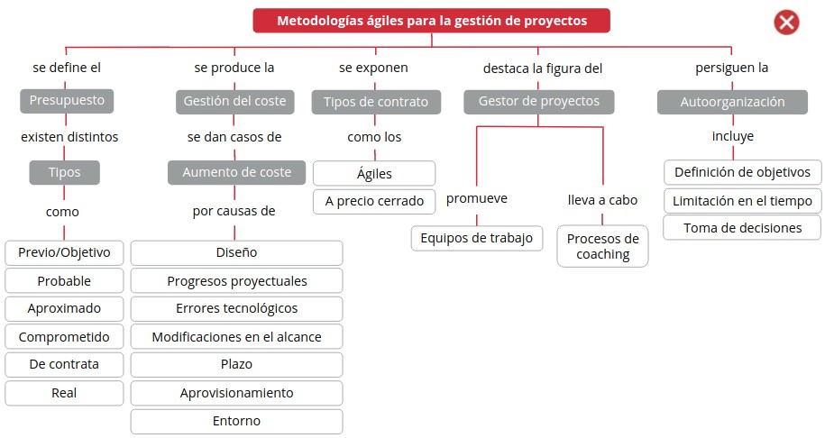

1. El presupuesto y la gestión del coste
****************************************

Una de las bases que fundamenta un proyecto es el **presupuesto**. O lo que es lo mismo, el cálculo anticipado necesario para llevar a cabo la dirección, gestión y desarrollo de un proyecto dado. El proyecto tendrá su presupuesto propio que estará **formulado en función del tipo de proyecto** (construcción de edificación, construcción civil, servicio, fabricación de producto, etc.). 

Asegurar la **invariabilidad del coste** del proyecto contratado es la preocupación más importante que tiene el promotor de cualquier negocio cuando se decide a poner en marcha un proyecto, ya que, en la mayoría de los casos, los proyectos llegan a costar más de lo que en un principio se establece. 

Por ello, **antes de iniciar el proceso**, los promotores quieren dotar a su organización de **mecanismos específicos** para intentar asegurar la invariabilidad del coste. Lo suelen hacer a través de: 

- **Recursos humanos y técnicos propios** 
- **Servicio externo** (normalmente al margen del proyectista, aunque en ocasiones, es recomendable que sea el mismo). 

.. note:: La **gestión del coste** se define como el control que hay que llevar a cabo para mantener el coste dentro de los límites marcados por los objetivos de la misión del protector. 

Este compromiso **requiere por parte del gestor**: 

- Conocer los procesos de elaboración y construcción del proyecto contratado. 
- Conocer los costes pormenorizados y su justificación. 
- Conocer y actuar sobre las razones que pueden hacerlos variar. 
- Disponer de instrumentos que ayuden a prever el coste final. 

Como se intuye en el trasfondo de estos requerimientos, **el gestor y su equipo** han de tener una **gran experiencia** tanto en proyectos como en ejecución de obras. Y no basta con conocer cómo se proyecta, sino también que las soluciones previstas se corresponden con una ejecución y construcción determinada que incidirá proporcionalmente en el coste. 

El **proyectista** suele **prever un coste del proyecto** que se cumple con mucha dificultad y las causas son responsabilidad de uno u otro actor o de una u otra circunstancia. 

El **cliente**, que es precisamente quien más preocupado está por mantener el coste sin variación, **con frecuencia motiva a que se incremente el coste del proyecto**, por lo que ya se puede adivinar cuál es la situación del gestor en determinados momentos. 

Como ejemplo, se puede citar la situación que con frecuencia se crea, cuando el cliente fuerza o admite precios en oposición al proyectista y a la organización gestora del proyecto, muy por debajo de los de mercado y, en muchos casos, por debajo del coste real. Posteriormente se le exige al correspondiente gestor del proyecto que impida que el precio se aleje de los contractuales establecidos entre el cliente y el contratista. La misión, como es de imaginar, se torna en muchas ocasiones imposible. 

Suele ser frecuente que muchos responsables de proyectos en empresas privadas o públicas quieran que, para que sus proyectos reciban la **aprobación inicial** por parte de sus superiores, su **coste** se enmarque en unos **límites bajos**. Si presentan en su comité de dirección o consejo un presupuesto alto, el proyecto no obtiene la luz verde. Por tanto, solicitan al proyectista que apure los precios, las mediciones, el diseño, etc., al máximo, para que el coste sea bajo. Después, **una vez aprobado**, se verá de qué forma se puede conseguir un **aumento de la asignación presupuestaria**. 

Si esta situación no se produjera habría que **defender como fuera el precio pactado**, aún a costa de perjudicar gravemente a la empresa o contrata principal adjudicataria (a pesar de ser una situación que ella misma ha admitido). 

Es posible que muchos proyectos no se hubieran iniciado si se hubiera conocido desde el principio el valor final al que se llega cuando se finaliza la ejecución de la obra. 

El **gestor** tiene la **obligación de**: 

- Situar las cosas en su justo término y conocer con precisión el porqué de determinados precios. 
- Dictaminar qué es lo que se entiende por mejoras económicas ofrecidas por las empresas constructoras a consecuencia de unas mejoras en productividad, sinergias, o por introducción en el mercado. 
- Delimitar las consecuencias que su aplicación puede conducir para evitar caer en una conflictividad que sorprenda. 
- Actuar con veracidad y prudencia. 

En todo caso lo que es necesario es que el cliente sea consciente de que esa **conflictividad** puede aparecer. A partir de ahí se tomarán las decisiones que más convengan a los intereses de la misión. 

Resulta totalmente posible **limitar el coste a un nivel bajo sin faltar a la ética profesional**. Eso puede hacerse, entre otras formas, mediante una **concreción también de los límites** de lo que se está proyectando y bajo unos **condicionantes**. Esa información debe quedar clara tanto para el proyectista como para el cliente. Así que los criterios deben ser diáfanos y no admitir dudas. Es importante, además, que este "acotamiento" del proyecto quede siempre **por escrito**. 

1.1. Bajas del proyecto y bajas temerarias 
++++++++++++++++++++++++++++++++++++++++++

Durante los concursos es corriente que diferentes compañías presenten precios distintos para lo que se supone que es la misma unidad. No es extraño ver diferencias de hasta un 100% entre dos compañías diferentes, son las temidas **"bajas del proyecto"**. 

Un concepto que mana de la **baja del proyecto es la baja temeraria**. 

Como ejemplo imaginemos un proyecto que cuesta según indica su presupuesto 100 unidades monetarias y es concursado por empresas contratas que lo hacen por 80 unidades monetarias, es diecir, tienen una baja del 20% con respecto al presupuesto del proyecto.

.. note:: La **baja temeraria** se produce cuando el órgano de contratación (por ejemplo, el estado o un promotor dado) presume que la proposición presentada por el empresario no puede ser cumplida como consecuencia de precios desproporcionadamente bajos. 

**Puede evitarse estudiando los criterios objetivos** que se establecen reglamentariamente y que son publicados para conocimiento de los licitadores. La **Administración** acuerda la **adjudicación** a favor de la proposición con el precio más bajo que pueda ser cumplida a su satisfacción, y en su defecto, a favor del mejor postor no incurso en temeridad. 

El **gestor** debe conocer cuáles son las **causas más usuales de estas conductas** para poder evaluarlas y ayudar al cliente en la toma de decisiones. 

1.2. Tipos de costes en los presupuestos de gestión de proyectos 
++++++++++++++++++++++++++++++++++++++++++++++++++++++++++++++++

Como se ha expuesto, el **presupuesto** es la traducción de planes a gastos medibles y rendimientos esperados en un determinado período. En este sentido es el borrador financiero o el plano de acción del proyecto. Para los negocios, un **buen presupuesto** puede ser la **diferencia entre éxito y fracaso** porque otorga a las personas los recursos que precisan para completar sus tareas. 

Los presupuestos de los proyectos sirven para una función similar.

La primera pregunta que se debe plantear en el momento de preparar un presupuesto es **qué hará falta (en cuanto a recursos) para completar con éxito el proyecto**. 

Para **determinar los costes** del mismo, hay que desglosarlo en las **principales categorías de costes** que se prevén: 

- **Personales**: Casi siempre es la mayor partida del presupuesto de un proyecto, e incluye a los trabajadores a tiempo total y a los temporales. 
- **Viajes**: Hace referencia a las personas que tienen que desplazarse de un lugar a otro en el transcurso de su trabajo para el proyecto, 'incluyendo las dietas (comidas y alojamientos). 
- **Formación**: ¿Hará falta formación? Si la respuesta es afirmativa, ¿esa formación tendrá que ser in situ o habrá gastos de viaje? Si se decide contratar a un formador externo, el presupuesto debe reflejar sus honorarios y gastos. 
- **Materiales**: Además de los habituales (ordenadores, bolígrafos, papel, etc.) es posible que se necesite algún equipamiento adicional equipos de medida y testeo, vehículos de alquiler, etc. Habrá que prever lo que requerirá el proyecto en función de su tipología. 
- **Espacio**: Hace referencia al lugar de trabajo (alquiler de oficinas, casetas de trabajo, etc.), ¿cuánta superficie hará falta y qué coste tendrá? 
- **Estudios y servicios profesionales**: ¿Habrá que comprar estudios o contratar a una empresa de estudios de mercado? ¿se va a solicitar asesoramiento legal? El presupuesto debe reflejar el coste de cada uno de estos aspectos. 

1.2.1. Preparación del presupuesto
----------------------------------

Debido a que los costes se estiman antes de que comience el verdadero trabajo, la **preparación del presupuesto** facilita a los miembros del equipo la oportunidad de **preguntarse si realmente quieren afrontar ese proyecto**. 

El **patrocinador o promotor**, por ejemplo, puede **reconsiderarlo o reducir su alcance** al ver los costes estimados. Del mismo modo, si el patrocinador no está dispuesto a financiar el presupuesto completamente, el **director del proyecto**, así como cualquier otra persona a la que se pueda imputar el éxito o el fracaso, **puede preferir retirarse**. Los proyectos que no cuentan con una financiación completa están en peligro desde el primer momento. 

En algunos casos, el presupuesto del proyecto no puede ser flexible. Por ejemplo, un proyecto regido por un contrato con un pago total fijo. 

Los **proyectos operados internamente** generalmente son más **flexibles**, algo que a menudo es necesario, dado que resulta extremadamente **difícil prever todos los gastos**. 

Los **mejores proyectos** son aquellos que se alternan a SÍ mismos cuando se encuentran con obstáculos y encuentran valiosas oportunidades. Es por ese motivo que muchos directores de proyectos dejan un **margen de maniobra** en sus presupuestos, aproximadamente del 5%. Ese margen les otorga una capacidad limitada para **hacer frente a costes imprevistos**, sin tener que pedir fondos adicionales al patrocinador. 

Cuando un proyecto ha sido lanzado, el director puede utilizar el presupuesto para **controlar el progreso comparando los resultados** reales con los presupuestados. Este feedback o retroalimentación, a su vez, permite que el equipo dé los pasos correctivos oportunos. 

1.3. Tipos de presupuesto 
+++++++++++++++++++++++++

El **cumplimiento del presupuesto** es el objetivo más deseado y el expuesto más reiteradamente por el cliente a la organización gestora del proyecto y, consecuentemente, al director facultativo del proyecto. 

Algunas veces los proyectistas pueden trabajar sin limitación de presupuesto, pero estos son casos aislados, enmarcados en el ámbito del sector privado y referidos a proyectos muy específicos, tales como residencias de uso particular. Lo usual es que **el cliente haga una previsión de inversión y no quiera sobrepasarla**, así que encarga a la organización gestora del proyecto su estricto control. Sin embargo, es bien sabido que este es un objetivo complicado de alcanzar. 

Como primer análisis se muestran a continuación los diferentes **tipos de presupuesto** en cada fase de desarrollo del proyecto: 

- Previo/Objetivo 
- Comprometido 
- Probable 
- De contrata 
- Aproximado 
- Real 

1.3.1. Previo/objetivo
----------------------

Los estudios previos realizados durante la **fase de la concepción** (en los que hay con asiduidad un estudio de viabilidad, con matices más economicistas o mercantilistas, que no proyectuales) proporcionan un **presupuesto** denominado **previo**. Se trata de un valor que pretende continuar o no con el proyecto. En él se empiezan a valorar partidas con visos de un primer acercamiento al coste real. 

Si el origen del presupuesto previo es un estudio de viabilidad del negocio se torna en **presupuesto objetivo** que indica el valor económico al que necesariamente hay que llegar, ya que, de otra forma, la solución al conflicto no es tal, y el negocio deja de ser rentable. 

El **nivel de aproximación** que se suele permitir es de **±25 - 35% respecto a lo que podría ser el presupuesto real**. La mayor o menor bondad de esa apreciación depende **fundamentalmente de**: 

- La **contingencia en el aumento o la disminución de precios**, es decir, de la mayor o menor estabilidad de los mismos a lo largo del proceso (hay que pensar que la fase de concepción puede estar bastante distante en el tiempo, respecto a la de implementación). 
- El **realismo que el cliente sea capaz de imprimir en los estudios**, ya que, aunque parezca extraño, lo cierto es que muchos proyectos se inician marcados por condicionantes que impiden acercarse a la realidad: estudios de mercados muy someros (para "'ahorrad' costes) que esconden errores de bulto, estrategias mal concebidas, necesidades políticas, etc. 
- El **análisis**, empezando por la metodología, la definición de fronteras, la superficialidad de la investigación, etc. 

La **estimación del presupuesto** la suele hacer el gestor **sobre la base de "órdenes de magnitud"** por experiencias anteriores. No es corriente que se hagan mediciones y, en muchos casos, no interviene el proyectista, ya que podría no haberse estar contratado todavía. Así, s**e estiman ratios como**: 

- Coste/m2 de superficie construida. 
- Coste/unidad energía consumida. 
- Coste/unidad energía instalada. 
- Coste/unidad (producto fabricado, dependencia, trabajador, almacenamiento, capacidad, etc.). 
- Coste de proyectos similares. 

1.3.2. Probable
---------------

Durante las **fases de desarrollo e implementación** se puede desarrollar el anteproyecto, origen de una ingeniería básica, que da lugar a un **presupuesto probable** que ha de tener como máximo un **grado de error del ±20-25%**. El grado de certeza dependerá de un mayor o menor acierto en el planteamiento del conflicto y su definición. 

Al tratarse de una fase en la que se plantea la solución escogida, está claro que se adecuará a las necesidades previstas. Al ser una fase inicial también será determinante que **los juicios** sobre los diferentes aspectos del contenido del proyecto **se mantengan con una cierta estabilidad** hasta el final del proceso de construcción del proyecto contratado, tanto por parte del proyectista como del cliente. 

Así, hay que tener especial cuidado en **definir bien y mantener constantes** a lo largo de todo el proceso **los siguientes aspectos**: 

- Producciones solicitadas. 
- Rendimientos a obtener. 
- Magnitudes y unidades que definen el conflicto.
- Implicaciones externas al conflicto. 
- Implicaciones externas a la solución. 
- Todos los usuarios posibles. 
- Criterios estéticos. 

El **presupuesto probable** que se calcula ya tiene la **estructura formal** del que será el real. Es decir, se han distribuido las partidas en función de centros de costes que **reflejan una forma de desagregación útil para un buen control**, tanto para el proyecto como para la ejecución o la explotación posterior del proyecto contratado. Y aunque el error puede seguir siendo importante y las partidas cambien en el futuro, tanto en contenido como en especificación, conviene hacer un planteamiento de estas características como **base de trabajo y reflexiones futuras**. 

1.3.3. Aproximado
-----------------

Se obtiene durante la elaboración del proyecto básico que se realiza durante la **fase de implementación**. 

El **grado de aproximación** que se obtiene debe ser del orden **del ±10-20%** respecto al real. El grado de acierto con el que se trabaja **va a depender de**: 

- La capacidad de detección y valoración de los alrededores (implicaciones sociales, medioambientales, políticas, servicios afectados, etc.). 
- La profundidad con que se estudien las bases del proyecto. 
- La claridad del programa que llega de la fase anterior. 

**El proyecto básico representa** aproximadamente entre un **40% y un 60%** del proyecto ejecutivo (depende del tipo de proyecto y de proyectista). Refleja exactamente lo que quiere el cliente, pero carece del desarrollo suficiente. En cambio, las ideas están claras, por lo que el **gestor** debe asegurarse de que tanto el **conflicto** como la **solución** están **perfectamente reflejados y delimitados**. De ello dependerá ese grado de aproximación del presupuesto anteriormente dicho. 

1.3.4. Comprometido
-------------------

Se calcula **en el proyecto ejecutivo** y es el más próximo al real. Se denomina comprometido porque es aquel que el proyectista, director facultativo, se compromete a defender y por el que compromete su capacidad y, en definitiva, su prestigio. Y siendo este **el presupuesto que el proyectista se compromete a defender**, y aprueba el cliente, tiene que ser también el que el gestor asuma. Ello implica que debe instrumentar procedimientos que impidan una equivocación fuera de la lógica. Los procedimientos deberán afectar tanto al trabajo del proyectista como del resto de actores. 

Se admite un **error respecto al real del ±5-10%, y el grado de aproximación depende, entre otros, de la profundidad con que se realice el proyecto** (grado de detalle en acabados, especificaciones adecuadas y completas, mediciones correctas, detalles, etc.)y del realismo que se imponga tanto por parte de los usuarios como de los proyectistas a la hora de ir definiendo cada partida. 

**El cliente** (principal usuario) **puede imponer criterios o condiciones que hagan inviable una cuantificación exacta**. No se puede exigir, por ejemplo, una seguridad extrema en una instalación cuando no se admite que se proyecte con ese mismo criterio de seguridad. 

Por otra parte, **el proyectista puede generar un irrealismo** al especificar equipos, obras o instalaciones de difícil obtención en el mercado: ello hará que a la hora de la verdad se tenga que optar por otras soluciones a las proyectadas probablemente mas caras.

1.3.5. De contrata
------------------

Es el presupuesto que la contrata principal o empresa constructora ofrece como oferta y contraposición al presupuesto realizado por el proyectista y expuesto en su proyecto, sometido a concurso entre diferentes contratistas. 

El **presupuesto sometido a concurso** por el proyectista en la mayoría de las ocasiones **es el que hemos denominado como comprometido**, fruto de un proyecto ejecutivo. En otras ocasiones lo que se licita es el **aproximado**, que es el **que proviene de un proyecto básico**. Incluso en ocasiones se utiliza el **presupuesto probable**. 

En todo caso, lo que sucede es que el contratista lo analiza y, fruto de ello, **lo transforma en otro que es el que él se compromete a cumplir**. Es lo que se denomina **presupuesto de contrata**, que admite un error respecto al real del **0-5%**. 

Si el **gestor** ha estado presente desde el inicio de los acontecimientos **habrá hecho su propio presupuesto y lo habrá ido regularizando** en función del que vaya haciendo el proyectista, sancionándolo o no. Lo habitual es que lo vayan compartiendo y haciendo sugerencias, críticas, y en cualquier situación, ayudando a que responda, en cada momento, a los 'inputs de que se disponga. 

Pero al llegar la **fase del aprovisionamiento, la situación cambia y resulta el control más complicado**: hay normalmente algún contratista que dice estar dispuesto a construir o ejecutar el proyecto por un precio diferente al comprometido, normalmente más bajo. 

Ante la situación creada, **el gestor debe realizar un escrupuloso análisis de la oferta por tal de cerciorarse él mismo y asesorar a su cliente**, de si el presupuesto de contrata es el idóneo que hay que defender o es simplemente una cortina de humo preparada para desaparecer en cuanto el contratista tenga el contrato en la mano y empiece a hacer reclamaciones. Es decir, lo que ya hemos llamado **baja temeraria**. 

En cualquier caso, este **es un paso más en el conocimiento del presupuesto real** que comentamos a continuación. 

1.3.6. Real
-----------

Con todo, **hasta que no se entregue el proyecto** encargado dispuesta para la explotación y se valore en su integridad, **no se sabrá cuál es el auténtico coste: el coste real**. 

Este planteamiento "realista" puede sin duda asustar a un inversor, al que se le dice que no sabrá cuánto le va costar lo que ha comprado hasta que no esté totalmente construido. Y puede ser también poco atrayente si viene dicho por un gestor. Pero aquí radica la profesionalidad, porque si que **hay forma de prever el coste antes de ese momento**, siempre que se tenga en cuenta que **durante la fase de construcción hay que**:

- Mantener el programa y la solución prevista, sin realizar cambios. 
- Tener un buen control de las dependencias (interferencias) que pudieran alterar el curso de los acontecimientos. 
- Tener bien especificadas las relaciones entre todos los actores y bien ligadas por contratos buenos, sobre todo razonables, que beneficien al cliente más que perjudiquen al resto. -Tener un buen conocimiento del exacto papel de cada actor y sus límites. 
- Tener acierto en la previsión de los "imprevistos". 

Y es que, **el producto final** (el proyecto contratado llevado a su fin) seguramente **será algo diferente a lo que inicialmente se pensó**. El encadenamiento de las acciones y la propia incertidumbre del futuro, hacen que el primer estado idealizado (que da lugar a un presupuesto objetivo) en los estudios previos cambie y sea al final otra cosa.

A continuación, se muestra un **cuadro resumen** de lo expuesto anteriormente: 

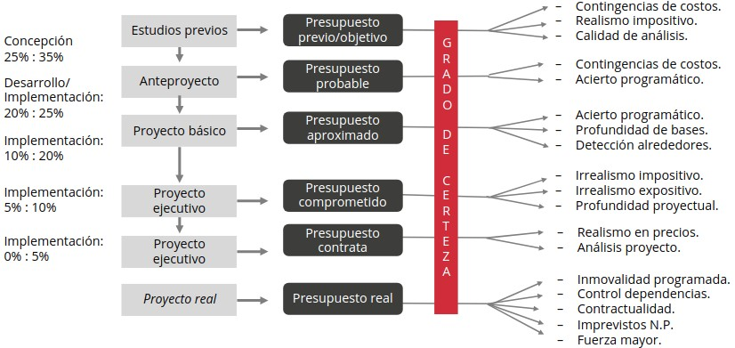

1.4. Causas del aumento del coste 
+++++++++++++++++++++++++++++++++

Para realizar un buen planteamiento que controle el coste de un determinado proyecto, lo primero sobre lo que hay que reflexionar es sobre las **causas que podrían motivar la modificación del presupuesto objetivo**. Cada caso suele ser diferente, ya que pueden influir muchos elementos directos o indirectos, como el tipo de proyecto encargado, el cliente, las circunstancias, etc. 

El **gestor del proyecto** debe, a través de un **análisis de la situación existente**, hacer una previsión de "por dónde vendrá la presión" para así preparar la estrategia adecuada que pueda siquiera contemplar esas causas. 

A continuación, se sintetizan las **causas generales**, que probablemente resumen las diferentes posibilidades: 

- El diseño 
- Los progresos proyectuales 
- Los errores tecnológicos 
- Las modificaciones en el alcance 
- El plazo 
- El aprovisionamiento 
- El entorno 

1.4.1. El diseño
----------------

Las imprecisiones, olvidos o errores en el diseño **son la principal fuente de modificaciones** en el coste estipulado de un proyecto. Y probablemente las mediciones y la especificación de las unidades que representan son la causa más común de entre todas ellas. Es raro encontrar un proyecto en que no se detecte un error en las mediciones e igualmente es probable detectar insuficiencia e imprecisión en la definición de cada una de las unidades que forman un presupuesto. 

Constantemente se van mejorando los programas informáticos de precios y presupuestos que incluyen definiciones cada vez más detalladas de las unidades, pero continúan apareciendo **errores cuando se adoptan programas y no se revisan una por una todas las descripciones** para tratar de adaptarlas a la realidad concreta del proyecto. 

Otra de las causas de por qué se miden deficientemente las magnitudes de un determinado proyecto es porque se deja en manos de **técnicos con experiencia en elaboración de proyectos, pero escasa en la construcción de lo que proyectan**. Y es que son los técnicos que han vivido en detalle el proceso de construcción los que mejor conocen de qué forma se ha de proceder, tanto en el control de "cómo" se está proyectando, como en la posterior medición del elemento proyectado. 

Hay un **error extendido en equipos de proyectistas** que hace que, especializándose en labores de elaboración de proyectos, lleguen a comprobar la ejecución de sus ideas dirigiendo obras, y lo más corriente es que se produzcan numerosas variaciones in situ que mejoren los diseños iniciales en aras a una mejor viabilidad constructiva o eficiencia, pero **nunca realimentan el proceso de elaboración del proyecto**. Así que esos proyectistas seguirán cometiendo los mismos errores durante años. 

**Cumplir las normativas en general no resulta tan fácil** como parece ya que, además de ser cambiantes, cada vez hay que atender a un mayor número de ellas: comunitarias o estatales, autonómicas, municipales, de seguridad, etc. **En general cualquier olvido de normativa pasa por un aumento del precio**. 

**Equivocaciones en las cotas de los planos** no son muy frecuentes, ya que suelen ser objeto de especial atención por parte de los delineantes, pero cuando ello ocurre las consecuencias revisten cierta gravedad. 

Mayor trascendencia tiene el hecho de darse cuenta de que **el programa o la solución al "conflicto" no están satisfactoriamente resueltos** y que hay que adoptar otra solución a la prevista y contratada. Cuando esto ocurre y el proyecto ya está hecho, hay que rehacerlo con el sobrecoste que eso significa. Y si además ya se está en fase de construcción, el coste varía aún más al alza, ya que al coste agregado por volver a proyectar hay que sumarle el de derribar lo construido y rehacer lo que sustituye a lo derribado con un precio que ordinariamente suele ser mucho más alto. Los contratistas alegan que su posición para proponer un nuevo precio ha cambiado, no pudiendo aplicar los mismos criterios en su confección que cuando ofertaron por primera vez. Es lo que se llama **"precio contradictorio"**. 

Un error en una distancia entre columnas de una estructura de un edificio puede acarrear volver a construir, cuanto menos, unas cimentaciones, desmontar la estructura existente, etc. 

1.4.2. Los progresos proyectuales
---------------------------------

Se refiere a los **cambios provenientes de mejoras** que se producen a lo largo del proceso proyectual y/o de ejecución o construcción. Teniendo en cuenta que el proyecto no es más que el camino para hallar la solución a un "conflicto", existe la teoría ampliamente extendida de que la solución no es definitiva si no cuando el proyecto encargado está totalmente ejecutado o construido. 

Eso quiere decir que **todo es replanteable, en cualquier momento. Y esa volatilidad de la solución hace que también el coste lo sea**, así que el cliente no llega a saber cuánto le costará la operación hasta que el proyecto contratado está totalmente acabado. 

Hay muchos proyectistas que piensan que no es muy importante profundizar en la fase de diseño, ya que mientras se esté construyendo podrán ir cambiando y ajustando la solución (y, de hecho, también se puede garantizar que con este sistema el coste global sobrepasará con creces cualquier previsión hecha con un mínimo de profesionalidad). 

1.4.3. Los errores tecnológicos
-------------------------------

Reflejan una situación mucho más profunda que los puros cambios programáticos. Se trata de la situación creada **cuando el proyecto contratado, una vez construido, no es capaz de proporcionar la función deseada**. 

Cuando concurren estos errores **el coste suele aumentar de forma desproporcionada** respecto a la magnitud del error. **Cambiar la tecnología aplicada**, dado que la proyectada no responde a las expectativas creadas, **implica**: 

- Reestudiar el problema. 
- Encontrar una nueva solución (que en ocasiones es muy diferente a la instalada). 
- Desmontar o destruir la existente e instalar la nueva. 

Y todo ello muchas veces **fuera del plazo**, sin mucho contraste entre ejecutores o constructores y **en unas condiciones de negociación**, en cuanto al coste, **precarias** tanto para organización gestora del proyecto como para el cliente. 

Es el caso, por ejemplo, de cuando no se consigue la producción estimada, no se obtienen las frigorías necesarias, el sistema de medición de un caudal no es fiable, las bombas no dan el caudal a la presión demandada, el edificio no está lo suficientemente aislado, el sistema de traducción simultánea tiene fallos de sonido y es poco ágil, el programa informático no funciona correctamente, el servicio no es adecuado, etc. 

1.4.4. Las modificaciones en el alcance
---------------------------------------

Estas modificaciones son **debidas** ordinariamente **al cliente o a los usuarios**. Resulta bastante usual que en el transcurso del proceso proyectual un **cliente solicite un aumento de las prestaciones** de la función prevista inicialmente. 

Cualquier modificación al alza en el alcance supone, inexorablemente, una modificación también al **alza del coste** y, como casi siempre suele ocurrir, no proporcional a aquel aumento. **Dependiendo de la fase** en la que se efectúe la modificación, **el aumento del coste será progresivamente mayor**. A medida que se acaba el plazo, la proporción del aumento en el coste es mayor. 

Ejemplos de modificaciones en el alcance son: el aumento de la capacidad de producción, la superficie de almacenes por cambios en la estrategia, la carga de unas grúas, la diversificación de los productos, etc.

1.4.5. El plazo
---------------

Invariablemente, **cualquier aumento del plazo previsto, comporta un aumento del coste**, tanto del proyecto materializado como de las cuentas de resultados de todos los actores implicados. Eso quiere decir que, en principio, a nadie le debería interesar el aumento. Sin embargo, en determinadas circunstancias, a alguno de los actores puede serle de utilidad. 

Para el que ejecuta el proyecto o lo construye (contrata principal), un aumento del plazo siempre produce un **aumento de los costes indirectos y** con mucha posibilidad, **un aumento de los directos**. 

Para el **cliente**, el aumento del plazo supone claramente un **aumento de los costes indirectos** de la propia organización que tiene que atender a ese proyecto y no puede dedicar esos recursos a otros nuevos. También, con frecuencia, se han asumido unos costes en contratación de personas que deben "usar" el proyecto ya finalizado y que, al alargarse el plazo de entrega, están produciendo **gastos sin contrapartida de "producción"**. 

Los gastos sin contrapartida de "producción" ocurren con más frecuencia en proyectos que producen elementos físicos (bienes de equipo, aceros, productos químicos, etc.), en los que hay que contratar personas con algunos meses de anterioridad a la puesta en marcha y, si esta se retrasa, hay que seguir asumiendo un coste improductivo. 

Hay también **costes derivados de préstamos** cuyo principal empieza a devolverse antes del plazo previsto, comportando así intereses extras. Y por último podrían citarse **costes que pudieran asumirse por alquiler** de servicios, instalaciones, construcciones alternativas que sustituyan las previstas mientras estas están en proceso de finalización. 

1.4.6. El aprovisionamiento
---------------------------

Se podrían resumir en **cuatro** las **causas que aumentan el coste dentro del proceso de aprovisionamiento** de los elementos que deben configurar las partes físicas del proyecto contratado:

- **La paquetización realizada**. 
- **Las cláusulas contractuales**. 
- **La descoordinación entre los contratos**. 
- **Los vacíos entre suministros**. 

Cada **proyecto es diferente** y por tanto no se puede aplicar la misma técnica. En algunos casos es conveniente contratar a una contrata única o principal y en otros **es conveniente paquetizar o dividir el contrato en varios paquetes o varias subcontratas**. Por lo general suele ser conveniente hacer esto último, ya que así el cliente se ahorra el beneficio o coeficiente de paso que un contratista general aplica sobre sus subcontratistas. 

En cambio, hay veces que es conveniente contratar a un único contratista que demuestre poder ofrecer mejores precios por sinergias o disminuciones de costes indirectos en mayores contratos. La gestión de proyectos debe analizar con mucho detalle las dos opciones que, como se ha dicho, son válidas. 

Se recomienda que no se redacten con condicionantes de previsibles incumplimientos por estar fuera del mercado actual, ya que son un seguro de conflictos y de también previsibles aumentos de costes. 

En general los contratos cerrados, tipo "llave en mano" o similares, son menos propensos a que produzcan aumentos, pero **debe asegurarse que los proyectos estén muy bien hechos**, sobre todo el presupuesto, en lo que se refiere a la certeza de que todo está medido, o como mínimo, plenamente especificado. Los contratos **"llave en mano"** en los que no hay correspondencia total entre documentos (a pesar de una buena redacción del contrato) son un seguro que avala el aumento del coste. 

En contraposición a lo anterior, los contratos que prevén abonar el coste del ente del proyecto según la medición efectuada, son susceptibles normalmente de que aumente el coste. Lo mismo que aquellos en que se paga por administración, es decir, materiales y mano de obra separados y en función de lo que se vaya necesitando. 

Hace referencia a la descoordinación en el aprovisionamiento entre diferentes contratistas o elementos que configuran la ejecución del proyecto. 

La existencia de **elementos que no son contratados** en su momento, quedando vacíos en el aprovisionamiento suponen un **aumento en el coste**. Esa dilación en la contratación puede ser debida bien a un error en la elaboración del proyecto o bien porque se decide hacerlo más adelante cuando la ejecución esté en marcha. En ambos casos ocurre lo mismo: se dispone de escaso margen de tiempo para conseguir el mejor precio, ya que el plazo va corriendo y suelen decidirse estas contrataciones cuando se está acabando por lo que la organización gestora del proyecto y el cliente negocian con un hándicap en su haber. 

Una entrega de equipos cuando no existe el recinto que les debe albergar (por lo que deberán hacerse dos traslados), la contratación a destiempo de una grúa, acabar a destiempo un aprovisionamiento como por ejemplo el de la pintura de un área, que hace deba volverse a repintar más adelante, etc. 

1.4.7. El entorno
-----------------

Siempre hay que prever elementos imponderables que provienen del entorno del proceso y que se materializan con más virulencia en la fase de implementación en forma de aumento de costes, amén de otras posibles repercusiones como son el plazo o la seguridad. Estos elementos los hemos dividido para su análisis en **contingencias y elementos de fuerza mayor**, producidos ambos en el entorno. 

La **fuerza mayor** está bastante tipificada en los contratos de aprovisionamiento y se refiere a **situaciones que se escapan con mucho de las posibilidades de control de los actores implicados**. Son elementos de fuerza mayor: las huelgas de trabajadores o de determinados colectivos implicados en la ejecución o construcción del proyecto (metal, transportista, sector construcción, etc.), la meteorología (periodos intensos de lluvia, vientos huracanados, tornados, etc.) así como en menor medida las revoluciones y las guerras, etc. 

En todos los casos se produce invariablemente un **aumento de coste**, ya sea directa o indirectamente, a través de un aumento del plazo, del coste energético, etc. 

Las **contingencias** pueden ser de diversa índole: 

- **Monetaria**: Por ejemplo, los cambios de moneda que repercuten al alza diferentes costes como honorarios de proyectistas extranjeros, compras de equipos en divisas, etc. 
- **Provocadas por el aumento de impuestos**: Al estado o ayuntamientos como pueden ser subidas de IVA o subidas de permisos de obras o licencias de otro tipo. Cambios sustanciales Cambios legislativos 
- **Cambios sustanciales**: En las hipótesis o condiciones básicas del proyecto, por causas ajenas a él, sobre todo cuando se están produciendo el aprovisionamiento y la construcción. El margen de maniobra del proyectista es escaso y la solución más cómoda que le queda es reconsiderar el conflicto por la vía del aumento del presupuesto. Solución a la que se apunta con prontitud el contratista. El gestor del proyecto debe, primero, desentrañar la autenticidad del problema, y después tratar de encontrar vías alternativas para intentar que no se incremente el presupuesto objetivo. Cambios sustanciales son, por ejemplo, el incremento de la sobrecarga de los forjados por cambio de las características de los posibles usuarios, modificación al alza de los consumos energéticos previstos, modificaciones de las condiciones del subsuelo no previstas en el estudio geotécnico, etc. 
- **Cambios legislativos**: Este es el caso de los cambios en la ordenación urbanística, modificaciones en los aumento de impuestos sistemas de protección en el manejo de sustancias peligrosas o el endurecimiento de las condiciones medioambientales.

2. Contratos ágiles 
*******************

Los **planteamientos ágiles**, entre otras cosas, están enfocados a gestionar riesgos. El cliente prioriza los objetivos del proyecto por el valor que le aportan y revisa el producto tangible a lo largo de todo el proyecto con el fin de asegurar desde los inicios del proyecto que el **producto real** ya desarrollado siempre esté **alineado con sus expectativas**. 

El cliente dirige los resultados del proyecto para poder satisfacer sus necesidades reales, con el apoyo del proveedor. Así pues, los planteamientos ágiles protegen más al cliente de cosas que puede que no conozcan, ni él ni su proveedor. 

Si se reconocen como adecuados los principios y prácticas ágiles para guiar la relación entre las partes, es conveniente explicitar estas reglas del juego en forma de **contratos ágiles**. 

Estos contratos se pueden organizar en función de si las **variables alcance, importe y plazos son fijas o variables**. Un contrato queda definido sólo cuando se especifica el alcance de los servicios a contratar y la fórmula por la que se establece el precio de estos servicios. 

Los **servicios a contratar** pueden ser muchos. En general, los servicios necesarios son los siguientes: 

- El asesoramiento previo, que puede comprender estudios de viabilidad, de localización y otros. 
- La cesión de la propiedad industrial del proceso. 
- El desarrollo del proyecto básico o anteproyecto. 
- El desarrollo del proyecto de detalle y su dirección. 
- La gestión de adquisiciones. 
- La puesta en marcha y el mantenimiento. 

Todos estos servicios pueden llevarse a cabo por una sola organización proyectista, por dos o más, o por sociedades temporales constituidas por diversas ingenierías, consultorías, empresas constructoras e instaladoras y proveedores. 

3. Contratos a precio cerrado 
*****************************

.. note:: Un **contrato a precio cerrado** es un tipo de contrato, llamado con frecuencia "llave en mano", en el que contratado se compromete a hacer entrega de una construcción completamente terminada y en estado de funcionamiento contra la entrega de una cantidad fija dividida en plazos, pactados previamente de acuerdo con el avance de un proyecto. 

La **oferta** del contratado está **basada en un estudio del proyecto** suministrado por el contratista. Aunque los riesgos de errores en dicho proyecto se dan a entender como asumidos por el contratado, este debe hacer un **estudio completo y exhaustivo del proyecto** que le entrega el contratista y agregar en él todo aquello que considera que sea necesario, ya que la cifra de su oferta se puede dar como "cerrada" una vez rubricado el contrato. 

El **contratado** se compromete a admitir exclusivamente la cantidad ofertada, agregando en ella todas aquellas cosas que en su opinión son necesarias para la **correcta fiscalización y funcionamiento** de la instalación, aunque no estuvieran añadidas en el proyecto recibido para el estudio de dicha oferta. 

4. Gestor de proyectos 
**********************

.. note:: El **gestor de proyectos** es un profesional que posee la capacidad de liderazgo, es decir, domina las habilidades para influir en la manera de pensar o de actuar de las personas, motivándolas para que realicen sus tareas de manera eficiente, ayudando de esta forma a la consecución de los logros y utilizando distintas herramientas como el carisma y la seguridad al hablar, además de la capacidad de socializar. 

No sólo se debe generalizar este término a la forma de cambiar de parecer a las personas, sino también a las **capacidades de**: 

- Tomar la iniciativa. 
- Proporcionar ideas innovadoras. 
- Evaluar determinados proyectos de manera eficiente. 

El líder debe **tener en cuenta las inquietudes y opiniones** que las personas que se encuentran bajo su cargo puedan ofrecer, lo que **genera seguridad** en los subordinados. Esto a su vez evita la discusión sobre su rol, dejando bien en claro la figura que representa. 

En el entorno laboral es de vital importancia la presencia del líder, ya que se cree que dicho profesional puede guiar a un determinado grupo de personas a la **consecución de los objetivos de manera más rápida y efectiva** que si cada una de estas lo hiciera por sí sola. 

En algunas ocasiones el liderazgo es ejercido utilizando **tácticas autoritarias** y de intimidación. En estos casos el líder puede llegar a ser respetado, pero de **manera obligatoria y no voluntaria**. 

En la actualidad hay gran cantidad de personas que poseen las cualidades de un líder y que ejercen este rol de diferentes maneras, es por eso que el liderazgo se clasifica según el tipo de método que se utilice para dirigir a un determinado grupo de personas. Como se ha visto en unidades anteriores, destacan los siguientes **tipos de liderazgo**: 

- Empresarial 
- Autocrático 
- Democrático 
- Laissez faire 
- Paternalista 
- Carismático 
- Lateral 
- Situacional 

5. Dinámica de grupo 
********************

La **dinámica de grupo** busca explicar los cambios internos que se producen como resultado de las fuerzas y condiciones que influyen en los grupos como un todo. 

Dentro de los grupos se han identificado **4 prototipos clásicos**, que, **según su rol son**: 

- Portavoz 
- Chivo expiatorio
- Líder 
- Saboteador 

6. Trabajo en equipo 
********************

Las **organizaciones actuales** están viviendo un **proceso de cambio continuado** generado por la creciente **competencia global** de los nuevos modelos de negocios que se anteponen por los ambientes dinámicos, inciertos y complejos que circundan la vida de las organizaciones. 

Los **equipos** satisfacen las nuevas necesidades de las organizaciones, aportando una **mayor diversidad de conocimientos, habilidades y experiencias** que posibilitan dar respuestas rápidas, flexibles e innovadoras a los problemas y retos planteados en el momento actual. El **éxito de las organizaciones** y la producción global de conocimiento depende en gran medida de la **eficacia de los equipos**. 

Los equipos son más eficaces que los individuos actuando en solitario, especialmente cuando el rendimiento requiere habilidades, juicios y experiencias múltiples. Aunque la mayor parte de la gente reconoce las capacidades de los equipos, con frecuencia se pasan por alto **oportunidades adicionales** que el equipo ofrece a los que forman parte de él. El trabajo en equipo exige **comprensión y compromiso** con las metas del grupo por parte de todos los miembros. Pero los equipos también **plantean muchos desafíos** a las organizaciones, en la medida en que exigen de una comunicación efectiva para solucionar conflictos de personalidades y egos.

Por tanto, las **ventajas de los equipos de trabajo** se dan cuando estos, al actuar como tal, y centrarse tanto en las personas que los integran como en las tareas y resultados a alcanzar, **se adecuan a un estilo de liderazgo que le es apropiado** en función del grado de madurez de los mismos, provocando la sinergia o la integración de los **elementos que se quieren alcanzar**. 

- Resultados superiores cuantitativa y cualitativamente (resultados). 
- Satisfacción y orgullo de sus integrantes (personas). 
- Calidad superior del trabajo y mayor conocimiento e información (procesos). 

En cuanto a las **desventajas**, hay que tener en consideración las siguientes: 

- Tomar las decisiones de forma precipitada. 
- Que impere el dominio de pocas personas, en particular el de un líder. 
- Consumir mucho tiempo en reuniones discutiendo soluciones y acciones, retrasando su puesta en marcha. 
- Que existan presiones sobre miembros del equipo para aceptar soluciones. 
- Que exista responsabilidad ambigua, ya que queda diluida en el grupo. 

Hoy en día es necesario que las organizaciones cuenten con un grupo de **directivos entrenados para gestionar situaciones** y así poder afrontar el futuro con garantías de éxito. Para ello pueden seguir **2 estrategias**: 

- Buscar fuera de la empresa. 
- Descubrirlos dentro de la empresa. 

Sin duda **la mejor opción es la de descubrir a esos directivos dentro de la propia organización**, ya que el líder no nace, sino que se hace. Es posible aprender a liderar mediante un proceso de preparación adecuado. 

Las organizaciones deben aceptar que los **resultados empresariales son consecuencia directa** de los comportamientos **de todos los miembros**, siendo más relevante el comportamiento de los líderes, ya que son el modelo de referencia. En ese caso **el directivo tiene** que dejar de ser un mero gestor para convertirse en **un líder transformador**. Este nuevo rol sustituye estrategia por finalidad, estructura por procesos y sistemas por personas. 

6.1. El proceso de coaching 
+++++++++++++++++++++++++++

El **proceso de coaching** es necesario para poder cambiar el rol del directivo. Este proceso es el adecuado para el perfeccionamiento de directivos individuales o en pequeños grupos de dirección y formación de líderes. 

Según los objetivos de este proceso se pueden diferenciar **2 tipos de coaching**: 

- Para el desarrollo del liderazgo (coaching for leadership). 
- Para la mejora del desempeño (coaching por performance). 

El **coaching para el desarrollo del liderazgo** se centra en los aspectos más intangibles y subjetivos, es decir, los que influyen en el comportamiento de las personas. 

Por tanto, para lograr estos resultados es necesario utilizar **nuevas fórmulas de aprendizaje** que incluyan formación presencial en grupos reducidos a la comunicación, aplicación al trabajo y las fortalezas y áreas de mejora de cada miembro. Este **proceso estratégico** puede resultar lento, ya que **pretende cambiar hábitos** de la persona. Y los hábitos son el punto de intersección entre los conocimientos, las capacidades y la voluntad. 

.. note:: Es necesario trabajar los tres aspectos si queremos modificar un hábito que genere nuevos comportamientos. El directivo tiene que razonar y reflexionar sobre los cambios que quiere realizar y asegurarse de que merecen la pena y son posibles de conseguir. 

6.2. El feedback 360º
+++++++++++++++++++++

.. note:: El **feedback 360º** es una herramienta de evaluación y seguimiento del desempeño individual en el ámbito de la gestión empresarial. Se compone de una serie de cuestionarios que se pueden aplicar tanto de forma individual como colectiva. 

Se utiliza desde los **años 60 en EE.UU**, sin embargo, es a **mediados de 1980** cuando aumentó mucho su aceptación y actualmente muchas empresas de todo el mundo lo están aplicando. 

Esta herramienta se basa en el análisis que se hace sobre la **diferencia entre la imagen que tenemos de nosotros mismos y la que tiene los demás**. Esto es importante, ya que la percepción de los demás y la de nosotros mismos influye en la relación con los que nos rodean. 

6.2.1. Áreas
------------

Esta herramienta **aporta un marco formal facilitador** para recibir y enviar feedback, ya que **enseña a cuestionarse**. Cuando se aplica esta herramienta se buscan resultados en las siguientes **áreas**:

- **Desarrollo personal**: sobre todo frente al rendimiento profesional real. 
- **Evaluación individual**: buscando mejorar el rendimiento profesional a corto y medio plazo. 

6.2.2. Etapas
-------------

Este tipo de evaluación consta de **5 etapas**: 

- **Cuestionario**: Confección de un cuestionario específico para una empresa determinada, o bien selección de un cuestionario estándar. 
- **Respuesta**: Respuesta a los cuestionarios por parte del directivo que es objeto de la evaluación, así como por las personas relacionadas con él (más o menos diez personas en orden jerárquico). 
- **Estadística**: Tratamiento estadístico de los datos obtenidos. 
- **Resultado**: Comunicación de los resultados del tratamiento. 
- **Planes de acción**: Trazado de los planes de acción en base a la interpretación de los datos obtenidos. 

6.2.3. Repercusiones
--------------------

El uso de la evaluación a 360º requiere una serie de **precauciones**. Hay que utilizarla con acierto y precisión, porque puede tener algunas repercusiones importantes sobre las personas o la organización. Para ello se requieren **4 condiciones**: 

- Contar con una herramienta clara y completa. 
- Que las personas que intervienen en la evaluación sean suficientes en número y calidad de información. 
- Para llevar a cabo este proceso conviene contar con un master coach, es decir, un especialista externo a la propia empresa y acostumbrado a trabajar en cuestiones de desarrollo directivo, para que coordine todo el sistema de evaluación. 
- Por último, que todo este ejercicio esté orientado a la búsqueda de la mejora continua del propio interesado. 

6.2.4. Prevenciones
-------------------

También se hace **indispensable**: 

- Definir la finalidad de su aplicación. 
- Verificar la oportunidad de su aplicación. 
- Efectuar una correcta divulgación, a todos los niveles implicados, del objetivo de su uso. 

De esta manera **se prevendrán posibles reticencias** que luego se traducirán en falta de sinceridad en las respuestas a los cuestionarios. 

A la hora de llevar a cabo una evaluación 360º existen muchas **reticencias por parte de los directivos** de las organizaciones. Esto es un indicador de que se falla en una competencia directiva clave: **la autocrítica** o capacidad para evaluar con frecuencia y profundidad el propio comportamiento. 

6.2.5. Interpretación de datos
------------------------------

Los resultados nos dan mucha información para conocernos, pero poca para comprendernos. Para ello se requiere una **buena interpretación de los datos** para determinar hacia dónde dirigir el plan de mejora y cuál es el potencial de esa persona. 

Un **buen diagnóstico consta de 3 elementos**: 

- **Concretar las áreas de mejora**: Hay veces que será evidente, pero otras muchas no. Como elemento imprescindible para concretar las áreas de mejora habrá tomar como referencia una media externa fiable como, por ejemplo, una base de datos de directivos amplia, con un nivel de desempeño semejante. 
- **Determinar el potencial real de mejora**: Esta es la parte esencial del diagnóstico. El potencial de mejora de un directivo estará en función de tres factores: importancia de esa competencia para el puesto, actitud personal para la mejora de la competencia y factibilidad de la misma. 
- **Sentido de la oportunidad**: Hay circunstancias que pueden aconsejar aplazar el plan de mejora para más adelante. 

7. Inventario de tareas
***********************

.. note:: El **inventario de tareas** es una lista con todas las tareas implicadas en el desarrollo de un trabaja a un flujo de trabajo. 

Elaborar un inventario de tareas puede ser algo compleja. Suele hacerse por **encargados de Recursos Humanos** y sirve para **mejorar los procesos de negocio**. Aplicando un análisis de estas características conoceremos para cada puesto de trabajo las tareas que se realizan regularmente. 

A continuación, veremos una serie de **características** sobre este concepto:

- El inventario de tareas considera tareas esenciales las funciones propias de un puesto de trabajo específica. Estas tareas se consideran como rutinarias y se identifican fácilmente porque tienen lugar recurrentemente. 
- La información para poder realizar el inventario de tareas se recopila mediante estudios, entrevistas, observación y cuestionarios. Las principales fuentes son los empleados y gerentes. 
- El inventario de tareas, no es una descripción del trabajo, sino una manera de obtener una visión completa del flujo de trabajo para identificar todas las acciones que lo forman. 

8. Autoorganización 
*******************

La **autoorganización** de los equipos es un concepto fundamental recogido en el **Manifiesto Ágil** y reforzado todos y cada uno de los marcos de trabajo ágiles. Cómo conseguir que dicha autoorganización contribuya los objetivos de la compañía una de las claves de la que denominamos gestión ágil. En los siguientes epígrafes se exponen una serie de **prácticas para alcanzar la autoorganización**. 

8.1 . Definición de objetivos 
+++++++++++++++++++++++++++++

Las personas que se encarguen de dirigir el proyecto precisan alga más que el simple esboza de una **descripción de los objetivos** de los que serán responsables. La ambigüedad en las objetivos puede conducir malos entendidos, desilusiones y caras repeticiones del trabaja. 

Cuanto mejor se expresen los fines, mayar posibilidad de éxito. Los objetivos deben ser decididos por la **persona que dirija el proyecto**, por el **líder del equipo** que vaya trabajar en él y los **miembros de dicho equipo**, pues así no se minará la moral, ni se cuestionara capacidad del equipa. Y es que los equipas trabajan mejor cuando los objetivos son claros y están perfectamente delimitadas. 

De todas formas, cuando las fines están especificadas, pero los medios no, los miembros del equipo **pueden basarse en sus conocimientos, habilidades y experiencias** para pensar y ejecutar una forma de operar que esté bien emparejada con el propósito y las circunstancias del equipa. 

Consideremos este ejemplo de un objetivo no muy bien definido: "Desarrollar una página web capaz de proporcionar información rápida, exacta y coste efectivo sobre nuestros productos y satisfacer a nuestros clientes". Esta podría ser la forma en que un patrocinador describa el objetivo del proyecto en la carta. ¿Pero qué quiere decir exactamente? ¿Qué es "rápido"? ¿Cómo se define la exactitud? ¿Un error en mil transacciones es aceptable, o las expectativas del patrocinador son de un error en diez mil operaciones? ¿Hasta dónde debe llegar la efectividad de costes del sitio web? Cada una de estas preguntas debería contestarse consultando con el patrocinador y las principales partes interesadas. 

8.2. Limitación en el tiempo 
++++++++++++++++++++++++++++

Un aspecto fundamental es que las **objetivos** sean **medibles y específicos**, pues si na se hace así no existirá la forma de saber si el proyecto ha alcanzado sus objetivos. También debe haber un **límite de tiempo** para alcanzar esos objetivos, ya que el proyecta puede ser ilimitado. Según las circunstancias, el límite temporal debe ser firme, una situación con un tiempo establecida y de alcance variable. 

Algunos proyectos definen el **tiempo como una constante**. Consideremos el caso de una editorial que decide sacar un nuevo curso cada mes. Dado que el tiempo es constante, el equipo encargado del proyecto debe ajustar el alcance de los nuevas lanzamientos (añadiendo a eliminando características del producto) para asegurar que haya una cursa nueva al mes. 

Lo opuesto es indudable en situaciones que tienen un **alcance fijo y un tiempo variable**. Si el alcance del proyecto está fijado, entonces un límite temporal sólo se puede establecer después de que el director del proyecto y el equipo hayan tenido la oportunidad de desglosar cada objetivo en un conjunto de tareas y tras programar la duración de cada una de ellas. 

"A enviar una sonda a Marte en el verano de 2003, el equipo de la NASA encargado del proyecto tenía una ventana de oportunidad limitada. Marte y la Tierra estaban inusualmente cerca en esos momentos. A finales de agosto, la distancia entre ambos planetas comenzaría a aumentar rápidamente. La NASA había de lanzar el vehículo explorador en julio o cancelar el proyecto. Con la premura de tiempo, la agencia tuvo que ser flexible en cuanto al alcance del vehículo espacial que estaba construyendo". 

Una **buena manera de fijar el alcance de un proyecto** es reunir las principales partes interesadas y participantes en el proyecto en una sesión de brainstorming que busque específicamente describir qué debe entrar en el alcance del proyecto y qué no. 

Todas las partes implicadas deberán realizar **concesiones** entre las opciones que surjan (que siempre serán más numerosas que el tiempo y los recursos de los que se disponga). Si la expectativa del patrocinador especifica las objetivos que quiere alcanzar, el plan del proyecto deberá **definir los medios en términos prácticos**. Con la **aprobación del patrocinador**, este plan se convierte en una etapa más que se habrá cubierto. 

Queda evidenciada, pues, que un **plan de proyecto** es un elemento imprescindible para que el arranque del proyecto esté enfocado hacia la gran meta final. Además, proporciona mayor información sobre tareas, hitos, resultados, riesgos y cronogramas. Servirá coma una **hoja de ruta** para todos los implicados en el proyecto. 

8.3. Toma de decisiones 
+++++++++++++++++++++++

Si antes de comenzar el trabajo en sí se establecen los **procedimientos y mecanismos operativos básicos**, el proyecto será realizado de una forma más llevadera, no habrá lugar a roces ni malos entendidos. Entre estos procedimientos y mecanismos se deben incluir **las decisiones**. 

Un **director de proyectos** con experiencia sabe que una parte nuclear de su labor es la **toma de decisiones**. Un director de proyectos con experiencia sabe que una parte nuclear de su labor es la toma de decisiones. Y es que en realidad un proyecta es más que una cadena de decisiones con una meta final en el horizonte: lograr el objetivo final del proyecto. Por esa, uno de los primeros pasos que se deben dar es aclarar: ¿Cómo se tomarán las decisiones? ¿Quién las tomará? 

Si no hay consenso entre los miembros, el proyecto se encontrará con muchos obstáculos. En un proyecto habrá mucha gente con interés en él, todos con distintas expectativas de éxito, ello, es importante **identificar y gestionar bien sus diversas aspiraciones**. La estructura organizativa puede ser desarrollada identificando las personas del grupo que pueden contribuir mejor su gestión eficaz. 

El director del proyecto, el líder del equipo, cada uno de los miembros del equipo, el patrocinador y, en definitiva, cada una de las partes que conforman el grupo encargado del proyecto irá encontrándose la largo del mismo con una serie de **disyuntivas que pueden convertirse en un problema** si na se ha dejado bien claro desde el principio cuál será el protocolo de actuación en cada caso. 

Algunas de las **decisiones que pueden surgir de improviso son**: 

- ¿Cómo se decidirá cuando existan alternativas?
- ¿Un objetivo menor debe cambiarse por otro? 
- ¿El equipo puede tomar decisiones con respecto al tiempo o debe remitirse al comité de dirección? 
- ¿Quién decidirá si deben recortarse gastos? 
- ¿Qué consultor debe contratarse y con qué compromiso? 

Tampoco quiere esto decir que el director del proyecta deberá prever, cuestionar, debatir y dejar programada la manera de actuar ante decisiones irrelevantes dentro del día día del proyecto. 

Dentro de las unidades funcionales de negocios, **las decisiones son el dominio de directivos y jefes**. Estas personas identifican el problema, buscan y analizan alternativas y se asesoran en las fuentes adecuadas. Luego toman las decisiones y aceptan las responsabilidades de las consecuencias. 

Aunque pueden buscar consenso y la aportación de otros, **no están obligados por esas opiniones**. Los equipos encargadas de proyecto deben tomar las decisiones de forma diferente. 

8.3.1. Esferas de decisiones
----------------------------

La **toma de decisiones** relacionadas con un proyecta es tan definida coma la toma de decisiones dentro de unidades operativas o departamentos.

Los **patrocinadores y comités de dirección** tienen la autoridad para tomar decisiones con respecta a los objetivos del proyecto y el nivel de recursos asignados. También tienen la autoridad máxima sobre las siguientes **aspectos**: 

- Personales. 
- Gastos superiores a una determinada partida presupuestaria. 
- Aportación de recursos extremos. 
- Cambios en la política general u objetivos. 
- Opciones que afectan los clientes, como precio o especificaciones. 
- Cambios en los resultados que se quieren conseguir y objetivos. 

También deben reconocer las opiniones de las principales partes interesadas que piden tener voz en estas decisiones. 

Los **directores de proyecto**, otra lada, deben tener la **única autoridad sobre decisiones relacionadas con operaciones y procesos**, siempre que no hagan nada por: 

- Alterar el objetivo o el resultado conseguir. 
- Afectar de forma adversa el calendario.
- Afectar de forma adversa el presupuesto. 

Lo mismo se aplica los **líderes y miembros del equipo**. Estos participantes necesitan la autoridad de tomar decisiones dentro de sus limitadas esferas, excepto si sus decisiones pueden tener efectos negativos constatables sobre el trabajo de otros equipos. 

Para **evitar discrepancias**, el director del proyecta debe asegurarse de que el equipo encargado de su proyecto, el patrocinador, las principales partes interesadas y la alta dirección tienen una visión unificada sobre las decisiones que pueden tomar cada una de las partes implicadas en el proyecto. 

8.3.2. Quién toma las decisiones y cómo debe hacerlo
----------------------------------------------------

El **director del proyecto** deberá ayudar al **líder del equipo** y los **demás miembros** del misma a acordar quién toma las decisiones y cómo debe hacerla. En el equipo, ¿las decisiones las tomará el líder a un subgrupo de miembros, o todos los implicadas tendrán la opción? ¿Cómo se tomarán las decisiones? ¿Mandará la mayoría o el grupo tendrá que alcanzar un consenso total? ¿Las decisiones serán definitivas? Si no, ¿qué clase de procesa de modificación seguirá el equipo? 

Algunos **enfoques comunes de la toma de decisiones** son: 

- **La mayoría manda**: los participantes exponen su posición en la reunión, discuten y luego votan. Las decisiones que reciben más del 50 de los votos de adoptan. 
- **Consenso**: cada uno de los miembros del equipo debe estar de acuerdo antes de que se pueda tomar y adoptar una decisión. Si no se puede alcanzar el consenso, se deben desarrollar nuevas alternativas y presentarlas al grupo. 
- **Un pequeño grupo decide**: se elige un grupo de personas con destacada experiencia y habilidades para que tome las decisiones. 
- **El líder decide con datos**: el líder del equipo recoge información de los miembros y luego toma la decisión. 

Al elegir un enfoque para tomar decisiones, los participantes deben sopesar los **pros y los contras de cada opción**. 

Los enfoques de **consenso** y de **la mayoría** manda pueden ayudar establecer el compromiso del equipo. Pera hay un **inconveniente**: esos métodos **requieren tiempo**. Si el tiempo es un problema importante, el equipo podría considerar otros enfoques para llegar un acuerda colectiva sobre las cuestiones de mayor importancia para los miembros y emplear un enfoque más simplificado para las demás. 

Cualquiera que sea la opción para tomar decisiones, debe ser **establecida durante los primeros pasos del proyecto**. Esta es una condición *sine gua non para* que el proyecto alcance el éxito esperado. Si na se hace así, sólo se pueden esperar discusiones y enfrentamientos que repercutirán de forma negativa en el proyecto, ralentizándolo. Esa sí, si el tiempo y las resultados indican que esas reglas no son efectivas, deberán ser sustituidas por otras, aunque el proyecto esté en marcha. 

8.3.3. Seguimiento y tratamiento de cuestiones no resueltas
-----------------------------------------------------------

Inevitablemente, cuando finalizan muchas reuniones, **cuestiones importantes** que han surgido habrán quedado **sin resolver**, ya sea por falta de tiempo a porque los participantes no disponían de la información necesaria para formarse una opinión, o simplemente parque necesitaban tiempo para meditar. ¿Qué ocurre entonces con estas cuestiones? 

Las **cuestiones sin resolver** pueden convertirse en un **obstáculo difícil de superar** en la carrera de fondo que se convierte la realización de un proyecta, un obstáculo que puede llegar a convertirse en causa de un tropiezo definitiva que acabe con la esperanza de llegar a la meta. 

Una forma de hacer frente este tipo de cuestiones es reflejarlas en un **registro de seguimiento**. Esto conlleva **2 ventajas**:

- ¿Las cuestiones sin resolver no se perderán? 
- Se asegura un procedimiento para su oportuna resolución. 

La simple creación de un registro **no elimina el problema de las cuestiones sin resolver**. Sencillamente, alguien se hace responsable de ellas y de volverlas a presentar ante el faro de decisiones en el momenta oportuno. Tanta persona que no haya podido plantear la cuestión como el director del proyecta deben compartir esa responsabilidad, unos parque san los que sostienen que sus cuestiones son importantes y el otra porque es quien determina la agenda. 

8.3.4. Documentar decisiones y acciones
---------------------------------------

Cuando se tienen varias reuniones al cabo del día, lo más probable es que se pierda la cuenta de qué decisiones se han tomado en unas, quiénes serán los encargados de realizar qué acciones, etc. Para evitar confusiones, es necesario disponer de un **método para tener presentes las decisiones tomadas por su grupo**. Las **minutas de las sesiones** y los **informes sobre progresos** pueden serle útiles este fin: 

- **Minutas de las sesiones**: Son notas tomadas por una persona encargada. Las minutas se revisan y aprueban en la siguiente reunión, con enmiendas, si es necesario. Esas minutas aprobadas pasan luego a un fichero, donde los participantes las pueden consultar voluntad. 
- **Informes sobre progresos**: Son documentos sobre las actividades que se llevan a cabo. Cada una de esas actividades debe informar de sus progresos y problemas al director del proyecto, quien debe digerir la información y emplearla para hacer el seguimiento de los progresos de toda el proyecto en general. Los informes necesarios los determina la situación y la información que el director del proyecta pide para mantener el control y llevar el esfuerzo adelante. Como las minutas, las informes sobre progresos deben archivarse ordenadamente para que sean accesibles. 

8.3.5. Creación de un plan de comunicaciones 
--------------------------------------------

Un **plan de comunicaciones** es otro de los eslabones que se deben formar parte de la cadena llamada proyecta. La **importancia de dicho plan** varía en función del número de personas, departamentos y entidades que participarán, y de su dispersión geográfica. 

.. note:: El inventario de tareas es una lista con todas las tareas implicadas en el desarrollo de un trabaja o un flujo de trabajo. 

Los **proyectos pequeños** que implican un reducido número de personas que trabajan en el mismo sitio, tal vez no necesiten un plan, sino un lugar y una hora de reunión establecidos regularmente de antemano. Esas personas pueden compartir información en cualquier instante que se vean por los pasillos o hagan un descansa para tomarse un café. 

En el otro extremo, un **proyecto grande** que reúne docenas de personas de muchas departamentos, varias localizaciones geográficas y diferentes empresas debe contar can un **plan de comunicaciones completo y muy estructurado**. 

Conseguir que estas personas tan separadas entre sí hablen y compartan ideas es todo un reto y para hacerle frente hay que contar con una **infraestructura de comunicación**. Sin ella, los participantes de un proyecto grande no podrán coordinar sus esfuerzos, resolver problemas o cumplir can las plazas establecidas. 

Todos los planes de comunicación **deben incluir protocolos para reuniones, correo electrónico e informes**. Las proyectos más grandes deberían disponer de una **sala especial de reuniones** para el equipo encargado del proyecto y **vinculaciones electrónicas**, como un sitio web para el proyecto, conferencias telefónicas y videoconferencias, que permitan conectar partes interesadas y miembros del equipo muy dispersados. 

8.3.6. Las reuniones
--------------------

Los proyectas están repletos de **reuniones de todo tipo**: programadas con regularidad, sin programar, urgentes, de emergencia, etc.

Las reuniones son **la actividad menos estimada** por las personas ocupadas, que prefieren la acción, pero **a menudo son la mejor forma de comunicar información**. Las reuniones también son foros en los que se pueden compartir ideas y tomar decisiones, y generalmente el progreso depende de esas decisiones. Por tanto, es fundamental saber cómo sacar el mayor provecho las reuniones. 

Aprovechar las reuniones al máximo implica seguir lo más posible una **programación regular**. Si todo el mundo conoce que las reuniones del equipo encargado del proyecto son los miércoles de cinco a seis de la tarde, por ejemplo, podrán planificar sus otras responsabilidades alrededor de esos días y horas. Contar can una programación regular también evita la ardua tarea de encontrar una hora que a todo el mundo le convenga. 

También debe existir una **política de asistencia asociada con las reuniones**. Na se pueden tomar decisiones cuando los principales implicados no están presentes, sino que se deben postergar hasta la siguiente reunión planificada, hecho que hace trizas la programación del trabajo, ralentizando el desarrollo del proyecto. 

El **problema del absentismo** en las reuniones se hace particularmente grave cuando participantes clave en el proyecto mantienen una considerable responsabilidad por sus trabajos habituales. Hay que establecer la política que se va a desarrollar desde el comienzo. Si los viajes son un impedimento para asistir las reuniones, considere el uso de la tecnología de las comunicaciones para establecer contacto entre los viajeros y las reuniones. 

8.3.7. El empleo de la tecnología
---------------------------------

Hay veces en que el correa electrónico no sirve, por ejemplo, cuando las miembros de un equipo deben reunirse para hablar de su trabajo. **En algunos casos, la capacidad de comunicarse verbalmente es suficiente. En otros, las personas necesitan verse** o visualizar los objetivos físicos en las que está trabajando la parte contraria: una persona que acaba de integrarse en el equipo, un prototipo, etc. A veces, pueden querer ver la adaptación que un cliente ha hecho de un producto, para que sea más eficaz, etc. 

En la actualidad, disponemos de muchas **tecnologías que posibilitan diferentes formas de comunicación**: 

- **Correo electrónico**: Es la herramienta de comunicación que más destaca. Los mensajes se pueden transmitir casi inmediatamente y con un coste ínfima. Archivos, fotos, documentos y diapositivas se pueden añadir y transmitir toda velocidad. Todos los miembros de un proyecto deben disponer de una dirección de correo electrónica, así como de las direcciones de todas los demás participantes. El director del proyecto debe asegúrese de que todos los integrantes del proyecto estén informados sobre las decisiones que les afectan y que las personas que necesitan participar en determinadas decisiones sean consultadas. Los emails pueden ayudar establecer pistas virtuales y proporcionar información importante si aparecen interpretaciones erróneas o conflictos. 
- **Conferencia telefónica**: Es una forma rápida y fácil que tiene el equipa virtual de comunicarse verbalmente y ostenta una característica que el correo electrónico no tiene: proporciona la oportunidad de mantener conversaciones dinámicas. Esa ventaja hace que la comunicación telefónica sea un excelente medio cuando el objetivo es discutir, generar ideas, resolver problemas o tomar decisiones. 
- **Videoconferencia**: Ofrece otra canal muy importante de comunicación para las proyectos. Sirve para reunir equipas sin gastar tiempo a dinero en comidas, viajes y alojamientos. Actualmente, gracias al avance de la informática en general, las videoconferencias son una de las mejores herramientas para las reuniones. 

Cuando se trabaja en equipo, **la distancia es un factor importante**: cuanto mayor sea la cercanía física entre las participantes de un proyecto, mayor será la posibilidad de que interactuen y compartan ideas de forma regular. 

Las personas tienden a comunicarse con quienes están más cerca suya. Por lo tanto, las personas individuales y las grupos se pueden posicionar de modos que promuevan o inhiban la comunicación. Así, **la ubicación física de los miembros de un equipo tiene un impacto importante** en la profundidad de la comunicación y en el acto de compartir conocimientos. 

8.3.8. Sala del equipo
----------------------

.. note:: Una **sala del equipo** es un espacio dedicado al trabajo del equipo y sus miembros. Actúa como un espacio para reuniones, un lugar donde los miembros pueden reunirse para compartir ideas y donde se pueden exhibir a guardar todos los artefactos físicas y registras del trabajo desarrollado por el equipa. 

Algunos de los **elementos** que se pueden incluir **en la sala de reunión** son: 

- Productos desmontados de la competencia. 
- Informes de pruebas e investigaciones. 
- Prototipos actuales del equipo. 
- Biblioteca especializada de libros y publicaciones técnicas. 
- Equipo de videoconferencia. 
- Caballete de hojas. 
- Pizarra para marcador. 

Además, esta sala también puede presentar los siguientes elementos en las **paredes**: 

- Un **gran diagrama de Gantt**, que marca la programación y los hitos del proyecto de principio a fin. 
- La **copia original de la carta del equipo**, firmada par el patrocinador. 
- El **presupuesto** del equipo, incluyendo las variaciones actuales. 

En general, la sala del equipo y su equipamiento **facilita el trabajo y fomenta la identidad de equipo**. 

La sala que acabamos de describir, tal vez na sea posible si los participantes de un proyecto están ampliamente diseminados por un gran edificio de oficinas o con fronteras de por medio, pero se pueden conseguir algunos de los mismos **beneficios a través de una página web del proyecto**. Se puede establecer una sala virtual en la página web usando "cuatro paredes", coma si se tratase de una habitación real. **Cada pared representaría una sección para**: 

- **Propósitos**: Esta sección incluye la carta o documento base del equipo, sus objetivos, tareas, una lista de resultados deseables y los resultados actuales.
- **Personas**: Esta sección identifica los miembros del equipo e indica sus funciones. Aquí, los usuarias pueden descubrir quién está implicado con diferentes aspectos del proyecto. 
- **Documentos**: Esta parte del sitio web contiene un calendario de las próximas reuniones y sus órdenes del día. También se almacenarían aquí las minutas de reuniones anteriores, así como las presentaciones hechas en cualquier reunión. Los miembros pueden servirse de esta "pared" para presentar sus trabajas a la espera de la revisión de sus colegas. Esas revisiones y los comentarios también se pueden colgar. 
- **Comunicaciones**: Esta sección contiene vínculos e información que conectan a todas las personas que forman el equipo. 

Las **páginas web** son un **gran activo**, pero **requieren cuidado**. Alguien tiene que vigilar y actualizar el sitio. Dependiendo del alcance del proyecto, esta importante función podría ser **labor exclusiva de una persona del equipo**. 

9. Modelos PMI y CMMI hacia ágil 
********************************

Como se ha visto en módulos anteriores, **PMI** son las siglas de **"Project Management Institute"**, una organización internacional sin ánimo de lucro que se dedica al estudia y promoción de dirección de proyectas. Esta organización pretende **establecer un conjunto de directrices que orienten la dirección y gestión de proyectos**, proponiendo aquellos procesos de gestión más habituales que la práctica ha demostrado que son efectivos. 

Este tipo de **modelo PMI** define el proyecta como un emprendimiento temporal que se lleva a cabo para crear un producto o servicio. Es un proceso, con una duración determinada y un fin concreto, compuesto por actividades y tareas diferentes, que puede ser elaborado de manera gradual. 

En cuanto modela **CMMI** (Capability Maturity Model Integration, Integración de sistemas modelos de madurez de capacidades), surge con la idea de ser aplicada a la mejora de procesos en un amplio espectro de organizaciones y es reconocida como un estándar en la industria, principalmente de TI (Tecnologías de Información). 

Inicialmente CMMI se componía de un único modelo. Con el tiempo y gracias al éxito obtenido se desarrollaron **3 modelos diferentes**:

- **CMMI-DEV (Development)**: sirve como guía para medir, monitorear y administrar el proceso de desarrollo y mantenimiento de productos y servicios. 
- **CMMI-ACQ (Acquisition)**: sirve coma guía para mejorar el proceso de adquisición de productos y servicios. 
- **CMMI-SVC (Services)**: sirve como guía para proporcionar servicios internos en una organización y a clientes externos. 

10. Trabajar con proyectos tradicionales
****************************************

A la largo del tiempo se han desarrollada **metodologías para la gestión de proyectos**, sabre toda **vinculadas a procesos industriales o proyectos de construcción**. En los que se ha necesitado gestionar unos recursos y un equipa durante un periodo de tiempo para poder desarrollar un procesa en el cual se obtiene un resultado o producto. 

Si nos fijamos en las diferentes **metodologías tradicionales** que existen, vemos que se han basado en **dividir el proyecto en diferentes etapas o procesos** en los que se gestionan unas tareas similares y que se ejecutan de manera secuencial. De manera que al realizar las tareas de una etapa conseguimos orientarnos para resolver las tareas de la siguiente etapa. 

10.1. Etapas
++++++++++++

A continuación, se hace un repaso de las *etapas más comunes**: 

1. **Inicialización**: en esta fase se realizará la definición del proyecto, reflejando su alcance y objetivos. Es importante identificar todas las necesidades las que el proyecta tiene que dar respuesta. 
2. **Planificación**: se elaboran todos los planes de gestión para el desarrollo del proyecto. Fijando las tareas que hay que desarrollar, el tiempo que se tardará, los costes y recursos necesarias. 
3. **Ejecución**: en esta fase se tienen que realizar las tareas que se han planteada en la fase anterior, de modo que se alcancen las hitos y objetivos planteados. 
4. **Seguimiento**: se encarga de controlar la ejecución de las tareas, comparándolas con las planificadas e introduciendo medidas en casa de que se observen diferencias. 
5. **Finalización**: es la etapa de comprobar que el producto obtenido es el que se había definido en la fase de inicialización 

10.2. Aplicación de la metodología
++++++++++++++++++++++++++++++++++

Estas metodologías se suelen aplicar en proyectos en los que los **objetivos** están **bien definidos** y se pueden descomponer en **tareas bien acotadas**, tanto nivel de costes como de tiempo. De esta forma es posible planificar desde un inicio de una forma bastante aproximada. Aun así, **la experiencia influirá en obtener una planificación más acertada**. 

Como hemos visto, en la **planificación tradicional** todas las fases están bien definidas y acotadas temporalmente, y aunque algunas tareas de una fase se realicen en otras fases, **la interacción entre estas es mínima**. 

10.3. Etapa final
+++++++++++++++++

Por ejemplo, es en la fase de finalización en la que se analiza el proceso que se ha desarrollado, identificando los posibles problemas que se han dada, las causas que lo han generado y las soluciones adoptadas. **Esta información** no sirve para mejorar el proyecto actual, sino que **pasa a formar parte de la experiencia y se podrá aplicar en la planificación de nuevos proyectos**. 

En el planteamiento tradicional **la validación por el cliente se produce en la etapa final**, si el proyecto estaba abierto o los requisitos para el cliente han cambiado drásticamente, implicará que el producto obtenida no será válido y habrá que redefinir la definición y repetir las distintas fases, malgastando tiempo y recursos. Para intentar **solucionar este tipo de circunstancias**, se introduce el concepto de **ciclo de vida del proyecto**, que consiste en aplicar varias iteraciones de cada una de las fases descritas. De esta manera se obtienen resultados parciales y **se pueden introducir cambios** requeridos para el cliente, mejoras o correcciones durante la ejecución del proyecto. 

11. Resumen
***********

- Una de las bases que fundamenta un proyecto es el **presupuesto**. O lo que es lo mismo, el cálculo anticipado necesaria para llevar cabo la dirección, gestión y desarrollo de un proyecto dado. 
- La **gestión del coste** se define como el control que hay que llevar cabo para mantener el coste dentro de los límites marcadas por los objetivos de la misión del protector. 
- En el marco de las metodologías ágiles destacan dos **tipos de contratos**: los contratos **ágiles** y los contratas **a precio cerrado**. 
- La **autoorganización** de los equipos es un concepto fundamental recogido en el Manifiesto Ágil y reforzado por todos y cada una de los marcos de trabajo ágiles. Conlleva la definición de objetivas, limitación en el tiempo y la toma de decisiones. 
- Las **metodologías tradicionales** que existen se han basado en dividir el proyecto en diferentes etapas o procesos en los que se gestionan unas tareas similares y que se ejecutan de manera secuencial.

12. Actividades
***************

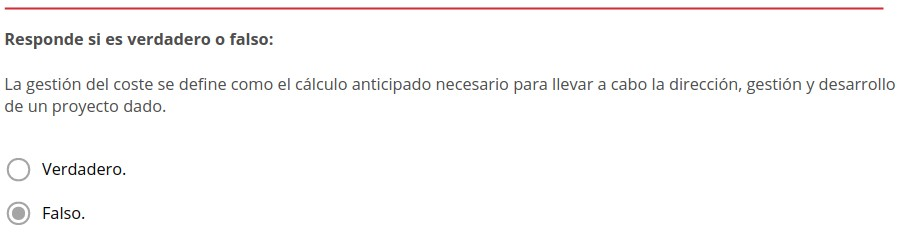

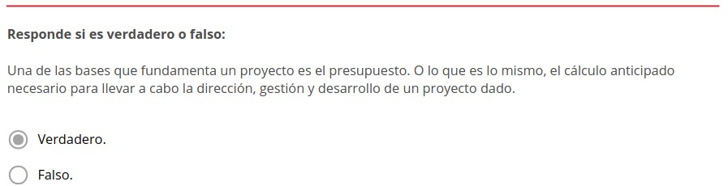

.. figure:: ../../_static/3_metodologias_agiles/3.6_tipos_contratos/actividades/actividad_1_3.jpg
   :width: 70%
   :align: center

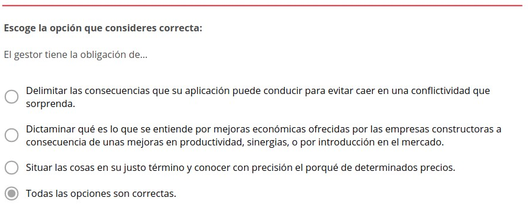

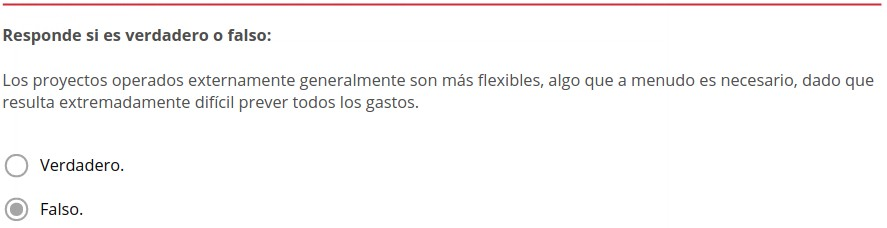

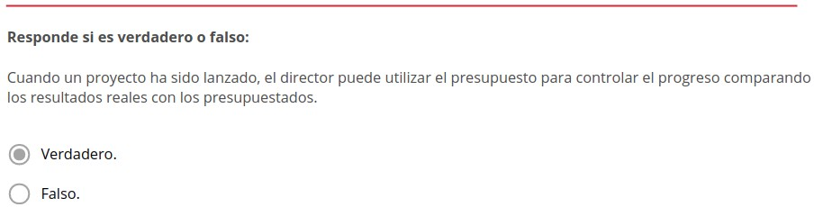

.. figure:: ../../_static/3_metodologias_agiles/3.6_tipos_contratos/actividades/actividad_3_1.jpg
   :width: 70%
   :align: center

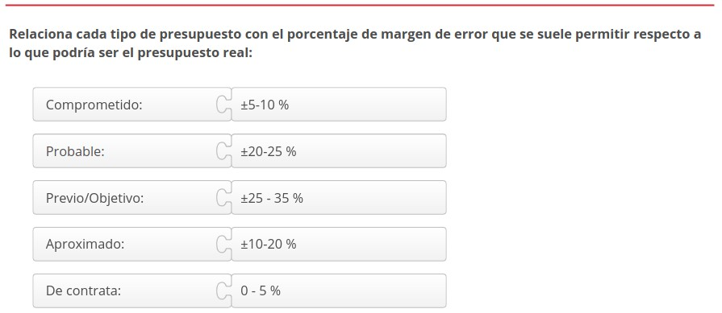

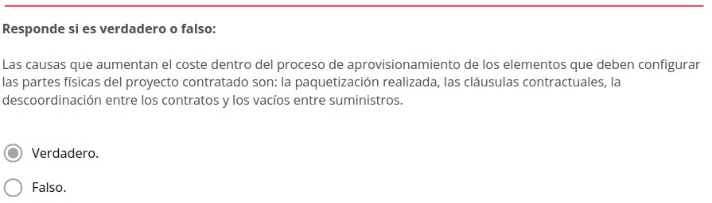

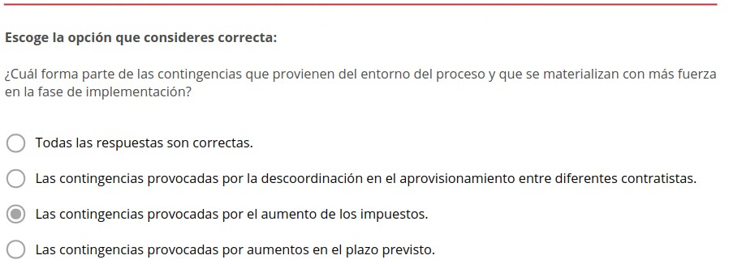

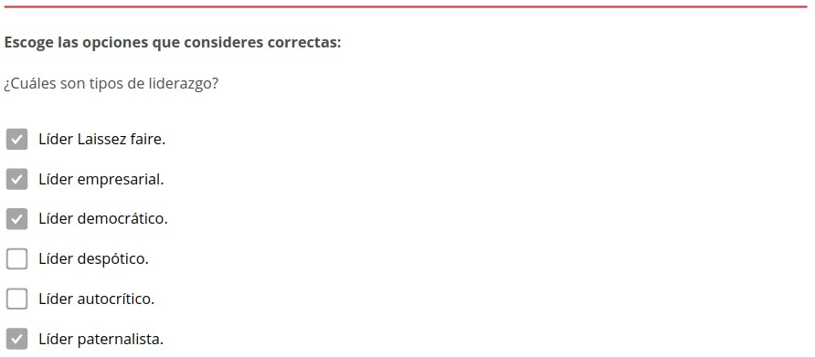

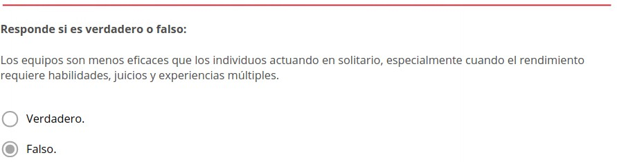

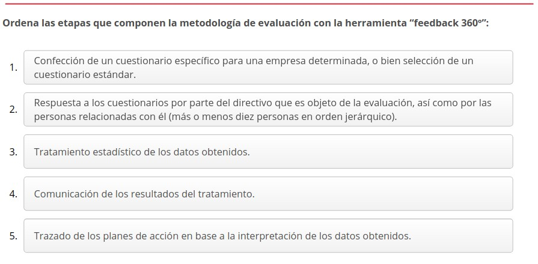

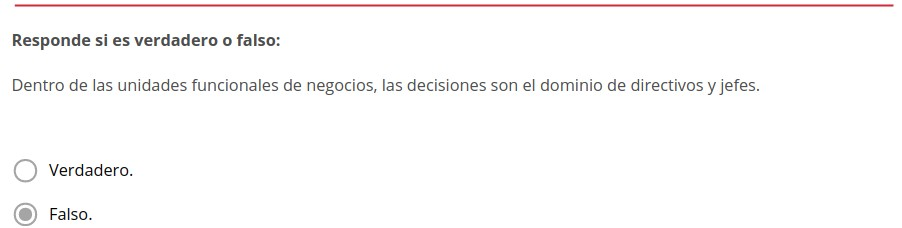

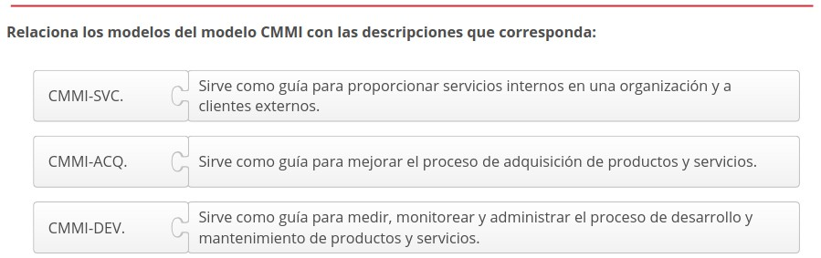

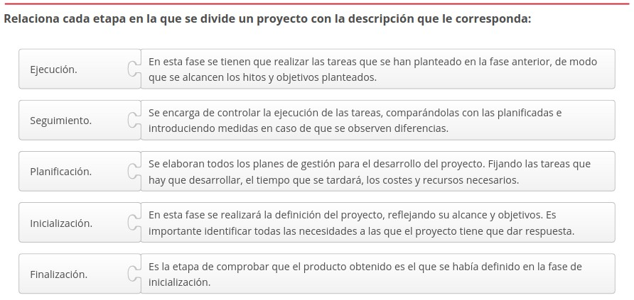

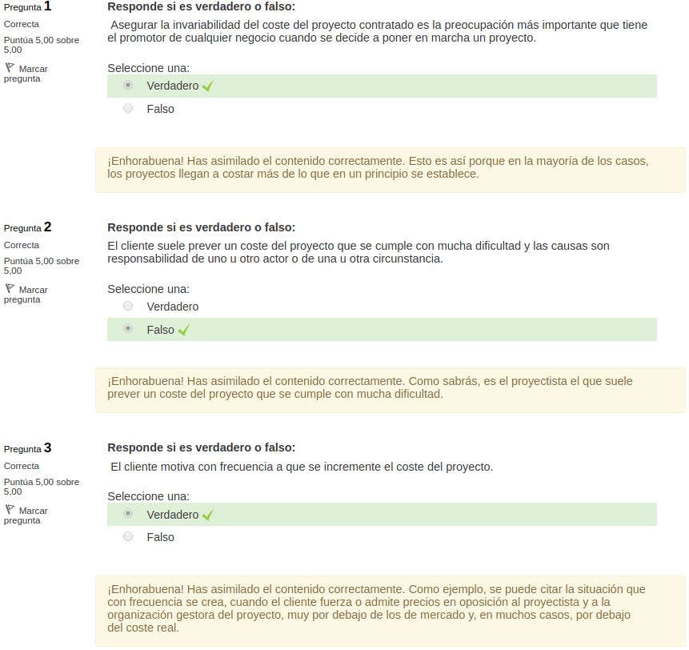

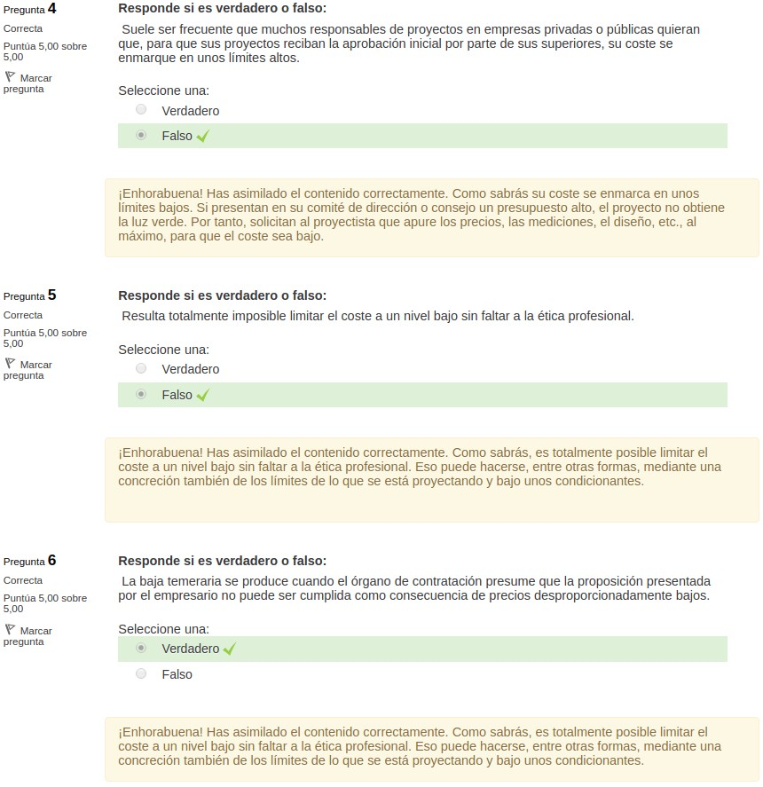

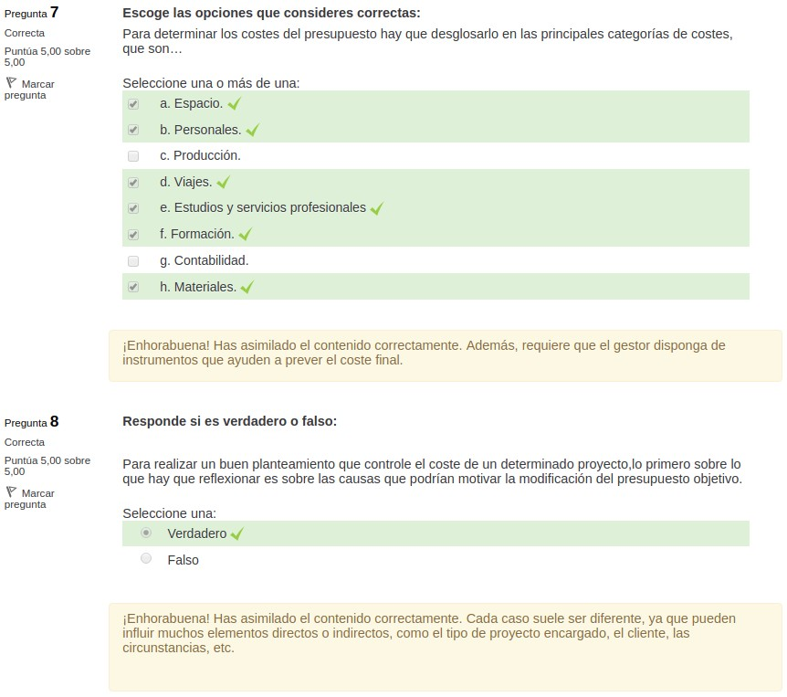

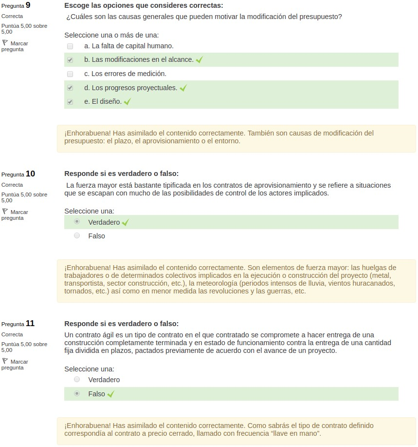

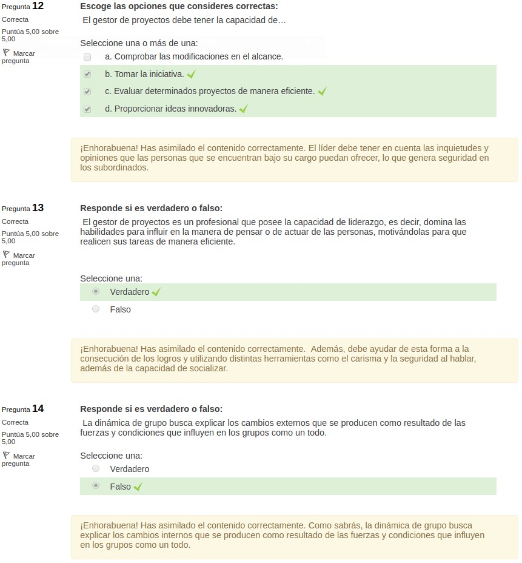

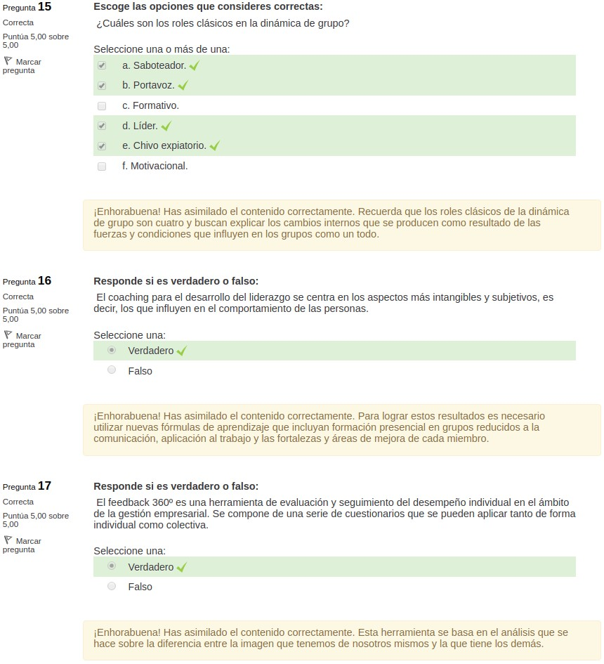

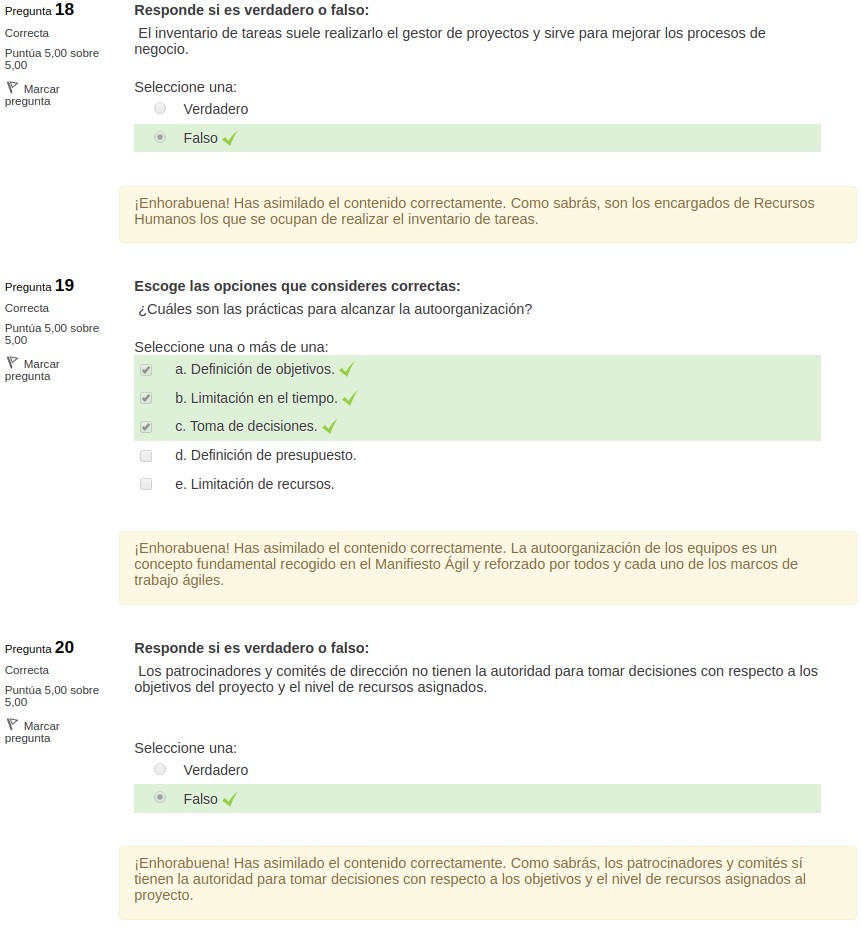
