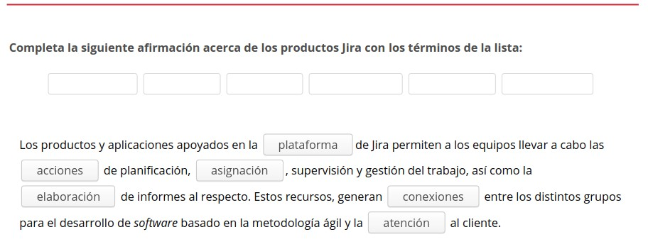

3.7. Herramientas para la gestión
=================================

El hecho de que, hoy en día, la tecnología avance a una velocidad tan considerable origina que dentro del proceso de desarrollo del software se hayan generado una serie de 
necesidades inherentes a todo tipo de proyectos informáticos, como son las entregas rápidas, la facilidad para afrontar las cambios o la implementación de nuevas funcionalidades. Todo esto sin olvidar, que es preciso ofrecer una garantía de calidad en los productos que se están ofreciendo. 

Las herramientas para la gestión basadas en la metodología ágil optimizan la eficiencia productiva y la calidad de los productos finales. Ofrecen una respuesta rápida ante cambios en las aplicaciones y en sus definiciones. Además, brindan una mayor satisfacción al cliente, debido a las entregas tempranas y la retroalimentación continua durante todo el proceso de desarrollo del software. 

.. figure:: ../../_static/3_metodologias_agiles/3.7_herramientas_gestion/mapa_conceptual.jpg
   :width: 70%
   :align: center

1. Jira
*******

**Jira** es una familia de productos creada para ayudar a los equipos con la gestión de su trabajo. Ofrece varias opciones de implementación diseñadas específicamente para el desarrollo de software. 

Se trata de una **herramienta en línea** para la administración de tareas, la localización de errores y la gestión operativa de proyectos. 

Facilita la **visualización de todo el proceso de desarrollo de un proyecto**, como son, los requisitos previos, la planificación del trabajo y el seguimiento de las tareas. 

Jira fue creado por la compañía Atlassian y lanzado al mercado en el año 2004. Se trata de una aplicación web que la empresa comercializa vendiendo los derechos de uso y el precio de estos, dependerá del número de usuarios que vayan a utilizarla.

1.1. Productos Jira
+++++++++++++++++++

.. note:: Los **productos y aplicaciones** apoyados en la plataforma de Jira permiten a los equipos llevar a cabo las acciones de planificación, asignación, supervisión y gestión del trabajo, así como la elaboración de informes al respecto. Estos recursos, generan conexiones entre los distintos grupos para el desarrollo de software basado en la metodología ágil y la atención al cliente. 

Los **tipos de productos que brinda la plataforma Jira** son: 

- **Jira Software**: Planifica, supervisa y realiza software de primera calidad. 
- **Jira Service Desk**: Ofrece a los clientes una forma más sencilla de solicitar soporte; y a los agentes, una manera más rápida de proporcionarlo. 
- **Jira Core**: Gestiona cualquier tipo de proyecto empresarial (campañas de marketing, procesos de formación de nuevos empleados, autorizaciones o revisiones de documentación legal). 
- **Jira Ops**: Para un mayor control, una mejor capacidad de respuesta y menos interrupciones durante los incidentes graves. 

1.2. Jira Software
++++++++++++++++++

.. note:: **Jira software** está diseñado para que todos los miembros de tu equipo de trabajo puedan planificar, supervisar y desarrollar un magnífico software. 

En el **funcionamiento de Jira software**, se usan los tableros y las tablas de Scrum y Kanban, lo que dota a la aplicación de una gran flexibilidad, permitiendo al equipo visualizar cuáles son y cómo se van desarrollando las tareas. 

Los **principales usuarios** son: 

- Desarrolladores de software. 
- Gestores de proyectos. 
- Expertos en Scrum. 

Las **acciones que admite** son: 

- Gestión de proyectos, procesos, productos y tareas. 
- Desarrollo de software ágil. 
- Supervisión de errores. 

Las **principales utilidades que ofrece Jira Software** son: 

- **Gestión de tareas**: Los usuarios pueden crear tareas con toda la información precisa, priorizarlas, asignarlas entre los miembros del equipo y comprobar su evolución.
- **Creación de flujos de trabajo**: Proporciona flujos de trabajo y también permite crearlos nuevos para su seguimiento a través de la aplicación. Su configuración y su gestión se pueden determinar y cambiar en el transcurso del proyecto, activando y desactivando funciones. 
- **Planificación de proyectos**: Admite la programación de todo el trabajo que se va a llevar a cabo durante un proyecto, asignando y priorizando cada una de las tareas. Se adapta a las metodologías ágiles de desarrollo. 
- **Gestión de proyectos**: Administrar todo lo relacionado con el proyecto sin tener que recurrir a otras herramientas. Existe la posibilidad de gestionar proyectos que requieran aplicar metodologías ágiles. 
- **Colaboración entre equipos**:Facilita la cooperación entre los miembros de un equipo y con otros grupos de trabajo. 
- **Visibilidad y notificaciones**: Permite configurar los avisos que desea consultar el usuario y el canal para recibirlos (correo electrónico, chat o teléfono móvil). Así, la persona usuaria siempre estará informada. 
- **Interfaz móvil**: Para que el equipo esté informado constantemente con independencia de la hora y el lugar. Funciona a través del navegador, por lo que no son necesarias instalaciones en el terminal móvil. 
- **Gestión de repositorios de código integrado**: La propia herramienta se encarga de administrar el repositorio de código generando automáticamente las acciones necesarias para que este, se encuentre protegido y bien organizado. 
- **Importación de datos de otras herramientas de planificación**: Es útil si antes de implantar Jira se ha usado otro gestor de tareas o incidencias. La empresa evita así, perder datos anteriores y puede continuar trabajando desde el punto donde lo dejó. 

Jira software está disponible para **dos modalidades de alojamiento**: en la nube o autogestionado. **Según la opción de alojamiento se clasifica en**: 

- **Cloud**: Se aloja y configura el sitio web de Jira software en la nube. Suele ser la mejor elección para aquellos equipos que deseen empezar a trabajar rápida y fácilmente, o que no quieran asumir la complejidad técnica que supondría realizarlo ellos mismos. 
- **Server**: Se establece en el propio hardware del usuario y se puede personalizar la configuración. Acostumbra ser una buena opción, para los equipos que necesitan gestionar todos los detalles, que tienen requisitos más exigentes en cuanto a administración de datos y no les preocupa la complejidad adicional que supone responsabilizarse de su alojamiento. 
- **Data center**

Jira Agile, anteriormente conocido como GreenHopper, agrega una gestión ágil de proyectos a cualquier desarrollo con Jira. Permite visualizar el proceso existente e impulsar rnejoras. 

1.3. Usando Jira
++++++++++++++++

Para comenzar a trabajar con la aplicación Jira es preciso **crear los usuarios de**: 

- **Un administrador de la plataforma**, que puede ser o no un componente del equipo. 
- **Cada miembro del equipo de desarrollo**

.. note::  El elemento de trabajo básico en Jira es el **proyecto de tipo software**. Debe crearse un proyecto por cada aplicación en la que se trabaje o si, el equipo de trabajo es muy grande, se podrán establecer tantos proyectos como equipos existan en nuestra organización. 

El dueño del producto no tiene por qué estar dado de alta en la herramienta, pero, si fuera requerido, podría ser un usuario en modo de consulta. 

1.3.1. Incidencias
------------------

.. note:: El componente principal que utiliza Jira para gestionar los proyectos son las **incidencias**, pero no hay que confundir este término con el registro de los errores que tiene esta herramienta. Se denomina a cada elemento de trabajo, incidencia, sin importar que sea un error, una nueva funcionalidad, una historia o una tarea técnica. 

Cuando se crean las incidencias en la aplicación, es primordial efectuar **estimaciones temporales** de las mismas, para así, poder administrar adecuadamente el proyecto. 

Las **subtareas** son acciones específicas que es preciso realizar cuando se trabaja en una incidencia. La incidencia sería la descripción que hace el usuario de la funcionalidad y las subtareas son todo aquello requerido para llevar a cabo dicha incidencia. 

1.3.2. Product backlog 
----------------------

.. note:: El **Product backlog** es uno de los recursos que se utiliza en la metodología Scrum. Consiste en una lista ordenada de requerimientos y necesidades a desarrollar y que van aportando valor a medida que van siendo acometidos. 

Al crear el proyecto automáticamente, se genera el backlog que es como en esta aplicación se denomina al **Product backlog**. La forma de poder **gestionar el backlog es desde la opción trabajo pendiente**. Desde este apartado **se podrá**: 

- Crear nuevos requerimientos.
- Modificar los requerimientos ya generados. 
- Obtener una lista de requerimientos. 

Es **imprescindible asignar una prioridad** a todo trabajo incluido en el backlog. Así, todo el equipo conoce la importancia que el dueño del producto otorga a cada una de las incidencias pendientes de ejecución. 

1.3.3. Sprints 
--------------

.. note:: El **sprint de Scrum** se define como un conjunto de tareas que se desarrollan en un periodo de tiempo no superior a un mes. Para darlo por concluido será preciso efectuar una entrega o prototipo completamente funcional. 

Jira es necesario **realizar una ordenación del trabajo** para poder empezar a desarrollar las funcionalidades. Se ejecutarán una serie de pasos para dar de alta el sprint en la herramienta y asignar las tareas. 

1.3.4. Análisis de resultados 
-----------------------------

.. note:: Para ser óptimos en la rentabilidad de la herramienta Jira, se deberán observar y analizar de forma objetiva los **resultados relacionados con la eficiencia del equipo**. 

La aplicación ofrece una serie de **diagramas de evolución y velocidad**. Se trata de información esencial de cómo trabaja el equipo (ritmo del equipo, grado de compromiso, bloqueos, etc.). 

En Jira se podrán **consultar una serie de indicadores para determinar la**:

- Evolución del trabajo en el equipo Scrum. 
- Evolución de las incidencias completadas. 
- Velocidad respecto a lo comprometido. 

2. Pivotal Tracker 
******************

.. note:: **Pivotal Tracker** es una herramienta de gestión de proyectos ágiles creada por expertos en desarrollo de software con una metodología ágil. Es de fácil manejo y posibilita la colaboración en tiempo real gracias a un registro compartido. Permite a la empresa generar productos de calidad a mayor velocidad y continuar desempeñándose en un mercado cambiante. 

De la herramienta Pivotal Tracker se pueden destacar las siguientes **características**: 

- Es de **bajo coste y no posee limitaciones** a nivel de licencias o de tipo de empresa usuaria. 
- Al posibilitar un **alojamiento en la nube**, sin instalaciones en los ordenadores. 
- Se centra en: la **gestión de la pila de producto y las métricas**. 
- Se puede usar para trabajar con **equipos descentralizados**, puesto que está en internet. 
- Permite la **creación de distintos perfiles de acceso**. Uno de ellos, es el que autoriza a un usuario para visualizar el contenido pera no modificarlo. 
- Guarda un **histórico de las acciones realizadas**. Aspecto importante cuando se posee una certificación de calidad que requiere disponer de la trazabilidad del trabajo. 

2.1. Historias 
++++++++++++++

Cada proyecto comienza con una historia, no importa lo que se esté construyendo. **Pivotal Tracker** ayuda al equipo a desarrollarse mejor y hacer un seguimiento de su trabajo mientras avanzan desde el inicio hasta la entrega del producto. 

.. note:: Una **historia** es un trabajo pequeño y procesable que se convierte en un marcador de posición para la toma de decisiones o en un indicador de lo que ya se realizó. 

Se recomienda escoger entre priorizar las funciones, los errores o las tareas para alcanzar un **equilibrio**. Determinando si es preciso crear nuevas funciones, adelantarse a la deuda técnica o evitar que los errores se acumulen. 

En función de la complejidad de la historia, el equipo de trabajo debe realizar estimaciones en cuanto a **priorización**. 

2.2. Velocidad de trabajo 
+++++++++++++++++++++++++

.. note:: Pivotal Tracker **calcula la velocidad de trabajo** del equipo a partir del número promedio de puntos de historia completados en las iteracione. El trabajo previo proporciona una visión honesta del rendimiento futuro.

Esta aplicación suscita en los equipos un **ritmo laboral saludable**. Con una velocidad más sostenible, el grupo puede ejecutar mejor sus funciones y mantener el ciclo de retroalimentación.

2.3. Organización de proyectos 
++++++++++++++++++++++++++++++

En lo referente a la **organización de los proyectos**, la herramienta Pivotal Tracker ofrece las siguientes **utilidades**:

- **Espacios de trabajo** para exponer los proyectos en paralelo, obteniendo así, una visualización accesible de toda su actividad laboral. Permite mover historias entre proyectos y localizar rápidamente pedidos pendientes. 
- **Mantenimiento de todo el trabajo junto**, incluso cuando se trabaje con varios equipos. 
- Acceso instantáneo a una **vista panorámica** para comprobar el funcionando del equipo de trabajo. 
- **Identificación de tendencias o fluctuaciones** de alto nivel que evidencian la realidad del equipo, mediante informes de Burnup, flujo acumulativo o tiempo de ciclo. 
- Obtención de **datos específicos** que posibilitan el diagnóstico y la eliminación de los cuellos de botella. 
- **Informes** para examinar y profundizar más en el estado de un proyecto. 

2.4. Otras funciones 
++++++++++++++++++++

Pivotal Tracker es multifuncional, proporcionando al usuario todo lo necesario para desarrollar el mejor producto. **Otras funcionalidades** que nos ofrece esta herramienta son: 

- **Compartición de archivos**: distribución de presentaciones y otro tipo de documentos desde el propio ordenador o adjuntándolos a través de Google Drive. 
- **Tareas**: actualización de las actividades pendientes en la historia con una simple lista de verificación. 
- **Etiquetas**: monitorización y organización de historias con etiquetas de búsqueda para visibilizar el flujo de trabajo y resaltar acciones. 
- **Bloqueadores de historias**: destacan los obstáculos del proyecto para que el equipo pueda colaborar en su resolución. 
- **API**: la interfaz de programación de aplicaciones Api rest posibilita la creación de una variedad de herramientas e integraciones. 
- **Historia del proyecto**: análisis de todo lo que sucedió en un proyecto desde el primer dia para comprobar cómo las modificaciones en el código condicionan las decisiones sobre el producto. 

3. LeanKit kanban 
*****************

.. note:: **LeanKit kanban** es una herramienta software que implementa un tablero Kanban. Este, es totalmente amoldable al flujo de trabajo porque permite configurar el número de columnas en función de las circunstancias. Se ofrece en multiplataforma y para poder utilizarla, se necesita adquirir una licencia de uso. 

LeanKit kanban admite la **implementación de principios, prácticas y metodologías de trabajo Lean** en todas sus funciones; ayudando a crear en las organizaciones, un entorno de mejora continua e innovación que proporcione valor al cliente, de una forma más rápida. 

Al** visualizar las tareas a medida que avanzan** por el proceso, LeanKit brinda una comprensión general de la actividad laboral que ayuda a los equipos a trabajar juntos de manera más efectiva. 

LeanKit kanban ofrece diferentes vistas del flujo de trabajo en función del departamento que consulte el tablero

En LeanKit kanban se representan las tareas mediante **tarjetas**. En estas, se pueden especificar una serie de atributos que nos proporcionarán más información relativa a esta tarea. Algunas de estas **características son**:

- **Título**
- **Descripción**
- **Estado**: bloqueado o desbloqueado
- **Tipo**: definido por los administradores
- **Tamaño**: un número positivo y significado variará dependiendo del equipo.
- **Fecha de inicio y fin**
- **Prioridad**
- **Icono personalizado**

La herramienta LeanKit Kanban ofrece a las **empresas y a sus equipos de trabajo** una serie de **beneficios**: 

- **Visualizar**: cómo fluye el trabajo permite definir y avanzar en el proceso mediante la utilización de tableros Kanban virtuales. Se usan carriles verticales para percibir cada paso en el flujo y horizontales para representar procesos paralelos en un mismo tablero. 

- **Referencia**: Un lugar de referencia Ayudando a los equipos a mantenerse conectados e informados, con independencia de si se encuentran en la misma sala o repartidos geográficamente. Reduciendo así, el riesgo de malentendidos, descuidos y retrasos y facilitando la formulación de preguntas y la constatación de las actualizaciones de estado. 
- **Informes**: Actualización Informes y análisis de gran alcance Posibilitan la identificación de oportunidades de mejora continua. Se puede examinar la efectividad del proceso utilizando métricas sobre el flujo, la calidad, el rendimiento o el tiempo de entrega. Están disponibles informes acumulados a nivel de equipo y de empresa, con la opción de combinar los datos de LeanKit con otros datos de la organización. 
- **Coordinación**: Coordinación en el flujo de trabajo Organización de la actividad en los equipos y entre los equipos para mejorar la entrega de valor al cliente. Brinda a todos los miembros del equipo y a las partes interesadas del proyecto una comprensión compartida del trabajo, proporcionando un nivel elevado de visibilidad y detalle para seguir el progreso e identificar posibles anomalías. 
- **Actualización**: Actualizaciones de estado y nueva información pueden ocurrir en cualquier momento, por lo que es crucial estar advertido y comunicar inmediatamente estos cambios al resto del equipo. Se puede acceder fácilmente a LeanKit en cualquier momento y lugar desde el navegador de un dispositivo móvil, lo que permite verificar el estado, publicar actualizaciones y añadir comentarios en tiempo real. 

Se han efectuado diferentes aportaciones y mejoras orientadas al producto, al proceso o al personal. Pero, cada uno de estos enfoques, denominados las 3P's, han tenido un éxito parcial y relativo en el desarrollo de software. 

4. Kanbanery 
************

.. note:: **Kanbanery** es una herramienta flexible para la gestión de proyectos y flujos de trabajo. Se trata de otra solución que ofrece un tablero virtual fundamentado en la filosofía Kanban. Aunque su principal objetivo es la administración de planes de desarrollo software, se adapta a cualquier contexto laboral. 

La **herramienta Kanbanery** ofrece a la persona usuaria las siguientes **ventajas**: 

- Se comercializa en **versiones web, iPhone y Android** para favorecer su utilización en todo momento. 
- Muestra una **visualización rápida y exacta** de todo lo que sucede en el proyecto. 
- Facilita la **organización y el control** de los proyectos en tan solo unos minutos. 
- Se **constatan progresos** significativos todos los días. 
- Es **fácil de usar**. Se comienza con plantillas de tableros y luego, se ajustan según las necesidades. 
- Permite **personalizar el tablero** con las columnas necesarias en función del flujo de trabajo del proyecto. 
- Ofrece la opción de **seguimiento de una tarea** por correo electrónico para poder recibir notificaciones. 
- Posibilita una comunicación eficaz mediante **chat, comentarios o marcadores**. 
- Emite **informes y gráficos del flujo** de trabajo aplicando diferentes filtros, simplifican las labores de detección de los cuellos de botella y maximización del rendimiento en el proyecto. 

La herramienta Kanbanery ha sido creada por la empresa de desarrollo de software Lunar Logic Polska. Está disponible bajo licencia de uso y su precio varía en función del número de interesados en la utilización de la aplicación. 

4.1. Plantillas 
+++++++++++++++

.. note:: Kanbanery está configurado con un **conjunto de plantillas** de proyecto estándar para ayudar al usuario en sus inicios. La flexibilidad de esta herramienta, permite modificar todas sus opciones para proporcionarles un enfoque más personalizado. 

Las **plantillas predeterminadas** pueden no reflejar el modo de trabajo del equipo, por lo que será preciso adaptar los diferentes pasos del flujo de trabajo para evidenciarlo y así, ayudar a visualizar el proceso. 

Kanbanery es **altamente modificable**. Las columnas, que indican los pasos en el flujo de trabajo, se pueden agregar, renombrar o eliminar y, opcionalmente, añadirles un límite trabajo en curso (WIP). 

4.2. Agregar tareas 
+++++++++++++++++++

.. note:: Las **tareas** se agregan haciendo clic en el icono en la parte superior de la primera columna. Esta acción posibilita la apertura de un nuevo diálogo con más opciones para personalizarlas. 

Una tarea, como mínimo, necesita tener un **título**. Este será de utilidad, siempre y cuando, sea comprensible por parte de los usuarios. Se puede añadir otra información para dotarla de sentido. 

En el tablero del proyecto, **las tareas se pueden mover**, hacia delante y hacia atrás, a través del flujo de trabajo sin ningún tipo de restricción. De manera automática, el usuario que efectúe una variación de esta clase, pasa a ser su propietario, pero este condicionante se puede modificar. 

Para establecer la **prioridad de las tareas**, se desplazan estas, hacia arriba y hacia abajo, dentro de sus respectivas columnas. Situando la más importante en la parte superior. 

5. Resumen
**********

- Jira es una familia de productos creada para ayudar a los equipos con la gestión de su trabajo. Brinda varias opciones de implementación diseñadas específicamente para el desarrollo de softv,'are, que posibilitan llevar a cabo acciones de planificación, asignación, supervisión y gestión del trabajo, así como de elaboración de informes al respecto 
- Pivotal Tracker es una herramienta de gestión de proyectos ágiles creada por expertos en desarrollo de software con una metodología ágil. Es de fácil manejo y posibilita la colaboración en tiempo real gracias a un registro compartido. Permite a la empresa generar productos de calidad a mayor velocidad y continuar desempeñándose en un mercado variable. 
- La herramienta software LeanKit kanban, implementa un tablero Kanban. Este, es totalmente amoldable al flujo de trabajo porque admite configurar el número de columnas en función de las necesidades. Se ofrece en multiplataforma y para poder utilizarla, se necesita adquirir una licencia de uso. 
- Kanbanery es una herramienta flexible para la gestión de proyectos y flujos de trabajo. Se trata de otra solución que proporciona un tablero virtual fundamentado en la filosofía Kanban. Aunque principal objetivo es la administración de planes de desarrollo software, se adapta a cualquier contexto de trabajo. 

6. Actividades
**************

.. figure:: ../../_static/3_metodologias_agiles/3.7_herramientas_gestion/actividades/actividad_1_2.jpg
   :width: 70%
   :align: center

.. figure:: ../../_static/3_metodologias_agiles/3.7_herramientas_gestion/actividades/actividad_1_3.jpg
   :width: 70%
   :align: center

.. figure:: ../../_static/3_metodologias_agiles/3.7_herramientas_gestion/actividades/actividad_2_1.jpg
   :width: 70%
   :align: center

.. figure:: ../../_static/3_metodologias_agiles/3.7_herramientas_gestion/actividades/actividad_2_2.jpg
   :width: 70%
   :align: center

.. figure:: ../../_static/3_metodologias_agiles/3.7_herramientas_gestion/actividades/actividad_2_3.jpg
   :width: 70%
   :align: center

.. figure:: ../../_static/3_metodologias_agiles/3.7_herramientas_gestion/actividades/actividad_2_4.jpg
   :width: 70%
   :align: center

.. figure:: ../../_static/3_metodologias_agiles/3.7_herramientas_gestion/actividades/questionnaire_2.jpg
   :width: 70%
   :align: center

.. figure:: ../../_static/3_metodologias_agiles/3.7_herramientas_gestion/actividades/questionnaire_3.jpg
   :width: 70%
   :align: center

.. figure:: ../../_static/3_metodologias_agiles/3.7_herramientas_gestion/actividades/questionnaire_4.jpg
   :width: 70%
   :align: center
