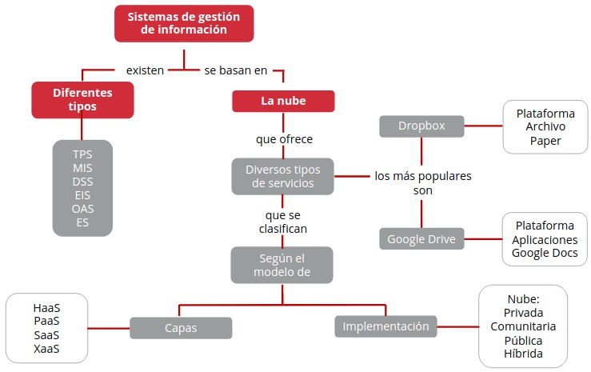
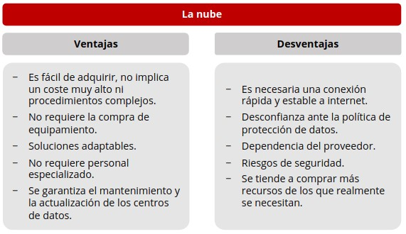
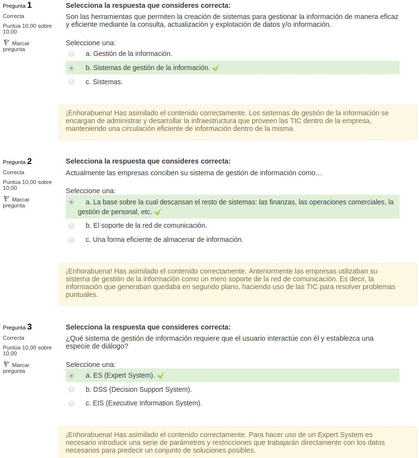
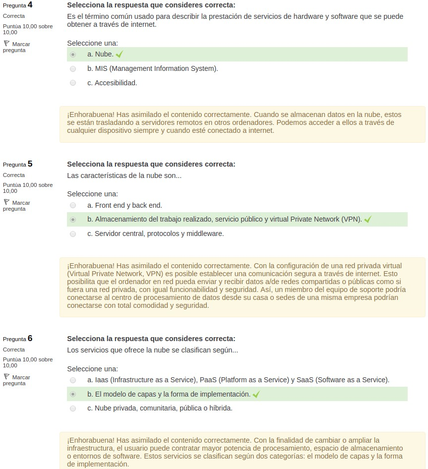
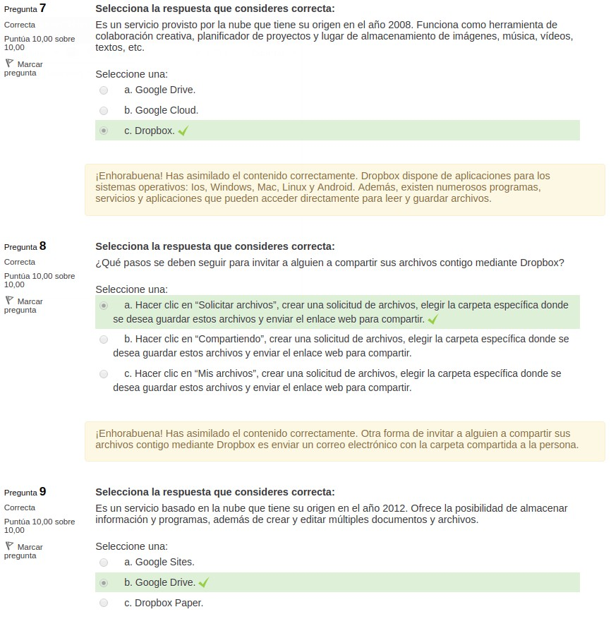
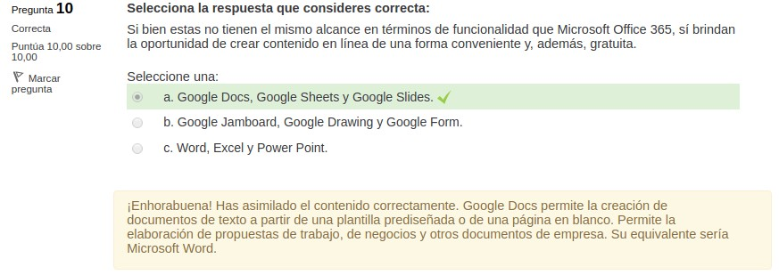

4.2. Sistemas de gestión de información
=======================================

1. Sistemas de gestión de la información
****************************************

.. note:: Un **sistema de información** es una serie de procedimientos cuya finalidad es la organización, recuperación y procesamiento de datos y/o información de manera eficaz y eficiente. 

Un **sistema** es un conjunto de elementos, bien sea conceptuales o materiales, que se relacionan entre sí y sirven a un propósito determinado. Un sistema **tiene** una estructura, una composición y un entorno específicos. 

.. note:: La **gestión de la información** es el conjunto de procesos que determina las distintas etapas por las cuales pasa la información, desde su creación o captura hasta su eliminación o conservación. Durante este lapso de vida la información puede ser extraída, depurada, combinada y distribuida. 

La **información debe preservar** su integridad, confidencialidad y disponibilidad a lo largo de este proceso. 

.. note:: Los **sistemas de gestión de información** son las herramientas que permiten la creación de sistemas para gestionar la información de manera eficaz y eficiente mediante la consulta, actualización y explotación de datos y/o información. 

Es importante distinguir entre **datos e información**: 

- **Datos**: 

	- Es un atributo objetivo, puede ser cualitativo o cuantitativo. 
	- Son hechos, cifras que no han sido estudiadas ni analizadas. 
	- No impulsan a la acción. 

- **Información**: 

	- Es el producto que resulta del análisis lógico aplicado a un conjunto de datos. 
	- Disminuye la inseguridad, la duda. 
	- Induce a la acción. 

.. note:: Las **Tecnologías de la información y comunicación (TIC)** son el conjunto de tecnologías donde convergen la informática, la electrónica, la microelectrónica y las telecomunicaciones, dando origen a nuevos sistemas tecnológicos que posibilitan adquirir, almacenar, procesar, evaluar, transmitir y distribuir la información. 

Las **TIC tienen múltiples aplicaciones hoy día**. Sobre todo en una sociedad como la actual, que genera y consume una enorme cantidad de información. Actualmente existe la necesidad de **nuevas herramientas** que permitan procesar la información a la velocidad requerida. 

Actualmente todas las **empresas hacen uso de las TIC**, pero es importante observar cómo incorporan esta tecnología para desarrollar su trabajo. Los **sistemas de gestión de información integran dos disciplinas**: la gestión documental o archivística y las tecnologías de la información y comunicación (TIC). 

Los **sistemas de gestión de información se encargan** de administrar y desarrollar la infraestructura que proveen las TIC dentro de la empresa, manteniendo una circulación eficiente de información dentro de la misma. 

Las **empresas también necesitan información externa** para tomar decisiones. No solo requieren información rápida, exacta y completa sobre los datos de su negocio. También necesitan datos respecto al mercado, sus competidores, la legislación vigente, etc. 

Esta **información puede generar cambios** de orden interno: las actividades y los procedimientos en que se fundamenta la compañía, y de orden externo: los factores en los que se basa su competitividad. 

"La medición es el primer paso para el control y la mejora. Si usted no puede medir lo que hace, no puede controlarlo. Si no puede controlarlo, no puede dirigirlo. Si no puede dirigirlo, no puede mejorarlo" (James Harrington). 

1.1. Gestión de información en la empresa
+++++++++++++++++++++++++++++++++++++++++

En la actualidad las **empresas deben cuidar** su personal, sus recursos económicos y su información.

Anteriormente las empresas utilizaban su **sistema de gestión de información como un mero soporte** de la red de comunicación. Es decir, la información que generaban quedaba en segundo plano, haciendo uso de las TIC para resolver problemas puntuales. 

Ahora las empresas conciben su **sistema de gestión de información como la base** sobre la cual descansan el resto de sistemas: las finanzas, las operaciones comerciales, la gestión de personal, etc. 

Para poner en marcha un sistema de esta envergadura, capaz de dar soporte al resto de sistemas, es necesario hacer uso del  **cloud computing o de la nube**.

La **nube brinda la infraestructura necesaria** para alojar y permitir el desarrollo de sistema de gestión de información que aporten las soluciones que requieren las empresas actualmente.

Según el tipo de usuario al que van destinados y su función principal, **los sistemas de gestión de información se dividen** en:

- **TPS (Transaction Process System)**: sistema de procesamiento de transacciones. 
- **MIS (Management Information System)**: sistemas de información gerencial. 
- **DSS (Decision Support System)**: sistemas de soporte de decisiones. 
- **EIS (Executive Information System)**: sistemOas de información ejecutiva. 
- **OAS (Office Automation System)**: sistemas de automatización de oficinas. 
- **ES (Expert System)**: sistemas expertos. 

.. note:: El **Transaction Processing System (TPS)** efectúa y registra las transacciones habituales que se realizan diariamente en la empresa. 

Tiene un **carácter básico** y está diseñado para operar en el **nivel de jerarquía más bajo**, dando soporte a las tareas rutinarias del negocio. Recoge la información que necesita cualquier empresa para desempeñarse correctamente. 

**Ejemplos de TPS**: ERP (Enterprise Resources Planning) y CRM (Customer Relationship Management). 

Una página web que vende entradas para el teatro utiliza un TPS. El sistema es el encargado de que no se produzcan errores. Si hay dos personas interesadas en ocupar la misma localidad y ambas proceden a realizar la operación de compra, el sistema debería registrar una de ellas con éxito y anular la otra. De este modo, no se generaría una reventa de localidades. 

1.1.1. TPS
----------

Las **características del TPS** son: 

- Manejan **grandes volúmenes de datos**, por lo que requieren una base de datos muy potente para almacenarlos y un procesador de datos veloz capaz de tratarlos con la agilidad que se requiere. 
- Trabaja con **datos rutinarios**, bien sea el resultado de operaciones diarias o semanales. 
- Utilizan **programas estadísticos y matemáticos**, por lo que no suelen realizar operaciones muy complejas. 
- Generalmente, recopilan los** datos del interior de la empresa**. 
- Un **fallo en el sistema o alguna pérdida de datos** ocasionaría graves problemas a la empresa. 

1.1.2. MIS
----------

.. note:: El **Management Information System (MIS)** simplifica y presenta los datos proporcionados por los sistemas de procesamiento de transacciones (TPS). Apoyan las labores de **planificación, comprobación y toma de decisiones** debido a la producción de informes regulares. 

Una comparación de gastos e ingresos tomando como partida el presupuesto inicial a lo largo de varios meses consecutivos. 

Las **características del MIS** son: 

- **Información**: El sistema se limita a **exponer la información**, sin mayor análisis. La interpretación de los datos recae en el responsable. 

- **Poco flexibles**.

- **Datos**: Se apoya en **datos vigentes**, que usualmente son aportados por los sistemas de procesamiento de transacciones.

- **Resoluciones**: Avalan las **resoluciones orgánicas** de directivos de nivel medio a través del análisis de datos (casi siempre de carácter interno) presentes o pasados. 

1.1.3. DSS
----------

.. note:: El **objetivo del Decision Support System (DSS)** es resolver problemas puntuales usado bases de datos complejas y modelos creados con anterioridad. **Provee la información necesaria** para para tomar decisiones significativas. 

Para aprobar al lanzamiento de un nuevo producto al mercado hay que tener en cuenta: si hay productos similares en el mercado, el costo unitario del producto, el costo de producción, el pronóstico de ventas en un lapso determinado, los posibles riegos que se corren al llevar a cabo el lanzamiento, etc. Toda esta información la puede proporcionar un DSS. 

Las **características del DSS** son: 

- **Herramientas**: utiliza herramientas muy complejas de modelización y de estudio de datos que dan soporte a decisiones en distintos niveles del proceso. 
- **Usuarios**: Puede ser usado por distintos usuarios, ya que es muy sencillo de utilizar y se puede emplear para analizar distintas situaciones. 
- **Información**: Es muy flexible en el** modo de suministrar la información**. Por lo tanto, puede analizar variedad de situaciones con escasa presencia de programadores informáticos especializados que desarrollen pequeños programas especificas. 
- **Procesos**: Puede examinar tanto situaciones independientes como una serie de procesos secuenciales, permitiendo, incluso, cambiar las condiciones originales. 
- **Decisiones**: Ayuda a tomar **decisiones** cuyos efectos no se pueden pronosticar con antelación. 

1.1.4. EIS
----------

.. note:: Los **Executive Information Systems (EIS)** han sido diseñados especialmente para ejecutivos y directivos, ya que trabaja con grandes cantidades de información de diferente índole (externa e interna) a una velocidad bastante rápida. Es decir, han sido pensados para personas con poca disponibilidad de tiempo y con poca destreza con ordenadores. 

Presenta la **información de forma muy sintética**, mediante sumarios, esquemas o gráficos. Lo que aumenta la facilidad de manipulación. 

Presenta la **información en formatos amables**, como hojas de cálculo, que son bien conocidas por ellos.

Un EIS permite deshacerse de la carga que implicaba la **revisión de informes semanales o mensuales** para conocer el estado de la empresa o su situación en relación a sus competidores. Por ello es una herramienta es sumamente útil para cargos directivos. 

Gracias a los EIS, los **informes obsoletos no tienen cabida**. Esperar por un informe que no tendrá relevancia al momento de su entrega es impensable para un ejecutivo actual. Estos deben tomar decisiones rápidas basándose en gran cantidad de información. Por lo tanto, no pueden esperar hasta la entrega del informe correspondiente. 

Un EIS permite realizar **mejores consultas**, más concretas y más veloces, en distintos momentos. Además, permite que el usuario ahonde en las áreas que le interesan y pase de soslayo sobre aquellas que no le preocupan. 

Para un ejecutivo es fundamental **estar actualizado y tomar decisiones claves** en el momento adecuado. Con un EIS puede adaptarse mejor a los constantes cambios que enfrentan las empresas dia a día. 

Gracias a los EIS una gran multinacional podría obtener en muy corto tiempo un mapa geográfico que destaque los países donde tiene sede y el volumen de ventas de cada una de ellas en un lapso especifico de tiempo. 

Las **características del EIS** son: 

- **Ejecutivos**: Han sido diseñados para atender los requerimientos de ejecutivos y cargos directivos. 
- **Herramientas**: Utilizan sofisticadas herramientas de análisis y modelos de predicción. 
- **Sencillez**: Son sencillos de usar, no se requiere mucha experiencia con ordenadores ni apoyo para trabajar con ellos. 
- **Información**: Presentan la información de forma clara y descriptiva. 

1.1.5. OIS
----------

.. note:: Los **Office Information Systems (OIS)** se utilizan en casi todas las oficinas actuales. Sirven para procesar información y elaborar diversos tipos de archivos que requieren ser almacenados posteriormente. 

Algunos **programas que incluyen OIS son**: bases de datos, hojas de cálculo, sistemas de procesamiento de texto e imágenes y programas para la realización de presentaciones. Ejemplos: Documentos de texto, hojas de cálculo y presentaciones. 

Las **características del OIS** son: 

- **Popular**: Son los más populares. 
- **Accesible**: Están prácticamente al alcance de todos. 
- **Procesa información**: Se usan para procesar información y elaborar diversos tipos de archivos. 
- **Almacena datos**: Permite el **almacenamiento** y posterior **uso de estos archivos**. 

1.1.6. ES
---------

.. note:: **Turban, Mclean y Wetherbe** describen el funcionamiento de un **Expert System (ES)** del siguiente modo: "La habilidad (conocimiento) se transfiere del experto al ordenador. Este conocimiento se almacena en el ordenador. Los usuarios pueden pedir consejo al ordenador acerca de una cuestión especifica. El ordenador realizará las transacciones necesarias y llegará a una conclusión. Por último, igual que un experto, informa a los no expertos y, si se considera necesario, explica la lógica que se esconde detrás del consejo". 

Los **ES proveen información especializada**. Difícilmente una persona sin un alto nivel de experticia podría ofrecer este tipo de información, pues trabaja con unas reglas y representaciones del conocimiento muy específicos.

Para **hacer uso de un ES es necesario** introducir una serie de parámetros y restricciones que trabajarán directamente con los datos necesarios para predecir un conjunto de soluciones posibles. 

Los **ES son utilizados por** personas que desean mantener su nivel de expertos, por aquellas personas que no son versados en el área del problema que desean solucionar y por aquellas personas que necesitan tomar una decisión muy importante y requieren ayuda. 

Los **sistemas del conocimiento** también suelen agruparse dentro de esta categoría. Estos representan el conocimiento para ser empleado automáticamente bajo fórmulas condicionales de tipo: "si se hace esto, entonces, ocurrirá lo siguiente".

**Se debe interactuar con el ES**, estableciendo una especie de diálogo. El usuario debe introducir los datos y las reglas necesarias para el análisis que se llevará a cabo. Los SE no sustituyen a las personas expertas. 

Usualmente cuando una compañía enfrenta una decisión difícil, como la salida a un nuevo mercado o la compra de un equipo, acuden a un experto. Este es una persona con un alto nivel de experticia en el área, que conoce los riesgos de tomar o no esa decisión y que aconseja a la empresa al respecto. Los ES brindan cierto margen de autonomía a la empresa para tomar este tipo de decisiones. 

Las **características del ES** son: 

- **Usuario**: El usuario debe interactuar con el SE. Usuario o Análisis o Uso 
- **Análisis**: Su **análisis se basa** en las representaciones del conocimiento almacenadas, en los datos iniciales necesarios para efectuar el trabajo y en una serie de órdenes introducidas previamente. 
- **Uso**: Son **usados por** expertos, personas con pocos conocimientos en el área y para la toma de decisiones. Usuario Análisis Uso 

1.2. Condiciones y ventajas de los sistemas de gestión de la información
++++++++++++++++++++++++++++++++++++++++++++++++++++++++++++++++++++++++

Además de facilitar el acceso a enormes cantidades de información, los sistemas de gestión de información **deben contar con las siguientes características**: 

- **Sincronización**: el sistema debe prever la necesidad de actualizar una base de datos o un documento, cualquier cambio debe efectuarse de manera automática y sin mayor complicación, bien sea conservando ambos elementos o conservando solo el elemento actualizado. 
- **Accesibilidad**: no importa cuáles sean los conocimientos sobre ordenadores que posea el usuario, un buen sistema debe ser intuitivo, fácil de manejar. Es esencial que todo el personal de la empresa pueda utilizarlo y ahorrar tiempo y dinero con su uso. 
- **Confidencialidad**: todo sistema debe contar con la posibilidad de implementar un control de acceso a documentos confidenciales. Hay documentación a la que no puede acceder toda la compañía. 
- **Implementación**: luego de invertir dinero en la adquisición de un sistema de gestión de información, es necesario promover su Uso. Es clave que todo el personal haga uso de él. Solo así se verán las ventajas reales que aporta y la cantidad de tiempo y recursos que ahorra. 
- **Organización**: es fundamental que el sistema permita clasificar la información de acuerdo al orden que le convenga la empresa, por ejemplo, por proyectos, por departamentos, etc. Esto ahorrará tiempo, cuando se deba ubicar algún documento y, seguramente, dinero si de ello depende alguna operación vital para la compañía. 

Las **ventajas de los sistemas de gestión de información** son: 

- **Modelo de producción más colaborativo**: Al aumentar la facilidad para acceder a la información, la dinámica de trabajo se hace más fluida. La **comunicación se fortalece** cuando los materiales necesarios para efectuar el trabajo están disponibles y acceder a ellos no implica mayor esfuerzo. Esto fomenta el trabajo en equipo e influye en las tareas de organización y en los tiempos de ejecución. 
- **Disponibilidad inmediata de la información**: La **transferencia de materiales** será mucho más eficaz. Si se administra correctamente el acceso a la información, se pueden seleccionar las personas que pueden ver, editar o comentar los documentos y se pueden disminuir los tiempos de acceso a ellos. 

2. La nube
**********

.. note:: **"Nube"** es el término común usado para describir la prestación de servicios de hardware y software que se puede obtener a través de internet. Los servicios van desde el acceso y almacenamiento de programas y datos, en vez de hacerlo en el disco duro de un ordenador o de otro dispositivo, a infraestructuras que permiten la creación de centros de datos completos. 

El **portal web Technology Review** señala que la aparición de la expresión cloud computing fue en 1996. Sin embargo, esta tecnología no llega a una inmensa mayoría hasta el año 2010.

- **1996**: término de marketing La expresión "cloud computing" surge como término de marketing en mayo de 1996, en las afueras de Houston (USA). George Favaloro, ejecutivo de marketing de Compaq Computer, y Sean O'Sullivan, tecnólogo de NetCentric, comenzaron a usar la expresión mientras pensaban en cuál sería el porvenir de internet. Ambas compañías trabajaban para introducirse en el negocio de servidores como proveedores de internet. 
- **2006**: modelo emergente El 9 de agosto de 2006, durante una conferencia que ofreció Eric Schmidt, director general de Google, mencionó la expresión para referirse a un modelo emergente: "No creo que la gente haya comprendido realmente lo grande que es esta oportunidad. Empieza por la premisa de que los servicios de datos y la arquitectura deben estar alojados en servidores. Lo llamamos computación en nube, deberían estar en una 'nube' en alguna parte". 
- **2007**: venta de nubes En el año 2007 empresas como Amazon, Microsoft e IBM lanzaron sus campañas de marketing para promover la venta de "nubes". "The New York Times" publica el 15 de noviembre de 2007 un reportaje titulado: "IBM venderá 'computación en nube' usando datos alojados en servidores lejanos". 
- **2008**: infraestructura tecnológica En 2008 "Business Week" y "The Economist" predijeron la llegada de esta infraestructura tecnológica. Ambos medios dedicaron un amplio espacio a analizar el fenómeno de la nube y su impacto en el sector empresarial. 

2.1. Arquitectura de la nube: cómo funciona
+++++++++++++++++++++++++++++++++++++++++++

Cuando se almacenan **datos en el disco duro de un ordenador** se sabe dónde están localizados físicamente, pero solo es posible acceder a ellos desde esa máquina en concreto. Es distinto almacenar datos en una red doméstica o de oficina que almacenar datos en la nube. 

Cuando se almacenan **datos en la nube**, estos se están trasladando a servidores remotos en otros ordenadores. Podemos acceder a ellos a través de cualquier dispositivo siempre y cuando esté conectado a internet. 

**Network Attached Storage (NAS)**: se traduce como almacenamiento conectado en red. Es la tecnología que permite compartir el servidor de un ordenador (o su capacidad de almacenamiento) con ordenadores personales (red doméstica) o dentro de una oficina mediante una red y empleando un sistema operativo optimizado. 

La nube **funciona** conectando el "front end" y el "back end" a través de internet. Para entender esto se debe comprender a cabalidad cada concepto: 

- **Front end**: Hace referencia al **ordenador o la red de ordenadores** que utilizan los servicios de la nube y al programa por medio del cual se accede a ellos. Por **ejemplo**, un individuo que abre su correo electrónico mediante Google Chrome está haciendo uso de un servicio provisto por la nube: el correo electrónico, y de un programa de acceso: el navegador web, en este caso, Google Chrome, aunque también pudiera ser Mozilla, Internet Explorer, etc. Zona interactiva Haz clic en las opciones 
- **Back end**:  Hace referencia al** conjunto de servidores, ordenadores y sistemas de almacenamiento** que integran la nube. La nube cuenta con un **servidor central** que se rige por un conjunto de reglas llamadas protocolos. Los **protocolos** controlan el tráfico de las distintas redes que acceden a la nube, evitando que surjan problemas. El servidor central funciona mediante un **software denominado "middleware"**, que posibilita que los ordenadores de la red se comuniquen entre ellos. 

.. note:: La **redundancia** es el sistema de seguridad que asegura la accesibilidad de los datos y programas guardados en la nube. Consiste en realizar copias en diferentes lugares, al menos dos. De este modo, si alguno de los dispositivos falla, el resto estará disponible. 

Las **características de la nube** son: 

- **Almacenamiento del trabajo realizado**: hacer uso de la nube garantiza el almacenamiento del trabajo que se ha hecho. Por ejemplo, si utilizas el procesador de texto de Google Drive (Google Docs), el documento se guarda automáticamente tras cada cambio realizado. No se necesita estar pendiente de guardar constantemente o de hacer un cambio en la configuración para garantizar que el trabajo no se pierda. 
- **Servicio público**: la nube ofrece la opción de hacer uso de sus servicios de manera gratuita. Por ejemplo, el correo electrónico. 
- **Virtual Private Network (VPN)**: con la configuración de una red privada virtual es posible establecer una comunicación segura a través de internet. Esto posibilita que el ordenador en red pueda enviar y recibir datos alde redes compartidas o públicas como si fuera una red privada, con igual funcionabilidad y seguridad. Así, un miembro del equipo de soporte podría conectarse al centro de procesamiento de datos desde su casa, o sedes de una misma empresa podrían conectarse con total comodidad y seguridad. 

2.2. Herramientas en la nube
++++++++++++++++++++++++++++

Con la finalidad de **cambiar o ampliar la infraestructura**, el usuario puede contratar mayor potencia de procesamiento, espacio de almacenamiento o entornos de software. 

Estos **servicios se clasifican según dos categorías**: 

- **Según el modelo de capas**: a cada capa hace referencia a un modelo de servicio 
- **Según el modelo de implementación**: cada modelo describe un tipo de oferta. 

**Modelos de servicio** según el modelo de capas: 

- **Iaas (Infrastructure as a Service)**: también se conoce como Hardware as O PaaS (Platform as a Service). a Service (HaaS). Se traduce: infraestructura como servicio o hardware como servicio. Es la capa que sirve de base para el resto. o SaaS (Software as a Service). Brinda soluciones de hardware completas: espacio de almacenamiento, O XaaS (Everything as a Service). potencia de procesamiento y tecnología de red. 
- **PaaS (Platform as a Service)**: corresponde a la siguiente capa, ofrece un PaaS (Platform as a Service). entorno completo alojado en un hardware remoto listo para el desarrollo y empaquetamiento de un software. Con ello la empresa se ahorra el o SaaS (Software as a Service). tiempo y el coste de instalación y mantenimiento. o XaaS (Everything as a Service). 
- **SaaS (Software as a Service)**: esta es la capa superior, ofrece el software completo alojado en un servidor que garantiza su buen funcionamiento. Este tipo de soluciones han sido diseñadas para el consumidor medio, SaaS (Software as a Service). pues, no necesitan instalación ni mantenimiento y se puede acceder al software mediante un navegador web o un programa restringido que O XaaS (Everything as a Service). carga la parte principal en la nube. 
- **XaaS (Everything as a Service)**: esta capa suele hacer referencia a PaaS (Platform as a Service). cualquiera de las otras capas o a una serie de servicios adicionales que ofrecen las empresas proveedoras. En realidad, ha nacido como producto o SaaS (Software as a Service). de las campañas de marketingy muchas veces estos servicios no tienen relación con el cloud computing.

**Ejemplos** de cada uno de los modelos de servicio:

- **IaaS**: 
	La **oferta comercial** más conocida es Amazon Web Services (AWS), por sus servicios EC2 (Elastic Compute Cloud) y SB (Simple Storage Service). 

	- **EC2**: es un servicio de alquiler de ordenadores virtuales por horas, totalmente adaptable a las necesidades de la empresa. Se evita la compra de un procesador (hardware) para utilizarlo determinados meses o años. Permite desarrollar e implementar aplicaciones en menos tiempo. 

	- **S3**: es un servicio de almacenamiento sin límite. La cantidad a pagar dependerá de la cantidad de objetos almacenados. Se suele usar para almacenamiento y protección de datos con distintos fines: procesos de copia de seguridad y restauración, sitios web, aplicaciones móviles, creación de archivos, aplicaciones empresariales, análisis de big data, etc. 

- **PaaS**: 
	Un modelo de plataforma podría ser un entorno que contenga un conjunto de un sistemas, componentes o APIS (Application Programming Interface o interfaz de programación de aplicaciones) listos para el desarrollo e implementación de un software. 

- **SaaS**:
	**Salesforce.com**: es una plataforma de CRM (Customer Relationship Management, gestión de las relaciones con los clientes), basada en la nube. Consiste en proporcionar una visión unificada de los clientes de una empresa a todos los departamentos (ventas, marketing, servicio al cliente, comercio electrónico) a través de una plataforma integrada. 

	**Google Apps**: es un software colaborativo basado en la web que presta servicio a empresas ofreciendo herramientas como: Gmail, Google Talk, Google Calendar, Google Cloud Connect, etc. 

	**Microsoft Office 365**: es un servicio de suscripción que ofrece versiones online del paquete Office (Word, Excel, PowerPoint, Publisher, Access, OneNote, Outlook y SharePoint). Además de: correo electrónico, calendario, mensajería instantánea, conferencias en línea, entre otras herramientas. Con este conjunto de herramientas se puede trabajar cuándo, cómo y dónde se necesite, se puede editar documentos de forma simultánea y resolver situaciones problemáticas de forma oportuna. 

**Tipos de oferta** según el modelo de implementación: 

- **Nube privada**: el servidor será utilizado por un solo usuario. Se trata de una nube privada que puede estar alojada en una red interna. Es decir, incluso si el proveedor del servicio trabaja con granjas de servidores es posible que la red esté alojada en un hardware al que no puedan acceder otros clientes. Aunque no siempre funciona de ese modo. 
- **Nube comunitaria**: en este caso el hardware es compartido por un conjunto de usuarios que comparten intereses. Por ejemplo: el mismo ámbito de negocios. Se puede gestionar tanto interna como externamente e implica un ahorro económico significativo en comparación con la nube privada. 
- **Nube pública**: el usuario hace uso de la misma conexión al servidor que usan otras personas, ignora quién utiliza qué hardware y tampoco puede averiguarlo. 
- **Nube híbrida**: es la unión de la nube pública y privada. La compañía o el operador decide qué parte de la operación se aloja en la nube pública y qué parte en la nube privada. Obviamente, se reserva la nube privada para proteger la parte más importante de las operaciones y blindarlas con una mayor seguridad. 

2.3. Uso de la nube: ventajas y desventajas
+++++++++++++++++++++++++++++++++++++++++++

La empresa **DataScope** ofrece una lista de los beneficios que podría obtener una compañía al hacer uso de la nube: 

- **Coste IT**. 
- **Proveedor IT**: Los servicios de IT quedan a cargo del proveedor de servicios de cloud computing que se haya elegido. La contratación de servicios en la nube elimina la necesidad de pagar los servicios de IT. 
- **Adaptabilidad**: la nube ofrece un sistema capaz de adaptarse a las necesidades de la empresa, ampliando o reduciendo su capacidad o cambiando su configuración en la medida en que sea necesario. La empresa no debe estar pendiente de comprar o instalar actualizaciones y puede dedicar ese tiempo a otras actividades. 
- **Protege la continuidad del negocio**: en caso de sufrir una emergencia, una catástrofe natural o un corte de energía, los datos y los sistemas de la compañía estarían a salvo en otro servidor. Esto reduce el lapso de inactividad y la pérdida de productividad. 
- **Posibilita una comunicación eficiente**: la nube permite modelos de trabajo más novedosos. Por ejemplo: administrar el acceso a archivos almacenados. Esto posibilita que varios miembros de un equipo de trabajo accedan a los archivos para completar un proyecto. Incluso existe la posibilidad de darle acceso a personas externas a un material especifico. 
- **Flexibilidad de la praxis laboral**: la única condición es la conexión a internet, lo que da cabida a prácticas laborales más flexibles. Por ejemplo, el personal puede conectarse a la red durante las vacaciones, desde su hogar y en el trayecto de ida o de vuelta a casa. 
- **Actualizaciones automáticas**: existe proveedores de servicios de computación en la nube que realizan actualizaciones de software o de servidores regularmente. Incluso pueden modificar el poder de procesamiento del ordenador. 

Algunas **desventajas del uso de la nube** son: 

- **Contratación de mayor cantidad de recursos de los necesarios**: la estimación de la demanda suele ser más alta y no suele corresponderse con las necesidades de la empresa. De allí que se adquieran más recursos de los necesarios.
- **Dependencia**: se crea una dependencia de las configuraciones de los diferentes proveedores. Además, si el proveedor del servicio cierra o deja de garantizar estos servicios, la compañía enfrentaría un problema de enormes repercusiones. 
- **Conexión a internet estable**: no puede haber interrupciones constantes o ser muy lenta, ya que esto afecta de manera directa la efectividad del trabajo. 
- **Riesgos de seguridad**: la transmisión de datos a través de internet siempre va a estar acompañada de cierto riesgo. 
- **Confrontación entre legislaciones**: hay que recordar que cada país o grupo de países tienen su propia legislación en materia de protección de datos. Esto afecta a la empresa en función de la localización del centro de procesamiento de datos. 
- El **proveedor del servicio** debe cumplir las normas del pais donde está ubicado el centro. Por ejemplo, la ley europea de protección de datos es distinta a la ley estadounidense. Esto implica estar sujeto a regulaciones externas, lo que genera desconfianza al momento de decantarse por los servicios que presta la nube. 

3. Dropbox
**********

.. note:: *Dropbox** es un servicio provisto por la nube que tiene su origen en el año 2008. Funciona como herramienta de colaboración creativa, planificador de proyectos y lugar de almacenamiento de imágenes, música, vídeos, textos, etc. El servicio gratuito consta de 2 gigabytes de espacio que no comparte con Dropbox Paper.

Dispone de aplicaciones para los **sistemas operativos**: los, Windows, Mac, Linux y Android. Además, existen numerosos programas, servicios y aplicaciones que pueden acceder directamente para leer y guardar archivos. 

**Trabajo offline en Dropbox**: el trabajo sin conexión a internet es posible mediante la aplicación móvil de Dropbox. Más adelante, cuando la aplicación vuelva a acceder a internet, se guardarán los cambios efectuados y los nuevos documentos generados. Dropbox 

4. Google Drive
***************

.. note:: **Google Cloud** (la nube de Google) es una plataforma que reúne todas las aplicaciones que ofrece Google clasificándolas en tres categorías: para todos, para empresas y para desarrolladores. 

Cada una de estas **aplicaciones** está basada en la tecnología que ofrece la nube y es posible hallar un sinfín de soluciones para desarrollar diversos tipos de proyectos.

.. note:: **Google Drive** es un servicio basado en la nube que tiene su origen en el año 2012. Ofrece la posibilidad de almacenar información y programas, además de crear y editar múltiples documentos y archivos. Cada cuenta posee 15 gigabytes de almacenamiento gratuito compartido entre Gmail, Google Drive y Google Fotos.

Las aplicaciones que ofrece permiten la sincronización con los **sistemas operativos**: iOS, Windows, Mac y Android. No limita al usuario. Es posible abrir más de treinta **formatos de archivo** distintos sin contar con los programas en el ordenador. Por ejemplo, Photoshop. Es posible **buscar imágenes por el texto** que tengan inscrito, ya que puede reconocer el texto de las imágenes que guardamos. 

Google también ofrece **servicios de pago**: Gsuite, Drive Enterprise, etc. Estos amplían los recursos que ofrece el servicio gratuito. En caso de estar interesado, es cuestión de acceder a la página oficial de Google y mirar cuál es la mejor opcion.

5. Resumen
**********

- **Los sistemas de gestión de información** son las herramientas que permiten la creación de sistemas para gestionar la información de manera eficaz y eficiente mediante la consulta, actualización y explotación de datos y/o información. 
- **Nube** es el término común usado para describir la prestación de servicios de hardware y software que se puede obtener a través de internet. Los servicios van desde el acceso y almacenamiento de programas y datos, en vez de hacerlo en el disco duro de un ordenador o de otro dispositivo, a infraestructuras que permiten la creación de centros de datos completos. 
- **Dropbox** es un servicio provisto por la nube que tiene su origen en el año 2008. Funciona como herramienta de colaboración creativa, planificador de proyectos y lugar de almacenamiento de imágenes, música, vídeos, textos, etc. El servicio gratuito consta de 2 gigabytes de espacio que no comparte con Dropbox Paper. 
- **Google Drive** es un servicio basado en la nube que tiene su origen en el año 2012. Ofrece la posibilidad de almacenar información y programas, además de crear y editar múltiples documentos y archivos. Cada cuenta posee IS gigabytes de almacenamiento gratuito compartido entre Gmail, Google Drive y Google Fotos. 

6. Actividades
**************

