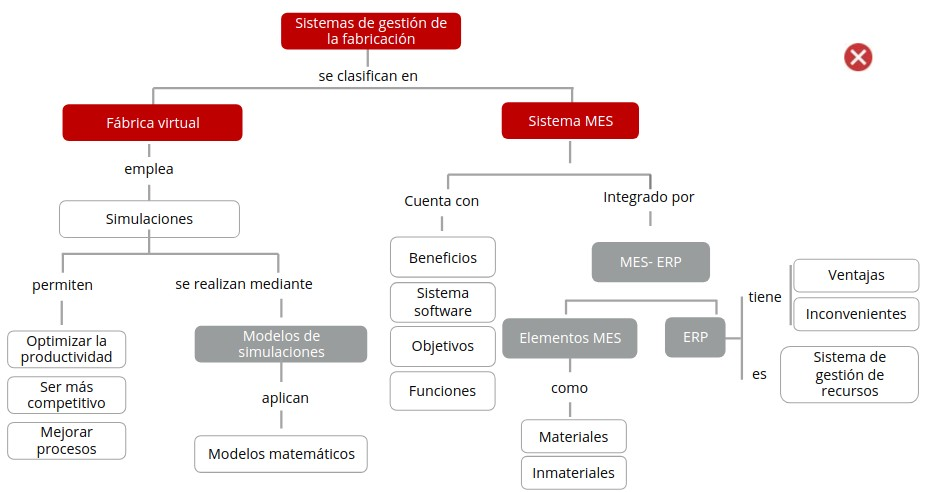
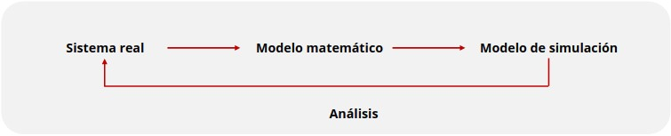
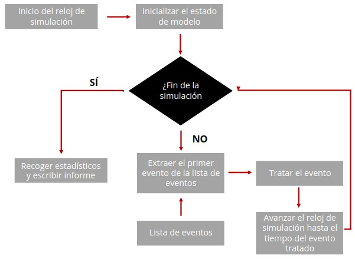
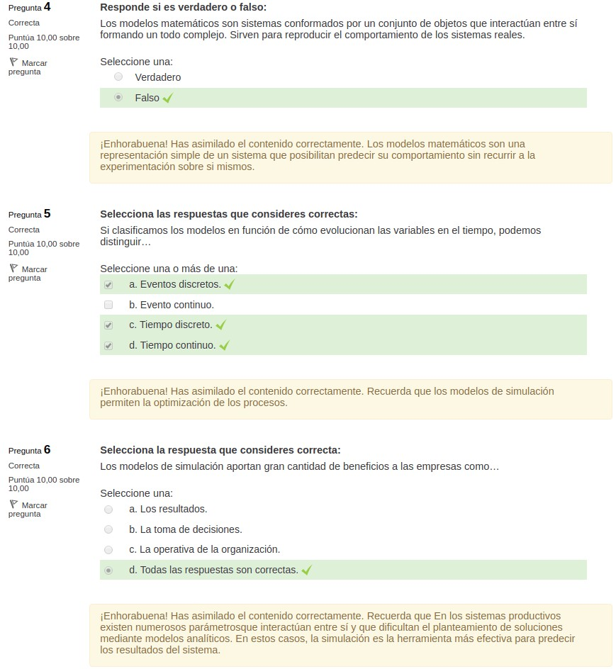
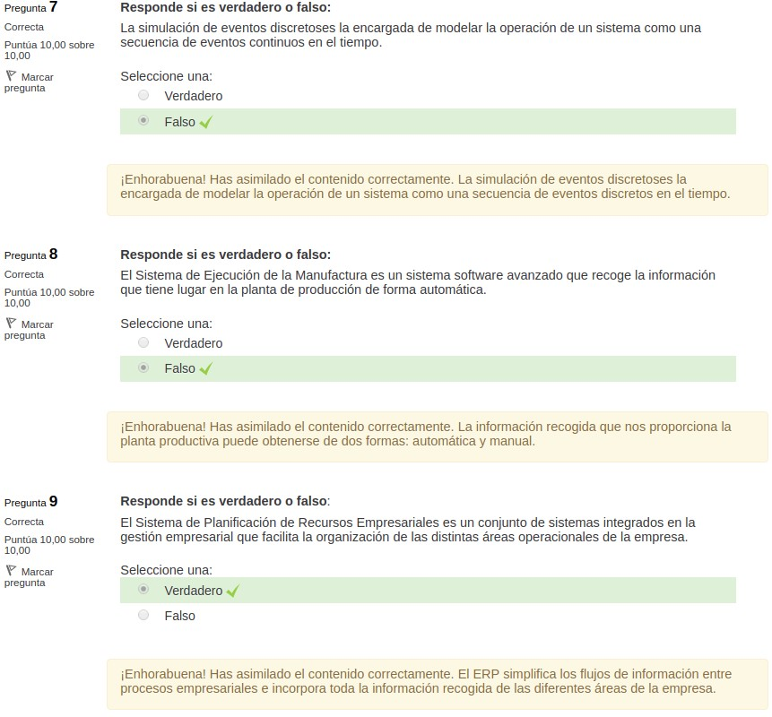
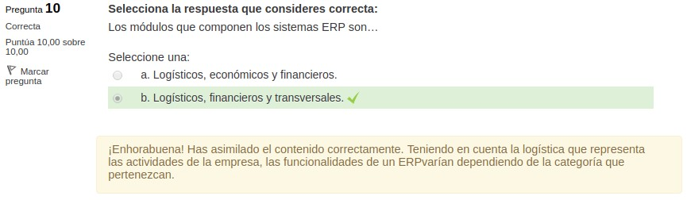

4.3. Sistemas de gestión de la fabricación 
==========================================

**MES (Manufacturing Execution System)** es un sistema de organización industrial capaz de capturar datos, supervisar procesos dentro de la planta obteniendo información en tiempo real. 

La **Planificación de Recursos Empresariales (Enterprise Resource Planning, ERP)** son sistemas integrados y manejados en plantas asociadas a operaciones de producción y de aspectos de distribución de una empresa en la producción de bienes o servicios. 

Actualmente la **implantación de un sistema MES-ERP** es la solución más demandada puesto que facilita una visión global de la producción y permite conocer el estado a tiempo real de las cadena en procesos de la empresa. 

1. La fábrica virtual 
*********************

.. note:: La **fábrica virtual** consiste en la creación de un entorno que integre tecnologías, contempladas en el concepto de Industria 4.0, como IOT, Big Data y sistemas ciberf[sicos, que posibiliten el diseño de simulaciones para mejorar sus líneas y procesos de producción. Lo que permite predecir el consumo de recursos y optimizar su utilización. 

La fábrica virtual **supone una gran transformación en el conjunto de la cadena de valor industrial** y, por lo tanto, engloba el concepto de Industria 4.0. 

Tiene como **finalidad** establecer procesos de producción avanzados, que adoptan sistemas que aportan flexibilidad e inteligencia, lo que posibilita proporcionar una mayor eficiencia a los procesos productivos. Esto deriva en **empresas más ágiles y competitivas**, centradas en aportar al cliente final un producto de calidad, que esté adaptado a sus necesidades y que sea lo más personalizado posible. 

Las fábricas inteligentes posibilitan **disminuir**: 

- **Tiempo que un producto tarda en llegar al mercado**
- **Costes de producción**.
- **Cambios**.

De esta forma, se dota de **calidad y fiabilidad** tanto al producto como al proceso de producción. **Para lograrlo, se emplea la simulación** que posibilita el ensayo de distintos escenarios con la finalidad de conocer cómo elegir las soluciones más adecuadas que se adaptan a cada momento. 

Por tanto, **es necesario recoger toda la información**, así como los datos precisos para poder elaborar estudios, simulaciones y análisis necesarios. 

1.1. Simulación 
++++++++++++++++

.. note:: La **simulación** es una técnica que posibilita imitar el comportamiento de un sistema real o hipotético de acuerdo a unas condiciones especificas de operación. 

**En las empresas permite**: 

- Conseguir una adecuada toma de decisiones. 
- Detectar cuellos de botella, distribuir personal y modificar la producción durante el proceso de producción. 

En definitiva, la simulación permite **encontrar la mejor solución y estimar el comportamiento** del sistema de una forma razonable.

.. note:: La simulación es el único método posible para **modelar sistemas complicados** de producción, logística, distribuciones, etc. 

Las simulaciones **se basan en la construcción de modelos** que permiten plasmar el funcionamiento de los procesos productivos que ya existen en una empresa o aquellos que se proponen con la intención de mejorar los originales. 

Gracias a la simulación se podrán poner a prueba los cambios y analizar los resultados de las diferentes alternativas. Utilizando esta técnica se pueden **mejorar los procesos** sin entorpecer la actividad diaria de la empresa. 

1.1.1. Finalidad y ventajas 
---------------------------

Mediante la simulación se puede **mejorar la toma de decisiones a corto plazo**. 

Las simulaciones tienen una **doble finalidad**: 

- Esquematizar el funcionamiento lógico de la empresa. 
- Medir el proceso productivo gracias a la creación de un modelo que recoge el sistema de procesos de la planta de producción. 

Este proceso productivo **se simula en condiciones reales dentro de un plano irreal** de forma que no interfiera en la actividad normal de la empresa. 

Las **ventajas** de la simulación son: 

- **Anticiparnos y perfeccionar el proceso ante un error** dentro del sistema que no ocasiona un problema real. 
- Evaluar cualquier alternativa que se propone **no conlleva ningún sobrecoste**, al no tener que efectuar inversiones o cambios para comprobar su resultado. 
- Probar cualquier **cambio o propuesta antes** de que esta se lleve a cabo. 
- Evaluar **diversos escenarios** y extraer conclusiones de una manera rápida, precisa y libre. 

1.1.2. Beneficios imitaciones 
-----------------------------

La utilización de la **simulación** tiene numerosos **beneficios**: 

- **Ahorro economico**: Realizar una simulación constituye un proceso más barato y más rápido que construir físicamente el sistema real. 
- **Incorpora datos**: Permite incorporar datos y modelos externos con facilidad. Además, posibilita la visualización de las relaciones que pueden existir entre las múltiples variables.  
- **Descubre errores**: Descubre errores de diseño en el modelo en lugar de hacerlo en el sistema real. Además, disminuye los riesgos en la empresa.
- **Estima y pronostica**: Permite estimar y pronosticar. En base a los resultados obtenidos posibilita tomar decisiones a tiempo o realizar una estrategia de planificación.  
- **Interactiva y participativa**: Permite realizar una visualización interactiva y participativa de cada una de las alternativas que se proponen.  
- **Controla los tiempos**: Posibilita controlar el tiempo de duración de un proceso, ya que se puede modificar según las necesidades, acelerándolo o retardándolo.  
- **Impacto promocional**: Proporciona un mayor impacto promocional.  
- **Muestra productos**: Ofrece la posibilidad de mostrar al cliente nuevos productos y de comprobar su funcionamiento y prestaciones.  
- **Diseño a tiempo real**: Permite revisar, modificar y optimizar los diseños en tiempo real y con mayor facilidad.  

1.1.3. Limitaciones 
-------------------

Reutilizar modelos puede presentar **algunas limitaciones** como el tiempo necesario para aprender, probar y ajustar el modelo o componente de otra persona, y puede ser mayor que el tiempo necesario para la simulación desde cero. También puede suceder que los componentes o modelos creados para una finalidad no se ajusten a otra diferente. 

Además, uno de los problemas principales es que **los costes recaen sobre el proveedor de modelo o componente** mientras que los beneficios van parar al usuario. Por tanto, debido a este conjunto de factores, la reutilización siempre estará limitada a componentes de nivel bajo. 

García Dunna (2006) cita algunas de las **limitaciones de la simulación**: 

- La simulación **puede ser costosa** en la solución de problemas relativamente sencillos. Se necesitan procesos complejos y no soluciones sencillas creadas para ese tipo de eventos concretos. 
- Se puede necesitar bastante **tiempo para realizar un adecuado estudio de simulación** y no todas las empresas se pueden permitir económicamente contratar a un desarrollador. 
- Las simulaciones generadas no son capaces de incluir todos los procesos, por lo que **no posibilitan una facilidad de uso y eficiencia de la información**. 

**Automatizar el proceso** es otra alternativa para cambiar el desarrollo de los modelos de simulación. Así, el modelador puede proveer de una descripción del modelo y de un intérprete, que convertiría esto en código de modelo ejecutable. 

La **utilización de un modelo implica**: 

- Establecer las condiciones iniciales. 
- Decidir cuánto tiempo se deja correr la simulación. 
- Escoger el número de repeticiones.

Hay métodos que podrían emplearse para guiar a un usuario en todas las áreas definidas. pero existe poca certeza de que estos métodos estén implementados en programas comerciales de simulación. Lo que podría ser tratado por medio del desarrollo de software para guiar la simulación de usuarios o incluso automatizar aspectos del proceso experimental. 

El software **Autostat** es uno de los pocos que proporcionan características de análisis de salida conteniendo intervalos de confianza, calentamiento, diseño de experimentos y análisis de sensibilidad. 

Resulta necesario dominar la aplicación empleada para realizar una simulación. La simulación es una herramienta muy utilizada en la **fase de diseño de un sistema**. Existe un gran potencial para que la simulación se pueda aplicar en **diferentes areas**: 

- Programación. 
- Predicción de futuros resultados. 
- Control de tiempo real. 
- Entrenamiento. 
- Emulación para ayudar al diseño de sistemas de control. 

Otro camino a tener en cuenta es el **modelado del comportamiento humano y la interacción** con un sistema de operaciones. La **principal finalidad** debe consistir en entender mejor cómo la interacción humana con un sistema de operaciones afecta el desempeño de un sistema y buscar formas de mejorar acciones, comportamientos y decisiones. 

Una última vía que podría seguir la **simulación de eventos discretos** es una mayor integración con otras técnicas de simulación y comunidades. 

1.1.4. Elementos que participan en la simulación 
------------------------------------------------

Los **elementos** que participan en una simulación son: 

- **Entidades**: Aquellos objetos que fluyen a través del sistema. Pueden ser clientes, productos, cajas, camiones y pallets, entre otros. 
- **Atributos**: Son aquellas características que definen las entidades. Como ejemplos tenemos el tipo de organización, la edad y el peso de los empleados y el tiempo de inicio de un proceso. 
- **Variables**: Fragmento de información que determina las características de un sistema, con independencia de las entidades que se muevan por el modelo. Por ejemplo, la demanda de un producto a la hora de calcular stocks. 
- **Recursos**: Personal, equipo, espacio en un almacén de tamaño limitado, etc.  
- **Colas**: Cuando una entidad no puede continuar su movimiento a través del modelo. A menudo se debe a que necesita un recurso que está ocupado, por lo cual precisa de un espacio donde esperar a que el recurso quede libre. La función de las colas es albergar a esas entidades que están en espera. 
- **Acumuladores de estadísticas**: Para obtener las medidas de eficiencia finales de una cadena productiva, es conveniente hacer un seguimiento de ciertas variables intermedias en las que se calculan estadísticas como el número total de piezas producidas. Todos los acumuladores deberán comenzar de O en cada una de las simulaciones para conseguir datos reales y correctos. 
- **Eventos**: Situaciones que se producen en un determinado momento en el tiempo de simulación y que podrían cambiar los atributos, las variables o los acumuladores de estadísticas. 
- **Reloj de simulación**: Variable que recoge el valor del tiempo transcurrido en una simulación. 

1.2. Modelos de proceso 
+++++++++++++++++++++++

Es habitual realizar una **simulación de flujos de producción** con el propósito de comprobar la producción y optimizar la productividad. Para ello, se diseñan lay-outs en 2D o 3D y mediante tecnologías de Realidad Virtual o Aumentada se procede a la visualización de los ensayos. 

El **principal objetivo** es la **unificación de datos** y mediante su integración se **podrá**: 
- Determinar la organización de la información. 
- Implementar la aplicación gestora de la información. 
- Integrar las aplicaciones con el gestor y la base de datos. 

La mejor opción para comprender **cómo funciona un sistema de forma real** consiste en realizar un modelo matemático para el sistema. 

.. note:: Un **modelo matemático** es una representación simple de un sistema que posibilita predecir su comportamiento sin recurrir a la experimentación sobre el mismo. 

El modelo matemático recoge las partes fundamentales del sistema en **lenguaje matemático**. Este lenguaje **engloba**: 

- Fórmulas 
- Relaciones 
- Probabilidades
- Parámetros 
- Variables 
- Otros 

Una gran parte de los procesos permanecen ante un cambio continuo, lo que deriva en el uso de modelos matemáticos como **instrumentos de evaluación de alternativas**, que cada vez cobran una mayor importancia. 

.. note:: Para tomar una decisión empresarial óptima es necesario saber cómo responderá el sistema ante una determinada acción. Para ello se emplea la simulación, como **proceso de experimentación con un modelo**. 

Este modelo **debe**: 

- Ser una aproximación al sistema real. 
- Concentrar la mayor parte de aspectos del sistema real. 
- Ser sencillo para que pueda ser fácil analizarlo mediante expresiones que describen el comportamiento del sistema. 

Para poder **extraer conclusiones útiles** es necesario que el sistema simulado sea similar al sistema real. De esta forma, el sistema se analiza a menudo numéricamente mediante simulación por ordenador. 

1.3. Modelos de simulación 
++++++++++++++++++++++++++

.. note:: Los **modelos de simulación** son sistemas conformados por un conjunto de objetos que interactúan entre sí formando un todo complejo. Sirven para reproducir el comportamiento de los sistemas reales. 

Los modelos de simulación **permiten la optimización de los procesos mediante acciones como**: 

- Analizar en detalle las variables que afectan de forma más directa al funcionamiento de la empresa. 
- Analizar las interacciones de las mismas. 
- Evaluar el impacto global. 

1.3.1. Clasificación 
--------------------

Si **clasificamos los modelos** en función de **cómo evolucionan las variables en el tiempo**, podemos distinguir: 

- **Tiempo continuo**: Se representan a través de ecuaciones diferenciales y representan a las variables que evolucionan continuamente en el tiempo.
- **Tiempo discreto**: Las variables solo cambian en momentos puntuales en el tiempo. 
- **Eventos discretos**: Las variables pueden cambiar en cualquier instante, aunque solo pueden existir números finitos de cambios en intervalos de tiempo finitos.   

1.3.2. Beneficios 
-----------------

Estos **modelos de simulación** aportan gran cantidad de **beneficios** a las empresas como: 

- La toma de decisiones. 
- Los resultados. 
- La operativa de la organización. 

En los sistemas productivos **existen numerosos parámetros** que interactúan entre sí y que dificultan el planteamiento de soluciones mediante modelos analíticos. En estos casos, la simulación es la herramienta más efectiva para predecir los resultados del sistema. 

1.3.3. Simulación de elementos discretos
----------------------------------------

.. note:: El **Modelado de Eventos Discretos (DES, Discrete-Event Simulation)** es el proceso que reproduce el comportamiento de un sistema complejo como una serie de eventos bien definidos y ordenados y tiene un buen funcionamiento en cualquier proceso en el que existe una variabilidad. 

La **simulación de eventos discretos** es la encargada de modelar la operación de un sistema como una secuencia de eventos discretos en el tiempo. Cada uno de los eventos tiene lugar en un momento determinado en el tiempo e indica el cambio de estado en el sistema. Entre eventos consecutivos se asume que no tienen lugar cambios en el sistema. 

Por tanto, la simulación puede **saltar directamente de un evento a otro**. 

En la **simulación de elementos discretos** se generan y administran eventos en el tiempo por medio de una cola de eventos ordenada según el tiempo de simulación en el que deben ocurriry, de esta forma, el simulador lee la cola y dispara nuevos eventos consecutivamente. 

Este modelo de simulación se usa principalmente en el diseño de la mayoría de **eslabones de la cadena de suministro tales como**: 

- Líneas de producción. 
- Plantas de procesamiento. 
- Puntos de atención a clientes. 
- Centros de atención médica. 

Es una extraordinaria **herramienta de análisis** que permite la **toma de decisiones vinculadas** con: 

- La planificación de la producción. 
- Los inventarios. 
- El diseño de los sistemas de producción. 
- Las cadenas de suministro. 

En la simulación de eventos discretos se crean y administran eventos en el tiempo por medio de una **cola de eventos ordenada**. Así, el simulador lee información de la cola y lanza nuevos eventos. 

Este tipo de simulación se utiliza mayoritariamente con el **diseño de los eslabones de la cadena de suministro** como: líneas de producción, plantas de procesamiento, entre otros. 

El **modelo de simulación de eventos discretos** posibilita resolver procesos y sistemas complejos mediante el análisis de métodos matemáticos. Se crean modelos lógicos-matemáticos que permiten imitar o simular el comportamiento que tiene lugar en la realidad. 

Repetir la simulación en varias ocasiones y en un numero suficiente, posibilita extraer un histórico artificial de observaciones sobre el comportamiento del sistema o proceso. Lo que permite **extraer conclusiones** útiles sobre el funcionamiento del sistema mediante **técnicas de análisis estadístico**. 

Un sistema de eventos discretos está **determinado por una secuencia de eventos** que ocurren en momentos aleatorios de tiempo y cambio de estado del sistema que tiene lugar en ese instante.

En comparación con la simulación continua, las **simulaciones de eventos discretos** no deben simular cada segmento de tiempo, por lo que transcurren de una forma más rápida. 

2. Manufacturing Execution System (MES) 
***************************************

.. note:: El **Sistema de Ejecución de la Manufactura (Manufacturing Execution System, MES)** es un sistema software avanzado que recoge la información que tiene lugar en la planta de producción. 

Los datos recabados son analizados para generar unos resultados relevantes que ayudaran a la empresa a la toma de decisiones y un seguimiento posterior. 

La información recogida que nos proporciona la planta productiva pueden obtenerse de dos formas:

- **Automática**, proporcionadas de señales de líneas o máquinas. 
- **Manual**, proporcionada por los operarios. 

MES puede incluir diferentes enlaces a **órdenes de trabajo** como la recepción de mercancías, control de calidad y otras tareas relacionadas. Puede estar integrado en sistemas de ejecución de operación y en sistemas de planificación de recursos empresariales **ERP**, lo que permite un intercambio de información entre sistemas. 

**Manufacturing Enterprise Solutions assosiation MESA** es una asociación industrial de empresas manufactureras centrada en mejorar los procesos productivos optimizando las tecnologías existentes y la introducción de nuevas innovaciones. 

Un Sistema MES puede considerarse como un paso intermedio entre los **Procesos de Planificación de una Empresa** (cuya última expresión es el ERP) y los **Procesos de Control de la Planta** (SCADA, PLCS y sensórica). 

**Supervisory Control And Data Adquisition SCADA** es un sistema avanzado utilizado para recopilar, analizar datos en tiempo real y controlar cualquier sistema local o remoto mediante un conjunto de aplicaciones software. 

2.1. Funciones del sistema MES 
++++++++++++++++++++++++++++++

El MES debe incluir las siguientes **funciones**: 

- Control de documentación. 
- Control cuantitativo de la producción. 
- Planificación de inventario. 
- Planificación de eventos. 
- Trazabilidad de producto. 
- Monitorización de estados. 
- Captura de la datos. 
- Gestión de la calidad. 
- Control de mantenimiento. 
- Análisis de señales. 

2.2. Objetivos del MES 
++++++++++++++++++++++

El **objetivo de implantación** de un sistema **MES** es aumentar el nivel productivo de la planta a través de la optimización en la gestión de los recursos. 

Los principales **objetivos** del sistema MES son: 

- **Gestionar ordenes de trabajo OT's**: saber tiempo real el estado de la orden de fabricación; su cantidad pendiente, realizada, fecha de finalización estimada, etc. 
- El **rendimiento máquinas OEE (Overall Equipment Efficiency)** a través del control del estado de las máquinas. 
- **Controlar la trazabilidad** e informar de las condiciones del proceso en el cual se han producido los lotes. 
- **Gestionar la logística** mediante etiquetado con códigos de barras de lotes intermedios y finales, actualizando de forma automática el stock. 
- **Controlar calidad en planta**, manual y automático a través de la integración de equipos de medición. 
- **Establecer comunicación directa** de datos que almacenan las diferentes estaciones de la planta, se establece mediante la conexión a los **PLCs (Power Line Communications)**.

2.3. Elementos integrantes en un MES
++++++++++++++++++++++++++++++++++++

MES implementa una solución para la gestión y supervisión completa del proceso productivo por ello existen una serie de **elementos principales**, materiales e inmateriales, que componen y forman el sistema. 

- **Material**: Comprados o fabricados para el proceso productivo 
- **BOM (Bill of Materials)**: Listado de las materias primas, subcomponentes, piezas y cantidad de materia prima necesaria para fabricar un producto. 
- **Máquinas y operarios**: El principal objetivo del operario es gestionar su centro productivo, esto es, ejecutar las órdenes de producción y mejorar el OEE (Overall Equipment Effectiveness) o Eficiencia General de los Equipos del centro. 
- **Operaciones**: Pasos necesarios para el control de información en planta. 
- **Calendarios**: Permite conocer el tiempo disponible de trabajo, turnos y conocer si se están cumpliendo los objetivos planificados.  
- **OT (Orden de trabajo)**: Documento escrito en el cual se describen las características de un equipo o maquinaria y las acciones de mantenimiento por realizar.  

3. Enterprise Resource Planning (ERP)
*************************************

.. note:: El **Sistema de Planificación de Recursos Empresariales (Enterprise Resource Planning, ERP)** es un conjunto de sistemas integrados en la gestión empresarial que facilita la organización de las distintas áreas operacionales de la empresa. 

El **ERP**: 

- Simplifica los flujos de información entre procesos empresariales. 
- Incorpora toda la información recogida de las diferentes áreas de la empresa. 

Teniendo en cuenta la logística que representa las actividades de la empresa, las **funcionalidades de un ERP** varían dependiendo de la categoría que pertenezcan. 

Los distintos **módulos** que componen los sistemas ERP son: 

- **Módulos logísticos**: 
	
	- Ventas y marketing. 
	- Compras. 
	- Logístico. 
	- Producción. 

- **Módulos financieros**: 

	- Contabilidad. 
	- Gestión de activos. 
	- Finanzas y contabilidad. 

- **Módulos transversales**: 

	- Recursos humanos (RRHH). 
	- Proyectos. 
	- Control de calidad. 
	- Mantenimiento.

3.1. Ventajas e inconvenientes del ERP
++++++++++++++++++++++++++++++++++++++

El ERP tiene las siguientes **ventajas e inconvenientes**: 

- **Ventajas**: 

	- Evitar los registros duplicados de datos y operaciones. 
	- Reducir errores y tiempo de producción. 
	- Reducir costes. 
	- Facilitar la adaptabilidad. 
	- Controlar la trazabilidad. 
	- Mejorar el flujo de información. 
	- Optimizar los procesos empresariales. 
	- Adaptable a las necesidades de la empresa. 

- **Inconvenientes**:

	- Costes iniciales. 
	- Tiempo de implementación. 
	- Resultados dependen de las habilidades del operario y su adaptación. Difíciles de adaptar al flujo específico de los trabajadores y al proceso de negocios de algunas compamas. 
	- Los beneficios en términos de ahorro de costes no son inmediatos. 
	- Dificultad de manejo. 
	- Problemas frecuentes de compatibilidad con otros sistemas. 

4. Integración MES-ERP
**********************

Los sistemas MES destacan por su implementación MES-ERP y los sistemas de control en planta. El sistema ERP se centra en la gestión de negocio en cambio el Sistema MES esta enfocado al análisis de la producción en tiempo real. 

El sistema ERP **comunica** al sistema MES cual es la orden de fabricación y este último se encarga de concretar de que manera se va a fabricar. 

Los MES-ERP se encargan de áreas relacionadas como:

- **ERP**: 

	- Procesos administrativos. 
	- Planificación empresarial. 
	- Costes. 

- **MES**:

	- Decisiones en planta. 
	- Producto. 
	- Eficiencia. 

La **finalidad** para una empresa en la implementación de un ERP-MES es conocer el estado actualizado de los costes, la eficiencia en las líneas de producción y observas en tiempo real el estado de la producción. 

4.1. Funciones 
++++++++++++++

Los sistemas ERP incorporarán las **funciones** más básicas para la gestión empresarial, pero hay otras que pueden añadirse mediante módulos o programación.

Las **funciones** más comunes de los sistemas ERP están la **gestión** de: 

- Almacenes (WMS). 
- Cadena de producción. 
- Cadena de suministro (SCM). 
- Proyectos. 
- Ciclo de vida de un producto (PLM)
- Financiera.
- Comercial y ventas. 
- Calidad. 

4.2. Procedimientos de implementación ERP
+++++++++++++++++++++++++++++++++++++++++

Para implementar un Sistema ERP son necesarios estos **procedimientos**: 

- Definir los resultados que se obtendrán con un sistema ERP. 
- Determinar el modelo de negocio. 
- Determinar un modelo de gestión. 
- Definir una estrategia de implantación. 
- Analizar el entorno de desarrollo. 
- Definir oportunidades para la implantación de un software alternativo sistema ERP. 
- Definir cambio organizativo. 

5. Resumen
**********

- La **fábrica virtual** consiste en la creación de un entorno que integre tecnologías, contempladas en el concepto de Industria 4.0, como IOT, Big Data y sistemas ciberfísicos. 
- La **simulación** es una técnica que posibilita imitar el comportamiento de un sistema real o hipotético de acuerdo a unas condiciones específicas de operación. 
- Un **modelo matemático** es una representación simple de un sistema que posibilita predecir su comportamiento sin recurrir a la experimentación sobre el mismo. 
- Los **modelos de simulación** se clasifican en función de **cómo evolucionan las variables en el tiempo**. Podemos distinguir tiempo continuo, tiempo discreto y eventos discretos. 
- El **Modelado de Eventos Discretos (DES, Discrete-Event Simulation)** es el proceso que reproduce el comportamiento de un sistema complejo como una serie de eventos bien definidos y ordenados.
- El **Sistema de Ejecución de la Manufactura (Manufacturing Execution System, MES)** es un sistema software avanzado que recoge la información que tiene lugar en la planta de producción. 
- El **Sistema de Planificación de Recursos Empresariales (Enterprise Resource Planning, ERP)** es un conjunto de sistemas integrados en la gestión empresarial que facilita la organización de las distintas áreas operacionales de la empresa. 
- Los sistemas MES destacan por su **integración** con los ERP y los sistemas de control en planta. El sistema ER? se centra en la gestión de negocio en cambio el Sistema MES esta enfocado al análisis de la producción en tiempo real. 
- Los sistemas ERP incorporarán las **funciones** más básicas para la gestión empresarial, pero hay otras que pueden añadirse mediante módulos o programación. 

6. Actividades
**************

.. figure:: ../../_static/4_nuevas_tecnologias/4.3_sistemas_gestion_fabricacion/actividades/questionnaire_1.jpg
   :width: 70%
   :align: center

