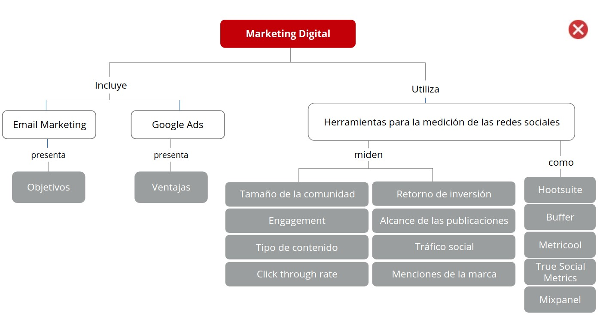
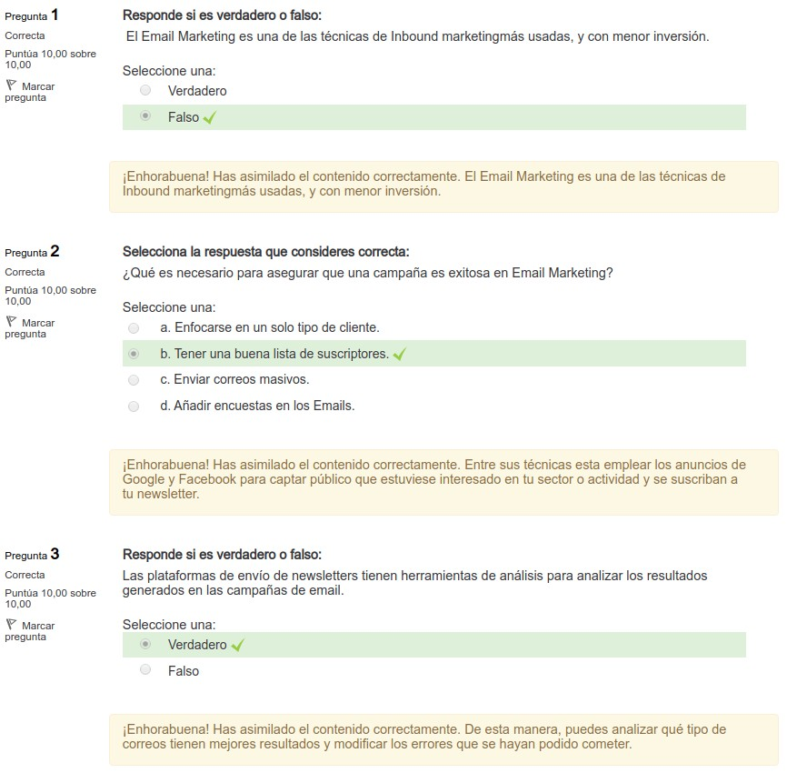
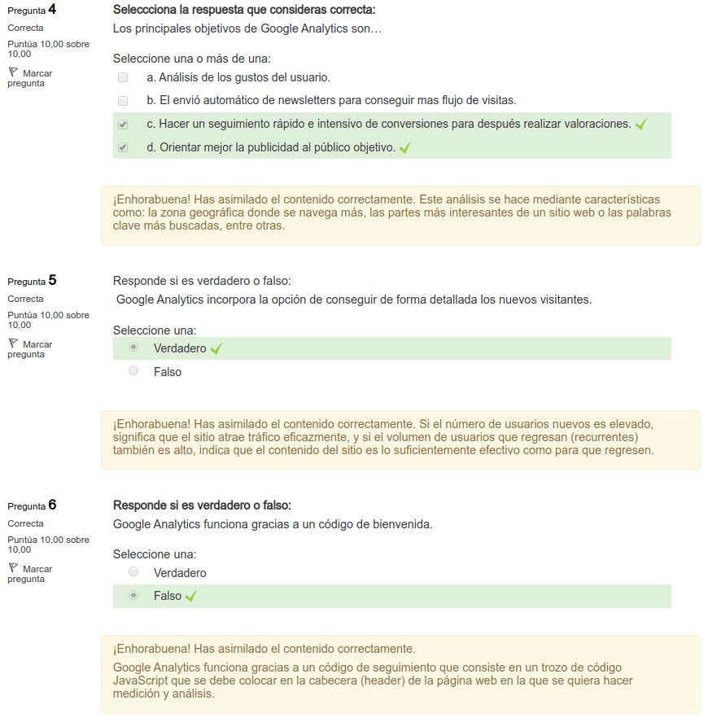
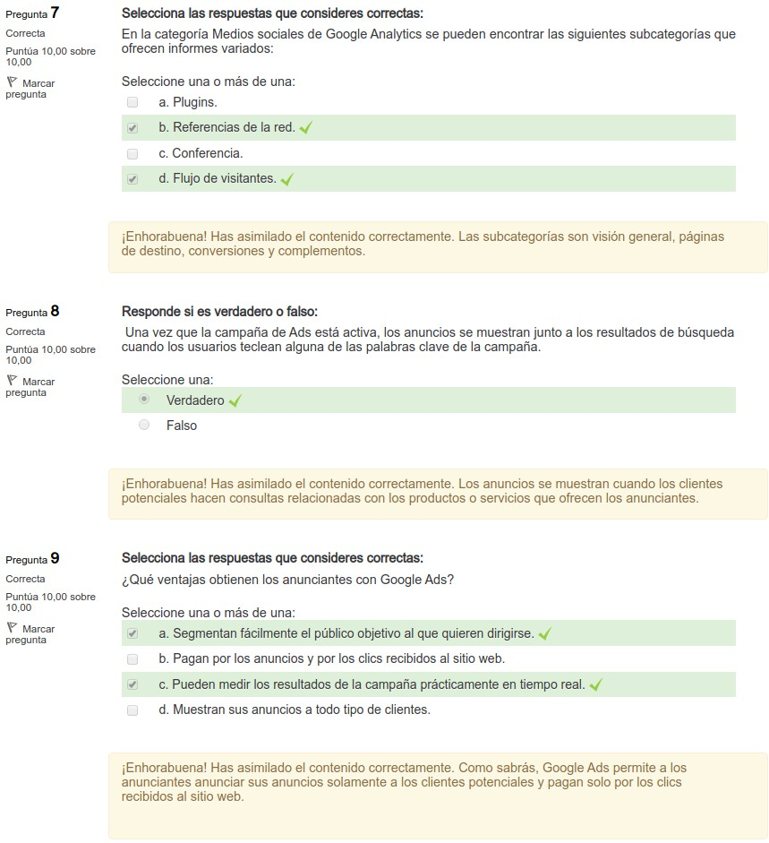
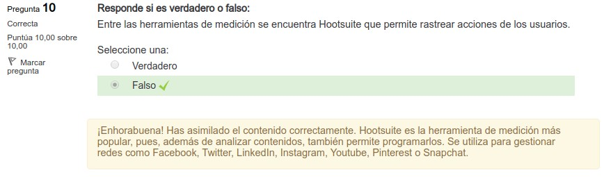

4.6. Marketing digital
======================

1. Introducción email marketing
*******************************

.. note:: El **email marketing** se utiliza para definir el envio masivo de correos electrónicos a un conjunto de contactos. 

El email marketing es una de las **técnicas de Inbound marketing** más usadas, y con menor inversión. Su principal finalidad es crear un canal directo con el usuario, enfocando el contenido a cada consumidor y obtener un incremento de nuestro beneficio. 

Entre los **principales objetivos** de esta estrategia están: 

- Crear lealtad. 
- Generar interacción con clientes. 
- Aumentar las ventas. 
- Generar confianza de los usuarios en cuanto al producto. 
- Confirmar un pedido. 

Son **visitas directas** a usuarios de una base de datos o suscriptores de una página. También es posible conseguir trafico de visitas mediante colaboraciones con otras empresas. 

Para asegurar que una campaña es exitosa, es necesario tener una buena **lista de suscriptores**. Para ello, puedes insertar formularios de suscripción en todos los espacios siguiendo los **siguientes aspectos**:

- Emplear los anuncios de Google y Facebook para captar público que estuviese interesado en tu sector o actividad y se suscriban a tu newsletter. Se puede ofrecer un descuento que genere interés a cambio de la suscripción.
- Informar al cliente de la posibilidad de recibir los correos electrónicos en el momento de efectuar la compra.
- Organizar concursos a través de las redes sociales, para incrementar tu base de datos de direcciones de correo. Debes asegurar que la condición mínima para participar en el concurso sea que te proporcionesn su correo electrónico.

2. Herramientas de email marketing
**********************************

Para asegurar que una campaña es exitosa es necesario tener una buena **lista de suscriptores**.

Para ello puedes: 

- **Personaliza tus newsletters**: Para poder enfocarse mas a un publico objetivo, utiliza la información de tu base de datos para recopilar información sobre tus clientes para personalizar los mensajes. 
- **Iconos para compartir la newsletter**: Puede que estés ofreciendo alguna oferta o información que pueda interesar a los amigos o familiares de los contactos en tu base de datos. Añade la opción de "Reenviar esta newsletter a un amigo" para que pueda llegar a más usuarios potenciales. 
- **Ofrece información útil**: Puede que quieras enviar mucha información promocional. Si reciben mucha información puede que empiecen a verte como otro vendedor sin destacar por la importancia del contenido. Otra estrategia de marketing es motivar a la compra de una forma más indirecta mediante acciones promociones. Ejemplo: 

	- Una tienda de productos de jardinería, podría enviar un correo electrónico incluyendo un artículo con consejos de mantenimiento o un vídeo explicativo con consejos sobre jardinería. cómo trasplantar las plantas. 
	- Una tienda de ropa podría presentar las últimas tendencias en complementos y acabar el articulo con llamada a la acción para que los lectores visiten también las últimas tendencias en moda.

- **Da la bienvenida a los nuevos clientes**: Una vez que los usuarios se registran por primera vez en las newsletters, deben recibir un email de bienvenida. En él, debe figurar la frecuencia con la que se recibirán correos, la posibilidad de cambiar las opciones o darse de baja. Como propuesta adicional se podría aprovechar para ofrecerles algún tipo de descuento exclusivo. 
- **Mobile first**: La creciente utilización de dispositivos móviles para gestionar y responder nuestros correos, requiere que nuestros emails tengan un diseño responsive. Es importante que los botones sean accesibles y visibles desde los diferentes dispositivos móviles. 
- **Reconoce y recompensa a tus mejores clientes**: El Email Marketing es una herramienta para llegar a tus mejores clientes. Se pueden implementar técnicas como mandarles contenido exclusivo, invitarles a eventos especiales o mostrar ofertas personalizadas y promociones únicas. 
- **Destaca tus correos**: Para destacar tus correos puedes llamar atención añadiendo un asunto llamativo que provoque que los usuarios quieran abrir el contenido. El contenido del mensaje debe tener una plantilla atractiva con un diseño ordenado. 
- **Utiliza el email para construir una relación**: El Email Marketing no solo debe contener información relevante, sino que además el usuario debe poder acceder a la tienda. Se pueden incluir iconos de las redes sociales donde quieras incrementar tu público y pedir opinión sobre tus productos o sobre tu empresa en general. Cuanta más información logres, más branding estarás logrando. De esta manera tu marca se irá haciendo mas fuerte entre los usuarios que quieran adquirir tus productos o servicios. 
- **Analiza los resultados**: Las plataformas de envío de newsletters tienen herramientas de análisis para analizar los resultados generados en las campañas de email. De esta manera, puedes analizar qué tipo de correos tienen mejores resultados y modificar los errores que se hayan podido cometer.  

**Ejemplos de campañas** de Email Marketing para fidelizar clientes: 

- **Atrápalo**: tiene un mensaje de bienvenida, en el que contiene información sobre la web, lo que ofrecen y un botón de fácil acceso a la web. 
- **Zalando**: email con oferta. Ofrece descuentos de hasta un 60%. HASTA -60% 
- **Tarazona (email de satisfacción)**: entre las técnicas de fidelización al cliente, se puede usar un newsletter para preguntarle como ha sido la experiencia de compra en tu sitio web. De esta manera podemos conseguir une buena recomendación. Se recomienda responder todos los comentarios, sobre todo si estos han sido negativos. 

3. Google Analytics
*******************

.. note:: **Google Analytics** es una herramienta gratuita de análisis web que expone información pormenorizada sobre el tráfico de un sitio web y los resultados de su estrategia de marketing. Lo pueden usar tanto usuarios que quieren conocer con detalle la situación de su web, como los que sólo quieren estar al tanto de los indicadores generales. 

El **principal objetivo** de Google Analytics es hacer un seguimiento rápido e intensivo de conversiones para después realizar valoraciones. 

Además, ayuda a **orientar mejor la publicidad** al público objetivo mediante características como: la zona geográfica donde se navega más, las partes más interesantes de un sitio web o las palabras clave más buscadas, entre otras. 

Otra utilidad de esta herramienta es que muestra **mapas interactivos** de los países y regiones donde un sitio web tiene más o menos importancia. Todo ello gracias a una funcionalidad de generación de gráficos que analiza las visitas de períodos de tiempo determinados, comparando estos períodos entre si. Esta herramienta de gráficos permite saber cómo descubren los usuarios el sitio web y cómo se mueven por él. 

En el apartado "Público" de la aplicación se pueden averiguar **datos técnicos de los usuarios** que visitan una página web: el navegador con el que se hizo la visita, el sistema operativo, la resolución de pantalla, etc. 

Además, permite conseguir **información detallada** como, por ejemplo, el número exacto de: 

- **Visitas y visitantes exclusivos**: La diferencia entre "visita" y 'Visitante", un usuario puede visitar varias veces al dia la misma página., las visitas pueden ser 3 Promedio de páginas vistas pero el visitante es 1.
- **Páginas vistas**: Total de páginas del sitio que se han visitado. Este parámetro resulta muy útil como indicador del volumen de tráfico del sitio y del servidor. 
- **Promedio de páginas vistas**: Este parámetro sirve para evaluar la calidad de las visitas.
- **Duración media de la visita** : Indica el promedio de tiempo que los usuarios están en el sitio web. Este parámetro también puede indicar la calidad del sitio web, ya que, si el tiempo es muy bajo, quiere decir que abandonan el sitio web rápidamente y el porcentaje de rebote es alto. 
- **Porcentaje de rebote**: Es el porcentaje de visitas en una sola página, es decir, visitas en las que el usuario ha abandonado el sitio en la página de acceso. Es importante no confundir la página de acceso con la página principal del sitio web. La página de acceso es aquella a la que ha llegado el usuario ya sea desde un enlace, a través de una búsqueda o escribiendo su I_JRL. Si este porcentaje es alto, significa que las páginas enlazadas o de acceso no son interesantes para los visitantes. 
- **Nuevos visitantes/visitantes que vuelven**: Si el número de usuarios nuevos es elevado, significa que el sitio atrae tráfico eficazmente, y si el volumen de usuarios que regresan (recurrentes) también es alto, indica que el contenido del sitio es lo suficientemente efectivo como para que regresen. En el caso de que el número de visitantes nuevos sea mucho mayor que el de aquellos que vuelven, significa que el contenido del sitio web no consigue fidelizar a los usuarios. 

3.1. Informes de redes sociales
+++++++++++++++++++++++++++++++

Google Analytics ofrece la posibilidad de obtener **información relativa al comportamiento de los usuarios de redes sociales** con respecto a una página web. Por un lado, ofrece datos sobre las **visitas** a una web procedentes de las redes sociales como Facebook, Twitter, Instagram, Pinteresty otras. Y por otro lado muestra información sobre la **interactuación de los visitantes** de la página web con las redes sociales, es decir, la cantidad de "me gusta", las veces que se ha compartido un contenido, etc. 

Esta información se ve reflejada en los **informes de redes sociales**, accesibles dentro del apartado Adquisición > Medios sociales. 

En la categoría **Medios sociales** se pueden encontrar las siguientes **subcategorías** que ofrecen informes variados: 

- **Visión general**: Muestra el número de visitas a un sitio web provenientes de redes sociales. 
- **Referencias de la red**: Ofrece un informe de datos comparativos ordenados por fechas de las visitas a un sitio web provenientes de redes sociales frente a las visitas totales. Esto permite comprobar si el trabajo desarrollado en redes sociales es efectivo, en función de los objetivos que se hayan marcado con respecto a los medios sociales. 
- **Páginas de destino**: Son las páginas de un sitio web a las que llega un usuario desde una red social. 
- **Conversiones**: Mide el éxito de las promociones sociales en función de los objetivos del sitio web, de las conversiones y de las transacciones del comercio electrónico. Las conversiones constituyen el valor económico asignado a los objetivos. Desde esta categoria se puede estudiar la red social que tiene mayor impacto en una página web.  
- **Complementos**: Presenta un informe que ofrece datos sobre lo bien o lo mal que pueden funcionar los botones de compartir, "me gusta", retuit, etc. insertados en una página web. 
- **Flujo de visitantes**: Muestra la ruta que siguen los usuarios en una página web que proviene de las redes sociales. Indica el número de visitas por páginas y también el número de abandonos. 

4. Google Ads
*************

.. note:: **Google Ads** es un servicio y una aplicación de Google que ofrece a las empresas anunciantes publicidad patrocinada. 

Los propios **anunciantes** deciden qué **mensajes publicitarios** (anuncios) quieren transmitir y con qué **tipo de búsquedas** (palabras clave) desean acceder a esos clientes. 

Una vez que la campaña de Ads está activa, los **anuncios** se muestran **junto a los resultados de búsqueda** cuando los usuarios teclean alguna de las **palabras clave** de la campaña. Por tanto, los anuncios se muestran cuando los clientes potenciales hacen consultas relacionadas con los productos o servicios que ofrecen los anunciantes.

Cuando **el usuario** encuentra un anuncio que le interesa **hace clic** en él y **accede directamente al sitio web del anunciante**, donde puede informarse sobre el producto o servicio, e incluso realizar una compra si la página web del anunciante así lo permite. 

4.1. Ventajas
+++++++++++++

Con el programa publicitario **Google Ads**, los anunciantes obtienen una serie de **ventajas**: 

- **Clientes potenciales**: Muestran sus anuncios sólo a los clientes potenciales que buscan los Público objetivo productos y servicios. De esta forma, se consigue tráfico de calidad, los usuarios encuentran mensajes publicitarios relevantes para su búsqueda. 

- **Público objetivo**: Segmentan fácilmente el público objetivo al que quieren dirigirse, con la Público objetivo posibilidad de acceder a clientes potenciales en todo el mundo y en su propio idioma.

- **Clics recibidos**: Pagan sólo por los clics recibidos al sitio web. Es decir, los anunciantes no pagan por el número de veces que se muestran sus anuncios, sino por las visitas recibidas en su sitio web de usuarios atraídos por los anuncios e interesados en los productos y/o servicios promocionados. 

- **Inversión en oportunidades**: Invierten sólo lo que se considera oportuno, según sus medios y objetivos, y durante el período de tiempo que deseen. 

- **Medir resultados**: Pueden medir los resultados de la campaña prácticamente en tiempo real, como por ejemplo el número de visitas recibidas al sitio web o el número de ventas realizadas online. De esta forma, se sabe la rentabilidad de cada euro invertido en la campaña. 

5. Otras Herramientas
*********************

.. note:: En el contexto de las redes sociales, **medir** significa cuantificar y calcular los datos útiles de las redes que sirven para llevar a cabo estrategias de marketing. 

A continuación, se exponen las los **elementos** más importantes **que se deben medir en las redes sociales**: 

- **Tamaño de la comunidad**: hace referencia a la cantidad de seguidores de la cuenta. Normalmente lo que buscan las empresas es incrementar el número sin objetivo, pero lo realmente interesante es mantener la base de usuarios fieles. También es importante prestar atención a las personas que se dan de baja de la cuenta, que no deben superar a los nuevos ingresos en ningún caso. Si se diera esta casuística habría que replantearse una nueva estrategia. 
- **Engagement de la comunidad**: consiste en la interacción de los usuarios con respecto a las publicaciones. Por ejemplo, cuando comparten una publicación o le dan "me gusta". 
- **Tipo de contenido**: hace referencia al contenido que más triunfa en la cuenta. Es importante estudiar qué publicaciones han destacado y por qué, para lograr un mayor CTR y engagement. 
- **CTR (Click Through Rate)**: en español se traduce como la ratio de cliqueos o la proporción de clics. Son el número de clics que se hacen sobre un enlace, atendiendo al número de impresiones (número de veces que lo han visto los usuarios). Permite medir la efectividad de los enlaces insertados en las publicaciones. 

5.1. Otras herramientas
+++++++++++++++++++++++

Para realizar la medición de los elementos mencionados existen diversas **herramientas** que permiten recabar esta información. Algunas de las más conocidas, que sirven para medir varias redes sociales son: 

- **Hootsuite**: Es la herramienta de medición más popular, pues, además de analizar contenidos, también permite programarlos. Se utiliza para gestionar redes como Facebook, Twitter, Linkedln, Instagram, Youtube, Pinterest o Snapchat. Sobre todo, destaca su gestión colaborativa, es decir, posibilita que distintos miembros de un equipo operen en una misma cuenta. Hootsuite ofrece informes avanzados gracias a la integración de Google Analytics y Facebook Insights. Permite la gestión gratuita de hasta 3 perfiles. 
- **Buffer**: Es otro conocido gestor de redes sociales como Twitter, Facebook, Linkedln, Instagram y Pinterest. Consiste en una aplicación gratuita para dispositivos móviles iOS y Android que permite programar hasta diez publicaciones en cada red social, en su versión sin costo.
- **Metricool**: Es una herramienta para analizar, gestionar y medir el éxito de los contenidos digitales. Según la página web oficial "ofrece todo lo que necesitas para tu estrategia social en un único sitio, desde analítica web y de contenidos de tu blog, métricas y planificación de tus redes sociales (Facebook, Instagram, Twitter y Linkedln) hasta la realización de estudios de tu competencia".
- **True Social Metrics**: Es otra herramienta de analítica para redes sociales que permite medir el volumen de comentarios, contenido compartido y favorito, etc. de las principales redes sociales: Facebook, Twitter, Linkedln, Instagram, Youtube, etc. Gracias a esta herramienta se pueden analizar aspectos como el sexo o el país de procedencia de los usuarios, por ejemplo.
- **Mixpanel**: Es una herramienta de análisis web y móvil que posibilita rastrear las acciones de los usuarios, segmentar los visitantes, crear eventos personalizados y enviar notificaciones por email, etc. Está más enfocada a la redes móviles y aplicaciones como, por ejemplo: Spotify o Airbnb, entre otras.

5.2. Aspectos para escoger una herramienta
++++++++++++++++++++++++++++++++++++++++++

Existen una serie de recomendaciones a la hora de **escoger una herramienta u otra** que dependerán de los siguientes aspectos: 

- Precio. 
- Planes de pago (y qué ofrece cada uno de ellos). 
- Redes sociales que se podrán analizar con la herramienta escogida. 
- Información que se pretenda obtener de cada red social. 
- Número de trabajadores que vayan a gestionar las redes a través de la herramienta, ya que no todas permiten el mismo número de sesiones abiertas al mismo tiempo. 

Además de las herramientas de medición expuestas, existen **herramientas específicas** para cada red social y otras de carácter interno, **dentro de las propias redes**, que permiten obtener métricas concretas. 

6. Resumen
**********

- El **Email Marketing** se utiliza para definir el envio masivo de correos electrónicos a un conjunto de contactos. 
- **Google Ads** es un servicio y una aplicación de Google que ofrece a las empresas anunciantes publicidad patrocinada. 
- **Google Analytics** es una herramienta gratuita de análisis web que expone información pormenorizada sobre el tráfico de un sitio web y los resultados de su estrategia de marketing. 
- Google Analytics funciona gracias a un **código de seguimiento** que consiste en un trozo de **código JavaScript** que se debe colocar **en la cabecera (header) de la página web** en la que se quiera hacer medición y análisis. 
- En el contexto de las redes sociales, **medir**, significa cuantificar y calcular los datos útiles de las redes que sirven para llevar a cabo estrategias de marketing. 
- Las **herramientas para la medición de las redes sociales** más populares son: Hootsuite, Buffer, Metricool, True Social Metrics o Mixpanel. 

7. Actividades
**************

