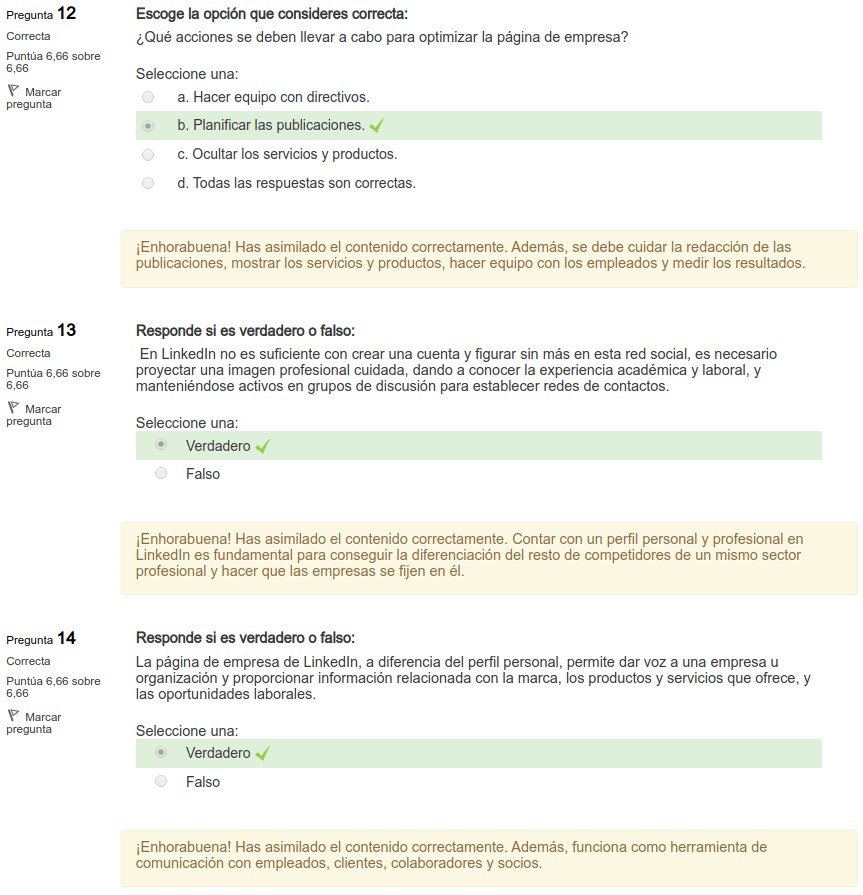

4.7. Redes sociales
===================

.. figure:: ../../_static/4_nuevas_tecnologias/4.7_redes_sociales/mapa_conceptual.jpg
   :width: 70%
   :align: center

1. Introducción
***************

.. note:: Las **redes sociales** son aquellas cuyo campo de acción se desarrolla en Internet mediante plataformas web que ofrecen servicios de redes sociales con formato de pago o gratuito. Son formas de interacción social articulada en torno a un intercambio dinámico entre grupos e instituciones cuyos sistemas son abiertos y están en actualización constante. 

Las redes sociales deben verse como un **canal de comunicación abierto** entre la empresa y el nicho de mercado. Como se ha tratado en la primera unidad didáctica, se trata de un medio controlado por la empresa, por lo que depende de ella su buena gestión, su dinamización, la creación de contenido y por supuesto, una rápida atención al cliente. 

**Las redes sociales se clasifican en**: 

- **Generalistas** 
- **De microblogging**
- **Profesionales**
- **De mensajería**
- **De contenidos** 

2. LinkedIn
***********

**LinkedIn** es la red social profesional más utilizada en el mundo con presencia en más de 200 países. **Fundada en 2002**, supuso un impacto inmediato, ya que en 2008 contaba con más de 25 millones de miembros. En 2016 fue adquirida por Microsoft. En la actualidad cuenta con 9 millones de empresas y ha ofrecido más de 10 millones de puestos de trabajo. 

Los miembros de esta red **la utilizan para**:
- Relacionarse con otros profesionales. 
- Establecer sinergias positivas para su trayectoria profesional. 
- Compartir noticias e intereses relacionados con su ámbito profesional. 

También es un espacio donde **las empresas reafirman su imagen corporativa y realizan acciones de captación de talento**. 

El 67% de los reclutadores utilizan LinkedIn para evaluar a los candidatos en los procesos de selección. 

Al igual que Facebook, LinkedIn cuenta con **perfil profesional** en el que se presenta la trayectoria académica y profesional del usuario, y también con una **página de empresa** desde donde se gestiona la cuenta como marca. 

La **página de empresa** es una herramienta **muy efectiva para**: 

- Dar a conocer la actividad de la empresa y redirigir el tráfico a la web corporativa. 
- Humanizar a la marca. 
- Difundir los servicios y productos. 
- Diferenciarse de la competencia. 
- Facilitar la comunicación con los clientes. 
- Liderar el mercado de actuación a través de contenido propio y de calidad. 
- Estar al dia de todas las tendencias del sector. 
- Reclutar a profesionales cuya incorporación sea importante para los objetivos de la empresa. 

En LinkedIn se encuentran **dos tipos de páginas** encaminadas a: 

- **Empresa** Es la **presentación de la compañía u organización**. Está orientada a desarrollar la imagen de marca de la empresa, más que a realizar actividades comerciales. El usuario tiene una visión global de la organización, **similar a la web corporativa**. Estas páginas **deben incluir**:

	- Breve descripción de la empresa acompañada de imágenes. 
	- Logotipo o imagen corporativa. 
	- Diseño atractivo de portada. 
	- Información relativa al sector de su actividad: experiencia, número de empleados y valores. 

- **Producto**: Está orientada a **dar a conocer los productos o servicios de la compañía**. Se crean cuando la empresa cuenta con varios productos o servicios y estos son muy distintos entre si. Se pueden crear hasta 10 páginas de productos. Busca una **especialización del contenido y una segmentación** más exhaustiva de los seguidores para aumentar el número de ventas. Estas páginas **deben incluir**: 

	- Nombre de la página de productos. 
	- Descripción de la página de productos (70 a 200 caracteres). 
	- Sector de actuación.

En las páginas de empresa, se encuentra la **herramienta de análisis** donde se pueden obtener **estadísticas** con gráficas muy sencillas **sobre la actividad de la empresa**. Se puede adquirir información relativa de los visitantes que ha tenido la página en un periodo de tiempo determinado, las publicaciones más compartidas o aquellas que han contado con más visualizaciones. 

LinkedIn permite **descargar estos datos** en formato Excel para la creación de informes personalizados. 

Tras la creación de una página de empresa es necesario **nutrirla de contenido de calidad** con informaciones relevantes y de interés para el sector de actuación. En este sentido se puede apostar por vídeos, infografías o imágenes sobre la actividad de la empresa o los productos/servicios que ofrecen. Pero también se puede compartir contenido de terceros. 

La página **debe estar actualizada** y se recomienda realizarlo entre semana, ya que al ser una red social profesional durante los fines de semana no hay tanta actividad. 

Finalmente se da a conocer la página con el fin de **conseguir seguidores**. Para ello, existen una serie de **estrategias que facilitan la difusión** de la misma: 

- **Objetivo**: Determinar las empresas y profesionales a los que se quiere seguir formando una red de contactos. Es recomendable seguir a empresas de sector afín, para conocer de primera mano las iniciativas que tienen en marcha. Es una forma de analizar las fortalezas y debilidades de la competencia, qué funciona y cómo poder extrapolarlo a una estrategia empresarial.  

- **Empleados**:  Los mejores embajadores que puede tener una marca son sus propios empleados. Es fundamental que las personas que trabajan en una empresa conozcan la página de empresa en LinkedIn para que puedan seguirla y compartirla en sus perfiles profesionales.  

- **Mensajes**: Desde un perfil profesional se pueden enviar mensajes personalizados a todos nuestros contactos para dar a conocer la página de empresa.  

- **Grupos**: Participar en diferentes grupos de LinkedIn permite mantener el contacto con otros profesionales del sector y contactar con clientes potenciales. Los grupos presentan un contenido temático relacionado con la actividad profesional; en ellos los profesionales inician debates para incentivar el intercambio de conocimientos específicos. Estos espacios pueden ser de gran utilidad a la hora de dar a conocer la empresa entre sectores especializados y de interés.  

En LinkedIn también se pueden realizar **campañas publicitarias** para alcanzar los objetivos empresariales establecidos. Tras perfilar los objetivos a conseguir, habrá que escoger el tipo de anuncio más adecuado. 

En esta plataforma se encuentran **cuatro modalidades**:

- **Contenido patrocinado**: Las publicaciones de la empresa ganan relevancia y no pasan desapercibidas. El contenido promocionado aparece en el feed (canal) de la página de empresa y es posible promocionarlo por público segmentado. Se trata de anuncios muy dinámicos en los que se pueden utilizar texto, imágenes o vídeos. 

- **Anuncios dinámicos**: El principal objetivo es llamar la atención del público objetivo, aumentar la interacción en la página y atraer a nuevos seguidores. El contenido es dinámico porque es la propia plataforma la que conecta a un usuario (por la segmentación realizada) con la publicidad que puede ser de su interés. La publicidad aparecerá en el feed del usuario. En este tipo de anuncios se utilizan copys creativos y llamadas de acción personalizadas.  

- **Anuncios de texto**: Tipo de anuncio más similar al de otras redes sociales como Facebook. En estos anuncios se apuesta por un lenguaje claro y sencillo con imágenes atractivas. Con estos anuncios se busca atraer seguidores y generar posibles clientes. Además, pueden ubicarse en distintas zonas de la plataforma.

- **Mensajes patrocinados InMail**: La plataforma permite enviar mensajes patrocinados a través de LinkedIn Messenger (mensajería instantánea) con el objetivo de aumentar el Índice de conversión y alcanzar a un mayor volumen de clientes potenciales desde teléfonos móviles y otros dispositivos. Para que estos anuncios funcionen es necesario que se realice un buen proceso de segmentación de la audiencia y se personalice detalladamente todo el contenido del mensaje. 

3. Facebook
***********

**Facebook** fue creado por **Mark Zuckerberg (2004)** cuando estudiaba en la Universidad de Harvard con el objetivo de crear un **espacio virtual para fomentar las relaciones personales** entre los alumnos del campus universitario, así como facilitar el intercambio de documentos formativos: apuntes, textos o libros, entre otros. 

Más tarde, esta red social dejó de ser de uso privado y en 2007 **se lanzaron versiones públicas** en español, francés y portugués, entre otros idiomas. En la actualidad, Facebook es una de las redes sociales por excelencia y cuenta con más de 2,100 millones de usuarios activos cada mes a lo largo de todo el mundo. (Fuente: Informe We Are Social y Hootsuite 2018). 

El creador de Facebook, Mark Zuckerberg cuenta con un perfil personalizado con diferentes permisos y funcionalidades. Como curiosidad, nadie puede bloquear su perfil. Por lo que si Mark decide agregarte como amigo no podrás eliminarlo nunca.

Al principio se concibió como un espacio para mantener la comunicación entre amigos y familiares. Sin embargo, a medida que las empresas fueron tomando conciencia de los **beneficios de imagen de marca y económicos** que podrían obtener, comenzaron a difundir sus servicios y productos en esta red social. Tal es así, que desde hace unos años Facebook también permite crear **tiendas online** en pocos pasos, desde la pestaña "Tienda" en las páginas de empresa. 

Facebook cuenta con **dos modalidades de cuentas**: 

- **Personal**: Permite la interacción real entre usuarios de la red social. Este perfil de usuario se utiliza de forma personal, representando a un particular y no se puede utilizar con fines comerciales. Es el propio usuario el que decidirá los diferentes ajustes de privacidad: perfil privado o público. La relación de contactos se genera a través de solicitudes de amistad. 
- **Empresa**: Es una vía de comunicación entre las marcas y sus clientes potenciales. Estas páginas son administradas por personas con perfiles de usuarios, pero tienen un fin comercial y por ello cuentan con una serie de herramientas y prestaciones para llevar a cabo estas actividades. Estas funcionalidades pueden ser gratuitas o de pago.  

.. note:: Las **publicaciones promocionadas** son un tipo de anuncio que se basa en una entrada de la página de empresa (actualizaciones de estado, videos, infografías u ofertas) cuyo principal objetivo es amplificar su alcance hacia una audiencia más específica para aumentar la visibilidad y la interacción en dicha publicación. Las publicaciones promocionadas se ubican en la sección de noticias. 

Se puede promocionar una publicación bien desde el apartado de **Administrador de anuncios** o haciendo clic sobre el **botón azul de "Promocionar publicación"**. La creación de una publicación promocionada es muy intuitiva y similar a la de un anuncio, sin embargo, se parte de la base de que ya se tiene con el contenido (texto, video o creatividades). 

Si el botón azul de "Promocionar publicación" está difuminado no nos permitirá realizar dicha acción. Esto ocurre porque la publicación no aportará valor efectivo a la marca.

4. Twitter
**********

**Twitter** fue creada en **2006** y pronto se convirtió en la red de microblogging más extendida en el mundo. Es conocida por sus mensajes breves con limitación de caracteres (hasta 280 desde 2017). 

Esta red social se ha caracterizado por ser una herramienta **imprescindible en las estrategias de marketing** de las empresas debido a su inmediatez y a la capacidad de llegar a un gran número de personas.

A pesar de contar en la actualidad con más de 320 millones de usuarios activos por mes, en los últimos tiempos **su popularidad ha descendido**. Sin embargo, la red social sigue reinventándose para proporcionar todas las funcionalidades que una marca necesita para conseguir sus metas empresariales. 

Al principio, Twitter recibió el nombre de Status y más tarde el de Twitter que hacía alusión al "pío de un pájaro". 

A continuación, se presentan algunas de las **características principales** de Twitter: 

- **Limitación**: Los mensajes no pueden superar los 280 caracteres. 
- **Inmediatez**: La información se ofrece en tiempo real y el feedback entre usuarios es inmediato.  
- **Asimetría**:Los usuarios pueden seguir a otros usuarios libremente sin que estos pasen a formar parte de su red de seguidores.  
- **Multiplataforma**: Se puede acceder a través de diversos dispositivos como smartphone, ordenador o tableta. 
- **Conectividad**: El usuario de puede conectarse cuando y donde quiera, sin limitaciones espacio-temporales.  
- **Interacción**: Fomenta el intercambio de información dinámica sobre un tema concreto. Son frecuentes los debates encendidos sobre cuestiones con cierta polémica. 
- **Global**: Muy utilizada para conocer las tendencias o novedades a nivel global.
- **Hipertextual**: Favorece el intercambio de texto, imagen, vídeo o animaciones, entre otros. 
- **Temática**: Aunque es una red social horizontal, lo cierto es que, a través de hashtags (etiquetas precedidas por #), se localizar hilos temáticos para interactuar.  

Para administrar una cuenta de empresa es necesario conocer las **ventajas de integrar esta red social en una estrategia de marketing**. Así, contar con un perfil corporativo en Twitter **permite**: 

- **Feedback en tiempo real**: mantener una relación constante con los clientes. Si ante una duda se le proporciona un feedback positivo se consigue una mayor fidelización. 
- **Herramientas de promoción**: difundir los servicios y productos de la empresa de una forma sencilla. 
- **Visibilidad**: aumentar el tráfico hacia la web corporativa. 
- **Aumentar el número de clientes potenciales**: se presenta como un mercado global donde poder contactar con nuevos clientes. 
- **Contenido viral**: el carácter espontáneo de Twitter hace más fácil que el contenido compartido pueda llegar a otros usuarios o clientes de una forma rápida y sin sensación de ser un contenido comercial. 
- **Detectar tendencias**: conocer de primera mano cuáles son las nuevas necesidades o preferencias en el campo de actuación de la empresa. 
- **Análisis de la competencia**: puede ser una vía con la que "espiar a la competencia directa: conocer sus últimas innovaciones, estrategias de promoción o los eventos en los que participan. 

5. Resumen
**********

- Las **redes sociales** se pueden clasificar según sean **generalistas, de microblogging, profesionales o de contenidos**. 
- **Facebook**, creada por Mark Zuckerberg en 2004, es una de las redes sociales más grandes que fomenta las relaciones personales. A medida que las empresas fueron tomando conciencia de los beneficios de imagen de marca y económicos que podrían obtener comenzaron a difundir sus servicios y productos en esta red social. 
- **Twitter** fue creada en 2006 y pronto se convirtió en la red de microblogging más extendida en el mundo. Es conocida por sus mensajes breves con limitación de caracteres (hasta 280 desde 2017). 
- **LinkedIn**, fundada en 2002, es la red social profesional más utilizada en el mundo con presencia en más de 200 países. 

6. Actividades
**************

.. figure:: ../../_static/4_nuevas_tecnologias/4.7_redes_sociales/actividades/questionnaire_2.jpg
   :width: 70%
   :align: center

.. figure:: ../../_static/4_nuevas_tecnologias/4.7_redes_sociales/actividades/questionnaire_4.jpg
   :width: 70%
   :align: center

.. figure:: ../../_static/4_nuevas_tecnologias/4.7_redes_sociales/actividades/questionnaire_6.jpg
   :width: 70%
   :align: center