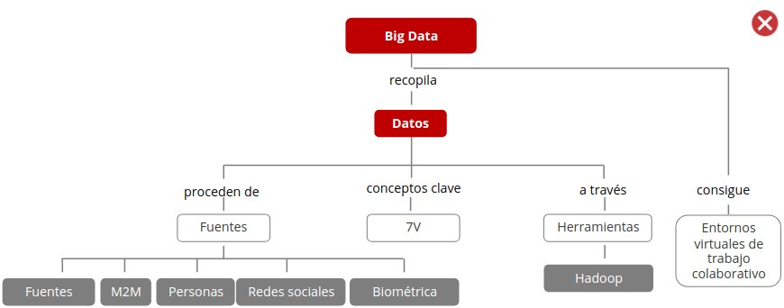
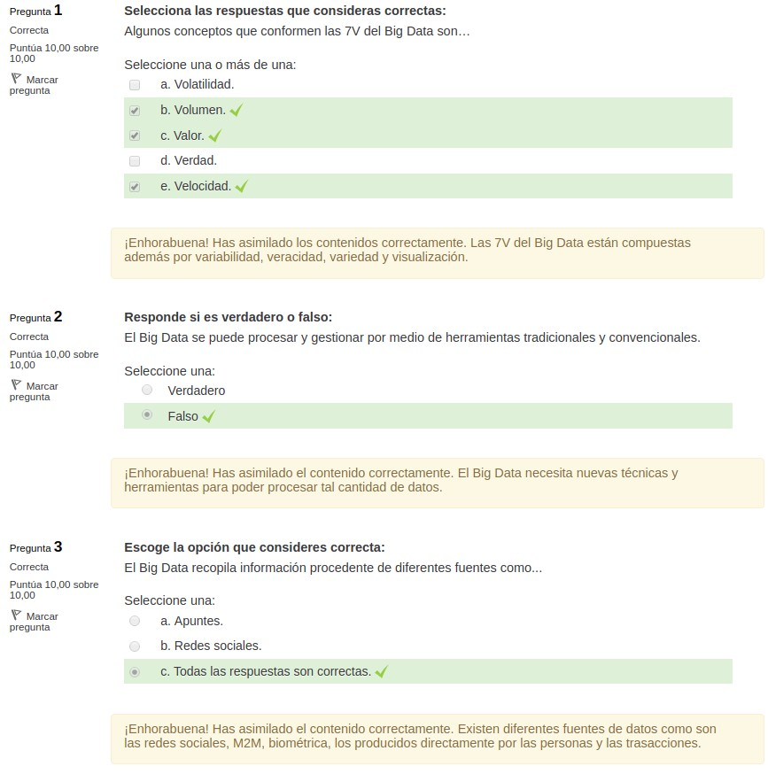
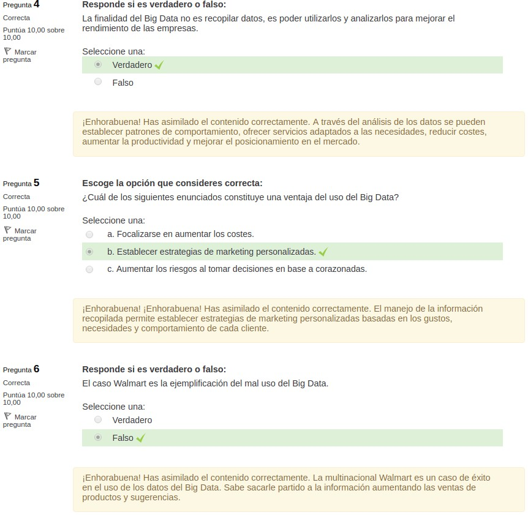
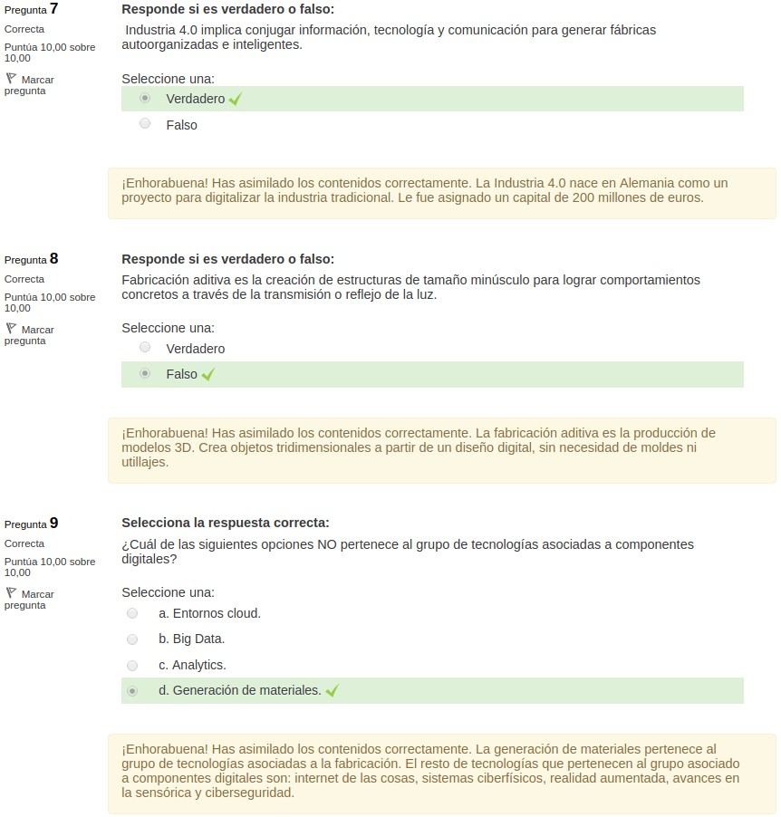
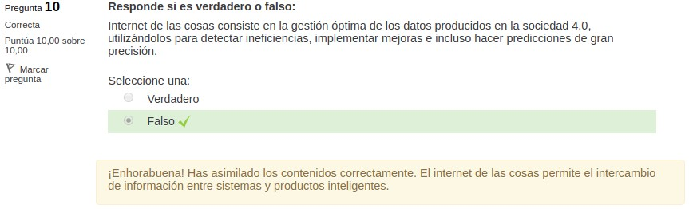

4.9. Sistemas Big Data
======================

**Big Data** es una gran cantidad de datos almacenados, procedentes de diversas fuentes. Estos datos son tratados y analizados por herramientas que los transforman en información útil y conocimiento.

Basar la **toma de decisiones** en el conocimiento, repercute positivamente en toda la entidad. 

Se exponen **ejemplos** de algunos sectores en los que el uso del Big Data ha transformado su visión y orientación de negocio. Destaca el caso de la multinacional Walmart que es un claro ejemplo de los beneficios que pueden aportar el buen uso de la información. 

1. Introducción al Big Data
***************************

En la actualidad las personas reciben mucha información diariamente por múltiples canales y **se generan datos a un ritmo abismal**.

Esta situación ha cambiado el paradigma de la sociedad y de la economía, ahora los datos y la información son el **centro de toda acción**. Pero... ¿A dónde van todo esos datos?, ¿qué proporcionan para ser el centro? 

.. note:: **Big data** es un gran volumen de datos que no se pueden procesar por medio de herramientas tradicionales y convencionales. 

Se necesitan nuevas técnicas y herramientas para analizar y **gestionar** esa cantidad de datos, generados por las estructuras modernas, y así poder crear conocimiento a partir de ellos. 

El Big Data (BD) como **disciplina** constituye todas las actividades que está conectadas a los sistemas que procesas datos de forma masiva para almacenarlos, analizarlos y comprenderlos. 

Para sacarle partido al Big Data se debe logar diferenciar entre la **información válida** y la que no aporta beneficios a la empresa. 

Si se usa de forma adecuada, puede ofrecer nuevas fuentes de información para **facilitar la toma de decisiones** en base la conocimiento adquirido, progresando y encontrando nuevas oportunidades de negocio. 

Esto lleva a que las empresas busquen las **herramientas adecuadas** para poder procesar los datos y aprovechar los beneficios del Big Data. 

El Big Data se caracteriza por las **7 V** que son: 

- **Volumen**: Todos los días millones de personas dejan una huella digital en los servicios que utilizan. Todo ello genera una cantidad de datos enorme que posteriormente se procesaran para traducirlo en información. La capacidad de almacenamiento ha pasado de megabytes a gigabytes y actualmente se habla de petabytes (equivale a 10 elevado a 15 bytes). 
- **Velocidad**:  El tiempo es un bien cada vez más preciado, por lo que una respuesta rápida generará mayores beneficios. Las herramientas de Big Data debe ser capaces de tratar esos datos a una velocidad alta para ofrecer soluciones inmediatas. 
- **Variedad**: Datos de formularios de contacto, interacciones en redes sociales, transacciones en línea, compras online, etc. El Big Data recopila infinita variedad de datos, lo que dificulta su tratamiento y clasificación. 
- **Valor**: Es el provecho y ganancias que la empresa puede sacar por el buen manejo de los datos. La información y el conocimiento proporcionan ventajas competitivas. 
- **Visualización**: Sin una visualización adecuada de los datos, no se pueden llegar a comprender y sacarle rendimiento. La forma en que se muestra la información es clave para su interpretación. Mediante gráficas, informes visuales y directos, etc. 
- **Veracidad**: La información debe estar relacionada con el problema al que se está buscando solución y debe ser veraz para obtener información fiable y de calidad. 
- **Variabilidad**: Un mismo comportamiento puede deberse a distintas causas y puede repetirse en diferentes momentos y tener diferentes significados. Se necesita comprender el entorno para poder descifrar el significado, más allá de la simple observación de los datos. 

2. Entendiendo Big Data: Estructura y técnica
*********************************************

La **procedencia de los datos** en el Big Data viene de diferentes fuentes: 

- **Generados por las personas**: Hoy en día las personas producen gran cantidad de datos a través de softwares de mensajería. Estos datos se aprovechan para generar conocimiento. Se trata de grabaciones de call centers, vídeos, mensajería de voz y texto, etc. 
- **Transacciones digitales**: Los datos transaccionales provienen de departamentos de facturación y centros de llamadas que registran las transacciones que se realizan. 
- **Biométrica**: Se trata de la tecnología que permite la identificación de una persona a través de sus características físicas o elementos como la voz (reconocimiento facial y genético) . Está muy extendido en el mundo de la inteligencia y seguridad. 
- **Redes sociales**: Son los más utilizados en la actualidad. Se originan en la red: publicaciones en las redes sociales, historiales de búsquedas, correos electrónicos y contenidos de páginas web. Proporcionan información sobre el cliente, sus hábitos de consumo, sus gustos, las tendencias, la localización, etc. 
- **M2M (Machine to Machine)**: El internet de las cosas permite la conexión entre dispositivos y tecnología. Es decir, diferentes objetos pueden comunicarse entre sí y transforman los valores recogidos en información como peso, altura, temperatura, etc. 
 
2.1. Hadoop
+++++++++++

**Hadoop** es un software de licencia libre que ofrece un marco para procesar y almacenar grandes cantidades de datos. 

Las **características** de esta herramienta son:

- **Confiable**, realiza copias de seguridad de toda la información y se puede recuperar en caso de fallo. 
- Ofrece una gran capacidad de almacenamiento de información a **bajo coste**. 
- Su **estructura es libre** y gratuita. 
- **Escalabilidad**, el sistema puede hacerse más grande fácilmente. 
- **Rapidez** de análisis de los datos. 

3. Entendiendo Big Data: Aplicación
***********************************

**Ventajas de usar Big Data** en las empresas:

- Implementar estrategias de marketing focalizadas, eficaces y eficientes. 
- Monitorear la calidad del servicio y la satisfacción de los clientes. 
- Ayuda en auditorías y a cumplir las normativas. 
- Conocer al cliente permite mejorar el servicio ofertado. 
- Minimizar los riesgos al basar las decisiones en información veraz y actual. 

Se puede sacar beneficio de los datos si la entidad es capaz de saber **cómo y cuándo recopilar la información** generada por los clientes. Tratar la información es fundamental para no perder tiempo ni oportunidades. 

A partir de los datos se consigue información útil y esta se transforma en **conocimientos** para detectar nuevas oportunidades de negocio.

Los datos del Big Data **se utilizan para**: 

- Ayudar a la **toma de decisiones** basadas en conocimiento y no en instintos o corazonadas. 
- Detectar **nuevas oportunidades de negocio** y tener un mejor posicionamiento en el mercado. 
- **Mejorar el rendimiento** de la empresa estableciendo estrategias empresariales basadas en la información. 

La finalidad no es recopilar datos, es poder tratarlos y analizarlos para **mejorar el rendimiento** de las empresas. Esto **permite lograr**: 

- Establecer patrones de comportamiento de los clientes.
- Crear nuevos servicios adaptados las necesidades detectadas.
- Reducir costes.
- Incrementar productividad poder enfocarse en una dirección concreta.
- Mejorar posición en el mercada. 

Existen multitud de ejemplos en el uso de Big data en **sectores como**: 

- **Telefonía**: Hoy en día la mayor parte de la población tiene un teléfono móvil e interactúa con él todos los días. Esto genera información a cerca de las costumbres, los gustos, la localización, llamadas, y demás información que permite analizar el comportamiento del cliente.
- **Agricultura**: Se recopila información sobre los cultivos, el suelo, los productos utilizados, el clima y demás para poder realizar predicciones y optimizar el uso de los recursos.
- **Banca**: La aplicación del Big Data a la sector financiero ha supuesto una revolución digital. Se recopila información sobre los productos que el cliente busca, sus hábitos de compra, sus capacidades económicas, etc. Todo eso se analiza y permite crear nuevas oportunidades de negocio adaptadas a cada cliente y experiencias personalizadas. 
- **Sanidad**: Permite analizar los datos de los pacientes y su historial médico. Así se puede predecir enfermedades, detectar las más reincidentes, las horas pico para gestionar el personal, el material que más se usa, etc. Todo ello repercute en un mejor servicio de salud. 
- **Compañías eléctricas**: Permite recopilar información a cerca del uso del servicio, las tarifas, etc. Lo que permite segmentar la población, detectar posibles fraudes, anticiparse a la demanda y ser más eficientes en el servicio. 
- **Grandes almacenes**: El sector de los grandes almacenes aprovecha el Big Data para realizar análisis sobre cuestiones internas. Los productos más vendidos, qué tendencias hay en el mercado, el nivel de satisfacción de los clientes... Esto mejorar el rendimiento y su posición en el mercado. 

Una de las mejores aplicaciones con éxito del Big Data la ha realizado **Walmart**. Ha sabido sacarle mucho partido al uso de los datos e información de sus clientes. Algunos ejemplos de la **aplicación del Big Data** por parte de Walmart: 

- Conectaba las interacciones en las redes sociales con los cumpleaños y amigos ofreciendo una idea de regalo. Si una persona escribía en Twitter que le gustaba algo nuevo, y su fecha de cumpleaños era cercana, Walmart avisaba a un amigo/a de ese tuit y le **sugería la compra** de ese artículo. Es la aplicación práctica del procesamiento de las redes sociales para establecer **estrategias de marketing personalizadas**. 
- También relacionó la venta de unos pasteles con la época de huracanes. Para sacarle provecho se colocaron las cajas de los pasteles en las entradas de las tiendas y asi **aumentaron las ventas** del producto. 

4. Entornos virtuales de trabajo colaborativo
*********************************************

La puesta en marcha de la **Industria 4.0** implica conjugar información, tecnología y comunicación para generar **fábricas autoorganizadas e inteligentes** que contemplen entornos de trabajo colaborativos utilizando distintas tecnologías. 

.. note:: Las **tecnologías clave facilitadoras (Key Enabling Technologies, KET)** son el conjunto de tecnologías y herramientas que posibilitan la transformación de la industria hacia el modelo 4.0. Se anuncian como los cimientos sobre los cuales se construirá este nuevo panorama enfocado en la búsqueda de fábricas inteligentes. 

Las tecnologías clave facilitadoras son también llamadas facilitadoras tecnológicas o habilitadoras digitales y se dividen en **dos grupos básicos relacionados con**: 

- Fabricación. 
- Componentes digitales. 

Las **tecnologías clave facilitadoras ligadas al proceso productivo** son: 

- **Fabricación aditiva**: Es la producción de modelos 3D. Se basa en la solidificación por capas del material base. Crea objetos tridimensionales a partir de un diseño digital, sin necesidad de moldes ni utillaje. 
- **Robótica colaborativa**: Persigue la operatividad de robots cada vez más autónomos. Con el tiempo, deberían adquirir la capacidad de interactuar con personas y entre ellos sin necesidad de supervisión humana. 
- **Nanofabricación**: Busca crear estructuras de tamaño minúsculo para lograr comportamientos concretos a través de la transmisión o reflejo de la 
- **Generación de materiales**: Materiales compuestos homogéneos en lo macroscópico pero no combinables en lo microscópico, con la capacidad de rendir a un nivel superior debido a las propiedades de cada componente. 
- **Mecanizado de alta velocidad**: Permite mecanizar materiales y figuras que anteriormente no eran usados para la fabricación. Para ello, utiliza una tecnología de corte con bases sólidas. 

Las **tecnologías 4.0 asociadas con componentes digitales** son: 

- **Entornos Cloud**: Se trata de un servicio que posibilita la optimización de recursos sin la obligación de invertir más en infraestructura. Se utiliza en el tratamiento de la información. El cliente puede acceder a los datos cuando lo desee mediante internet, pues estos se encuentran en la nube. El proveedor del servicio de "cloud computing' puede encontrarse en cualquier lugar. Entornos Cloud Big Data Analytics Internet de las cosas Sistemas ciberfísicos Realidad aumentada Avances en sensorica Ciberseguridad 
- **Big Data**: Consiste en la gestión óptima de los datos producidos en la sociedad 4.0, utilizándolos para detectar ineficiencias, mejoras e incluso predicciones futuras de gran precisión. Se usa frecuentemente dado el creciente tráfico de datos que se da e la sociedad 4.0. 
- **Analytics**: Esta tecnología apoya la toma de decisiones de negocio en base a modelos matemáticos y datos organizativos externos. Las versiones más punteras cuentan con modelos estadísticos que incorporan técnicas de inteligencia artificial , por lo tanto, pueden llegar a aprender por su cuenta. 
- **Internet de las cosas**: Permite el intercambio de información entre sistemas y productos inteligentes. 
- **Sistemas ciberfísicos**: Son dispositivos dotados con inteligencia y autonomía gracias a tecnologías informáticas y de la comunicación. El objetivo es hacerlos cada vez más eficientes. Suelen usarse en medios como la industria, los dispositivos personales y los hospitales, la domótica, los transportes y vehículos. La tendencia es ir hacia el reputado modelo de la ciudad inteligente. 
- **Realidad aumentada**: Genera elementos virtuales mediante un dispositivo que los combina con la visión real. Actualmente destaca en el sector del ocio. Se espera hacer uso de esta tecnología para crear simulaciones y que pueda ser utilizada como apoyo tutorial para cierto tipo de reparaciones. 
- **Avances en sensórica**: Este tipo de tecnología posibilita la detección de estados y variaciones de las características químicas o físicas de un entorno. Se ha aplicado en productos inteligentes como gafas o wearables (accesorios o prendas con microprocesador incorporado). 
- **Ciberseguridad**: Se trata de un aspecto fundamental, dado el aumento de la conectividad y el uso de protocolos de comunicación estándar. Se deben proteger los sistemas industriales críticos y las lineas de fabricación de las innumerables amenazas que están surgiendo en este terreno. Se requieren comunicaciones fiables y seguras, además de sistemas de gestión de identidades y acceso a los usuarios y a las maquinas. 

4.1. Fábricas inteligentes
++++++++++++++++++++++++++

.. note:: La **fábrica inteligente** consiste en conectar los procesos productivos borrando sus límites. Es un espacio dinámico, flexible, que se adapta a las necesidades y responde de forma rápida y eficaz. Optimiza los recursos y las capacidades al recopilar información a tiempo real sobre demandas, y así poder reconfigurar las cadenas de suministros. 

Las **características** de las fábricas inteligentes son: 

- **Flexibilidad**: posibilidad de producción personalizada.
- **Reconfigurabilidad**: Adaptación a los cambios de tendencias, piezas y productos rápidamente. 
- **Digitalización de los procesos**: Se produce una integración horizontal y vertical de proceso productivo. Todo está conectado: fabricación, demanda, diseño y suministro. 
- **Smartización**: Integración de procesos y medios correspondientes al modelo inteligente 4.0. 

Para saber si una industria es inteligente se deben analizar los **ejes centrales** que son :

- Diseño 
- Fabricación 
- Logística 
- Distribución 
- Venta 

En la fábrica 4.0 todas las **operaciones comerciales** están conectadas y se gestionan grandes volúmenes de información para poder aumentar al productividad, la sostenibilidad y el rendimiento. 

La fábrica 4.0 se caracteriza por conectar a las personas, máquinas y activos. Los **activos** se convierten en medios que proporcionan información y favorecen los medios de fabricación al conectarse con las personas. Los **sensores** ayudan a captar esta información, de aquí la importancia de desarrollar e implantar estos dispositivos en las fábricas. 

**Elementos de una fábrica 4.0**: 

- Gestión y planificación global. 
- Departamento de investigación y desarrollo. 
- Robótica. 
- Logística 4.0. 
- Servicios inteligentes. 
- Materiales avanzados. 
- Analítica de datos. 
- Internet de las cosas. 
- Ciberseguridad. 
- Entornos cloud. 
- Sensores y redes inteligentes. 
- Tecnología inalámbrica. 

5. Resumen
**********

- El **Big Data** es una gran colección de datos que no se pueden procesar por medio de herramientas tradicionales. 
- Los conceptos clave del Big Data se pueden resumir en las **7V**: velocidad, variedad, variabilidad, valor, veracidad y visualización. 
- Los datos proceden de diversas **fuentes de información**. 
- **Hadoop** como herramienta para el análisis y procesamiento de grandes cantidades de datos e información. 
- La **aplicación del Big Data en diferentes sectores** y en concreto en la multinacional Walmart como ejemplo de las ventajas competitivas que representa. 
- La **base** para el modelo de fábrica inteligente son las funciones de gestión, comunicación y vínculo entre el mundo físico y el digital. 

6. Actividades
**************

